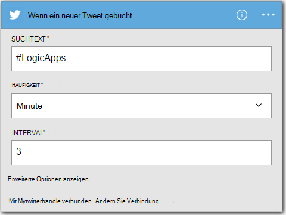
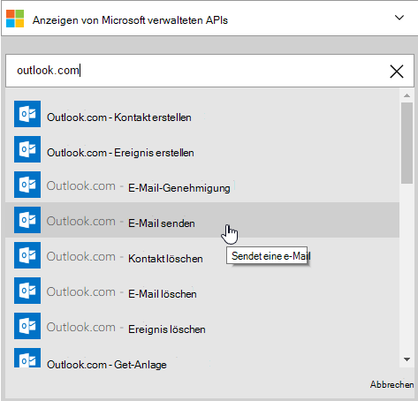
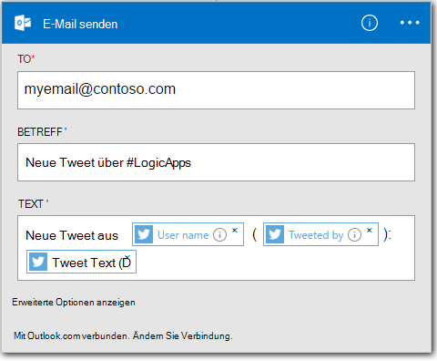

<properties
    pageTitle="Erstellen einer Logik | Microsoft Azure"
    description="Informationen Sie zum Erstellen einer Logik App SaaS-Diensten verbinden"
    authors="jeffhollan"
    manager="dwrede"
    editor=""
    services="logic-apps"
    documentationCenter=""/>

<tags
    ms.service="logic-apps"
    ms.workload="na"
    ms.tgt_pltfrm="na"
    ms.devlang="na"
    ms.topic="get-started-article"
    ms.date="10/18/2016"
    ms.author="jehollan"/>

# Erstellen einer neuen Logik SaaS-Diensten verbinden

Dieses Thema veranschaulicht, wie in nur wenigen Minuten Sie [Azure Logik](app-service-logic-what-are-logic-apps.md)Apps loslegen können. Wir gehen über ein einfacher Workflow, mit dem Sie interessante Tweets per e-Mail senden können.

Um dieses Szenario zu verwenden, müssen wie folgt vor:

- Ein Azure-Abonnement
- Twitter-Konto
- Ein Outlook.com oder gehosteten Office 365-Postfach

## Erstellen einer neuen Logik Tweets e-Mail

1. Wählen Sie [Azure Portal Dashboard](https://portal.azure.com) **neu**. 
2. In der Suchleiste "Logik app suchen Sie und wählen Sie **Logik-App**. Sie können auch wählen Sie **New** **Web + Mobile**und **Logik-App**. 
3. Geben Sie einen Namen für Ihre Logik, wählen Sie einen Speicherort, Ressourcengruppe und **Erstellen**.  Wenn Sie **Pin Dashboard** auswählen öffnet Logik app einmal bereitgestellt.  
4. Nach dem Öffnen der Anwendung Logik zum ersten Mal können Sie eine Vorlage auswählen, zu.  Klicken Sie jetzt auf **Leere Logik App** dabei völlig. 
1. Das erste Element, das Sie erstellen müssen, ist der Auslöser.  Dies ist das Ereignis, das Ihre Logik app gestartet wird.  Im Suchfeld Trigger **twitter** suchen und auswählen.
7. Jetzt geben Sie einen Suchbegriff auslösen.  Wie oft Ihre app Logik für neue Tweets (und alle Tweets während dieser Zeit Spanne zurück) überprüft bestimmt die **Häufigkeit** und das **Intervall** .
    

5. Klicken Sie **neuen Schritt** und dann **eine Aktion** **Hinzufügen** oder eine Bedingung
6. Wenn Sie **eine Aktion hinzufügen**auswählen, können Sie [Verfügbare Anschlüsse](../connectors/apis-list.md) zum Auswählen einer Aktion suchen. Sie können z. B. **Outlook.com - E-Mail senden** von e-Mail von einer outlook.com auswählen:  
    

7. Jetzt haben Sie die Parameter für die e-Mail ausfüllen soll:  

8. Schließlich können Sie auswählen, Logik-app zu **Speichern** live.

## Verwalten Sie Ihre Anwendung Logik nach der Erstellung

Nachdem Ihre Anwendung Logik ausgeführt wird. Es regelmäßig TWEETS Suchbegriff eingegeben. Beim Auffinden eines übereinstimmenden TWEETS senden sie Sie. Schließlich Sie finden Sie in der Anwendung deaktivieren oder überprüfen ist.

1. Zum [Azure-Portal](https://portal.azure.com)

1. Klicken Sie auf **Durchsuchen** , auf der linken Seite des Bildschirms und wählen Sie **Logik Apps**.

2. Klicken Sie auf die neue Logik-app, die Sie gerade erstellt haben, aktuellen Status und allgemeine Informationen.

3. Klicken Sie die neue Logik-app **Bearbeiten**.

5. Um die Anwendung zu deaktivieren, klicken Sie auf **Deaktivieren** in der Befehlszeile.

1. Hier ausführen und Trigger Geschichten zu überwachen, wenn Ihre Anwendung Logik ausgeführt wird.  Klicken Sie auf **Aktualisieren** , um die neuesten Daten anzuzeigen.

In 5 Minuten konnten Sie eine einfache Logik-app in der Cloud einrichten. Mehr über Logik Apps Features finden Sie unter [Logik app Funktionen]. Über die Logik App Definitionen selbst finden Sie unter [Logik App Definitionen erstellen](app-service-logic-author-definitions.md).

<!-- Shared links -->
[Azure portal]: https://portal.azure.com
[Logik app Funktionen]: app-service-logic-create-a-logic-app.md
