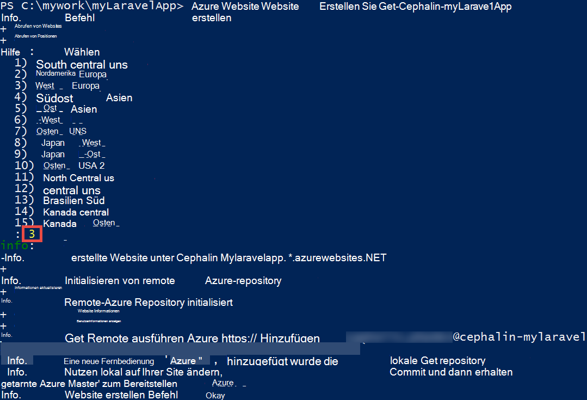
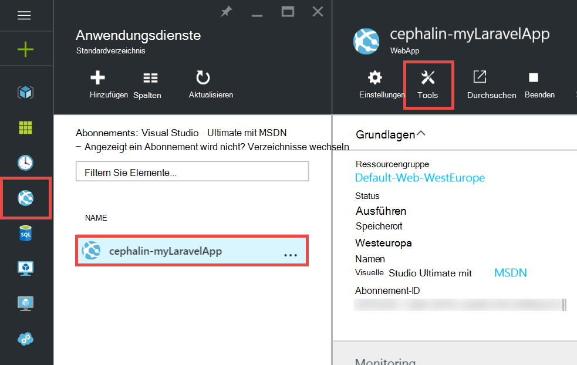
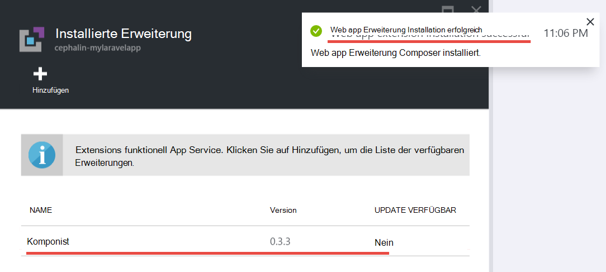
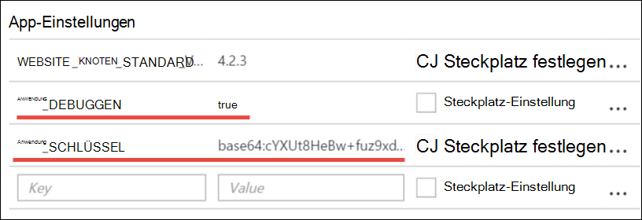
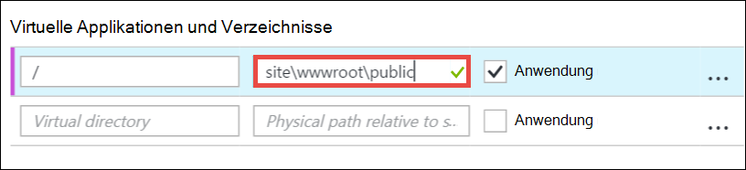

<properties
    pageTitle="Erstellen, konfigurieren und Bereitstellen von PHP Web app in Azure"
    description="Ein Tutorial zeigt, wie PHP (Laravel) Web app in Azure App Service ausgeführt werden soll. Informationen Sie zum Konfigurieren von Azure App Service Framework PHP Anforderungen gewählten."
    services="app-service\web"
    documentationCenter="php"
    authors="cephalin"
    manager="wpickett"
    editor=""
    tags="mysql"/>

<tags
    ms.service="app-service-web"
    ms.workload="web"
    ms.tgt_pltfrm="na"
    ms.devlang="PHP"
    ms.topic="article"
    ms.date="06/03/2016" 
    ms.author="cephalin"/>

# Erstellen, konfigurieren und Bereitstellen von PHP Web app in Azure

[AZURE.INCLUDE [tabs](../../includes/app-service-web-get-started-nav-tabs.md)]

Dieses Lernprogramm zeigt Ihnen, wie erstellen, konfigurieren und Bereitstellen von PHP Web app für Azure und Azure App Service Ihrer Anwendung PHP Anforderungen konfigurieren. Ende der praktischen Einführung haben Sie eine funktionierende [Laravel](https://www.laravel.com/) Web app im [Azure App Service](../app-service/app-service-value-prop-what-is.md)ausgeführt.

PHP-Entwickler bringen Sie Ihre bevorzugten PHP-Framework in Azure. Diese praktische Einführung verwendet Laravel als eine konkrete app-Beispiel. Lernen Sie Folgendes: 

- Bereitstellung mit Git
- PHP Version festlegen
- Verwenden einer Startdatei, die nicht im Stammverzeichnis der Anwendung
- Access-Umgebung bestimmte Variablen
- Aktualisieren Sie Ihre Anwendung in Azure

Sie können anwenden, was Sie hier andere PHP Web Apps kennen, die in Azure bereitstellen.

>[AZURE.INCLUDE [app-service-linux](../../includes/app-service-linux.md)] 

## Erforderliche Komponenten

- Installieren [PHP 5.6.x](http://php.net/downloads.php) (PHP 7-Unterstützung ist Beta)
- [Composer](https://getcomposer.org/download/) installieren
- [Azure CLI](../xplat-cli-install.md) installieren
- [Git](http://www.git-scm.com/downloads) installieren
- Microsoft Azure-Konto zu erhalten. Haben Sie ein Konto, können Sie [sich für eine kostenlose Testversion](/pricing/free-trial/?WT.mc_id=A261C142F) oder [die Visual Studio-Abonnementvorteile aktivieren](/pricing/member-offers/msdn-benefits-details/?WT.mc_id=A261C142F).

>[AZURE.NOTE] Eine Webanwendung in Aktion zu sehen. [App-Dienst versuchen](http://go.microsoft.com/fwlink/?LinkId=523751) sofort und erstellen eine kurzlebige Starter – keine Kreditkarte, keine Zusagen.

## Erstellen Sie PHP (Laravel)-Anwendung auf Ihrem Entwicklungscomputer

1. Öffnen Sie eine neue Befehlszeile von Windows PowerShell-Fenster, Linux Shell oder OS X Terminal. Führen Sie die folgenden Befehle, um sicherzustellen, dass die erforderlichen Tools auf Ihrem Computer installiert sind. 

        php --version
        composer --version
        azure --version
        git --version

    

    Wenn Sie die Tools installiert haben, finden Sie unter [Komponenten](#Prerequisites) herunterzuladen.
    
2. Installieren Laravel wie folgt:

        composer global require "laravel/installer

3. `CD`in einem Verzeichnis und erstellen Sie eine neue Laravel-Anwendung wie folgt:

        cd <working_directory>
        laravel new <app_name>

4. `CD`in neu erstellten `<app_name>` Verzeichnis und Testen der Anwendung wie folgt:

        cd <app_name>
        php artisan serve
        
    Sie sollen Navigieren zu http://localhost: 8000 in einem Browser und Laravel Splash-Bildschirm angezeigt.
    
    
    
So möchten, nur den regulären Laravel Workflow und nicht <a href="https://laravel.com/docs/5.2" rel="nofollow">Laravel lernen</a>. So gehen.

## Erstellen Sie Azure Web app und richten Sie der Git Bereitstellung ein

>[AZURE.NOTE] "Warten Sie! Was passiert, wenn ich mit FTP bereitstellen möchten?" Gibt ein [FTP-Lernprogramm](web-sites-php-mysql-deploy-use-ftp.md) für Ihre Bedürfnisse. 

Mit der CLI Azure können erstellen eine Webanwendung in Azure App Service und Git Bereitstellung mit einem einzelnen Befehl eingerichtet. Lassen Sie uns dies.

1. ASM-Modus ändern und Azure anmelden:

        azure config mode asm
        azure login
    
    Führen Sie den Hilfetext den Anmeldevorgang fort.
    
    

4. Führen Sie den Befehl Azure Web app Git Bereitstellung erstellen. Geben Sie bei Aufforderung die Anzahl der gewünschten Region.

        azure site create --git <app_name>
    
    
    
    >[AZURE.NOTE] Wenn Sie nie Bereitstellung Anmeldeinformationen für Ihre Azure-Abonnement festgelegt haben, werden Sie aufgefordert zu erstellen. Diese Anmeldeinformationen nicht Ihre Azure-Konto-Anmeldeinformationen werden vom App-Dienst Git Bereitstellung und FTP-Benutzernamen verwendet. 
    
    Dieser Befehl erstellt ein neues Git Repository auf das aktuelle Verzeichnis (mit `git init`) und eine Verbindung zum Repository in Azure als Fernbedienung Git (mit `git remote add`).

<a name="configure"/>
## Konfigurieren der Azure-Web app

Für Ihre Laravel in Azure arbeiten müssen Sie einige Dinge beachten. Dabei ähnliche führen Sie für Ihre PHP-Framework Wahl.

- Konfigurieren von PHP 5.5.9 oder höher. Die gesamte Liste der Anforderungen finden Sie unter [Laravel 5.2 Server Erfordernissen](https://laravel.com/docs/5.2#server-requirements) . Der Rest der Liste werden Erweiterungen bereits von Azure PHP-Installationen aktiviert werden. 
- Legen Sie den Umgebungsvariablen Ihre app muss. Laravel verwendet das `.env` Datei einfach Festlegen von Umgebungsvariablen. Da sie soll nicht in Datenquellen-Steuerelement übergeben werden (siehe [Laravel Umgebungskonfiguration](https://laravel.com/docs/5.2/configuration#environment-configuration)Appeinstellungen der Azure-Web app wird stattdessen festgelegt.
- Sicherstellen, dass die Laravel Anwendung Einstiegspunkt `public/index.php`, zuerst geladen wird. Übersicht [Laravel Lebenszyklus](https://laravel.com/docs/5.2/lifecycle#lifecycle-overview). Mit anderen Worten müssen Web app Root URL auf dem `public` Verzeichnis.
- Aktivieren Sie Composer Erweiterung in Azure, da Sie eine composer.json haben. So lassen Sie Composer sorgen die erforderlichen Pakete erhalten, bei der Bereitstellung mit `git push`. Es ist eine Annehmlichkeit. Composer Automatisierung aktivieren nicht nur müssen Sie entfernen `/vendor` aus der `.gitignore` Datei, Git enthält ("un-ignoriert") alles in die `vendor` Verzeichnis beim Commit und Code bereitstellen.

Diese Aufgaben konfigurieren wir sequenziell.

4. Legen Sie die PHP-Version Ihrer Anwendung Laravel erfordert.

        azure site set --php-version 5.6

    Sie setzen die PHP-Version. 
    
4. Eine neue `APP_KEY` für Ihre Azure web app und als Einstellung für Ihre Azure Web app festgelegt.

        php artisan key:generate --show
        azure site appsetting add APP_KEY="<output_of_php_artisan_key:generate_--show>"

4. Aktivieren Sie auch Laravel Debuggen, um alle unverständliche trennen `Whoops, looks like something went wrong.` Seite.

        azure site appsetting add APP_DEBUG=true

    Festlegen von Umgebungsvariablen ist fertig!
    
    >[AZURE.NOTE] Warten Sie, wir etwas langsamer und erläutern, was Laravel und was Azure hier. Laravel verwendet das `.env` Datei im Stammverzeichnis Umgebungsvariablen die Anwendung bereitstellen, Sie die Zeile finden `APP_DEBUG=true` (und `APP_KEY=...`). Diese Variable erfolgt `config/app.php` durch den Code     `'debug' => env('APP_DEBUG', false),`. [env()](https://laravel.com/docs/5.2/helpers#method-env) ist eine Laravel, die PHP- [getenv()](http://php.net/manual/en/function.getenv.php) im Hintergrund verwendet.
    >
    >Allerdings `.env` von Git ignoriert, da es von aufgerufen wird der `.gitignore` -Datei im Stammverzeichnis. Einfach gesagt, `.env`  
 lokale Git Repository wird nicht verschoben, Azure mit den restlichen Dateien. Natürlich nur entnehmen Sie diese Zeile aus `.gitignore`, aber wir haben bereits festgestellt, dass diese Datei in Datenquellen-Steuerelement übergeben wird nicht empfohlen. Jedoch brauchen Sie diese Umgebungsvariablen in Azure angeben. 
    >
    >Die gute Nachricht ist, dass app-Einstellungen in Azure App Service unterstützt [getenv()](http://php.net/manual/en/function.getenv.php)  
 in PHP. Während Sie FTP oder anderweitig verwenden können manuell Hochladen einer `.env` Datei in Azure Sie nur können Sie die gewünschten Variablen wie Azure-Anwendung ohne ein `.env` in Azure, wie einfach. Darüber hinaus ist eine Variable sowohl eine `.env` Datei und Azure-Anwendungseinstellungen die Einstellung Azure-Anwendung gewinnt.     

4. Die letzten beiden Aufgaben (das virtuelle Verzeichnis und Composer aktivieren) erfordert [Azure-Portal](https://portal.azure.com), also das [Portal](https://portal.azure.com) mit der Azure-Konto anmelden.

4. Menü links beginnend **Anwendungsdienste**klicken Sie auf > **&lt;Anwendungsname >** > **Tools**.

    
    
    >[AZURE.TIP] Wenn **Einstellungen** statt **Tools**klicken, werden Sie auf **Application Settings**  
 Blade kann PHP-Versionen, app-Einstellungen festgelegt und virtuelle Verzeichnisse wie eben. 
    
4. Klicken Sie auf **Erweiterung** > **Hinzufügen** , um eine Erweiterung hinzuzufügen.

4. Wählen Sie **Composer** **Wählen Erweiterung** [Blade](../azure-portal-overview.md) (*Blade*: eine horizontal öffnet Portalseite).

4. **Vertragsbedingungen akzeptieren** Blade klicken Sie auf **OK** . 

5. Das Blade **Erweiterung hinzufügen** klicken Sie auf **OK** .

    Azure erfolgt beim Hinzufügen der Erweiterung, müsste eine Popup-Meldung in der Ecke und  **Composer** **Extensions** Blatt aufgeführt.

    

    Aktivieren Composer fertig!
    
4. **Klicken Sie in Ihrem Web app Blade** > **Application Settings**.

    

    Beachten Sie das Blade **Application Settings** die PHP-Version, die Sie zuvor festgelegt:

    

    und die Appeinstellungen hinzugefügt:
    
    

4. Am Ende des Blatts und ändern das virtuelle Stammverzeichnis auf **Site\wwwroot\public** statt **Site\wwwroot**.

    

4. Klicken Sie am oberen Rand der Blade **Speichern** .

    Sie das virtuelle Verzeichnis. 

## Bereitstellen Sie Ihrer Anwendung mit Git (Umgebungsvariable)

Sie können nun Code bereitstellen. Sie tun dies im Eingabeaufforderungsfenster oder Terminal.

4. Commit der Änderung und Code zu Azure Web app bereitstellen, wie in einem Git Repository:

        git add .
        git commit -m "Hurray! My first commit for my Azure app!"
        git push azure master 

    Wenn `git push`, werden Sie aufgefordert das Git Bereitstellung Kennwort einzugeben. Falls Bereitstellung Anmeldeinformationen am `azure site create` , geben Sie das Kennwort, das Sie verwendet.
    
5. Wir sehen im Browser durch Ausführen dieses Befehls ausführen:

        azure site browse

    Ihr Browser sollte Laravel Splash-Bildschirm angezeigt werden.
    
    
    
    Herzlichen Glückwunsch, Sie sind jetzt Laravel Web app in Azure ausgeführt.
             
## Problembehandlung bei Fehlermeldungen

Hier sind einige der Fehler, die bei diesem Lernprogramm auftreten können:

- [Azure CLI zeigt "'Site' nicht Azure Befehl"](#clierror)
- [WebApp zeigt HTTP-Fehler 403](#http403)
- [WebApp zeigt "Hoppla, sieht etwas schief."](#whoops)
- [WebApp zeigt "Keine unterstützten Encryptor gefunden".](#encryptor)

### Azure CLI zeigt "'Site' nicht Azure Befehl"

Wenn `azure site *` in der Befehlszeile Terminal Fehlermeldung`error:   'site' is not an azure command. See 'azure help'.` 

Dies ist gewöhnlich das Ergebnis "ARM" (Azure Resource Manager) Modus wechseln. Um dieses Problem zu beheben, wechseln in "ASM" (Azure Service Management) Modus mit `azure config mode asm`.

### WebApp zeigt HTTP-Fehler 403

Sie haben Ihrer Anwendung erfolgreich in Azure bereitgestellt, werden jedoch beim Durchsuchen Ihrer Azure Web App ein `HTTP 403` oder`You do not have permission to view this directory or page.`

Dies ist wahrscheinlich weil Web app den Einstiegspunkt Laravel Anwendung finden kann. Stellen Sie sicher, dass das virtuelle Stammverzeichnis auf geändert haben `site\wwwroot\public`, wobei Laravels `index.php` (siehe [Konfigurieren der Azure-Web app](#configure)).

### WebApp zeigt "Hoppla, sieht etwas schief."

Sie haben Azure Ihrer Anwendung erfolgreich bereitgestellt, aber wenn Sie Ihre Azure Web app suchen, Sie kryptische Nachricht`Whoops, looks like something went wrong.`

Um eine aussagekräftigere Fehlermeldung Laravel Debuggen festlegen aktivieren `APP_DEBUG` -Umgebungsvariable `true` (siehe [Konfigurieren der Azure-Web app](#configure)).

### WebApp zeigt "Keine unterstützten Encryptor gefunden".

Sie haben Ihrer Anwendung erfolgreich in Azure bereitgestellt, aber beim Durchsuchen Ihrer Azure Web App erhalten Sie die folgende Fehlermeldung:

    
Böse Fehler ist, jedoch ist keine kryptische seit Laravel Debuggen aktiviert. Eine oberflächliche Suche die Fehlerzeichenfolge in den Foren Laravel zeigen Sie durch in der APP_KEY nicht festgelegt ist `.env`, oder in Ihrem Fall `.env` in Azure überhaupt. Sie können diese Einstellung hinzufügen beheben `APP_KEY` als eine Azure-Anwendung festlegen (siehe [Konfigurieren der Azure-Web app](#configure)).
    
## Nächste Schritte

Erfahren Sie, wie Ihre app durch [Erstellen einer MySQL-Datenbank in Azure](../store-php-create-mysql-database.md)Daten hinzu. Außerdem lernen Sie weitere nützliche Links PHP in Azure unten:

- [PHP-Entwicklercenter](/develop/php/).
- [Erstellen einer Webanwendung von Azure Marketplace](app-service-web-create-web-app-from-marketplace.md)
- [Konfigurieren von PHP in Azure App Service webapps](web-sites-php-configure.md)
- [Mehrere Standorte in Azure App Service WordPress konvertieren](web-sites-php-convert-wordpress-multisite.md)
- [Unternehmensklasse WordPress Azure App-Dienst](web-sites-php-enterprise-wordpress.md)
