<properties 
    pageTitle="Verwenden von Azure CDN in Azure App Service" 
    description="Ein Lernprogramm, in dem Web app auf Azure App Service bereitstellen, die Inhalte aus einem integrierten Azure CDN-Endpunkt unterstützt erklärt" 
    services="app-service\web,cdn" 
    documentationCenter=".net" 
    authors="cephalin" 
    manager="wpickett" 
    editor="jimbe"/>

<tags 
    ms.service="app-service" 
    ms.workload="tbd" 
    ms.tgt_pltfrm="na" 
    ms.devlang="dotnet" 
    ms.topic="article" 
    ms.date="07/01/2016" 
    ms.author="cephalin"/>


# <a name="use-azure-cdn-in-azure-app-service"></a>Verwenden von Azure CDN in Azure App Service

[App Service](http://go.microsoft.com/fwlink/?LinkId=529714) kann [Azure CDN](/services/cdn/)hinzufügen globalen Skalierung Funktionen bei [App Service Web Apps](http://go.microsoft.com/fwlink/?LinkId=529714) mit app Webinhalte weltweit von Serverknoten in der Nähe der Kunden integriert werden (eine aktualisierte Liste aller aktuellen Knotenpositionen finden Sie [hier](http://msdn.microsoft.com/library/azure/gg680302.aspx)). In Szenarien wie statische Bilder mit dieser Integration kann erhebliche Leistungssteigerung Azure App Service Web Apps und erheblich verbessert Web app Benutzer weltweit. 

Integration von Web Apps in Azure CDN bietet Ihnen folgende Vorteile:

- Integration von Content Deployment (Bilder, Skripts und Stylesheets) als Teil Ihrer Anwendung der [kontinuierlichen Bereitstellung](app-service-continuous-deployment.md)
- Upgrades in Ihrer Anwendung in Azure App Service Bootstrap Versionen oder jQuery NuGet-Pakete 
- Verwalten der Web-Anwendung und Ihrer Inhalte CDN bereitgestellt von der gleichen Visual Studio-Schnittstelle
- Azure CDN ASP.NET bündeln und Verkleinerung integriert

[AZURE.INCLUDE [app-service-web-to-api-and-mobile](../../includes/app-service-web-to-api-and-mobile.md)] 

## <a name="what-you-will-build"></a>Erstellen Sie ##

Sie Azure App Service mit dem ASP.NET MVC-Vorlage in Visual Studio eine Webanwendung bereitstellen, fügen Sie Code zum Inhalt einer integrierten Azure CDN wie ein Bild Aktionsergebnisse Controller und Standard JavaScript und CSS-Dateien dienen und auch Code schreiben, um Konfigurieren der Fallbackmechanismus für Pakete dass CDN offline ist.

## <a name="what-you-will-need"></a>Sie benötigen ##

Dieses Lernprogramm enthält die folgenden Komponenten:

-   Ein aktives [Microsoft Azure-Konto](/account/)
-   Visual Studio 2015 [Azure SDK für .NET](http://go.microsoft.com/fwlink/p/?linkid=323510&clcid=0x409). Wenn Sie Visual Studio verwenden, können die Schritte variieren.

> [AZURE.NOTE] Ein Azure-Konto zum Bearbeiten dieses Lernprogramms benötigen Sie:
> + Sie können [ein Azure-Konto frei](/pricing/free-trial/) - Sie erhalten ein Guthaben bezahlt Azure Services ausprobieren können und sogar nachdem sie verbraucht das Konto beibehalten mit kostenlosen Azure Services wie Web Apps.
> + Kann [Visual Studio Abonnementvorteile aktivieren](/pricing/member-offers/msdn-benefits-details/) - der Visual Studio-Abonnement bietet Ihnen Credits monatlich für bezahlte Azure Services verwendet werden können.
>
> Wenn Sie mit Azure App Service beginnen, bevor Sie sich für ein Azure-Konto, gehen Sie [Versuchen App Service](http://go.microsoft.com/fwlink/?LinkId=523751)sofort eine kurzlebige Starter Web app in App Service können Sie erstellen. Keine Kreditkarten erforderlich; keine Zusagen.

## <a name="deploy-a-web-app-to-azure-with-an-integrated-cdn-endpoint"></a>Bereitstellen einer Webanwendung in Azure mit einem integrierten CDN-Endpunkt ##

In diesem Abschnitt wird standardmäßig ASP.NET MVC-Anwendungsvorlage in Visual Studio 2015 App Service bereitstellen und Integration mit einem neuen CDN-Endpunkt. Wie folgt:

1. Visual Studio 2015 erstellen eine neue ASP.NET in der Menüleiste auf **Datei > Neu > Projekt > Web > ASP.NET Web Application**. Geben sie einen Namen, und klicken Sie auf **OK**.

    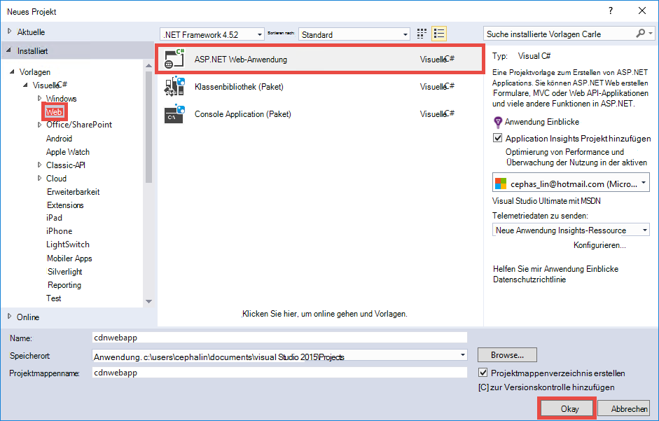

3. Wählen Sie **MVC** und auf **OK**.

    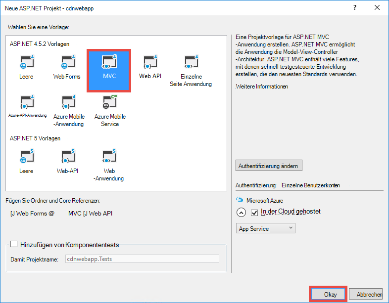

4. Falls Sie Ihre Azure-Konto noch angemeldet noch nicht, klicken Sie auf das Symbol in der oberen rechten Ecke und das Dialogfeld Azure-Konto anmelden. Sobald Sie fertig sind, konfigurieren Sie Ihre Anwendung wie folgt und dann auf **neu** , um einen neuen App Service-Plan für Ihre Anwendung erstellen.  

    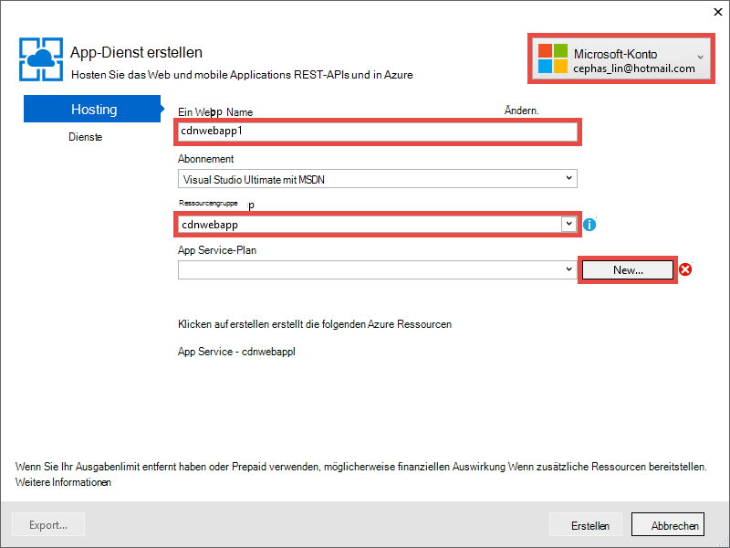

5. Konfigurieren Sie einen neuen App Service-Plan im Dialogfeld, wie unten dargestellt, und klicken Sie auf **OK**. 

    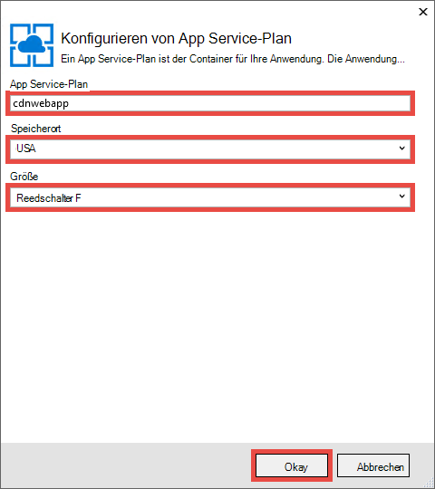

8. Klicken Sie auf **Create** Web app erstellen.

    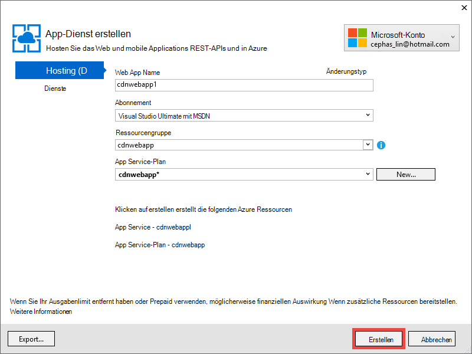

9. Nach Erstellung die Anwendung ASP.NET veröffentlichen Azure in Azure App Serviceaktivität Bereich durch Klicken auf **Veröffentlichen `<app name>` zu diesem Web App jetzt**. Klicken Sie auf **Veröffentlichen** , um den Vorgang abzuschließen.

    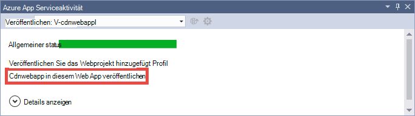

    Wenn die Veröffentlichung abgeschlossen ist, wird Sie Ihrer veröffentlichten Anwendung im Browser angezeigt. 

1. Erstellen Sie einen CDN-Endpunkt melden Sie [Azure-Portal](https://portal.azure.com). 
2. Klicken Sie auf **+ Neuer** > **Media + CDN** > **EUR**.

    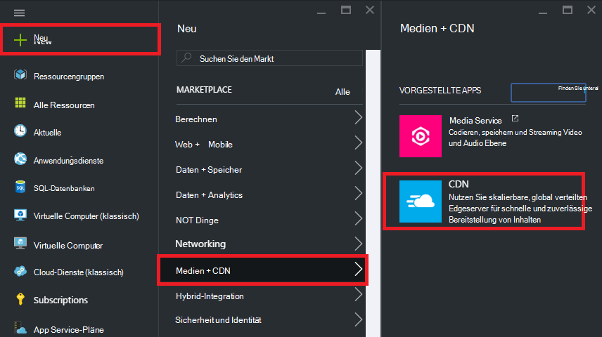

3. Geben Sie **CDN**, **Speicherort**, **Ressourcengruppe**, **Preisstufe**, und klicken Sie auf **Erstellen**

    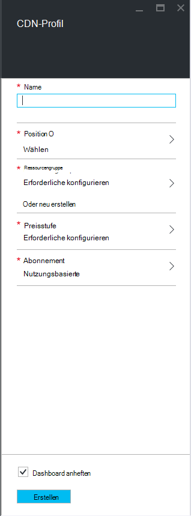   

4. **CDN Profil** Blade klicken Sie auf **+ Endpunkt** . Geben sie einen Namen, **Web App** in das Dropdownelement **Ursprungs** und Ihrer Anwendung in der Dropdownliste **Ursprung Hostname** , klicken Sie auf **Hinzufügen**.  

    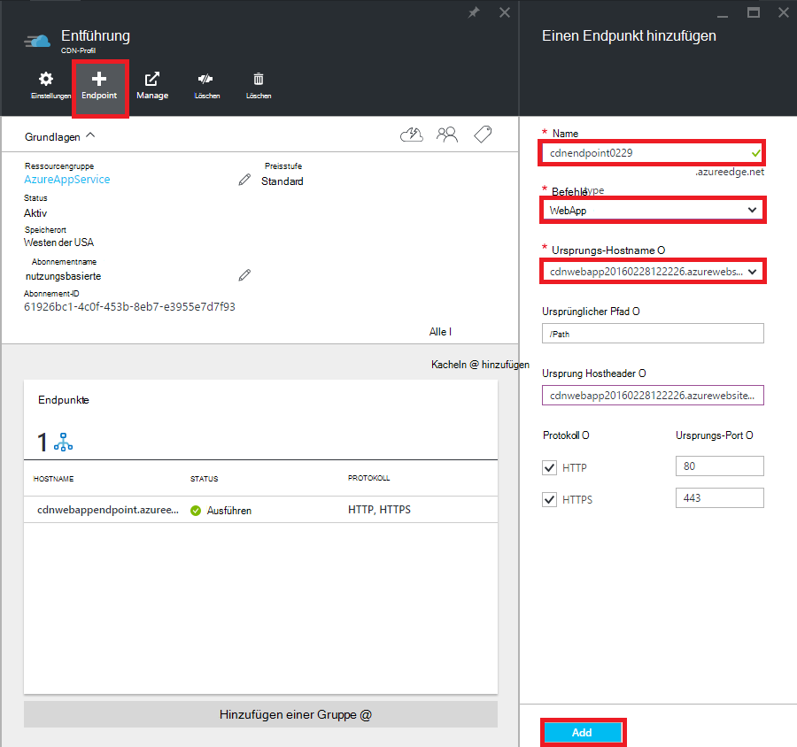


    > [AZURE.NOTE] Erstellte CDN-Endpunkt zeigen **Endpunkt** Blade Ihnen die CDN-URL und der Ursprungsdomäne integriert ist. Allerdings kann es für die neuen CDN-Endpunkt Konfiguration vollständig an die CDN-Knotenpositionen weitergegeben werden länger dauern. 

3. Klicken Sie in Blade **Endpunkt** CDN-Endpunkt, den Sie gerade erstellt haben.

    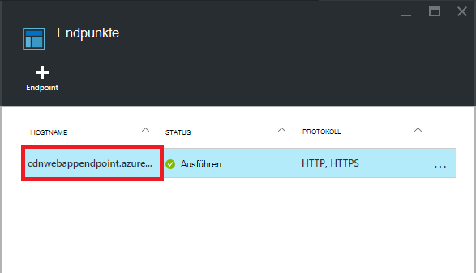

3. Klicken Sie auf die Schaltfläche **Konfigurieren** . Blatt **Konfigurieren** **jeder eindeutige URL Cache** **Abfragezeichenfolge Cacheverhalten** Dropdownfeld, klicken Sie auf die Schaltfläche **Speichern** .


    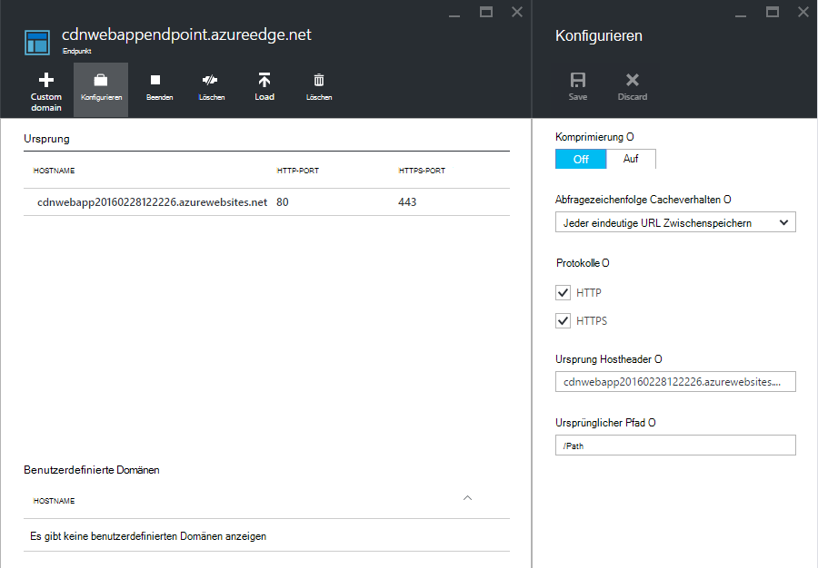

Sobald dies aktivieren wird die Verknüpfung mit anderen Abfragezeichenfolgen zugegriffen als separate Einträge zwischengespeichert.

>[AZURE.NOTE] Beim Aktivieren der Abfragezeichenfolge nicht für dieses Lernprogramm Abschnitt erforderlich ist, möchten Sie frühzeitig möglichst Einfachheit, da jede Änderung Hier wird Zeit die CDN-Knoten verbreiten, und nicht gewünschte Inhalte nicht Abfrage-String-fähige verstopfen CDN-Cache (Aktualisierung CDN-Inhalt wird weiter unten behandelt).

2. Navigieren Sie nun mit der Endpunktadresse CDN. Wenn der Endpunkt bereit ist, erhalten Sie Ihrer Anwendung angezeigt. Wenn Sie **HTTP 404** -Fehler erhalten, ist der CDN-Endpunkt nicht bereit. Sie müssen warten, bis zu einer Stunde CDN-Konfiguration den Rand Knoten weitergegeben werden. 

    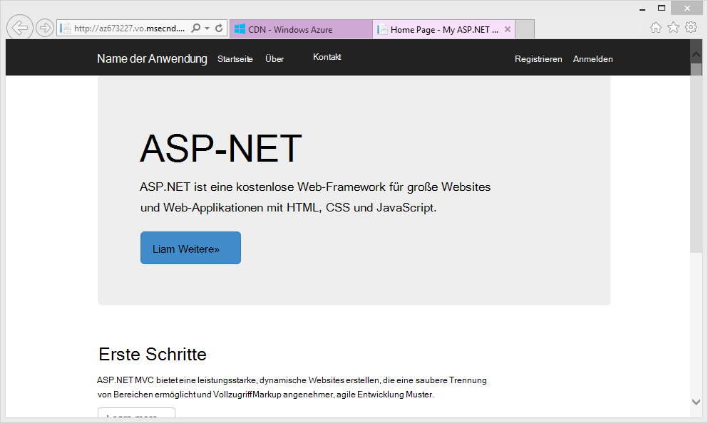

1. Versuchen Sie danach die **~/Content/bootstrap.css** Datei in ASP.NET Projekt zugreifen. Navigieren Sie im Browser zu * *http://*&lt;CdnName >*.azureedge.net/Content/bootstrap.css**. In meinem Setup-URL ist:

        http://az673227.azureedge.net/Content/bootstrap.css

    Die folgenden Ursprungs-URL CDN-Endpunkt entspricht:

        http://cdnwebapp.azurewebsites.net/Content/bootstrap.css

    Beim Navigieren zu * *http://*&lt;CdnName >*.azureedge.net/Content/bootstrap.css**, werden Sie aufgefordert, den bootstrap.css herunterzuladen, die von Ihrer Anwendung in Azure stammt. 

    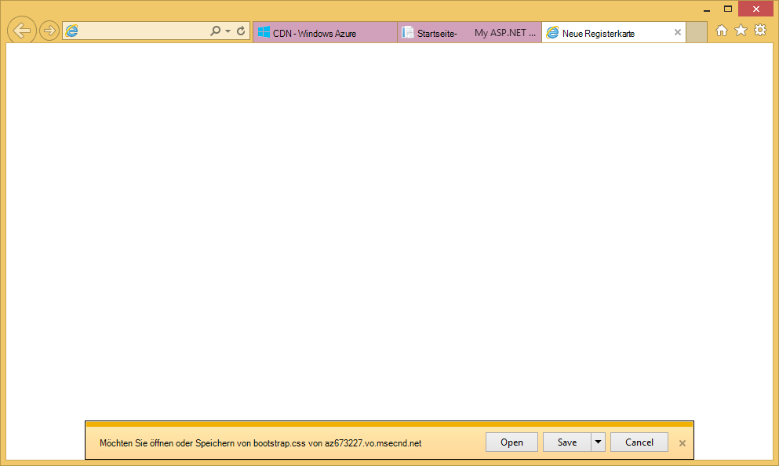

Sie können ebenso alle öffentlich zugängliche URL zugreifen * *http://*&lt;Dienstname >*.cloudapp.net/** direkt aus CDN-Endpunkt. Zum Beispiel:

-   JS-Datei aus dem Pfad/Script
-   Jede Inhaltsdatei aus den/Content Pfad
-   Jeder Controller-Aktion 
-   Wenn die Abfragezeichenfolge an die CDN-Endpunkt URL Abfragezeichenfolgen aktiviert ist
-   Gesamte Azure Web app ist Content öffentliche

Beachten Sie, dass es nicht immer sinnvoll oder im Allgemeinen empfiehlt sich eine gesamte Azure Web app durch Azure CDN dienen. Einige Probleme sind:

-   Dieser Ansatz erfordert eine gesamte Website öffentlich sein, da Azure CDN private Inhalte bedienen kann.
-   Wenn der CDN-Endpunkt offline geht, ob Wartungsarbeiten oder Benutzerfehler, Ihrer gesamten Anwendung offline geschaltet wird, wenn die Kunden die Ursprungs-URL umgeleitet werden können * *http://*&lt;Standortname >*.azurewebsites.net/**. 
-   Auch bei der Cache-Control-Standardeinstellungen (siehe [Konfigurieren von Zwischenspeicherungsoptionen für statische Dateien in Ihrer Anwendung Azure](#configure-caching-options-for-static-files-in-your-azure-web-app)), CDN-Endpunkt verbessern die Leistung von hoch dynamischen Inhalt nicht. Wenn Sie die Homepage von CDN-Endpunkt wie oben gezeigt, laden, die mindestens 5 Sekunden dauerte die Standardstartseite beim ersten Laden eine relativ einfache Seite. Angenommen Sie, der Clientumgebung geschehen würde dieser Seite dynamischen Inhalte enthält, der jede Minute aktualisiert werden muss. Dynamische Inhalte von einem CDN-Endpunkt erforderlich kurz Cacheablaufzeit, was häufig Cachefehler CDN-Endpunkt. Dies beeinträchtigt die Performance der Azure Web-app und dem Zweck der CDN.

Die Alternative ist der Inhalt von Azure CDN pro Fall von Ihrer Azure Anwendung dienen. Zu diesem Zweck haben Sie schon auf einzelnen Content-Dateien aus dem CDN-Endpunkt gesehen. Ich werde Ihnen zeigen, wie man eine bestimmten Controller Aktion über die CDN-Endpunkt [Inhalte in Controlleraktionen durch Azure CDN](#serve-content-from-controller-actions-through-azure-cdn)dienen.

## <a name="configure-caching-options-for-static-files-in-your-azure-web-app"></a>Konfigurieren von Zwischenspeicherungsoptionen für statische Dateien in Ihrer Azure Anwendung ##

Azure CDN-Integration in Ihrer Azure Anwendung können Sie angeben, wie statische Inhalte CDN-Endpunkt zwischengespeichert werden soll. Dazu öffnen Sie *Web.config* ASP.NET Projekt (z.B. **Cdnwebapp**) und fügen eine `<staticContent>` Element `<system.webServer>`. Die unten stehenden konfiguriert den Cache in 3 Tagen ablaufen.  

    <system.webServer>
      <staticContent>
        <clientCache cacheControlMode="UseMaxAge" cacheControlMaxAge="3.00:00:00"/>
      </staticContent>
      ...
    </system.webServer>

Sobald Sie dies tun, werden alle Dateien in Ihrer Azure Anwendung dieselbe Regel im Cache CDN feststellen. Fügen Sie für eine präzisere Steuerung des Cache Settings *Web.config* -Datei in einem Ordner hinzu und die Einstellung. Z. B. *\Content* Ordner eine *Web.config* -Datei hinzufügen und den Inhalt durch folgenden XML-Code ersetzen:

    <?xml version="1.0"?>
    <configuration>
      <system.webServer>
        <staticContent>
          <clientCache cacheControlMode="UseMaxAge" cacheControlMaxAge="15.00:00:00"/>
        </staticContent>
      </system.webServer>
    </configuration>

Diese Einstellung bewirkt, dass alle Dateien aus dem Ordner *\Content* 15 Tage lang zwischengespeichert werden.

Weitere Informationen zum Konfigurieren der `<clientCache>` Element finden Sie unter [Clientcache &lt;ClientCache >](http://www.iis.net/configreference/system.webserver/staticcontent/clientcache).

Im nächsten Abschnitt auch zeige ich Ihnen wie Cache RasterX Controller Aktionsergebnisse in CDN-Cache konfigurieren können.

## <a name="serve-content-from-controller-actions-through-azure-cdn"></a>Inhalt von Controller-Aktionen über Azure CDN bedienen ##

Bei der Integration von Web Apps mit Azure CDN ist relativ einfach, Inhalte in Controlleraktionen durch Azure CDN. Möchten Sie die gesamte Azure Web app durch die CDN dienen, müssen Sie auch dies überhaupt alle Controlleraktionen bereits über das CDN erreichbar sind. Jedoch aus Gründen, die bereits im [Bereitstellen einer Azure Web app mit einem integrierten CDN-Endpunkt](#deploy-a-web-app-to-azure-with-an-integrated-cdn-endpoint)gesagt kann dagegen entscheiden und wählen Sie stattdessen die Controller-Aktion auszuwählen, die von Azure CDN dienen soll. [Maarten Balliauw](https://twitter.com/maartenballiauw) zeigt, wie Sie mit MemeGenerator-Controller [Degressiv](http://channel9.msdn.com/events/TechDays/Techdays-2014-the-Netherlands/Reducing-latency-on-the-web-with-the-Windows-Azure-CDN)Latenz im Web mit Azure CDN. Ich werde Sie einfach hier reproduzieren.

Angenommen Sie in Ihrer Anwendung zu meme basierend auf einem jungen Chuck Norris Bild (Foto [Alan Licht](http://www.flickr.com/photos/alan-light/218493788/)) generieren:


Sie haben eine einfache `Index` Aktion, die die Kunden an Superlative im Bild generiert das MEM, sobald sie auf die Aktion veröffentlichen. Ist Chuck Norris erwarten auf dieser Seite zu beliebten Global. Dies ist ein gutes Beispiel für Azure CDN-dynamische Inhalte mit. 

Die obigen Schritte dadurch Controller einrichten:

1. Im Ordner " *\Controllers* " eine neue CS-Datei namens *MemeGeneratorController.cs* erstellen und den Inhalt durch folgenden Code ersetzen. Ersetzen der Dateipfad für `~/Content/chuck.bmp` und der Name des CDN für `yourCDNName`.


        using System;
        using System.Collections.Generic;
        using System.Diagnostics;
        using System.Drawing;
        using System.IO;
        using System.Net;
        using System.Web.Hosting;
        using System.Web.Mvc;
        using System.Web.UI;

        namespace cdnwebapp.Controllers
        {
          public class MemeGeneratorController : Controller
          {
            static readonly Dictionary<string, Tuple<string ,string>> Memes = new Dictionary<string, Tuple<string, string>>();

            public ActionResult Index()
            {
              return View();
            }

            [HttpPost, ActionName("Index")]
            public ActionResult Index_Post(string top, string bottom)
            {
              var identifier = Guid.NewGuid().ToString();
              if (!Memes.ContainsKey(identifier))
              {
                Memes.Add(identifier, new Tuple<string, string>(top, bottom));
              }

              return Content("<a href=\"" + Url.Action("Show", new {id = identifier}) + "\">here's your meme</a>");
            }

            [OutputCache(VaryByParam = "*", Duration = 1, Location = OutputCacheLocation.Downstream)]
            public ActionResult Show(string id)
            {
              Tuple<string, string> data = null;
              if (!Memes.TryGetValue(id, out data))
              {
                return new HttpStatusCodeResult(HttpStatusCode.NotFound);
              }

              if (Debugger.IsAttached) // Preserve the debug experience
              {
                return Redirect(string.Format("/MemeGenerator/Generate?top={0}&bottom={1}", data.Item1, data.Item2));
              }
              else // Get content from Azure CDN
              {
                return Redirect(string.Format("http://<yourCDNName>.azureedge.net/MemeGenerator/Generate?top={0}&bottom={1}", data.Item1, data.Item2));
              }
            }

            [OutputCache(VaryByParam = "*", Duration = 3600, Location = OutputCacheLocation.Downstream)]
            public ActionResult Generate(string top, string bottom)
            {
              string imageFilePath = HostingEnvironment.MapPath("~/Content/chuck.bmp");
              Bitmap bitmap = (Bitmap)Image.FromFile(imageFilePath);

              using (Graphics graphics = Graphics.FromImage(bitmap))
              {
                SizeF size = new SizeF();
                using (Font arialFont = FindBestFitFont(bitmap, graphics, top.ToUpperInvariant(), new Font("Arial Narrow", 100), out size))
                {
                    graphics.DrawString(top.ToUpperInvariant(), arialFont, Brushes.White, new PointF(((bitmap.Width - size.Width) / 2), 10f));
                }
                using (Font arialFont = FindBestFitFont(bitmap, graphics, bottom.ToUpperInvariant(), new Font("Arial Narrow", 100), out size))
                {
                    graphics.DrawString(bottom.ToUpperInvariant(), arialFont, Brushes.White, new PointF(((bitmap.Width - size.Width) / 2), bitmap.Height - 10f - arialFont.Height));
                }
              }
              MemoryStream ms = new MemoryStream();
              bitmap.Save(ms, System.Drawing.Imaging.ImageFormat.Png);
              return File(ms.ToArray(), "image/png");
            }

            private Font FindBestFitFont(Image i, Graphics g, String text, Font font, out SizeF size)
            {
              // Compute actual size, shrink if needed
              while (true)
              {
                size = g.MeasureString(text, font);

                // It fits, back out
                if (size.Height < i.Height &&
                     size.Width < i.Width) { return font; }

                // Try a smaller font (90% of old size)
                Font oldFont = font;
                font = new Font(font.Name, (float)(font.Size * .9), font.Style);
                oldFont.Dispose();
              }
            }
          }
        }

2. Mit der rechten Maustaste in der standardmäßigen `Index()` Aktion und wählen Sie **Ansicht hinzufügen**.

    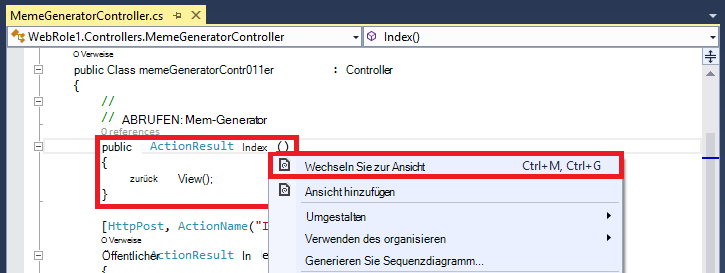

3.  Übernehmen Sie die Einstellung, und klicken Sie auf **Hinzufügen**.

    

4. Öffnen Sie die neue *Views\MemeGenerator\Index.cshtml* und Ersetzen Sie Inhalt durch die folgende einfache HTML Dank Superlative:

        <h2>Meme Generator</h2>
        
        <form action="" method="post">
            <input type="text" name="top" placeholder="Enter top text here" />
            <br />
            <input type="text" name="bottom" placeholder="Enter bottom text here" />
            <br />
            <input class="btn" type="submit" value="Generate meme" />
        </form>

5. Azure Web app erneut veröffentlichen und navigieren Sie zu * *http://*&lt;Dienstname >*.cloudapp.net/MemeGenerator/Index** in Ihrem Browser. 

Die Formularwerte eingestellten `/MemeGenerator/Index`, `Index_Post` Aktionsmethode gibt eine Verknüpfung mit der `Show` Aktionsmethode mit der entsprechenden Eingabe. Wenn Sie auf den Link klicken, erreichen Sie den folgenden Code:  

    [OutputCache(VaryByParam = "*", Duration = 1, Location = OutputCacheLocation.Downstream)]
    public ActionResult Show(string id)
    {
      Tuple<string, string> data = null;
      if (!Memes.TryGetValue(id, out data))
      {
        return new HttpStatusCodeResult(HttpStatusCode.NotFound);
      }

      if (Debugger.IsAttached) // Preserve the debug experience
      {
        return Redirect(string.Format("/MemeGenerator/Generate?top={0}&bottom={1}", data.Item1, data.Item2));
      }
      else // Get content from Azure CDN
      {
        return Redirect(string.Format("http://<yourCDNName>.azureedge.net/MemeGenerator/Generate?top={0}&bottom={1}", data.Item1, data.Item2));
      }
    }

Wenn Ihre lokalen Debuggers erhalten regulären Debug Erfahrung mit lokalen Umleitung Sie. In Azure Web app ausgeführt wird, wird es zum Umleiten:

    http://<yourCDNName>.azureedge.net/MemeGenerator/Generate?top=<formInput>&bottom=<formInput>

Die folgenden Ursprungs-URL der CDN-Endpunkt entspricht:

    http://<yourSiteName>.azurewebsites.net/cdn/MemeGenerator/Generate?top=<formInput>&bottom=<formInput>

Nach URL rewrite Regel angewendet, wird die eigentliche Datei CDN-Endpunkt zwischengespeichert wird:

    http://<yourSiteName>.azurewebsites.net/MemeGenerator/Generate?top=<formInput>&bottom=<formInput>

Können Sie die `OutputCacheAttribute` -Attribut auf die `Generate` -Methode können Sie angeben, wie das Aktionsergebnis zwischengespeichert werden sollte die Azure CDN berücksichtigt. Der folgende Code eine Ablaufzeit für den Cache von 1 Stunde (3.600 Sekunden) angeben

    [OutputCache(VaryByParam = "*", Duration = 3600, Location = OutputCacheLocation.Downstream)]

Ebenso können Sie Inhalte aus allen Controller-Aktionen in Ihrer Azure Anwendung durch Ihre Azure CDN mit Zwischenspeichern gewünschte dienen.

Im nächsten Abschnitt werden Sie wie die gebündelt und minimierte Skripts und CSS über Azure CDN vorgestellt. 

## <a name="integrate-aspnet-bundling-and-minification-with-azure-cdn"></a>Azure CDN ASP.NET bündeln und Verkleinerung integriert ##

Skripts und CSS-Stylesheets selten ändern und sind für den Azure CDN-Cache. Die gesamte Web app durch Azure CDN serviert am einfachsten bündeln und Verkleinerung in Azure CDN integriert. Aber wie Sie [Integrieren einer Azure CDN-Endpunkt mit der Azure-Anwendung und dienen Statische Webinhalte in Webseiten von Azure CDN](#deploy-a-web-app-to-azure-with-an-integrated-cdn-endpoint)beschriebenen Gründen gegen diesen Ansatz wählen, können zeige ich Ihnen wie es Beibehaltung der gewünschten Develper Erfahrung ASP.NET bündeln und Verkleinerung, wie:

-   Große Debug Mode Erfahrung
-   Optimierte Bereitstellung
-   Sofortige Updates für Clients für Skript-CSS Versions-upgrades
-   -Fallbackmechanismus fällt CDN-Endpunkt
-   Code-Änderung minimieren

Sie [integrieren ein Azure CDN-Endpunkt mit der Azure-Anwendung und dienen Statische Webinhalte in Webseiten von Azure CDN](#deploy-a-web-app-to-azure-with-an-integrated-cdn-endpoint)erstellt ASP.NET Projekt öffnen *app_start\bundleconfig* und sehen Sie sich die `bundles.Add()` Methodenaufrufe.

    public static void RegisterBundles(BundleCollection bundles)
    {
        bundles.Add(new ScriptBundle("~/bundles/jquery").Include(
                    "~/Scripts/jquery-{version}.js"));
        ...
    }

Die erste `bundles.Add()` Anweisung fügt ein Skript-Bundle im virtuellen Verzeichnis `~/bundles/jquery`. Öffnen Sie dann *Views\Shared ebenfalls einen\_Layout.cshtml* sehen wie Bundle Skripttags gerendert wird. Sie sollten die folgenden Razor-Code finden können:

    @Scripts.Render("~/bundles/jquery")

Wenn in Azure Web app Razor-Code ausgeführt wird, wird gerendert, ein `<script>` für Skript-Bundle ähnlich dem folgenden Tag: 

    <script src="/bundles/jquery?v=FVs3ACwOLIVInrAl5sdzR2jrCDmVOWFbZMY6g6Q0ulE1"></script>

Jedoch beim Ausführen im Visual Studio durch Eingabe `F5`, jede Skriptdatei im Bündel wird einzeln gerendert (im obigen Beispiel nur eine Skriptdatei ist im Bündel):

    <script src="/Scripts/jquery-1.10.2.js"></script>

Dadurch können Sie JavaScript-Code in der Umgebung debuggen, um gleichzeitige Clientverbindungen (Bündelung) und die Datei verbessern Leistung (Verkleinerung) in der Produktion herunterladen. Es ist ein großartiges Feature zu Azure CDN-Integration. Darüber hinaus gerenderte Paket bereits eine automatisch generierte Zeichenfolge enthält, möchten Sie diese Funktionalität replizieren, damit bei jeder Aktualisierung die jQuery-Version über NuGet es clientseitig möglichst bald aktualisiert werden kann.

Gehen Sie zu Integration ASP.NET Bündelung Verkleinerung mit CDN-Endpunkt.

1. Ändern Sie im *app_start\bundleconfig*die `bundles.Add()` Methoden einen anderen [Konstruktor Bündel](http://msdn.microsoft.com/library/jj646464.aspx), eine, die eine CDN-Adresse angibt. Ersetzen Sie dazu die `RegisterBundles` Methodendefinition durch den folgenden Code:  
    
        public static void RegisterBundles(BundleCollection bundles)
        {
          bundles.UseCdn = true;
          var version = System.Reflection.Assembly.GetAssembly(typeof(Controllers.HomeController))
            .GetName().Version.ToString();
          var cdnUrl = "http://<yourCDNName>.azureedge.net/{0}?" + version;

          bundles.Add(new ScriptBundle("~/bundles/jquery", string.Format(cdnUrl, "bundles/jquery")).Include(
                "~/Scripts/jquery-{version}.js"));

          bundles.Add(new ScriptBundle("~/bundles/jqueryval", string.Format(cdnUrl, "bundles/jqueryval")).Include(
                "~/Scripts/jquery.validate*"));

          // Use the development version of Modernizr to develop with and learn from. Then, when you're
          // ready for production, use the build tool at http://modernizr.com to pick only the tests you need.
          bundles.Add(new ScriptBundle("~/bundles/modernizr", string.Format(cdnUrl, "bundles/modernizr")).Include(
                "~/Scripts/modernizr-*"));

          bundles.Add(new ScriptBundle("~/bundles/bootstrap", string.Format(cdnUrl, "bundles/bootstrap")).Include(
                "~/Scripts/bootstrap.js",
                "~/Scripts/respond.js"));

          bundles.Add(new StyleBundle("~/Content/css", string.Format(cdnUrl, "Content/css")).Include(
                "~/Content/bootstrap.css",
                "~/Content/site.css"));
        }


    Ersetzen Sie `<yourCDNName>` mit dem Namen Azure CDN.

    In einfachen Worten einrichten `bundles.UseCdn = true` und jedes sorgfältig CDN-URL hinzugefügt. Angenommen, der erste Konstruktor im Code:

        new ScriptBundle("~/bundles/jquery", string.Format(cdnUrl, "bundles/jquery"))

    entspricht: 

        new ScriptBundle("~/bundles/jquery", string.Format(cdnUrl, "http://<yourCDNName>.azureedge.net/bundles/jquery?<W.X.Y.Z>"))

    Dieser Konstruktor weist ASP.NET bündeln und Verkleinerung rendern einzelne Skriptdateien beim lokalen Debuggen, aber die angegebene CDN-Adresse auf das betreffende Skript. Jedoch zwei wichtige Merkmale dieses sorgfältig CDN-URL:
    
    - Der Ursprung dieser CDN-URL ist `http://<yourSiteName>.azurewebsites.net/bundles/jquery?<W.X.Y.Z>`, ist eigentlich das virtuelle Verzeichnis der Skript-Bundle in der Web-Anwendung.
    - Seit CDN-Konstruktor enthält CDN Skripttag für das Paket nicht mehr automatisch generierte Versionszeichenfolge im gerenderten URL. Jedem Skript-Bundle erzwingen Cachefehler Ihre Azure CDN geändert wird, müssen Sie manuell eine eindeutige Zeichenfolge generieren. Zur gleichen Zeit muss diese eindeutige Zeichenfolge konstant bleiben über die Lebensdauer der Bereitstellung Cachetreffer Ihre Azure CDN maximieren, nachdem das Paket bereitgestellt wird.

3. Die Abfragezeichenfolge `<W.X.Y.Z>` von *Properties\AssemblyInfo* in ASP.NET Projekt abruft. Sie können Bereitstellungsworkflow verfügen, der erhöhen die Version der Assembly bei jeder Veröffentlichung in Azure einschließt. Oder Sie können nur *Properties\AssemblyInfo* im Projekt automatisch erhöht die Versionszeichenfolge bei jedem Erstellen mit dem Platzhalterzeichen "*". Ändern Sie z. B. `AssemblyVersion` wie folgt:
    
        [assembly: AssemblyVersion("1.0.0.*")]
    
    Jede Strategie zur Rationalisierung generiert eine eindeutige Zeichenfolge für die Lebensdauer einer Bereitstellung funktioniert hier.

3. Veröffentlichen Sie die Anwendung ASP.NET und Zugriff auf die Homepage.
 
4. HTML-Code der Seite anzuzeigen. Sie sollen die CDN URL dargestellt, durch eine eindeutige Zeichenfolge jedes Mal ändert Ihre Azure Web App veröffentlichen. Zum Beispiel:  
    
        ...
        <link href="http://az673227.azureedge.net/Content/css?1.0.0.25449" rel="stylesheet"/>
        <script src="http://az673227.azureedge.net/bundles/modernizer?1.0.0.25449"></script>
        ...
        <script src="http://az673227.azureedge.net/bundles/jquery?1.0.0.25449"></script>
        <script src="http://az673227.azureedge.net/bundles/bootstrap?1.0.0.25449"></script>
        ...

5. In Visual Studio Debuggen der ASP.NET in Visual Studio durch Eingabe `F5`., 

6. HTML-Code der Seite anzuzeigen. Sie sehen noch jede Datei einzeln gerendert, so dass Sie eine konsistente Debuggen in Visual Studio auftreten können.  
    
        ...
        <link href="/Content/bootstrap.css" rel="stylesheet"/>
        <link href="/Content/site.css" rel="stylesheet"/>
        <script src="/Scripts/modernizr-2.6.2.js"></script>
        ...
        <script src="/Scripts/jquery-1.10.2.js"></script>
        <script src="/Scripts/bootstrap.js"></script>
        <script src="/Scripts/respond.js"></script>
        ...    

## <a name="fallback-mechanism-for-cdn-urls"></a>Fallbackmechanismus für CDN-URLs ##

Wenn Azure CDN-Endpunkt aus irgendeinem Grund fehlschlägt, können Sie Ihre Webseite intelligent genug auf Ihre ursprünglichen Webserver als Fallbackoption für JavaScript oder Bootstrap geladen. Es ist schwerwiegend genug, um Bilder auf Ihrer Anwendung durch CDN fehlen jedoch wichtige Seitenfunktionalität von Skripts und Stylesheets nicht mehr viel schwerer zu verlieren.

Die [Bundle](http://msdn.microsoft.com/library/system.web.optimization.bundle.aspx) -Klasse enthält eine Eigenschaft namens [CdnFallbackExpression](http://msdn.microsoft.com/library/system.web.optimization.bundle.cdnfallbackexpression.aspx) , die Sie der Fallbackmechanismus für CDN Fehler konfigurieren können. Um diese Eigenschaft zu verwenden, wie folgt:

1. Öffnen Sie in Ihrem Projekt ASP.NET *app_start\bundleconfig*, wo CDN-URL in jedem [Paket Konstruktor hinzugefügten,](http://msdn.microsoft.com/library/jj646464.aspx)und fügen `CdnFallbackExpression` code an vier Stellen wie Pakete standardmäßig einen Fallbackmechanismus hinzu.  
    
        public static void RegisterBundles(BundleCollection bundles)
        {
          var version = System.Reflection.Assembly.GetAssembly(typeof(BundleConfig))
            .GetName().Version.ToString();
          var cdnUrl = "http://cdnurl.azureedge.net/.../{0}?" + version;
          bundles.UseCdn = true;

          bundles.Add(new ScriptBundle("~/bundles/jquery", string.Format(cdnUrl, "bundles/jquery")) 
                { CdnFallbackExpression = "window.jquery" }
                .Include("~/Scripts/jquery-{version}.js"));

          bundles.Add(new ScriptBundle("~/bundles/jqueryval", string.Format(cdnUrl, "bundles/jqueryval")) 
                { CdnFallbackExpression = "$.validator" }
                .Include("~/Scripts/jquery.validate*"));

          // Use the development version of Modernizr to develop with and learn from. Then, when you're
          // ready for production, use the build tool at http://modernizr.com to pick only the tests you need.
          bundles.Add(new ScriptBundle("~/bundles/modernizr", string.Format(cdnUrl, "bundles/modernizer")) 
                { CdnFallbackExpression = "window.Modernizr" }
                .Include("~/Scripts/modernizr-*"));

          bundles.Add(new ScriptBundle("~/bundles/bootstrap", string.Format(cdnUrl, "bundles/bootstrap"))     
                { CdnFallbackExpression = "$.fn.modal" }
                .Include(
                        "~/Scripts/bootstrap.js",
                        "~/Scripts/respond.js"));

          bundles.Add(new StyleBundle("~/Content/css", string.Format(cdnUrl, "Content/css")).Include(
                "~/Content/bootstrap.css",
                "~/Content/site.css"));
        }

    Wenn `CdnFallbackExpression` ist nicht null Skript in HTML zu testen, ob das Paket erfolgreich geladen und, wenn nicht das Paket direkt aus dem ursprünglichen Webserver eingefügt. Diese Eigenschaft muss auf einen JavaScript-Ausdruck, der überprüft, ob das jeweiligen CDN-Paket ordnungsgemäß geladen wird. Der Ausdruck jedes testen musste hängt der Inhalt. Die Standard-Bundles oben:
    
    - `window.jquery`wird in JS Jquery-{Version} definiert
    - `$.validator`wird in jquery.validate.js definiert
    - `window.Modernizr`wird in modernisierer-{Version} js definiert
    - `$.fn.modal`wird in bootstrap.js definiert
    
    Ihnen ist vielleicht aufgefallen, dass ich nicht für CdnFallbackExpression das `~/Cointent/css` Paket. Ist derzeit gibt es einen [Fehler in System.Web.Optimization](https://aspnetoptimization.codeplex.com/workitem/104) , der Fügt eine `<script>` Tag für alternativen CSS statt der erwarteten `<link>` Tag.
    
    Es ist jedoch ein guter [Stil Bundles Fallback](https://github.com/EmberConsultingGroup/StyleBundleFallback) [Ember Consulting](https://github.com/EmberConsultingGroup)-Gruppe. 

2. Um den Workaround für CSS verwenden, eine neue CS-Datei in Ihrem Projekt ASP.NET *App_Start* Ordner namens *StyleBundleExtensions.cs*erstellen und seinen Inhalt mit dem [Code von GitHub](https://github.com/EmberConsultingGroup/StyleBundleFallback/blob/master/Website/App_Start/StyleBundleExtensions.cs)ersetzen. 

4. Benennen Sie in *App_Start\StyleFundleExtensions.cs*den Namespace der Anwendung ASP.NET Namespace (z.B. **Cdnwebapp**). 

3. Zurück zu `App_Start\BundleConfig.cs` und den letzten `bundles.Add` mit dem folgenden Code:  

        bundles.Add(new StyleBundle("~/Content/css", string.Format(cdnUrl, "Content/css"))
          .IncludeFallback("~/Content/css", "sr-only", "width", "1px")
          .Include(
            "~/Content/bootstrap.css",
            "~/Content/site.css"));

    Diese neue Erweiterungsmethode verwendet dasselbe Skript im HTML-DOM für überprüfen Einfügen der einen entsprechenden Klassennamen Regelname und Wert der CSS-Paket und auf dem ursprünglichen Webserver definiert, wenn die Übereinstimmung nicht gefunden.

4. Ihrer Azure Anwendung erneut veröffentlichen und die Startseite zugreifen. 
5. HTML-Code der Seite anzuzeigen. Eingefügte Skripts sollte ähnlich der folgenden finden:    
    
    ```
    ...
    <link href="http://az673227.azureedge.net/Content/css?1.0.0.25474" rel="stylesheet"/>
<script>(function() {
                var loadFallback,
                    len = document.styleSheets.length;
                for (var i = 0; i < len; i++) {
                    var sheet = document.styleSheets[i];
                    if (sheet.href.indexOf('http://az673227.azureedge.net/Content/css?1.0.0.25474') !== -1) {
                        var meta = document.createElement('meta');
                        meta.className = 'sr-only';
                        document.head.appendChild(meta);
                        var value = window.getComputedStyle(meta).getPropertyValue('width');
                        document.head.removeChild(meta);
                        if (value !== '1px') {
                            document.write('<link href="/Content/css" rel="stylesheet" type="text/css" />');
                        }
                    }
                }
                return true;
            }())||document.write('<script src="/Content/css"><\/script>');</script>

    <script src="http://az673227.azureedge.net/bundles/modernizer?1.0.0.25474"></script>
    <script>(window.Modernizr)||document.write('<script src="/bundles/modernizr"><\/script>');</script>
    ... 
    <script src="http://az673227.azureedge.net/bundles/jquery?1.0.0.25474"></script>
    <script>(window.jquery)||document.write('<script src="/bundles/jquery"><\/script>');</script>

    <script src="http://az673227.azureedge.net/bundles/bootstrap?1.0.0.25474"></script>
    <script>($.fn.modal)||document.write('<script src="/bundles/bootstrap"><\/script>');</script>
    ...
    ```

    Eingefügtes Skript für CSS-Bundle noch fehlerhafte Überbleibsel enthält die `CdnFallbackExpression` -Eigenschaft in der Zeile:

        }())||document.write('<script src="/Content/css"><\/script>');</script>

    Seit dem ersten Teil der || Ausdruck immer (in der Zeile direkt oberhalb) true zurückgeben, document.write() Funktion nie ausgeführt.

6. Testen, ob die Fallbackskript arbeitet zurück die die CDN-Endpunkt Blade und klicken Sie auf **Beenden**.

    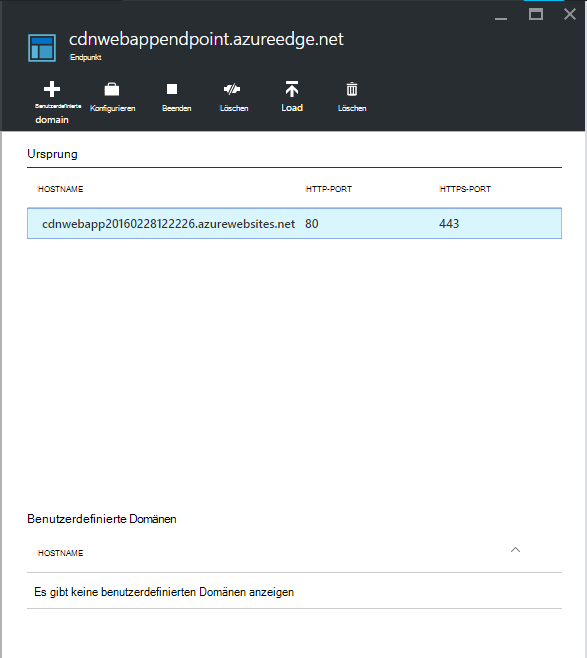

7. Aktualisieren Sie das Browserfenster für Azure Web app. Sie sollten sehen, dass alle Skripts und Stylesheets ordnungsgemäß geladen werden.

## <a name="more-information"></a>Weitere Informationen 
- [Übersicht über Azure Content Delivery Network (CDN)](../cdn/cdn-overview.md)
- [Mithilfe von Azure CDN](../cdn/cdn-create-new-endpoint.md)
- [Azure CDN Cloud-Dienst integriert](../cdn/cdn-cloud-service-with-cdn.md)
- [ASP.NET bündeln und Verkleinerung](http://www.asp.net/mvc/tutorials/mvc-4/bundling-and-minification)

