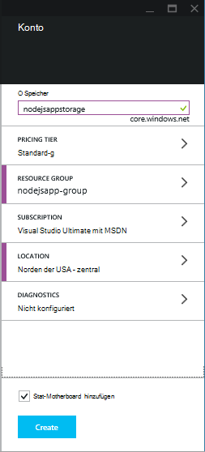
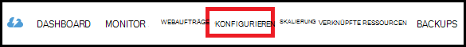
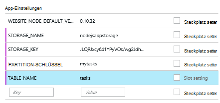

<properties
    pageTitle="Node.js WebApp mit Azure Tabelle Service"
    description="Dieses Lernprogramm zeigt Ihnen, wie mit der Azure-Diensts eine Node.js-Anwendung mit Daten in Azure App Service Web Apps gespeichert."
    tags="azure-portal"
    services="app-service\web, storage"
    documentationCenter="nodejs"
    authors="rmcmurray"
    manager="wpickett"
    editor=""/>

<tags
    ms.service="storage"
    ms.workload="storage"
    ms.tgt_pltfrm="na"
    ms.devlang="nodejs"
    ms.topic="article"
    ms.date="08/11/2016"
    ms.author="robmcm"/>

# Node.js WebApp mit Azure Tabelle Service

## Übersicht

In diesem Lernprogramm wird das Verwenden von Azure Datenmanagement bereitgestellten Dienst zum Speichern und Abrufen von Daten aus einem [Knoten] Anwendung in [Azure App Service](http://go.microsoft.com/fwlink/?LinkId=529714) Web Apps veranschaulicht. In diesem Lernprogramm werden einige Knoten mit [Git]Vorkenntnisse vorausgesetzt.

Lernen Sie Folgendes:

* Wie Sie Npm (Knoten Package Manager) den Knoten Module

* Arbeiten mit der Azure-Diensts

* Wie die CLI Azure eine Web app erstellen.

Anhand dieses Lernprogramms erstellen Sie eine einfache Web-basierte "Aufgabenliste" Anwendung, erstellen, abrufen und Aufgaben. Die Aufgaben werden in der Tabelle Service gespeichert.

Hier ist die fertige Anwendung:

![Eine Webseite mit einer leeren tasklist][node-table-finished]

>[AZURE.NOTE] Wenn Sie mit Azure App Service beginnen, bevor Sie sich für ein Azure-Konto, gehen Sie [Versuchen App Service](http://go.microsoft.com/fwlink/?LinkId=523751)sofort eine kurzlebige Starter Web app in App Service können Sie erstellen. Keine Kreditkarten erforderlich; keine Zusagen.

## Erforderliche Komponenten

Sicherstellen Sie bevor die Anweisungen in diesem Artikel, dass Folgendes installiert sein:

* [Knoten] -Version 0.10.24 oder höher

* [Git]

[AZURE.INCLUDE [create-account-and-websites-note](../../includes/create-account-and-websites-note.md)]

## Ein Speicherkonto erstellen

Registrieren Sie Azure-Speicher. Die Anwendung verwendet dieses Konto zum Speichern von Aufgaben.

1.  [Azure-Portal](https://portal.azure.com/)anmelden.

2. Klicken Sie links unten im Portal **neu** und klicken Sie auf **Daten + Speicher** > **Speicher**. Geben Sie dem Speicherkonto einen eindeutigen Namen, und erstellen Sie eine neue [Ressourcengruppe](../azure-resource-manager/resource-group-overview.md) für.

    

    Beim Erstellen des Speicherkontos Schaltfläche **Benachrichtigungen** blinkt grün **Erfolg** und das Speicherkonto Blade um anzuzeigen, dass er die neue Ressourcengruppe gehört erstellten geöffnet ist.

5. **Klicken Sie in das Speicherkonto Blade** > **Schlüssel**. Kopieren Sie den primäre Schlüssel in die Zwischenablage.

    ![Tastenkombination][portal-storage-access-keys]

##Module installieren und Gerüstbau generieren

In diesem Abschnitt werden neue Knoten Anwendung erstellen und mit Npm der Modul-Pakete hinzugefügt. Hierfür verwenden Sie die Module [Express] und [Azure] . Express-Modul bietet ein Model View Controller-Framework für Knoten Azure Module bietet Konnektivität mit dem Dienst.

### Express installieren und Gerüstbau generieren

1. Erstellen Sie ein neues Verzeichnis **Tasklist** und Switch über die Befehlszeile in das Verzeichnis.  

2. Geben Sie den folgenden Befehl Express-Modul zu installieren.

        npm install express-generator@4.2.0 -g

    Je nach dem Betriebssystem müssen Sie vor dem Befehl "Sudo" setzen:

        sudo npm install express-generator@4.2.0 -g

    Die Ausgabe wird im folgenden Beispiel ähnelt:

        express-generator@4.2.0 /usr/local/lib/node_modules/express-generator
        ├── mkdirp@0.3.5
        └── commander@1.3.2 (keypress@0.1.0)

    > [AZURE.NOTE] Die "-g"-Parameter installiert das Modul Global. Auf diese Weise **express** können wir Web app Gerüstbau generieren, ohne zusätzliche Informationen eingeben.

4. Um das Gerüst für die Anwendung zu erstellen, geben Sie den **express** Befehl:

        express

    Die Ausgabe dieses Befehls sieht in etwa wie folgt:

           create : .
           create : ./package.json
           create : ./app.js
           create : ./public
           create : ./public/images
           create : ./routes
           create : ./routes/index.js
           create : ./routes/users.js
           create : ./public/stylesheets
           create : ./public/stylesheets/style.css
           create : ./views
           create : ./views/index.jade
           create : ./views/layout.jade
           create : ./views/error.jade
           create : ./public/javascripts
           create : ./bin
           create : ./bin/www

           install dependencies:
             $ cd . && npm install

           run the app:
             $ DEBUG=my-application ./bin/www

    Sie haben jetzt mehrere neue Verzeichnisse und Dateien im Verzeichnis **Tasklist** .

### Installieren Sie zusätzliche Module

Eine der Dateien,- **express** erstellt ist **package.json**. Diese Datei enthält eine Liste der Abhängigkeiten Modul. Später beim Bereitstellen der Anwendung App Service Web Apps bestimmt diese Datei welche Module in Azure installiert werden müssen.

Geben Sie in der Befehlszeile den folgenden Befehl in der Datei **package.json** beschriebenen Module installiert. Sie müssen 'Sudo' verwenden.

    npm install

Die Ausgabe dieses Befehls sieht in etwa wie folgt:

    debug@0.7.4 node_modules\debug

    cookie-parser@1.0.1 node_modules\cookie-parser
    ├── cookie-signature@1.0.3
    └── cookie@0.1.0

    [...]

Geben Sie den folgenden Befehl [Azure], [Knoten Uuid] [Nconf] und [asynchrone] Module installiert:

    npm install azure-storage node-uuid async nconf --save

Die **-Speichern** Kennzeichen der **package.json** -Datei Einträge für diese Module hinzugefügt.

Die Ausgabe dieses Befehls sieht in etwa wie folgt:

    async@0.9.0 node_modules\async

    node-uuid@1.4.1 node_modules\node-uuid

    nconf@0.6.9 node_modules\nconf
    ├── ini@1.2.1
    ├── async@0.2.9
    └── optimist@0.6.0 (wordwrap@0.0.2, minimist@0.0.10)

    [...]

## Erstellen der Anwendung

Wir können nun die Anwendung erstellen.

### Modell erstellen

Ein *Modell* ist ein Objekt, das Daten in der Anwendung darstellt. Für die Anwendung ist das einzige Modell ein Taskobjekt ein Element in der Aufgabenliste stellt. Aufgaben müssen die folgenden Felder:

- PartitionKey
- RowKey
- Name (Zeichenfolge)
- Kategorie (Zeichenfolge)
- abgeschlossen (Boolean)

**PartitionKey** und **RowKey** werden vom Dienst Tabelle als Schlüssel verwendet. Weitere Informationen finden Sie unter [Understanding Dienst-Datenmodell](https://msdn.microsoft.com/library/azure/dd179338.aspx).

1. Erstellen Sie im Verzeichnis **Tasklist** **Modelle**ein neues Verzeichnis.

2. Erstellen Sie eine neue Datei namens **task.js**im Verzeichnis **Modelle** . Diese Datei enthält das Modell für die Aufgaben von der Anwendung erstellt.

3. Fügen Sie am Anfang der Datei **task.js** den folgenden Code erforderliche Bibliotheken verweisen:

        var azure = require('azure-storage');
        var uuid = require('node-uuid');
        var entityGen = azure.TableUtilities.entityGenerator;

4. Fügen Sie folgenden Code zum Definieren und Task-Objekt exportieren. Dieses Objekt ist verantwortlich für die Verbindung mit der Tabelle.

        module.exports = Task;

        function Task(storageClient, tableName, partitionKey) {
          this.storageClient = storageClient;
          this.tableName = tableName;
          this.partitionKey = partitionKey;
          this.storageClient.createTableIfNotExists(tableName, function tableCreated(error) {
            if(error) {
              throw error;
            }
          });
        };

5. Fügen Sie folgenden Code um weitere Methoden für das Task-Objekt definieren die Interaktionen mit den Daten in der Tabelle:

        Task.prototype = {
          find: function(query, callback) {
            self = this;
            self.storageClient.queryEntities(this.tableName, query, null, function entitiesQueried(error, result) {
              if(error) {
                callback(error);
              } else {
                callback(null, result.entries);
              }
            });
          },

          addItem: function(item, callback) {
            self = this;
            // use entityGenerator to set types
            // NOTE: RowKey must be a string type, even though
            // it contains a GUID in this example.
            var itemDescriptor = {
              PartitionKey: entityGen.String(self.partitionKey),
              RowKey: entityGen.String(uuid()),
              name: entityGen.String(item.name),
              category: entityGen.String(item.category),
              completed: entityGen.Boolean(false)
            };
            self.storageClient.insertEntity(self.tableName, itemDescriptor, function entityInserted(error) {
              if(error){  
                callback(error);
              }
              callback(null);
            });
          },

          updateItem: function(rKey, callback) {
            self = this;
            self.storageClient.retrieveEntity(self.tableName, self.partitionKey, rKey, function entityQueried(error, entity) {
              if(error) {
                callback(error);
              }
              entity.completed._ = true;
              self.storageClient.updateEntity(self.tableName, entity, function entityUpdated(error) {
                if(error) {
                  callback(error);
                }
                callback(null);
              });
            });
          }
        }

6. Speichern Sie und schließen Sie die Datei **task.js** .

### Erstellen Sie einen controller

Ein *Controller* verarbeitet HTTP-Anfragen und die HTML-Antwort rendert.

1. **Tasklist-Routen** im Verzeichnis eine neue Datei namens **tasklist.js** erstellen und in einem Texteditor öffnen.

2. Fügen Sie folgenden Code zum **tasklist.js**. Dadurch lädt Azure und Async-Module, die von **tasklist.js**verwendet werden. Außerdem definiert die **TaskList** -Funktion, die eine Instanz des **Task** -Objekts übergeben, die zuvor von uns definiert:

        var azure = require('azure-storage');
        var async = require('async');

        module.exports = TaskList;

3. Definieren Sie ein **TaskList** -Objekt.

        function TaskList(task) {
          this.task = task;
        }

4. **TaskList**folgendermaßen hinzufügen:

        TaskList.prototype = {
          showTasks: function(req, res) {
            self = this;
            var query = new azure.TableQuery()
              .where('completed eq ?', false);
            self.task.find(query, function itemsFound(error, items) {
              res.render('index',{title: 'My ToDo List ', tasks: items});
            });
          },

          addTask: function(req,res) {
            var self = this;
            var item = req.body.item;
            self.task.addItem(item, function itemAdded(error) {
              if(error) {
                throw error;
              }
              res.redirect('/');
            });
          },

          completeTask: function(req,res) {
            var self = this;
            var completedTasks = Object.keys(req.body);
            async.forEach(completedTasks, function taskIterator(completedTask, callback) {
              self.task.updateItem(completedTask, function itemsUpdated(error) {
                if(error){
                  callback(error);
                } else {
                  callback(null);
                }
              });
            }, function goHome(error){
              if(error) {
                throw error;
              } else {
               res.redirect('/');
              }
            });
          }
        }

### App.js ändern

1. **Tasklist** -Verzeichnis die Datei **app.js** aus. Diese Datei wurde zuvor mit dem Befehl **express** erstellt.

2. Fügen Sie am Anfang der Datei gehen Azure Modul geladen fest, den Tabellennamen Partitionsschlüssel, und Speicher Anmeldeinformationen von diesem Beispiel:

        var azure = require('azure-storage');
        var nconf = require('nconf');
        nconf.env()
             .file({ file: 'config.json', search: true });
        var tableName = nconf.get("TABLE_NAME");
        var partitionKey = nconf.get("PARTITION_KEY");
        var accountName = nconf.get("STORAGE_NAME");
        var accountKey = nconf.get("STORAGE_KEY");

    > [AZURE.NOTE] Nconf Laden der Werte von Umgebungsvariablen oder die **config.json** -Datei, die wir später erstellen.

3. Scrollen Sie sich in der Datei app.js Sie die folgende Zeile finden:

        app.use('/', routes);
        app.use('/users', users);

    Ersetzen Sie die oben genannten Zeilen mit den folgenden Code. Das Initialisieren einer Instanz der <strong>Aufgabe</strong> mit Ihres Speicherkontos. Dies wird an <strong>TaskList</strong>übergeben sie mit dem Dienst kommunizieren mit:

        var TaskList = require('./routes/tasklist');
        var Task = require('./models/task');
        var task = new Task(azure.createTableService(accountName, accountKey), tableName, partitionKey);
        var taskList = new TaskList(task);

        app.get('/', taskList.showTasks.bind(taskList));
        app.post('/addtask', taskList.addTask.bind(taskList));
        app.post('/completetask', taskList.completeTask.bind(taskList));

4. Speichern Sie die Datei **app.js** .

### Index ändern

1. Öffnen Sie die Datei **tasklist/views/index.jade** in einem Texteditor.

2. Ersetzen Sie den gesamten Inhalt der Datei durch folgenden Code. Definiert eine Ansicht, die vorhandene Aufgaben angezeigt und ein Formular für neue Aufgaben hinzufügen und vorhandene als abgeschlossen markieren.

        extends layout

        block content
          h1= title
          br

          form(action="/completetask", method="post")
            table.table.table-striped.table-bordered
              tr
                td Name
                td Category
                td Date
                td Complete
              if (typeof tasks === "undefined")
                tr
                  td
              else
                each task in tasks
                  tr
                    td #{task.name._}
                    td #{task.category._}
                    - var day   = task.Timestamp._.getDate();
                    - var month = task.Timestamp._.getMonth() + 1;
                    - var year  = task.Timestamp._.getFullYear();
                    td #{month + "/" + day + "/" + year}
                    td
                      input(type="checkbox", name="#{task.RowKey._}", value="#{!task.completed._}", checked=task.completed._)
            button.btn(type="submit") Update tasks
          hr
          form.well(action="/addtask", method="post")
            label Item Name:
            input(name="item[name]", type="textbox")
            label Item Category:
            input(name="item[category]", type="textbox")
            br
            button.btn(type="submit") Add item

3. Speichern Sie und schließen Sie die Datei **index.jade** .

### Globale Layout ändern

Die Datei **layout.jade** im Verzeichnis **Ansichten** ist eine globale Vorlage für andere **.jade** -Dateien. In diesem Schritt ändern Sie zur Verwendung [Twitter Bootstrap](https://github.com/twbs/bootstrap)ist ein Toolkit, die eine gut gestaltete Web app design erleichtert.

Downloaden Sie und extrahieren Sie die Dateien für [Twitter Bootstrap](http://getbootstrap.com/). Kopieren Sie die Datei **bootstrap.min.css** aus dem Ordner Bootstrap **Css** in **Public-Stylesheets** -Verzeichnis der Anwendung.

Im Ordner **Ansichten** öffnen Sie **layout.jade** und Ersetzen Sie den gesamten Inhalt durch Folgendes:

    doctype html
    html
      head
        title= title
        link(rel='stylesheet', href='/stylesheets/bootstrap.min.css')
        link(rel='stylesheet', href='/stylesheets/style.css')
      body.app
        nav.navbar.navbar-default
          div.navbar-header
          a.navbar-brand(href='/') My Tasks
        block content

### Erstellen einer Konfigurationsdatei

Führen Sie die Anwendung lokal stellen wir Azure Storage Anmeldeinformationen in einer Konfigurationsdatei. Erstellen Sie eine Datei namens * *config.json* *mit den folgenden JSON:

    {
        "STORAGE_NAME": "<storage account name>",
        "STORAGE_KEY": "<storage access key>",
        "PARTITION_KEY": "mytasks",
        "TABLE_NAME": "tasks"
    }

**Speicher-Kontoname** mit dem Namen der zuvor erstellten Speicherkonto ersetzen und der primäre Schlüssel für das Speicherkonto **Zugriffstaste Speicher** ersetzen. Zum Beispiel:

    {
        "STORAGE_NAME": "nodejsappstorage",
        "STORAGE_KEY": "KG0oDd..."
        "PARTITION_KEY": "mytasks",
        "TABLE_NAME": "tasks"
    }

Speichern Sie dieses *auf der nächsthöheren Verzeichnisebene* als das **Tasklist** Verzeichnis:

    parent/
      |-- config.json
      |-- tasklist/

Der Grund dafür ist zu überprüfen, ob die Konfigurationsdatei in Datenquellen-Steuerelement, könnte es veröffentlicht. Wenn wir die Anwendung in Azure bereitstellen, verwenden wir Variablen statt einer Konfigurationsdatei.

## Die Anwendung lokal ausführen

Zum Testen der Anwendung auf dem lokalen Computer führen Sie die folgenden Schritte aus:

1. Wechseln Sie in der Befehlszeile in **Tasklist** -Verzeichnis.

2. Verwenden Sie den folgenden Befehl zum Starten der Anwendung lokal:

        npm start

3. Öffnen Sie einen Webbrowser, und navigieren Sie zu Http://127.0.0.1:3000.

    Ähnlich wie im folgenden Beispiel wird eine Webseite angezeigt wird.

    ![Eine Webseite mit einer leeren tasklist][node-table-finished]

4. Um eine neue Aufgabe zu erstellen, geben Sie einen Namen und eine Kategorie, und klicken Sie auf **Hinzufügen**. 

6. Um eine Aufgabe als erledigt markieren, überprüfen Sie **vollständig** und klicken Sie auf **Vorgänge aktualisieren**.

    ![Ein Bild des neuen Elements in der Liste der Aufgaben][node-table-list-items]

Obwohl die Anwendung lokal ausgeführt wird, ist es die Daten in der Azure-Diensts speichern.

## Bereitstellen der Anwendung in Azure

Die Schritte in diesem Abschnitt die Azure Befehlszeilentools zum Erstellen einer neuen Web-Applikation in App Service und verwenden Sie Git zum Bereitstellen der Anwendung. Zum Durchführen dieser Schritte müssen Sie ein Azure-Abonnement.

> [AZURE.NOTE] Diese Schritte können auch mithilfe der [Azure-Portal](https://portal.azure.com/)durchgeführt werden. [Erstellen und Bereitstellen eine Node.js Web app in Azure App Service]anzeigen
>
> Ist dies das erste Web app, die Sie erstellt haben, müssen Sie der Azure-Portal zur Bereitstellung dieser Anwendung verwenden.

Zunächst installieren Sie [Azure CLI] den folgenden Befehl in die Befehlszeile eingeben:

    npm install azure-cli -g

### Publishing importieren

In diesem Schritt wird eine Datei mit Informationen zu Ihrem Abonnement herunterladen.

1. Geben Sie den folgenden Befehl ein:

        azure account download

    Dieser Befehl startet einen Browser und die Download-Seite navigiert. Ggf. Melden Sie mit dem Konto der Azure-Abonnement zugeordnet an.

    <!-- ![The download page][download-publishing-settings] -->

    Der Download beginnt automatisch. Wenn nicht, können Sie den Link am Anfang der Seite manuell Datei klicken. Speichern Sie die Datei, und notieren Sie den Dateipfad.

2. Geben Sie den folgenden Befehl zum Importieren der Einstellungen:

        azure account import <path-to-file>

    Geben Sie Pfad und Namen der Veröffentlichung Einstellungsdatei heruntergeladene im vorherigen Schritt.

3. Nach dem Importieren der Einstellungen löschen Sie Datei veröffentlichen. Es ist nicht mehr erforderlich und vertrauliche Informationen über Ihre Azure-Abonnement enthält.

### App Service Web app erstellen

1. Wechseln Sie in der Befehlszeile in **Tasklist** -Verzeichnis.

2. Verwenden Sie den folgenden Befehl zum Erstellen einer neuen Web-Applikation.

        azure site create --git

    Sie werden für Web app Name und Speicherort aufgefordert. Einen eindeutigen Namen und wählen Sie die selben geografischen Standort als Azure Storage-Konto.

    Die `--git` Parameter erstellt Git Repository auf Azure Web App. Auch initialisiert ein Git Repository im aktuellen Verzeichnis, wenn keiner vorhanden ist, und eine [Git remote] mit dem Namen "Azure" fügt, wird die Anwendung in Azure veröffentlichen. Schließlich wird eine **web.config** -Datei enthält Standardeinstellungen von Azure zum Host Knoten Applikationen erstellt. Wenn Sie auslassen der `--git` Parameter das Verzeichnis enthält ein Git Repository, des Befehls wird noch der Azure remote.

    Sobald dieser Befehl abgeschlossen ist, wird eine Ausgabe ähnlich der folgenden angezeigt. Beachten Sie, dass die Zeile beginnt mit **Website erstellt** die URL für das Web app.

        info:   Executing command site create
        help:   Need a site name
        Name: TableTasklist
        info:   Using location southcentraluswebspace
        info:   Executing `git init`
        info:   Creating default .gitignore file
        info:   Creating a new web site
        info:   Created web site at  tabletasklist.azurewebsites.net
        info:   Initializing repository
        info:   Repository initialized
        info:   Executing `git remote add azure https://username@tabletasklist.azurewebsites.net/TableTasklist.git`
        info:   site create command OK

    > [AZURE.NOTE] Dies ist die erste App Service Web app für Ihr Abonnement werden Sie aufgefordert, Azure-Portal verwenden, um Web app erstellen. Weitere Informationen finden Sie unter [Erstellen und Bereitstellen eine Node.js Web app in Azure App Service].

### Festlegen von Umgebungsvariablen

In diesem Schritt fügen Sie Ihre app Webkonfiguration Azure Umgebungsvariablen hinzufügen.
Geben Sie in der Befehlszeile Folgendes ein:

    azure site appsetting add
        STORAGE_NAME=<storage account name>;STORAGE_KEY=<storage access key>;PARTITION_KEY=mytasks;TABLE_NAME=tasks

Ersetzen Sie **<storage account name>** mit dem Namen des Speichers berücksichtigen Sie zuvor erstellt haben, und Ersetzen Sie **<storage access key>** mit der primäre Schlüssel für das Speicherkonto. (Verwenden Sie dieselben Werte wie die config.json-Datei, die Sie zuvor erstellt haben.)

Alternativ können Sie in [Azure-Portal](https://portal.azure.com/)Umgebungsvariablen:

1.  Durch Klicken auf **Durchsuchen**Blatt Web app öffnen > **Web Apps** > Web app-Namen.

1.  Ihre Web app Blatt klicken **Alle** > **Application Settings**.

    <!--  -->

1.  **App** -Einstellungen scrollen und die Schlüssel-Wert-Paare hinzufügen.

    

1. Klicken Sie auf **Speichern**.

### Veröffentlichen Sie die Anwendung

Um die Anwendung zu veröffentlichen, Git Codes verpflichtet und Azure-Master drücken.

1. Legen Sie die Anmeldeinformationen für die Bereitstellung.

        azure site deployment user set <name> <password>

2. Hinzufügen und Ihre Anwendung Dateien.

        git add .
        git commit -m "adding files"

3. Drücken Sie das Commit App Service Web App:

        git push azure master

    Verwenden Sie **master** als die Ziel-Teilstruktur. Am Ende der Bereitstellung eine Anweisung wie im folgenden Beispiel angezeigt:

        To https://username@tabletasklist.azurewebsites.net/TableTasklist.git
         * [new branch]      master -> master

4. Nach der Push-Vorgang abgeschlossen ist, wechseln Sie zum zuvor zurückgegebene Web app-URL der `azure create site` Befehl, um die Anwendung anzuzeigen.

## Nächste Schritte

Während der Schritte in diesem Artikel des Tabelle zum Speichern von Informationen verwenden beschreiben, können Sie auch [MongoDB](https://mlab.com/azure/). 

## Zusätzliche Ressourcen

[Azure CLI]

## Was hat sich geändert
* Eine Anleitung zur Änderung von Websites zu App Service finden Sie unter: [Azure App Service und seine Auswirkung auf vorhandene Azure Services](http://go.microsoft.com/fwlink/?LinkId=529714)

<!-- URLs -->

[Erstellen und Bereitstellen einer Node.js Web app in Azure App Service]: web-sites-nodejs-develop-deploy-mac.md
[Azure Developer Center]: /develop/nodejs/

[Knoten]: http://nodejs.org
[Git]: http://git-scm.com
[Express]: http://expressjs.com
[for free]: http://windowsazure.com
[Git remote]: http://git-scm.com/docs/git-remote

[Azure CLI]: ../xplat-cli-install.md

[Azure]: https://github.com/Azure/azure-sdk-for-node
[Knoten-uuid]: https://www.npmjs.com/package/node-uuid
[nconf]: https://www.npmjs.com/package/nconf
[Async]: https://www.npmjs.com/package/async

[Azure Portal]: https://portal.azure.com

[Create and deploy a Node.js application to an Azure Web Site]: web-sites-nodejs-develop-deploy-mac.md
 
<!-- Image References -->

[node-table-finished]: ./media/storage-nodejs-use-table-storage-web-site/table_todo_empty.png
[node-table-list-items]: ./media/storage-nodejs-use-table-storage-web-site/table_todo_list.png
[download-publishing-settings]: ./media/storage-nodejs-use-table-storage-web-site/azure-account-download-cli.png
[portal-new]: ./media/storage-nodejs-use-table-storage-web-site/plus-new.png
[portal-storage-account]: ./media/storage-nodejs-use-table-storage-web-site/new-storage.png
[portal-quick-create-storage]: ./media/storage-nodejs-use-table-storage-web-site/quick-storage.png
[portal-storage-access-keys]: ./media/storage-nodejs-use-table-storage-web-site/manage-access-keys.png
[go-to-dashboard]: ./media/storage-nodejs-use-table-storage-web-site/go_to_dashboard.png
[web-configure]: ./media/storage-nodejs-use-table-storage-web-site/sql-task-configure.png
[app-settings-save]: ./media/storage-nodejs-use-table-storage-web-site/savebutton.png
[app-settings]: ./media/storage-nodejs-use-table-storage-web-site/storage-tasks-appsettings.png
