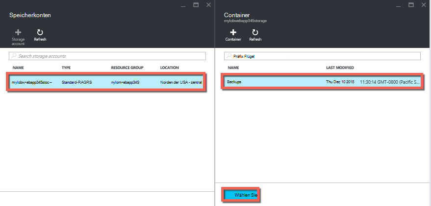
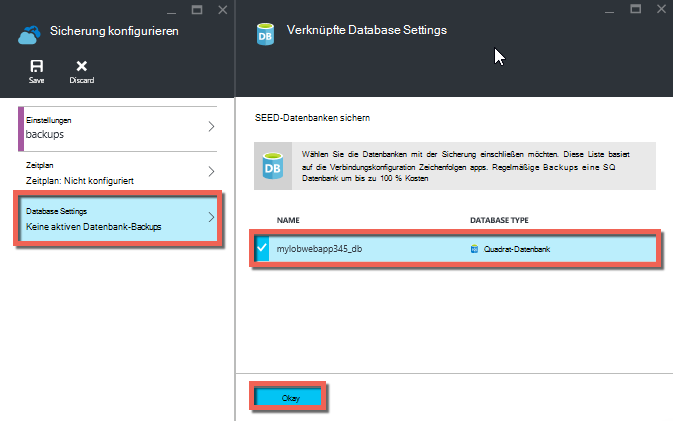
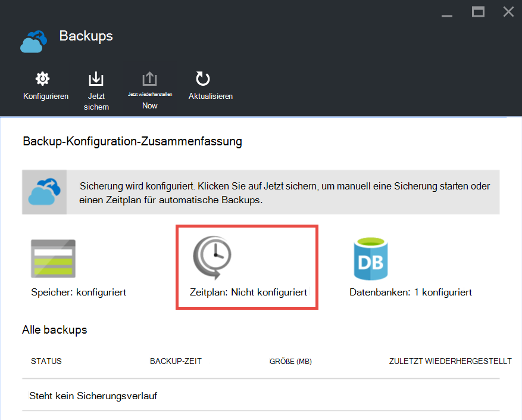

<properties 
    pageTitle="Sichern Sie Ihre Anwendung in Azure" 
    description="Informationen Sie zum Sichern von apps in Azure App Service." 
    services="app-service" 
    documentationCenter="" 
    authors="cephalin" 
    manager="wpickett" 
    editor="jimbe"/>

<tags 
    ms.service="app-service" 
    ms.workload="na" 
    ms.tgt_pltfrm="na" 
    ms.devlang="na" 
    ms.topic="article" 
    ms.date="07/06/2016" 
    ms.author="cephalin"/>

# Sichern Sie Ihre Anwendung in Azure

Sicherung und Wiederherstellung Funktion in [Azure App Service](../app-service/app-service-value-prop-what-is.md) können Sie problemlos app Backups manuell oder automatisch erstellen. Sie können Ihre app in einem früheren Zustand wiederherstellen oder eine neue Anwendung basierend auf der ursprünglichen Anwendung Backups erstellen. 

Informationen zum Wiederherstellen von einer Anwendung aus einer Sicherung finden Sie unter [Wiederherstellen eine Anwendung in Azure](web-sites-restore.md).

## Was gesichert 
App Service kann die folgenden Informationen zurück:

* App-Konfiguration
* Inhalt der Datei
* Azure SQL-Datenbanken oder Azure MySQL (ClearDB)-Datenbanken, die für Ihre Anwendung (Sie wählen können, welche in die Sicherung einschließen) verbunden

Diese Informationen unterstützt Azure Speicherkonto und Container, die Sie angeben. 

> [AZURE.NOTE] Jede Sicherung ist eine vollständige Offlinekopie Ihrer App keine inkrementelle Aktualisierung.

## Vorschriften und Einschränkungen

* Backup und Restore-Funktion erfordert App Service-Plan in der **Standard** oder höher. Weitere Informationen zum Skalieren der App Service-Plan mit einer höheren Ebene finden Sie unter [Skalieren einer Anwendung in Azure](web-sites-scale.md). Beachten Sie, dass **Premium** Tier mehr tägliche Backups als **Standard** -Stufe.
* Ein Azure-Speicher und Container in der gleichen Anmeldung als die Anwendung, die Sie sichern möchten benötigen. Weitere Informationen zu Azure Storage-Konten finden Sie unter [Links](#moreaboutstorage) am Ende dieses Artikels.
* Backups können bis zu 10 GB von Anwendung und Datenbank sein. Sie erhalten Fehler die Sicherungsgröße überschreitet diesen Grenzwert. 

## Erstellen einer manuellen Sicherung

2. In [Azure-Portal](https://portal.azure.com)zum app Blade, wählen Sie **Optionen**und **Backups**. **Backups** Blatt wird angezeigt.
    
    ![Backups Seite][ChooseBackupsPage]

    >[AZURE.NOTE]Wenn die folgende Meldung angezeigt wird, klicken Sie auf, um Ihren App Service-Plan aktualisieren, bevor Sie Backups durchführen.
Weitere Informationen finden Sie unter [Skalieren einer Anwendung in Azure](web-sites-scale.md) .  
    >

3. Klicken Sie auf Blatt **Backups** **Speicher: nicht konfiguriert** ein Speicherkonto konfigurieren.

    ![Konto auswählen][ChooseStorageAccount]
    
4. Wählen Sie Ihre Sicherungsziel auswählen ein **Speicherkonto** und **Container**. Das Speicherkonto muss das Abonnement der Anwendung angehören, die Sie sichern möchten. Wenn Sie möchten, können Sie ein neues Speicherkonto oder einen neuen Container im jeweiligen Blades erstellen. Wenn Sie fertig sind, klicken Sie auf **auswählen**.
    
    
    
5. Noch offen **Konfigurieren Backup Einstellungen** Blatt klicken Sie **Datenbank**, dann wählen Sie die Datenbanken in Backups (SQL-Datenbank oder MySQL) aufnehmen möchten, dann klicken Sie auf **OK**.  

    

    > [AZURE.NOTE]  Für eine Datenbank in der Liste angezeigt werden muss der Verbindungszeichenfolge im Abschnitt **Connection Strings** **Einstellungen** -Blades für Ihre Anwendung vorhanden sein.

6. Blade **Backup-Einstellungen konfigurieren** klicken Sie auf **Speichern**.  

7. Klicken Sie in der Befehlszeile des **Backups** Blades auf **Jetzt sichern**.
    
    ![Schaltfläche "erstellen"][BackUpNow]
    
    Eine Statusnachricht wird während der Sicherung angezeigt werden.

Nachdem Sie ein Speicherkonto und Container für Backups konfiguriert haben, können Sie eine manuelle Sicherung jederzeit machen.  

## Automatisierte Backups konfigurieren

1. Klicken Sie auf Blatt **Backups** **Zeitplan: nicht konfiguriert**. 

    
    
1. Festgelegt **auf** **Geplante Backup** -Blade **Backup Einstellungen** konfigurieren Sie den Sicherungszeitplan wie gewünscht und klicken Sie auf **OK**.
    
    ![Automatische Sicherung aktivieren][SetAutomatedBackupOn]
    
4. Noch offen **Sicherungsdateien konfigurieren** Blatt klicken Sie **Speicher**und dann Ihre Sicherungsziel auswählen ein **Speicherkonto** und **Container**. Das Speicherkonto muss das Abonnement der Anwendung angehören, die Sie sichern möchten. Wenn Sie möchten, können Sie ein neues Speicherkonto oder einen neuen Container im jeweiligen Blades erstellen. Wenn Sie fertig sind, klicken Sie auf **auswählen**.
    
    
    
5. Blatt **Backup-Einstellungen konfigurieren** klicken Sie **Datenbank**, dann wählen Sie die Datenbanken in Backups (SQL-Datenbank oder MySQL) aufnehmen möchten, dann klicken Sie auf **OK**.  

    

    > [AZURE.NOTE]  Für eine Datenbank in der Liste angezeigt werden muss der Verbindungszeichenfolge im Abschnitt **Connection Strings** **Einstellungen** -Blades für Ihre Anwendung vorhanden sein.

6. Blade **Backup-Einstellungen konfigurieren** klicken Sie auf **Speichern**.  

## Backup nur ein Teil der Anwendung

Manchmal möchten Sie alles in Ihrer Anwendung. Es folgen einige Beispiele:

-   [Richten Sie wöchentliche Backups](web-sites-backup.md#configure-automated-backups) Ihrer App mit statischem Inhalt, der Bilder oder alte Blogbeiträge nie geändert wird.
-   Ihre app muss über 10GB Inhalt (der maximale Betrag, gleichzeitig sichern können).
-   Sie möchten die Protokolldateien gesichert.

Partielle Sicherungen können Sie genau die Dateien wählen Sie sichern möchten.

### Dateien von der Sicherung ausgeschlossen

Zum Ausschließen von Dateien und Ordnern aus Sicherungskopien erstellen ein `_backup.filter` im Ordner D:\home\site\wwwroot Ihrer Anwendung, und geben Sie die Liste der Dateien und Ordner sollen vorhanden. Eine einfache Möglichkeit, Zugriff auf diese erfolgt über [Kudu-Konsole](https://github.com/projectkudu/kudu/wiki/Kudu-console). 

Nehmen Sie eine Anwendung haben, die enthält Dateien und statische Bilder aus vergangenen Jahren nie geändert werden. Sie haben bereits eine vollständige Sicherung der Anwendung, die die alte Bilder enthält. Sie möchten nun die app täglich sichern, aber Zahlen für Protokolldateien oder statische Bilddateien, die nie ändern möchten.

![Meldet Ordner][LogsFolder]
![Ordner Bilder][ImagesFolder]
    
Die unten beschriebenen Schritte zeigen wie Sie diese Dateien von der Sicherung ausschließen.

1. Gehen Sie zu `http://{yourapp}.scm.azurewebsites.net/DebugConsole` und die Ordner aus der Sicherung ausgeschlossen. In diesem Beispiel würden Sie die folgenden Dateien und Ordner in die Benutzeroberfläche angezeigt ausschließen möchten:

        D:\home\site\wwwroot\Logs
        D:\home\LogFiles
        D:\home\site\wwwroot\Images\2013
        D:\home\site\wwwroot\Images\2014
        D:\home\site\wwwroot\Images\brand.png

    [AZURE.NOTE] Die letzte Zeile zeigt, dass Einzelpersonen als auch Ordner ausschließen können.

2. Erstellen Sie eine Datei namens `_backup.filter` und die Liste oben in der Datei, sondern entfernen `D:\home`. Liste Verzeichnis oder eine Datei pro Zeile. Der Inhalt der Datei sollte folgendermaßen lauten:

    \site\wwwroot\Logs \LogFiles \site\wwwroot\Images\2013 \site\wwwroot\Images\2014 \site\wwwroot\Images\brand.PNG

3. Diese Datei zum Hochladen der `D:\home\site\wwwroot\` Verzeichnis Ihrer Website über [ftp](web-sites-deploy.md#ftp) oder eine andere Methode. Wenn Sie möchten, können die Datei direkt im `http://{yourapp}.scm.azurewebsites.net/DebugConsole` und fügen Sie den Inhalt.

4. Führen Sie Backups, [manuell](#create-a-manual-backup) oder [automatisch](#configure-automated-backups)gewohnt genauso.

Nun, Dateien und Ordner im angegebenen `_backup.filter` von der Sicherung ausgeschlossen. In diesem Beispiel werden die Protokolldateien und die Bilddateien 2013 und 2014 mehr sowie brand.png gesichert werden.

>[AZURE.NOTE] Wiederherstellen partielle Sicherung Ihrer Website wie Sie [eine regelmäßige Sicherung wiederherstellen](web-sites-restore.md). Der Wiederherstellungsvorgang wird das richtige tun.
>
>Wenn eine vollständige Sicherung wiederhergestellt wird, wird alle Inhalte auf der Website mit den in der Sicherung ersetzt. Wenn eine Datei auf der Website, aber nicht in der Sicherung gelöscht. Aber wenn eine partielle Sicherung wiederhergestellt wird, Inhalte in einer auf Verzeichnisse oder eine gesperrte Datei befindet ist.

## Speichern von Sicherungskopien

Nachdem Sie eine oder mehrere Backups für Ihre Anwendung erstellt haben, werden die Backups auf die **Container** das Speicherkonto sowie Ihre app angezeigt. In das Speicherkonto besteht jeder Sicherung eine ZIP-Datei mit der backup-Daten und XML-Datei, die ein Manifest den Inhalt der ZIP-Datei enthält. Sie extrahieren und diese Dateien durchsuchen, wenn Sie Backups zugreifen, ohne tatsächlich eine app wiederherstellen möchten.

Die Sicherung der Anwendung wird im Stammverzeichnis der ZIP-Datei gespeichert. Bei einer SQL-Datenbank Dies ist eine BACPAC (ohne Erweiterung) und importiert werden. Erstellen Sie eine neue SQL-Datenbank basierend auf den Export BACPAC finden Sie unter [Importieren einer BACPAC-Datei zum Erstellen einer neuen Datenbank](http://technet.microsoft.com/library/hh710052.aspx).

> [AZURE.WARNING] Ändern der Dateien in Ihrem **Websitebackups** -Container kann die Sicherung ungültig und daher nicht wiederherstellbar.

## Nächste Schritte
Informationen zum Wiederherstellen von einer Anwendung aus einer Sicherung finden Sie unter [Wiederherstellen eine Anwendung in Azure](web-sites-restore.md). Sie sichern und Wiederherstellen App Service apps mit REST-API (siehe [REST sichern und Wiederherstellen von App Service apps verwenden](websites-csm-backup.md)).

>[AZURE.NOTE] Wenn Sie mit Azure App Service beginnen, bevor Sie sich für ein Azure-Konto, gehen Sie [Versuchen App Service](http://go.microsoft.com/fwlink/?LinkId=523751)sofort eine kurzlebige Starter Web app in App Service können Sie erstellen. Keine Kreditkarten erforderlich; keine Zusagen.

<!-- IMAGES -->
[ChooseBackupsPage]: ./media/web-sites-backup/01ChooseBackupsPage.png
[ChooseStorageAccount]: ./media/web-sites-backup/02ChooseStorageAccount.png
[IncludedDatabases]: ./media/web-sites-backup/03IncludedDatabases.png
[BackUpNow]: ./media/web-sites-backup/04BackUpNow.png
[BackupProgress]: ./media/web-sites-backup/05BackupProgress.png
[SetAutomatedBackupOn]: ./media/web-sites-backup/06SetAutomatedBackupOn.png
[Frequency]: ./media/web-sites-backup/07Frequency.png
[StartDate]: ./media/web-sites-backup/08StartDate.png
[StartTime]: ./media/web-sites-backup/09StartTime.png
[SaveIcon]: ./media/web-sites-backup/10SaveIcon.png
[ImagesFolder]: ./media/web-sites-backup/11Images.png
[LogsFolder]: ./media/web-sites-backup/12Logs.png
[GhostUpgradeWarning]: ./media/web-sites-backup/13GhostUpgradeWarning.png
 
