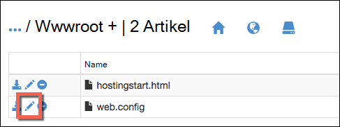

<properties
    pageTitle="Sichern Ihrer Anwendung benutzerdefinierte Domäne mit HTTPS | Microsoft Azure"
    description="Erfahren Sie, wie sicher benutzerdefinierten Domänennamen für Ihre Anwendung in Azure App Service konfigurieren eine SSL-Zertifikat-Bindung. Sie auch lernen ein SSL-Zertifikat aus verschiedenen Tools zu."
    services="app-service"
    documentationCenter=".net"
    authors="cephalin"
    manager="wpickett"
    editor="jimbe"
    tags="top-support-issue"/>

<tags
    ms.service="app-service"
    ms.workload="na"
    ms.tgt_pltfrm="na"
    ms.devlang="na"
    ms.topic="article"
    ms.date="08/08/2016"
    ms.author="cephalin"/>

# Sichern Sie Ihrer Anwendung benutzerdefinierte Domäne mit HTTPS

> [AZURE.SELECTOR]
- [SSL-Zertifikat in Azure kaufen](web-sites-purchase-ssl-web-site.md)
- [Verwenden Sie SSL-Zertifikat aus](web-sites-configure-ssl-certificate.md)

Dieser Artikel veranschaulicht das Web app, Backend-mobile-app oder eine API-app in [Azure App Service](../app-service/app-service-value-prop-what-is.md) , einen benutzerdefinierten Domänennamen verwendet, HTTPS aktivieren. Nur-Server-Authentifizierung behandelt. Gegenseitige Authentifizierung (einschließlich Clientauthentifizierung), finden Sie unter [Wie auf TLS gegenseitige Authentifizierung konfigurieren für App](app-service-web-configure-tls-mutual-auth.md).

Sichern mit HTTPS eine Anwendung, die einen benutzerdefinierten Domänennamen verfügt, fügen Sie ein Zertifikat für diesen Domänennamen. Standardmäßig schützt Azure die ** \*. *.azurewebsites.NET** Platzhalterdomäne mit einem einzigen SSL-Zertifikat, damit Ihre Kunden bereits Ihre app zugreifen können * *https://*&lt;Anwendungsname >*. *.azurewebsites.NET**. Aber wenn Sie eine benutzerdefinierte Domäne verwenden möchten, wie **www.contoso.com contoso.com**, ****, und ** \*. contoso.com**, das Standardzertifikat kann nicht gesichert werden, die. Darüber hinaus ist das Standardzertifikat wie alle [Platzhalterzertifikate](https://casecurity.org/2014/02/26/pros-and-cons-of-single-domain-multi-domain-and-wildcard-certificates/)nicht so sicher wie mit einer benutzerdefinierten Domäne ein Zertifikat für die benutzerdefinierte Domäne.   

>[AZURE.NOTE] Sie erhalten Hilfe von Azure-Experten jederzeit [Azure-Foren](https://azure.microsoft.com/support/forums/). Persönlichen Support [Azure](https://azure.microsoft.com/support/options/) unterstützt und auf **Unterstützung erhalten**.

## Was Sie benötigen
Sichern Sie Ihre benutzerdefinierten Domänennamen mit HTTPS binden Sie ein SSL-Zertifikat auf die benutzerdefinierte Domäne in Azure. Bevor ein Zertifikat eine Bindung, müssen Sie Folgendes:

- **Konfigurieren der benutzerdefinierten Domäne** - App Service einfügen nur ein Zertifikat für einen Domänennamen, der bereits in Ihrer Anwendung konfiguriert ist. Eine Anleitung finden Sie in der [Karte eines benutzerdefinierten Domänennamen auf eine Azure-Anwendung](web-sites-custom-domain-name.md). 
- **Skalieren auf grundlegende Ebene oder höher** App Service-Pläne in niedrigeren Tarifen unterstützen keine benutzerdefinierten Zertifikate. Eine Anleitung finden Sie unter [Skalieren einer Anwendung in Azure](web-sites-scale.md). 
- **SSL-Zertifikat** - Wenn Sie noch nicht vorhanden sind, müssen Sie von einer vertrauenswürdigen [Zertifizierungsstelle](http://en.wikipedia.org/wiki/Certificate_authority) (CA). Das Zertifikat muss folgenden entsprechen:

    - Es wird von einer vertrauenswürdigen Zertifizierungsstelle (keine privaten Server CA) signiert.
    - Es enthält einen privaten Schlüssel.
    - Es ist für den Schlüsselaustausch erstellt und exportiert ein. PFX-Datei.
    - Mindestens 2048-Bit-Verschlüsselung verwendet.
    - Der Antragstellername stimmt der benutzerdefinierte Domäne zu sichern. Um mehrere Domänen mit einem Zertifikat zu sichern, müssen Sie ein Platzhalterzeichen verwenden (z. B. ** \*. contoso.com**) oder SubjectAltName Werte angeben.
    - Es ist mit allen **[Zwischenzertifikaten](http://en.wikipedia.org/wiki/Intermediate_certificate_authorities)** der Zertifizierungsstelle verwendet zusammengeführt. Andernfalls kann nachvollziehbar Interoperabilität Probleme auf einigen Clients ausführen.

        >[AZURE.NOTE] Die einfachste Möglichkeit, ein SSL-Zertifikat zu erhalten, der Mindestanforderungen erfüllt, ist         [im Azure-Portal direkt kaufen](web-sites-purchase-ssl-web-site.md). Dieser Artikel beschreibt wie Sie manuell und bindet es an Ihre benutzerdefinierte Domain in App Service.
        >   
        > **Elliptic Curve Cryptography (ECC) Zertifikate** funktionieren mit App aber außerhalb des Bereichs dieses Artikels. Arbeiten Sie mit der Zertifizierungsstelle die Schritte zum Erstellen von ECC-Zertifikaten.

## Schritt 1. Abrufen eines SSL-Zertifikats

Da das SSL-Zertifikat verschiedene zu verschiedenen Preisen bereit, sollten Sie zunächst entscheiden, welche Art von SSL-Zertifikat erwerben. Um einen einzigen Domänennamen (**www.contoso.com**) sichern, genügt eine einfache Zertifikat. Mehrere Domänennamen sichern (**contoso.com** *und* **www.contoso.com** 
*und* **mail.contoso.com**), benötigen Sie ein [Platzhalter-Zertifikat](http://en.wikipedia.org/wiki/Wildcard_certificate) oder ein Zertifikat mit [Alternativen Antragstellernamen](http://en.wikipedia.org/wiki/SubjectAltName) (`subjectAltName`).

Sobald also welches SSL-Zertifikat kaufen senden eine CSR Certificate Signing Request () an die Zertifizierungsstelle. Wenn Sie angeforderte Zertifikat von der Zertifizierungsstelle zurückkehren, generieren Sie eine PFX-Datei aus dem Zertifikat. Führen Sie diese Schritte mit dem Tool Ihrer Wahl. Hier werden Hinweise gängige Tools:

- [Certreq.exe Schritte](#bkmk_certreq) – das Windows-Dienstprogramm zum Erstellen von Zertifikaten. Es wurde seit Windows XP/Windows Server 2000 Teil von Windows.
- [IIS-Manager-Schritte](#bkmk_iismgr) - Wahl, wenn Sie bereits vertraut sind.
- [OpenSSL Schritte](#bkmk_openssl) – ein [Open Source-Plattform - Programm](https://www.openssl.org). Verwenden Sie ein SSL-Zertifikat von einer beliebigen Plattform optimal nutzen können.
- [SubjectAltName Schritte OpenSSL](#bkmk_subjectaltname) - erste Schritte `subjectAltName` Zertifikate.

Ggf. in App Service Testen vor dem Erwerb eines Zertifikats können Sie ein [selbst signiertes Zertifikat](https://en.wikipedia.org/wiki/Self-signed_certificate)generieren. Dieses Lernprogramm zeigt zwei Methoden zum erzeugen:

- [Selbstsigniertes Zertifikat Certreq.exe Schritte](#bkmk_sscertreq)
- [Selbstsigniertes Zertifikat OpenSSL-Schritte](#bkmk_ssopenssl)

### Ein Zertifikat mit Certreq.exe

1. Erstellen Sie eine Datei (z. B. **myrequest.txt**), und kopieren Sie den folgenden Text hinein und im Arbeitsverzeichnis gespeichert. Ersetzen Sie die `<your-domain>` Platzhalter mit den benutzerdefinierten Domänennamen Ihrer App.

        [NewRequest]
        Subject = "CN=<your-domain>"  ; E.g. "CN=www.contoso.com", or "CN=*.contoso.com" for a wildcard certificate
        Exportable = TRUE
        KeyLength = 2048              ; Required minimum is 2048
        KeySpec = 1
        KeyUsage = 0xA0
        MachineKeySet = True
        ProviderName = "Microsoft RSA SChannel Cryptographic Provider"
        ProviderType = 12
        HashAlgorithm = SHA256

        [EnhancedKeyUsageExtension]
        OID=1.3.6.1.5.5.7.3.1         ; Server Authentication

    Weitere Informationen zu den Optionen in der CSR und andere finden Sie in der [Referenzdokumentation Certreq](https://technet.microsoft.com/library/dn296456.aspx).

4. In einer Befehlszeile `CD` in Ihr Verzeichnis und führen den folgenden Befehl der Kundenservicemitarbeiter erstellt:

        certreq -new myrequest.txt myrequest.csr

    **myRequest.CSR** wird nun im aktuellen Arbeitsverzeichnis erstellt.

5. **Myrequest.csr** für eine Zertifizierungsstelle ein SSL-Zertifikat zu senden. Sie laden Sie die Datei oder den Inhalt in einem Webformular in einem Texteditor kopieren.

    Eine Liste von Microsoft vertrauenswürdige Zertifizierungsstellen finden Sie unter [Microsoft vertrauenswürdigen Root Certificate Program: Teilnehmer][cas].

6. Sobald die Zertifizierungsstelle ein Zertifikat reagiert hat (. (CER)-Datei, speichern Sie es in Ihrem Arbeitsverzeichnis. Führen Sie den folgenden Befehl ausstehende CSR abgeschlossen.

        certreq -accept -user <certificate-name>.cer

    Mit diesem Befehl wird das fertige Zertifikat im Windows-Zertifikatspeicher.

6. Wenn Zwischenzertifikaten die Zertifizierungsstelle verwendet wird, installieren Sie sie, bevor Sie fortfahren. Sie kommen in der Regel als separater Download der Zertifizierungsstelle und in verschiedenen Formaten für unterschiedliche Web Server-Typen. Wählen Sie die Version für Microsoft IIS.

    Nachdem die Zertifikate heruntergeladen haben, mit der rechten Maustaste in Windows Explorer, und wählen Sie  **Zertifikat installieren**. Verwenden Sie die Standardwerte im **Zertifikatimport-Assistenten**, und wählen Sie **Weiter** , bis der Import abgeschlossen ist.

7. Um das SSL-Zertifikat aus dem Zertifikatspeicher zu exportieren, drücken Sie die `Win` + `R` und **certmgr.msc** Certificate Manager starten. Wählen Sie **Persönliche** > **Zertifikate**. In der Spalte **Ausgestellt für** sollte Sie sehen einen Eintrag mit benutzerdefinierten Domänennamen, der CA verwendet, um das Zertifikat in der Spalte **Ausgestellt von** generieren.

    ![Bild von Cert Manager hier einfügen][certmgr]

9. Maustaste auf das Zertifikat und wählen **Alle** > **Exportieren**. Klicken Sie im **Assistenten**auf **Weiter**, wählen Sie **Ja, privaten Schlüssel exportieren**, und klicken Sie dann auf **Weiter** .

    ![Privaten Schlüssel exportieren][certwiz1]

10. Wählen Sie **Privater Informationsaustausch - PKCS #12**, **Alle Zertifikate im Zertifizierungspfad möglichst einbeziehen**und **alle erweiterten Eigenschaften exportieren**. Klicken Sie dann auf **Weiter**.

    ![Alle Zertifikate und erweiterte Eigenschaften][certwiz2]

11. Wählen Sie **Kennwort**eingeben und bestätigen. Klicken Sie auf **Weiter**.

    ![Geben Sie ein Kennwort][certwiz3]

12. Geben Sie einen Pfad und einen Dateinamen für das exportierte Zertifikat mit der Erweiterung **PFX**. Klicken Sie auf **Weiter** , Fertig stellen.

    ![Geben Sie einen Pfad][certwiz4]

Sie können nun App Service exportierte PFX-Datei hinzufügen. Siehe [-Schritt 2. Hochladen und binden das SSL-Zertifikat](#bkmk_configuressl).

### Ein Zertifikat mit dem IIS-Manager

1. Generieren Sie ein Kundenservicemitarbeiter mit IIS-Manager an die Zertifizierungsstelle senden. Weitere Informationen zum Generieren der CSR sehen [Eines Internet-Serverzertifikats (IIS 7)][iiscsr].

3. Ihre Kundenservicemitarbeiter an eine Zertifizierungsstelle ein Zertifikat zu senden. Eine Liste von Microsoft vertrauenswürdige Zertifizierungsstellen finden Sie unter [Microsoft vertrauenswürdigen Root Certificate Program: Teilnehmer][cas].

3. Abschließen der CSR mit dem Zertifikat die Zertifizierungsstelle an Sie sendet. Weitere Informationen zum Ausfüllen der CSR finden Sie unter [Installieren eines Internet-Serverzertifikats (IIS 7)][installcertiis].

4. Wenn Zwischenzertifikaten die Zertifizierungsstelle verwendet wird, installieren Sie sie, bevor Sie fortfahren. Sie kommen in der Regel als separater Download der Zertifizierungsstelle und in verschiedenen Formaten für unterschiedliche Web Server-Typen. Wählen Sie die Version für Microsoft IIS.

    Nachdem die Zertifikate heruntergeladen haben, mit der rechten Maustaste in Windows Explorer, und wählen Sie **Zertifikat installieren**. 
    Verwenden Sie die Standardwerte im **Zertifikatimport-Assistenten**, und wählen Sie **Weiter** , bis der Import abgeschlossen ist.

4. Exportieren Sie das SSL-Zertifikat im IIS-Manager. Weitere Informationen zum Exportieren des Zertifikats finden Sie unter [Exportieren eines Serverzertifikats (IIS 7)][exportcertiis]. 

    >[AZURE.IMPORTANT] Stellen Sie im **Zertifikatsexport-Assistenten**wählen Sie **Ja, privaten Schlüssel exportieren**  
    >
    >![Privaten Schlüssel exportieren][certwiz1]  
    >
    > und auch **Privater Informationsaustausch - PKCS #12**, **Alle Zertifikate im Zertifizierungspfad möglichst einbeziehen**und     **alle erweiterten Eigenschaften exportieren**auswählen.
    >
    >![Alle Zertifikate und erweiterte Eigenschaften][certwiz2]

Sie können nun App Service exportierte PFX-Datei hinzufügen. Siehe [-Schritt 2. Hochladen und binden das SSL-Zertifikat](#bkmk_configuressl).

### Ein Zertifikat mit OpenSSL

1. In einer Befehlszeile Terminal `CD` in ein Arbeitsverzeichnis generiert einen privaten Schlüssel und Kundenservicemitarbeiter durch Ausführen des folgenden Befehls:

        openssl req -sha256 -new -nodes -keyout myserver.key -out server.csr -newkey rsa:2048

2. Wenn Sie aufgefordert werden, geben Sie die entsprechenden Informationen ein. Zum Beispiel:

        Country Name (2 letter code)
        State or Province Name (full name) []: Washington
        Locality Name (eg, city) []: Redmond
        Organization Name (eg, company) []: Microsoft
        Organizational Unit Name (eg, section) []: Azure
        Common Name (eg, YOUR name) []: www.microsoft.com
        Email Address []:

        Please enter the following 'extra' attributes to be sent with your certificate request

        A challenge password []:

    Abschließend sollten Sie haben zwei Dateien im Arbeitsverzeichnis: **myserver.key** und **server.csr**. 
    **Server.csr** enthält die CSR, **myserver.key** später benötigen.

3. Ihre Kundenservicemitarbeiter an eine Zertifizierungsstelle ein Zertifikat zu senden. Eine Liste von Microsoft vertrauenswürdige Zertifizierungsstellen finden Sie unter [Microsoft vertrauenswürdigen Root Certificate Program: Teilnehmer][cas].

4. Sobald die Zertifizierungsstelle das angeforderte Zertifikat sendet, eine Datei namens **myserver.crt** im Arbeitsverzeichnis gespeichert. Stellt die Zertifizierungsstelle sie im Text-Format, einfach kopieren Sie den Inhalt in **myserver.crt** in einem Texteditor und speichern. Die Datei sollte wie folgt aussehen:

        -----BEGIN CERTIFICATE-----
        MIIDJDCCAgwCCQCpCY4o1LBQuzANBgkqhkiG9w0BAQUFADBUMQswCQYDVQQGEwJV
        UzELMAkGA1UECBMCV0ExEDAOBgNVBAcTB1JlZG1vbmQxEDAOBgNVBAsTB0NvbnRv
        c28xFDASBgNVBAMTC2NvbnRvc28uY29tMB4XDTE0MDExNjE1MzIyM1oXDTE1MDEx
        NjE1MzIyM1owVDELMAkGA1UEBhMCVVMxCzAJBgNVBAgTAldBMRAwDgYDVQQHEwdS
        ZWRtb25kMRAwDgYDVQQLEwdDb250b3NvMRQwEgYDVQQDEwtjb250b3NvLmNvbTCC
        ASIwDQYJKoZIhvcNAQEBBQADggEPADCCAQoCggEBAN96hBX5EDgULtWkCRK7DMM3
        enae1LT9fXqGlbA7ScFvFivGvOLEqEPD//eLGsf15OYHFOQHK1hwgyfXa9sEDPMT
        3AsF3iWyF7FiEoR/qV6LdKjeQicJ2cXjGwf3G5vPoIaYifI5r0lhgOUqBxzaBDZ4
        xMgCh2yv7NavI17BHlWyQo90gS2X5glYGRhzY/fGp10BeUEgIs3Se0kQfBQOFUYb
        ktA6802lod5K0OxlQy4Oc8kfxTDf8AF2SPQ6BL7xxWrNl/Q2DuEEemjuMnLNxmeA
        Ik2+6Z6+WdvJoRxqHhleoL8ftOpWR20ToiZXCPo+fcmLod4ejsG5qjBlztVY4qsC
        AwEAATANBgkqhkiG9w0BAQUFAAOCAQEAVcM9AeeNFv2li69qBZLGDuK0NDHD3zhK
        Y0nDkqucgjE2QKUuvVSPodz8qwHnKoPwnSrTn8CRjW1gFq5qWEO50dGWgyLR8Wy1
        F69DYsEzodG+shv/G+vHJZg9QzutsJTB/Q8OoUCSnQS1PSPZP7RbvDV9b7Gx+gtg
        7kQ55j3A5vOrpI8N9CwdPuimtu6X8Ylw9ejWZsnyy0FMeOPpK3WTkDMxwwGxkU3Y
        lCRTzkv6vnHrlYQxyBLOSafCB1RWinN/slcWSLHADB6R+HeMiVKkFpooT+ghtii1
        A9PdUQIhK9bdaFicXPBYZ6AgNVuGtfwyuS5V6ucm7RE6+qf+QjXNFg==
        -----END CERTIFICATE-----

5. Führen Sie den folgenden Befehl **myserver.key** und **myserver.crt** **myserver.pfx** exportieren in Befehlszeile Terminal:

        openssl pkcs12 -export -out myserver.pfx -inkey myserver.key -in myserver.crt

    Wenn Sie aufgefordert werden, definieren Sie ein Kennwort zum Schutz der PFX-Datei.

    > [AZURE.NOTE] Wenn Zwischenzertifikaten die Zertifizierungsstelle verwendet wird, müssen Sie angeben, mit der `-certfile` Parameter. Sie kommen in der Regel als separater Download der Zertifizierungsstelle und in verschiedenen Formaten für unterschiedliche Web Server-Typen. Wählen Sie die Version mit der `.pem` Erweiterung.
    >
    > Die `openssl -export` Befehl sieht wie im folgenden Beispiel die PFX-Datei erstellt, die Zwischenzertifikate **fortgeschrittene cets.pem** Datei enthält:
    >  
    > `openssl pkcs12 -chain -export -out myserver.pfx -inkey myserver.key -in myserver.crt -certfile intermediate-cets.pem`

Sie können nun App Service exportierte PFX-Datei hinzufügen. Siehe [-Schritt 2. Hochladen und binden das SSL-Zertifikat](#bkmk_configuressl).

### Ein SubjectAltName Zertifikat mit OpenSSL

1. Erstellen Sie eine Datei namens **sancert.cnf**und in ein Arbeitsverzeichnis speichern den folgenden Text ein:

        # -------------- BEGIN custom sancert.cnf -----
        HOME = .
        oid_section = new_oids
        [ new_oids ]
        [ req ]
        default_days = 730
        distinguished_name = req_distinguished_name
        encrypt_key = no
        string_mask = nombstr
        req_extensions = v3_req # Extensions to add to certificate request
        [ req_distinguished_name ]
        countryName = Country Name (2 letter code)
        countryName_default =
        stateOrProvinceName = State or Province Name (full name)
        stateOrProvinceName_default =
        localityName = Locality Name (eg, city)
        localityName_default =
        organizationalUnitName  = Organizational Unit Name (eg, section)
        organizationalUnitName_default  =
        commonName              = Your common name (eg, domain name)
        commonName_default      = www.mydomain.com
        commonName_max = 64
        [ v3_req ]
        subjectAltName=DNS:ftp.mydomain.com,DNS:blog.mydomain.com,DNS:*.mydomain.com
        # -------------- END custom sancert.cnf -----

    In der Zeile mit `subjectAltName`, ersetzen Sie den Wert alle Domänennamen, die Sie sichern möchten (zusätzlich zu  `commonName`). Zum Beispiel:

        subjectAltName=DNS:sales.contoso.com,DNS:support.contoso.com,DNS:fabrikam.com

    Sie müssen keines Feld ändern einschließlich `commonName`. Sie werden aufgefordert, in den nächsten Schritten angeben.

1. In einer Befehlszeile Terminal `CD` in Ihrem Verzeichnis und führen Sie folgenden Befehl:

        openssl req -sha256 -new -nodes -keyout myserver.key -out server.csr -newkey rsa:2048 -config sancert.cnf

2. Wenn Sie aufgefordert werden, geben Sie die entsprechenden Informationen ein. Zum Beispiel:

        Country Name (2 letter code) []: US
        State or Province Name (full name) []: Washington
        Locality Name (eg, city) []: Redmond
        Organizational Unit Name (eg, section) []: Azure
        Your common name (eg, domain name) []: www.microsoft.com

    Nachdem, Sie müssen zwei Dateien im Arbeitsverzeichnis: **myserver.key** und **server.csr**. 
    **Server.csr** enthält die CSR, **myserver.key** später benötigen.

3. Ihre Kundenservicemitarbeiter an eine Zertifizierungsstelle ein Zertifikat zu senden. Eine Liste von Microsoft vertrauenswürdige Zertifizierungsstellen finden Sie unter [Microsoft vertrauenswürdigen Root Certificate Program: Teilnehmer][cas].

4. Sobald die Zertifizierungsstelle das angeforderte Zertifikat sendet, eine Datei namens **myserver.crt**gespeichert. Stellt die Zertifizierungsstelle sie im Text-Format, einfach kopieren Sie den Inhalt in **myserver.crt** in einem Texteditor und speichern. Die Datei sollte wie folgt aussehen:

        -----BEGIN CERTIFICATE-----
        MIIDJDCCAgwCCQCpCY4o1LBQuzANBgkqhkiG9w0BAQUFADBUMQswCQYDVQQGEwJV
        UzELMAkGA1UECBMCV0ExEDAOBgNVBAcTB1JlZG1vbmQxEDAOBgNVBAsTB0NvbnRv
        c28xFDASBgNVBAMTC2NvbnRvc28uY29tMB4XDTE0MDExNjE1MzIyM1oXDTE1MDEx
        NjE1MzIyM1owVDELMAkGA1UEBhMCVVMxCzAJBgNVBAgTAldBMRAwDgYDVQQHEwdS
        ZWRtb25kMRAwDgYDVQQLEwdDb250b3NvMRQwEgYDVQQDEwtjb250b3NvLmNvbTCC
        ASIwDQYJKoZIhvcNAQEBBQADggEPADCCAQoCggEBAN96hBX5EDgULtWkCRK7DMM3
        enae1LT9fXqGlbA7ScFvFivGvOLEqEPD//eLGsf15OYHFOQHK1hwgyfXa9sEDPMT
        3AsF3iWyF7FiEoR/qV6LdKjeQicJ2cXjGwf3G5vPoIaYifI5r0lhgOUqBxzaBDZ4
        xMgCh2yv7NavI17BHlWyQo90gS2X5glYGRhzY/fGp10BeUEgIs3Se0kQfBQOFUYb
        ktA6802lod5K0OxlQy4Oc8kfxTDf8AF2SPQ6BL7xxWrNl/Q2DuEEemjuMnLNxmeA
        Ik2+6Z6+WdvJoRxqHhleoL8ftOpWR20ToiZXCPo+fcmLod4ejsG5qjBlztVY4qsC
        AwEAATANBgkqhkiG9w0BAQUFAAOCAQEAVcM9AeeNFv2li69qBZLGDuK0NDHD3zhK
        Y0nDkqucgjE2QKUuvVSPodz8qwHnKoPwnSrTn8CRjW1gFq5qWEO50dGWgyLR8Wy1
        F69DYsEzodG+shv/G+vHJZg9QzutsJTB/Q8OoUCSnQS1PSPZP7RbvDV9b7Gx+gtg
        7kQ55j3A5vOrpI8N9CwdPuimtu6X8Ylw9ejWZsnyy0FMeOPpK3WTkDMxwwGxkU3Y
        lCRTzkv6vnHrlYQxyBLOSafCB1RWinN/slcWSLHADB6R+HeMiVKkFpooT+ghtii1
        A9PdUQIhK9bdaFicXPBYZ6AgNVuGtfwyuS5V6ucm7RE6+qf+QjXNFg==
        -----END CERTIFICATE-----

5. Führen Sie den folgenden Befehl **myserver.key** und **myserver.crt** **myserver.pfx** exportieren in Befehlszeile Terminal:

        openssl pkcs12 -export -out myserver.pfx -inkey myserver.key -in myserver.crt

    Wenn Sie aufgefordert werden, definieren Sie ein Kennwort zum Schutz der PFX-Datei.

    > [AZURE.NOTE] Wenn Zwischenzertifikaten die Zertifizierungsstelle verwendet wird, müssen Sie angeben, mit der `-certfile` Parameter. Sie kommen in der Regel als separater Download der Zertifizierungsstelle und in verschiedenen Formaten für unterschiedliche Web Server-Typen. Wählen Sie die Version mit der `.pem` Erweiterung).
    >
    > Die `openssl -export` Befehl sieht wie im folgenden Beispiel die PFX-Datei erstellt, die Zwischenzertifikate **fortgeschrittene cets.pem** Datei enthält:
    >  
    > `openssl pkcs12 -chain -export -out myserver.pfx -inkey myserver.key -in myserver.crt -certfile intermediate-cets.pem`

Sie können nun App Service exportierte PFX-Datei hinzufügen. Siehe [-Schritt 2. Hochladen und binden das SSL-Zertifikat](#bkmk_configuressl).

### Generiert ein selbstsigniertes Zertifikat mit Certreq.exe ###

>[AZURE.IMPORTANT] Selbstsignierte Zertifikate sind nur für Testzwecke. Die meisten Browser Fehlermeldungen beim Besuch einer Website, die ein selbstsigniertes Zertifikat gesichert ist. Einige Browser verweigern selbst zu der Website navigieren. 

1. Erstellen Sie eine Textdatei (z.B. **mycert.txt**) und speichern Sie die Datei in ein Verzeichnis kopieren Sie den folgenden Text hinein. Ersetzen Sie die `<your-domain>` Platzhalter mit den benutzerdefinierten Domänennamen Ihrer App.

        [NewRequest]
        Subject = "CN=<your-domain>"  ; E.g. "CN=www.contoso.com", or "CN=*.contoso.com" for a wildcard certificate
        Exportable = TRUE
        KeyLength = 2048              ; KeyLength can be 2048, 4096, 8192, or 16384 (required minimum is 2048)
        KeySpec = 1
        KeyUsage = 0xA0
        MachineKeySet = True
        ProviderName = "Microsoft RSA SChannel Cryptographic Provider"
        ProviderType = 12
        HashAlgorithm = SHA256
        RequestType = Cert            ; Self-signed certificate
        ValidityPeriod = Years
        ValidityPeriodUnits = 1

        [EnhancedKeyUsageExtension]
        OID=1.3.6.1.5.5.7.3.1         ; Server Authentication

    Entscheidend ist `RequestType = Cert`, gibt ein selbst signiertes Zertifikat an. 
    Weitere Informationen zu den Optionen in der CSR und andere finden Sie in der [Referenzdokumentation Certreq](https://technet.microsoft.com/library/dn296456.aspx).

4. In der Befehlszeile `CD` Ihr Verzeichnis und führen Sie folgenden Befehl:

        certreq -new mycert.txt mycert.crt
    
    Jetzt ist Ihr neue selbstsignierte Zertifikat im Zertifikatspeicher installiert.

7. Um das Zertifikat aus dem Zertifikatspeicher exportieren, drücken Sie die `Win` + `R` und **certmgr.msc** Certificate Manager starten. Wählen Sie **Persönliche** > **Zertifikate**. In der Spalte **Ausgestellt für** sollte Sie sehen einen Eintrag mit benutzerdefinierten Domänennamen, der CA verwendet, um das Zertifikat in der Spalte **Ausgestellt von** generieren.

    ![Bild von Cert Manager hier einfügen][certmgr]

9. Maustaste auf das Zertifikat und wählen **Alle** > **Exportieren**. Klicken Sie im **Assistenten**auf **Weiter**, wählen Sie **Ja, privaten Schlüssel exportieren**, und klicken Sie dann auf **Weiter** .

    ![Privaten Schlüssel exportieren][certwiz1]

10. Wählen Sie **Privater Informationsaustausch - PKCS #12**, **Alle Zertifikate im Zertifizierungspfad möglichst einbeziehen**und **alle erweiterten Eigenschaften exportieren**. Klicken Sie dann auf **Weiter**.

    ![Alle Zertifikate und erweiterte Eigenschaften][certwiz2]

11. Wählen Sie **Kennwort**eingeben und bestätigen. Klicken Sie auf **Weiter**.

    ![Geben Sie ein Kennwort][certwiz3]

12. Geben Sie einen Pfad und einen Dateinamen für das exportierte Zertifikat mit der Erweiterung **PFX**. Klicken Sie auf **Weiter** , Fertig stellen.

    ![Geben Sie einen Pfad][certwiz4]

Sie können nun App Service exportierte PFX-Datei hinzufügen. Siehe [-Schritt 2. Hochladen und binden das SSL-Zertifikat](#bkmk_configuressl).

###Generiert ein selbstsigniertes Zertifikat mit OpenSSL ###

>[AZURE.IMPORTANT] Selbstsignierte Zertifikate sind nur für Testzwecke. Die meisten Browser Fehlermeldungen beim Besuch einer Website, die ein selbstsigniertes Zertifikat gesichert ist. Einige Browser verweigern selbst zu der Website navigieren. 

1. Erstellen Sie eine Textdatei namens **serverauth.cnf**, und kopieren Sie Folgendes hinein und speichern Sie sie in ein Arbeitsverzeichnis:

        [ req ]
        default_bits           = 2048
        default_keyfile        = privkey.pem
        distinguished_name     = req_distinguished_name
        attributes             = req_attributes
        x509_extensions        = v3_ca

        [ req_distinguished_name ]
        countryName         = Country Name (2 letter code)
        countryName_min         = 2
        countryName_max         = 2
        stateOrProvinceName     = State or Province Name (full name)
        localityName            = Locality Name (eg, city)
        0.organizationName      = Organization Name (eg, company)
        organizationalUnitName      = Organizational Unit Name (eg, section)
        commonName          = Common Name (eg, your app's domain name)
        commonName_max          = 64
        emailAddress            = Email Address
        emailAddress_max        = 40

        [ req_attributes ]
        challengePassword       = A challenge password
        challengePassword_min       = 4
        challengePassword_max       = 20

        [ v3_ca ]
         subjectKeyIdentifier=hash
         authorityKeyIdentifier=keyid:always,issuer:always
         basicConstraints = CA:false
         keyUsage=nonRepudiation, digitalSignature, keyEncipherment
         extendedKeyUsage = serverAuth

2. In einer Befehlszeile Terminal `CD` in Ihrem Verzeichnis und führen Sie folgenden Befehl:

        openssl req -sha256 -x509 -nodes -days 365 -newkey rsa:2048 -keyout myserver.key -out myserver.crt -config serverauth.cnf

    Dieser Befehl erstellt zwei Dateien: **myserver.crt** (Zertifikat) und **myserver.key** (private Schlüssel) basiert auf der **serverauth.cnf**.

3. Exportieren Sie das Zertifikat in eine PFX-Datei durch den folgenden Befehl ausführen:

        openssl pkcs12 -export -out myserver.pfx -inkey myserver.key -in myserver.crt

    Wenn Sie aufgefordert werden, definieren Sie ein Kennwort zum Schutz der PFX-Datei.

Sie können nun App Service exportierte PFX-Datei hinzufügen. Siehe [-Schritt 2. Hochladen und binden das SSL-Zertifikat](#bkmk_configuressl).

## Schritt 2. Hochladen Sie und binden Sie das SSL-Zertifikat

Bevor Sie fortfahren, den [gewünschten](#bkmk_domainname) Abschnitt, und überprüfen Sie, ob:

- Sie haben eine benutzerdefinierte Domäne Azure-Anwendung zugeordnet ist,
- Ihre app **grundlegende** Ebene oder höher ausgeführt wird und
- Sie müssen ein SSL-Zertifikat für die benutzerdefinierte Domäne von einer Zertifizierungsstelle.

1. Öffnen Sie in Ihrem Browser die ** [Azure Portal.](https://portal.azure.com/)**
2.  Klicken Sie auf die Option **App Service** links auf der Seite.
3.  Klicken Sie auf den Namen der Anwendung, die Sie dieses Zertifikat zuweisen möchten. 
4.  Klicken Sie in **Einstellung**auf **SSL-Zertifikate**
5.  Klicken Sie auf **Zertifikat hochladen**
6.  Wählen Sie exportierte PFX-Datei in [Schritt 1](#bkmk_getcert) , und geben Sie das Kennwort, dem Sie vor dem erstellen. Klicken Sie auf das Zertifikat hochgeladen **Hochladen** . Das hochgeladene Zertifikat in das **SSL-Zertifikat** Blade sollte jetzt angezeigt werden.
7. **SSL-Bindungen** Abschnitt auf **Bindungen hinzufügen**
8. Blatt **SSL-Bindung hinzufügen** mithilfe der Dropdown-Liste den Domänennamen mit SSL und das Zertifikat aus. Sie können auch auswählen, ob **[Server Name Angabe (SNI)](http://en.wikipedia.org/wiki/Server_Name_Indication)** verwendet oder IP basierte SSL.

    

       •    IP based SSL associates a certificate with a domain name by mapping the dedicated public IP address of the server to the domain name. This requires each domain name (contoso.com, fabricam.com, etc.) associated with your service to have a dedicated IP address. This is the traditional          method of associating SSL certificates with a web server.
       •    SNI based SSL is an extension to SSL and **[Transport Layer Security](http://en.wikipedia.org/wiki/Transport_Layer_Security)** (TLS) that allows multiple domains to share the same IP address, with separate security certificates for each domain. Most modern browsers (including Internet Explorer, Chrome, Firefox and Opera) support SNI, however older browsers may not support SNI. For more information on SNI, see the **[Server Name Indication](http://en.wikipedia.org/wiki/Server_Name_Indication)** article on Wikipedia.
     
9. Klicken Sie zum Speichern der und SSL aktivieren **Bindung hinzufügen** .

## Schritt 3. Ändern der Domäne Zuordnung (IP basierte SSL nur)

Verwenden Sie **SNI SSL** -Bindungen, überspringen Sie diesen Abschnitt. Mehrere **SNI SSL** -Bindungen können die vorhandenen freigegebenen IP-Adresse für Ihre Anwendung zusammenarbeiten. Wenn jedoch erstellen eine **IP-basiertes SSL** -Bindung erstellt App Service eine dedizierte IP-Adresse für die Bindung da **IP basierte SSL** erfordert. Nur eine IP dedizierte Adresse erstellt, deshalb nur eine **IP-basierte SSL** -Bindung hinzugefügt werden kann.

Aufgrund dieser dedizierte IP-Adresse müssen Sie Ihre Anwendung weiter konfigurieren:

- Azure-Anwendung und [einen A-Datensatz zum Zuordnen der benutzerdefinierten Domäne verwendet](web-sites-custom-domain-name.md#a) soeben eine **IP-basiertes SSL** -Bindung. In diesem Szenario müssen Sie den vorhandenen Datensatz auf die dedizierte IP-Adresse wie folgt neu zuordnen:

    1. Nach der Konfiguration eine IP-basierten SSL-Bindung, eine dedizierte IP-Adresse für Ihre Anwendung zugewiesen. Diese IP-Adresse finden Sie auf der Seite **benutzerdefinierte** unter Einstellung Ihrer Anwendung über den **Hostnamen** -Abschnitt. Es wird als **Externe IP-Adresse** aufgelistet
    
        

    2. [Den A-Datensatz für Ihren benutzerdefinierten Domänennamen diese neue IP-Adresse zuordnen](web-sites-custom-domain-name.md#a).

- Bereits ein oder mehrere **SNI SSL-** Bindungen in Ihrer app und soeben eine **IP-basiertes SSL** -Bindung. Die Bindung ist die * &lt;Anwendungsname >*. *.azurewebsites.NET Domain Name verweist auf die neue IP-Adresse. Daher alle vorhandenen [CNAME-Zuordnung der benutzerdefinierten Domäne](web-sites-custom-domain-name.md#cname) * &lt;Anwendungsname >*. *.azurewebsites.NET, einschließlich der **SNI SSL** schützen, erhält auch Datenverkehr auf die neue Adresse für die **IP-basierte SSL** nur erstellt wird. In diesem Szenario müssen Sie **SNI SSL** -Datenverkehr an die ursprüngliche gemeinsame IP-Adresse senden, folgendermaßen:

    1. Identifizieren Sie alle [CNAME-Zuordnung von benutzerdefinierten Domänen](web-sites-custom-domain-name.md#cname) für Ihre Anwendung, die eine **SNI SSL** -Bindung verfügt.

    2. Ordnen Sie jeden CNAME-Eintrag auf **Sni.** &lt;Anwendungsname >. *.azurewebsites.NET anstelle von &lt;Anwendungsname >. *.azurewebsites.NET.

## Schritt 4. Test HTTPS für Ihre benutzerdefinierte domain

Müssen nun lediglich sicherstellen, dass HTTPS für Ihre benutzerdefinierte Domain funktioniert. Wechseln Sie in verschiedenen Browsern zu `https://<your.custom.domain>` zu sehen, dass Ihre App dient.

- Wenn Ihre app bietet Zertifikatdienste Überprüfungsfehler, verwenden Sie wahrscheinlich ein selbstsigniertes Zertifikat.

- Wenn dies nicht der Fall ist, können Sie Zwischenzertifikate ausgelassen haben Ihr Zertifikat PFX-Datei exportieren. Zurück zu [Sie müssen](#bkmk_domainname) sicherstellen, dass Ihre Kundenservicemitarbeiter den Vorschriften von App-Dienst entspricht.

## HTTPS auf Ihre Anwendung erzwingen

Trotzdem den HTTP-Zugriff auf Ihre app, überspringen Sie diesen Schritt. App-Diensts *nicht* HTTPS zu erzwingen, damit Besucher weiterhin mithilfe von HTTP zugreifen können. Wenn Sie HTTPS für Ihre Anwendung erzwingen möchten, können Regel Schreiben der `web.config` -Datei für Ihre Anwendung. Jeder App Service app hat diese Datei Framework Sprache Ihrer Anwendung.

> [AZURE.NOTE] Sprachspezifische Umleitung von Anfragen ist. ASP.NET MVC können [s](http://msdn.microsoft.com/library/system.web.mvc.requirehttpsattribute.aspx) Filter anstelle der Regel Schreiben in `web.config` (finden Sie unter [Bereitstellen einer sicheren ASP.NET MVC 5 Anwendung Web App](web-sites-dotnet-deploy-aspnet-mvc-app-membership-oauth-sql-database.md)).

Gehen Sie folgendermaßen vor:

1. Navigieren Sie zum Kudu der Debug-Konsole für Ihre Anwendung. Die Adresse ist `https://<appname>.scm.azurewebsites.net/DebugConsole`.

2. In der Debugkonsole CD `D:\home\site\wwwroot`.

3. Open `web.config` Schaltfläche Stift.

    

    Wenn Sie Ihre Anwendung mit Visual Studio oder Git bereitstellen, App-Dienst generiert automatisch die `web.config` für Ihre .NET, PHP, Node.js und Python im Stammverzeichnis Anwendung. 
    Wenn `web.config` nicht vorhanden ist, führen Sie `touch web.config` in der Web-basierten Befehlszeile zu erstellen. Alternativ können Sie im lokalen Projekt erstellen und den Code erneut.

4. Wenn Sie erstellen ein `web.config`, kopieren Sie den folgenden Code ein, und speichern. Wenn vorhandene web.config öffnen, müssen Sie nur die gesamte kopieren `<rule>` tag in der `web.config` `configuration/system.webServer/rewrite/rules` Element.

        <?xml version="1.0" encoding="UTF-8"?>
        <configuration>
          <system.webServer>
            <rewrite>
              <rules>
                <!-- BEGIN rule TAG FOR HTTPS REDIRECT -->
                <rule name="Force HTTPS" enabled="true">
                  <match url="(.*)" ignoreCase="false" />
                  <conditions>
                    <add input="{HTTPS}" pattern="off" />
                  </conditions>
                  <action type="Redirect" url="https://{HTTP_HOST}/{R:1}" appendQueryString="true" redirectType="Permanent" />
                </rule>
                <!-- END rule TAG FOR HTTPS REDIRECT -->
              </rules>
            </rewrite>
          </system.webServer>
        </configuration>

    Diese Regel gibt das HTTPS-Protokoll HTTP 301 (permanente Umleitung), wenn der Benutzer eine Seite über HTTP angefordert. Umgeleitet von http://contoso.com zu https://contoso.com.

    >[AZURE.IMPORTANT] Gibt es bereits andere `<rule>` tags in der `web.config`, platzieren Sie die kopierten `<rule>` Tag vor den anderen `<rule>` Tags.

4. Speichern Sie die Datei in der Debug-Konsole Kudu. Sollten wirksam alle Anfragen sofort zu HTTPS umleiten.

Weitere Informationen zu IIS-URL Rewrite-Modul finden Sie in der [URL Rewrite](http://www.iis.net/downloads/microsoft/url-rewrite) -Dokumentation.

## Weitere Ressourcen ##
- [Microsoft Azure Trust Center](/support/trust-center/security/)
- [Konfigurationsoptionen in Azure Websites entsperrt](/blog/2014/01/28/more-to-explore-configuration-options-unlocked-in-windows-azure-web-sites/)
- [Aktivieren des Diagnoseprotokolls](web-sites-enable-diagnostic-log.md)
- [Webapps in Azure App Service konfigurieren](web-sites-configure.md)
- [Azure-Verwaltungsportal](https://manage.windowsazure.com)

>[AZURE.NOTE] Wenn Sie mit Azure App Service beginnen, bevor Sie sich für ein Azure-Konto, gehen Sie [Versuchen App Service](http://go.microsoft.com/fwlink/?LinkId=523751)sofort eine kurzlebige Starter-app in App Service können Sie erstellen. Keine Kreditkarten erforderlich; keine Zusagen.

[customdomain]: web-sites-custom-domain-name.md
[iiscsr]: http://technet.microsoft.com/library/cc732906(WS.10).aspx
[cas]: http://social.technet.microsoft.com/wiki/contents/articles/31634.microsoft-trusted-root-certificate-program-participants-v-2016-april.aspx
[installcertiis]: http://technet.microsoft.com/library/cc771816(WS.10).aspx
[exportcertiis]: http://technet.microsoft.com/library/cc731386(WS.10).aspx
[openssl]: http://www.openssl.org/
[portal]: https://manage.windowsazure.com/
[tls]: http://en.wikipedia.org/wiki/Transport_Layer_Security
[staticip]: ./media/web-sites-configure-ssl-certificate/staticip.png
[website]: ./media/web-sites-configure-ssl-certificate/sslwebsite.png
[scale]: ./media/web-sites-configure-ssl-certificate/sslscale.png
[standard]: ./media/web-sites-configure-ssl-certificate/sslreserved.png
[pricing]: /pricing/details/
[configure]: ./media/web-sites-configure-ssl-certificate/sslconfig.png
[uploadcert]: ./media/web-sites-configure-ssl-certificate/ssluploadcert.png
[uploadcertdlg]: ./media/web-sites-configure-ssl-certificate/ssluploaddlg.png
[sslbindings]: ./media/web-sites-configure-ssl-certificate/sslbindings.png
[sni]: http://en.wikipedia.org/wiki/Server_Name_Indication
[certmgr]: ./media/web-sites-configure-ssl-certificate/waws-certmgr.png
[certwiz1]: ./media/web-sites-configure-ssl-certificate/waws-certwiz1.png
[certwiz2]: ./media/web-sites-configure-ssl-certificate/waws-certwiz2.png
[certwiz3]: ./media/web-sites-configure-ssl-certificate/waws-certwiz3.png
[certwiz4]: ./media/web-sites-configure-ssl-certificate/waws-certwiz4.png

