<properties
    pageTitle="Verbinden Sie eine Webanwendung in Azure App Service Redis Cache Protokoll Memcache | Microsoft Azure"
    description="Herstellen Sie eine Webanwendung in Azure App Service Redis Cache über das Memcache-Protokoll"
    services="app-service\web"
    documentationCenter="php"
    authors="SyntaxC4"
    manager="wpickett"
    editor="riande"/>

<tags
    ms.service="app-service-web"
    ms.devlang="php"
    ms.topic="get-started-article"
    ms.tgt_pltfrm="windows"
    ms.workload="na"
    ms.date="02/29/2016"
    ms.author="cfowler"/>

# <a name="connect-a-web-app-in-azure-app-service-to-redis-cache-via-the-memcache-protocol"></a>Redis Cache Protokoll Memcache Web-app in Azure App Service herstellen

In diesem Artikel lernen Sie [Azure Redis Cache] eine WordPress Web app in [Azure App Service](http://go.microsoft.com/fwlink/?LinkId=529714) Verbindung[ 12] mit [Memcache] [ 13] Protokoll. Haben Sie eine vorhandene Webanwendung, die einen Memcached Server im Arbeitsspeicher Zwischenspeichern verwendet, können Sie Azure App Service migrieren und mit Erstanbieter-caching-Lösung in Microsoft Azure mit wenig oder ganz ohne Anwendungscode. Darüber hinaus können Sie Ihre vorhandene Memcache Fachwissen zu hochgradig skalierbare verteilte apps in Azure App Service mit Azure Redis Cache im Arbeitsspeicher Zwischenspeichern mit gängigen Anwendungsframeworks wie .NET, PHP, Node.js, Java und Python.  

App Service Web Apps kann dieses Szenario mit Web Apps Memcache-Shim, die ein lokaler Memcached Server als Proxy Memcache fungiert für Aufrufe von Azure Redis Cache zwischenspeichern. Dadurch wird jede Anwendung kommuniziert mit dem Memcache-Protokoll zum Zwischenspeichern von Daten mit Redis Cache. Das Memcache-Shim funktioniert auf der Protokollebene Anwendung oder Anwendungsframework kann daher verwendet werden, solange er kommuniziert mit dem Memcache-Protokoll.

[AZURE.INCLUDE [app-service-web-to-api-and-mobile](../../includes/app-service-web-to-api-and-mobile.md)] 

## <a name="prerequisites"></a>Erforderliche Komponenten

Web Apps Memcache-Shim kann mit jeder Anwendung verwendet werden, sofern kommuniziert mit dem Memcache-Protokoll. Dieses Beispiel ist die Anwendung Verweis eine skalierbare WordPress Website, die aus dem Markt Azure bereitgestellt werden kann.

Befolgen Sie die Schritte in den folgenden Artikeln:

* [Bereitstellen Sie eine Instanz des Azure Redis][0]
* [Bereitstellung einer skalierbaren WordPress-Website in Azure][1]

Haben Sie skalierbare WordPress Website bereitgestellt und eine Redis Cacheinstanz bereitgestellt werden Sie bereit für Memcache-Shim in Azure App Service Web Apps aktivieren.

## <a name="enable-the-web-apps-memcache-shim"></a>Web Apps-Memcache-Shim aktivieren

Memcache-Shim zu konfigurieren, müssen Sie drei Appeinstellungen erstellen. Dies kann mit verschiedenen Methoden der [Azure-Portal](http://go.microsoft.com/fwlink/?LinkId=529715), das [Verwaltungsportal]einschließlich[3], [Azure PowerShell-Cmdlets] [ 5] oder der [Azure-Befehlszeilenschnittstelle][5]. Für die Zwecke dieser Beitrag werde [Azure-Portal] verwenden[ 4] app-Einstellungen festgelegt. Die folgenden Werte können aus **Einstellungen** Blade Redis Cache-Instanz abgerufen werden.

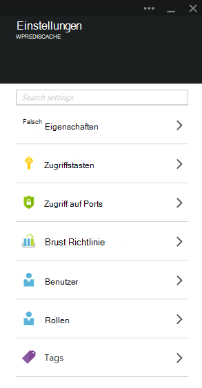

### <a name="add-redishost-app-setting"></a>REDIS_HOST app Einstellung hinzufügen

Die erste app Sie erstellen müssen ist die **REDIS\_HOST** app festlegen. Diese Einstellung legt das Ziel, das Shim Cacheinformationen weiterleitet. Der Wert für die Einstellung REDIS_HOST app erforderlich kann aus dem **Eigenschaften** -Blade Redis Cache-Instanz abgerufen werden.

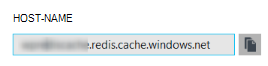

Legen Sie den Schlüssel der app-Einstellung, **REDIS\_HOST** und dem Wert der Einstellung app, der **Hostname** des Redis Cacheinstanz.

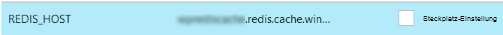

### <a name="add-rediskey-app-setting"></a>REDIS_KEY app Einstellung hinzufügen

Die zweite Anwendung Sie erstellen müssen ist die **REDIS\_KEY** app festlegen. Diese Einstellung bietet das Authentifizierungstoken sicher auf die Redis Cacheinstanz erforderlich. Sie können den Wert für die Einstellung REDIS_KEY app **Zugriffstasten** Blade Redis Cache-Instanz erforderlich abrufen.

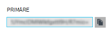

Legen Sie den Schlüssel der app-Einstellung, **REDIS\_Schlüssel** und dem Wert der app-Einstellung für den **Primärschlüssel** Redis Cache-Instanz.

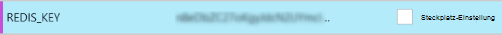

### <a name="add-memcacheshimredisenable-app-setting"></a>MEMCACHESHIM_REDIS_ENABLE app Einstellung hinzufügen

Die letzte app dient das Memcache Shim Web Apps verwendet die REDIS_HOST und REDIS_KEY Verbinden mit Azure Redis Cache und des Caches aufgerufen. Legen Sie den Schlüssel der app-Einstellung, **MEMCACHESHIM\_REDIS\_können** und den Wert **true**.


Anschließend werden drei (3) app-Einstellungen hinzufügen klicken Sie auf **Speichern**.

## <a name="enable-memcache-extension-for-php"></a>Memcache-Erweiterung für PHP aktivieren

Damit die Anwendung das Memcache-Protokoll sprechen muss die Erweiterung Memcache PHP - Framework Sprache für Ihre WordPress-Website installieren.

### <a name="download-the-phpmemcache-extension"></a>Php_memcache-Erweiterung herunterladen

Navigieren Sie zu [PECL][6]. Klicken Sie unter Kategorie Zwischenspeichern auf [Memcache][7]. Klicken Sie in der Spalte Downloads DLL.

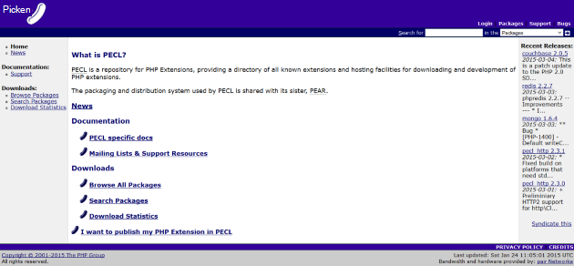

Download-Link nicht Thread sicher (NTS) X86 Version von PHP im Web Apps aktiviert. (Standard ist PHP 5.4)

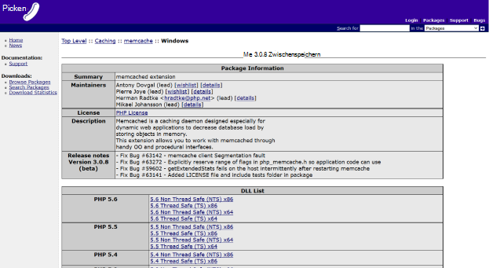

### <a name="enable-the-phpmemcache-extension"></a>Php_memcache-Erweiterung aktivieren

Nach dem Herunterladen der Datei extrahieren und laden die **Php\_memcache.dll** in der **d\\home\\Website\\Wwwroot\\Bin\\Ext\\ ** Verzeichnis. Nachdem die php_memcache.dll in der Webanwendung hochgeladen wurde, müssen Sie die Erweiterung der PHP-Laufzeit. Aktivieren Sie die Memcache-Erweiterung in Azure-Verwaltungsportal **Einstellungen** -Blades für Web app öffnen und fügen Sie eine neue Einstellung für die Anwendung mit der **PHP\_EXTENSIONS** und der **Bin\\Ext\\php_memcache.dll**.


> [AZURE.NOTE] Wenn die Web app mehrere PHP-Erweiterungen geladen, sollte der Wert des PHP_EXTENSIONS eine durch Kommas getrennte Liste von relativen Pfaden auf DLL-Dateien.


Wenn abgeschlossen, klicken Sie auf **Speichern**.

## <a name="install-memcache-wordpress-plugin"></a>Memcache WordPress Plug-in installieren

> [AZURE.NOTE] Sie können auch WordPress.org [Memcached Objekt Cache-Plug-in](https://wordpress.org/plugins/memcached/) herunterladen.

WordPress-Plugin-Seite klicken Sie auf **Hinzufügen**.


Geben Sie im Suchfeld **Memcached** , und drücken Sie die **EINGABETASTE**.

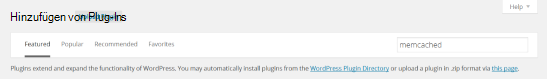

Finden Sie **Memcached Objektcache** in der Liste, dann klicken Sie auf **Jetzt installieren**.

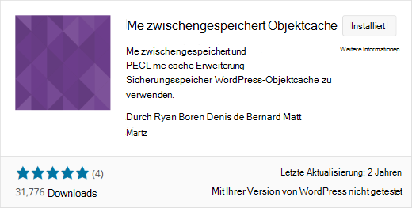

### <a name="enable-the-memcache-wordpress-plugin"></a>Memcache WordPress-Plug-in aktivieren

>[AZURE.NOTE] Gehen Sie in diesem Blog [Erweiterung Site im Web Apps aktivieren] [ 8] , Visual Studio Team Services installieren.

In der `wp-config.php` Datei, fügen Sie den folgenden Code über dem Symbol Kommentar am Ende der Datei bearbeiten.

```php
$memcached_servers = array(
    'default' => array('localhost:' . getenv("MEMCACHESHIM_PORT"))
);
```

Nachdem dieser Code eingefügt, wird das Dokument Monaco automatisch gespeichert.

Im nächste Schritt soll das Plugin Objektcache. Dies geschieht durch Ziehen und Ablegen von **Objekt cache.php** **wp-Content/Plugins/Memcached** Ordner Ordner **wp-Content** Memcache Objektcache Funktionen aktivieren.

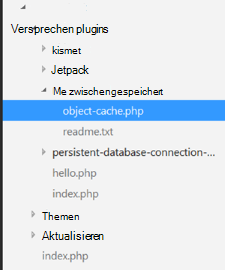

Damit die **Objekt-cache.php** -Datei im Ordner **wp-Content ist** ist jetzt Memcached Objektcache aktiviert.

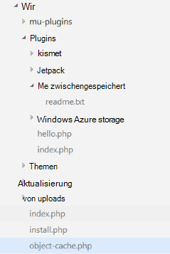

## <a name="verify-the-memcache-object-cache-plugin-is-functioning"></a>Überprüfen Sie, ob Memcache Objektcache Plugin funktioniert

Alle Vorgehensweise Web Apps Memcache-Shim sind jetzt abgeschlossen. Nur noch ist zu überprüfen, ob die Daten die Redis Cacheinstanz auffüllen.

### <a name="enable-the-non-ssl-port-support-in-azure-redis-cache"></a>Aktivieren Sie nicht-SSL-Port-Unterstützung in Azure Redis Cache

>[AZURE.NOTE] Zum Zeitpunkt der Abfassung dieses Artikels unterstützt Redis die CLI keine SSL-Verbindung, so sind folgende Schritte erforderlich.

Suchen Sie in Azure-Verwaltungsportal Redis Cache-Instanz, die für diese Webanwendung erstellt. Sobald der Cache Blade geöffnet ist, klicken Sie auf **das Symbol** .

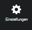

Wählen Sie aus der Liste **Zugriff auf Ports** .

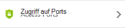

**Zugriff nur über SSL**klicken Sie auf **Nein** .

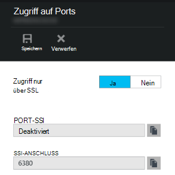

Sie sehen, dass der nicht-SSL-Port nun. Klicken Sie auf **Speichern**.

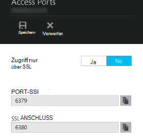

### <a name="connect-to-azure-redis-cache-from-redis-cli"></a>Verbindung mit Azure Redis Cache von Redis-cli

>[AZURE.NOTE] Dieser Schritt setzt voraus, dass Redis lokal auf dem Entwicklungscomputer installiert ist. [Installieren Sie lokal mit diesen Redis][9].

Öffnen Sie die Befehlszeilenkonsole Wahl, und geben Sie folgenden Befehl:

```shell
redis-cli –h <hostname-for-redis-cache> –a <primary-key-for-redis-cache> –p 6379
```

Ersetzen der ** &lt;Hostname für Redis Cache&gt; ** mit den tatsächlichen xxxxx.redis.cache.windows.net Hostnamen und ** &lt;primärer Schlüssel für Redis Cache&gt; ** die Zugriffstaste für den Cache, dann drücken Sie die **EINGABETASTE**. Nachdem die CLI auf die Redis Cacheinstanz verbunden, alle Redis Befehl. Im Screenshot unten habe ich die Schlüssel aufgelistet.

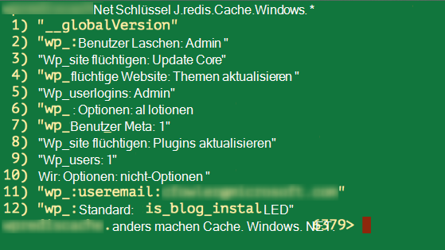

Der Aufruf der Schlüssel aufgelistet sollte einen Wert zurückgeben. Wenn nicht, versuchen Sie zu Web app navigieren und es erneut versuchen.

## <a name="conclusion"></a>Abschluss

Herzlichen Glückwunsch! WordPress app verfügt jetzt über eine zentralisierte Cachespeicher um Durchsatz erhöhen. Beachten Sie, dass mit jedem Client Memcache Programmiersprache unabhängig Anwendungsframework Web Apps Memcache-Shim verwendet werden kann. Ihr Feedback übermitteln oder Shim Web Apps Memcache Buchen auf [MSDN-Foren] Fragen[ 10] oder [Stackoverflow][11].

>[AZURE.NOTE] Wenn Sie mit Azure App Service beginnen, bevor Sie sich für ein Azure-Konto, gehen Sie [Versuchen App Service](http://go.microsoft.com/fwlink/?LinkId=523751)sofort eine kurzlebige Starter Web app in App Service können Sie erstellen. Keine Kreditkarten erforderlich; keine Zusagen.

## <a name="whats-changed"></a>Was hat sich geändert
* Eine Anleitung zur Änderung von Websites zu App Service finden Sie unter: [Azure App Service und ihre Auswirkung auf vorhandene Azure Services](http://go.microsoft.com/fwlink/?LinkId=529714)


[0]: ../redis-cache/cache-dotnet-how-to-use-azure-redis-cache.md#create-a-cache
[1]: http://bit.ly/1t0KxBQ
[2]: http://manage.windowsazure.com
[3]: http://portal.azure.com
[4]: ../powershell-install-configure.md
[5]: /downloads
[6]: http://pecl.php.net
[7]: http://pecl.php.net/package/memcache
[8]: http://blog.syntaxc4.net/post/2015/02/05/how-to-enable-a-site-extension-in-azure-websites.aspx
[9]: http://redis.io/download#installation
[10]: https://social.msdn.microsoft.com/Forums/home?forum=windowsazurewebsitespreview
[11]: http://stackoverflow.com/questions/tagged/azure-web-sites
[12]: /services/cache/
[13]: http://memcached.org
