<properties
   pageTitle="Erstellen Sie eine ASP.NET 5 Web app im Visual Studio-Code"
   description="In diesem Lernprogramm veranschaulicht erstellen Sie eine ASP.NET 5 Web-Anwendung mit Visual Studio."
   services="app-service\web"
   documentationCenter=".net"
   authors="erikre"
   manager="wpickett"
   editor="jimbe"/>

<tags
    ms.service="app-service-web" 
    ms.workload="web" 
    ms.tgt_pltfrm="dotnet" 
    ms.devlang="na" 
    ms.topic="article" 
    ms.date="02/26/2016" 
    ms.author="cephalin"/>

# Erstellen Sie eine ASP.NET 5 Web app im Visual Studio-Code

## Übersicht

In diesem Lernprogramm wird veranschaulicht, wie ASP.NET 5 Web app mit [Visual Studio (VS Code)](http://code.visualstudio.com//Docs/whyvscode) erstellen und [Azure App](../app-service/app-service-value-prop-what-is.md)Service bereitstellen. 

> [AZURE.NOTE] Obwohl webapps dieser Artikel verweist, gilt jedoch auch für API-apps und apps. 

ASP.NET 5 ist eine bedeutende Überarbeitung von ASP.NET. ASP.NET 5 ist eine neue Open Source- und plattformübergreifende Framework zum Erstellen von modernen Cloud-basierten webapps mit .NET. Weitere Informationen finden Sie unter [Einführung in ASP.NET 5](http://docs.asp.net/en/latest/conceptual-overview/aspnet.html). Informationen über Azure App Service webapps Übersicht [Web Apps](app-service-web-overview.md).

[AZURE.INCLUDE [app-service-web-try-app-service.md](../../includes/app-service-web-try-app-service.md)]

## Erforderliche Komponenten  

* Installieren von [VS-Code](http://code.visualstudio.com/Docs/setup).
* Installation [Node.js](http://nodejs.org) - Node.js ist eine Plattform für schnelle und skalierbare Server mit JavaScript erstellen. Knoten der Laufzeit (Knoten), und [Npm](http://www.npmjs.com/) ist der Paket-Manager für Knoten Module. Npm verwendet eine ASP.NET 5 Web app in diesem Lernprogramm Gerüst.
* Git - Installieren von Eigenschaftenfenstern installieren: [Chocolatey](https://chocolatey.org/packages/git) oder [Git scm.com](http://git-scm.com/downloads). Neue Git hingegen [Git scm.com](http://git-scm.com/downloads) auswählen und die Option **mit**Git aus der Windows-Befehlszeile. Nach der Installation von Git müssen Sie auch Benutzernamen Git und wie später im Lernprogramm erforderlich ist (bei Commit VS Code).  

## Installieren Sie ASP.NET 5 und DNX
ASP.NET 5/DNX (.NET Execution Environment) ist eine schlanke .NET für moderne Cloud und webapps, OS X, Linux und Windows ausgeführt. Es wurde von Grund auf neu aufgebaut zu einer optimierten Entwicklungsframework für apps, die in der Cloud bereitgestellt oder lokal ausführen. Es besteht aus modularen Komponenten mit minimalem Aufwand Flexibilität beim Erstellen von Projektmappen zu behalten.

Dieses Lernprogramm soll Einstieg mit den neuesten entwicklungsversionen von ASP.NET 5 und DNX erstellen. Die folgenden Schritte sind spezifisch für Windows. Weitere Installationshinweise für OS X, Linux und Windows finden Sie unter [Installieren von ASP.NET 5 und DNX](https://code.visualstudio.com/Docs/ASPnet5#_installing-aspnet-5-and-dnx). 

1. .NET Version Manager (DNVM) in Windows installieren, öffnen Sie ein Eingabeaufforderungsfenster und führen Sie den folgenden Befehl.

        @powershell -NoProfile -ExecutionPolicy unrestricted -Command "&{$Branch='dev';iex ((new-object net.webclient).DownloadString('https://raw.githubusercontent.com/aspnet/Home/dev/dnvminstall.ps1'))}"

    Dadurch wird das Skript DNVM herunterladen und es in Ihrem Benutzerprofil-Verzeichnis. 

2. **Windows neu starten** zum Abschließen der Installation DNVM. 

    Nach dem Neustart von Windows können zu den Speicherort des DNVM überprüfen, indem Sie Folgendes eingeben öffnen:

        where dnvm

    Die Befehlszeile wird einen Pfad ähnlich der folgenden angezeigt.

    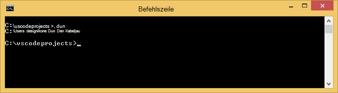

3. Jetzt haben Sie DNVM verwenden es Sie DNX führen Sie die Anwendung herunterladen. Führen Sie folgenden Befehl:

        dnvm upgrade

    Überprüfen Sie Ihre DNVM und zeigen Sie aktive Laufzeit an, indem Sie folgenden Befehl eingeben:

        dnvm list

    Die Befehlszeile zeigt die Details der aktiven Laufzeit.

    

    Wenn mehrere DNX Runtime aufgeführt ist, können Sie folgende (oder eine aktuellere Version) in der Befehlszeile die aktive DNX Laufzeit festgelegt. Legen sie auf dieselbe Version von ASP.NET 5-Generator beim Erstellen Ihrer Anwendung später in diesem Lernprogramm verwendet wird. *Sie müssen nicht aktive Laufzeit ändern, wenn die aktuellsten festgelegt ist.*

        dnvm use 1.0.0-update1 –p

> [AZURE.NOTE] Weitere Installationshinweise für OS X, Linux und Windows finden Sie unter [Installieren von ASP.NET 5 und DNX](https://code.visualstudio.com/Docs/ASPnet5#_installing-aspnet-5-and-dnx). 

## Web app erstellen 

In diesem Abschnitt wird veranschaulicht, wie eine neue Anwendung ASP.NET Web app Gerüst. Verwenden Sie im Knoten Package Manager (Npm) [Yeoman](http://yeoman.io/) installieren (Anwendung Gerüstbau Tool - VS Code Äquivalent von Visual Studio **Datei > Neues Projekt** Operation), [schwierige](http://gruntjs.com/) (JavaScript Task Runner) und [Bower](http://bower.io/) (Client Side Package Manager). 

1. Öffnen Sie ein Eingabeaufforderungsfenster mit Administratorrechten, und navigieren Sie zum Speicherort, in dem Sie ASP.NET Projekt erstellen möchten. Beispielsweise erstellen Sie ein *Vscodeprojects* -Verzeichnis im Stammverzeichnis von Laufwerk C:\.

2. Geben Sie Folgendes an der Befehlszeile Yeoman und unterstützende Tools installieren.

        npm install -g yo grunt-cli generator-aspnet bower

    > [AZURE.NOTE] Sie erhalten eine Warnung darauf hindeutet, dass die Npm-Version veraltet ist. Diese Warnung sollte in diesem Lernprogramm nicht beeinträchtigen.

3. Geben Sie Folgendes an der Befehlszeile zu dem Projektordner Gerüst der app.

        yo aspnet

4. Mithilfe der Pfeiltasten zum **Web Application Basic** ASP.NET 5-Generator, und drücken Sie auswählen ** &lt;Enter >**.

    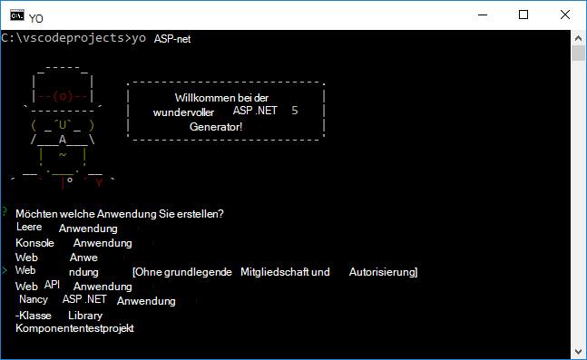

5. Der Name der neuen ASP.NET Web app auf **SampleWebApp**festgelegt. Dieser Name in dieser praktischen Einführung verwendet wird, wenn Sie einen anderen Namen auswählen, müssen Sie für jedes Vorkommen von **SampleWebApp**ersetzen. Drücken Sie ** &lt;Enter >**, Yeoman erstellt einen neuen Ordner namens **SampleWebApp** und die erforderlichen Dateien für Ihre neue Anwendung.

6. Wechseln Sie an der Befehlszeile in neuen Projektordner:

        cd SampleWebApp

7. Auch an der Befehlszeile zum Installieren der erforderlichen NuGet-Pakete zum Ausführen der Anwendung geben Sie den folgenden Befehl:

        dnu restore

8. Öffnen Sie VS Code in der Befehlszeile Folgendes eingeben:

        code .

## Die Webanwendung lokal ausführen

Sie haben die Web App und die NuGet-Pakete für die Anwendung abgerufen, können Sie Web app lokal ausführen.

1. Geben Sie den **Befehlspalette** in VS Code zum Anzeigen der verfügbaren Befehle ausführen Folgendes ein:

        dnx: Run Command

    > [AZURE.NOTE] Wenn der Omnisharp-Server nicht ausgeführt wird, wird es gestartet. Geben Sie den obigen Befehl.

    Wählen Sie anschließend den folgenden Befehl zum Ausführen Ihrer Anwendung:
        
        dnx web - (SampleWebApp)

    Das Befehlsfenster wird angezeigt, dass die Anwendung gestartet wurde. Überprüfen Sie im Befehlsfenster diese Meldung angezeigt wird, die unteren linken corning VS Code Fehler in Ihrem Projekt.
    
    > [AZURE.NOTE]Befehl der **Befehlspalette** erfordert ein **>** Zeichen am Anfang der Befehlszeile. Sie können die Details in der Datei *project.json* Befehl **Web** anzeigen.   
    > Wenn der Befehl nicht angezeigt oder nicht verfügbar ist, müssen Sie die C#-Erweiterung zu installieren. Ausführen `>Extensions: Install Extension` und `ext install c#` C# Extensions installieren.

2. Öffnen Sie einen Browser, und navigieren Sie zur folgenden URL.

    **http://localhost:5000**

    Die Standardseite der Web-app wird wie folgt angezeigt.

    

3. Schließen Sie den Browser. Drücken Sie **STRG + C** Anwendung und schließen Sie das **Befehlsfenster**, im **Befehlsfenster**. 

## Erstellen einer Webanwendung in Azure-Portal

Folgende Schritte führen Sie durch Erstellen einer Webanwendung in Azure-Portal.

1. [Azure-Portal](https://portal.azure.com)anmelden.

2. Klicken Sie auf **neu** oben links auf dem Portal.

3. Klicken Sie auf **Web-Apps > Web App**.

    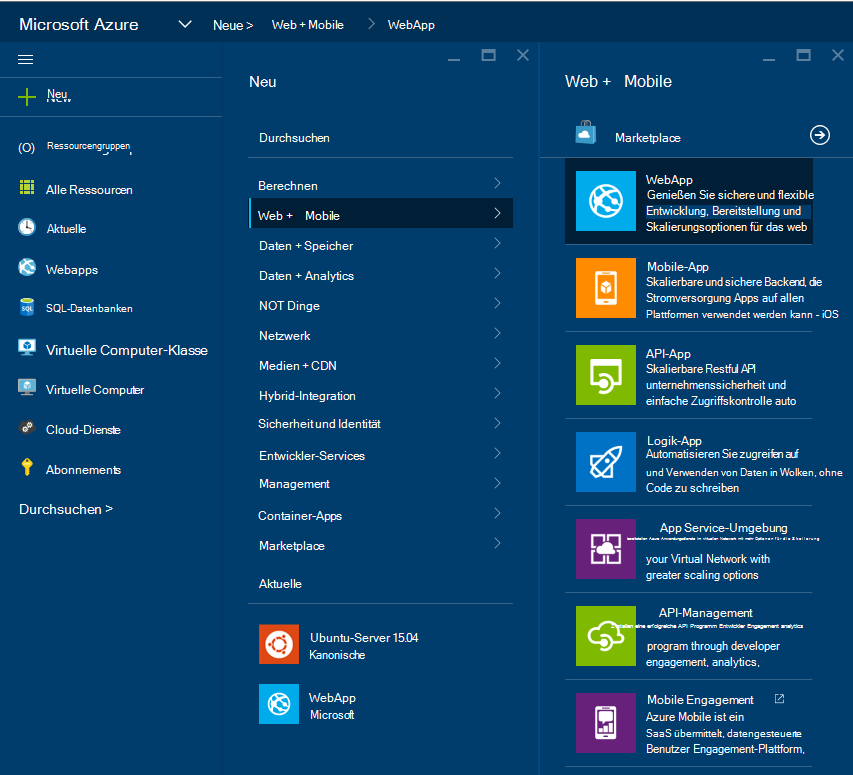

4. Geben Sie einen **Namen**wie **SampleWebAppDemo**. Hinweis Dieser Name muss eindeutig sein und das Portal erzwingen, dass beim eingeben. Wenn Sie geben einen anderen Wert wählen, müssen Sie daher den Wert für jedes Vorkommen von **SampleWebAppDemo** ersetzt werden, die Sie in diesem Lernprogramm finden Sie unter. 

5. Wählen Sie einen vorhandenen **App Service-Plan** oder erstellen Sie eine neue. Wenn Sie einen neuen Plan erstellen, wählen Sie den Tarif, Position und andere Optionen. Weitere Informationen zu App Service-Pläne finden Sie im Artikel [Azure App Service-Pläne ausführliche Übersicht](../app-service/azure-web-sites-web-hosting-plans-in-depth-overview.md).

    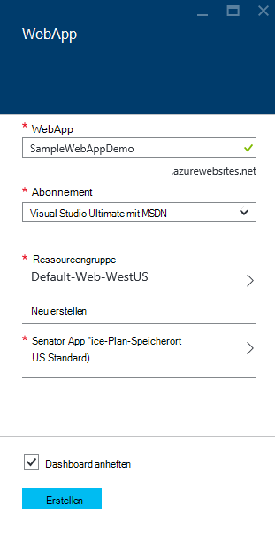

6. Klicken Sie auf **Erstellen**.

    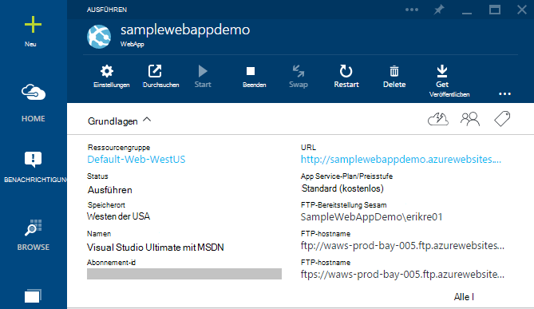

## Git Veröffentlichung für neue Web app aktivieren

Git ist ein verteiltes Versionskontrollsystem, mit denen Sie Ihrer Anwendung Azure App Service bereitstellen. Speichern Sie den Code Ihrer Anwendung in einem lokalen Repository Git schreibe und Code werden auf einem remote-Repository in Azure bereitstellen.   

1. [Azure-Portal](https://portal.azure.com)anmelden.

2. Klicken Sie auf **Durchsuchen**.

3. Klicken Sie auf **Web Apps** zum Anzeigen einer Liste von Web apps Azure-Abonnement zugeordnet.

4. Wählen Sie die in diesem Lernprogramm erstellt Web app.

5. **Klicken Sie in der Web-app Blade-** > **kontinuierliche Bereitstellung**. 

    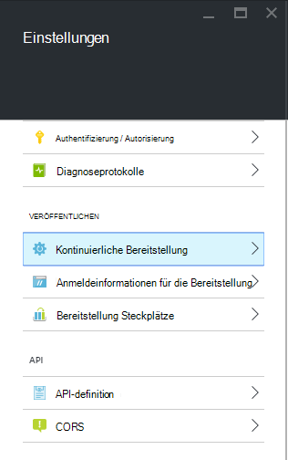

6. Klicken Sie auf **Wählen > Git-Repository**.

7. Klicken Sie auf **OK**.

    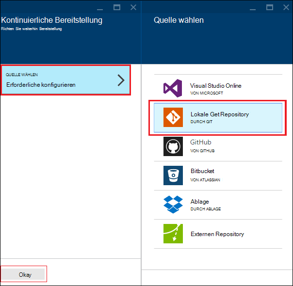

8. Wenn Sie Anmeldeinformationen für die Veröffentlichung von Web-app oder andere App Service-app Bereitstellung zuvor nicht eingerichtet haben, richten Sie diese jetzt:

    * **Klicken Sie** > **Bereitstellung Anmeldeinformationen**. **Bereitstellung Benutzerinformationen** Blatt wird angezeigt.

    * Erstellen Sie einen Benutzernamen und ein Kennwort.  Sie benötigen dieses Kennwort später, wenn Git einrichten.

    * Klicken Sie auf **Speichern**.

9. Klicken Sie in Ihrem Web app Blade auf **Settings > Eigenschaften**. **GIT URL**wird die URL der remote Git Repository, dem Sie bereitstellen werden angezeigt.

10. Kopieren Sie den **GIT URL** -Wert für die spätere Verwendung in der praktischen Einführung.

    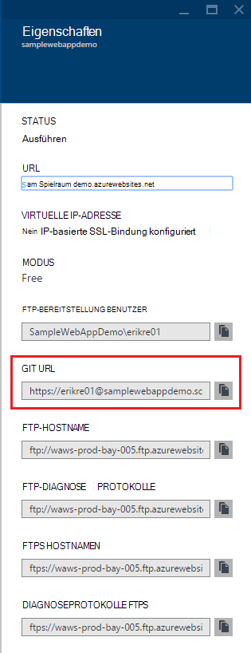

## Veröffentlichen Sie Ihrer Anwendung in Azure App Service

In diesem Abschnitt werden Sie ein lokales Git Repository und Push Repository Azure bereitstellen Ihrer Anwendung in Azure erstellen.

1. VS-Code die Option **Git** , in der linken Navigationsleiste.

    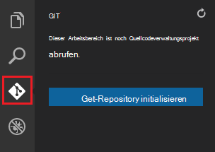

2. Wählen Sie achten Arbeitsbereich Quellcodeverwaltungsprojekt Git **Git Repository zu initialisieren** . 

    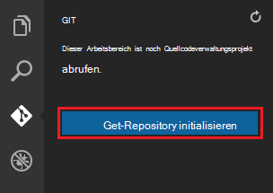

3. Das Befehlsfenster geöffnet, und wechseln Sie in das Verzeichnis Ihrer Anwendung. Geben Sie den folgenden Befehl:

        git config core.autocrlf false

    Dieser Befehl verhindert ein Problem Text, CRLF enden und LF enden beteiligt sind.

4. VS-Code fügen Sie eine Nachricht hinzu und klicken Sie **Commit aller** Kontrollkästchen.

    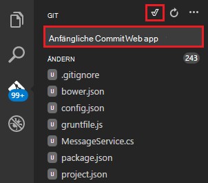

5. Wenn Git Verarbeitung abgeschlossen ist, sehen Sie keine Dateien im Fenster Git unter **Änderungen**aufgelistet. 

    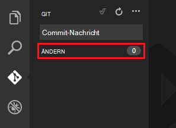

6. Ändern Sie in das Befehlsfenster, zeigt die Befehlszeile in das Verzeichnis, in Ihrer Anwendung befindet.

7. Erstellen Sie eine remote-Referenz dafür Updates zu Ihrer Anwendung mithilfe der Git URL (Ende in ".git"), die Sie zuvor kopiert.

        git remote add azure [URL for remote repository]

8. Konfigurieren Sie Git um Ihre Anmeldeinformationen lokal speichern, um sie an Ihre Push-Befehle von VS-Code generiert automatisch angehängt werden.

        git config credential.helper store

9. Drücken Sie Ihre Änderungen in Azure durch Eingabe des folgenden Befehls. Nach dieser anfänglichen Push in Azure werden Sie dazu alle Push-Befehle von VS-Code. 

        git push -u azure master

    Sie werden für das Kennwort in Azure erstellt. **Hinweis: Ihr Kennwort wird nicht angezeigt.**

    Die Ausgabe des obigen Befehls endet mit einer Meldung, dass die Bereitstellung erfolgreich war.

        remote: Deployment successful.
        To https://user@testsite.scm.azurewebsites.net/testsite.git
        [new branch]      master -> master

> [AZURE.NOTE] Wenn Sie Ihre Anwendung ändern, können Sie direkt im VS-Code über die integrierte Git der Option **Alle Commit** gefolgt von der Option **Push** veröffentlichen. Sie finden die Option **Push** im Dropdown-Menü neben die Schaltflächen **Alle Commit** und **Aktualisieren** zur Verfügung.

Möchten Sie an einem Projekt arbeiten, sollten Sie GitHub zwischen auf Azure pushen.

## Führen Sie die Anwendung in Azure
Damit Sie Ihrer Anwendung bereitgestellt haben, führen wir app während in Azure gehostet. 

Dies kann auf zwei Arten erfolgen:

* Öffnen Sie einen Browser, und geben Sie den Namen Ihrer Anwendung wie folgt.   

        http://SampleWebAppDemo.azurewebsites.net
 
* Suchen Sie im Portal Azure Web app Blade für Ihr Web app und klicken Sie auf **Durchsuchen** , um Ihre app anzeigen 
* im Standardbrowser.

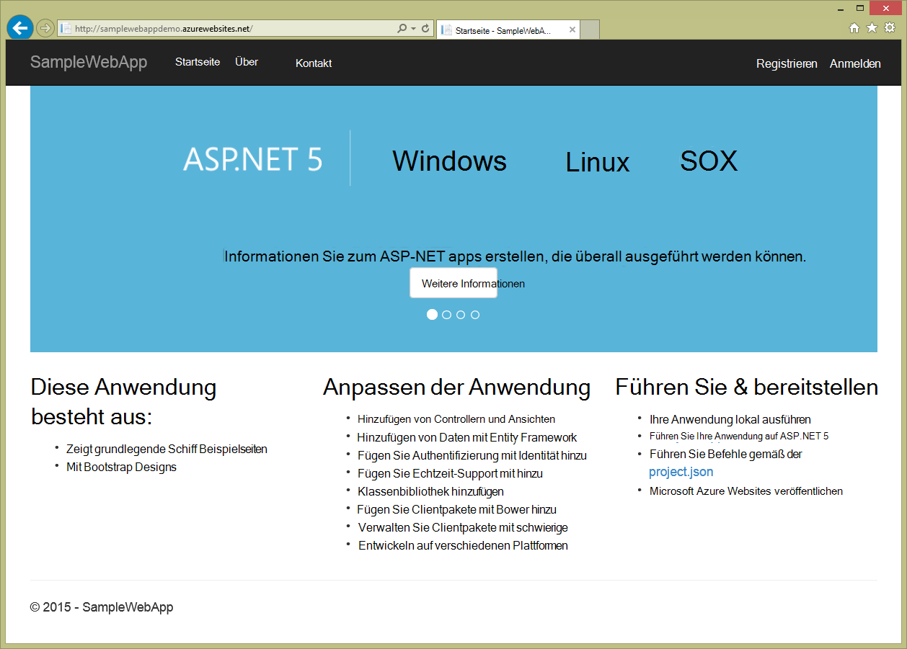

## Zusammenfassung
In diesem Lernprogramm haben Sie gelernt, wie Web-app in VS Code erstellen und in Azure bereitgestellt. Weitere Informationen über VS-Code finden Sie im Artikel [Warum Visual Studio Code?](https://code.visualstudio.com/Docs/) Informationen zu App Service webapps Übersicht [Web Apps](app-service-web-overview.md). 
