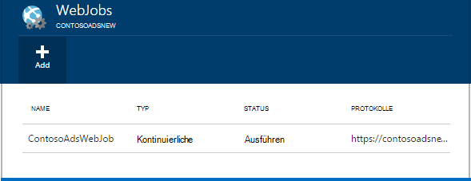
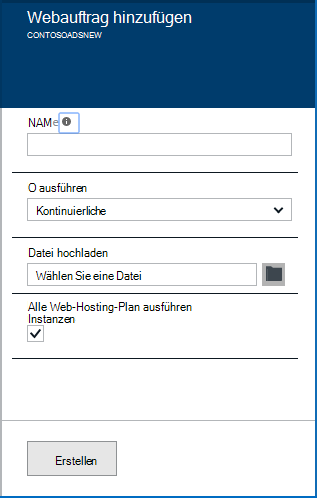
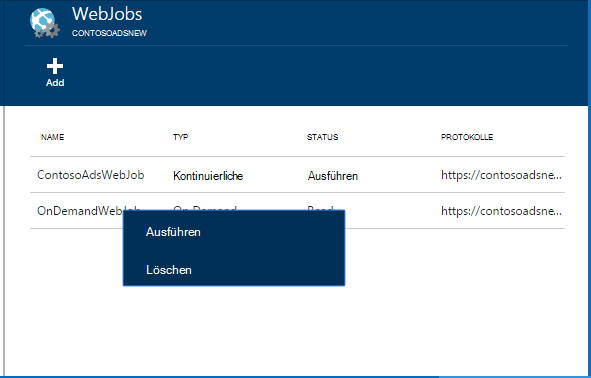
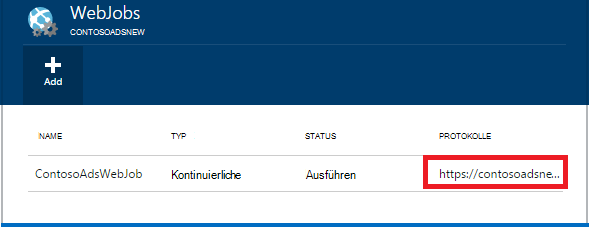

<properties 
    pageTitle="Mit Webaufträge Hintergrundaufgaben ausführen" 
    description="Erfahren Sie in Azure webapps Hintergrundaufgaben ausführen." 
    services="app-service" 
    documentationCenter="" 
    authors="tdykstra" 
    manager="wpickett" 
    editor="jimbe"/>

<tags 
    ms.service="app-service" 
    ms.workload="na" 
    ms.tgt_pltfrm="na" 
    ms.devlang="na" 
    ms.topic="article" 
    ms.date="04/27/2016" 
    ms.author="tdykstra"/>

# <a name="run-background-tasks-with-webjobs"></a>Mit Webaufträge Hintergrundaufgaben ausführen

## <a name="overview"></a>Übersicht

Sie können Programme oder Skripts in Webaufträge ausführen, in Ihrer Anwendung auf drei Arten [App Service](http://go.microsoft.com/fwlink/?LinkId=529714) : bei Bedarf, oder nach einem Zeitplan. Es ist ohne Zusatzkosten Webaufträge verwenden.

Dieser Artikel veranschaulicht das Webaufträge mithilfe der [Azure-Portal](https://portal.azure.com)bereitstellen. Informationen zum Bereitstellen von Visual Studio oder ein kontinuierlicher Prozess finden Sie unter [Bereitstellen von Azure Webaufträge Web Apps](websites-dotnet-deploy-webjobs.md).

Azure Webaufträge SDK vereinfacht viele Webaufträge Programmieraufgaben. Weitere Informationen finden Sie unter [Webaufträge SDK](websites-dotnet-webjobs-sdk.md).

 Azure Funktionen (derzeit in Vorschau) ist, Programme und Skripts in Azure App Service ausgeführt. Weitere Informationen finden Sie unter [Übersicht über Azure-Funktionen](../azure-functions/functions-overview.md).

[AZURE.INCLUDE [app-service-web-to-api-and-mobile](../../includes/app-service-web-to-api-and-mobile.md)] 

## <a name="acceptablefiles"></a>Zulässige Dateitypen für Skripts oder Programme

Die folgenden Dateitypen werden akzeptiert:

* cmd, bat, .exe (mit Windows Cmd)
* ps1 (mit Powershell)
* .sh (mit Bash)
* PHP (mit Php)
* .py (mit Python)
* js (mit Knoten)
* JAR (mit Java)

## <a name="CreateOnDemand"></a>Erstellen einer auf Anforderung Webauftrags im portal

1. Klicken Sie auf Blatt **Web App** [Azure-Portal](https://portal.azure.com) **Alle Einstellungen > Webaufträge** Blade **Webaufträge** angezeigt.
    
    
    
5. Klicken Sie auf **Hinzufügen**. Das Dialogfenster **Webauftrags hinzufügen** .
    
    
    
2. Bieten Sie unter **Name**einen Namen für den Webauftrag. Der Name muss mit einem Buchstaben oder einer Zahl beginnen und keine Sonderzeichen als "-" und "_".
    
4. Wählen Sie im **ausführen wie** **bei Bedarf ausführen**.
    
3. Klicken Sie im **Dateiupload** auf das Ordnersymbol, und navigieren Sie zu der Zip-Datei, die das Skript enthält. Die Zip-Datei sollte die ausführbare Datei (.exe cmd bat .sh .php .py js) sowie alle unterstützenden Dateien benötigt das Programm oder Skript ausgeführt.
    
5. Überprüfen Sie **Erstellen** , um das Skript in Ihrer Anwendung hochladen. 
    
    Der Name für den Webauftrag angegebene erscheint in der Liste auf die **Webaufträge** .
    
6. Führen Sie den Webauftrag seinen Namen in der Liste und **führen**.
    
    
    
## <a name="CreateContinuous"></a>Ständig laufende Webauftrags erstellen

1. Erstellen Sie eine ständig ausgeführten Webauftrags dieselben Schritte zum Erstellen von Webauftrags führt einmal, aber im Feld **ausführen wie** **fortlaufend**auswählen.

2. Starten oder Beenden einer kontinuierlichen Webauftrags, Webauftrag aus und **Starten** oder **Beenden**.
    
> [AZURE.NOTE] Ihrer Anwendung auf mehr als eine Instanz ausgeführt wird, wird ständig ausgeführten Webauftrags für alle Instanzen ausgeführt. Auf Anforderung und geplante Webaufträge ausführen in einer einzigen Instanz für einen Lastenausgleich durch Microsoft Azure ausgewählt.
    
> Für fortlaufende Webaufträge zuverlässig und alle Instanzen aktivieren die immer * Einstellung für das Web app sonst sie beendet können, sobald der SCM Hostwebsite zu lange im Leerlauf.

## <a name="CreateScheduledCRON"></a>Erstellen einer geplanten Webauftrag mit einem CRON-Ausdruck

Dieses Verfahren steht Web Apps in Basic, Standard oder Premium-Modus ausgeführt und erfordert die Einstellung **Immer auf** die Anwendung aktiviert werden.

Einfach um ein Webauftrag auf Anforderung in einem geplanten Webauftrags wiederum enthalten eine `settings.job` Datei im Stammverzeichnis Ihrer Webauftrags Zip-Datei. Diese JSON-Datei sollte ein `schedule` mit einem [CRON-Ausdruck](https://en.wikipedia.org/wiki/Cron)pro Beispiel.

CRON-Ausdruck besteht aus 6 Felder: `{second} {minute} {hour} {day} {month} {day of the week}`.

Z. B. der Webauftrag alle 15 Minuten Auslösen der `settings.job` müssten:

```json
{
    "schedule": "0 */15 * * * *"
}
``` 

Andere Beispiele CRON Zeitplan:

- Stündlich (d. h. wenn die Anzahl der Minuten 0 ist):`0 0 * * * *` 
- Stündlich von 9: 00 bis 17:`0 0 9-17 * * *` 
- 9:30 Uhr täglich:`0 30 9 * * *`
- 9:30 Uhr jeden Wochentag:`0 30 9 * * 1-5`

**Hinweis**: Webauftrag aus Visual Studio bereitstellen, achten Sie markieren die `settings.job` Dateieigenschaften wie "Kopieren, wenn neuer".


## <a name="CreateScheduled"></a>Erstellen einer geplanten Webauftrag mit Azure Scheduler

Das folgende alternative Verfahren nutzt Azure Scheduler. In diesem Fall muss der Webauftrag nicht direkte Kenntnis des Zeitplans. Azure Scheduler wird stattdessen so konfiguriert, dass der Webauftrag planmäßig ausgelöst. 

Azure-Portal nicht noch geplanten Webauftrags erstellen, aber bis Feature hinzugefügt wird, Sie können es tun mit dem [Verwaltungsportal](http://manage.windowsazure.com).

1. Im [Verwaltungsportal](http://manage.windowsazure.com) Webauftrags Seite, und klicken Sie auf **Hinzufügen**.

1. Wählen Sie im **wie Ausführung** **nach einem Zeitplan ausgeführt**.
    
    ![Neuer geplanter Auftrag][NewScheduledJob]
    
2. Wählen Sie den **Bereich Planer** für Ihren Auftrag und klicken Sie auf den Pfeil rechts unten im Dialogfeld auf der nächsten Seite fortgesetzt.

3. Wählen Sie im Dialogfeld **Projekt erstellen** der **Serie** soll: **einmal** oder **wiederholt Einzelvorgang**.
    
    ![Serie planen][SchdRecurrence]
    
4. Wählen Sie auch **eine Startzeit** : **jetzt** oder **zu einem bestimmten Zeitpunkt**.
    
    ![Startzeit planen][SchdStart]
    
5. Möchten Sie zu einem bestimmten Zeitpunkt starten, wählen Sie die Startwerte Zeit unter **Starten auf**.
    
    ![Terminplan-Anfang zu einem bestimmten Zeitpunkt][SchdStartOn]
    
6. Ein wiederkehrendes Projekt ausgewählt haben, haben Sie die **Wiederholen jede** die Häufigkeit und die Option **Enden** an eine Endzeit angeben.
    
    ![Serie planen][SchdRecurEvery]
    
7. Wenn Sie **Wochen**auswählen, können Sie **In einem bestimmten Zeitplan** aktivieren und die Tage der Woche, die der Auftrag ausgeführt werden soll.
    
    ![Planen der Wochentage][SchdWeeksOnParticular]
    
8. Wenn Sie **Monate** auswählen das **Auf bestimmten Zeitplan** , setzen Sie Auftrag auf bestimmten nummerierten **Tagen** des Monats ausgeführt. 
    
    ![Bestimmte Datumsangaben im Monat][SchdMonthsOnPartDays]
    
9. Wenn Sie **Wochentage**auswählen, können Sie der Tag / die Tage der Woche im Monat auswählen der Auftrag ausgeführt werden soll.
    
    ![Bestimmte Wochentage monatlich planen][SchdMonthsOnPartWeekDays]
    
10. Schließlich können Sie die Option **Vorkommen** die Woche im Monat auswählen verwenden (erste, zweite, dritte usw.) soll den Auftrag an den Wochentagen ausgeführt angegebene.
    
    ![Planen Sie bestimmte Wochentage bestimmte Wochen eines Monats][SchdMonthsOnPartWeekDaysOccurences]
    
11. Nachdem Sie einen oder mehrere Einzelvorgänge erstellt haben, werden ihre Namen auf der Registerkarte Webaufträge Statusberichte Zeitplantyp und andere Informationen angezeigt. Verlaufsdaten für die letzten 30 Webaufträge bleibt.
    
    ![Projektliste][WebJobsListWithSeveralJobs]
    
### <a name="Scheduler"></a>Geplante Aufträge und Azure Scheduler

Geplante Aufträge können weitere Seiten Azure Scheduler [Verwaltungsportal](http://manage.windowsazure.com)konfiguriert werden.

1.  Klicken Sie auf der Seite Webaufträge den Auftrag **Zeitplan** Azure Scheduler Portalseite navigieren. 
    
    ![Link zu Azure Scheduler][LinkToScheduler]
    
2. Klicken Sie auf der Seite Zeitplan auf den Auftrag.
    
    ![Auftrag auf der Portalseite Planer][SchedulerPortal]
    
3. **Auftragsaktion** -Seite öffnet, das Projekt weiter konfigurieren können. 
    
    ![Auftragsaktion PageInScheduler][JobActionPageInScheduler]
    
## <a name="ViewJobHistory"></a>Den Auftragsverlauf anzeigen

1. Klicken Sie die Ausführungschronik eines Auftrags einschließlich WebJobs SDK erstellten Aufträge die entsprechende Verknüpfung Spalte **Protokolle** Webaufträge Blade. (Das Symbol der Zwischenablage können Sie auf die URL der protokollseite in die Zwischenablage kopieren, wenn Sie möchten.)
    
    
        
2. Den Link öffnet die Detailseite für den Webauftrag. Diese Seite zeigt den Namen des Befehls letzte Mal lief, ausgeführt und den Erfolg oder Misserfolg. Klicken Sie unter **aktuelle Job ausgeführt wird**auf Weitere Details.
    
    ![WebJobDetails][WebJobDetails]
    
3. Die Seite **Testlaufdetails Webauftrag** wird. Klicken Sie auf **Umschalten Ausgabe** der Text den Inhalt des Protokolls angezeigt. Das Ausgabelog wird im Text-Format. 
    
    ![Webauftrag Details ausführen][WebJobRunDetails]
    
4. Klicken Sie den Ausgabetext in einem separaten Browserfenster den Link **download** . Den Text selbst herunterladen Maustaste auf den Link und verwenden Sie Ihren Browser-Optionen, um den Inhalt der Datei speichern.
    
    ![Ausgabe herunterladen][DownloadLogOutput]
    
5. **Webaufträge** Link am oberen Rand der Seite bequem zu einer Liste von Webaufträge Armaturenbrett Geschichte.
    
    ![Webaufträge Liste verknüpfen][WebJobsLinkToDashboardList]
    
    ![Liste der Webaufträge Geschichte Dashboard][WebJobsListInJobsDashboard]
    
    Auf einen dieser Links gelangen Sie zur Seite Webauftrags Details für den ausgewählten Auftrag.


## <a name="WHPNotes"></a>Notizen
    
- Webapps im freien Modus können nach 20 Minuten gibt es keine Anfragen Scm (Bereitstellung) und Web app Portal in Azure nicht geöffnet werden. Anfragen an die aktuelle Website werden dadurch nicht zurückgesetzt.
- Code für einen kontinuierlichen Auftrag muss in einer Endlosschleife ausgeführt geschrieben werden.
- Kontinuierliche Aufträge kontinuierlich nur ausgeführt, wenn die Webanwendung ist.
- Grundlegende und Standardmodi Angebot immer auf, die bei Aktivierung verhindert webapps im Leerlauf.
- Sie können nur Debuggen Webaufträge fortlaufend ausgeführt. Geplante oder bei Bedarf Webaufträge Debuggen wird nicht unterstützt.

## <a name="NextSteps"></a>Nächste Schritte
 
Weitere Informationen finden Sie unter [Azure Webaufträge empfohlene Ressourcen][WebJobsRecommendedResources].

[PSonWebJobs]:http://blogs.msdn.com/b/nicktrog/archive/2014/01/22/running-powershell-web-jobs-on-azure-websites.aspx
[WebJobsRecommendedResources]:http://go.microsoft.com/fwlink/?LinkId=390226

[OnDemandWebJob]: ./media/web-sites-create-web-jobs/01aOnDemandWebJob.png
[WebJobsList]: ./media/web-sites-create-web-jobs/02aWebJobsList.png
[NewContinuousJob]: ./media/web-sites-create-web-jobs/03aNewContinuousJob.png
[NewScheduledJob]: ./media/web-sites-create-web-jobs/04aNewScheduledJob.png
[SchdRecurrence]: ./media/web-sites-create-web-jobs/05SchdRecurrence.png
[SchdStart]: ./media/web-sites-create-web-jobs/06SchdStart.png
[SchdStartOn]: ./media/web-sites-create-web-jobs/07SchdStartOn.png
[SchdRecurEvery]: ./media/web-sites-create-web-jobs/08SchdRecurEvery.png
[SchdWeeksOnParticular]: ./media/web-sites-create-web-jobs/09SchdWeeksOnParticular.png
[SchdMonthsOnPartDays]: ./media/web-sites-create-web-jobs/10SchdMonthsOnPartDays.png
[SchdMonthsOnPartWeekDays]: ./media/web-sites-create-web-jobs/11SchdMonthsOnPartWeekDays.png
[SchdMonthsOnPartWeekDaysOccurences]: ./media/web-sites-create-web-jobs/12SchdMonthsOnPartWeekDaysOccurences.png
[RunOnce]: ./media/web-sites-create-web-jobs/13RunOnce.png
[WebJobsListWithSeveralJobs]: ./media/web-sites-create-web-jobs/13WebJobsListWithSeveralJobs.png
[WebJobLogs]: ./media/web-sites-create-web-jobs/14WebJobLogs.png
[WebJobDetails]: ./media/web-sites-create-web-jobs/15WebJobDetails.png
[WebJobRunDetails]: ./media/web-sites-create-web-jobs/16WebJobRunDetails.png
[DownloadLogOutput]: ./media/web-sites-create-web-jobs/17DownloadLogOutput.png
[WebJobsLinkToDashboardList]: ./media/web-sites-create-web-jobs/18WebJobsLinkToDashboardList.png
[WebJobsListInJobsDashboard]: ./media/web-sites-create-web-jobs/19WebJobsListInJobsDashboard.png
[LinkToScheduler]: ./media/web-sites-create-web-jobs/31LinkToScheduler.png
[SchedulerPortal]: ./media/web-sites-create-web-jobs/32SchedulerPortal.png
[JobActionPageInScheduler]: ./media/web-sites-create-web-jobs/33JobActionPageInScheduler.png
 
