<properties 
    pageTitle="Erstellen einer ASP.NET MVC-Anwendung Authentifizierung mit SQL DB und in Azure App Service bereitstellen" 
    description="Informationen Sie zum Entwickeln einer ASP.NET MVC 5 Anwendung mit einer SQL-Datenbank-Back-End, Authentifizierung und Autorisierung hinzufügen und Azure bereitstellen." 
    services="app-service\web" 
    documentationCenter=".net" 
    authors="Rick-Anderson" 
    writer="Rick-Anderson" 
    manager="wpickett" 
    editor=""/>

<tags 
    ms.service="app-service-web" 
    ms.workload="web" 
    ms.tgt_pltfrm="na" 
    ms.devlang="dotnet" 
    ms.topic="article" 
    ms.date="03/21/2016" 
    ms.author="riande"/> 

# Erstellen einer ASP.NET MVC-Anwendung Authentifizierung mit SQL DB und in Azure App Service bereitstellen

Dieses Lernprogramm veranschaulicht, wie eine sichere ASP.NET MVC 5 Web app erstellen, mit der sich Benutzer mit Anmeldeinformationen von Facebook und Google. Die Anwendung ist eine einfache Liste, die für den Zugriff auf ADO.NET Entity Framework verwendet. Sie werden die app in [Azure App Service](http://go.microsoft.com/fwlink/?LinkId=529714)bereitstellen. 

Auf das Lernprogramm haben Sie eine sichere datengesteuerten Anwendung, und in der Cloud ausgeführt und mit einer. Die folgende Abbildung zeigt die Anmeldeseite für die fertige Anwendung.

![Anmeldeseite][rxb]

Sie erfahren:

* Sichere ASP.NET MVC 5-Webprojekt in Visual Studio erstellen
* Zum Authentifizieren und Autorisieren von Benutzern mit Anmeldeinformationen von Google oder Facebook Gesellschaften (soziale Anbieter Authentifizierung mit [OAuth 2.0](http://oauth.net/2 "http://oauth.net/2")).
* Zum Authentifizieren und Autorisieren von Benutzern in einer Datenbank von der Anwendung (lokale Authentifizierung mit [ASP.NET Identität](http://asp.net/identity/)) registrieren.
* Verwendung von ADO.NET Entity Framework 6 Code First zum Lesen und Schreiben von Daten in einer SQL-Datenbank.
* Wie Entity Framework Code First-Migrationen zum Bereitstellen einer Datenbank.
* Wie relationale Daten in der Cloud speichern Azure SQL-Datenbank.
* Zum Bereitstellen eines Projekts, das einer [Webanwendung](http://go.microsoft.com/fwlink/?LinkId=529714) in Azure App Service verwendet, werden.

>[AZURE.NOTE] Dies ist eine lange Tutorial. Eine kurze Einführung in Azure App Service und Visual Studio-Projekte, finden Sie unter [Erstellen einer ASP.NET Web-Anwendung in Azure App Service](web-sites-dotnet-get-started.md). Informationen zur Fehlerbehebung, finden Sie im Abschnitt [Fehlerbehebung](#troubleshooting) .
>
>Oder möchten Sie mit Azure App Service beginnen, bevor Sie sich für ein Azure-Konto besuchen Sie [Versuchen App Service](http://go.microsoft.com/fwlink/?LinkId=523751)sofort eine kurzlebige Starter Web app in App Service können Sie erstellen. Keine Kreditkarten erforderlich; keine Zusagen.

## Erforderliche Komponenten

Um dieses Lernprogramm benötigen Sie ein Microsoft Azure-Konto. Wenn Sie ein Konto haben, können Sie [Ihre Visual Studio-Abonnementvorteile aktivieren](/pricing/member-offers/msdn-benefits-details/?WT.mc_id=A261C142F) oder [Registrieren Sie sich für eine kostenlose Testversion](/pricing/free-trial/?WT.mc_id=A261C142F).

Um Umgebung einzurichten, installieren Sie [Visual Studio 2013 Update 5](http://go.microsoft.com/fwlink/?LinkId=390521) oder höher, und die neueste Version von [Azure SDK für .NET](http://go.microsoft.com/fwlink/?linkid=324322&clcid=0x409). Dieser Artikel wurde für Visual Studio Update 4 und SDK 2.8.1 geschrieben. Dasselbe für Visual Studio 2015 installiert neueste [Azure SDK für .NET](http://go.microsoft.com/fwlink/?linkid=518003&clcid=0x409) arbeiten, aber einige Bildschirme werden die Illustrationen anders aussehen.

## Erstellen einer ASP.NET MVC 5 Anwendung

### Erstellen Sie das Projekt

1. Klicken Sie im Menü **Datei** auf **Neues Projekt**.

    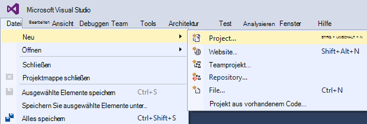

1. Klicken Sie im Dialogfeld **Neues Projekt** erweitern Sie **C#** wählen Sie **Web** **Installierte**Vorlagen aus und aktivieren Sie **ASP.NET Web Application**. Nennen Sie die Anwendung **ContactManager**, und klicken Sie dann auf **OK**.

    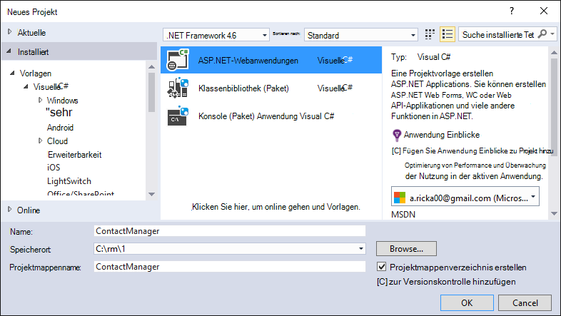
 
    **Hinweis:** Stellen Sie sicher, dass "ContactManager" eingeben. Codeblöcke, die Sie später kopieren werden angenommen, der Namen ContactManager. 

1. Wählen Sie im Dialogfeld **Neues Projekt von ASP.NET** **MVC** -Vorlage. Überprüfen Sie **Authentifizierung** auf **Einzelne Benutzerkonten**festgelegt, **Host in der Cloud** geprüft und **App-Dienst** aktiviert ist.

    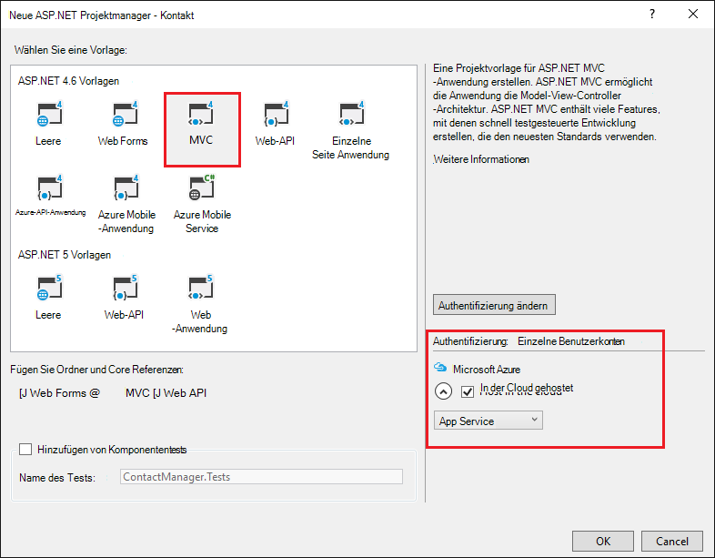

1. Klicken Sie auf **OK**.

1. Das Dialogfenster **Microsoft Azure Web Appeinstellungen konfigurieren** . Sie müssen anmelden, wenn Sie nicht bereits geschehen, oder Ihre Anmeldeinformationen erneut eingeben, wenn die Anmeldung abgelaufen ist.

1. Optional – Ändern der Wert im **Web App Name** ein (siehe Abbildung unten).

    Die URL der Web-app werden {Name} .azurewebsites .net, daher der Name in der *.azurewebsites.NET-Domäne eindeutig sein. Der Konfigurations-Assistent schlägt einen eindeutigen Namen durch Anhängen einer Zahl an den Namen "ContactManager", und das ist in Ordnung für dieses Lernprogramm.

5. In der **Ressourcengruppe** Dropdown-Liste Wählen Sie eine Gruppe oder eine **neue Ressourcengruppe erstellen**(siehe Abbildung unten). 

    Falls gewünscht, können Sie eine Ressourcengruppe auswählen, die Sie bereits. Wenn Sie eine neue Ressourcengruppe erstellen und nur für dieses Lernprogramm verwenden, es ist aber einfach alle Azure-Ressourcen löschen, die für das Lernprogramm erstellt, wenn Sie damit fertig sind. Informationen zu Ressourcengruppen finden Sie unter [Azure-Ressourcen-Manager (Übersicht)](../azure-resource-manager/resource-group-overview.md). 

5. **App Service-Plan** Dropdown-Liste Wählen Sie einen vorhandenen Plan oder **Erstellen neuer App Service-plan**(siehe unten).

    Alternativ können Sie einen App Service-Plan auswählen, die Sie bereits. Informationen zu App Service-Pläne finden Sie in [Azure App Service Pläne ausführliche Übersicht](../app-service/azure-web-sites-web-hosting-plans-in-depth-overview.md). 

1. Tippen Sie auf **Weitere Azure Services durchsuchen** zum Hinzufügen einer SQL-Datenbank.

    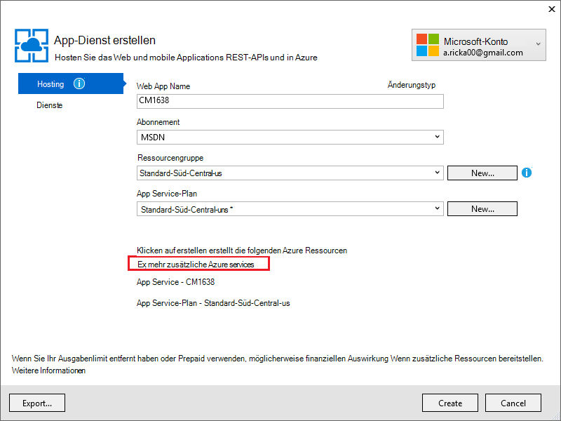

1. Tippen Sie auf die **+** um eine SQL-Datenbank hinzuzufügen.

    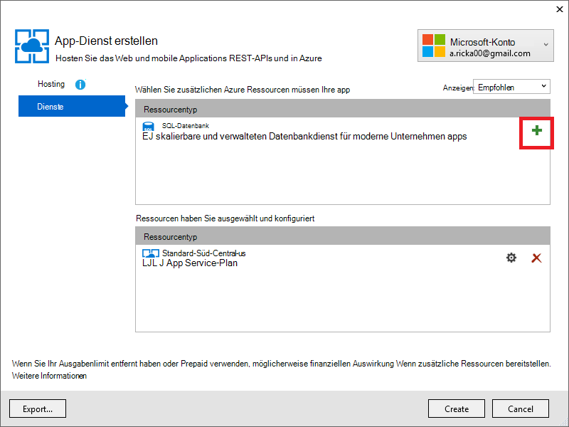

1. Tippen Sie auf **neu** im Dialogfeld **SQL-Datenbank konfigurieren** :

    

1. Geben Sie einen Namen für den Administrator und ein sicheres Kennwort.

    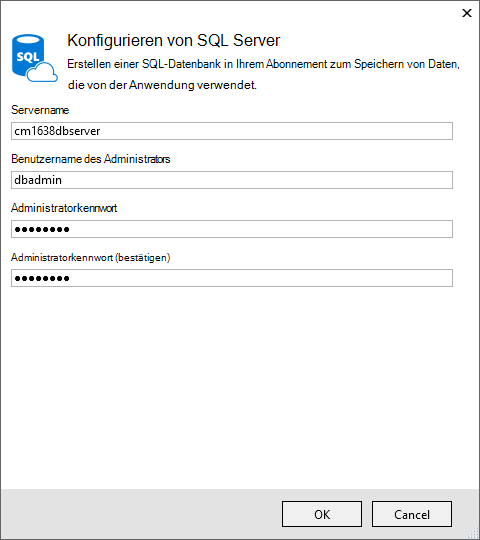

    Der Servername muss eindeutig sein. Sie können Kleinbuchstaben, Ziffern und Bindestriche enthalten. Es darf keine abschließenden Bindestrichs enthalten. Der Benutzername und das Kennwort werden neue Anmeldeinformationen für den neuen Server erstellen. 

    Haben Sie bereits einen Datenbankserver, können Sie das auswählen, anstatt eine. Datenbankserver sind eine Ressource, und im Allgemeinen mehrere Datenbanken auf demselben Server für Tests und Entwicklung anstatt einen Server pro Datenbank erstellen möchten. Jedoch für dieses Lernprogramm brauchen Sie nur den Server vorübergehend und Server in derselben Ressourcengruppe wie die Website erstellen Sie erleichtern sowohl Web app und Ressourcen durch Löschen der Ressourcengruppe mit dem Tutorium danach löschen. 

    Wenn Sie einen vorhandenen Datenbankserver auswählen, stellen Sie sicher, dass Ihr WebApp und die Datenbank in derselben Region.

    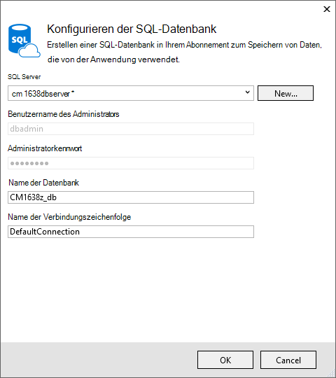

4. Tippen Sie auf **Erstellen**.

    Visual Studio erstellt das Webprojekt ContactManager, erstellt die Ressourcengruppe und die App Service-Plan, die Sie angegeben haben, und eine Webanwendung in Azure App Service mit dem angegebenen Namen erstellt.

### Legen Sie die Kopf- und Fußzeile

1. Im **Projektmappen-Explorer** die Datei *Layout.cshtml* im Ordner *Views\Shared ebenfalls einen* .

    ![_Layout.cshtml im Projektmappen-Explorer][newapp004]

1. Ersetzen Sie in der Datei *Layout.cshtml* ActionLink durch folgenden Code.

    @Html.ActionLink("CMDemo","Index","Kontakte"neue {Bereich =" "} neue { @class ="Navigationsleiste-Marke"})
                   

    Stellen Sie sicher, dass den dritten Parameter "Home", "Kontakte" ändern. Oben Markup erstellt einen Link "Kontakte" auf jeder Seite der Index-Methode des Controllers Kontakte. Ändern Sie die Anwendung in der Kopf- und Fußzeile aus "Meine ASP.NET Application" und "Anwendungsname" "Kontakt-Manager" und "CM Demo". 
 
### Die Anwendung lokal ausführen

1. Drücken Sie STRG + F5, um die Anwendung auszuführen.

    Startseite der Anwendung wird im Standardbrowser angezeigt.

    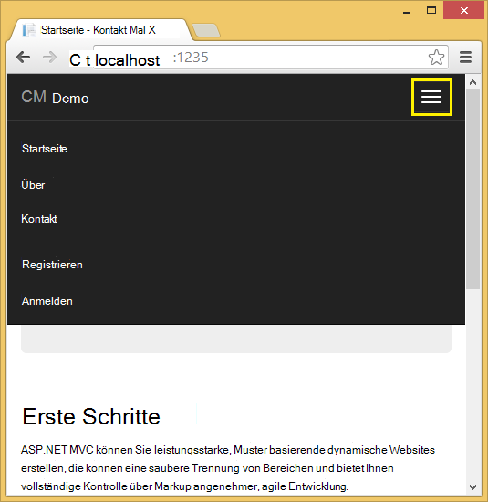

Deshalb müssen Sie jetzt die Anwendung erstellen, das auf Azure bereitgestellt werden. 

## Bereitstellen der Anwendung in Azure

1. In Visual Studio mit der rechten Maustaste im **Projektmappen-Explorer** des Projekts, und wählen Sie **Veröffentlichen** aus dem Kontextmenü.

    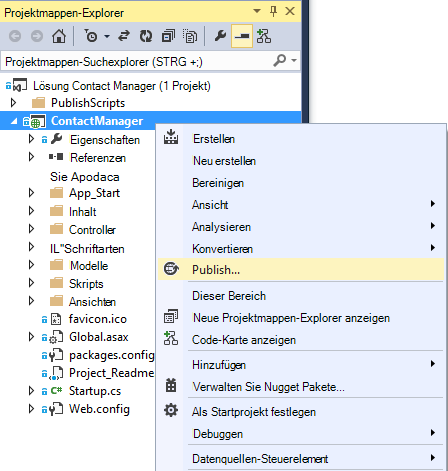
    
    Der **Veröffentlichen** -Assistent wird geöffnet.

1. Klicken Sie im Dialogfeld **Web veröffentlichen** **Veröffentlichen**.

    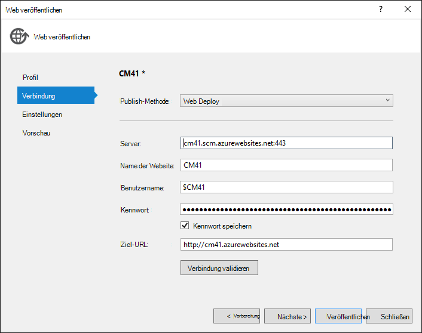

    Die erstellte Anwendung wird jetzt in der Cloud ausgeführt. Beim nächsten der Anwendung bereitstellen werden nur die Dateien geänderten (oder neuen) bereitgestellt.

    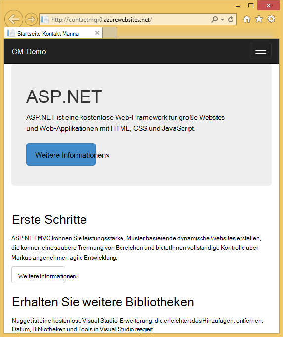

## Aktivieren von SSL für das Projekt ##

1. Im **Projektmappen-Explorer**das Projekt **ContactManager** , klicken Sie F4, um **das Eigenschaftenfenster** zu öffnen.

3. Ändern Sie **SSL aktiviert** auf **True**. 

4. Kopieren Sie die **SSL-URL**.

    Die SSL-URL werden Https://localhost:44300 / SSL webapps zuvor erstellt haben.

    ![Aktivieren Sie SSL][rxSSL]
 
1. Wählen Sie im **Projektmappen-Explorer**die **Contact Manager** , und klicken Sie auf **Eigenschaften**.

1. Klicken Sie auf die Registerkarte **Web** .

1. **Projekt-Url** , um die **SSL-URL** und speichern Sie die Seite (S-Steuerelement) zu ändern.

    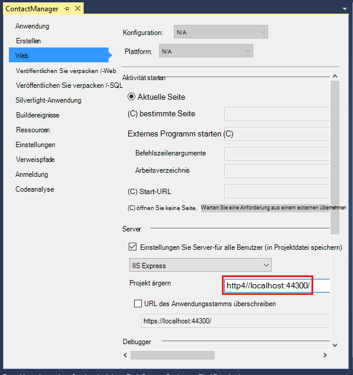
 
1. Stellen Sie sicher, dass Internet Explorer Browser startet Visual Studio wie in der folgenden Abbildung dargestellt:

    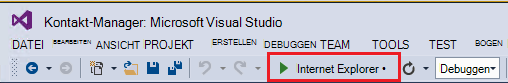

    Browser-Auswahl können Sie den Browser angeben, den startet Visual Studio. Sie können mehrere Browser auswählen und Visual Studio jeden Browser aktualisieren, wenn Sie ändern. Weitere Informationen finden Sie unter [Visual Studio 2013 Browser Link verwenden](http://www.asp.net/visual-studio/overview/2013/using-browser-link).

    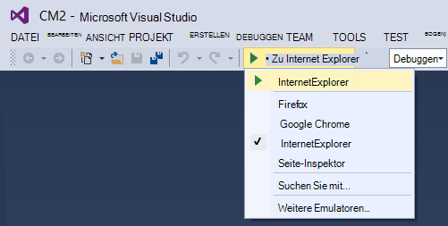

1. Drücken Sie STRG + F5, um die Anwendung auszuführen. Klicken Sie auf **Ja,** starten das selbstsignierte Zertifikat IIS Express generiert hat, vertrauen.

     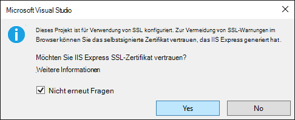

1. Lesen Sie das Dialogfeld **Sicherheitshinweis** , und **Klicken Sie ggf. installieren **Localhost**darstellt** .

    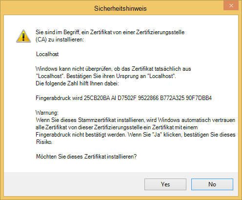

1. IE *Homepage* und keine SSL-Warnungen.

     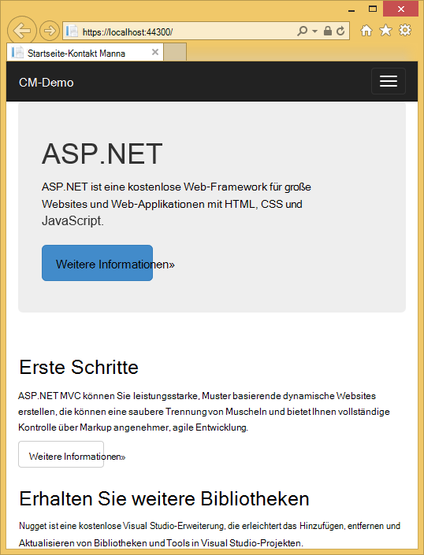

     Internet Explorer ist eine gute Wahl, wenn Sie SSL verwenden, da es das Zertifikat akzeptiert und HTTPS-Inhalten ohne Warnung. Microsoft Edge und Google Chrome akzeptieren auch das Zertifikat. Firefox verwendet eigene Zertifikatspeicher zeigt eine Warnung an.

     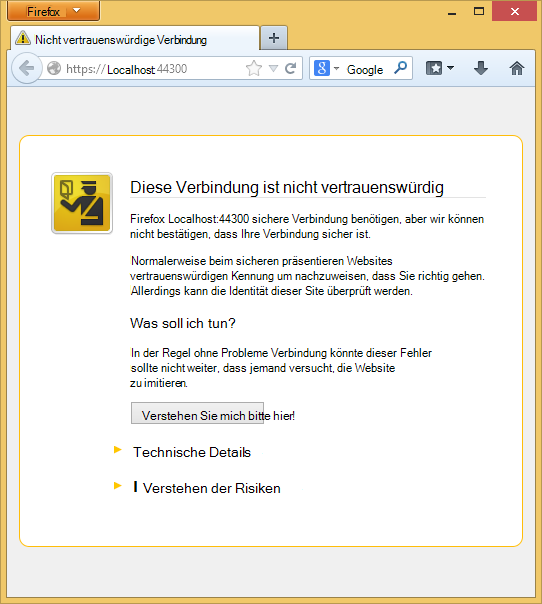

## Eine Datenbank zur Anwendung hinzufügen

Anschließend aktualisieren Sie die Anwendung auf die Möglichkeit zum Anzeigen und Kontakte aktualisieren und die Daten in einer Datenbank speichern. Die app verwenden Entity Framework (EF) zum Erstellen der Datenbank und zum Lesen und Aktualisieren von Daten.

### Modell Datenklassen für die Kontakte hinzufügen

Sie zunächst ein einfaches Datenmodell im Code erstellen.

1. Im **Projektmappen-Explorer**mit der rechten Maustaste des Ordners Models, klicken Sie auf **Hinzufügen**und dann auf **Klasse**.

    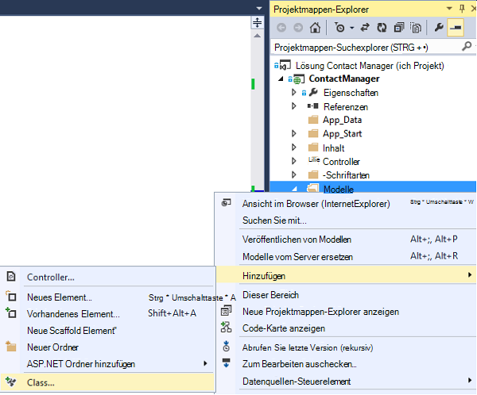

2. Klicken Sie im Dialogfeld **Neues Element hinzufügen** nennen Sie die neue Klassendatei *Contact.cs*und klicken Sie dann auf **Hinzufügen**.

    ![Das Dialogfeld Neues Element hinzufügen][adddb002]

3. Ersetzen Sie den Inhalt der Datei Contact.cs durch den folgenden Code.

        using System.ComponentModel.DataAnnotations;
        using System.Globalization;
        namespace ContactManager.Models
        {
            public class Contact
            {
                public int ContactId { get; set; }
                public string Name { get; set; }
                public string Address { get; set; }
                public string City { get; set; }
                public string State { get; set; }
                public string Zip { get; set; }
                [DataType(DataType.EmailAddress)]
                public string Email { get; set; }
            }
        }
**Wenden Sie sich an** -Klasse definiert die Daten speichert für jeden Kontakt und einen Primärschlüssel *ContactID*, die von der Datenbank benötigt wird.

### Erstellen von Webseiten, die app Benutzer Kontakte aktivieren

ASP.NET MVC Gerüstbau Feature kann automatisch führt Code erstellen, lesen, aktualisieren und Löschen von Aktionen (CRUD). 

1. Erstellen Sie das Projekt **(STRG + UMSCHALT + B)**. (Sie müssen das Projekt erstellen, bevor der Gerüstbau verwenden.)
 
1. Im **Projektmappen-Explorer**mit der rechten Maustaste des Ordners klicken Sie auf **Hinzufügen**und klicken Sie auf **Controller**.

    ![Controller im Kontextmenü Ordner Controller hinzufügen][addcode001]

5. Wählen Sie im Dialogfeld **Scaffold hinzufügen** **5 MVC-Controller mit Ansichten EF aus** und dann auf **Hinzufügen**.
    
    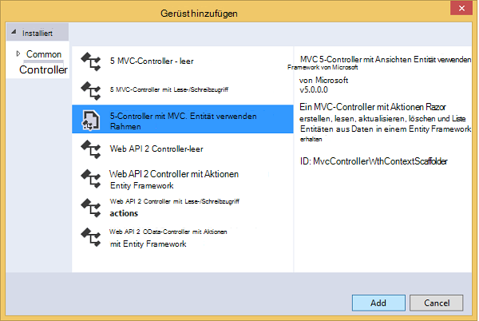

1. Wählen Sie im Dropdownfeld **Modellklasse** **Kontakt (ContactManager.Models)**. (Siehe unten).

1. Wählen Sie in der **Klasse** **ApplicationDbContext (ContactManager.Models)**. **ApplicationDbContext** wird für die Mitgliedschaft DB und Kontaktdaten verwendet werden.

    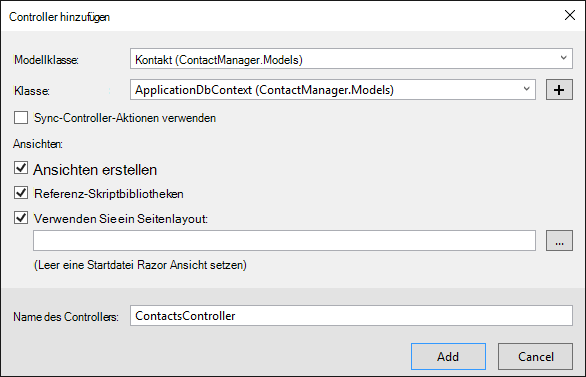

1. Klicken Sie auf **Hinzufügen**.

   Visual Studio erstellt einen Controller mit Methoden für CRUD-Datenbankvorgänge für **Kontaktobjekte** .

## Aktivieren Sie Migrationen, erstellen Sie die Datenbank, Beispieldaten und Daten-Initialisierung ##

Die nächste Aufgabe ist die [Code First-Migrationen](http://msdn.microsoft.com/library/hh770484.aspx) -Funktion aktivieren, um Tabellen anhand der erstellten Datenmodell erstellen.

1. Wählen Sie im Menü **Extras** **NuGet Paket-Manager** und **Paket-Manager-Konsole**.

    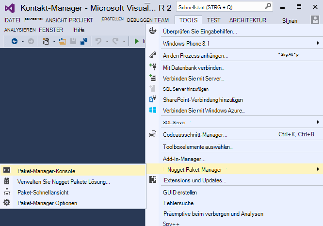

2. Geben Sie im Konsolenfenster **Paket-Manager** den folgenden Befehl ein:

        enable-migrations

    **Aktivieren-Migrationen** Befehl erstellt einen Ordner *Migrationen* , und in diesem Ordner eine *Configuration.cs* -Datei, die Sie bearbeiten können, Seeding der Datenbank und Migrationen konfigurieren. 

2. Geben Sie im Konsolenfenster **Paket-Manager** den folgenden Befehl ein:

        add-migration Initial

    **Hinzufügen-Migration ersten** Befehl generiert eine Datei namens ** &lt;Date_stamp&gt;erste** im Ordner *Migrationen* . Der Code in dieser Datei wird die Datenbanktabellen erstellt. Der erste Parameter ( **erste** ) wird zum Erstellen der Datei verwendet. Sie sehen die neuen Klassendateien im **Projektmappen-Explorer**.

    In der **ersten** Klasse **,** Methode erstellt die Contacts-Tabelle (verwendete in den vorherigen Zustand zurückkehren möchten) **unten** -Methode löscht sie

3. Öffnen Sie die Datei *Migrations\Configuration.cs* . 

4. Fügen Sie den folgenden `using` Anweisung. 

         using ContactManager.Models;

5. Ersetzen Sie die *Seed* -Methode durch folgenden Code:

        protected override void Seed(ContactManager.Models.ApplicationDbContext context)
        {
            context.Contacts.AddOrUpdate(p => p.Name,
               new Contact
               {
                   Name = "Debra Garcia",
                   Address = "1234 Main St",
                   City = "Redmond",
                   State = "WA",
                   Zip = "10999",
                   Email = "debra@example.com",
               },
                new Contact
                {
                    Name = "Thorsten Weinrich",
                    Address = "5678 1st Ave W",
                    City = "Redmond",
                    State = "WA",
                    Zip = "10999",
                    Email = "thorsten@example.com",
                },
                new Contact
                {
                    Name = "Yuhong Li",
                    Address = "9012 State st",
                    City = "Redmond",
                    State = "WA",
                    Zip = "10999",
                    Email = "yuhong@example.com",
                },
                new Contact
                {
                    Name = "Jon Orton",
                    Address = "3456 Maple St",
                    City = "Redmond",
                    State = "WA",
                    Zip = "10999",
                    Email = "jon@example.com",
                },
                new Contact
                {
                    Name = "Diliana Alexieva-Bosseva",
                    Address = "7890 2nd Ave E",
                    City = "Redmond",
                    State = "WA",
                    Zip = "10999",
                    Email = "diliana@example.com",
                }
                );
        }

    Dieser Code initialisiert (Saatgut) der Datenbank mit Kontaktinformationen. Weitere Informationen über das seeding der Datenbank finden Sie unter [Ausgangswert und Debuggen von Entity Framework (EF) DBs](http://blogs.msdn.com/b/rickandy/archive/2013/02/12/seeding-and-debugging-entity-framework-ef-dbs.aspx). Erstellen Sie das Projekt, um sicherzustellen, dass keine Compilerfehler auftreten.

6. Geben Sie in der **Paket-Manager-Konsole** den Befehl:

        update-database

    ![Paket-Manager Befehle][addcode009]

    **Datenbank aktualisieren** wird die erste Migration, die Datenbank erstellt. Standardmäßig wird die Datenbank als Datenbank SQL Server Express LocalDB erstellt. 

7. Klicken Sie auf den Link **CM Demo** drücken Sie STRG + F5, um die Anwendung auszuführen oder navigieren Sie zu https://localhost:(port#) Cm. 

    Die Anwendung zeigt die Ausgangswerte und Links bearbeiten und Details löschen. Erstellen kann, bearbeiten, löschen und Anzeigen von Daten.

    ![MVC-Ansicht der Daten][rx2]

## Hinzufügen eines Dienstanbieters OAuth2

>[AZURE.NOTE] Weitere Informationen zur Verwendung der Google und Facebook Developer Portalwebsites dieses Lernprogramms Links zu Lernprogrammen auf der Website von ASP.NET. Jedoch ändern, Google und Facebook Websites häufiger als die Lernprogramme aktualisiert werden und sind jetzt veraltet. Haben Sie Probleme in Richtung finden Sie wichtigen Disqus Kommentar am Ende dieses Lernprogramms eine Übersicht darüber, was sich geändert hat. 

[OAuth] (http://oauth.net/ "http://OAuth.NET/") ist ein offenes Protokoll, das sichere Autorisierung in einer einfachen und konventionellen Methode Web, mobile und desktop-Anwendung ermöglicht. ASP.NET MVC Internet-Vorlage wird mit OAuth Facebook und Twitter, Google Microsoft als Authentifizierungsanbieter verfügbar machen. Dieses Lernprogramm nur Google als Authentifizierungsanbieter verwendet, können Sie einfach den Code dieser Anbieter verwenden ändern. Die Schritte zum Implementieren von anderen Anbietern ähneln den Schritten in diesem Lernprogramm. Facebook als Authentifizierungsanbieter finden Sie unter [MVC 5 App mit Facebook, LinkedIn und Twitter Google OAuth2 anmelden ](http://www.asp.net/mvc/tutorials/mvc-5/create-an-aspnet-mvc-5-app-with-facebook-and-google-oauth2-and-openid-sign-on).

Zusätzlich zur Authentifizierung wird mit diesem Lernprogramm Rollen Autorisierung implementiert. Nur diese Rolle *CanEdit* hinzugefügte Benutzer Daten ändern (d. h. das Erstellen, bearbeiten oder Löschen von Kontakten).

1. Führen Sie die Schritte [5 MVC-App mit Facebook, LinkedIn und Twitter Google OAuth2 anmelden](http://www.asp.net/mvc/tutorials/mvc-5/create-an-aspnet-mvc-5-app-with-facebook-and-google-oauth2-and-openid-sign-on#goog) unter **Erstellen einer app Google OAuth 2 Google app für OAuth2 einrichten**.

3. Ausführen und Testen der Anwendung überprüfen, ob Sie Google Authentifizierung anmelden können.

2. Soziale Anmeldeschaltflächen mit anbieterspezifischen Symbole erstellen, finden Sie unter [ziemlich sozialen Anmeldeschaltflächen für ASP.NET MVC 5](http://www.jerriepelser.com/blog/pretty-social-login-buttons-for-asp-net-mvc-5)

## Die Mitgliedschaft API

In diesem Abschnitt werden Sie einen lokalen Benutzer und Rolle *CanEdit* der Mitgliedschaftsdatenbank hinzufügen. Die Benutzer in der Rolle *CanEdit* können Daten bearbeiten. Eine bewährte Methode ist Name Rollen durch die Aktionen, die sie ausführen können, *die CanEdit* bevorzugte über eine Rolle namens *Admin*. Wenn Ihre Anwendung entwickelt, können Sie neue Rollen wie *CanDeleteMembers* in aussagekräftig *SuperAdmin*hinzufügen.

1. Öffnen Sie die Datei *migrations\configuration.cs* , und fügen Sie den folgenden `using` Aussagen:

        using Microsoft.AspNet.Identity;
        using Microsoft.AspNet.Identity.EntityFramework;

1. Fügen Sie die folgende **AddUserAndRole** -Methode hinzu:

        bool AddUserAndRole(ContactManager.Models.ApplicationDbContext context)
        {
            IdentityResult ir;
            var rm = new RoleManager<IdentityRole>
                (new RoleStore<IdentityRole>(context));
            ir = rm.Create(new IdentityRole("canEdit"));
            var um = new UserManager<ApplicationUser>(
                new UserStore<ApplicationUser>(context));
            var user = new ApplicationUser()
            {
                UserName = "user1@contoso.com",
            };
            ir = um.Create(user, "P_assw0rd1");
            if (ir.Succeeded == false)
                return ir.Succeeded;
            ir = um.AddToRole(user.Id, "canEdit");
            return ir.Succeeded;
        }

1. Rufen Sie die neue Methode die **Seed** -Methode:

        protected override void Seed(ContactManager.Models.ApplicationDbContext context)
        {
            AddUserAndRole(context);
            context.Contacts.AddOrUpdate(p => p.Name,
                // Code removed for brevity
        }

    Das folgende Bild zeigt *Seed* -Methode:

    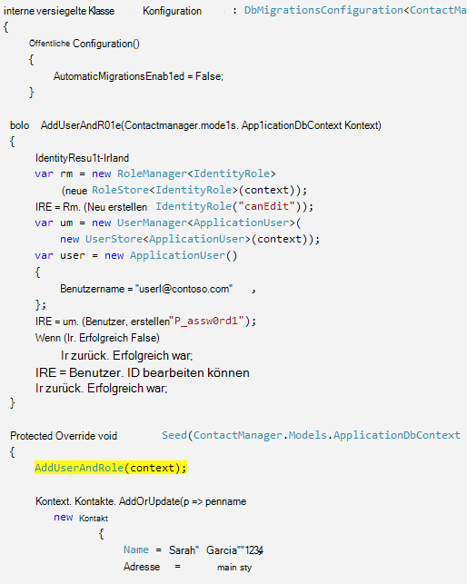

    Dieser Code erstellt eine neue Rolle *CanEdit*aufgerufen, erstellt einen neuen lokalen Benutzer *user1@contoso.com*, und *user1@contoso.com* *CanEdit* Rolle. Weitere Informationen finden Sie auf der Website ASP.NET [ASP.NET Identität Lernprogramme](http://www.asp.net/identity/overview/features-api) .

## Mit CanEdit Rolle der temporären Code neue Social Login Benutzer hinzufügen  ##

In diesem Abschnitt ändern Sie vorübergehend die **ExternalLoginConfirmation** -Methode in der neue Benutzer registriert mit einem Provider OAuth *CanEdit* Rolle hinzuzufügen. Wir hoffen, ein Tool wie [WSAT](http://msdn.microsoft.com/library/ms228053.aspx) zukünftig ermöglicht Ihnen das Erstellen und Bearbeiten von Benutzerkonten und Rollen. Bis dahin erreichen Sie dieselbe Funktion durch temporäre Code.

1. Öffnen Sie die Datei **Controllers\AccountController.cs** , und navigieren Sie zu der **ExternalLoginConfirmation** -Methode.

1. Fügen Sie den folgenden Aufruf **AddToRoleAsync** vor dem **SignInAsync** -Aufruf.

        await UserManager.AddToRoleAsync(user.Id, "canEdit");

   Der obige Code fügt neu registrierten Benutzer "CanEdit" Rolle verleiht ihnen Zugriff für Aktionsmethoden, die Daten (Bearbeiten) ändern. Der folgende Ausschnitt zeigt die neue Codezeile im Kontext.

          // POST: /Account/ExternalLoginConfirmation
          [HttpPost]
          [AllowAnonymous]
          [ValidateAntiForgeryToken]
          public async Task ExternalLoginConfirmation(ExternalLoginConfirmationViewModel model, string returnUrl)
          {
             if (User.Identity.IsAuthenticated)
             {
                return RedirectToAction("Index", "Manage");
             }
             if (ModelState.IsValid)
             {
                // Get the information about the user from the external login provider
                var info = await AuthenticationManager.GetExternalLoginInfoAsync();
                if (info == null)
                {
                   return View("ExternalLoginFailure");
                }
                var user = new ApplicationUser { UserName = model.Email, Email = model.Email };
                var result = await UserManager.CreateAsync(user);
                if (result.Succeeded)
                {
                   result = await UserManager.AddLoginAsync(user.Id, info.Login);
                   if (result.Succeeded)
                   {
                      await UserManager.AddToRoleAsync(user.Id, "canEdit");
                      await SignInManager.SignInAsync(user, isPersistent: false, rememberBrowser: false);
                      return RedirectToLocal(returnUrl);
                   }
                }
                AddErrors(result);
             }
             ViewBag.ReturnUrl = returnUrl;
             return View(model);
          }

Später im Lernprogramm wird Bereitstellen der Anwendung in Azure, wo Sie mit Google oder anderen dritten Authentifizierungsanbieter anmelden werden. Dadurch wird Ihr Konto neu *CanEdit* Rolle hinzugefügt. Wer Web app URL gefunden und hat eine Google-ID kann dann registrieren und Aktualisieren der Datenbank. Verhindern, dass andere Personen tun, können Sie die Website beenden. Sie werden die Rolle *CanEdit* wird durch Untersuchung der Datenbank feststellen.

**Paket-Manager Konsole** drücken die Pfeiltaste, um Folgendes anzuzeigen:

        Update-Database

**Datenbank aktualisieren** -Befehl die **Seed** -Methode ausgeführt und die zuvor hinzugefügte **AddUserAndRole** Methode ausgeführt wird. Die **AddUserAndRole** -Methode erstellt den Benutzer *user1@contoso.com* und fügt sie der Rolle *CanEdit* .

## Schützen Sie die Anwendung autorisieren Attribut mit SSL ##

In diesem Abschnitt wenden Sie das Attribut [Autorisieren](http://msdn.microsoft.com/library/system.web.mvc.authorizeattribute.aspx) , um Zugriff auf die Aktionsmethoden. Anonyme Benutzer können nur die Aktionsmethode **Index** des home-Controller an. Registrierte Benutzer können Daten ( **Index** und **Details** Seiten des Controllers Cm), die About-Seite und die Seite Kontakt. Nur Benutzer in der Rolle *CanEdit* können für Aktionsmethoden zugreifen, die Daten ändern.

1. Öffnen Sie die Datei *App_Start\FilterConfig.cs* und die folgenden (zwei Filter fügt) durch die *RegisterGlobalFilters* -Methode:

        public static void RegisterGlobalFilters(GlobalFilterCollection filters)
        {
            filters.Add(new HandleErrorAttribute());
            filters.Add(new System.Web.Mvc.AuthorizeAttribute());
            filters.Add(new RequireHttpsAttribute());
        }
        
    Dieser Code fügt der [Autorisieren](http://msdn.microsoft.com/library/system.web.mvc.authorizeattribute.aspx) und den [s](http://msdn.microsoft.com/library/system.web.mvc.requirehttpsattribute.aspx) -Filter für die Anwendung. [Autorisieren](http://msdn.microsoft.com/library/system.web.mvc.authorizeattribute.aspx) Filter verhindert, dass anonyme Benutzer Zugriff auf alle Methoden in der Anwendung. [AllowAnonymous](http://blogs.msdn.com/b/rickandy/archive/2012/03/23/securing-your-asp-net-mvc-4-app-and-the-new-allowanonymous-attribute.aspx) -Attribut benötigen Sie die Autorisierung Anforderung in ein paar Methoden anonyme Benutzer können sich anmelden und die Startseite anzeigen deaktivieren. [S](http://msdn.microsoft.com/library/system.web.mvc.requirehttpsattribute.aspx) erfordert, dass alle Zugriffe auf die Web-app über HTTPS.

    Alternativ jeder Controller Attributs [Autorisieren](http://msdn.microsoft.com/library/system.web.mvc.authorizeattribute.aspx) und [s](http://msdn.microsoft.com/library/system.web.mvc.requirehttpsattribute.aspx) -Attribut hinzufügen ist es aus Sicherheitsgründen anzuwenden für die ganze Anwendung gilt. Global hinzufügen, jede neue Controller und Aktion Methode hinzufügen automatisch geschützt - müssen sie anwenden müssen. Weitere Informationen finden Sie unter [Sichern Ihrer ASP.NET MVC-Anwendung und den AllowAnonymous-Attributs](http://blogs.msdn.com/b/rickandy/archive/2012/03/23/securing-your-asp-net-mvc-4-app-and-the-new-allowanonymous-attribute.aspx). 

1. Die **Index** -Methode des Home-Controllers [AllowAnonymous](http://blogs.msdn.com/b/rickandy/archive/2012/03/23/securing-your-asp-net-mvc-4-app-and-the-new-allowanonymous-attribute.aspx) -Attribut hinzufügen. [AllowAnonymous](http://blogs.msdn.com/b/rickandy/archive/2012/03/23/securing-your-asp-net-mvc-4-app-and-the-new-allowanonymous-attribute.aspx) -Attribut ermöglicht weiße Liste Methoden Autorisierung deaktivieren möchten. 

        public class HomeController : Controller
        {
          [AllowAnonymous]
          public ActionResult Index()
          {
             return View();
          }

    Eine globale Suche nach *AllowAnonymous*jedoch sehen Sie die Anmeldung und Registrierung Methoden des Controllers Konto verwendete.

1. Fügen Sie in *CmController.cs* `[Authorize(Roles = "canEdit")]` HttpGet und HttpPost-Methoden, die Daten (erstellen, bearbeiten, löschen, jede Aktionsmethode Index und Details) im Controller *Cm* ändern. Ein Teil der vollständige Code sieht folgendermaßen aus: 

        // GET: Cm/Create
        [Authorize(Roles = "canEdit")]
        public ActionResult Create()
        {
           return View(new Contact { Address = "123 N 456 W",
            City="Great Falls", Email = "ab@cd.com", Name="Joe Smith", State="MT",
           Zip = "59405"});
        }
        // POST: Cm/Create
        // To protect from overposting attacks, please enable the specific properties you want to bind to, for 
        // more details see http://go.microsoft.com/fwlink/?LinkId=317598.
        [HttpPost]
        [ValidateAntiForgeryToken]
         [Authorize(Roles = "canEdit")]
        public ActionResult Create([Bind(Include = "ContactId,Name,Address,City,State,Zip,Email")] Contact contact)
        {
            if (ModelState.IsValid)
            {
                db.Contacts.Add(contact);
                db.SaveChanges();
                return RedirectToAction("Index");
            }
            return View(contact);
        }
        // GET: Cm/Edit/5
        [Authorize(Roles = "canEdit")]
        public ActionResult Edit(int? id)
        {
            if (id == null)
            {
                return new HttpStatusCodeResult(HttpStatusCode.BadRequest);
            }
            Contact contact = db.Contacts.Find(id);
            if (contact == null)
            {
                return HttpNotFound();
            }
            return View(contact);
        }
        
1. Drücken Sie STRG + F5, um die Anwendung auszuführen.

1. Wenn Sie immer noch aus einer früheren Sitzung angemeldet sind, drücken Sie den Link **Abmelden** .

1. Klicken Sie auf die **zu** **Kontakt** Links. Sie werden zur Anmeldeseite umgeleitet, da anonyme Benutzern nicht die Seiten anzeigen können.

1. Klicken Sie **als neuen Benutzer registrieren** und fügen Sie einen lokalen Benutzer mit e-Mail- *joe@contoso.com*. Überprüfen Sie *Joe* über die Startseite anzeigen und Seiten erhalten können. 

    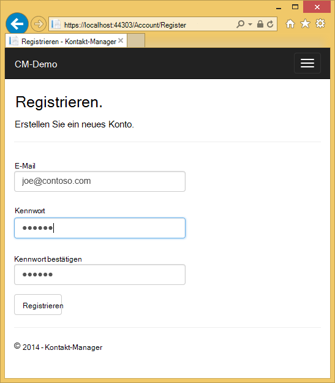

1. Klicken Sie auf *Demo CM* und überprüfen Sie, ob die Daten angezeigt werden.

1. Klicken Sie auf einen Link auf der Seite, die Sie zur Anmeldeseite umgeleitet, (da *CanEdit* Rolle kein neuer lokaler Benutzer hinzugefügt wird).

1. Melden Sie sich als *user1@contoso.com* mit Kennwort "P_assw0rd1" ("0" in "Word" ist null). Sie werden zur Bearbeitungsseite umgeleitet, die zuvor ausgewählt. 
2. 

    Wenn die Anmeldung mit diesem Konto und Kennwort, versuchen Sie, das Kennwort aus dem Quellcode kopieren und einfügen. Wenn Sie weiterhin anmelden können, überprüfen Sie die **UserName** -Spalte der Tabelle **AspNetUsers** überprüfen *user1@contoso.com* wurde hinzugefügt. 

1. Stellen Sie sicher, dass Sie die Daten ändern können.

## Bereitstellen der Anwendung in Azure

1. In Visual Studio mit der rechten Maustaste im **Projektmappen-Explorer** des Projekts, und wählen Sie **Veröffentlichen** aus dem Kontextmenü.

    ![Im Kontextmenü Projekt veröffentlichen][firsdeploy003]

    Der **Veröffentlichen** -Assistent wird geöffnet.

1. Klicken Sie auf **die Registerkarte links im Dialogfeld **Web veröffentlichen** ** . 

2. Wählen Sie unter **ApplicationDbContext** Datenbank, die Sie beim Erstellen des Projekts erstellt.
   

1. Wählen Sie unter **ContactManagerContext** **Führen Code First-Migrationen**.

    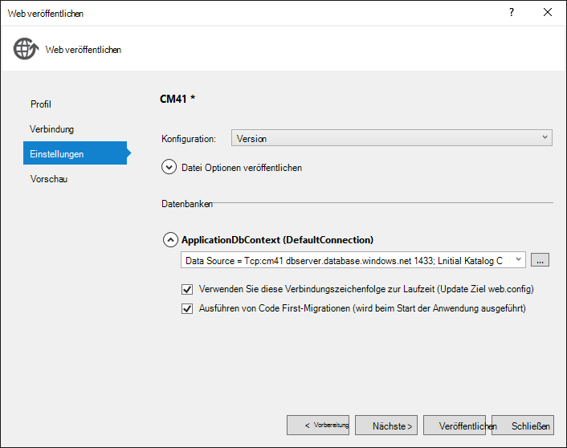

1. Klicken Sie auf **Veröffentlichen**.

1. Melden Sie sich als *user1@contoso.com* (mit Kennwort "P_assw0rd1") und überprüfen Sie die Daten bearbeiten.

1. Melden Sie sich ab.

1. Gehen Sie zu [Google Entwickler Konsole](https://console.developers.google.com/) und **Anmeldeinformationen** Registerkarte Update umleiten URIS und JavaScript Orgins Azure-URL verwenden.

1. Mit Google oder Facebook anmelden. Das wird Rolle **CanEdit** Google oder Facebook-Konto hinzugefügt. Man HTTP 400-Fehler mit der Meldung *Umleitung URI der Anforderung: https://contactmanager {Meine version}.azurewebsites.net/signin-google stimmt nicht mit eine registrierte Umleitung URI.*, Sie müssen warten, bis Sie die Änderungen weitergegeben werden. Wenn Sie diese Fehlermeldung nach wenigen Minuten überprüfen Sie die URIs korrekt sind.

### Beenden der Web app zu verhindern, dass andere Personen registrieren  

1. Navigieren Sie im **Server-Explorer**zu **Azure > App Service > {der Ressourcengruppe} > {Ihrer Anwendung}**.

4. Web app Maustaste, und wählen Sie **Beenden**. 

    Alternativ im [Azure-Portal](https://portal.azure.com/)können Sie Gehe zu Blatt Web app, dann klicken Sie **Beenden** oben das Blade.

    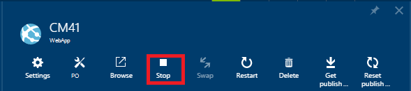

### Entfernen von AddToRoleAsync, veröffentlichen und testen

1. Kommentieren oder die **ExternalLoginConfirmation** -Methode in der daraus folgenden Codes:

        await UserManager.AddToRoleAsync(user.Id, "canEdit");

1. Erstellen Sie das Projekt (die speichert die Datei und prüft, ob alle Kompilierungsfehler haben).

5. Maustaste auf das Projekt im **Projektmappen-Explorer** , und wählen Sie **Veröffentlichen**.

       
    
4. Klicken Sie auf **Vorschau starten** . Nur die Dateien, die aktualisiert werden müssen, werden bereitgestellt.

5. Starten Sie Web app von Visual Studio oder das Portal. **Sie werden veröffentlicht, während die Webanwendung beendet wird**.

    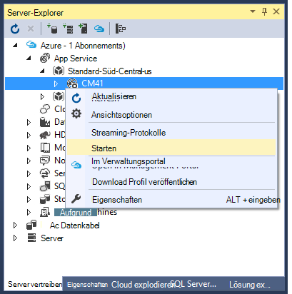

5. Zurück zu Visual Studio, und klicken Sie auf **Veröffentlichen**.

3. Ihre Azure-Anwendung wird im Standardbrowser geöffnet. Wenn Sie angemeldet sind, melden Sie der Homepage als anonymer Benutzer anzeigen können.  

4. Klicken Sie auf den Link **Info** . Sie werden zur Anmeldeseite weitergeleitet.

5. Klicken Sie auf den Link **Registrieren** bei Seite und erstellen Sie lokales Konto. Wir verwenden dieses lokale Konto überprüfen lesen nur Seiten zugreifen, aber Sie können nicht auf Seiten, die Daten ändern (Rolle *CanEdit* geschützt sind). Später im Lernprogramm entfernt Sie lokale Konto. 

    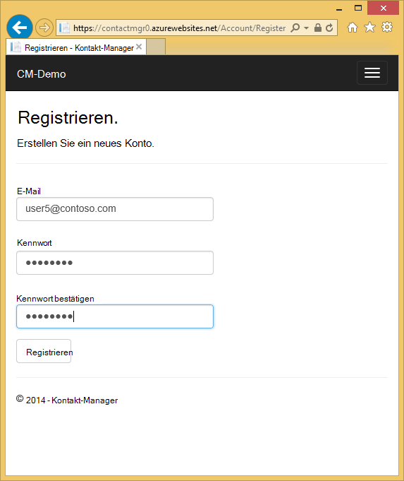

1. Stellen Sie sicher, dass Sie *über* und *Kontaktdaten* Seiten navigieren können.

    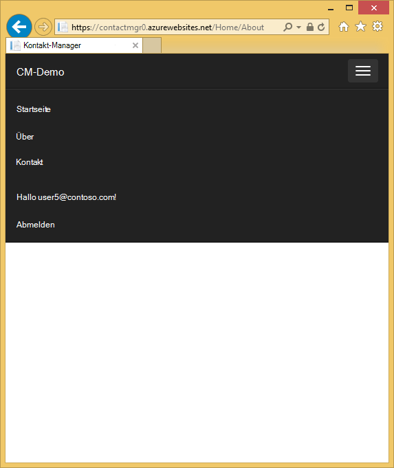

1. Klicken Sie auf **Demo CM** , navigieren zu dem Controller **Cm** . Alternativ können Sie *Cm* an den URL angehängt. 

    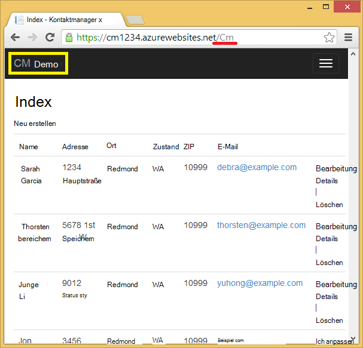
 
1. Klicken Sie auf einen Link. 

    Sie werden zur Anmeldeseite umgeleitet. 

2. **Weiteren Dienst zum Anmelden verwenden**, klicken Sie auf Google oder Facebook und Log Konto bereits registriert. (Wenn Sie schnell arbeiten und Ihre Sitzungscookie ist noch nicht abgelaufen, werden Sie automatisch mit Google oder Facebook-Konto zuvor verwendeten angemeldet sein.)

2. Überprüfen Sie, ob Daten während dieses Konto angemeldet bearbeitet werden können.

    **Hinweis:** Sie können nicht von Google app und Protokoll einem anderen Konto mit dem gleichen Browser anmelden. Wenn Sie einen Browser verwenden, müssen Sie Google und Abmelden. Sie können mit einem anderen Konto vom gleichen Drittanbieter Authentifikator (wie Google) anmelden mit einem anderen Browser.

    Wenn Sie den ersten und letzten Namen Google-Kontoinformationen nicht ausgefüllt haben, wird eine NullReferenceException auftreten.

## Überprüfen Sie die SQL Azure DB ##

1. Navigieren Sie im **Server-Explorer**zu **Azure > SQL Datenbanken > {Database}**

2. Klicken Sie mit der rechten Maustaste die Datenbank und wählen Sie dann **im SQL Server-Objekt-Explorer öffnen**.
 
    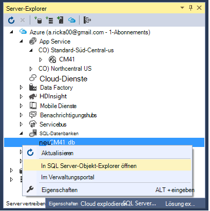
 
3. Wenn Sie mit dieser Datenbank bereits verknüpft haben, können Sie aufgefordert, eine Firewallregel zum Aktivieren des Zugriffs für Ihre aktuelle IP-Adresse hinzufügen. Die IP-Adresse werden bereits ausgefüllt. Klicken Sie einfach auf **Firewall-Regel hinzufügen** , um Zugriff zu ermöglichen.

    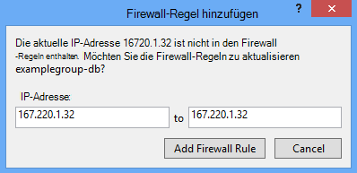

3. Melden Sie sich mit Benutzernamen und Kennwort, die Sie beim Erstellen des Datenbankservers angegeben. 
 
1. Rechts klicken Sie auf die **AspNetUsers** , und wählen Sie **Daten anzeigen**.

    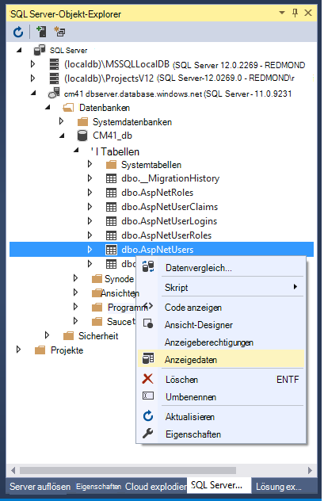
 
1. Beachten Sie die Id Konto mit der **CanEdit** Rolle registriert und die Id des *user1@contoso.com*. Diese sollte nur Benutzer in der Rolle **CanEdit** . (Sie werden im nächsten Schritt überprüfen, ob.)

    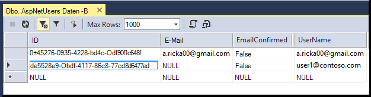
 
2. Klicken Sie im **Objekt-Explorer von SQL Server**mit der rechten Maustaste auf **AspNetUserRoles** , und wählen Sie **Daten anzeigen**.

    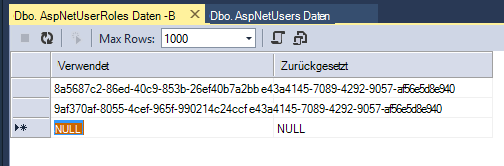
 
3. Stellen Sie sicher, dass die **Benutzer-ID** aus *user1@contoso.com* und Registrierung Konto. 

## Problembehandlung

Wenn Probleme auftreten, sind hier einige Vorschläge für Lösungsansätze.

* Fehler Bereitstellung SQL Datenbank - stellen Sie sicher, dass das aktuelle SDK installiert. Versionen vor 2.8.1 haben einen Fehler, der in einigen Szenarien Fehler verursacht, wenn VS versucht der Server oder der Datenbank.
* Fehlermeldung "Vorgang wird für Ihr Angebot Abonnementtyp nicht" bei Azure Ressourcen - wie oben beschrieben erstellen.
* Fehler beim Bereitstellen von - sollten Sie über [grundlegende ASP.NET Bereitstellung](web-sites-dotnet-get-started.md) Artikel. Bereitstellungsszenario ist einfacher, wenn Sie dasselbe Problem haben sie möglicherweise werden einfacher zu isolieren. Zum Beispiel in manchen Unternehmen eine Unternehmens-Firewall möglicherweise Web Deploy Azure erfordert die Arten von Verbindungen zu.
* Keine Option zum Verbindungszeichenfolge im Veröffentlichen-Assistenten bei der Bereitstellung aktivieren - Wenn Sie eine andere Methode die Azure-Ressourcen erstellt z. B. eine Webanwendung bereitstellen möchten und eine SQL-Datenbank im Portal erstellt die SQL-Datenbank möglicherweise nicht mit dem Web app. Die einfachste Lösung ist ein neues Web app und die Datenbank mit dem Lernprogramm VS erstellen. Müssen das Lernprogramm beginnen – im Veröffentlichen-Assistenten Sie können eine neue Web app erstellen und erhalten dasselbe Azure Ressource erstellen Dialogfeld, das Sie erhalten, wenn Sie das Projekt erstellen.
* Erfahren Sie, wie Google oder Facebook Developer Portal sind – finden Sie wichtigen Disqus Kommentar am Ende des Lernprogramms.

## Nächste Schritte

Sie haben eine grundlegende ASP.NET MVC-Webanwendungsprojekt erstellt, die Benutzer authentifiziert. Weitere Informationen über Authentifizierungsaufgaben und vertrauliche Daten schützen anzeigen Sie die folgenden Lernprogramme

- [Erstellen einer sicheren ASP.NET MVC 5 Web app mit in e-Mail-Bestätigung und Kennwort zurücksetzen](http://www.asp.net/mvc/overview/getting-started/create-an-aspnet-mvc-5-web-app-with-email-confirmation-and-password-reset)
- [ASP.NET MVC 5 app e-Mail zweistufige Authentifizierung mit SMS](http://www.asp.net/mvc/overview/getting-started/aspnet-mvc-5-app-with-sms-and-email-two-factor-authentication)
- [Best Practices für Kennwörter und andere vertraulichen Daten auf ASP.NET und Azure bereitstellen](http://www.asp.net/identity/overview/features-api/best-practices-for-deploying-passwords-and-other-sensitive-data-to-aspnet-and-azure) 
- [Erstellen einer ASP.NET MVC 5 mit Facebook und Google-OAuth2](http://www.asp.net/mvc/tutorials/mvc-5/create-an-aspnet-mvc-5-app-with-facebook-and-google-oauth2-and-openid-sign-on ) Dazu gehören Informationen zum Profil Benutzer Registrierungsdatenbank und Weitere Informationen zur Verwendung von Facebook als Authentifizierungsanbieter hinzufügen.
- [Erste Schritte mit ASP.NET MVC 5](http://www.asp.net/mvc/tutorials/mvc-5/introduction/getting-started)

Eine erweiterte Tutorial zur Verwendung von Entity Framework finden Sie in der [EF mit MVC Einstieg](http://www.asp.net/mvc/tutorials/getting-started-with-ef-using-mvc/creating-an-entity-framework-data-model-for-an-asp-net-mvc-application).

Dieses Tutorial wurde von [Rick Anderson](http://blogs.msdn.com/b/rickandy/) geschrieben (Twitter [@RickAndMSFT](https://twitter.com/RickAndMSFT)) mit Hilfe von Tom Dykstra und Barry Dorrans (Twitter [@blowdart](https://twitter.com/blowdart)). 

Was gefällt oder Was möchten Sie sehen ***Sie abgeben*** verbessert nicht nur bezüglich des Lernprogramms, sondern auch zu den Produkten veranschaulicht. Ihr Feedback hilft uns Verbesserungen priorisieren. Sie können auch anfordern und über neue Themen auf [Show Me How mit Code](http://aspnet.uservoice.com/forums/228522-show-me-how-with-code).

## Was hat sich geändert

* Eine Anleitung zur Änderung von Websites zu App Service finden Sie unter: [Azure App Service und seine Auswirkung auf vorhandene Azure Services](http://go.microsoft.com/fwlink/?LinkId=529714)

<!-- bookmarks -->
[Add an OAuth Provider]: #addOauth
[Using the Membership API]:#mbrDB
[Create a Data Deployment Script]:#ppd
[Update the Membership Database]:#ppd2

[setupwindowsazureenv]: #bkmk_setupwindowsazure
[createapplication]: #bkmk_createmvc4app
[deployapp1]: #bkmk_deploytowindowsazure1
[deployapp11]: #bkmk_deploytowindowsazure11
[adddb]: #bkmk_addadatabase

<!-- images-->
[rx2]: ./media/web-sites-dotnet-deploy-aspnet-mvc-app-membership-oauth-sql-database/rx2.png

[rx5]: ./media/web-sites-dotnet-deploy-aspnet-mvc-app-membership-oauth-sql-database-vs2013/rx5.png
[rx6]: ./media/web-sites-dotnet-deploy-aspnet-mvc-app-membership-oauth-sql-database-vs2013/rx6.png
[rx7]: ./media/web-sites-dotnet-deploy-aspnet-mvc-app-membership-oauth-sql-database-vs2013/rx7.png
[rx8]: ./media/web-sites-dotnet-deploy-aspnet-mvc-app-membership-oauth-sql-database-vs2013/rx8.png
[rx9]: ./media/web-sites-dotnet-deploy-aspnet-mvc-app-membership-oauth-sql-database-vs2013/rx9.png

[rxb]: ./media/web-sites-dotnet-deploy-aspnet-mvc-app-membership-oauth-sql-database/rxb.png

[rxSSL]: ./media/web-sites-dotnet-deploy-aspnet-mvc-app-membership-oauth-sql-database/rxSSL.png

[rxNOT]: ./media/web-sites-dotnet-deploy-aspnet-mvc-app-membership-oauth-sql-database-vs2013/rxNOT.png
[rxNOT2]: ./media/web-sites-dotnet-deploy-aspnet-mvc-app-membership-oauth-sql-database-vs2013/rxNOT2.png

[rxNOT]: ./media/web-sites-dotnet-deploy-aspnet-mvc-app-membership-oauth-sql-database-vs2013/rxNOT.png
[rxNOT]: ./media/web-sites-dotnet-deploy-aspnet-mvc-app-membership-oauth-sql-database-vs2013/rxNOT.png
[rxNOT]: ./media/web-sites-dotnet-deploy-aspnet-mvc-app-membership-oauth-sql-database-vs2013/rxNOT.png
[rr1]: ./media/web-sites-dotnet-deploy-aspnet-mvc-app-membership-oauth-sql-database-vs2013/rr1.png

[rxPrevDB]: ./media/web-sites-dotnet-deploy-aspnet-mvc-app-membership-oauth-sql-database-vs2013/rxPrevDB.png

[rxWSnew]: ./media/web-sites-dotnet-deploy-aspnet-mvc-app-membership-oauth-sql-database-vs2013/rxWSnew2.png
[rxCreateWSwithDB]: ./media/web-sites-dotnet-deploy-aspnet-mvc-app-membership-oauth-sql-database-vs2013/rxCreateWSwithDB.png

[setup007]: ./media/web-sites-dotnet-deploy-aspnet-mvc-app-membership-oauth-sql-database-vs2013/dntutmobile-setup-azure-site-004.png

[newapp004]: ./media/web-sites-dotnet-deploy-aspnet-mvc-app-membership-oauth-sql-database/dntutmobile-createapp-004.png

[firsdeploy003]: ./media/web-sites-dotnet-deploy-aspnet-mvc-app-membership-oauth-sql-database/dntutmobile-deploy1-publish-001.png

[adddb002]: ./media/web-sites-dotnet-deploy-aspnet-mvc-app-membership-oauth-sql-database/dntutmobile-adddatabase-002.png
[addcode001]: ./media/web-sites-dotnet-deploy-aspnet-mvc-app-membership-oauth-sql-database/dntutmobile-controller-add-context-menu.png

[addcode008]: ./media/web-sites-dotnet-deploy-aspnet-mvc-app-membership-oauth-sql-database-vs2013/dntutmobile-migrations-package-manager-menu.png
[addcode009]: ./media/web-sites-dotnet-deploy-aspnet-mvc-app-membership-oauth-sql-database/dntutmobile-migrations-package-manager-console.png

[Important information about ASP.NET in Azure web apps]: #aspnetwindowsazureinfo
[Next steps]: #nextsteps

[ImportPublishSettings]: ./media/web-sites-dotnet-deploy-aspnet-mvc-app-membership-oauth-sql-database-vs2013/ImportPublishSettings.png
 
