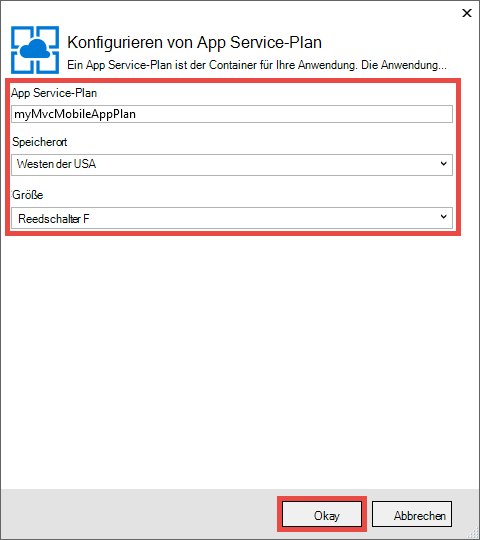
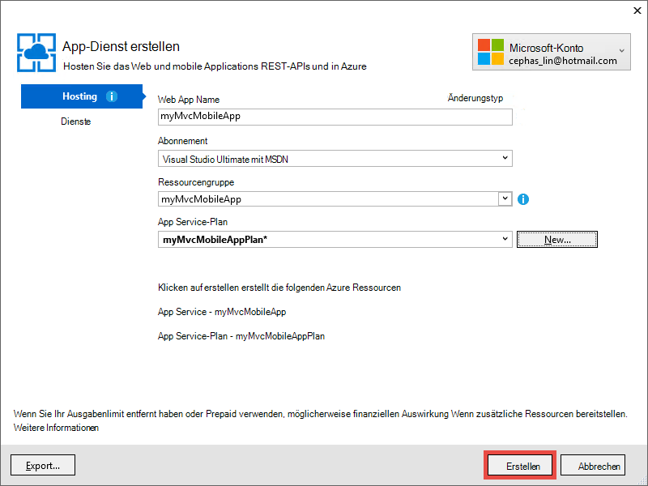

<properties 
    pageTitle="Bereitstellen Sie eine ASP.NET MVC 5 mobile Web app in Azure App Service" 
    description="Ein Lernprogramm, in dem Web app Azure App Service bereitstellen Lernen mit mobile-Funktionen in ASP.NET MVC 5 Anwendung." 
    services="app-service" 
    documentationCenter=".net" 
    authors="cephalin" 
    manager="wpickett" 
    editor="jimbe"/>

<tags 
    ms.service="app-service" 
    ms.workload="na" 
    ms.tgt_pltfrm="na" 
    ms.devlang="dotnet" 
    ms.topic="article" 
    ms.date="01/12/2016" 
    ms.author="cephalin;riande"/>

# Bereitstellen Sie eine ASP.NET MVC 5 mobile Web app in Azure App Service

In diesem Lernprogramm lernen Sie die Grundlagen zum Erstellen einer ASP.NET MVC 5 Web app Mobilgeräte und Azure App Service bereitstellen. In diesem Lernprogramm benötigen Sie [Visual Studio Express 2013 für Web] [ Visual Studio Express 2013] oder der professional Edition von Visual Studio, wenn Sie bereits mit. [Visual Studio 2015] verwenden, jedoch werden die Screenshots und ASP.NET 4.x Vorlagen verwenden.

[AZURE.INCLUDE [create-account-and-websites-note](../../includes/create-account-and-websites-note.md)]

## Wie erstellen Sie

Für dieses Lernprogramm fügen Sie mobile Funktionen, einfache Liste Konferenz-Anwendung, die im [Startprojekt]bereitgestellt wird[StarterProject]. Der folgende Screenshot zeigt ASP.NET Sessions in der fertigen Anwendung im Emulator Browser Internet Explorer 11 F12 Developer Tools gesehen.

![][FixedSessionsByTag]

Sie können die Internet Explorer 11 F12 Developer Tools und das [Fiddler-Tool] [ Fiddler] zum Debuggen Ihrer Anwendung. 

## Kenntnisse, die Sie lernen

Hier ist Sie lernen:

-   Wie Visual Studio 2013 Webtests direkt zu einem Web app in Azure App Service veröffentlichen.
-   Verwendung von ASP.NET MVC 5 Vorlagen CSS-Bootstrap-Framework zu Anzeige auf mobilen Geräten
-   Mobile-spezifische Ansichten für spezifische mobile Browser, wie iPhone und Android erstellen
-   Erstellen von reaktionsfähigen Ansichten (, die auf verschiedenen Browsern auf Geräten)

## Einrichten der Entwicklungsumgebung

Einrichten der Umgebung mit Azure SDK für .NET 2.5.1 oder höher. 

1. Klicken Sie auf den Link zum Installieren von Azure SDK für .NET. Wenn Sie Visual Studio 2013 noch nicht installiert haben, wird es durch den Link installiert. Dieses Lernprogramm ist Visual Studio 2013 erforderlich. [Azure SDK für Visual Studio 2013][AzureSDKVs2013]
1. Klicken Sie im Web Platform Installer auf **Installieren** und die Installation fort.

Sie benötigen auch einen mobilen Browser-Emulator. Die folgenden arbeiten:

-   Browser-Emulator in [Internet Explorer 11 F12 Developer Tools] [ EmulatorIE11] (die in allen mobilen Browser Screenshots). Es hat User Agent String Vorgaben für Windows Phone 8, Windows Phone 7 und Apple iPad.
-   Browser-Emulator in [Google Chrome DevTools][EmulatorChrome]. Es enthält Vorgaben für zahlreiche Android-Geräte und Apple iPhone, Apple iPad und Amazon Kindle Fire. Auch emulieren Berührungsereignisse.
-   [Opera Mobile Emulator][EmulatorOpera]

Visual Studio-Projekte mit C\# Quellcode stehen für dieses Thema steht:

-   [Starter-Projekt herunterladen][StarterProject]
-   [Projektdownload abgeschlossen][CompletedProject]

##Bereitstellen Sie das Startprojekt für eine Azure Web app

1.  Konferenz-Angebot Anwendung [Startprojekt]downloaden[StarterProject].

2.  In Windows Explorer mit der rechten Maustaste der heruntergeladenen ZIP-Datei und wählen Sie *Eigenschaften*.

3.  Wählen Sie im Dialogfeld **Eigenschaften** **Zulassen** . (Blockierung verhindert einen Sicherheitshinweis tritt auf, wenn Sie versuchen, eine *ZIP-* Datei, die Sie aus dem Internet heruntergeladen haben.)

4.  Die ZIP-Datei Maustaste und wählen **Alle extrahieren** die Datei entpacken. 

5.  Öffnen Sie in Visual Studio die Datei *C#\Mvc5Mobile.sln* .

6.  Im Projektmappen-Explorer mit der rechten Maustaste des Projekts und klicken Sie auf **Veröffentlichen**.

    ![][DeployClickPublish]

7.  Klicken Sie auf **Microsoft Azure App Service**im Web veröffentlichen.

    ![][DeployClickWebSites]

8.  Wenn Sie in Azure angemeldet noch nicht, klicken Sie auf **Konto hinzufügen**.

    ![][DeploySignIn]

9.  Folgen Sie den Azure-Konto anmelden.

11. Dialogfeld App Service sollte nun angezeigt als angemeldet. **Klicken Sie auf.**

    ![][DeployNewWebsite]  

12. Geben Sie im Feld **Web App Name** Präfix eine eindeutige app. Web vollqualifizierten Namen werden * &lt;Präfix >*. *.azurewebsites.NET. Außerdem wählen Sie oder geben Sie den Namen einer neuen Ressource Gruppe **Ressourcengruppe**. Dann klicken Sie auf **neu** , um einen neuen App Service-Plan erstellen.

    ![][DeploySiteSettings]

13. Konfigurieren des neuen App Service-Plans und klicken Sie auf **OK**. 

    

13. Klicken Sie im Dialogfeld Create App Service **Erstellen**.

     

13. Nach der Azure Ressourcen entstehen Web veröffentlichen Dialog mit den neuen Anwendung ausgefüllt werden. Klicken Sie auf **Veröffentlichen**.

    ![][DeployPublishSite]

    Nach Abschluss wird Visual Studio das Startprojekt zu Azure Web app veröffentlichen geöffnet Desktopbrowser Web app angezeigt.

14. Mobile Browser Emulator starten, kopieren Sie die URL für die Konferenz Anwendung (*<prefix>*. *.azurewebsites.NET) in den Emulator klicken Sie oben rechts und wählen Sie **Tag durchsuchen**. Wenn Sie Internet Explorer 11 als Standardbrowser verwenden, Sie müssen nur eingeben `F12`, dann `Ctrl+8`, und ändern Sie das Browserprofil in **Windows Phone**. Die Abbildung unten zeigt die Ansicht *dann* im Hochformat (von **Durchsuchen nach Markierung**auswählen).

    ![][AllTags]

>[AZURE.TIP] Beim Debuggen von MVC 5 Anwendung in Visual Studio können Sie Ihrer Anwendung in Azure Web app direkt von Ihrem mobilen Browser oder einen Emulator Browser überprüfen veröffentlichen.

Die Anzeige ist auf mobilen Geräten gut lesbar. Sie können bereits einige visuelle Effekte von Bootstrap CSS-Framework finden Sie unter.
Klicken Sie auf **ASP.NET** .

![][SessionsByTagASP.NET]

ASP.NET Tag-Ansicht ist Zoom auf dem Bildschirm Bootstrap automatisch ausgeführt wird. Allerdings können Sie diese Ansicht, um den mobilen Browser anzupassen verbessern. **Die Spalte** ist z. B. schwer lesbar. Später im Lernprogramm ändern Sie die Ansicht *dann* dafür Mobilgeräte.

##Bootstrap CSS-Framework

Vorlage ist neu in MVC 5 Bootstrap Unterstützung. Sie haben bereits gesehen, wie die unterschiedlichen Ansichten in der Anwendung sofort verbessert. Beispielsweise wird die Navigationsleiste oben automatisch reduzierbare browserbreite kleiner ist. Desktop-Browser versuchen Sie das Browser-Fenster und sehen Sie, wie die Navigationsleiste das Aussehen ändert. Dies ist der Bootstrapper integriert reaktionsfähiges Webdesign.

Um anzuzeigen, wie Web app ohne Bootstrap aussieht, öffnen *App\_Start\\BundleConfig.cs* , und kommentieren Sie die Zeilen, die *bootstrap.js* und *bootstrap.css*enthalten. Der folgende Code zeigt die letzten beiden Aussagen von der `RegisterBundles` Methode nach der Änderung:

     bundles.Add(new ScriptBundle("~/bundles/bootstrap").Include(
              //"~/Scripts/bootstrap.js",
              "~/Scripts/respond.js"));

    bundles.Add(new StyleBundle("~/Content/css").Include(
              //"~/Content/bootstrap.css",
              "~/Content/site.css"));

Drücken Sie `Ctrl+F5` um die Anwendung auszuführen.

Beachten Sie, dass die reduzierbare Navigationsleiste jetzt nur normale ungeordnete Liste ist. **Durchsuchen nach Markierung** wieder klicken **ASP.NET**.
In der Ansicht Emulator für Mobilgeräte finden Sie unter ist nicht mehr auf dem Bildschirm Zoom eingebaut, und Sie müssen seitwärts Blättern, um die rechte Seite der Tabelle sehen.

![][SessionsByTagASP.NETNoBootstrap]

Änderungen rückgängig und Aktualisieren des mobilen Browsers um sicherzustellen, dass die Anzeige Mobilgeräte wiederhergestellt wurde.

Bootstrap ist nicht spezifisch auf ASP.NET MVC 5, und nutzen Sie diese Funktionen in einer Webanwendung. Aber es ist jetzt in der Projektvorlage ASP.NET MVC 5, MVC 5 Webtests Bootstrap standardmäßig nutzen kann.

Weitere Informationen zu Bootstrap dazu [Bootstrap] [ BootstrapSite] Website.

Im nächsten Abschnitt sehen Sie, wie Mobile Browser bestimmte Ansichten.

##Überschreiben Sie Ansichten, Layouts und Teilansichten

Sie können eine beliebige Ansicht (einschließlich Layouts und Teilansichten) für mobile Browser, für einen einzelnen mobilen Browser oder für bestimmte Browser überschreiben. Zu einem Mobilgerät-spezifische Anzeige können Sie eine Ansicht kopieren und *hinzufügen. Mobile* auf den Dateinamen. Z. B. zum Erstellen einer mobilen *Index* Ansicht Sie können *Ansichten\\Start\\Index.cshtml* , *Ansichten\\Start\\Index.Mobile.cshtml*.

In diesem Abschnitt erstellen Sie eine Mobile-spezifische Layout.

Kopieren Sie dazu *Ansichten\\Shared\\\_Layout.cshtml* , *Ansichten\\Shared\\\_Layout.Mobile.cshtml*. Open * \_Layout.Mobile.cshtml* , und ändern Sie den Titel aus **MVC5 Anwendung** **MVC5**Anwendung (Mobil).

In jedem `Html.ActionLink` für die Navigationsleiste aufrufen, "Durchsuchen nach" in jedem Link *ActionLink*entfernen. Der folgende Code zeigt die `<ul class="nav navbar-nav">` Tag der mobilen Layoutdatei.

    <ul class="nav navbar-nav">
        <li>@Html.ActionLink("Home", "Index", "Home")</li>
        <li>@Html.ActionLink("Date", "AllDates", "Home")</li>
        <li>@Html.ActionLink("Speaker", "AllSpeakers", "Home")</li>
        <li>@Html.ActionLink("Tag", "AllTags", "Home")</li>
    </ul>

Kopieren der *Ansichten\\Start\\AllTags.cshtml* Datei *Ansichten\\Start\\AllTags.Mobile.cshtml*. Öffnen Sie die neue Datei und ändern die `<h2>` Element "Tags" auf "Tags (M)":

    <h2>Tags (M)</h2>

Rufen Sie die Tags auf einen Desktopbrowser und mobile Browser Emulator. Mobile Browser Emulator zeigt die zwei Änderungen (aus * \_Layout.Mobile.cshtml* und von *AllTags.Mobile.cshtml*).

![][AllTagsMobile_LayoutMobile]

Im Gegensatz dazu die Desktopanzeige wurde (mit Titel * \_Layout.cshtml* und *AllTags.cshtml*).

![][AllTagsMobile_LayoutMobileDesktop]

##Browser-spezifische anzeigen erstellen

Neben mobilspezifischen und Desktop-spezifische Ansichten können Sie Ansichten für einen einzelnen Browser erstellen. Beispielsweise können Sie Ansichten erstellen, die speziell für das iPhone oder Android Browser. In diesem Abschnitt erstellen Sie eine Layout für den iPhone-Browser und ein iPhone *dann* anzeigen.

Öffnen Sie die Datei *Global.asax* und fügen Sie folgenden Code am Ende der `Application_Start` Methode.

    DisplayModeProvider.Instance.Modes.Insert(0, new DefaultDisplayMode("iPhone")
    {
        ContextCondition = (context => context.GetOverriddenUserAgent().IndexOf
            ("iPhone", StringComparison.OrdinalIgnoreCase) >= 0)
    });

Dieser Code definiert einen neuen Anzeigemodus mit dem Namen "iPhone", die mit jeder eingehenden Anforderung abgeglichen. Die eingehende Anforderung der Bedingung entspricht, definiert (wenn der Benutzer-Agent enthält die Zeichenfolge "iPhone"), wird ASP.NET MVC Ansichten suchen, deren Namen das Suffix "iPhone" enthält.

>[AZURE.NOTE] Mobile Browser-spezifischen Anzeigemodi hinzufügen wie iPhone und Android, werden Sie sicher, dass das erste Argument `0` (am Anfang der Liste einfügen) um sicherzustellen, dass der Browser-Modus mobile-Vorlage Vorrang (*. Mobile.cshtml). Wenn mobile Vorlage stattdessen am Anfang der Liste ist, wird es über den gewünschten Anzeigemodus (die erste Übereinstimmung Wins und mobile-Vorlage entspricht allen mobile Browsern) ausgewählt. 

Der Code mit der Maustaste `DefaultDisplayMode`, **zu beheben**, und dann `using System.Web.WebPages;`. Dies fügt einen Verweis auf die `System.Web.WebPages` -Namespace, wo die `DisplayModeProvider` und `DefaultDisplayMode` werden.

![][ResolveDefaultDisplayMode]

Alternativ können Sie nur manuell die folgende Zeile hinzufügen der `using` Abschnitt der Datei.

    using System.Web.WebPages;

Speichern. Kopieren der *Ansichten\\Shared\\\_Layout.Mobile.cshtml* Datei *Ansichten\\Shared\\\_Layout.iPhone.cshtml*. Öffnen Sie die neue Datei und ändern Sie den Titel von `MVC5 Application (Mobile)` , `MVC5 Application (iPhone)`.

Kopieren der *Ansichten\\Start\\AllTags.Mobile.cshtml* Datei *Ansichten\\Start\\AllTags.iPhone.cshtml*. Ändern Sie in der neuen Datei die `<h2>` Element von "Tags (M)", "Tags (iPhone)".

Führen Sie die Anwendung. Führen Sie Mobilbrowser Emulator aus, stellen Sie sicher, dass der Benutzer-Agent "iPhone" festgelegt ist und *dann* auf Durchsuchen. Wenn Sie den Emulator in Internet Explorer 11 F12 Developer Tools verwenden, konfigurieren Sie Emulation wie folgt:

-   Browserprofil = **Windows Phone**
-   Benutzeragententext = **Custom**
-   Benutzerdefinierte Zeichenfolge = **Apple-iPhone5C1/1001.525**

Der folgende Screenshot zeigt die *dann* im Emulator in Internet Explorer 11 F12 Developer Tools mit angepasster Benutzeragententext gerendert (Hierbei handelt es sich um ein iPhone 5 C Benutzeragententext).

![][AllTagsIPhone_LayoutIPhone]

Klicken Sie in mobilen Browser auf **Lautsprecher** . Da es keine mobile Ansicht (*AllSpeakers.Mobile.cshtml*), Lautsprecher Standardansicht (*AllSpeakers.cshtml*) werden die mobile-Layoutansicht (*\_Layout.Mobile.cshtml*). Wie unten dargestellt, wird der Titel **MVC5 Anwendung (Mobil)** gemäß * \_Layout.Mobile.cshtml*.

![][AllSpeakers_LayoutMobile]

Sie können global (nicht-mobilen) Standardansicht beim Rendern in einem mobilen Layout deaktivieren, indem `RequireConsistentDisplayMode` , `true` in den *Ansichten\\\_ViewStart.cshtml* Datei wie folgt:

    @{
        Layout = "~/Views/Shared/_Layout.cshtml";
        DisplayModeProvider.Instance.RequireConsistentDisplayMode = true;
    }

Wenn `RequireConsistentDisplayMode` wird `true`, mobile Layout (*\_Layout.Mobile.cshtml*) dient nur zur mobilen Ansichten (d. h., wenn die Form * **ViewName**ist. Mobile.cshtml*). Möglicherweise soll `RequireConsistentDisplayMode` , `true` Wenn mobile Layout mit nicht mobilen Ansichten nicht. Der folgende Screenshot zeigt, wie *Lautsprecher* Seite Wenn gerendert `RequireConsistentDisplayMode` wird `true` (ohne die Zeichenfolge "(Mobile)" in der Navigationsleiste oben).

![][AllSpeakers_LayoutMobileOverridden]

Sie können konsistente Anzeigemodus in einer bestimmten Ansicht deaktivieren, indem `RequireConsistentDisplayMode` , `false` in der Datei anzeigen. Das folgende Markup in die *auf\\Start\\AllSpeakers.cshtml* legt `RequireConsistentDisplayMode` , `false`:

    @model IEnumerable<string>

    @{
        ViewBag.Title = "All speakers";
        DisplayModeProvider.Instance.RequireConsistentDisplayMode = false;
    }

In diesem Abschnitt wir mobile Layouts und Ansichten erstellen und zum Erstellen von Layouts und Ansichten für bestimmte Geräte wie iPhone gesehen.
Der Hauptvorteil von Bootstrap CSS-Framework ist jedoch reagieren Layout bedeutet, dass ein einzelnes Stylesheet Desktop, Telefon und Tablet-Browsern ein konsistentes Erscheinungsbild erstellen kann. Im nächsten Abschnitt sehen Sie, wie Bootstrap mobilen Ansichten erstellen.

##Verbessern der Liste Lautsprecher

Wie Sie gerade gesehen haben, *Lautsprecher* ist lesbar, aber Links sind klein und schwer auf einem mobilen Gerät auf. In diesem Abschnitt machen die *AllSpeakers* Ansicht Mobilgeräte, Sie die zeigt große, leicht tippen Links und enthält ein Suchfeld zum Auffinden von Lautsprechern.

Können Bootstrap [Gruppe verknüpfte Liste][] formatieren zu *Lautsprecher* anzeigen. In *auf\\Start\\AllSpeakers.cshtml*, ersetzen Sie den Inhalt der Razor-Datei durch den folgenden Code.

     @model IEnumerable<string>

    @{
        ViewBag.Title = "All Speakers";
    }

    <h2>Speakers</h2>

    

        @foreach (var speaker in Model)
        {
            @Html.ActionLink(speaker, "SessionsBySpeaker", new { speaker }, new { @class = "list-group-item" })
        }
    

Die `class="list-group"` -Attribut in der `
` Tag gilt Bootstrap Liste formatieren und `class="input-group-item"` Attribut gilt für jede Verknüpfung Bootstrap Liste Element formatieren.

Aktualisieren Sie den mobilen Browser. Die aktualisierte Ansicht sieht folgendermaßen aus:

![][AllSpeakersFixed]

Bootstrap [Gruppe verknüpfte Liste][] formatieren wird das gesamte Feld für jeden Link geklickt werden kann, ist ein viel besseres Benutzererlebnis. Wechseln Sie zum desktop anzeigen und beobachten Sie konsistente Aussehen und Verhalten.

![][AllSpeakersFixedDesktop]

Die mobile Browseransicht verbessert hat, ist es schwierig, die lange Liste der Lautsprecher zu navigieren. Bootstrap bietet ein Filter Funktionen Out-von-der-Suchfeld, aber mit ein paar Codezeilen hinzufügen. Sie zuerst suchen zur Ansicht hinzufügen und anschließend mit JavaScript-Code für die Filterfunktion einbinden. In *Ansichten\\Home\\AllSpeakers.cshtml*, Hinzufügen einer \<Form\> tag nach der \<h2\> tag, wie unten dargestellt:

    @model IEnumerable<string>

    @{
        ViewBag.Title = "All Speakers";
    }

    <h2>Speakers</h2>

    <form class="input-group">
        
        <input type="text" class="form-control" placeholder="Search speaker">
    </form>
     
    

        @foreach (var speaker in Model)
        {
            @Html.ActionLink(speaker, 
                             "SessionsBySpeaker", 
                             new { speaker }, 
                             new { @class = "list-group-item" })
        }
    

Beachten Sie, dass die `<form>` und `<input>` Tags beide Bootstrap Formatvorlagen angewendet haben. Die `` Element das Suchfeld Bootstrap [Glyphicon][] hinzugefügt.

Fügen Sie im Ordner *Scripts* eine JavaScript-Datei namens *filter.js*. Öffnen Sie die Datei, und fügen Sie den folgenden Code ein:

    $(function () {

        // reset the search form when the page loads
        $("form").each(function () {
            this.reset();
        });

        // wire up the events to the <input> element for search/filter
        $("input").bind("keyup change", function () {
            var searchtxt = this.value.toLowerCase();
            var items = $(".list-group-item");

            // show all speakers that begin with the typed text and hide others
            for (var i = 0; i < items.length; i++) {
                var val = items[i].text.toLowerCase();
                val = val.substring(0, searchtxt.length);
                if (val == searchtxt) {
                    $(items[i]).show();
                }
                else {
                    $(items[i]).hide();
                }
            }
        });
    });

Sie müssen filter.js in Ihre registrierte Pakete enthalten. Open *App\_Start\\BundleConfig.cs* und die erste Bündel. Die erste `bundles.Add` -Anweisung (für die **Jquery** -Bundle) sollen *Skripts\\filter.js*wie folgt:

     bundles.Add(new ScriptBundle("~/bundles/jquery").Include(
                "~/Scripts/jquery-{version}.js",
                "~/Scripts/filter.js"));

**Jquery** -Bundle werden bereits standardmäßig * \_Layout* anzeigen. Später können Sie den gleichen JavaScript-Code um die Filterfunktionen auf andere Ansichten anwenden nutzen.

Aktualisieren Sie den mobilen Browser und *AllSpeakers* Ansicht. Geben Sie im Suchfeld "sc". Welche Lautsprecher sollte jetzt nach Suchbegriff gefiltert werden.

![][AllSpeakersFixedSearchBySC]

##Verbessern der Liste Tags

Wie *Lautsprecher* *Tags* anzeigen ist lesbar, aber die Links sind klein und schwer auf einem mobilen Gerät auf. Dieselbe Ansicht *Lautsprechern* zu beheben, verwenden Sie die oben beschriebenen Änderungen, jedoch mit folgenden *Tags* anzeigen beheben `Html.ActionLink` Methodensyntax in *auf\\Start\\AllTags.cshtml*:

    @Html.ActionLink(tag, 
                     "SessionsByTag", 
                     new { tag }, 
                     new { @class = "list-group-item" })

Aktualisiert Desktopbrowser sieht wie folgt aus:

![][AllTagsFixedDesktop]

Und aktualisierte mobile Browser sieht wie folgt aus: 

![][AllTagsFixed]

>[AZURE.NOTE] Sie beachten, dass die ursprüngliche Liste Formatierung weiterhin den mobilen Browser und Fragen, was gut Bootstrap Styling passiert, ist ein Artefakt der früheren Aktion an bestimmte mobile Ansichten erstellen. Aber jetzt reaktionsfähiges Webdesign erstellen mithilfe von CSS-Bootstrap-Framework, Kopf und entfernen diese mobilspezifischen und Layoutansichten mobilspezifischen. Sobald Sie getan haben, zeigt aktualisiert Mobilbrowser Bootstrap Styling.

##Verbessern der Liste Daten

Verbessern die Ansicht *Daten* wie *Lautsprecher* und *Tags* Ansichten verbessert, verwenden Sie die oben beschriebenen Änderungen, jedoch mit folgenden `Html.ActionLink` Methodensyntax in *Ansichten\\Start\\AllDates.cshtml*:

    @Html.ActionLink(date.ToString("ddd, MMM dd, h:mm tt"), 
                     "SessionsByDate", 
                     new { date }, 
                     new { @class = "list-group-item" })

Sie erhalten eine Browseransicht aktualisiert mobile wie folgt:

![][AllDatesFixed]

Sie können *Datumsangaben* anzeigen weiter verbessern, Datum / Uhrzeit-Werte nach Datum organisiert. Dies kann mit der Bootstrap [Bereiche][] erfolgen. Ersetzen Sie die *auf\\Home\\AllDates.cshtml* Datei durch den folgenden Code:

    @model IEnumerable<DateTime>

    @{
        ViewBag.Title = "All Dates";
    }

    <h2>Dates</h2>

    @foreach (var dategroup in Model.GroupBy(x=>x.Date))
    {
        

            

                @dategroup.Key.ToString("ddd, MMM dd")
            

            

                @foreach (var date in dategroup)
                {
                    @Html.ActionLink(date.ToString("h:mm tt"), 
                                     "SessionsByDate", 
                                     new { date }, 
                                     new { @class = "list-group-item" })
                }
            

        

    }

Dieser Code erstellt eine Separate `
` -Tag für jedes distinct Datum in der Liste der [verknüpften Gruppe][] wie zuvor für den entsprechenden Links verwendet. Sieht der mobile Browser wie wenn dieser Code ausgeführt wird:

![][AllDatesFixed2]

Wechseln Sie zum Desktop-Browser. Beachten Sie, das einheitliche Aussehen.

![][AllDatesFixed2Desktop]

##Verbessern der SessionsTable anzeigen

In diesem Abschnitt machen die *SessionsTable* Ansicht mehr Mobilgeräte Sie. Diese Änderung ist die Änderungen.

In mobilen Browser Tippen Sie auf die Schaltfläche **Tag** , und geben Sie dann `asp` im Suchfeld.

![][AllTagsFixedSearchByASP]

Tippen Sie auf den Link **ASP.NET** .

![][SessionsTableTagASP.NET]

Wie Sie sehen, ist die Anzeige als Tabelle formatiert derzeit im Desktopbrowser angezeigt werden soll. Allerdings ist es etwas schwierig mobilen Browser zu lesen. Um dieses Problem zu beheben, öffnen *Ansichten\\Start\\SessionsTable.cshtml* , und Ersetzen Sie den Inhalt der Datei durch folgenden Code:

    @model IEnumerable<Mvc5Mobile.Models.Session>

    <h2>@ViewBag.Title</h2>

    

        

            @foreach (var session in Model)
            {
                

                    

                        @Html.ActionLink(session.Title, 
                                         "SessionByCode", 
                                         new { session.Code }, 
                                         new { @class="list-group-item active" })
                        

                            

                                @Html.Partial("_SpeakersLinks", session)
                            

                            

                                @session.DateText
                            

                            

                                @Html.Partial("_TagsLinks", session)
                            

                        

                    

                

            }
        

    

Der Code führt 3 Dinge:

-   Bootstrap [Gruppe benutzerdefinierte verknüpfte Liste][] verwendet Sitzungsinformationen vertikal formatieren, so dass diese Informationen auf mobilen Browsers (wie Liste Group-Element Text)
-   wendet [Raster][] auf das Layout, sodass Sitzungselemente horizontal Desktopbrowser und vertikal im mobilen Browser (mit der Klasse Col-Md-4) fließen
-   verwendet die [Reaktionsfähigkeit Dienstprogramme][] Sitzung Tags im mobilen Browser (mit der Klasse-Xs) ausblenden

Tippen Sie auf einen Titellink zu der entsprechenden Sitzung. Bild unten zeigt den Code geändert.

![][FixedSessionsByTag]

Bootstrap Netzzugang, den automatisch angewendet werden Sessions vertikal im mobilen Browser angeordnet. Beachten Sie, dass die Tags nicht angezeigt werden. Wechseln Sie zum Desktop-Browser.

![][SessionsTableFixedTagASP.NETDesktop]

Feststellen Sie im Desktop-Browser, dass die Tags angezeigt werden. Außerdem sehen Sie, dass Bootstrap Grid-System verwendete Sitzungselemente in zwei Spalten angeordnet. Wenn Sie den Browser vergrößern, sehen Sie ändert sich die Anordnung in drei Spalten.

##Verbessern der SessionByCode anzeigen

Abschließend werden *SessionByCode* Ansicht um Mobilgeräte zu beheben.

In mobilen Browser Tippen Sie auf die Schaltfläche **Tag** , und geben Sie dann `asp` im Suchfeld.

![][AllTagsFixedSearchByASP]

Tippen Sie auf den Link **ASP.NET** . Einheiten für ASP.NET Tag werden angezeigt.

![][FixedSessionsByTag]

Wählen Sie **eine einzelne Seite Anwendung ASP.NET mit AngularJS** Link.

![][SessionByCode3-644]

Desktop Standardansicht ist in Ordnung, aber Sie können die Darstellung einfach verbessern, indem einige Bootstrap GUI-Komponenten.

Open *Ansichten\\Start\\SessionByCode.cshtml* , und Ersetzen Sie den Inhalt durch Folgendes Markup:

    @model Mvc5Mobile.Models.Session

    @{
        ViewBag.Title = "Session details";
    }
    <h3>@Model.Title (@Model.Code)</h3>
    

        <strong>@Model.DateText</strong> in <strong>@Model.Room</strong>
    

    

        

            Speakers
        

        @foreach (var speaker in Model.Speakers)
        {
            @Html.ActionLink(speaker, 
                             "SessionsBySpeaker", 
                             new { speaker }, 
                             new { @class="panel-body" })
        }
    

    
@Model.Abstract

    

        

            Tags
        

        @foreach (var tag in Model.Tags)
        {
            @Html.ActionLink(tag, 
                             "SessionsByTag", 
                             new { tag }, 
                             new { @class = "panel-body" })
        }
    

Das neue Markup verwendet Bootstrap Bereiche zur Verbesserung der mobilen Ansicht formatieren. 

Aktualisieren Sie den mobilen Browser. Das folgende Bild gibt die Änderungen, die Sie soeben erstellt haben:

![][SessionByCodeFixed3-644]

## Einpacken und überprüfen

In diesem Lernprogramm wurde wie mit ASP.NET MVC 5 zu mobilen Web Applications wird. Dazu gehören:

-   Bereitstellen einer ASP.NET MVC 5-Anwendung eine App Service Web App
-   Verwenden Sie Bootstrap reagieren Weblayout in 5 MVC-Anwendung erstellen
-   Überschreiben Sie Layout und Ansichten, Teilansichten, global und für eine einzelne Ansicht
-   Steuerung und teilweise überschreiben Erzwingung verwendet die `RequireConsistentDisplayMode` -Eigenschaft
-   Erstellen von Ansichten, die bestimmte, wie iPhone-Browser Browser
-   Bootstrap Styling in Razor-Code anwenden

## Siehe auch

-   [9 Grundprinzipien reaktionsfähiges Webdesign](http://blog.froont.com/9-basic-principles-of-responsive-web-design/)
-   [Bootstrap][BootstrapSite]
-   [Offizielle Bootstrap Blog][]
-   [Twitter Bootstrap Lernprogramm Lernprogramm Republik][]
-   [Bootstrap Spielplatz][]
-   [W3C-Empfehlung Mobile Web Application Best Practices][]
-   [W3C Candidate Recommendation für Abfragen][]

## Was hat sich geändert
* Eine Anleitung zur Änderung von Websites zu App Service finden Sie unter: [Azure App Service und seine Auswirkung auf vorhandene Azure Services](http://go.microsoft.com/fwlink/?LinkId=529714)

<!-- Internal Links -->
[Deploy the starter project to an Azure web app]: #bkmk_DeployStarterProject
[Bootstrap CSS Framework]: #bkmk_bootstrap
[Override the Views, Layouts, and Partial Views]: #bkmk_overrideviews
[Create Browser-Specific Views]:#bkmk_browserviews
[Improve the Speakers List]: #bkmk_Improvespeakerslist
[Improve the Tags List]: #bkmk_improvetags
[Improve the Dates List]: #bkmk_improvedates
[Improve the SessionsTable View]: #bkmk_improvesessionstable
[Improve the SessionByCode View]: #bkmk_improvesessionbycode

<!-- External Links -->
[Visual Studio Express 2013]: http://www.visualstudio.com/downloads/download-visual-studio-vs#d-express-web
[Visual Studio 2015]: https://www.visualstudio.com/downloads/download-visual-studio-vs
[AzureSDKVs2013]: http://go.microsoft.com/fwlink/p/?linkid=323510&clcid=0x409
[Fiddler]: http://www.fiddler2.com/fiddler2/
[EmulatorIE11]: http://msdn.microsoft.com/library/ie/dn255001.aspx
[EmulatorChrome]: https://developers.google.com/chrome-developer-tools/docs/mobile-emulation
[EmulatorOpera]: http://www.opera.com/developer/tools/mobile/
[StarterProject]: http://go.microsoft.com/fwlink/?LinkID=398780&clcid=0x409
[CompletedProject]: http://go.microsoft.com/fwlink/?LinkID=398781&clcid=0x409
[BootstrapSite]: http://getbootstrap.com/
[WebPIAzureSdk23NetVS13]: ./media/web-sites-dotnet-deploy-aspnet-mvc-mobile-app/WebPIAzureSdk23NetVS13.png
[Verknüpfte Listengruppe]: http://getbootstrap.com/components/#list-group-linked
[glyphicon]: http://getbootstrap.com/components/#glyphicons
[Bereiche]: http://getbootstrap.com/components/#panels
[Benutzerdefinierte verknüpften Gruppe]: http://getbootstrap.com/components/#list-group-custom-content
[Netzzugang]: http://getbootstrap.com/css/#grid
[Reaktionsfähigkeit Dienstprogramme]: http://getbootstrap.com/css/#responsive-utilities
[Offizielle Bootstrap Blog]: http://blog.getbootstrap.com/
[Twitter Bootstrap Lernprogramm Lernprogramm Republik]: http://www.tutorialrepublic.com/twitter-bootstrap-tutorial/
[Bootstrap Spielplatz]: http://www.bootply.com/
[W3C-Empfehlung Mobile Web Application Best Practices]: http://www.w3.org/TR/mwabp/
[W3C Candidate Recommendation für Abfragen]: http://www.w3.org/TR/css3-mediaqueries/

<!-- Images -->
[DeployClickPublish]: ./media/web-sites-dotnet-deploy-aspnet-mvc-mobile-app/deploy-to-azure-website-1.png
[DeployClickWebSites]: ./media/web-sites-dotnet-deploy-aspnet-mvc-mobile-app/deploy-to-azure-website-2.png
[DeploySignIn]: ./media/web-sites-dotnet-deploy-aspnet-mvc-mobile-app/deploy-to-azure-website-3.png
[DeployUsername]: ./media/web-sites-dotnet-deploy-aspnet-mvc-mobile-app/deploy-to-azure-website-4.png
[DeployPassword]: ./media/web-sites-dotnet-deploy-aspnet-mvc-mobile-app/deploy-to-azure-website-5.png
[DeployNewWebsite]: ./media/web-sites-dotnet-deploy-aspnet-mvc-mobile-app/deploy-to-azure-website-6.png
[DeploySiteSettings]: ./media/web-sites-dotnet-deploy-aspnet-mvc-mobile-app/deploy-to-azure-website-7.png
[DeployPublishSite]: ./media/web-sites-dotnet-deploy-aspnet-mvc-mobile-app/deploy-to-azure-website-8.png
[MobileHomePage]: ./media/web-sites-dotnet-deploy-aspnet-mvc-mobile-app/mobile-home-page.png
[FixedSessionsByTag]: ./media/web-sites-dotnet-deploy-aspnet-mvc-mobile-app/SessionsByTag-ASP.NET-Fixed.png
[AllTags]: ./media/web-sites-dotnet-deploy-aspnet-mvc-mobile-app/AllTags.png
[SessionsByTagASP.NET]: ./media/web-sites-dotnet-deploy-aspnet-mvc-mobile-app/SessionsByTag-ASP.NET.png
[SessionsByTagASP.NETNoBootstrap]: ./media/web-sites-dotnet-deploy-aspnet-mvc-mobile-app/SessionsByTag-ASP.NET-NoBootstrap.png
[AllTagsMobile_LayoutMobile]: ./media/web-sites-dotnet-deploy-aspnet-mvc-mobile-app/AllTagsMobile-_LayoutMobile.png
[AllTagsMobile_LayoutMobileDesktop]: ./media/web-sites-dotnet-deploy-aspnet-mvc-mobile-app/AllTagsMobile-_LayoutMobile-Desktop.png
[ResolveDefaultDisplayMode]: ./media/web-sites-dotnet-deploy-aspnet-mvc-mobile-app/Resolve-DefaultDisplayMode.png
[AllTagsIPhone_LayoutIPhone]: ./media/web-sites-dotnet-deploy-aspnet-mvc-mobile-app/AllTagsIPhone-_LayoutIPhone.png
[AllSpeakers_LayoutMobile]: ./media/web-sites-dotnet-deploy-aspnet-mvc-mobile-app/AllSpeakers-_LayoutMobile.png
[AllSpeakers_LayoutMobileOverridden]: ./media/web-sites-dotnet-deploy-aspnet-mvc-mobile-app/AllSpeakers-_LayoutMobile-Overridden.png
[AllSpeakersFixed]: ./media/web-sites-dotnet-deploy-aspnet-mvc-mobile-app/AllSpeakers-Fixed.png
[AllSpeakersFixedDesktop]: ./media/web-sites-dotnet-deploy-aspnet-mvc-mobile-app/AllSpeakers-Fixed-Desktop.png
[AllSpeakersFixedSearchBySC]: ./media/web-sites-dotnet-deploy-aspnet-mvc-mobile-app/AllSpeakers-Fixed-SearchBySC.png
[AllTagsFixedDesktop]: ./media/web-sites-dotnet-deploy-aspnet-mvc-mobile-app/AllTags-Fixed-Desktop.png 
[AllTagsFixed]: ./media/web-sites-dotnet-deploy-aspnet-mvc-mobile-app/AllTags-Fixed.png
[AllDatesFixed]: ./media/web-sites-dotnet-deploy-aspnet-mvc-mobile-app/AllDates-Fixed.png
[AllDatesFixed2]: ./media/web-sites-dotnet-deploy-aspnet-mvc-mobile-app/AllDates-Fixed2.png
[AllDatesFixed2Desktop]: ./media/web-sites-dotnet-deploy-aspnet-mvc-mobile-app/AllDates-Fixed2-Desktop.png
[AllTagsFixedSearchByASP]: ./media/web-sites-dotnet-deploy-aspnet-mvc-mobile-app/AllTags-Fixed-SearchByASP.png
[SessionsTableTagASP.NET]: ./media/web-sites-dotnet-deploy-aspnet-mvc-mobile-app/SessionsTable-Tag-ASP.NET.png
[SessionsTableFixedTagASP.NETDesktop]: ./media/web-sites-dotnet-deploy-aspnet-mvc-mobile-app/SessionsTable-Fixed-Tag-ASP.NET-Desktop.png
[SessionByCode3-644]: ./media/web-sites-dotnet-deploy-aspnet-mvc-mobile-app/SessionByCode-3-644.png
[SessionByCodeFixed3-644]: ./media/web-sites-dotnet-deploy-aspnet-mvc-mobile-app/SessionByCode-Fixed-3-644.png
 
