<properties
    pageTitle="Bereitstellen eine Anwendung ASP.NET Azure App Service mit Visual Studio | Microsoft Azure"
    description="Informationen Sie zum Bereitstellen einer ASP.NET Web-Projekt eine neue Web-App in Azure App Service mit Visual Studio."
    services="app-service\web"
    documentationCenter=".net"
    authors="tdykstra"
    manager="wpickett"
    editor=""/>

<tags
    ms.service="app-service-web"
    ms.workload="web"
    ms.tgt_pltfrm="na"
    ms.devlang="dotnet"
    ms.topic="get-started-article"
    ms.date="07/22/2016"
    ms.author="rachelap"/>

# Bereitstellen einer ASP.NET Web-Anwendung mit Visual Studio Azure App Service

[AZURE.INCLUDE [tabs](../../includes/app-service-web-get-started-nav-tabs.md)]

## Übersicht

Dieses Lernprogramm zeigt, wie [WebApp in Azure App Service](app-service-web-overview.md) eine ASP.NET Web-Anwendung mithilfe von Visual Studio 2015 bereitstellen.

Das Lernprogramm setzt voraus, dass Sie ein ASP.NET Entwickler keine Erfahrung mit Azure hat. Wenn Sie fertig sind, haben Sie eine einfache Anwendung, und in der Cloud ausgeführt.

Sie erfahren:

* Eine neue App Service Web app erstellen, während Sie in Visual Studio ein neues Webprojekt erstellen
* Wie ein Webprojekt eine App Service Web-Anwendung mithilfe von Visual Studio bereitgestellt.

Das Diagramm zeigt Vorgehen im Lernprogramm.

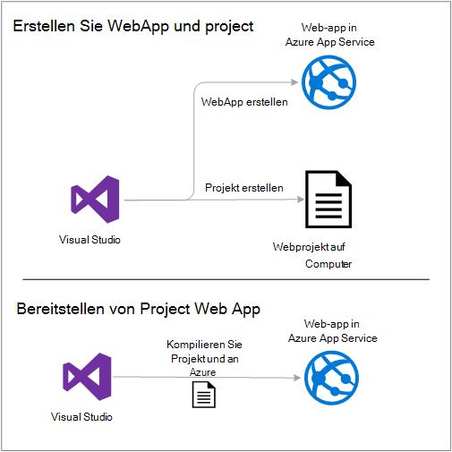

Am Ende des Lernprogramms gibt ein Abschnitt [Problembehandlung](#troubleshooting) Ideen, wenn etwas nicht funktioniert und [Weiter](#next-steps) Abschnitt enthält Links zu anderen Lernprogramme zur Verwendung von Azure App Service genauer eingehen.

Wie ein erste-Schritte-Lernprogramm sieht ist das Webprojekt zeigt zum Bereitstellen einfach, die keine Datenbank verwenden und keine Authentifizierung oder Autorisierung. Links zu fortgeschrittenen Themen finden Sie unter [Bereitstellen einer Azure Web app](web-sites-deploy.md).

Neben den Zeitaufwand für das Azure SDK für .NET installieren dauert dieses Lernprogramm ca. 10-15 Minuten.

## Erforderliche Komponenten

* Es wird vorausgesetzt, dass Sie mit ASP.NET MVC und Visual Studio gearbeitet haben. Einführung, finden Sie unter [Erste Schritte mit ASP.NET MVC 5](http://www.asp.net/mvc/overview/getting-started/introduction/getting-started).

* Sie benötigen ein Azure-Konto. Sie können [ein kostenloses Azure-Konto öffnen](/pricing/free-trial/?WT.mc_id=A261C142F) [Abonnementvorteile Visual Studio aktivieren](/pricing/member-offers/msdn-benefits-details/?WT.mc_id=A261C142F). 

    Wenn Sie mit Azure App Service beginnen, bevor Sie für ein Azure-Konto, gehen Sie [versuchen App](http://go.microsoft.com/fwlink/?LinkId=523751)Service. Es können eine kurzlebige Starter-app in App Service – keine Kreditkarte und keine Zusagen.

## Einrichten der Entwicklungsumgebung

Das Lernprogramm ist Visual Studio 2015 [Azure SDK für .NET](../dotnet-sdk.md) 2.9 oder höher geschrieben. 

* [Herunterladen der neuesten Azure SDK für Visual Studio 2015](http://go.microsoft.com/fwlink/?linkid=518003). Das SDK installiert Visual Studio 2015, wenn es noch nicht.

    >[AZURE.NOTE] Wie viele Abhängigkeiten SDK auf Ihrem Computer bereits konnte das SDK installieren lange mehrere Minuten bis eine halbe Stunde dauern.

Wenn Sie Visual Studio 2013 und verwenden möchten, können Sie [die neuesten Azure SDK für Visual Studio 2013 herunterladen](http://go.microsoft.com/fwlink/?LinkID=324322). Einige Bildschirme können die Illustrationen anders aussehen.

## Konfigurieren Sie ein neues Webprojekt

Im nächste Schritt wird ein Webprojekt in Visual Studio und Web-app in Azure App Service erstellen. In diesem Abschnitt des Lernprogramms konfigurieren Sie neues Webprojekt. 

1. Öffnen Sie Visual Studio 2015.

2. Klicken Sie auf **Datei > Neu > Projekt**.

3. Klicken Sie im Dialogfeld **Neues Projekt** auf **Visual C# > Web > ASP.NET Web Application**.

3. Stellen Sie sicher, dass **.NET Framework 4.5.2** als Zielframework ausgewählt ist.

4.  [Azure Anwendung Einblicke](../application-insights/app-insights-overview.md) überwacht für Verfügbarkeit, Performance und Nutzung Ihrer Anwendung. Die **Anwendung Insights Projekt hinzufügen** von standardmäßig das erste Kontrollkästchen nach der Installation von Visual Studio ein Webprojekt zu erstellen. Deaktivieren Sie das Kontrollkästchen aktiviert ist, aber Anwendung Einblicke versuchen möchten.

4. Nennen Sie die Anwendung **EIGENESBEISPIEL**, und klicken Sie dann auf **OK**.

    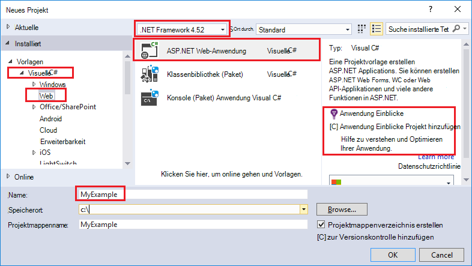

5. Wählen Sie im Dialogfeld **Neues Projekt von ASP.NET** **MVC** -Vorlage aus und dann auf **Authentifizierung ändern**.

    Für dieses Lernprogramm stellen Sie ein ASP.NET MVC-Webprojekt. Wenn Sie ein ASP.NET Web API-Projekt bereitstellen möchten, finden Sie im Abschnitt [Weiter](#next-steps) . 

    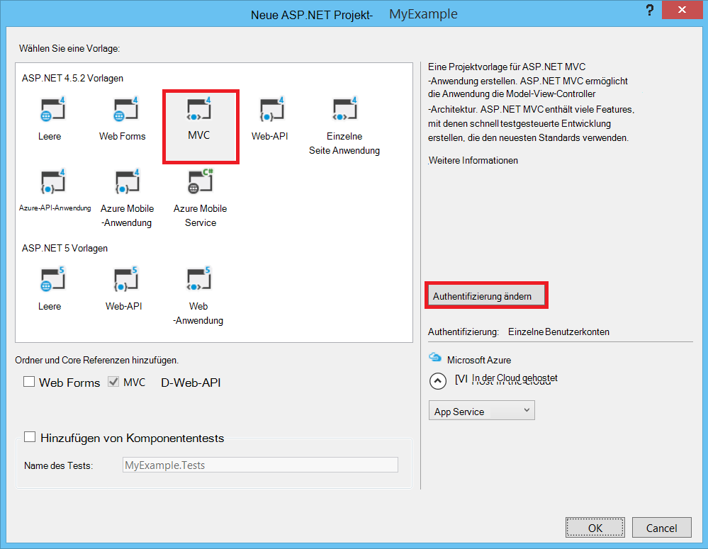

6. Klicken Sie im Dialogfeld **Authentifizierung ändern** klicken Sie auf **Keine Authentifizierung**, und klicken Sie auf **OK**.

    

    Für dieses Lernprogramm Erste Schritte Bereitstellen Sie eine einfache Anwendung, die nicht Benutzer anmelden.

5. Im Abschnitt **Microsoft Azure** im Dialogfeld **Neues Projekt ASP.NET** sicher, dass **in der Cloud zu hosten** aktiviert ist und **App-Dienst** in der Liste ausgewählt ist.

    

    Dazu weisen Visual Studio eine Azure Web app für das Webprojekt zu erstellen.

6. Klicken Sie auf **OK**

## Konfigurieren von Azure Ressourcen für neue Web app

Jetzt sagen Sie Visual Studio Azure Ressourcen, die Sie erstellen möchten.

5. Klicken Sie im Dialogfeld **Create App Service** klicken Sie auf **Konto hinzufügen**, und melden Sie sich Azure-ID und Kennwort des Kontos ein, mit denen Sie Ihre Azure-Abonnement verwalten.

    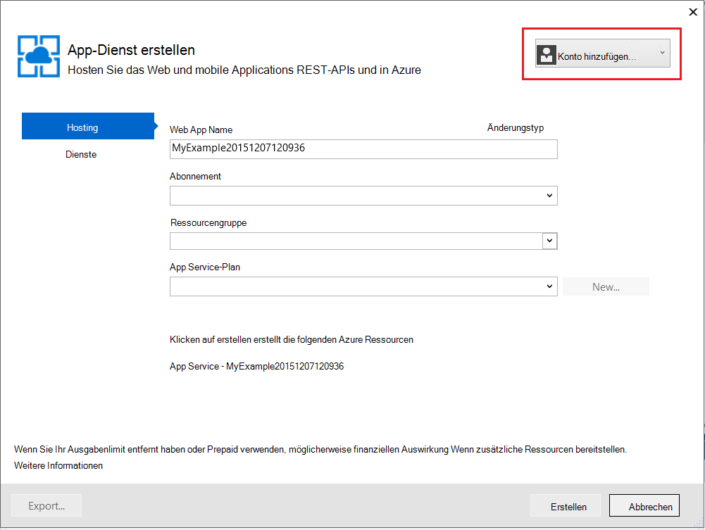

    Wenn Sie bereits zuvor auf demselben Computer angemeldet, sehen Sie nicht die Schaltfläche **Konto hinzufügen** . In diesem Fall diesen Schritt überspringen oder Sie müssen Ihre Anmeldeinformationen erneut eingeben.
 
3. Geben Sie einen **Web App Name** , der in der **.azurewebsites.NET* -Domäne eindeutig ist. Beispielsweise können Sie es EIGENESBEISPIEL Zahlen rechts zu wie MyExample810 eindeutige Namen. Wenn Sie standardmäßige Namen erstellt wird, werden eindeutige und können.

    Wenn jemand bereits der Name, den Sie eingeben verwendet, ein rotes Ausrufezeichen rechts statt ein grünes Häkchen angezeigt und Sie müssen einen anderen Namen eingeben.

    Die URL für Ihre Anwendung ist dieser Name plus *. *.azurewebsites.NET*. Beispielsweise wird der Name `MyExample810`, die URL `myexample810.azurewebsites.net`.

    Sie können auch eine benutzerdefinierte Domäne mit einer Azure Web app. Weitere Informationen finden Sie unter [Konfigurieren einer benutzerdefinierten Domänennamen in Azure App Service](web-sites-custom-domain-name.md).

6. Klicken Sie neben dem Feld **Ressourcengruppe** **neu** und dann geben Sie ein "EIGENESBEISPIEL" oder einen anderen Namen Sie. 

    

    Eine Ressourcengruppe ist eine Sammlung von Azure Ressourcen wie webapps, Datenbanken und VMs. Ein Lernprogramm empfiehlt sich im Allgemeinen eine neue Ressourcengruppe erstellen, da können sie leicht in einem Schritt Azure Ressourcen löschen, die Sie für das Lernprogramm erstellen. Weitere Informationen finden Sie unter [Azure-Ressourcen-Manager (Übersicht)](../azure-resource-manager/resource-group-overview.md).

4. Klicken Sie auf **neu** , neben der Dropdownliste **App Service-Plan** .

    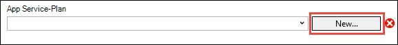

    Das Dialogfeld **App Service-Plan konfigurieren** wird angezeigt.

    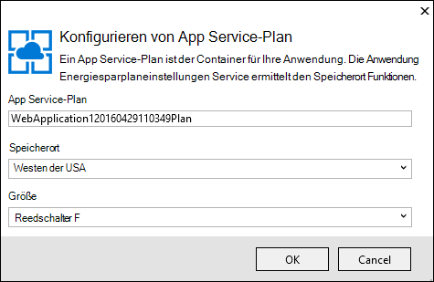

    In den folgenden Schritten konfigurieren Sie einen App Service-Plan für die neue Ressourcengruppe. Ein App Service-Plan gibt Serverressourcen, die in Ihrer Anwendung ausgeführt wird. Beispielsweise wählt die freie Ebene während der Ausführung API-app auf freigegebenen VMs für einige bezahlte Tiers auf dedizierten VMs Ausführung. Weitere Informationen finden Sie unter [Übersicht über App Service-Pläne](../app-service/azure-web-sites-web-hosting-plans-in-depth-overview.md).

5. Klicken Sie im Dialogfeld **Konfigurieren App Service-Plan** Geben Sie ein "MyExamplePlan" oder einen anderen Namen Sie.

5. Wählen Sie in der Dropdown-Liste **Speicherort** den Speicherort, die Sie.

    Diese Einstellung gibt die Azure-Rechenzentrum Ihre Anwendung ausgeführt wird. In diesem Lernprogramm wird kein Region auswählen und es einen Unterschied. Aber für eine produktionsanwendung Ihre Server so nah wie möglich an die Clients, die diese [Wartezeit](http://www.bing.com/search?q=web%20latency%20introduction&qs=n&form=QBRE&pq=web%20latency%20introduction&sc=1-24&sp=-1&sk=&cvid=eefff99dfc864d25a75a83740f1e0090)minimieren zugreifen.

5. Klicken Sie in der Dropdownliste **Größe** **frei**.

    Für dieses Lernprogramm bietet kostenlose Tarif gut genug Leistung.

6. Klicken Sie im Dialogfeld **Konfigurieren App Service-Plan** auf **OK**.

7. Klicken Sie im Dialogfeld **Create App Service** **Erstellen**.

## Visual Studio erstellt die Projekt und Web app

In kurzer Zeit in der Regel weniger als eine Minute erstellt Visual Studio das Webprojekt und Web app.  

**Projektmappen** -Explorer zeigt die Dateien und Ordner in das neue Projekt.

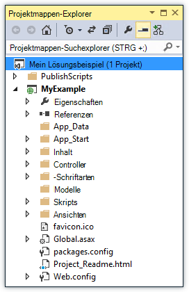

**Azure App Serviceaktivität** Fenster zeigt die Webanwendung erstellt wurde.

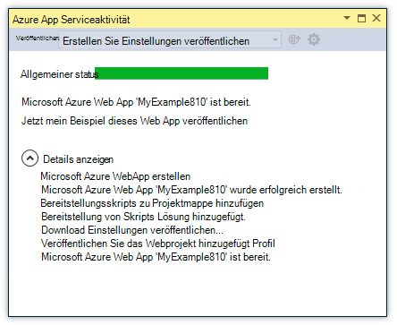

Das **Cloud Explorer** -Fenster können Sie anzeigen und Verwalten von Azure-Ressourcen, einschließlich der neuen Web-app, die Sie gerade erstellt haben.

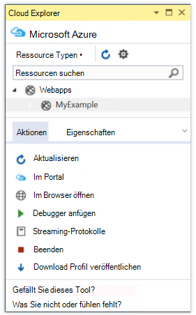
    
## Bereitstellen des Webprojekts zu Azure Web app

In diesem Abschnitt stellen Sie Web Project Web App.

1. Im **Projektmappen-Explorer**mit der rechten Maustaste des Projekts und wählen Sie **Veröffentlichen**.

    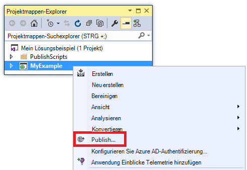

    In wenigen Sekunden erscheint der **Veröffentlichen** -Assistent. Der Assistent öffnet ein *Profil veröffentlichen* , die Einstellungen für das Webprojekt neue Web App bereitstellen.

    Das Veröffentlichungsprofil enthält einen Benutzernamen und ein Kennwort für die Bereitstellung.  Diese Anmeldeinformationen für Sie erzeugt wurden, und müssen sie eingeben. Das Kennwort wird verschlüsselt im benutzerspezifischen versteckt in die `Properties\PublishProfiles` Ordner.
 
8. Klicken Sie auf der Registerkarte **Verbindung** des **Veröffentlichen** -Assistenten auf **Weiter**.

    

    Als Nächstes folgt **die Registerkarte** . Hier können Sie die Buildkonfiguration einen Debugbuild [Remotedebuggen](../app-service-web/web-sites-dotnet-troubleshoot-visual-studio.md#remotedebug)Bereitstellung ändern. Die Registerkarte enthält außerdem [Optionen für veröffentlichen](https://msdn.microsoft.com/library/dd465337.aspx#Anchor_2).

10. Klicken Sie auf **der Registerkarte** auf **Weiter**.

    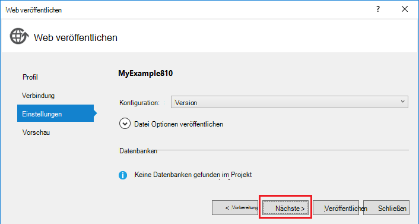

    Die Registerkarte **Vorschau** ist. Hier haben Sie die Möglichkeit zu sehen, welche Dateien aus dem Projekt in der API-Anwendung kopiert werden. Wenn Sie ein Projekt an eine API-Anwendung, die Sie zum zuvor bereits bereitstellen, werden nur geänderte Dateien kopiert. Wenn finden eine Übersicht darüber, was kopiert werden soll, können Sie die **Vorschau starten** klicken.

11. Klicken Sie auf der Registerkarte **Vorschau** **Veröffentlichen**.

    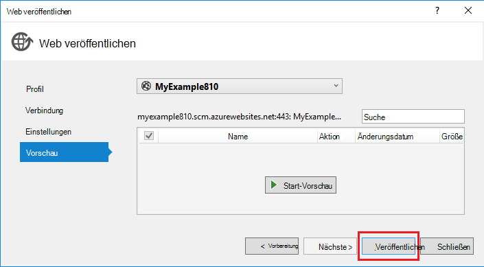

    Wenn Sie **Veröffentlichen**klicken, beginnt Visual Studio Dateien Azure Server kopieren. Dies kann einige Minuten dauern.

    Fenster **Ausgabe** und **Azure App Serviceaktivität** anzeigen, welche Aktionen Bereitstellung wurden und Abschluss der Bereitstellung meldet.

    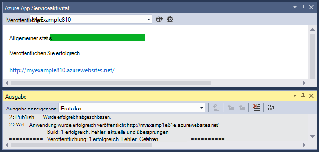

    Bei der erfolgreichen Bereitstellung Standardbrowser öffnet automatisch die URL bereitgestellten Web App und der erstellten Anwendung wird jetzt in der Cloud ausgeführt. Die URL in der Adressleiste des Browsers zeigt, dass die Webanwendung aus dem Internet geladen wird.

    

    > [AZURE.TIP]Sie können die Symbolleiste **Eine klicken Webs** für schnelle Bereitstellung. Klicken Sie auf **Anzeigen > Symbolleisten**, und wählen Sie dann **Eine klicken Webs**. Verwenden die Symbolleiste wählen ein Profil und klicken Sie auf veröffentlichen klicken Sie zum Öffnen des **Veröffentlichen** -Assistenten.
    > 

## Problembehandlung

Wenn Sie auf ein Problem gestoßen, während Sie dieses Lernprogramm durchgehen, stellen Sie sicher, dass Sie die neueste Version von Azure SDK für .NET verwenden. Die einfachste Möglichkeit dafür ist [Azure SDK für Visual Studio 2015 herunterladen](http://go.microsoft.com/fwlink/?linkid=518003). Wenn Sie die aktuelle Version installiert haben, können Web Platform Installer wissen Sie, dass keine Installation erforderlich.

Wenn Sie in einem Unternehmensnetzwerk und Azure App Service über eine Firewall bereitstellen möchten, sicherstellen Sie, dass die Ports 443 und 8172 für Web Deploy geöffnet sind. Wenn Sie diese Ports öffnen können, finden Sie unter den folgenden Abschnitt nächste Schritte Weitere Bereitstellungsoptionen.

Nachdem Sie Ihre ASP.NET Web-Anwendung in Azure App Service ausgeführt haben, möchten Sie weitere Informationen zu Visual Studio-Funktionen, die Problembehandlung zu vereinfachen. Informationen zur Protokollierung Remotedebuggen und mehr finden Sie unter [Problembehandlung bei Azure webapps in Visual Studio](web-sites-dotnet-troubleshoot-visual-studio.md).

## Nächste Schritte

In diesem Lernprogramm haben Sie erfahren, wie eine einfache Anwendung erstellen und Bereitstellen einer Azure Web App. Hier sind einige Themen und Azure App Service mehr Ressourcen:

* Überwachen Sie und verwalten Sie Ihrer Anwendung in [Azure-Portal](https://portal.azure.com/). 

    Weitere Informationen finden Sie unter [Überblick über Azure-Portal](/services/management-portal/) und [Konfigurieren webapps in Azure App Service](web-sites-configure.md).

* Eine neue Web-App mit Visual Studio bereitstellen Sie ein vorhandenen Webprojekt

    Maustaste auf das Projekt im **Projektmappen-Explorer**, und klicken Sie auf **Veröffentlichen**. Wählen Sie **Microsoft Azure App Service** als Veröffentlichungsziel und dann auf **neu**. Dialogfelder sind in diesem Lernprogramm gesehen identisch.

* Bereitstellen eines Webprojekts vom Datenquellen-Steuerelement

    Informationen zum [Automatisieren der Bereitstellung](http://www.asp.net/aspnet/overview/developing-apps-with-windows-azure/building-real-world-cloud-apps-with-windows-azure/continuous-integration-and-continuous-delivery) von einem [Quellcodeverwaltungssystem](http://www.asp.net/aspnet/overview/developing-apps-with-windows-azure/building-real-world-cloud-apps-with-windows-azure/source-control)finden Sie unter [Erste Schritte mit Web-apps in Azure App Service](app-service-web-get-started.md) und [zum Bereitstellen einer Azure Web app](web-sites-deploy.md).

* Bereitstellen Sie ein ASP.NET Web API um eine API-app in Azure App Service

    Sie haben gesehen, wie eine Instanz von Azure App Service erstellt, die vor allem ist eine Website. App Service bietet Funktionen zum Hosten von APIs wie CORS und API-Metadaten-Unterstützung für die Generierung von Code. Können Sie in einer Web-app-API-Funktionen, aber Sie hauptsächlich eine API in einer Instanz der App-Dienst hosten möchten, eine **API-app** wäre besser geeignet. Weitere Informationen finden Sie unter [Erste Schritte mit API-Apps und ASP.NET in Azure App Service](../app-service-api/app-service-api-dotnet-get-started.md). 

* Hinzufügen eines benutzerdefinierten Domänennamen und SSL

    Informationen zur Verwendung von SSL und Ihre Domäne (z. B. www.contoso.com statt contoso.azurewebsites.net) finden Sie in folgenden Ressourcen:

    * [Konfigurieren Sie einen benutzerdefinierten Domänennamen in Azure App Service](web-sites-custom-domain-name.md)
    * [HTTPS für eine Azure-Website aktivieren](web-sites-configure-ssl-certificate.md)

* Löschen Sie die Ressourcengruppe, die Ihrer Anwendung und alle zugehörigen Azure Ressourcen enthält, wenn Sie damit fertig sind.

    Informationen zur Verwendung von Ressourcengruppen in Azure-Portal finden Sie [Ressourcen mit Ressourcen-Manager und Azure-Portal bereitstellen](../resource-group-template-deploy-portal.md).   

*   Weitere Beispiele für das Erstellen einer ASP.NET Web App in App Service finden Sie unter [Erstellen und Bereitstellen eine ASP.NET Web-Anwendung in Azure App Service](https://github.com/Microsoft/HealthClinic.biz/wiki/Create-and-deploy-an-ASP.NET-web-app-in-Azure-App-Service) und [Erstellen und Bereitstellen eine mobile Anwendung in Azure App Service](https://github.com/Microsoft/HealthClinic.biz/wiki/Create-and-deploy-a-mobile-app-in-Azure-App-Service) [HealthClinic.biz](https://github.com/Microsoft/HealthClinic.biz) 2015 verbinden [Demo](https://blogs.msdn.microsoft.com/visualstudio/2015/12/08/connectdemos-2015-healthclinic-biz/). Weitere Schnellstarts HealthClinic.biz Demo finden Sie unter [Azure Developer Tools Schnellstarts](https://github.com/Microsoft/HealthClinic.biz/wiki/Azure-Developer-Tools-Quickstarts).
