<properties 
    pageTitle="Azure Line-of-Business-Anwendung mit AD FS-Authentifizierung erstellen | Microsoft Azure" 
    description="Informationen Sie zum Erstellen einer LOB Anwendung in Azure App Service, die Authentifizierung mit lokalen STS. Dieses Lernprogramm richtet AD FS als lokale STS." 
    services="app-service\web" 
    documentationCenter=".net" 
    authors="cephalin" 
    manager="wpickett" 
    editor=""/>

<tags 
    ms.service="app-service-web" 
    ms.devlang="dotnet" 
    ms.topic="article" 
    ms.tgt_pltfrm="na" 
    ms.workload="web" 
    ms.date="08/31/2016" 
    ms.author="cephalin"/>

# Erstellen Sie Azure Line-of-Business-Anwendung mit AD FS-Authentifizierung

Dieser Artikel beschreibt, wie eine ASP.NET MVC LOB Anwendung in [Azure App Service](../app-service/app-service-value-prop-what-is.md) erstellen mithilfe einer lokalen [Active Directory Federation Services](http://technet.microsoft.com/library/hh831502.aspx) als Identitätsanbieter. Dieses Szenario kann LOB Anwendung in Azure App Service erstellen möchten als Ihre Organisation erfordert Verzeichnisdaten vor Ort gespeichert werden.

>[AZURE.NOTE] Übersicht der Optionen Unternehmen Authentifizierung und Autorisierung Azure App Service finden Sie unter [Authentifizierung mit lokalen Active Directory in der Azure-Anwendung](web-sites-authentication-authorization.md).

## Erstellen Sie ##

Erstellen Sie eine grundlegende ASP.NET Anwendung in Azure App Service Web Apps mit folgenden Features:

- Authentifiziert Benutzer mit AD FS
- Verwendet `[Authorize]` Autorisierung von Benutzern für verschiedene Aktionen
- Statische Konfiguration zum Debuggen in Visual Studio und App Service Web Apps veröffentlichen (einmal konfigurieren, Debuggen und jederzeit veröffentlichen)  

## Was Sie benötigen ##

[AZURE.INCLUDE [free-trial-note](../../includes/free-trial-note.md)]

Benötigen Sie zum Bearbeiten dieses Lernprogramms:

- Einer lokalen AD FS-Bereitstellung (eine End-to-End-Anleitung des Testlabors in diesem Lernprogramm verwendeten finden Sie unter [Test Lab: eigenständige STS mit AD FS in Azure VM (Test)](https://blogs.msdn.microsoft.com/cephalin/2014/12/21/test-lab-standalone-sts-with-ad-fs-in-azure-vm-for-test-only/))
- Berechtigungen zum Erstellen von verlassen Partei Vertrauensstellungen in AD FS-Verwaltung
- Visual Studio 2013 Update 4 oder höher
- [Azure SDK 2.8.1](http://go.microsoft.com/fwlink/p/?linkid=323510&clcid=0x409) oder höher

## Verwenden Sie Beispiel für LOB Vorlage ##

Beispiel-Anwendung in diesem Lernprogramm [WebApp WSFederation DotNet)](https://github.com/AzureADSamples/WebApp-WSFederation-DotNet), Azure Active Directory-Team erstellt. Da AD FS WS-Federation unterstützt, können es als Vorlage Sie Line-of-Business-Anwendung erstellen. Es weist die folgenden Features:

- [WS-Federation](http://msdn.microsoft.com/library/bb498017.aspx) für lokale Authentifizierung verwendet AD FS-Bereitstellung
- Anmelden und Abmelden Funktionalität
- Verwendet [Microsoft.Owin](http://www.asp.net/aspnet/overview/owin-and-katana/an-overview-of-project-katana) (statt Windows Identity Foundation), die die Zukunft ASP.NET und einfacher für Authentifizierung und Autorisierung als WIF

## Beispiel-Anwendung einrichten ##

2.  Klonen oder die Beispielprojektmappe in [WebApp WSFederation DotNet](https://github.com/AzureADSamples/WebApp-WSFederation-DotNet) in einem lokalen Verzeichnis herunterladen.

    > [AZURE.NOTE] Die Anweisungen [README.md](https://github.com/AzureADSamples/WebApp-WSFederation-DotNet/blob/master/README.md) veranschaulichen die Anwendung in Azure Active Directory einrichten. Aber in diesem Lernprogramm mit ADFS eingerichtet, so gehen Sie hier stattdessen.

3.  Öffnen Sie die Projektmappe, und öffnen Sie Controllers\AccountController.cs im **Projektmappen-Explorer**.

    Sie sehen, gibt der Code einfach eine Herausforderung für die Benutzerauthentifizierung mit WS-Federation. Alle Authentifizierung wird in App_Start\Startup.Auth.cs konfiguriert.

4.  Öffnen Sie App_Start\Startup.Auth.cs. In der `ConfigureAuth` Methode, beachten Sie die Zeile:

        app.UseWsFederationAuthentication(
            new WsFederationAuthenticationOptions
            {
                Wtrealm = realm,
                MetadataAddress = metadata                                      
            });

    Owin-Welt ist dieser Ausschnitt wirklich Sie WS-Federation Authentifizierung müssen Minimum. Es ist einfacher und eleganter als WIF wo Web.config XML überall eingefügt wird. Sie müssen lediglich der relying Party (RP)-ID und die URL der Metadatendatei den AD FS-Dienst. Hier ist ein Beispiel:

    -   RP-Kennung:`https://contoso.com/MyLOBApp`
    -   Metadaten-Adresse:`http://adfs.contoso.com/FederationMetadata/2007-06/FederationMetadata.xml`

5.  App_Start\Startup.Auth.cs ändern Sie die folgenden statische Zeichenfolgendefinitionen:  
    <pre class="prettyprint">
    Private statische Zeichenfolge Bereich = ConfigurationManager.AppSettings["ida:<mark>RPIdentifier</mark>"]; <mark><del>private static String AadInstance = ConfigurationManager.AppSettings["ida:AADInstance"],</del></mark> 
     <mark><del>private statische Zeichenfolge Mieter = ConfigurationManager.AppSettings["ida:Tenant"],</del></mark> 
     <mark><del>private statische Zeichenfolge Metadaten = Zeichenfolge. Format ("{0} / {1} /federationmetadata/2007-06/federationmetadata.xml", AadInstance, Pächter);</del></mark> 
     <mark>private statische Zeichenfolge Metadaten = Zeichenfolge. Format ("https:// {0} /federationmetadata/2007-06/federationmetadata.xml", ConfigurationManager.AppSettings["ida:ADFS"]),</mark>

    <mark><del>Behörde String = String.Format (CultureInfo.InvariantCulture, AadInstance, Pächter);</del></mark>
    </pre>

6.  Jetzt ändern Sie entsprechende in Web.config. Öffnen Sie die Web.config-Datei und ändern Sie die Anwendung Folgendes:  
    <pre class="prettyprint">
    &lt;appSettings&gt;
    &lt;add key="webpages:Version" value="3.0.0.0" /&gt;
    &lt;add key="webpages:Enabled" value="false" /&gt;
    &lt;add key="ClientValidationEnabled" value="true" /&gt;
    &lt;add key="UnobtrusiveJavaScriptEnabled" value="true" /&gt;
      <mark><del>&lt;add key="ida:Wtrealm" value="[Enter the App ID URI of WebApp-WSFederation-DotNet https://contoso.onmicrosoft.com/WebApp-WSFederation-DotNet]" /&gt;</del></mark>
      <mark><del>&lt;add key="ida:AADInstance" value="https://login.windows.net" /&gt;</del></mark>
      <mark><del>&lt;add key="ida:Tenant" value="[Enter tenant name, e.g. contoso.onmicrosoft.com]" /&gt;</del></mark>
      <mark>&lt;add key="ida:RPIdentifier" value="[Enter the relying party identifier entsprechend der Konfiguration in AD FS, z. B. Https://localhost:44320 /] "/&gt;</mark>
      <mark>&lt;Schlüssel hinzufügen ="Ida: ADFS"Value ="[Geben Sie den vollqualifizierten Domänennamen des AD FS-Dienst, z. B. adfs.contoso.com]"/&gt; </mark>        

    &lt;/appSettings&gt;
    </pre>

    Geben Sie die Werte basierend auf der jeweiligen Umgebung.

7.  Erstellen Sie die Anwendung, um sicherzustellen, dass keine Fehler vorhanden sind.

Das wars. Nun ist die beispielanwendung mit AD FS. Sie müssen noch eine RP Vertrauensstellung mit dieser Anwendung in AD FS.

## Bereitzustellen Sie Beispiel in Azure App Service Web Apps

Veröffentlichen Sie hier die Anwendung Web app in App Service Web Apps Beibehaltung der Debugumgebung. Beachten Sie, dass Sie die Anwendung veröffentlichen, bevor sie haben eine RP Vertrauensstellung mit AD FS Authentifizierung noch funktioniert nicht. Allerdings können sie haben nun Web app-URL Sie, mit denen Sie die RP später konfigurieren.

1. Maustaste auf das Projekt und wählen Sie **Veröffentlichen**.

    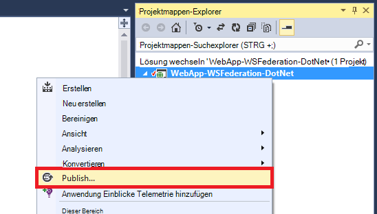

2. **Microsoft Azure App Service**auswählen
3. Wenn Sie in Azure angemeldet haben, klicken Sie auf **Anmelden** und verwenden Sie Microsoft-Konto für Ihr Azure-Abonnement.
4. Nach der Anmeldung klicken Sie auf **neu** , um eine Webanwendung erstellen.
5. Füllen Sie alle erforderlichen Felder aus. Sie wollen Daten später lokale Datenbank für dieses Web app erstellen nicht verbinden.

    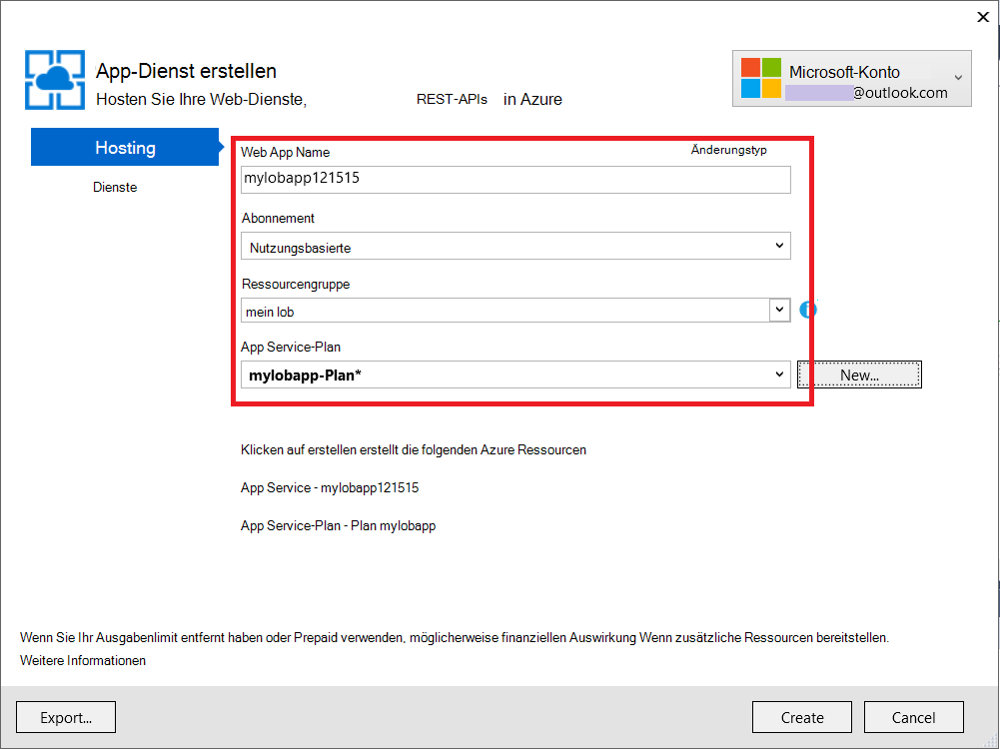

6. Klicken Sie auf **Erstellen**. Erstellte Web app wird das Dialogfeld "Web veröffentlichen" geöffnet.
7. Ändern Sie im **Ziel-URL** **http** zu **Https**. Kopieren Sie den gesamten URL in einen Texteditor zur späteren Verwendung. Klicken Sie dann auf **Veröffentlichen**.

    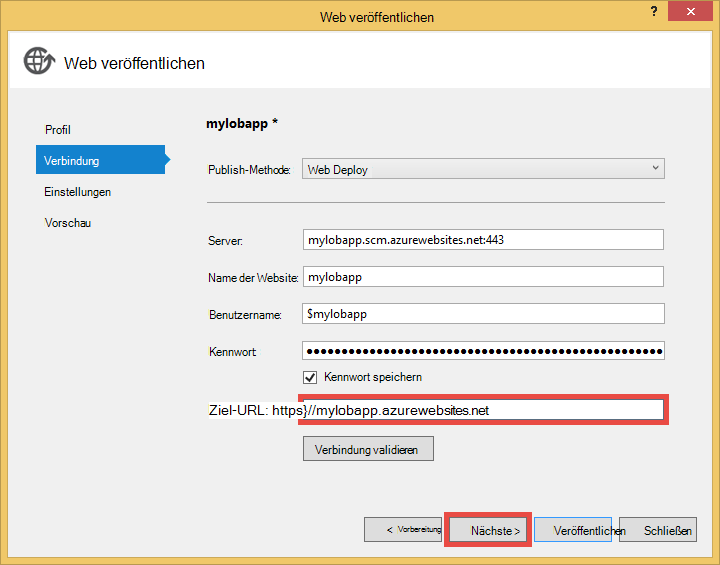

11. Öffnen Sie in Visual Studio im Projekt **Web.Release.config** . Fügen Sie die folgende XML in die `<configuration>` tag, und Ersetzen Sie den Schlüsselwert Publish Web app URL.  
    <pre class="prettyprint">
&lt;AppSettings&gt;
   &lt;fügen Sie Key = "Ida: RPIdentifier" Value = "<mark>[z.B. https://mylobapp.azurewebsites.net/]</mark>" XDT "SetAttributes" xdt:Locator="Match(key) =" /&gt;
&lt;/appSettings&gt;</pre>

Wenn Sie fertig sind, haben Sie zwei RP Bezeichner im Projekt, die Debugumgebung in Visual Studio und veröffentlichte Web app in Azure konfiguriert. Für jede der beiden Umgebungen in AD FS wird eine RP Vertrauensstellung eingerichtet werden. Während des Debuggens wird die Appeinstellungen in der Datei Web.config die **Debug** Konfiguration arbeiten mit AD FS. Wenn veröffentlicht (standardmäßig **die Releasekonfiguration** erscheint), transformierte Web.config hochgeladen, die Änderungen der app in Web.Release.config enthält.

Möchten Sie veröffentlichte Web app in Azure Anfügen des Debuggers (d. h. müssen hochladen Debugsymbole des Codes in der veröffentlichten Web app) erstellen Sie einen Klon der Debugkonfiguration Azure Debuggen ohne eigene benutzerdefinierte Web.config Transformation (z.B. Web.AzureDebug.config), die die Appeinstellungen Web.Release.config verwendet. Dadurch können Sie eine statische Konfiguration in unterschiedlichen Umgebungen verwalten.

## Relying Party Vertrauensstellungen in AD FS-Verwaltung konfigurieren ##

Jetzt müssen Sie eine Vertrauensstellung RP in AD FS-Verwaltung die beispielanwendung verwenden und mit ADFS authentifiziert. Sie müssen zwei separate RP Vertrauensstellungen für Ihre Umgebung Debuggen und für Ihrer veröffentlichten Anwendung einrichten.

> [AZURE.NOTE] Stellen Sie sicher, dass die folgenden Schritte für beide Umgebungen wiederholen.

4.  Der AD FS-Server melden Sie mit Anmeldeinformationen, die Verwaltungsrechte auf AD FS an.
5.  AD FS-Verwaltung zu öffnen. Maustaste **AD FS\Trusted Relationships\Relying vertrauen** und wählen **Hinzufügen verlassen Partei vertrauen**.

    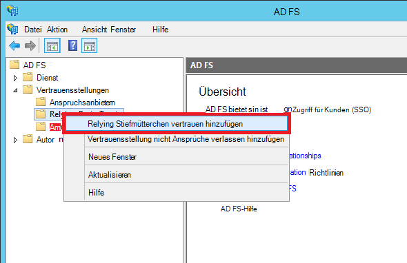

5.  Seite **Datenquelle auswählen** wählen Sie **Daten über die relying Party manuell eingeben**. 

    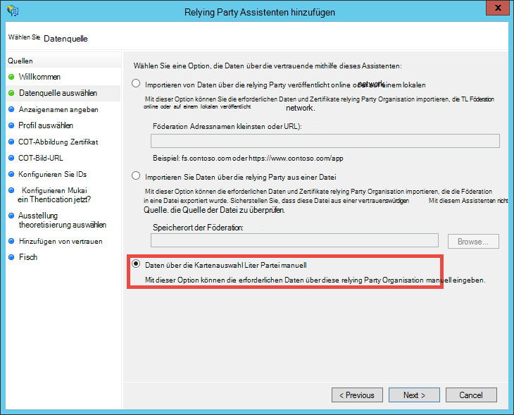

6.  Geben Sie auf der Seite **Anzeigename angeben** einen Anzeigenamen für die Anwendung ein und auf **Weiter**.
7.  Klicken Sie auf **Protokoll auswählen** auf **Weiter**.
8.  Klicken Sie auf der Seite **Zertifikat konfigurieren** auf **Weiter**.

    > [AZURE.NOTE] Da Sie HTTPS bereits verwenden sollten, sind verschlüsselte Token optional. Wenn Sie Tokens von AD FS auf dieser Seite verschlüsseln möchten, müssen Sie Logik Entschlüsseln von Token im Code hinzufügen. Weitere Informationen finden Sie unter [Manuelles Konfigurieren owin-WS-Federation Middleware und verschlüsselte Token akzeptiert](http://chris.59north.com/post/2014/08/21/Manually-configuring-OWIN-WS-Federation-middleware-and-accepting-encrypted-tokens.aspx).
  
5.  Bevor Sie zum nächsten Schritt verschieben, benötigen Sie Informationen aus dem Visual Studio-Projekt. Beachten Sie die **SSL-URL** der Anwendung in den Projekteigenschaften. 

    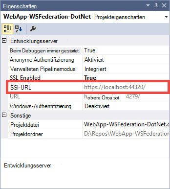

6.  Wählen Sie in AD FS Verwaltung auf **URL konfigurieren** **Verlassen Partei vertrauen Assistenten** **Unterstützung für das WS-Federation Passive Protokoll aktivieren** und die SSL-URL Visual Studio-Projekt, das Sie im vorherigen Schritt erwähnt. Klicken Sie dann auf **Weiter**.

    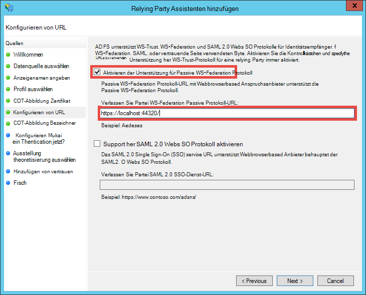

    > [AZURE.NOTE] URL gibt an, wo der Client nach erfolgreicher Authentifizierung senden. Debug-Umgebung sollte <code>https://localhost:&lt;port&gt;/</code>. Für veröffentlichte Web app sollte es Web app-URL.

7.  Auf der Seite **Konfigurieren Bezeichner** aufgeführten Projekt SSL-URL überprüfen Sie und klicken Sie auf **Weiter**. Klicken Sie auf **Weiter** bis zum Ende des Assistenten mit Standardeinstellungen.

    > [AZURE.NOTE] Dieser Bezeichner entspricht im App_Start\Startup.Auth.cs des Visual Studio-Projekts anhand des Werts eines <code>WsFederationAuthenticationOptions.Wtrealm</code> bei Verbundauthentifizierung. Standardmäßig wird die URL der Anwendung aus dem vorherigen Schritt als Bezeichner RP hinzugefügt.

8.  Konfigurieren der RP-Anwendung für das Projekt in AD FS ist jetzt beendet. Anschließend konfigurieren Sie diese Anwendung an die Ansprüche von Ihrer Anwendung benötigt. **Anspruchsregeln bearbeiten** -Dialogfeld wird standardmäßig geöffnet, Sie am Ende des Assistenten so sofort zu starten. Wir konfigurieren mindestens folgenden Angaben (mit Schemas in Klammern):

    -   Zum Unterbrechen von ASP.NET verwendete Name (http://schemas.xmlsoap.org/ws/2005/05/identity/claims/name) - `User.Identity.Name`.
    -   Benutzerprinzipalname (http://schemas.xmlsoap.org/ws/2005/05/identity/claims/upn) - Benutzer in der Organisation eindeutig identifiziert.
    -   Rollen (http://schemas.microsoft.com/ws/2008/06/identity/claims/role) - Gruppenmitgliedschaften verwendet werden `[Authorize(Roles="role1, role2,...")]` Dekoration, Controller-Aktionen zu autorisieren. Tatsächlich kann die meisten leistungsfähigen Rolle Autorisierung dieser Ansatz nicht. Die AD-Benutzer Hunderte von Sicherheitsgruppen gehören, werden sie Hunderte von Rollenansprüche im SAML-Token. Alternativ ist einen einzelnes Rollenanspruch bedingt je nach Mitgliedschaft des Benutzers in einer bestimmten Gruppe zu senden. Allerdings werden wir einfach für dieses Lernprogramm halten.
    -   Name ID (http://schemas.xmlsoap.org/ws/2005/05/identity/claims/nameidentifier) - für gegen Fälschung Überprüfung verwendet werden kann. Weitere Informationen zu Anti-Fälschung Validierung arbeiten finden Sie im Abschnitt **LOB Funktionalität erweitern** erstellen [einer des Geschäftsbereichs Azure-Anwendung mit Azure Active Directory-Authentifizierung](web-sites-dotnet-lob-application-azure-ad.md#bkmk_crud).

    > [AZURE.NOTE] Anspruchstypen müssen Sie zum Konfigurieren der Anwendung wird von der Anwendung benötigt. Die Liste der Ansprüche von Azure Active Directory (d. h. RP Vertrauensstellungen) unterstützt z. B. finden Sie [unterstützt und Anspruchstypen](http://msdn.microsoft.com/library/azure/dn195587.aspx).

8.  Klicken Sie im Dialogfeld Anspruchsregeln bearbeiten auf **Regel hinzufügen**.
9.  Name, UPN und Rollen Ansprüche konfiguriert, wie in der Abbildung dargestellt, und klicken Sie auf **Fertig stellen**.

    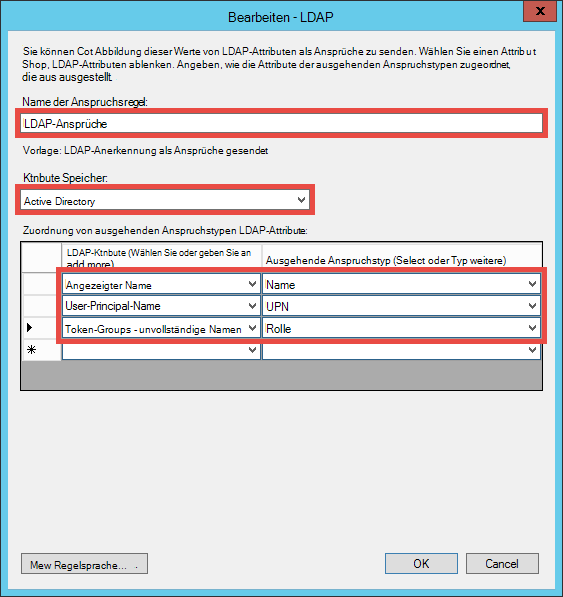

    Anschließend erstellen Sie einen vorübergehenden Namen ID anfordern mit den Schritten, die im [Namen Bezeichner im SAML-Assertionen](http://blogs.msdn.com/b/card/archive/2010/02/17/name-identifiers-in-saml-assertions.aspx).

9.  Klicken Sie erneut auf **Regel hinzufügen** .
10. Wählen Sie **Senden Ansprüche mithilfe einer benutzerdefinierten Regel** , und klicken Sie auf **Weiter**.
11. Fügen Sie die folgende regelsprache im Feld **benutzerdefinierte Regel** Regel **Pro Sitzungsbezeichner** und **Fertig stellen**.  
    <pre class="prettyprint">
    C1: [Typ == "http://schemas.microsoft.com/ws/2008/06/identity/claims/windowsaccountname"] &amp; &amp; 
    c2: [Typ == "http://schemas.microsoft.com/ws/2008/06/identity/claims/authenticationinstant"] = > hinzufügen (Speichern = "_OpaqueIdStore", Typen ("<mark>http://contoso.com/internal/sessionid</mark>") = Abfrage = "{0} { 1}; {2}. {3}. {4} ", Param ="UseEntropy"Param = c1. Wert, Param = c1. OriginalIssuer Param = "", Param = c2. Wert);
    </pre>

    Ihre benutzerdefinierte Regel sollte diese Abbildung aussehen:

    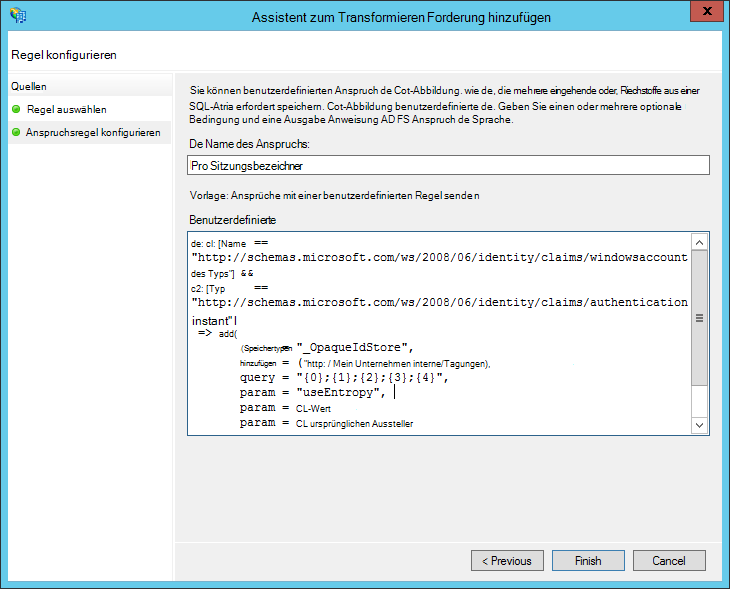

9.  Klicken Sie erneut auf **Regel hinzufügen** .
10. **Transformieren eines eingehenden Anspruchs** und auf **Weiter.**
11. Konfigurieren Sie die Regel wie in der Abbildung (mit den Anspruchstyp in benutzerdefinierten Regel erstellten), und klicken Sie auf **Fertig stellen**.

    

    Ausführliche Informationen zu den Schritten für den vorübergehenden Namen ID Anspruch finden Sie unter [Namen Bezeichner im SAML-Assertionen](http://blogs.msdn.com/b/card/archive/2010/02/17/name-identifiers-in-saml-assertions.aspx).

12. Klicken Sie im Dialogfeld **Anspruchsregeln bearbeiten** auf **Übernehmen** . Es sollte jetzt wie die folgende Abbildung aussehen:

    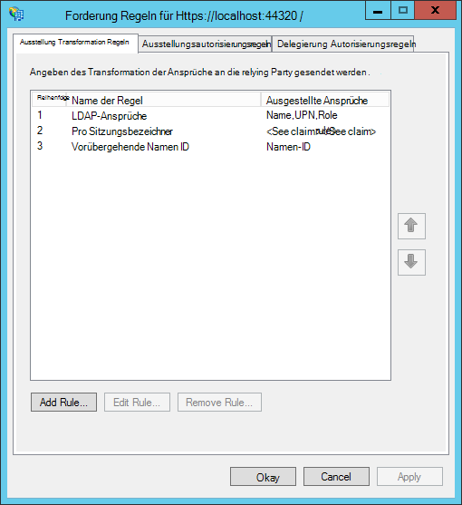

    > [AZURE.NOTE] Wieder sicher, dass diese wiederholen Debugumgebung und veröffentlichte WebApp.

## Verbundauthentifizierung für Ihre Anwendung testen

Sie können die Logik Ihrer Anwendung Authentifizierung mit AD FS testen. In meiner Umgebung AD FS Lab habe einen Testbenutzer Testgruppe in Active Directory (AD) gehört.

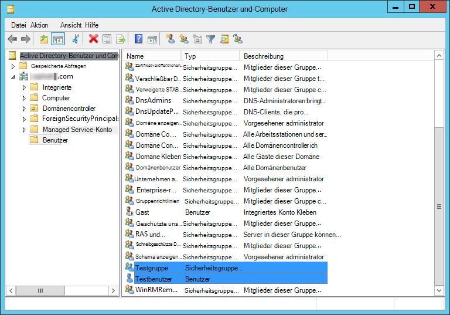

Authentifizierung im Debugger zu testen, müssen Sie jetzt ist `F5`. Navigieren Sie Authentifizierung in der veröffentlichten Web app testen möchten, zu der URL.

Nachdem die Anwendung geladen wurde, klicken Sie auf **Anmelden**. Sie erhalten nun ein oder der Anmeldeseite von AD FS je nach Authentifizierungsmethode von AD FS ausgewählt war. Hier ist was ich Internet Explorer 11.

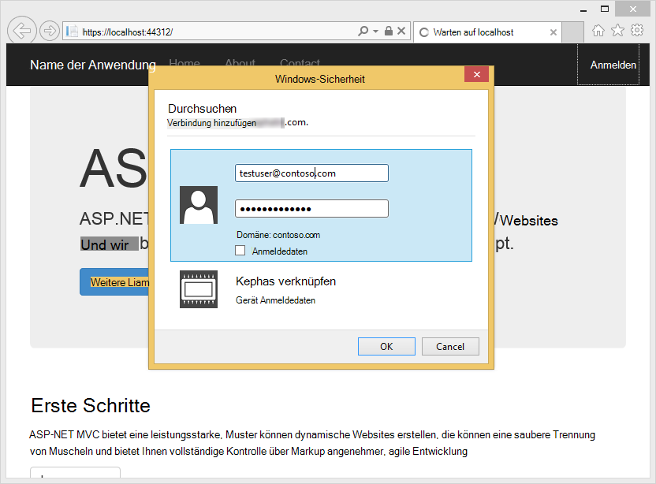

Anmeldung mit einem Benutzer in der AD-Domäne der AD FS-Bereitstellung jetzt müsste die Homepage mit **Hallo, <User Name>!** in der Ecke. Was ist hier.

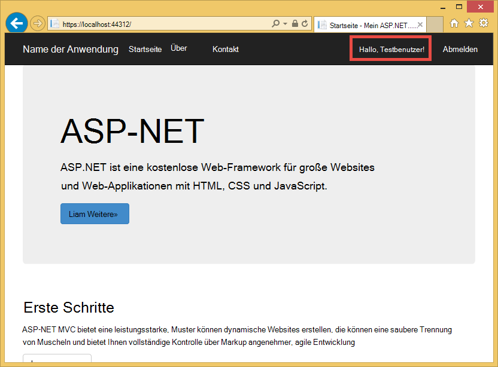

Bisher haben Sie auf folgende Weise erfolgreich:

- Die Anwendung erfolgreich AD FS erreicht hat und ein übereinstimmender Bezeichner RP in AD FS-Datenbank gefunden
- AD FS wurde erfolgreich authentifiziert AD-Benutzerobjekt als Umleitung zurück zur Startseite der Anwendung
- AD FS als gesendet Namensanspruch (http://schemas.xmlsoap.org/ws/2005/05/identity/claims/name) der Anwendung wie die Tatsache, dass der Benutzername in der Ecke angezeigt wird. 

Fehlt der Anspruch, Sie hätte gesehen **Hallo,.**. Wenn man Views\Shared ebenfalls einen\_LoginPartial.cshtml, Sie feststellen, dass es `User.Identity.Name` der Benutzername angezeigt. Wie bereits erwähnt, ist der Anspruch des authentifizierten Benutzers im SAML-Token, spendet ASP.NET dieser Eigenschaft. Darauf, alle Ansprüche, die per AD FS gesendet werden, setzen Sie einen Haltepunkt in Controllers\HomeController, in der Index-Aktionsmethode. Nachdem der Benutzer authentifiziert wurde, überprüfen die `System.Security.Claims.Current.Claims` Auflistung.

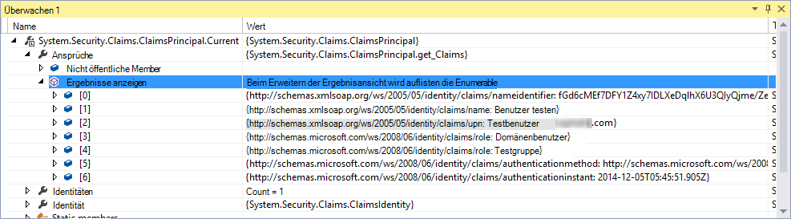 

## Autorisieren von bestimmten Controller oder Aktionen

Da Sie Gruppenmitgliedschaften als Rollenansprüche in der RP Konfiguration aufgenommen haben, jetzt können sie direkt in die `[Authorize(Roles="...")]` Dekoration für Controller und Aktionen. In einer LOB Anwendung mit der Create Read Update löschen (CRUD) können Sie bestimmte Funktionen jeder Aktion auf Autorisieren. Im Moment werden Sie nur diese Funktion auf den Home-Controller ausprobieren.

1. Öffnen Sie Controllers\HomeController.
2. Ergänzen der `About` und `Contact` der authentifizierten Benutzer ähnelt dem folgenden Code mit Sicherheit Aktionsmethoden Mitgliedschaft.  
    <pre class="prettyprint">
    <mark>[Autorisierung (Rolle = "Test Group")]</mark> 
    About() öffentlichen ActionResult {ViewBag.Message = "Ihre Beschreibung Anwendungsseite.";

        return View();
    }

    <mark>[Autorisierung (Rolle = "Domain Admins")]</mark> 
    Contact() öffentlichen ActionResult {ViewBag.Message = "Ihre Kontaktseite.";

        return View();
    }  </pre>

    Da ich in meiner AD FS Lab-Umgebung **Testen Benutzer** **Testgruppe** hinzugefügt, verwende ich Testgruppe Autorisierung testen `About`. Für `Contact`, ich testen negativen Fall **Domänenadministratoren**, **Testen Benutzer** gehört nicht.

3. Starten Sie den Debugger durch Eingabe `F5` anmelden, und klicken Sie auf **Info**. Sie sollten jetzt Anzeigen der `~/About/Index` Seite, wenn der authentifizierte Benutzer für diese Aktion berechtigt ist.
4. Klicken Sie nun auf **Kontakt**, in meinem Fall nicht **Testbenutzer** für die Aktion genehmigen soll. Jedoch wird der Browser AD FS umgeleitet, der schließlich diese Meldung angezeigt wird:

    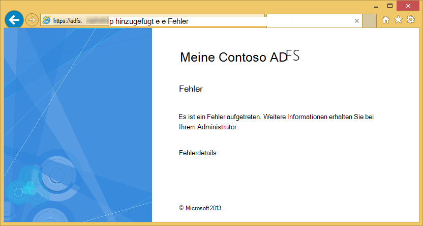

    Dieser Fehler in der Ereignisanzeige auf dem AD FS-Server untersuchen, erscheint diese Ausnahme:  
    <pre class="prettyprint">
   Microsoft.IdentityServer.Web.InvalidRequestException: MSIS7042: <mark>gleichen Clientbrowsersitzung hat '6' Anfragen in den letzten "11" Sekunden.</mark> Informationen erhalten Sie bei Ihrem Administrator.
   bei Microsoft.IdentityServer.Web.Protocols.PassiveProtocolHandler.UpdateLoopDetectionCookie (WrappedHttpListenerContext Kontext) auf Microsoft.IdentityServer.Web.Protocols.WSFederation.WSFederationProtocolHandler.SendSignInResponse (WSFederationContext-Kontext, MSISSignInResponse Antwort) auf Microsoft.IdentityServer.Web.PassiveProtocolListener.ProcessProtocolRequest (ProtocolContext ProtocolContext, PassiveProtocolHandler ProtocolHandler) in Microsoft.IdentityServer.Web.PassiveProtocolListener.OnGetContext (WrappedHttpListenerContext-Kontext) </pre>

    Der Grund für diesen Fehler ist, dass standardmäßig MVC 401 Unauthorized zurückgegeben, wenn Rollen eines Benutzers nicht autorisiert sind. Dadurch wird eine erneute Anforderung der Identitätsanbieter (AD FS). Da der Benutzer bereits authentifiziert ist, gibt sich AD FS auf derselben Seite, die dann mit einem anderen 401 Umleitung Schleife. Überschreiben des AuthorizeAttribute `HandleUnauthorizedRequest` mit einfacher Logik etwas zeigen, die statt der Umleitung Schleife sinnvoll.

5. Erstellen Sie eine Datei im AuthorizeAttribute.cs-Projekt, und fügen Sie den folgenden Code ein.

        using System;
        using System.Web.Mvc;
        using System.Web.Routing;
        
        namespace WebApp_WSFederation_DotNet
        {
            [AttributeUsage(AttributeTargets.Class | AttributeTargets.Method, Inherited = true, AllowMultiple = true)]
            public class AuthorizeAttribute : System.Web.Mvc.AuthorizeAttribute
            {
                protected override void HandleUnauthorizedRequest(AuthorizationContext filterContext)
                {
                    if (filterContext.HttpContext.Request.IsAuthenticated)
                    {
                        filterContext.Result = new System.Web.Mvc.HttpStatusCodeResult((int)System.Net.HttpStatusCode.Forbidden);
                    }
                    else
                    {
                        base.HandleUnauthorizedRequest(filterContext);
                    }
                }
            }
        }

    Überschreibungscode sendet eine HTTP 403 (Verboten) statt HTTP 401 (nicht autorisiert) authentifiziert jedoch nicht autorisierte Anfragen.

6. Führen Sie den Debugger mit `F5`. Auf **Kontakt** jetzt zeigt eine informativere (wenn auch uninteressant) Fehlermeldung:

    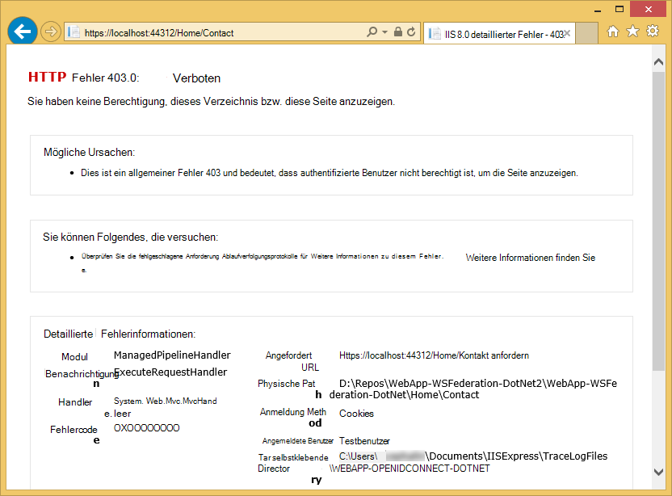

7. Veröffentlichen Sie die Anwendung in Azure App Service Web-Apps, und Testen Sie das Verhalten der aktiven Anwendung.

## Lokale Daten

Eine die LOB Anwendung mit AD FS statt Azure Active Directory implementieren möchten ist Kompatibilitätsprobleme mit Organisation Daten lokal. Dies kann auch bedeuten, dass Ihrer Anwendung in Azure lokale Datenbanken zugreifen muss, da Sie nicht mit [SQL-Datenbank](/services/sql-database/) als Datenebene Web-apps.

Azure App Service Web Apps unterstützt den Zugriff auf lokale Datenbanken mit zwei Ansätze: [Hybrid-Verbindungen](../biztalk-services/integration-hybrid-connection-overview.md) und [Virtuelle Netzwerke](web-sites-integrate-with-vnet.md). Weitere Informationen finden Sie unter [mithilfe von VNET-Integration und Hybrid-Verbindungen mit Azure App Service Web Apps](https://azure.microsoft.com/blog/2014/10/30/using-vnet-or-hybrid-conn-with-websites/).

## Weitere Ressourcen

- [Schützen Sie die Anwendung autorisieren Attribut mit SSL](web-sites-dotnet-deploy-aspnet-mvc-app-membership-oauth-sql-database.md#protect-the-application-with-ssl-and-the-authorize-attribute)
- [Authentifizierung mit lokalen Active Directory in der Azure-Anwendung](web-sites-authentication-authorization.md)
- [Erstellen Sie Azure Line-of-Business-Anwendung mit Azure Active Directory-Authentifizierung](web-sites-dotnet-lob-application-azure-ad.md)
- [Die Option lokale Organisation Authentifizierung (ADFS) mit ASP.NET in Visual Studio 2013](http://www.cloudidentity.com/blog/2014/02/12/use-the-on-premises-organizational-authentication-option-adfs-with-asp-net-in-visual-studio-2013/)
- [Migrieren eines Projekts VS2013 von WIF zu Katana](http://www.cloudidentity.com/blog/2014/09/15/MIGRATE-A-VS2013-WEB-PROJECT-FROM-WIF-TO-KATANA/)
- [Active Directory Federation Services (Übersicht)](http://technet.microsoft.com/library/hh831502.aspx)
- [WS-Federation 1.1-Spezifikation](http://download.boulder.ibm.com/ibmdl/pub/software/dw/specs/ws-fed/WS-Federation-V1-1B.pdf?S_TACT=105AGX04&S_CMP=LP)

