<properties 
    pageTitle="Azure Line-of-Business-Anwendung mit Azure Active Directory-Authentifizierung erstellen | Microsoft Azure" 
    description="Erstellen Sie eine ASP.NET MVC LOB Anwendung in Azure App Service, der authentifiziert Azure Active Directory" 
    services="app-service\web, active-directory" 
    documentationCenter=".net" 
    authors="cephalin" 
    manager="wpickett" 
    editor=""/>

<tags 
    ms.service="app-service-web" 
    ms.devlang="dotnet" 
    ms.topic="article" 
    ms.tgt_pltfrm="na" 
    ms.workload="web" 
    ms.date="09/01/2016" 
    ms.author="cephalin"/>

# Erstellen Sie Azure Line-of-Business-Anwendung mit Azure Active Directory-Authentifizierung #

Dieser Artikel veranschaulicht das Erstellen einer .NET LOB Anwendung in [Azure App Service Web Apps](http://go.microsoft.com/fwlink/?LinkId=529714) mit der [Authentifizierung / Autorisierung](../app-service/app-service-authentication-overview.md) Funktion. Es wird gezeigt, wie die Abfrage Verzeichnisdaten [Azure Active Directory Graph API](https://msdn.microsoft.com/Library/Azure/Ad/Graph/api/api-catalog) in der Anwendung verwenden.

Azure Active Directory Mieter, den Verwendung kann ein Verzeichnis nur Azure. Oder es kann [lokale Active Directory synchronisiert](../active-directory/active-directory-aadconnect.md) eine einzelne Anmeldung für Arbeitskräfte erstellen, lokal und Remote. In diesem Artikel verwendet das Standardverzeichnis für Ihre Azure-Konto.

## Erstellen Sie ##

Erstellen Sie einer einfache Line of Business Create Read Update löschen (CRUD) Anwendung in App Service Web Apps, Spuren mit den folgenden Features Arbeitsaufgaben:

- Authentifiziert Benutzer in Active Directory Azure
- Directory-Benutzer und [Azure Active Directory Graph API](http://msdn.microsoft.com/library/azure/hh974476.aspx) mit Abfragen
- Verwenden Sie die Vorlage ASP.NET MVC *Keine Authentifizierung*

Rollenbasierte Zugriffskontrolle (RBAC) für Ihre LOB Anwendung in Azure, finden Sie unter [Schritt](#next).

## Was Sie benötigen ##

[AZURE.INCLUDE [free-trial-note](../../includes/free-trial-note.md)]

Benötigen Sie zum Bearbeiten dieses Lernprogramms:

- Ein Mieter Azure Active Directory in verschiedenen Gruppen
- Berechtigungen zum Erstellen von Clientanwendungen auf Azure Active Directory Mieter
- Visual Studio 2013 Update 4 oder höher
- [Azure SDK 2.8.1 oder höher](https://azure.microsoft.com/downloads/)

## Erstellen und Bereitstellen einer Webanwendung in Azure ##

1. Klicken Sie in Visual Studio auf **Datei** > **neu** > **Projekt**.

2. Wählen Sie **ASP.NET Web Application**, nennen Sie das Projekt und klicken Sie auf **OK**.

3. Wählen Sie die **MVC** -Vorlage und ändern Sie die Authentifizierung in **Keine Authentifizierung**. **Host in der Cloud** ausgewählt ist, und klicken Sie auf **OK**.

    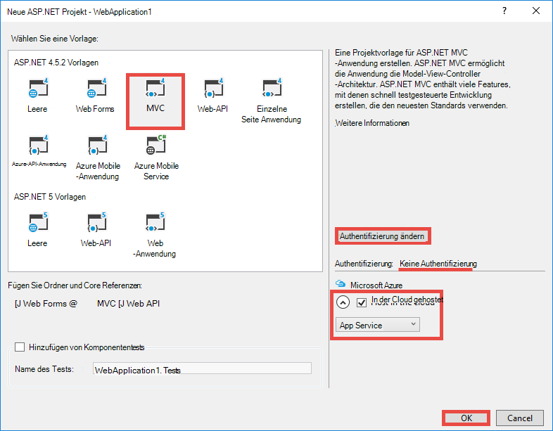

4. Klicken Sie im Dialogfeld **Create App Service** **Konto hinzufügen** (und dann **ein Konto hinzufügen** in der Dropdownliste) Azure-Konto anmelden.

5. Nach der Anmeldung konfigurieren Sie Ihrer Anwendung. Erstellen Sie eine Ressourcengruppe und einen neuen App Service-Plan durch Klicken auf die entsprechende Schaltfläche **neu** . Klicken Sie auf **zusätzliche Azure Services durchsuchen** möchten.

    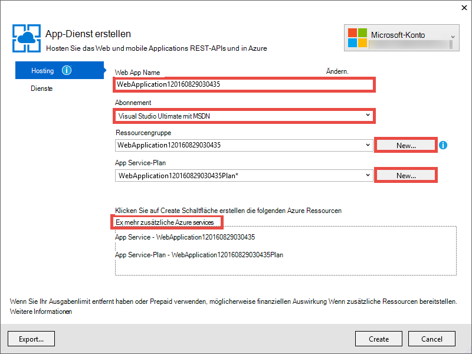

6. Klicken Sie auf der Registerkarte **Dienste** auf **+** auf eine SQL-Datenbank für Ihre Anwendung hinzufügen. 

    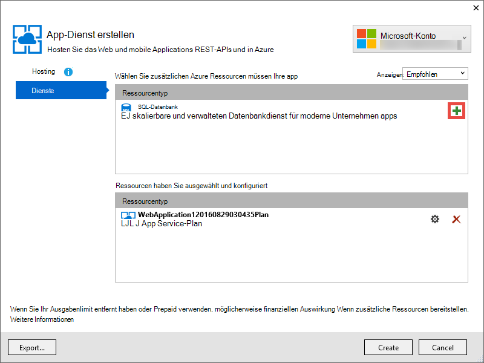

7. **SQL-Datenbank konfigurieren**klicken Sie auf **neu** , um eine SQL Server-Instanz erstellen.

8. Konfigurieren Sie in **SQL Server konfigurieren**Ihre SQL Server-Instanz. Klicken Sie auf **OK**, **OK**und **Erstellen** der app-Erstellung in Azure starten.

9. In **Azure App Serviceaktivität**können Sie sehen, wenn die app-Erstellung abgeschlossen ist. Klicken Sie auf * *Veröffentlichen &lt; *Appname*> Web App jetzt**Klicken Sie auf **veröffentlichen **. 

    Nach Abschluss von Visual Studio wird die app Veröffentlichen im Browser geöffnet. 

    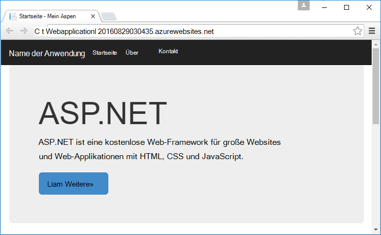

## Konfigurieren von Authentifizierung und Zugriff

1. Auf der [Azure-Portal](https://portal.azure.com)anmelden.

2. Klicken Sie im linken Menü auf **Anwendungsdienste** > **&lt;*Appname*>** > **Authentifizierung / Autorisierung **.

    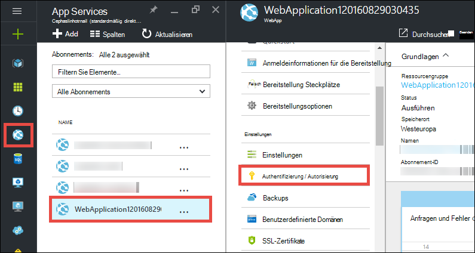

3. Schalten Sie Azure Active Directory-Authentifizierung **auf** > **Azure Active Directory** > **Express** > **OK**.

    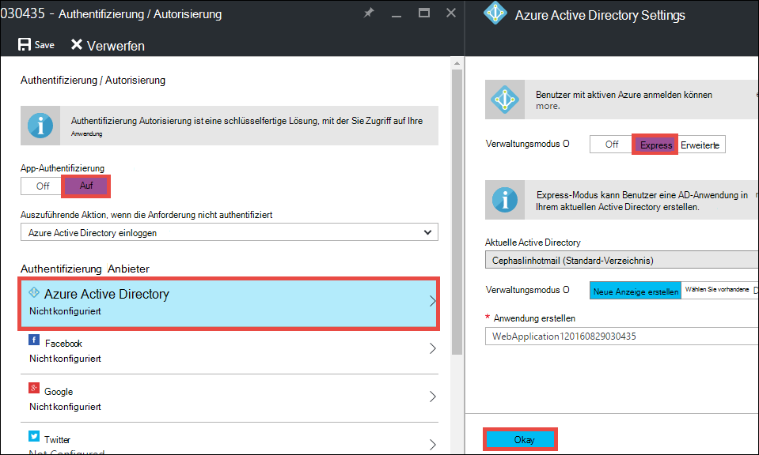

4. **Klicken Sie in der Befehlszeile.**

    

    Versuchen Sie nach Authentifizierung erfolgreich gespeichert sind, zu Ihrer Anwendung erneut im Browser. Die Standardeinstellungen erzwingen Authentifizierung auf die gesamte Anwendung. Wenn Sie bereits angemeldet sind nicht, werden Sie eine Anmeldeseite umgeleitet. Nach der Anmeldung sehen Sie Ihre app durch HTTPS geschützt. Als Nächstes müssen Sie Zugriff auf Daten zu ermöglichen. 

5. Navigieren Sie zu dem [Verwaltungsportal](https://manage.windowsazure.com).

6. Klicken Sie im linken Menü auf **Active Directory** > **Default Directory** > **Programme** > **&lt;*Appname*> **.

    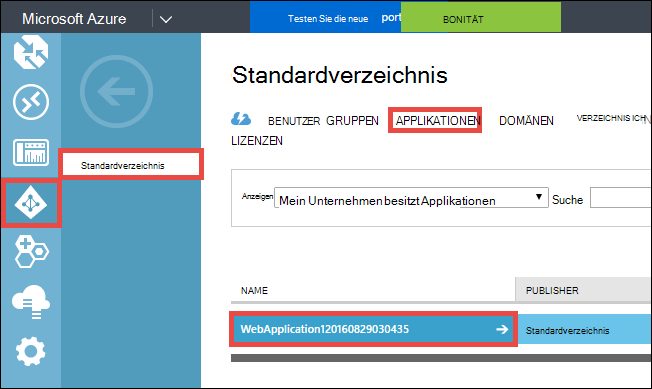

    Dies ist Active Directory Azure-Anwendung, die App Service erstellt die Autorisierung aktivieren / Authentifizierung.

7. Klicken Sie auf **Benutzer** und **Gruppen** , um sicherzustellen, dass einige Benutzer und Gruppen im Verzeichnis verfügen. Wenn nicht, erstellen Sie ein paar Testbenutzer und Gruppen.

    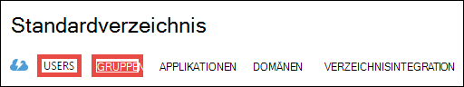

7. Klicken Sie auf **Konfigurieren** , um die Anwendung konfigurieren.

8. **Der Abschnitt** scrollen und Hinzufügen eines Schlüssels durch eine Dauer auswählen. **Delegierte Berechtigungen** und klicken Sie wählen Sie **Verzeichnisdaten lesen**. Klicken Sie auf **Speichern**.

    

8. Nachdem die Einstellungen navigieren Sie zu **dem Abschnitt** , und klicken Sie auf **Kopieren** , um die Clientschlüssel kopieren. 

    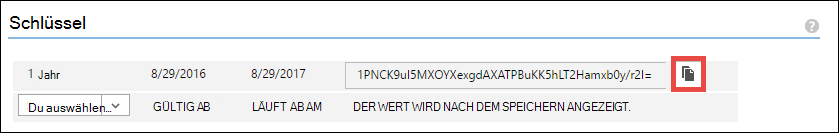

    >[AZURE.IMPORTANT] Wenn Sie diese Seite jetzt verlassen, wird nicht mehr auf diesen Clientschlüssel sein.

9. Als Nächstes müssen Sie Ihrer Anwendung mit diesem Schlüssel. Auf der [Azure-Ressourcen-Explorer](https://resources.azure.com) mit der Azure-Konto anmelden.

10. Klicken Sie am oberen Rand der Seite auf **Lese-/Schreibzugriff** der Azure-Explorer ändern.

    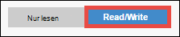

11. Die Authentifizierung Einstellungen für Ihre Anwendung am Abonnements > * *&lt;*Subscriptionname*>** > **ResourceGroups** > **&lt;*Resourcegroupname*>** > **Provider** > **Microsoft.Web** > **Sites** > **&lt;*Appname*>** > **Config** > **Authsettings **.

12. Klicken Sie auf **Bearbeiten**.

    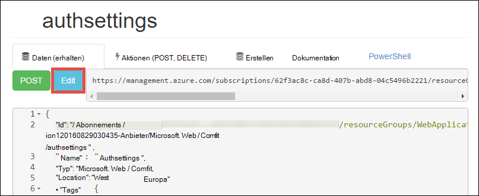

13. Legen Sie im Bearbeiten der `clientSecret` und `additionalLoginParams` Eigenschaften wie folgt.

        ...
        "clientSecret": "<client key from the Azure Active Directory application>",
        ...
        "additionalLoginParams": ["response_type=code id_token", "resource=https://graph.windows.net"],
        ...

14. Klicken Sie oben, um die Änderungen **Speichern** .

    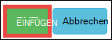

14. Jetzt testen Autorisierungstoken auf Azure Active Directory Graph API haben nur navigieren Sie zu * *https://&lt;*Appname*>.azurewebsites.net/.auth/me** in Ihrem Browser. Wenn alles richtig konfiguriert wird, sehen Sie die `access_token` -Eigenschaft auf JSON.

    Die `~/.auth/me` URL-Pfad wird vom App-Authentifizierung / Autorisierung Geben Sie alle Informationen, die authentifizierte Sitzung beziehen. Weitere Informationen finden Sie unter [Authentifizierung und Autorisierung in Azure App Service](../app-service/app-service-authentication-overview.md).

    >[AZURE.NOTE] Die `access_token` hat eine Gültigkeitsdauer. Allerdings App-Authentifizierung / Autorisierung Funktionalität token Aktualisieren mit `~/.auth/refresh`. Weitere Informationen zur Verwendung finden Sie unter     [App Service Token speichern](https://cgillum.tech/2016/03/07/app-service-token-store/).

Anschließend werden Sie mit Verzeichnisdaten etwas tun.

## Line-of-Business-Funktionen für Ihre Anwendung hinzufügen

Erstellen Sie jetzt einen einfachen CRUD Arbeit Elemente Tracker.  

5.  Im Ordner ~\Models erstellt eine Klasse namens WorkItem.cs und Ersetzen `public class WorkItem {...}` durch den folgenden Code:

        using System.ComponentModel.DataAnnotations;

        public class WorkItem
        {
            [Key]
            public int ItemID { get; set; }
            public string AssignedToID { get; set; }
            public string AssignedToName { get; set; }
            public string Description { get; set; }
            public WorkItemStatus Status { get; set; }
        }

        public enum WorkItemStatus
        {
            Open,
            Investigating,
            Resolved,
            Closed
        }

7.  Erstellen Sie das Projekt, um das neue Modell Gerüstbau Logik in Visual Studio verfügbar.

8.  Hinzufügen einer erstellten `WorkItemsController` in den Ordner ~\Controllers (Rechtsklick **Controller**, zeigen Sie auf **Hinzufügen**und wählen **neu erstellten**). 

9.  Wählen Sie **5 MVC-Controller mit Ansichten mit Entity Framework** und klicken Sie auf **Hinzufügen**.

10. Wählen Sie das Modell, das Sie erstellt und dann auf **+** und dann **Hinzufügen** einen Datenkontext hinzufügen und dann auf **Hinzufügen**.

    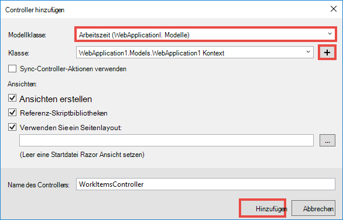

14. ~\Views\WorkItems\Create.cshtml (automatisch erstellten Artikel) finden die `Html.BeginForm` Hilfsmethode und ändern Sie folgende hervorgehoben:  
<pre class="prettyprint">
    @modelWebApplication1.Models.WorkItem

    @{ViewBag.Title = &quot;erstellen&quot;; }

    &lt;H2&gt;erstellen&lt;/h2&gt;

    @using(Html.BeginForm (<mark>&quot;erstellen&quot;, &quot;WorkItems&quot;, FormMethod.Post, neue {Id = &quot;Hauptformular&quot; }</mark>)) {@Html.AntiForgeryToken()

        &lt;div class=&quot;form-horizontal&quot;&gt;
            &lt;h4&gt;WorkItem&lt;/h4&gt;
            &lt;hr /&gt;
            @Html.ValidationSummary(true, &quot;&quot;, new { @class = &quot;text-danger&quot; })
            &lt;div class=&quot;form-group&quot;&gt;
                @Html.LabelFor(model =&gt; model.AssignedToID, htmlAttributes: new { @class = &quot;control-label col-md-2&quot; })
                &lt;div class=&quot;col-md-10&quot;&gt;
                    @Html.EditorFor(model =&gt; model.AssignedToID, new { htmlAttributes = new { @class = &quot;form-control&quot;<mark>, @type = &quot;hidden&quot;</mark> } })
                    @Html.ValidationMessageFor(model =&gt; model.AssignedToID, &quot;&quot;, new { @class = &quot;text-danger&quot; })
                &lt;/div&gt;
            &lt;/div&gt;

            &lt;div class=&quot;form-group&quot;&gt;
                @Html.LabelFor(model =&gt; model.AssignedToName, htmlAttributes: new { @class = &quot;control-label col-md-2&quot; })
                &lt;div class=&quot;col-md-10&quot;&gt;
                    @Html.EditorFor(model =&gt; model.AssignedToName, new { htmlAttributes = new { @class = &quot;form-control&quot; } })
                    @Html.ValidationMessageFor(model =&gt; model.AssignedToName, &quot;&quot;, new { @class = &quot;text-danger&quot; })
                &lt;/div&gt;
            &lt;/div&gt;

            &lt;div class=&quot;form-group&quot;&gt;
                @Html.LabelFor(model =&gt; model.Description, htmlAttributes: new { @class = &quot;control-label col-md-2&quot; })
                &lt;div class=&quot;col-md-10&quot;&gt;
                    @Html.EditorFor(model =&gt; model.Description, new { htmlAttributes = new { @class = &quot;form-control&quot; } })
                    @Html.ValidationMessageFor(model =&gt; model.Description, &quot;&quot;, new { @class = &quot;text-danger&quot; })
                &lt;/div&gt;
            &lt;/div&gt;

            &lt;div class=&quot;form-group&quot;&gt;
                @Html.LabelFor(model =&gt; model.Status, htmlAttributes: new { @class = &quot;control-label col-md-2&quot; })
                &lt;div class=&quot;col-md-10&quot;&gt;
                    @Html.EnumDropDownListFor(model =&gt; model.Status, htmlAttributes: new { @class = &quot;form-control&quot; })
                    @Html.ValidationMessageFor(model =&gt; model.Status, &quot;&quot;, new { @class = &quot;text-danger&quot; })
                &lt;/div&gt;
            &lt;/div&gt;

            &lt;div class=&quot;form-group&quot;&gt;
                &lt;div class=&quot;col-md-offset-2 col-md-10&quot;&gt;
                    &lt;input type=&quot;submit&quot; value=&quot;Create&quot; class=&quot;btn btn-default&quot;<mark> id=&quot;submit-button&quot;</mark> /&gt;
                &lt;/div&gt;
            &lt;/div&gt;
        &lt;/div&gt;
    }

    &lt;Div&gt;
    @Html.ActionLink(&quot;zur Liste&quot;, &quot;Index&quot;) &lt;/div    &gt;

    @sectionSkripts { @Scripts.Render( &quot;~/bundles/jqueryval&quot;)     <mark> &lt;Skript&gt; 
     / / Benutzer/Gruppe Auswahl Code Var MaxResultsPerPage = 14;         Var Eingabe = document.getElementById (&quot;AssignedToName&quot;);

            // Access token from request header, and tenantID from claims identity
            var token = &quot;@Request.Headers[&quot;X-MS-TOKEN-AAD-ACCESS-TOKEN&quot;]&quot;;
            var tenant =&quot;@(System.Security.Claims.ClaimsPrincipal.Current.Claims
                            .Where(c => c.Type == &quot;http://schemas.microsoft.com/identity/claims/tenantid&quot;)
                            .Select(c => c.Value).SingleOrDefault())&quot;;

            var picker = new AadPicker(maxResultsPerPage, input, token, tenant);

            // Submit the selected user/group to be asssigned.
            $(&quot;#submit-button&quot;).click({ picker: picker }, function () {
                if (!picker.Selected())
                    return;
                $(&quot;#main-form&quot;).get()[0].elements[&quot;AssignedToID&quot;].value = picker.Selected().objectId;
            });
        &lt;/script&gt;</mark>
    }
    </pre>
    
    Beachten Sie, dass `token` und `tenant` wird von der `AadPicker` Objekt Azure Active Directory Graph-API-Aufrufe. Sie fügen `AadPicker` später.   
    
    >[AZURE.NOTE] Ebenso erhalten Sie `token` und `tenant` vom Client mit `~/.auth/me`, aber das wäre ein zusätzliche Server-Aufruf. Zum Beispiel:
    >  
    >     $.ajax({
    >         dataType: "json",
    >         url: "/.auth/me",
    >         success: function (data) {
    >             var token = data[0].access_token;
    >             var tenant = data[0].user_claims
    >                             .find(c => c.typ === 'http://schemas.microsoft.com/identity/claims/tenantid')
    >                             .val;
    >         }
    >     });
    
15. Ändern mit ~ \Views\WorkItems\Edit.cshtml.

15. Die `AadPicker` Objekt definiert, in einem Skript, die Sie dem Projekt hinzufügen. Ordner ~\Scripts Maustaste, zeigen Sie auf **Hinzufügen**und auf **JavaScript-Datei**. Typ `AadPickerLibrary` für die Datei und klicken Sie auf **OK**.

16. Kopieren Sie den Inhalt von [hier](https://raw.githubusercontent.com/cephalin/active-directory-dotnet-webapp-roleclaims/master/WebApp-RoleClaims-DotNet/Scripts/AadPickerLibrary.js) in ~ \Scripts\AadPickerLibrary.js.

    In das Skript die `AadPicker` -Objekt ruft [Azure Active Directory Graph API](https://msdn.microsoft.com/Library/Azure/Ad/Graph/api/api-catalog) nach Benutzern und Gruppen, die mit die Eingabe übereinstimmen.  

17. ~\Scripts\AadPickerLibrary.js verwendet das [jQuery UI AutoVervollständigen Widgets](https://jqueryui.com/autocomplete/). So müssen Sie jQuery UI zu Ihrem Projekt hinzufügen. Ihr Projekt und **NuGet-Pakete verwalten**.

18. In NuGet Paket-Manager klicken Sie auf Durchsuchen, geben Sie **Jquery-Benutzeroberfläche** in der Suchleiste angezeigt und auf **jQuery.UI.Combined**.

    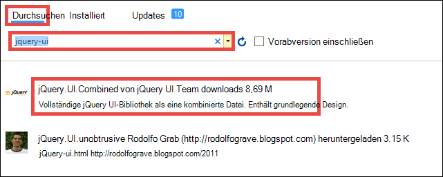

19. Klicken Sie im rechten Fensterausschnitt auf **Installieren**und klicken Sie auf **OK** , um fortzufahren.

19. Öffnen Sie ~\App_Start\BundleConfig.cs, und ändern Sie den hervorgehobenen:  
    <pre class="prettyprint">
    public static void RegisterBundles(BundleCollection bundles) {Bündel. Hinzufügen (neue ScriptBundle (&quot;~/bundles/jquery&quot;). Einschließen ( &quot;~/Scripts/jquery-{version}.js&quot;<mark>, &quot;~/Scripts/jquery-ui-{version}.js&quot;, &quot;~/Scripts/AadPickerLibrary.js&quot;</mark>));

        bundles.Add(new ScriptBundle(&quot;~/bundles/jqueryval&quot;).Include(
                    &quot;~/Scripts/jquery.validate*&quot;));

        // Use the development version of Modernizr to develop with and learn from. Then, when you&#39;re
        // ready for production, use the build tool at http://modernizr.com to pick only the tests you need.
        bundles.Add(new ScriptBundle(&quot;~/bundles/modernizr&quot;).Include(
                    &quot;~/Scripts/modernizr-*&quot;));

        bundles.Add(new ScriptBundle(&quot;~/bundles/bootstrap&quot;).Include(
                    &quot;~/Scripts/bootstrap.js&quot;,
                    &quot;~/Scripts/respond.js&quot;));

        bundles.Add(new StyleBundle(&quot;~/Content/css&quot;).Include(
                    &quot;~/Content/bootstrap.css&quot;,
                    &quot;~/Content/site.css&quot;<mark>,
                    &quot;~/Content/themes/base/jquery-ui.css&quot;</mark>));
    }
    </pre>

    Es gibt weitere leistungsfähige Verfahren zum Verwalten von JavaScript und CSS-Dateien in Ihrer Anwendung. Jedoch der Einfachheit wirst nur du auf die Pakete zu übernehmen, die mit jeder Ansicht geladen werden.

12. Schließlich ~ \Global.asax, fügen Sie folgenden Code in die `Application_Start()` Methode. `Ctrl`+`.`für jeden Namen Auflösung Fehler zu korrigieren.

        AntiForgeryConfig.UniqueClaimTypeIdentifier = ClaimTypes.NameIdentifier;
    
    > [AZURE.NOTE] Sie benötigen diese Codezeile, da MVC-Standardvorlage verwendet <code>[ValidateAntiForgeryToken]</code> auf Aktionen. Aufgrund von [Brock Allen](https://twitter.com/BrockLAllen)     [MVC 4, AntiForgeryToken](http://brockallen.com/2012/07/08/mvc-4-antiforgerytoken-and-claims/) und Ansprüche beschriebene Verhalten kann HTTP POST gegen Fälschung token da validiert:

    > - Azure Active Directory sendet keine http://schemas.microsoft.com/accesscontrolservice/2010/07/claims/identityprovider, die standardmäßig für die Antifälschungstoken erforderlich ist.
    > - Wenn Azure Active Directory Directory AD FS synchronisiert ist, sendet vertrauen AD FS standardmäßig http://schemas.microsoft.com/accesscontrolservice/2010/07/claims/identityprovider Anspruch, keine Obwohl AD FS senden diese Behauptung manuell konfigurieren können.

    > `ClaimTypes.NameIdentifies`Gibt die Forderung `http://schemas.xmlsoap.org/ws/2005/05/identity/claims/nameidentifier`, die Azure Active Directory bereitstellt.  

20. Jetzt veröffentlichen Sie ändern. Projekt und **Veröffentlichen**.

21. **Klicken**überprüfen Sie eine Verbindungszeichenfolge für die SQL-Datenbank, wählen Sie **Datenbank aktualisieren** die Schemaversion für Ihr Modell und klicken Sie auf **Veröffentlichen**.

    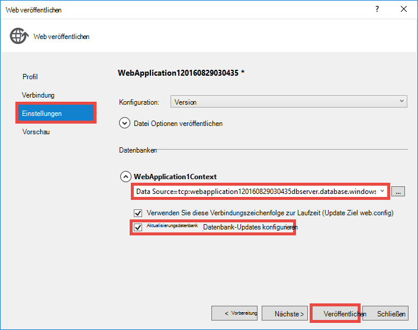

22. Navigieren Sie im Browser zu https://&lt;*Anwendungsname*>.azurewebsites.net/workitems und klicken Sie auf **Neu erstellen**.

23. Klicken Sie auf die **AssignedToName** . Benutzer und Gruppen sollte jetzt in Ihrem Mandanten Azure Active Directory in einer Dropdownliste angezeigt werden. Geben Sie zum Filtern, oder verwenden das `Up` oder `Down` -Taste oder klicken Sie auf den Benutzer oder die Gruppe. 

    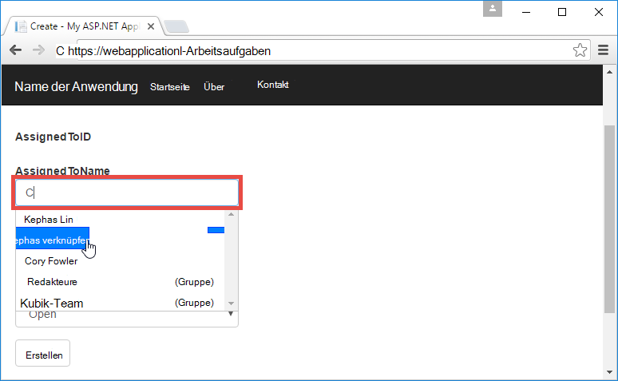

24. Klicken Sie auf **Erstellen** , um speichern. Klicken Sie auf **Bearbeiten** die erstellte Arbeitsaufgabe zu Verhalten.

Herzlichen Glückwunsch, jetzt laufen eine LOB Anwendung in Azure mit Verzeichniszugriff Sie! Es ist viel mehr mit der Graph-API. [Azure AD Graph-API-Referenz](https://msdn.microsoft.com/library/azure/ad/graph/api/api-catalog)anzeigen

## Nächstes

Rollenbasierte Zugriffskontrolle (RBAC) für Ihre LOB Anwendung in Azure, finden Sie unter [WebApp RoleClaims DotNet](https://github.com/Azure-Samples/active-directory-dotnet-webapp-roleclaims) ein Beispiel aus dem Azure Active Directory-Team. Es veranschaulicht Rollen für die Anwendung Azure Active Directory und Autorisierung von Benutzern der `[Authorize]` Dekoration.

Wenn Ihre LOB Anwendung auf lokale Daten zugreifen, finden Sie unter [Zugriff auf lokale Ressourcen hybridverbindungen in Azure App Service](web-sites-hybrid-connection-get-started.md).

## Weitere Ressourcen

- [Authentifizierung und Autorisierung in Azure App Service](../app-service/app-service-authentication-overview.md)
- [Authentifizierung mit lokalen Active Directory in der Azure-Anwendung](web-sites-authentication-authorization.md)
- [Erstellen Sie eine LOB Anwendung in Azure AD FS-Authentifizierung](web-sites-dotnet-lob-application-adfs.md)
- [App Service-Authentifizierung und Azure AD Graph API](https://cgillum.tech/2016/03/25/app-service-auth-aad-graph-api/)
- [Microsoft Azure Active Directory Beispiele und Dokumentation](https://github.com/AzureADSamples)
- [Azure Active Directory unterstützt Token und Ansprüche](http://msdn.microsoft.com/library/azure/dn195587.aspx)

[Protect the Application with SSL and the Authorize Attribute]: web-sites-dotnet-deploy-aspnet-mvc-app-membership-oauth-sql-database.md#protect-the-application-with-ssl-and-the-authorize-attribute
