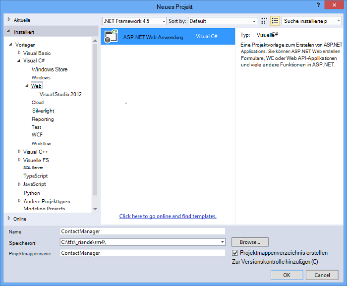
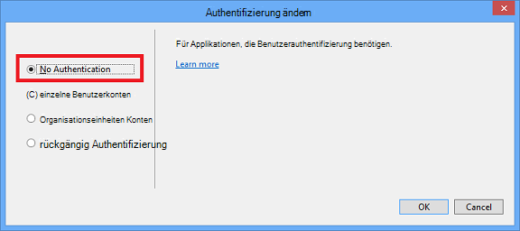
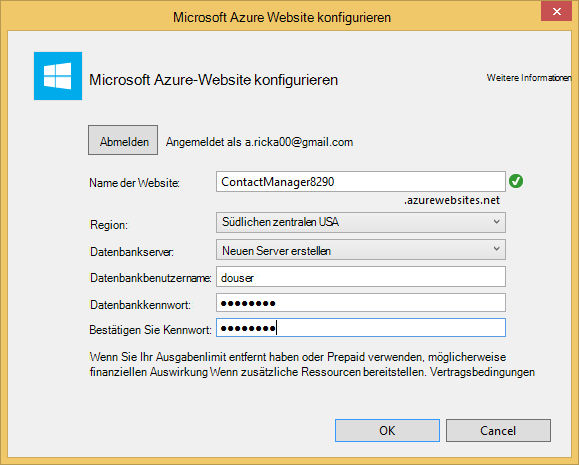
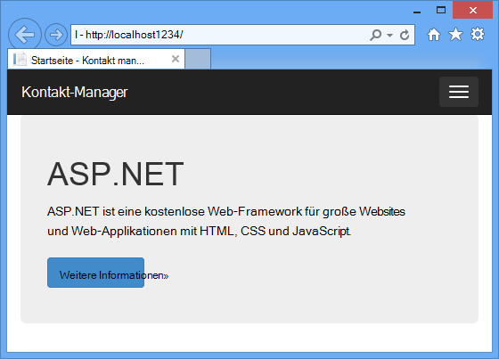
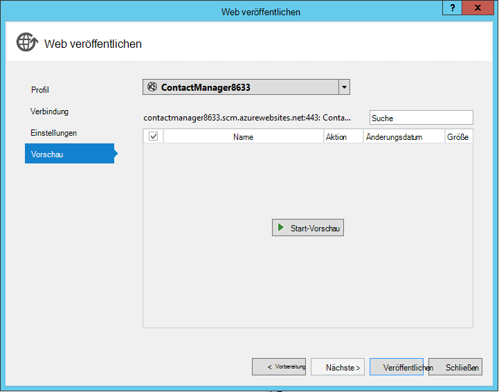
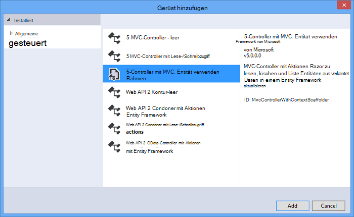
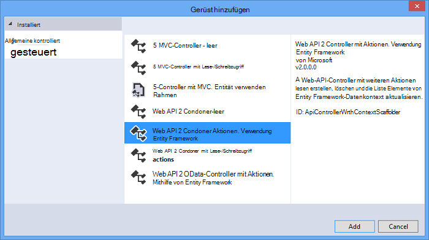
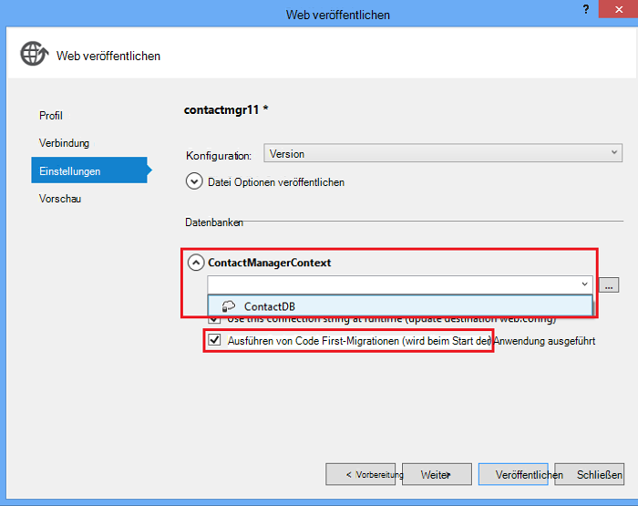

<properties 
    pageTitle="Erstellen Sie einen REST-Dienst mit ASP.NET Web API SQL-Datenbank in Azure App Service" 
    description="Ein Lernprogramm, das erklärt, wie Sie eine Anwendung bereitstellen, die ASP.NET Web API eine Azure Web app mithilfe von Visual Studio verwendet." 
    services="app-service\web" 
    documentationCenter=".net" 
    authors="Rick-Anderson" 
    writer="Rick-Anderson" 
    manager="wpickett" 
    editor=""/>

<tags 
    ms.service="app-service-web" 
    ms.workload="web" 
    ms.tgt_pltfrm="na" 
    ms.devlang="dotnet" 
    ms.topic="article" 
    ms.date="02/29/2016" 
    ms.author="riande"/>

# Erstellen Sie einen REST-Dienst mit ASP.NET Web API SQL-Datenbank in Azure App Service

Dieses Lernprogramm zeigt, wie eine ASP.NET Web-Anwendung mithilfe des Veröffentlichen-Assistenten in Visual Studio 2013 oder Visual Studio 2013 Community Edition eine [Azure App Service](http://go.microsoft.com/fwlink/?LinkId=529714) bereitstellen. 

Ein Azure-Konto können kostenlos öffnen, und haben Sie bereits Visual Studio 2013, installiert das SDK die Visual Studio 2013 für Web Express. So können Sie beginnen, Entwickeln für Azure für frei.

Es wird vorausgesetzt, dass Sie keine Erfahrung mit Azure haben. In diesem Lernprogramm haben Sie eine einfache Web app, und in der Cloud ausgeführt.
 
Sie erfahren:

* Wie ermöglichen den Computer Azure-Entwicklung Azure SDK installieren.
* Zum Erstellen eines Visual Studio ASP.NET MVC 5 und eine Azure-Anwendung veröffentlichen.
* Wie ASP.NET Web API um Restful API-Aufrufe zu ermöglichen.
* Verwendung eine SQL-Datenbank zum Speichern von Daten in Azure.
* Zum Veröffentlichen der aktualisierten Anwendung in Azure.

Sie erstellen eine einfache Kontaktliste Anwendung, die ASP.NET MVC 5 basiert und ADO.NET Entity Framework für den Datenbankzugriff. Die folgende Abbildung zeigt die fertige Anwendung:

![Screenshot der Website][intro001]

<!-- the next line produces the "Set up the development environment" section as see at http://azure.microsoft.com/documentation/articles/web-sites-dotnet-get-started/ -->
[AZURE.INCLUDE [create-account-and-websites-note](../../includes/create-account-and-websites-note.md)]

### Erstellen Sie das Projekt

1. Starten Sie Visual Studio 2013.
1. Klicken Sie im Menü **Datei** auf **Neues Projekt**.
3. Klicken Sie im Dialogfeld **Neues Projekt** erweitern Sie **Visual C#** **Wählen Sie aus** , und wählen Sie **ASP.NET Web Application**. Nennen Sie die Anwendung **ContactManager** , und klicken Sie auf **OK**.

    

1. Klicken Sie im Dialogfeld **Neues Projekt von ASP.NET** wählen Sie **MVC** -Vorlage aus, überprüfen Sie **Web API** , und klicken Sie **Authentifizierung ändern**.

1. Klicken Sie im Dialogfeld **Authentifizierung ändern** klicken Sie auf **Keine Authentifizierung**, und klicken Sie auf **OK**.

    

    Beispiel-Anwendung, die Sie erstellen keine Features, die Benutzer benötigen. Informationen zum Implementieren der Authentifizierung und Autorisierung Features finden Sie unter [Nächste](#nextsteps) Schritte am Ende dieses Lernprogramms. 

1. Klicken Sie im Dialogfeld **Neues Projekt ASP.NET** stellen Sie sicher, dass der **Host in der Cloud** aktiviert ist und klicken Sie auf **OK**.

Wenn Sie nicht zuvor in Azure angemeldet haben, werden Sie aufgefordert, anmelden.

1. Der Konfigurations-Assistent schlägt einen eindeutigen Namen basierend auf *ContactManager* (siehe unten). Wählen Sie eine Region in Ihrer Nähe. [Azurespeed.com](http://www.azurespeed.com/ "AzureSpeed.com") können Sie das niedrigste Latenz Rechenzentrum. 
2. Wenn Sie einen Datenbankserver vor erstellt haben, wählen Sie **erstellen neue Server**, geben Sie Datenbank-Benutzernamen und Kennwort ein.

    

Haben Sie einen Datenbankserver verwenden Sie, eine neue Datenbank erstellen. Datenbankserver sind eine Ressource, und im Allgemeinen mehrere Datenbanken auf demselben Server für Tests und Entwicklung anstatt einen Server pro Datenbank erstellen möchten. Stellen Sie sicher, dass Ihre Website und Datenbank in derselben Region.

### Legen Sie die Kopf- und Fußzeile

1. Im **Projektmappen-Explorer** *Views\Shared ebenfalls einen* Ordner und die Datei *_Layout.cshtml* .

    ![_Layout.cshtml im Projektmappen-Explorer][newapp004]

1. Ersetzen Sie den Inhalt der Datei *Views\Shared_Layout.cshtml* durch folgenden Code:

        <!DOCTYPE html>
        <html lang="en">
        <head>
            <meta charset="utf-8" />
            <title>@ViewBag.Title - Contact Manager</title>
            <link href="~/favicon.ico" rel="shortcut icon" type="image/x-icon" />
            <meta name="viewport" content="width=device-width" />
            @Styles.Render("~/Content/css")
            @Scripts.Render("~/bundles/modernizr")
        </head>
        <body>
            <header>
                

                    

                        
@Html.ActionLink("Contact Manager", "Index", "Home")

                    

                

            </header>
            

                @RenderSection("featured", required: false)
                <section class="content-wrapper main-content clear-fix">
                    @RenderBody()
                </section>
            

            <footer>
                

                    

                        
&copy; @DateTime.Now.Year - Contact Manager

                    

                

            </footer>
            @Scripts.Render("~/bundles/jquery")
            @RenderSection("scripts", required: false)
        </body>
        </html>
            
Ändert das Markup über Anwendungsname "Meine ASP.NET App" auf "Kontakt-Manager" und Links zu ** **Hause**, und **Kontakt**** entfernt.

### Die Anwendung lokal ausführen

1. Drücken Sie STRG + F5, um die Anwendung auszuführen.
Startseite der Anwendung wird im Standardbrowser angezeigt.
    

Deshalb müssen Sie jetzt die Anwendung erstellen, das auf Azure bereitgestellt werden. Später fügen Sie Datenbankfunktionen.

## Bereitstellen der Anwendung in Azure

1. In Visual Studio mit der rechten Maustaste im **Projektmappen-Explorer** des Projekts, und wählen Sie **Veröffentlichen** aus dem Kontextmenü.

    ![Im Kontextmenü Projekt veröffentlichen][PublishVSSolution]

    Der **Veröffentlichen** -Assistent wird geöffnet.

12. Klicken Sie auf **Veröffentlichen**.

Visual Studio beginnt das Kopieren der Dateien auf den Azure-Server. **Das Ausgabefenster** zeigt durchgeführten Aktionen Bereitstellung und Abschluss der Bereitstellung meldet.

14. Standardbrowser öffnet die URL der Website bereitgestellt.

    Die erstellte Anwendung wird jetzt in der Cloud ausgeführt.
    
    ![Zur Aufgabenliste Homepage in Azure ausgeführt][rxz2]

## Eine Datenbank zur Anwendung hinzufügen

Anschließend aktualisieren Sie die MVC-Anwendung hinzufügen können angezeigt und Kontakte aktualisieren und die Daten in einer Datenbank speichern. Die Anwendung verwendet das Entity Framework zum Erstellen der Datenbank und zum Lesen und Aktualisieren von Daten in der Datenbank.

### Modell Datenklassen für die Kontakte hinzufügen

Sie zunächst ein einfaches Datenmodell im Code erstellen.

1. Im **Projektmappen-Explorer**mit der rechten Maustaste des Ordners Models, klicken Sie auf **Hinzufügen**und dann auf **Klasse**.

    ![Fügen Sie Klasse im Kontextmenü Ordner Modelle hinzu][adddb001]

2. Klicken Sie im Dialogfeld **Neues Element hinzufügen** nennen Sie die neue Klassendatei *Contact.cs*und klicken Sie dann auf **Hinzufügen**.

    ![Das Dialogfeld Neues Element hinzufügen][adddb002]

3. Ersetzen Sie den Inhalt der Datei Contacts.cs durch den folgenden Code.

        using System.Globalization;
        namespace ContactManager.Models
        {
            public class Contact
            {
                public int ContactId { get; set; }
                public string Name { get; set; }
                public string Address { get; set; }
                public string City { get; set; }
                public string State { get; set; }
                public string Zip { get; set; }
                public string Email { get; set; }
                public string Twitter { get; set; }
                public string Self
                {
                    get { return string.Format(CultureInfo.CurrentCulture,
                         "api/contacts/{0}", this.ContactId); }
                    set { }
                }
            }
        }

**Wenden Sie sich an** -Klasse definiert die Daten speichert für jeden Kontakt und Primärschlüssel, Kontakt, die von der Datenbank benötigt wird. Sie erhalten weitere Informationen zu Datenmodellen im Abschnitt [Nächste Schritte](#nextsteps) am Ende dieses Lernprogramms.

### Erstellen von Webseiten, die app Benutzer Kontakte aktivieren

ASP.NET MVC Gerüstbau Feature kann automatisch führt Code erstellen, lesen, aktualisieren und Löschen von Aktionen (CRUD).

## Fügen Sie einen Controller und eine Ansicht für die Daten

1. Erweitern Sie im **Projektmappen-Explorer**-Controller.

3. Erstellen Sie das Projekt **(STRG + UMSCHALT + B)**. (Sie müssen das Projekt erstellen, bevor Sie Gerüstbau verwenden.) 

4. Maustaste den Ordner klicken Sie auf **Hinzufügen**, und klicken Sie auf **Controller**.

    ![Controller im Kontextmenü Ordner Controller hinzufügen][addcode001]

1. Klicken Sie im Dialogfeld **Hinzufügen Scaffold** wählen Sie **MVC-Controller mit Ansichten mit Entity Framework aus** und auf **Hinzufügen**.

 

6. Legen Sie den Namen des Controllers auf **HomeController**. Wählen Sie Ihre Modellklasse **Kontakt** . Klicken Sie auf **neuen Datenkontext** und übernehmen Sie die Standardeinstellung "ContactManager.Models.ContactManagerContext" für den **neuen Kontext-Datentyp**. Klicken Sie auf **Hinzufügen**.

    Ein Dialogfeld fordert Sie: "eine Datei mit dem Namen HomeController bereits beendet. Möchten Sie es ersetzen? ". Klicken Sie auf **Ja**. Wir sind der Home überschreiben, die für das neue Projekt erstellt wurde. Wir verwenden den neuen Home Controller für unsere Kontaktliste.

    Visual Studio erstellt Controller-Methoden und Ansichten für CRUD-Datenbankvorgänge für **Kontaktobjekte** .

## Aktivieren Sie Migrationen, erstellen Sie die Datenbank, Beispieldaten und Daten-Initialisierung ##

Nächste Aufgabe ist die [Code First-Migrationen](http://curah.microsoft.com/55220) -Funktion aktivieren, um basierend auf dem Datenmodell erstellten Datenbank erstellen.

1. Wählen Sie im Menü **Extras** **Bibliothek Paket-Manager** und **Paket-Manager-Konsole**.

    ![Paket-Manager-Konsole im Menü Extras][addcode008]

2. Geben Sie im Konsolenfenster **Paket-Manager** den folgenden Befehl ein:

        enable-migrations 
  
    **Aktivieren-Migrationen** Befehl erstellt einen Ordner *Migrationen* und in diesem Ordner eine *Configuration.cs* -Datei, die Sie bearbeiten können, um Migrationen zu konfigurieren. 

2. Geben Sie im Konsolenfenster **Paket-Manager** den folgenden Befehl ein:

        add-migration Initial

    **Hinzufügen-Migration ersten** Befehl generiert eine Klasse mit dem Namen ** &lt;Date_stamp&gt;ersten** die Datenbank erstellt. Der erste Parameter ( *erste* ) ist willkürlich und zum Erstellen der Datei verwendet. Sie sehen die neuen Klassendateien im **Projektmappen-Explorer**.

    In der **ersten** Klasse **,** Methode erstellt die Contacts-Tabelle (verwendete in den vorherigen Zustand zurückkehren möchten) **unten** -Methode löscht sie

3. Öffnen Sie die Datei *Migrations\Configuration.cs* . 

4. Fügen Sie die folgenden Namespaces hinzu. 

         using ContactManager.Models;

5. Ersetzen Sie die *Seed* -Methode durch folgenden Code:
        
        protected override void Seed(ContactManager.Models.ContactManagerContext context)
        {
            context.Contacts.AddOrUpdate(p => p.Name,
               new Contact
               {
                   Name = "Debra Garcia",
                   Address = "1234 Main St",
                   City = "Redmond",
                   State = "WA",
                   Zip = "10999",
                   Email = "debra@example.com",
                   Twitter = "debra_example"
               },
                new Contact
                {
                    Name = "Thorsten Weinrich",
                    Address = "5678 1st Ave W",
                    City = "Redmond",
                    State = "WA",
                    Zip = "10999",
                    Email = "thorsten@example.com",
                    Twitter = "thorsten_example"
                },
                new Contact
                {
                    Name = "Yuhong Li",
                    Address = "9012 State st",
                    City = "Redmond",
                    State = "WA",
                    Zip = "10999",
                    Email = "yuhong@example.com",
                    Twitter = "yuhong_example"
                },
                new Contact
                {
                    Name = "Jon Orton",
                    Address = "3456 Maple St",
                    City = "Redmond",
                    State = "WA",
                    Zip = "10999",
                    Email = "jon@example.com",
                    Twitter = "jon_example"
                },
                new Contact
                {
                    Name = "Diliana Alexieva-Bosseva",
                    Address = "7890 2nd Ave E",
                    City = "Redmond",
                    State = "WA",
                    Zip = "10999",
                    Email = "diliana@example.com",
                    Twitter = "diliana_example"
                }
                );
        }

    Dieser Code oben wird die Datenbank mit Informationen initialisiert. Weitere Informationen zum seeding der Datenbank finden Sie unter [Debuggen von Entity Framework (EF) DBs](http://blogs.msdn.com/b/rickandy/archive/2013/02/12/seeding-and-debugging-entity-framework-ef-dbs.aspx).

1. Geben Sie in der **Paket-Manager-Konsole** den Befehl:

        update-database

    ![Paket-Manager Befehle][addcode009]

    **Datenbank aktualisieren** wird die erste Migration, die Datenbank erstellt. Standardmäßig wird die Datenbank als Datenbank SQL Server Express LocalDB erstellt.

1. Drücken Sie STRG + F5, um die Anwendung auszuführen. 

Die Anwendung zeigt die Ausgangswerte und Links bearbeiten und Details löschen.

![MVC-Ansicht der Daten][rxz3]

## Bearbeiten der Ansicht

1. Öffnen Sie die Datei *Views\Home\Index.cshtml* . Im nächsten Schritt werden wir das generierte Markup durch Code ersetzen, die [jQuery](http://jquery.com/) und [Knockout.js](http://knockoutjs.com/)verwendet. Dieser neue Code Ruft die Liste der Web-API und JSON und bindet dann die Daten mit knockout.js Benutzeroberfläche. Weitere Informationen finden Sie unter [Nächste](#nextsteps) Schritte am Ende dieses Lernprogramms. 

2. Ersetzen Sie den Inhalt der Datei durch folgenden Code.

        @model IEnumerable<ContactManager.Models.Contact>
        @{
            ViewBag.Title = "Home";
        }
        @section Scripts {
            @Scripts.Render("~/bundles/knockout")
            
        }
        <ul id="contacts" data-bind="foreach: contacts">
            <li class="ui-widget-content ui-corner-all">
                <h1 data-bind="text: Name" class="ui-widget-header"></h1>
                

                

                    ,
                    
                    
                

                

                
Email?

                

                
Twitter?

                
<a data-bind="attr: { href: Self }, click: $root.removeContact" class="removeContact ui-state-default ui-corner-all">Remove</a>

            </li>
        </ul>
        <form id="addContact" data-bind="submit: addContact">
            <fieldset>
                <legend>Add New Contact</legend>
                <ol>
                    <li>
                        <label for="Name">Name</label>
                        <input type="text" name="Name" />
                    </li>
                    <li>
                        <label for="Address">Address</label>
                        <input type="text" name="Address" >
                    </li>
                    <li>
                        <label for="City">City</label>
                        <input type="text" name="City" />
                    </li>
                    <li>
                        <label for="State">State</label>
                        <input type="text" name="State" />
                    </li>
                    <li>
                        <label for="Zip">Zip</label>
                        <input type="text" name="Zip" />
                    </li>
                    <li>
                        <label for="Email">E-mail</label>
                        <input type="text" name="Email" />
                    </li>
                    <li>
                        <label for="Twitter">Twitter</label>
                        <input type="text" name="Twitter" />
                    </li>
                </ol>
                <input type="submit" value="Add" />
            </fieldset>
        </form>

3. Maustaste den Inhaltsordner klicken Sie auf **Hinzufügen**, und klicken Sie dann auf **Neues Element**.

    ![Im Kontextmenü Inhaltsordner Stylesheet hinzufügen][addcode005]

4. Klicken Sie im Dialogfeld **Neues Element hinzufügen** Geben Sie **Formatvorlage** im oberen rechten suchen und wählen Sie **Stylesheet aus**.
    ![Das Dialogfeld Neues Element hinzufügen][rxStyle]

5. Benennen Sie die Datei *Contacts.css* , und klicken Sie auf **Hinzufügen**. Ersetzen Sie den Inhalt der Datei durch folgenden Code.
    
        .column {
            float: left;
            width: 50%;
            padding: 0;
            margin: 5px 0;
        }
        form ol {
            list-style-type: none;
            padding: 0;
            margin: 0;
        }
        form li {
            padding: 1px;
            margin: 3px;
        }
        form input[type="text"] {
            width: 100%;
        }
        #addContact {
            width: 300px;
            float: left;
            width:30%;
        }
        #contacts {
            list-style-type: none;
            margin: 0;
            padding: 0;
            float:left;
            width: 70%;
        }
        #contacts li {
            margin: 3px 3px 3px 0;
            padding: 1px;
            float: left;
            width: 300px;
            text-align: center;
            background-image: none;
            background-color: #F5F5F5;
        }
        #contacts li h1
        {
            padding: 0;
            margin: 0;
            background-image: none;
            background-color: Orange;
            color: White;
            font-family: Trebuchet MS, Tahoma, Verdana, Arial, sans-serif;
        }
        .removeContact, .viewImage
        {
            padding: 3px;
            text-decoration: none;
        }

    Wir verwenden dieses Stylesheet für Layout, Farben und Stile in der Kontakt-Manager-Anwendung.

6. Öffnen Sie die Datei *app_start\bundleconfig* .

7. Fügen Sie folgenden Code zum [Knockout](http://knockoutjs.com/index.html "KO") Plug-In registrieren.

        bundles.Add(new ScriptBundle("~/bundles/knockout").Include(
                    "~/Scripts/knockout-{version}.js"));
    In diesem Beispiel mit Knockout dynamische JavaScript-Code vereinfachen, die die Bildschirmvorlagen behandelt.

8. Ändern Sie den Eintrag Inhalt/CSS-Stylesheet *contacts.css* registrieren. Ändern Sie die folgende Zeile:

                 bundles.Add(new StyleBundle("~/Content/css").Include(
                   "~/Content/bootstrap.css",
                   "~/Content/site.css"));
An:

        bundles.Add(new StyleBundle("~/Content/css").Include(
                   "~/Content/bootstrap.css",
                   "~/Content/contacts.css",
                   "~/Content/site.css"));

1. In der Paket-Manager-Konsole folgenden Befehl Knockout installieren.

        Install-Package knockoutjs

## Fügen Sie einen Controller für die Web-Restful API-Schnittstelle

1. Im **Projektmappen-Explorer**Maustaste auf Controller, und klicken Sie auf **Hinzufügen** und anschließend **Controller...** 

1. Geben Sie im Dialogfeld **Hinzufügen Scaffold** **Web API 2 Controller mit mit Entity Framework ein** und dann auf **Hinzufügen**.

    

4. Geben Sie im Dialogfeld " **Controller hinzufügen** "ContactsController"als Ihren Controller. Wählen Sie "Kontakt (ContactManager.Models)" für die **Model-Klasse**.  Behalten Sie den Standardwert für die **Klasse**. 

6. Klicken Sie auf **Hinzufügen**.

### Die Anwendung lokal ausführen

1. Drücken Sie STRG + F5, um die Anwendung auszuführen.

    ![Index-Seite][intro001]

2. Geben Sie einen Kontakt, und klicken Sie auf **Hinzufügen**. Die app gibt auf der Homepage und den Kontakt, den Sie eingegeben haben.

    ![Seite mit Aufgabe][addwebapi004]

3. Der URL im Browser fügen Sie **/api/contacts hinzu** .

    Die resultierende URL sieht Http://localhost:1234/api/Kontakte. Hinzugefügte RESTful-Web-API gibt die gespeicherten Kontakte. Firefox und Chrome werden die Daten im XML-Format angezeigt.

    ![Seite mit Aufgabe][rxFFchrome]
    

    IE fordert Sie zum Öffnen oder Speichern der Kontakte.

    ![Dialogfeld "Speichern" Web API][addwebapi006]
    
    
    Sie können zurückgegebene Kontakte im Editor oder in einem Browser öffnen.
    
    Diese Ausgabe kann von einer anderen Anwendung wie mobile Webseite oder Anwendung verbraucht werden.

    ![Dialogfeld "Speichern" Web API][addwebapi007]

    **Sicherheitshinweis**: an dieser Stelle die Anwendung unsicher und CSRF-Angriffe anfällig ist. Später im Lernprogramm entfernen wir diese Schwachstelle. Weitere Informationen finden Sie unter [Angriffe verhindern von Cross-Site Request Fälschung (CSRF)][prevent-csrf-attacks].
## XSRF Schutz

Cross-Site-Anfragen Fälschung (auch XSRF oder CSRF) ist ein Angriff auf webgestützte Anwendung bei eine bösartige Website die Interaktion zwischen einem Clientbrowser und von diesem Browser vertrauenswürdige Websites beeinflussen können. Diese Angriffe sind möglich, da Webbrowser Authentifizierungstoken automatisch mit jeder Anforderung an eine Website senden. Das Beispiel ist ein Authentifizierungscookie wie ASP. NET des Formularauthentifizierungsticket. Websites, die persistenten (wie Windows-Authentifizierung, Basic usw. Authentifizierungsmechanismus) können jedoch diese Angriffe verwendet werden.

Ein XSRF-Angriff ist eine Phishing-Attacke. Phishing-Angriffe erfordern Interaktion des Opfers. Phishing-Angriff eine schädliche Website imitieren die Ziel-Website und das Opfer in vertrauliche Informationen an die Angreifer täuschen. Einen XSRF Angriff findet häufig keine Interaktion des Opfers erforderlich. Stattdessen verwendet der Angreifer im Browser automatisch alle relevanten Cookies an die Zielwebsite senden.

Weitere Informationen finden Sie unter [Open Web Application Security Project](https://www.owasp.org/index.php/Main_Page) (OWASP) [XSRF](https://www.owasp.org/index.php/Cross-Site_Request_Forgery_(CSRF)).

1. Im **Projektmappen-Explorer**rechts **ContactManager** Projekt, und klicken Sie auf **Hinzufügen** und dann auf **Klasse**.

2. Benennen Sie die Datei *ValidateHttpAntiForgeryTokenAttribute.cs* , und fügen Sie folgenden Code:

        using System;
        using System.Collections.Generic;
        using System.Linq;
        using System.Net;
        using System.Net.Http;
        using System.Web.Helpers;
        using System.Web.Http.Controllers;
        using System.Web.Http.Filters;
        using System.Web.Mvc;
        namespace ContactManager.Filters
        {
            public class ValidateHttpAntiForgeryTokenAttribute : AuthorizationFilterAttribute
            {
                public override void OnAuthorization(HttpActionContext actionContext)
                {
                    HttpRequestMessage request = actionContext.ControllerContext.Request;
                    try
                    {
                        if (IsAjaxRequest(request))
                        {
                            ValidateRequestHeader(request);
                        }
                        else
                        {
                            AntiForgery.Validate();
                        }
                    }
                    catch (HttpAntiForgeryException e)
                    {
                        actionContext.Response = request.CreateErrorResponse(HttpStatusCode.Forbidden, e);
                    }
                }
                private bool IsAjaxRequest(HttpRequestMessage request)
                {
                    IEnumerable<string> xRequestedWithHeaders;
                    if (request.Headers.TryGetValues("X-Requested-With", out xRequestedWithHeaders))
                    {
                        string headerValue = xRequestedWithHeaders.FirstOrDefault();
                        if (!String.IsNullOrEmpty(headerValue))
                        {
                            return String.Equals(headerValue, "XMLHttpRequest", StringComparison.OrdinalIgnoreCase);
                        }
                    }
                    return false;
                }
                private void ValidateRequestHeader(HttpRequestMessage request)
                {
                    string cookieToken = String.Empty;
                    string formToken = String.Empty;
                    IEnumerable<string> tokenHeaders;
                    if (request.Headers.TryGetValues("RequestVerificationToken", out tokenHeaders))
                    {
                        string tokenValue = tokenHeaders.FirstOrDefault();
                        if (!String.IsNullOrEmpty(tokenValue))
                        {
                            string[] tokens = tokenValue.Split(':');
                            if (tokens.Length == 2)
                            {
                                cookieToken = tokens[0].Trim();
                                formToken = tokens[1].Trim();
                            }
                        }
                    }
                    AntiForgery.Validate(cookieToken, formToken);
                }
            }
        }

1. Fügen Sie die folgende *using* -Anweisung Verträge Controller haben Zugriff auf das Attribut **[ValidateHttpAntiForgeryToken]** .

        using ContactManager.Filters;

1. Die Post-Methoden **ContactsController** XSRF Gefahren vor fügen Sie hinzu **[ValidateHttpAntiForgeryToken]** -Attribut. Es wird auf die Aktion "PutContact", "PostContact" und **DeleteContact** hinzufügen.

        [ValidateHttpAntiForgeryToken]
            public IHttpActionResult PutContact(int id, Contact contact)
            {

1. Aktualisieren des *Scripts* -Abschnitts der Datei *Views\Home\Index.cshtml* Code zu XSRF-Token enthalten.

         @section Scripts {
            @Scripts.Render("~/bundles/knockout")
            
         }

## Veröffentlichen des Updates Azure und SQL-Datenbank

Um die Anwendung zu veröffentlichen, wiederholen Sie zuvor gefolgt.

1. Wählen Sie im **Projektmappen-Explorer**die, und wählen Sie **Veröffentlichen**.

    ![Veröffentlichen][rxP]

5. Klicken Sie auf **die Registerkarte** .
    

1. **ContactsManagerContext(ContactsManagerContext)**klicken Sie auf Symbol **V** *Remote Verbindungszeichenfolge* die Verbindungszeichenfolge für die Datenbank ändern. Klicken Sie auf **ContactDB**.

    

7. Das Kontrollkästchen Sie **Führen Code First-Migrationen (wird beim Start der Anwendung ausgeführt)**.

1. Klicken Sie auf **Weiter** und dann auf **Vorschau**. Visual Studio zeigt eine Liste der Dateien, die hinzugefügt oder aktualisiert werden.

8. Klicken Sie auf **Veröffentlichen**.
Nachdem die Bereitstellung abgeschlossen ist, öffnet der Browser die Homepage der Anwendung.

    ![Seite ohne Kontakte][intro001]

    Visual Studio Veröffentlichungsprozess automatisch die Verbindungszeichenfolge in der bereitgestellten *Web.config* -Datei auf die SQL-Datenbank konfiguriert. Außerdem wird Code First-Migrationen automatisch Aktualisierung die Datenbank auf die neueste Version der ersten Anwendung Zugriff auf die Datenbank nach der Bereitstellung konfiguriert.

    Diese Konfiguration erstellt Code First die Datenbank durch Ausführen des Codes in der **ersten** Klasse, die Sie zuvor erstellt haben. Dies hat zum ersten Mal die Anwendung Zugriff auf die Datenbank nach der Bereitstellung.

9. Geben Sie einen Kontakt, wie die Anwendung lokal ausgeführt, um sicherzustellen, dass die Bereitstellung war erfolgreich.

Wenn Sie feststellen, dass das eingegebene Element wird gespeichert und auf der Seite Kontakt-Manager, wissen Sie, dass in der Datenbank gespeichert wurde.

![Seite mit Kontakten][addwebapi004]

Die Anwendung läuft jetzt in der Cloud mit SQL-Datenbank die Daten speichern. Nachdem Sie die Anwendung in Azure testen löschen. Die Anwendung öffentliche und nicht über einen Mechanismus zu beschränken.

>[AZURE.NOTE] Wenn Sie mit Azure App Service beginnen, bevor Sie sich für ein Azure-Konto, gehen Sie [Versuchen App Service](http://go.microsoft.com/fwlink/?LinkId=523751)sofort eine kurzlebige Starter Web app in App Service können Sie erstellen. Keine Kreditkarten erforderlich; keine Zusagen.

## Nächste Schritte

Eine echte Anwendung würden Authentifizierung und Autorisierung benötigen, und verwenden Sie dazu die Mitgliedschaftsdatenbank. Das Lernprogramm [eine Secure ASP.NET MVC-Anwendung mit OAuth, Mitgliedschaft und SQL Datenbank bereitstellen](web-sites-dotnet-deploy-aspnet-mvc-app-membership-oauth-sql-database.md) dieses Lernprogramm basiert und veranschaulicht, wie ein Webanwendungsprojekt mit der Mitgliedschaftsdatenbank bereitstellen.

Eine andere Möglichkeit zum Speichern von Daten in eine Azure-Anwendung ist mit Azure-Speicher, welche nicht relationaler Datenspeicher in Form von Blobs und Tabellen sind. Die folgenden Links bieten Informationen Web API und ASP.NET MVC Fenster Azure.
 

* [Erste Schritte mit Entity Framework mit MVC][EFCodeFirstMVCTutorial]
* [Einführung in ASP.NET MVC 5](http://www.asp.net/mvc/tutorials/mvc-5/introduction/getting-started)
* [Ihre erste ASP.NET Web API](http://www.asp.net/web-api/overview/getting-started-with-aspnet-web-api/tutorial-your-first-web-api)
* [Debuggen von WAWS](web-sites-dotnet-troubleshoot-visual-studio.md)

In diesem Lernprogramm und Beispiel-Anwendung wurde von [Rick Anderson](http://blogs.msdn.com/b/rickandy/) geschrieben (Twitter [@RickAndMSFT](https://twitter.com/RickAndMSFT)) mit Hilfe von Tom Dykstra und Barry Dorrans (Twitter [@blowdart](https://twitter.com/blowdart)). 

Bitte verbessert abgeben, was Ihnen gefallen hat oder was Sie sehen möchten, nicht nur bezüglich des Lernprogramms, sondern auch zu den Produkten veranschaulicht. Ihr Feedback hilft uns Verbesserungen priorisieren. Wir sind besonders interessiert, in weitere Automatisierung für den Prozess der Konfiguration und Bereitstellung der Mitgliedschaftsdatenbank, Interesse. 

## Was hat sich geändert
* Eine Anleitung zur Änderung von Websites zu App Service finden Sie unter: [Azure App Service und seine Auswirkung auf vorhandene Azure Services](http://go.microsoft.com/fwlink/?LinkId=529714)

<!-- bookmarks -->
[Add an OAuth Provider]: #addOauth
[Add Roles to the Membership Database]:#mbrDB
[Create a Data Deployment Script]:#ppd
[Update the Membership Database]:#ppd2
[setupdbenv]: #bkmk_setupdevenv
[setupwindowsazureenv]: #bkmk_setupwindowsazure
[createapplication]: #bkmk_createmvc4app
[deployapp1]: #bkmk_deploytowindowsazure1
[adddb]: #bkmk_addadatabase
[addcontroller]: #bkmk_addcontroller
[addwebapi]: #bkmk_addwebapi
[deploy2]: #bkmk_deploydatabaseupdate

<!-- links -->
[EFCodeFirstMVCTutorial]: http://www.asp.net/mvc/tutorials/getting-started-with-ef-using-mvc/creating-an-entity-framework-data-model-for-an-asp-net-mvc-application
[dbcontext-link]: http://msdn.microsoft.com/library/system.data.entity.dbcontext(v=VS.103).aspx

<!-- images-->
[rxE]: ./media/web-sites-dotnet-rest-service-aspnet-api-sql-database/rxE.png
[rxP]: ./media/web-sites-dotnet-rest-service-aspnet-api-sql-database/rxP.png
[rx22]: ./media/web-sites-dotnet-rest-service-aspnet-api-sql-database/
[rxb2]: ./media/web-sites-dotnet-rest-service-aspnet-api-sql-database/rxb2.png
[rxz]: ./media/web-sites-dotnet-rest-service-aspnet-api-sql-database/rxz.png
[rxzz]: ./media/web-sites-dotnet-rest-service-aspnet-api-sql-database/rxzz.png
[rxz2]: ./media/web-sites-dotnet-rest-service-aspnet-api-sql-database/rxz2.png
[rxz3]: ./media/web-sites-dotnet-rest-service-aspnet-api-sql-database/rxz3.png
[rxStyle]: ./media/web-sites-dotnet-rest-service-aspnet-api-sql-database/rxStyle.png
[rxz4]: ./media/web-sites-dotnet-rest-service-aspnet-api-sql-database/rxz4.png
[rxz44]: ./media/web-sites-dotnet-rest-service-aspnet-api-sql-database/rxz44.png
[rxNewCtx]: ./media/web-sites-dotnet-rest-service-aspnet-api-sql-database/rxNewCtx.png
[rxPrevDB]: ./media/web-sites-dotnet-rest-service-aspnet-api-sql-database/rxPrevDB.png
[rxOverwrite]: ./media/web-sites-dotnet-rest-service-aspnet-api-sql-database/rxOverwrite.png
[rxPWS]: ./media/web-sites-dotnet-rest-service-aspnet-api-sql-database/rxPWS.png
[rxNewCtx]: ./media/web-sites-dotnet-rest-service-aspnet-api-sql-database/rxNewCtx.png
[rxAddApiController]: ./media/web-sites-dotnet-rest-service-aspnet-api-sql-database/rxAddApiController.png
[rxFFchrome]: ./media/web-sites-dotnet-rest-service-aspnet-api-sql-database/rxFFchrome.png
[intro001]: ./media/web-sites-dotnet-rest-service-aspnet-api-sql-database/dntutmobil-intro-finished-web-app.png
[rxCreateWSwithDB]: ./media/web-sites-dotnet-rest-service-aspnet-api-sql-database/rxCreateWSwithDB.png
[setup007]: ./media/web-sites-dotnet-rest-service-aspnet-api-sql-database/dntutmobile-setup-azure-site-004.png
[setup009]: ../Media/dntutmobile-setup-azure-site-006.png
[newapp002]: ./media/web-sites-dotnet-rest-service-aspnet-api-sql-database/dntutmobile-createapp-002.png
[newapp004]: ./media/web-sites-dotnet-rest-service-aspnet-api-sql-database/dntutmobile-createapp-004.png
[firsdeploy007]: ./media/web-sites-dotnet-rest-service-aspnet-api-sql-database/dntutmobile-deploy1-publish-005.png
[firsdeploy009]: ./media/web-sites-dotnet-rest-service-aspnet-api-sql-database/dntutmobile-deploy1-publish-007.png
[adddb001]: ./media/web-sites-dotnet-rest-service-aspnet-api-sql-database/dntutmobile-adddatabase-001.png
[adddb002]: ./media/web-sites-dotnet-rest-service-aspnet-api-sql-database/dntutmobile-adddatabase-002.png
[addcode001]: ./media/web-sites-dotnet-rest-service-aspnet-api-sql-database/dntutmobile-controller-add-context-menu.png
[addcode002]: ./media/web-sites-dotnet-rest-service-aspnet-api-sql-database/dntutmobile-controller-add-controller-dialog.png
[addcode004]: ./media/web-sites-dotnet-rest-service-aspnet-api-sql-database/dntutmobile-controller-modify-index-context.png
[addcode005]: ./media/web-sites-dotnet-rest-service-aspnet-api-sql-database/dntutmobile-controller-add-contents-context-menu.png
[addcode007]: ./media/web-sites-dotnet-rest-service-aspnet-api-sql-database/dntutmobile-controller-modify-bundleconfig-context.png
[addcode008]: ./media/web-sites-dotnet-rest-service-aspnet-api-sql-database/dntutmobile-migrations-package-manager-menu.png
[addcode009]: ./media/web-sites-dotnet-rest-service-aspnet-api-sql-database/dntutmobile-migrations-package-manager-console.png
[addwebapi004]: ./media/web-sites-dotnet-rest-service-aspnet-api-sql-database/dntutmobile-webapi-added-contact.png
[addwebapi006]: ./media/web-sites-dotnet-rest-service-aspnet-api-sql-database/dntutmobile-webapi-save-returned-contacts.png
[addwebapi007]: ./media/web-sites-dotnet-rest-service-aspnet-api-sql-database/dntutmobile-webapi-contacts-in-notepad.png
[Add XSRF Protection]: #xsrf
[WebPIAzureSdk20NetVS12]: ./media/web-sites-dotnet-rest-service-aspnet-api-sql-database/WebPIAzureSdk20NetVS12.png
[Add XSRF Protection]: #xsrf
[ImportPublishSettings]: ./media/web-sites-dotnet-rest-service-aspnet-api-sql-database/ImportPublishSettings.png
[ImportPublishProfile]: ./media/web-sites-dotnet-rest-service-aspnet-api-sql-database/ImportPublishProfile.png
[PublishVSSolution]: ./media/web-sites-dotnet-rest-service-aspnet-api-sql-database/PublishVSSolution.png
[ValidateConnection]: ./media/web-sites-dotnet-rest-service-aspnet-api-sql-database/ValidateConnection.png
[WebPIAzureSdk20NetVS12]: ./media/web-sites-dotnet-rest-service-aspnet-api-sql-database/WebPIAzureSdk20NetVS12.png
[prevent-csrf-attacks]: http://www.asp.net/web-api/overview/security/preventing-cross-site-request-forgery-(csrf)-attacks
 
