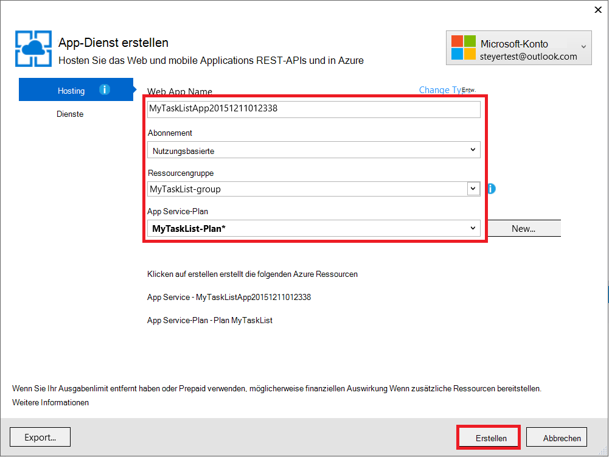
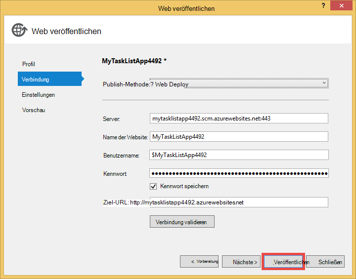

<properties 
    pageTitle="Erstellen Sie eine Webanwendung in Azure MongoDB auf einem virtuellen Computer verbunden" 
    description="Ein Lernprogramm, das Lernen mit Git ASP.NET app Azure App Service bereitstellen mit MongoDB eine Azure Virtual Machine verbunden ist."
    tags="azure-portal" 
    services="app-service\web, virtual-machines" 
    documentationCenter=".net" 
    authors="cephalin" 
    manager="wpickett" 
    editor=""/>

<tags 
    ms.service="app-service-web" 
    ms.workload="web" 
    ms.tgt_pltfrm="na" 
    ms.devlang="dotnet" 
    ms.topic="article" 
    ms.date="02/29/2016" 
    ms.author="cephalin"/>

# Erstellen Sie eine Webanwendung in Azure MongoDB auf einem virtuellen Computer verbunden

Git können Sie eine Anwendung ASP.NET Azure App Service Web Apps bereitstellen. In diesem Lernprogramm erstellen eine einfache Front-End-ASP.NET MVC Anwendung Aufgabe Sie, die mit einer auf einem virtuellen Computer in Azure MongoDB-Datenbank verbindet.  [MongoDB] [ MongoDB] ist ein gängiger open Source, hochleistungsfähige NoSQL-Datenbank. Nach dem Ausführen und Testen der Anwendung ASP.NET auf dem Entwicklungscomputer wird die Anwendung App Service Web Apps mit Git hochladen.

>[AZURE.NOTE] Wenn Sie mit Azure App Service beginnen, bevor Sie sich für ein Azure-Konto, gehen Sie [Versuchen App Service](http://go.microsoft.com/fwlink/?LinkId=523751)sofort eine kurzlebige Starter Web app in App Service können Sie erstellen. Keine Kreditkarten erforderlich; keine Zusagen.

## Hintergrundwissen ##

Folgende sind nützlich für dieses Lernprogramms jedoch nicht erforderlich:

* Die C#-Treiber für MongoDB. Weitere Informationen zum Entwickeln von C#-Anwendungsentwicklung mit MongoDB finden Sie unter MongoDB [CSharp Language Center][MongoC#LangCenter]. 
* ASP .NET Web Application Framework. Erfahren Sie alles auf [ASP.NET-Website][ASP.NET].
* ASP .NET MVC Web Application Framework. Erfahren Sie alles auf [ASP.NET MVC-Website][MVCWebSite].
* Azure. Sie können loslegen an [Azure][WindowsAzure].

## Erforderliche Komponenten ##

- [Visual Studio Express 2013 für Web]  [ VSEWeb] oder [Visual Studio 2013] [VSUlt]
- [Azure SDK für .NET](http://go.microsoft.com/fwlink/p/?linkid=323510&clcid=0x409)
- Ein aktives Microsoft Azure-Abonnement

[AZURE.INCLUDE [create-account-and-websites-note](../../includes/create-account-and-websites-note.md)]

 
## Erstellen Sie einen virtuellen Computer und installieren MongoDB ##

In diesem Lernprogramm wird davon ausgegangen, dass Sie einen virtuellen Computer in Azure erstellt haben. Nach dem Erstellen des virtuellen Computers müssen Sie MongoDB auf dem virtuellen Computer installieren:

* Zum Erstellen einer virtuellen Windows-Maschine und MongoDB installieren, siehe [Installieren MongoDB auf einem virtuellen Computer mit Windows Server in Azure][InstallMongoOnWindowsVM].

Nachdem Sie den virtuellen Computer in Azure erstellt und MongoDB installiert haben, müssen Sie den DNS-Namen der virtuellen Computer (z. B. "testlinuxvm.cloudapp.net") und den externen Anschluss MongoDB erinnern, die in den Endpunkt angegeben.  Sie benötigen diese Informationen später im Lernprogramm.

## Erstellen der Anwendung ##

In diesem Abschnitt erstellen eine ASP.NET Anwendung namens "Meine Aufgabenliste" mit Visual Studio und führen anfängliche Bereitstellung Azure App Service Web Apps. Führen Sie die Anwendung lokal, aber es wird Ihre virtuellen Computer in Azure und MongoDB-Instanz, die Sie erstellt vorhanden.

1. Klicken Sie auf **Neues Projekt**in Visual Studio.

    ![Neues Projekt starten][StartPageNewProject]

1. Im Fenster **Neues Projekt** im linken Bereich Wählen Sie **Visual C#**und dann **Web**. Wählen Sie im mittleren Bereich **ASP.NET Web Application**. Unten nennen Sie das Projekt "MyTaskListApp" und klicken Sie dann auf **OK**.

    ![Dialogfeld "Neues Projekt"][NewProjectMyTaskListApp]

1. Klicken Sie im Dialogfeld **Neues Projekt ASP.NET** wählen Sie **MVC aus**und klicken Sie auf **OK**.

    ![MVC-Vorlage auswählen][VS2013SelectMVCTemplate]

1. Wenn Sie bereits in Microsoft Azure angemeldet sind, werden Sie aufgefordert, sich anzumelden. Folgen Sie den Azure anmelden.
2. Sobald Sie angemeldet sind, können Sie die Konfiguration Ihrer Anwendung App Service starten. Geben Sie **Web App Name**, **App Service-Plan**, **Ressourcengruppe**und **Region**, und klicken Sie auf **Erstellen**.

    

1. Nach dem Projekt erstellen abschließt, Web app in Azure App Service erstellt werden, wie im Fenster **Azure App Serviceaktivität** warten. Klicken Sie auf **MyTaskListApp zu diesem Web App jetzt veröffentlichen**.

1. Klicken Sie auf **Veröffentlichen**.

    

    Sobald die standardmäßige ASP.NET Anwendung in Azure App Service Web Apps veröffentlicht wird, wird im Browser gestartet.

## Installieren Sie den Treiber MongoDB C#

MongoDB unterstützt clientseitige C# Applikationen durch einen Treiber Sie auf Ihrem lokalen Computer installieren müssen. Der C#-Treiber ist über NuGet.

MongoDB C#-Treiber zu installieren:

1. Im **Projektmappen-Explorer**das Projekt **MyTaskListApp** Maustaste, und wählen **NuGetPackages verwalten**.

    ![NuGet-Pakete verwalten][VS2013ManageNuGetPackages]

2. Klicken Sie im Fenster **NuGet-Pakete verwalten** im linken Bereich auf **Online**. Geben Sie im Feld **Search Online** auf der rechten Seite "mongodb.driver".  Klicken Sie auf **Installieren** , um den Treiber zu installieren.

    ![MongoDB C# Treiber suchen][SearchforMongoDBCSharpDriver]

3. Klicken Sie auf **ich stimme** zu 10gen, Inc. Lizenzvertrag akzeptieren.

4. Klicken Sie auf **Schließen** , nachdem der Treiber installiert wurde.
    ![MongoDB C# Treiber installiert][MongoDBCsharpDriverInstalled]

MongoDB C# jetzt installiert.  Verweise auf Bibliotheken **MongoDB.Bson**, **MongoDB.Driver**und **MongoDB.Driver.Core** wurden zum Projekt hinzugefügt.

![MongoDB C# Treiber Verweise][MongoDBCSharpDriverReferences]

## Hinzufügen eines Modells ##
Im **Projektmappen-Explorer**mit der rechten Maustaste den Ordner *Models* und **Hinzufügen** einer neuen **Klasse** , und nennen Sie sie *TaskModel.cs*.  Ersetzen Sie in *TaskModel.cs*den vorhandenen Code durch den folgenden Code ein:

    using System;
    using System.Collections.Generic;
    using System.Linq;
    using System.Web;
    using MongoDB.Bson.Serialization.Attributes;
    using MongoDB.Bson.Serialization.IdGenerators;
    using MongoDB.Bson;
    
    namespace MyTaskListApp.Models
    {
        public class MyTask
        {
            [BsonId(IdGenerator = typeof(CombGuidGenerator))]
            public Guid Id { get; set; }
    
            [BsonElement("Name")]
            public string Name { get; set; }
    
            [BsonElement("Category")]
            public string Category { get; set; }
    
            [BsonElement("Date")]
            public DateTime Date { get; set; }
    
            [BsonElement("CreatedDate")]
            public DateTime CreatedDate { get; set; }
    
        }
    }

## Hinzufügen der Datenzugriffsschicht ##
Im **Projektmappen-Explorer**mit der rechten Maustaste das *MyTaskListApp* Projekt und **Hinzufügen** **Neuer Ordner** *DAL*.  Klicken Sie auf die *DAL* -Ordner und **Hinzufügen** einer neuen **Klasse**. Name der Klassendatei *Dal.cs*.  Ersetzen Sie in *Dal.cs*den vorhandenen Code durch den folgenden Code ein:

    using System;
    using System.Collections.Generic;
    using System.Linq;
    using System.Web;
    using MyTaskListApp.Models;
    using MongoDB.Driver;
    using MongoDB.Bson;
    using System.Configuration;
    
    
    namespace MyTaskListApp
    {
        public class Dal : IDisposable
        {
            private MongoServer mongoServer = null;
            private bool disposed = false;
    
            // To do: update the connection string with the DNS name
            // or IP address of your server. 
            //For example, "mongodb://testlinux.cloudapp.net"
            private string connectionString = "mongodb://mongodbsrv20151211.cloudapp.net";
    
            // This sample uses a database named "Tasks" and a 
            //collection named "TasksList".  The database and collection 
            //will be automatically created if they don't already exist.
            private string dbName = "Tasks";
            private string collectionName = "TasksList";
    
            // Default constructor.        
            public Dal()
            {
            }
    
            // Gets all Task items from the MongoDB server.        
            public List<MyTask> GetAllTasks()
            {
                try
                {
                    var collection = GetTasksCollection();
                    return collection.Find(new BsonDocument()).ToList();
                }
                catch (MongoConnectionException)
                {
                    return new List<MyTask>();
                }
            }
    
            // Creates a Task and inserts it into the collection in MongoDB.
            public void CreateTask(MyTask task)
            {
                var collection = GetTasksCollectionForEdit();
                try
                {
                    collection.InsertOne(task);
                }
                catch (MongoCommandException ex)
                {
                    string msg = ex.Message;
                }
            }
    
            private IMongoCollection<MyTask> GetTasksCollection()
            {
                MongoClient client = new MongoClient(connectionString);
                var database = client.GetDatabase(dbName);
                var todoTaskCollection = database.GetCollection<MyTask>(collectionName);
                return todoTaskCollection;
            }
    
            private IMongoCollection<MyTask> GetTasksCollectionForEdit()
            {
                MongoClient client = new MongoClient(connectionString);
                var database = client.GetDatabase(dbName);
                var todoTaskCollection = database.GetCollection<MyTask>(collectionName);
                return todoTaskCollection;
            }
    
            # region IDisposable
    
            public void Dispose()
            {
                this.Dispose(true);
                GC.SuppressFinalize(this);
            }
    
            protected virtual void Dispose(bool disposing)
            {
                if (!this.disposed)
                {
                    if (disposing)
                    {
                        if (mongoServer != null)
                        {
                            this.mongoServer.Disconnect();
                        }
                    }
                }
    
                this.disposed = true;
            }
    
            # endregion
        }
    }

## Fügen Sie einen controller ##
Öffnen Sie die Datei *Controllers\HomeController* im **Projektmappen-Explorer** , und Ersetzen Sie den vorhandenen Code durch den folgenden:

    using System;
    using System.Collections.Generic;
    using System.Linq;
    using System.Web;
    using System.Web.Mvc;
    using MyTaskListApp.Models;
    using System.Configuration;
    
    namespace MyTaskListApp.Controllers
    {
        public class HomeController : Controller, IDisposable
        {
            private Dal dal = new Dal();
            private bool disposed = false;
            //
            // GET: /MyTask/
    
            public ActionResult Index()
            {
                return View(dal.GetAllTasks());
            }
    
            //
            // GET: /MyTask/Create
    
            public ActionResult Create()
            {
                return View();
            }
    
            //
            // POST: /MyTask/Create
    
            [HttpPost]
            public ActionResult Create(MyTask task)
            {
                try
                {
                    dal.CreateTask(task);
                    return RedirectToAction("Index");
                }
                catch
                {
                    return View();
                }
            }
    
            public ActionResult About()
            {
                return View();
            }
    
            # region IDisposable
    
            new protected void Dispose()
            {
                this.Dispose(true);
                GC.SuppressFinalize(this);
            }
    
            new protected virtual void Dispose(bool disposing)
            {
                if (!this.disposed)
                {
                    if (disposing)
                    {
                        this.dal.Dispose();
                    }
                }
    
                this.disposed = true;
            }
    
            # endregion
    
        }
    }

## Einrichten von Formatvorlagen ##
Ändern Sie den Titel oben auf der Seite öffnen die *Views\Shared ebenfalls einen\\_Layout.cshtml* Datei im **Projektmappen-Explorer** und durch "Anwendungsname" in der Navigationsleiste Kopfzeile "Meine Aufgabe Listenanwendung", damit er wie folgt aussieht:

    @Html.ActionLink("My Task List Application", "Index", "Home", null, new { @class = "navbar-brand" })

Zum Einrichten der Task-Liste öffnen Sie die Datei *\Views\Home\Index.cshtml* , und Ersetzen Sie den vorhandenen Code durch den folgenden Code:
    
    @model IEnumerable<MyTaskListApp.Models.MyTask>
    
    @{
        ViewBag.Title = "My Task List";
    }
    
    <h2>My Task List</h2>
    
    <table border="1">
        <tr>
            <th>Task</th>
            <th>Category</th>
            <th>Date</th>
            
        </tr>
    
    @foreach (var item in Model) {
        <tr>
            <td>
                @Html.DisplayFor(modelItem => item.Name)
            </td>
            <td>
                @Html.DisplayFor(modelItem => item.Category)
            </td>
            <td>
                @Html.DisplayFor(modelItem => item.Date)
            </td>
            
        </tr>
    }
    
    </table>
    
  @Html.Partial("Create", new MyTaskListApp.Models.MyTask())

Fügen Sie einen neuen Task erstellen, mit der rechten Maustaste die *Views\Home den\\ * Ordner und eine **Ansicht** **Hinzufügen** .  Name der Ansicht *Erstellen*. Ersetzen Sie den Code durch Folgendes:

    @model MyTaskListApp.Models.MyTask
    
    
    
    
    
    @using (Html.BeginForm("Create", "Home")) {
        @Html.ValidationSummary(true)
        <fieldset>
            <legend>New Task</legend>
    
            

                @Html.LabelFor(model => model.Name)
            

            

                @Html.EditorFor(model => model.Name)
                @Html.ValidationMessageFor(model => model.Name)
            

    
            

                @Html.LabelFor(model => model.Category)
            

            

                @Html.EditorFor(model => model.Category)
                @Html.ValidationMessageFor(model => model.Category)
            

    
            

                @Html.LabelFor(model => model.Date)
            

            

                @Html.EditorFor(model => model.Date)
                @Html.ValidationMessageFor(model => model.Date)
            

    
            

                <input type="submit" value="Create" />
            

        </fieldset>
    }

**Projektmappen-Explorer** sollte wie folgt aussehen:

![Projektmappen-Explorer][SolutionExplorerMyTaskListApp]

## Legen Sie die Verbindungszeichenfolge MongoDB ##
Öffnen Sie im **Projektmappen-Explorer**die Datei *DAL/Dal.cs* . Suchen Sie die folgende Codezeile:

    private string connectionString = "mongodb://<vm-dns-name>";

Ersetzen Sie `<vm-dns-name>` mit dem DNS-Namen des virtuellen Computers mit MongoDB erstellt [einen virtuellen Computer erstellen und installieren MongoDB][] Schritt dieses Lernprogramms.  Zu den DNS-Namen des virtuellen Computers zum Azure-Portal aktivieren Sie **virtuelle Computer**und **DNS-**Namen.

Wenn der DNS-Name des virtuellen Computers "testlinuxvm.cloudapp.net" und MongoDB den Standardport 27017 hört, wird die Verbindung Zeichenfolge Codezeile aussehen:

    private string connectionString = "mongodb://testlinuxvm.cloudapp.net";

Wenn der virtuellen Endpunkt einen anderen externen Anschluss für MongoDB angibt, können Sie den Port in der Verbindungszeichenfolge angeben:

    private string connectionString = "mongodb://testlinuxvm.cloudapp.net:12345";

Weitere Informationen zu Verbindungszeichenfolgen MongoDB finden Sie [Verbindungen][MongoConnectionStrings].

## Testen der lokalen Bereitstellung ##

Führen Sie die Anwendung auf dem Entwicklungscomputer **Debuggen starten** im Menü **Debuggen** wählen Sie oder drücken Sie **F5**. IIS Express startet ein Browser öffnet und startet die Anwendung Homepage.  Sie können eine neue Aufgabe hinzufügen, die auf Ihre virtuellen Computer in Azure MongoDB-Datenbank hinzugefügt werden.

![Meine Aufgabe Listenanwendung][TaskListAppBlank]

## Veröffentlichen Sie in Azure App Service webapps

In diesem Abschnitt veröffentlichen Sie die Änderungen in Azure App Service Web Apps.

1. Im Projektmappen-Explorer mit der rechten Maustaste erneut auf **MyTaskListApp** , und klicken Sie auf **Veröffentlichen**.
2. Klicken Sie auf **Veröffentlichen**.

    Ihrer Anwendung in Azure App Service und des Datenbankzugriffs MongoDB in Azure-Computer sollte nun angezeigt werden.

## Zusammenfassung ##

Sie haben jetzt die Anwendung ASP.NET Azure App Service Web Apps erfolgreich bereitgestellt. Web app anzeigen:

1. Azure-Portal anmelden.
2. Klicken Sie auf **webapps**. 
3. Ihrer Anwendung in **Web Apps** -Liste auswählen.

Finden Sie weitere Informationen zum Entwickeln von C#-Anwendungsentwicklung mit MongoDB [CSharp Language Center][MongoC#LangCenter]. 

[AZURE.INCLUDE [app-service-web-whats-changed](../../includes/app-service-web-whats-changed.md)]
 

<!-- HYPERLINKS -->

[AzurePortal]: http://manage.windowsazure.com
[WindowsAzure]: http://www.windowsazure.com
[MongoC#LangCenter]: http://docs.mongodb.org/ecosystem/drivers/csharp/
[MVCWebSite]: http://www.asp.net/mvc
[ASP.NET]: http://www.asp.net/
[MongoConnectionStrings]: http://www.mongodb.org/display/DOCS/Connections
[MongoDB]: http://www.mongodb.org
[InstallMongoOnWindowsVM]: ../virtual-machines/virtual-machines-windows-classic-install-mongodb.md
[VSEWeb]: http://www.microsoft.com/visualstudio/eng/2013-downloads#d-2013-express
[VSUlt]: http://www.microsoft.com/visualstudio/eng/2013-downloads

<!-- IMAGES -->

[StartPageNewProject]: ./media/web-sites-dotnet-store-data-mongodb-vm/NewProject.png
[NewProjectMyTaskListApp]: ./media/web-sites-dotnet-store-data-mongodb-vm/NewProjectMyTaskListApp.png
[VS2013SelectMVCTemplate]: ./media/web-sites-dotnet-store-data-mongodb-vm/VS2013SelectMVCTemplate.png
[VS2013DefaultMVCApplication]: ./media/web-sites-dotnet-store-data-mongodb-vm/VS2013DefaultMVCApplication.png
[VS2013ManageNuGetPackages]: ./media/web-sites-dotnet-store-data-mongodb-vm/VS2013ManageNuGetPackages.png
[SearchforMongoDBCSharpDriver]: ./media/web-sites-dotnet-store-data-mongodb-vm/SearchforMongoDBCSharpDriver.png
[MongoDBCsharpDriverInstalled]: ./media/web-sites-dotnet-store-data-mongodb-vm/MongoDBCsharpDriverInstalled.png
[MongoDBCSharpDriverReferences]: ./media/web-sites-dotnet-store-data-mongodb-vm/MongoDBCSharpDriverReferences.png
[SolutionExplorerMyTaskListApp]: ./media/web-sites-dotnet-store-data-mongodb-vm/SolutionExplorerMyTaskListApp.png
[TaskListAppBlank]: ./media/web-sites-dotnet-store-data-mongodb-vm/TaskListAppBlank.png
[WAWSCreateWebSite]: ./media/web-sites-dotnet-store-data-mongodb-vm/WAWSCreateWebSite.png
[WAWSDashboardMyTaskListApp]: ./media/web-sites-dotnet-store-data-mongodb-vm/WAWSDashboardMyTaskListApp.png
[Image9]: ./media/web-sites-dotnet-store-data-mongodb-vm/RepoReady.png
[Image10]: ./media/web-sites-dotnet-store-data-mongodb-vm/GitInstructions.png
[Image11]: ./media/web-sites-dotnet-store-data-mongodb-vm/GitDeploymentComplete.png

<!-- TOC BOOKMARKS -->
[Erstellen Sie einen virtuellen Computer und installieren MongoDB]: #virtualmachine
[Create and run the My Task List ASP.NET application on your development computer]: #createapp
[Create an Azure web site]: #createwebsite
[Deploy the ASP.NET application to the web site using Git]: #deployapp
 