<properties 
    pageTitle="Problembehandlung bei Web-app in Azure App Service mit Visual Studio" 
    description="Informationen Sie zum Beheben von Azure Web-app mit Remotedebuggen, Verfolgung und Protokollierungstools in Visual Studio 2013 integriert sind." 
    services="app-service" 
    documentationCenter=".net" 
    authors="tdykstra" 
    manager="wpickett" 
    editor=""/>

<tags 
    ms.service="app-service" 
    ms.workload="na" 
    ms.tgt_pltfrm="na" 
    ms.devlang="dotnet" 
    ms.topic="article" 
    ms.date="08/29/2016" 
    ms.author="rachelap"/>

# Problembehandlung bei Web-app in Azure App Service mit Visual Studio

## Übersicht

Dieses Lernprogramm zeigt Visual Studio verwenden, die eine app Web [App Service](http://go.microsoft.com/fwlink/?LinkId=529714)Remote ausführen im [Debugmodus](http://www.visualstudio.com/get-started/debug-your-app-vs.aspx) oder Anwendungsprotokolle und Webserverprotokolle Debuggen.

[AZURE.INCLUDE [app-service-web-to-api-and-mobile](../../includes/app-service-web-to-api-and-mobile.md)]

Sie erfahren:

* Welche Azure Web app-Verwaltungsfunktionen in Visual Studio verfügbar sind.
* Wie Visual Studio remote-Ansicht Remotewebsite app schnell ändern.
* Debugmodus während eines Remote ausführen wird für eine Webanwendung und ein Webauftrag in Azure ausgeführt.
* Wie Ablaufverfolgungsprotokolle Anwendung erstellen und die Anwendung erstellt werden.
* Web Serverprotokolle anzeigen, detaillierte Fehlermeldungen und Fehler bei Anforderung verfolgen.
* Informationen zum Senden von Diagnoseprotokollen Azure Storage Konto und es anzeigen.

Wenn Sie Visual Studio Ultimate verfügen, können Sie auch [IntelliTrace](http://msdn.microsoft.com/library/vstudio/dd264915.aspx) zum Debuggen. IntelliTrace ist in diesem Lernprogramm nicht behandelt.

## Erforderliche Komponenten

In diesem Lernprogramm arbeitet mit Umgebung, Webprojekt und Azure Webanwendung, die in [Azure mit ASP.NET Einstieg]eingerichtet[GetStarted]. Für die Abschnitte Webaufträge benötigen Sie die Anwendung in [Azure Webaufträge SDK Einstieg][GetStartedWJ].

Die Codebeispiele in diesem Lernprogramm gezeigt sind für C# MVC-Webanwendungsprojekt, jedoch die Problembehandlungsverfahren für Visual Basic und Web Forms identisch.

Es wird vorausgesetzt, dass Sie Visual Studio 2015 oder 2013 verwenden. Wenn Sie Visual Studio 2013 verwenden, erfordern Webaufträge Funktionen [Update 4](http://go.microsoft.com/fwlink/?LinkID=510314) oder höher. 

Streaming-Protokolle feature funktioniert nur für Programme, die auf.NET Framework 4 oder höher.

## Web app-Konfiguration und management

Visual Studio bietet Zugriff auf eine Teilmenge der Web app Verwaltungsfunktionen und Einstellungen in der [Azure-Portal](http://go.microsoft.com/fwlink/?LinkId=529715)verfügbar. In diesem Abschnitt sehen Sie, was mit dem **Server-Explorer**verfügbar ist. Um die neuesten Azure-Integrationsfunktionen, **Cloud Explorer** auch testen anzuzeigen. Sie können Windows im Menü **Ansicht** öffnen. 

1. Wenn Sie bei Azure in Visual Studio bereits angemeldet sind, klicken Sie **mit der Azure** im **Server-Explorer**.

    Eine Alternative ist Verwaltungszertifikat installieren, die auf Ihr Konto zugreifen können. Wenn Sie ein Zertifikat installieren, Maustaste auf **Azure** -Knoten im **Server-Explorer**und klicken Sie dann im Kontextmenü auf **Verwalten und Filterabonnements** . Klicken Sie im Dialogfeld **Azure-Abonnements verwalten** klicken Sie auf die Registerkarte **Zertifikate** , und klicken Sie dann auf **Importieren**. Befolgen Sie zum Herunterladen und importieren eine Abonnementdatei (auch eine *publishsettings* -Datei genannt) für Ihre Azure-Konto.

    > [AZURE.NOTE]
    > Wenn ein Abonnement Dateidownload löschen sie nach Abschluss des Importvorgangs speichern in einem Ordner außerhalb der Quellverzeichnisse Code (z. B. im Ordner "Downloads") Ein böswilliger Benutzer, der Zugriff auf die Abonnementdatei kann bearbeiten, erstellen und Löschen von Azure Services.

    Weitere Informationen zum Verbinden mit Azure Ressourcen von Visual Studio finden Sie unter [Konten verwalten, Abonnements und Verwaltungsfunktionen](http://go.microsoft.com/fwlink/?LinkId=324796#BKMK_AccountVCert).

2. Im **Server-Explorer**erweitern Sie **Azure** und **App Service**.

3. Erweitern Sie die Ressourcengruppe mit der Webanwendung, die Sie in [Erste Schritte mit Azure und ASP.NET]erstellt[GetStarted], und den Knoten Web app und **Die Ansicht**.

    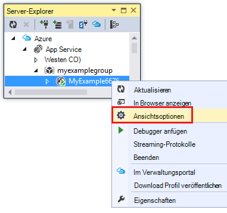

    **Azure Web App** erscheint, und sehen Sie es Web app Verwaltung und Konfiguration Aufgaben, die in Visual Studio verfügbar sind.

    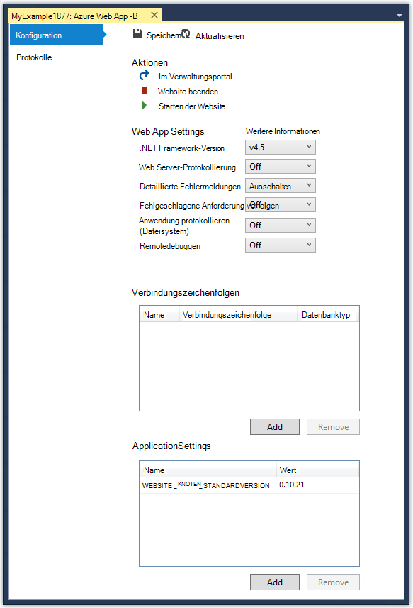

    In diesem Lernprogramm werden Sie Protokollierung und Verfolgung Dropdownlisten verwenden. Außerdem verwenden Sie Remotedebuggen, aber verwenden Sie eine andere Methode um zu aktivieren.
   
    Informationen über die App-Einstellungen und Verbindungszeichenfolgen Felder in diesem Fenster finden Sie unter [Azure Web Apps: wie Anwendungszeichenfolgen und Connection Strings arbeiten](http://blogs.msdn.com/b/windowsazure/archive/2013/07/17/windows-azure-web-sites-how-application-strings-and-connection-strings-work.aspx).

    Möchten Sie eine Web-Anwendung ausführen, die in diesem Fenster nicht, klicken Sie auf **im Verwaltungsportal öffnen** , um ein Browserfenster Azure-Portal.

## Zugriff auf Web app Dateien im Server-Explorer

Bereitstellen in der Regel ein Webprojekt mit der `customErrors` -Flag in der Datei Web.config festgelegt `On` oder `RemoteOnly`, d.h. Sie eine hilfreich bei Fehlermeldung nicht schief. Für viele Fehler erhalten Sie ist eines der folgenden Seite.

**Serverfehler in der Anwendung '/'**

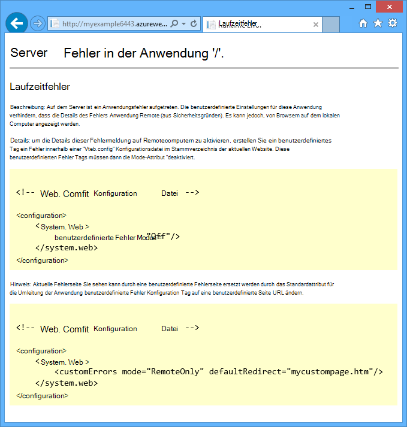

**Fehler:**

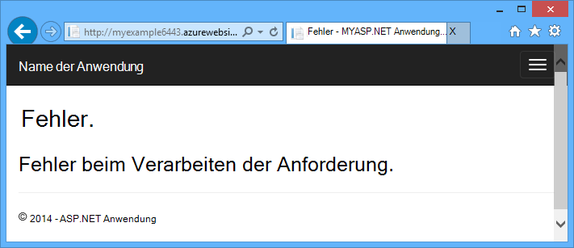

**Die Website kann die Seite nicht anzeigen.**

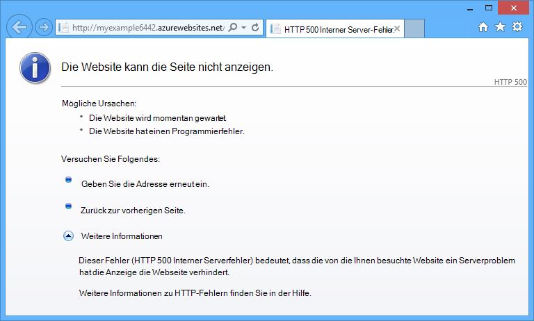

Häufig am einfachsten, die Ursache des Fehlers finden ausführliche Fehlermeldungen aktiviert der ersten vorangegangenen Screenshots erläutert werden. Das erfordert eine Änderung in der bereitgestellten Web.config-Datei. Können Sie der Datei *Web.config* im Projekt und das Projekt erneut bereitstellen oder erstellen eine [Web.config Transformation](http://www.asp.net/mvc/tutorials/deployment/visual-studio-web-deployment/web-config-transformations) und einen Debugbuild bereitstellen, aber es gibt eine schnellere Möglichkeit: im **Projektmappen-Explorer** Sie direkt anzeigen und Bearbeiten von Dateien in der Remotewebsite app mit der *remote-Ansicht* .

1. Im **Server-Explorer**erweitern **Azure** **App Service**, erweitern Sie die Ressourcengruppe, der Ihrer Anwendung befindet und anschließend erweitern Sie den Knoten Ihrer Anwendung.

    Knoten, mit denen Sie Zugriff auf Content und Protokolldateien Web app angezeigt.

2. Erweitern Sie den Knoten **Dateien** , und doppelklicken Sie auf die Datei *Web.config* .

    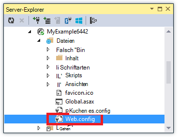

    Visual Studio öffnet die Datei Web.config aus remote Web app und zeigt [Remote] neben dem Dateinamen in der Titelleiste.

3. Fügen Sie folgende Zeile in die `system.web` Element:

    `<customErrors mode="Off"></customErrors>`

    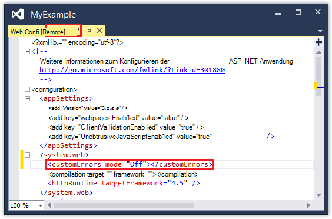

4. Aktualisieren Sie den Browser, der die Fehlermeldung angezeigt wird und Sie erhalten jetzt eine detaillierte Fehlermeldung wie im folgenden Beispiel:

    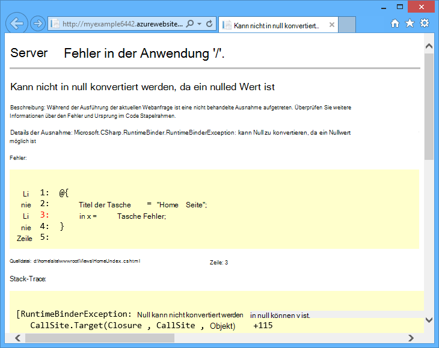

    (Der Fehler erstellt wurde durch die Zeile *Views\Home\Index.cshtml*in Rot angezeigt.)

Bearbeiten der Datei Web.config ist nur ein Beispiel in der Fähigkeit zum Lesen und Bearbeiten Ihrer Azure Web App-Systemkonfigurationsprogramm Szenarien.

## Remote debugging webapps

Die ausführliche Fehlermeldung nicht genügend Informationen bieten, und den Fehler lokal kann nicht neu erstellt ist anders zu behandeln, im Debugmodus auszuführen. Sie können Haltepunkte, Speicher direkt bearbeiten Code durchgehen und sogar den Pfad ändern. 

Remote-Debuggen funktioniert nicht in Express-Editionen von Visual Studio.

Dieser Abschnitt veranschaulicht das Debuggen Remote mit dem Projekt in [Erste Schritte mit Azure und ASP.NET erstellen][GetStarted].

1. Öffnen Sie das Webprojekt in [Erste Schritte mit Azure und ASP.NET]erstellte[GetStarted].

1. Öffnen Sie *Controllers\HomeController*.

2. Löschen Sie die `About()` -Methode und Einfügen die folgenden ersetzt Code.

        public ActionResult About()
        {
            string currentTime = DateTime.Now.ToLongTimeString();
            ViewBag.Message = "The current time is " + currentTime;
            return View();
        }

2. [Legen Sie einen Haltepunkt](http://www.visualstudio.com/get-started/debug-your-app-vs.aspx) auf die `ViewBag.Message` Linie.

1. Im **Projektmappen-Explorer**mit der rechten Maustaste des Projekts und klicken Sie auf **Veröffentlichen**.

2. Wählen Sie in der Dropdownliste **Profile** das gleiche Profil in [Erste Schritte mit Azure und ASP.NET]verwendet[GetStarted].

3. Klicken Sie auf der Registerkarte **Einstellungen** ändern Sie **Konfiguration** **Debuggen**, und klicken Sie auf **Veröffentlichen**.

    

4. Nach der Bereitstellung beendet und Ihr Browser Azure URL Ihrer Web-Anwendung geöffnet wird, schließen Sie den Browser.

5. Im **Server-Explorer**mit der rechten Maustaste Ihrer Anwendung und dann auf **Debugger anfügen**. 

    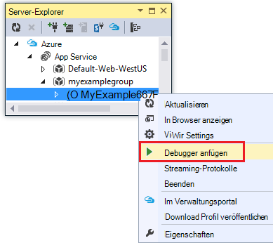

    Der Browser Öffnet Ihre Homepage in Azure ausgeführt. Sie müssen warten Sie 20 Sekunden Azure Server für Debuggen eingerichtet. Diese Verzögerung tritt nur beim ersten im Debugmodus auf eine Webanwendung ausführen. Innerhalb der nächsten 48 Stunden beim Starten des Debugvorgangs erneut es später keine Verzögerung.

    **Hinweis:** Haben Sie Probleme beim Starten des Debuggers, versuchen Sie dazu **Cloud Explorer** anstelle von **Server-Explorer**.

6. **Klicken Sie im Menü.**

    Visual Studio hält am Haltepunkt und der Code nicht auf dem lokalen Computer in Azure ausgeführt wird.

7. Zeigen Sie auf den `currentTime` Variable auf den Wert.

    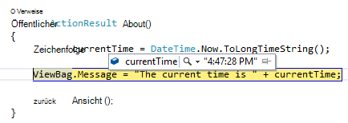

    Mal sehen Sie immer Azure-Server, in einer anderen Zeitzone als der lokale Computer.

8. Geben Sie einen neuen Wert für die `currentTime` Variable, z. B."jetzt in Azure".

5. Drücken Sie F5 weiter ausgeführt werden.

    In Azure ausgeführt Informationsseite zeigt den neuen Wert in die Variable CurrentTime eingegeben.

    

## Remote debugging Webaufträge

In diesem Abschnitt wird das Debuggen über Projekt- und Web app in [Erste Schritte mit Azure Webaufträge SDK](websites-dotnet-webjobs-sdk.md)erstellte veranschaulicht. 

In diesem Abschnitt dargestellten Funktionen stehen nur in Visual Studio 2013 Update 4 oder höher. 

Remotedebuggen funktioniert nur mit kontinuierlichen Webaufträge. Geplanten und einer bedarfsgesteuerten Webaufträge Debugunterstützung nicht.

1. Öffnen Sie das Webprojekt in [Erste Schritte mit Azure Webaufträge SDK]erstellt[GetStartedWJ].

1. Öffnen Sie im Projekt ContosoAdsWebJob *Functions.cs*.

2. [Legen Sie einen Haltepunkt](http://www.visualstudio.com/get-started/debug-your-app-vs.aspx) auf die erste Anweisung in der `GnerateThumbnail` Methode.

    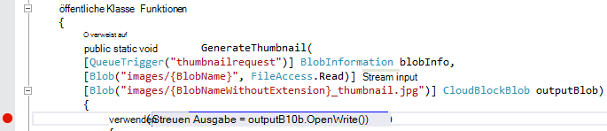

1. Im **Projektmappen-Explorer**mit der rechten Maustaste des Webprojekts (nicht das Projekt Webauftrags), und klicken Sie auf **Veröffentlichen**.

2. Wählen Sie in der Dropdownliste **Profile** das gleiche Profil in [Erste Schritte mit Azure Webaufträge SDK](websites-dotnet-webjobs-sdk.md)verwendet.

3. Klicken Sie auf der Registerkarte **Einstellungen** ändern Sie **Konfiguration** **Debuggen**, und klicken Sie auf **Veröffentlichen**.

    Visual Studio stellt Web und Webauftrags Projekte und Browser Azure URL Ihrer Web-Anwendung geöffnet.

5. Erweitern Sie im **Server-Explorer** **Azure > App Service > der Ressourcengruppe > Ihrer Anwendung > Webaufträge > fortlaufend**, und **ContosoAdsWebJob**.

7. Klicken Sie auf **Debugger anfügen**. 

    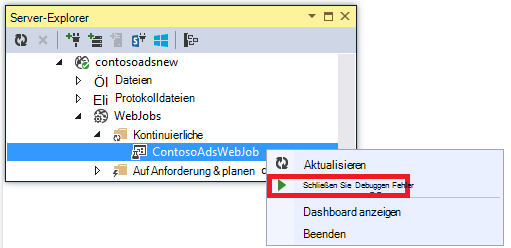

    Der Browser Öffnet Ihre Homepage in Azure ausgeführt. Sie müssen warten Sie 20 Sekunden Azure Server für Debuggen eingerichtet. Diese Verzögerung tritt nur beim ersten im Debugmodus auf eine Webanwendung ausführen. Das nächste Mal den Debugger anfügen, keine Verzögerung Wenn innerhalb von 48 Stunden werden.

6. Erstellen Sie in einem Webbrowser an Contoso anzeigen geöffnet wird eine neue Anzeige. 

    Erstellen einer Anzeige wird eine Warteschlange Meldung erstellt werden, die von dem Webauftrag aufgenommen und verarbeitet. Wenn das WebJobs SDK die Funktion zum Verarbeiten der warteschlangennachricht aufruft, wird der Code der Haltepunkt.

7. Wenn der Debugger am Haltepunkt unterbrochen wird, können Sie untersuchen und Variablenwerte ändern, während das Programm die Cloud ausgeführt wird. In der folgenden Abbildung zeigt der Debugger den Inhalt der BlobInfo-Objekt, das die GenerateThumbnail-Methode übergeben wurde.

    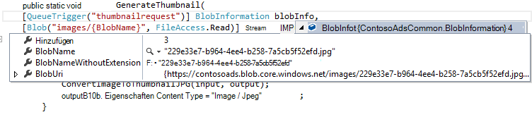
 
5. Drücken Sie F5 weiter ausgeführt werden.

    GenerateThumbnail-Methode die Miniaturansicht erstellt hat.

6. Im Browser die Seite aktualisieren und Anzeigen der Miniaturansicht.

6. Drücken Sie in Visual Studio zum Debuggen beenden UMSCHALT + F5.

7. Im **Server-Explorer**Maustaste ContosoAdsWebJob Knoten klicken und **Dashboard anzeigen**.

8. Azure-Anmeldeinformationen melden Sie an und klicken Sie dann zu der Seite der Webauftrag Webauftrag. 

    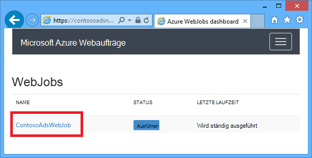

    Das Dashboard zeigt, dass die GenerateThumbnail-Funktion zuletzt ausgeführt.

    (Das nächste Mal **-Ansicht**klicken müssen anmelden und der Browser geht direkt zur Seite für die Webauftrag.)

9. Klicken Sie auf Funktion, um Informationen über die Ausführung der Funktion.

    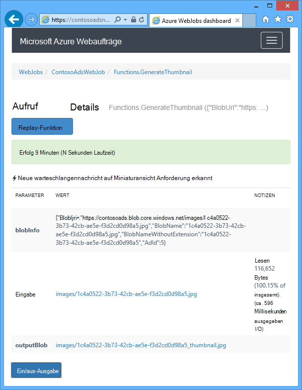

Die Funktion [schrieb Protokolle](websites-dotnet-webjobs-sdk-storage-queues-how-to.md#logs) **ToggleOutput** an sie Klick konnte.

## Hinweise zum Remotedebuggen

* Ausführen im Debugmodus in der Produktion nicht empfohlen. Wenn Ihre Produktion Web app nicht mit mehreren skaliert wird, verhindert Debuggen Webserver anderen Anfragen. Haben Sie mehrere Web Server-Instanzen, wenn Sie den Debugger anfügen eine zufällige Instanz erhalten und Sie haben keine Möglichkeit, sicherzustellen, dass nachfolgende Browseranforderungen zu dieser Instanz. In der Regel keinen Debugbuild Produktion bereitstellen können, auch compileroptimierungen für Releasebuilds können unmöglich Zeile im Quellcode geschieht angezeigt. Die beste Ressource ist für die Problembehandlung Probleme Anwendung verfolgen und Web Server-Protokolle.

* Vermeiden Sie lange hält an Haltepunkten Remote Debuggen. Azure behandelt einen Prozess, der länger als ein paar Minuten als nicht reagiert Prozess angehalten und beendet wird.

* Beim Debuggen, sendet der Server Daten an Visual Studio die Bandbreite Zuschläge beeinflussen könnten. Bandbreite zu Preisinformationen finden Sie unter [Azure Preise](/pricing/calculator/).

* Stellen Sie sicher, dass die `debug` Attribut der `compilation` Element in der Datei *Web.config* festgelegt auf True. Ist standardmäßig beim Veröffentlichen einer Debugbuildkonfiguration.

        <system.web>
          <compilation debug="true" targetFramework="4.5" />
          <httpRuntime targetFramework="4.5" />
        </system.web>

* Wenn Sie feststellen, dass der Debugger nicht in den Code Schritt, den Sie debuggen möchten, müssen Sie möglicherweise nur mein Code-Einstellung ändern.  Weitere Informationen finden Sie unter [Nur mein Code schrittweise zu beschränken](http://msdn.microsoft.com/library/vstudio/y740d9d3.aspx#BKMK_Restrict_stepping_to_Just_My_Code).

* Ein Zeitgeber startet auf dem Server ermöglichen die remote debugging-Funktion und nach 48 Stunden die automatisch deaktiviert ist. Aus Sicherheits- und Leistungsgründen erfolgt diese Grenze 48 Stunden. Sie können die Funktion problemlos auf beliebig oft aktivieren. Empfohlen, wenn Sie nicht aktiv Debuggen deaktiviert.

* Sie können jeder Prozess nicht nur Web app (w3wp.exe) manuell den Debugger anhängen. Weitere Informationen zur Verwendung von Debug-Modus in Visual Studio finden Sie unter [Debuggen in Visual Studio](http://msdn.microsoft.com/library/vstudio/sc65sadd.aspx).

## Diagnoseprotokolle (Übersicht)

Eine in einer Azure Web app ausgeführte Anwendung ASP.NET kann folgende Protokolle erstellen:

* **Anwendung-Ablaufverfolgungsprotokolle** 
  Die Anwendung erstellt diese Protokolle Methoden [System.Diagnostics.Trace](http://msdn.microsoft.com/library/system.diagnostics.trace.aspx) -Klasse.
* **Webserverprotokollen** 
  Der Webserver erstellt einen Eintrag für jede HTTP-Anforderung zu Web app.
* **Ausführliche Protokolle** 
  Der Webserver erstellt eine HTML-Seite zusätzliche Informationen für HTTP-Anforderungsfehler (solche, Statuscode 400 oder höher). 
* **Fehler bei Anforderung Ablaufverfolgungsprotokolle** 
  Der Webserver erstellt eine XML-Datei mit Ausführliche Ablaufverfolgungsinformationen fehlgeschlagenen HTTP-Anfragen. Webserver bietet auch eine XSL-Datei zum Formatieren von XML in einem Browser.
  
Protokollierung beeinflusst Web app, Azure bietet die Möglichkeit, aktivieren oder Deaktivieren jede Art von Protokoll benötigt. Anwendung Protokolle können nur Protokolle über einen bestimmten Schweregrad geschrieben werden soll. Wenn Sie eine neue Webanwendung standardmäßig Protokollierung erstellen ist deaktiviert.

Protokolle werden Dateien in einem Ordner *LogFiles* im Dateisystem Ihrer Anwendung geschrieben und über FTP zugegriffen werden. Web Server und Anwendungsprotokollen können auch ein Azure Storage-Konto geschrieben werden. Sie können größere Mengen von Protokollen in ein Speicherkonto als im Dateisystem beibehalten. Sie sind maximal 100 MB Protokolle, wenn das Dateisystem verwenden. (Datei-Systemprotokolle sind nur für die kurzfristige Archivierung. Azure Löscht alte Protokolldateien, um Platz für neue, nachdem dieser Wert erreicht ist.)  

## Erstellen und Anzeigen von Ablaufverfolgungsprotokollen Anwendung

In diesem Abschnitt werden die folgenden Aufgaben ausführen:

* Das Webprojekt in [Erste Schritte mit Azure und ASP.NET]erstellte ablaufverfolgungsanweisungen hinzufügen[GetStarted].
* Zeigen Sie Protokolle an, wenn Sie das Projekt lokal ausführen.
* Generiert durch die Anwendung in Azure zeigen Sie Protokolle an. 

Protokolliert Informationen über das Erstellen der Anwendung im Webaufträge finden Sie unter [Verwendung von Azure Warteschlangenspeicher mithilfe des WebJobs-SDK - Protokolle schreiben](websites-dotnet-webjobs-sdk-storage-queues-how-to.md#logs). Gehen für Protokolle anzeigen und steuern, wie sie in Azure gespeichert sind, gelten auch für Anwendungsprotokolle Webaufträge erstellt. 

### Tracing-Anweisungen zur Anwendung hinzufügen

1. *Controllers\HomeController*öffnen und ersetzen die `Index`, `About`, und `Contact` mit den folgenden Code hinzufügen `Trace` Aussagen und `using` -Anweisung für `System.Diagnostics`:

        public ActionResult Index()
        {
            Trace.WriteLine("Entering Index method");
            ViewBag.Message = "Modify this template to jump-start your ASP.NET MVC application.";
            Trace.TraceInformation("Displaying the Index page at " + DateTime.Now.ToLongTimeString());
            Trace.WriteLine("Leaving Index method");
            return View();
        }
        
        public ActionResult About()
        {
            Trace.WriteLine("Entering About method");
            ViewBag.Message = "Your app description page.";
            Trace.TraceWarning("Transient error on the About page at " + DateTime.Now.ToShortTimeString());
            Trace.WriteLine("Leaving About method");
            return View();
        }
        
        public ActionResult Contact()
        {
            Trace.WriteLine("Entering Contact method");
            ViewBag.Message = "Your contact page.";
            Trace.TraceError("Fatal error on the Contact page at " + DateTime.Now.ToLongTimeString());
            Trace.WriteLine("Leaving Contact method");
            return View();
        }       

2. Hinzufügen einer `using System.Diagnostics;` -Anweisung an den Anfang der Datei.
                
### Die Ablaufverfolgungsausgabe lokal anzeigen

3. Drücken Sie F5, um die Anwendung im Debugmodus ausgeführt.

    Der standardmäßige Ablaufverfolgungslistener schreibt alle Ablaufverfolgungsausgabe an **das Ausgabefenster mit anderen Debugausgabe** . Die folgende Abbildung zeigt die Ausgabe von Trace-Anweisungen, die Sie hinzugefügt haben die `Index` Methode.

    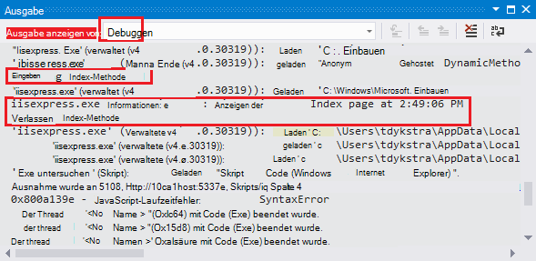

    Die folgenden Schritte zeigen Ablaufverfolgungsausgabe auf einer Webseite anzeigen, ohne im Debug-Modus kompilieren.

2. Öffnen Sie die Web.config-Anwendungsdatei (die einen Projektordner) und fügen eine `<system.diagnostics>` Element am Ende der Datei vor dem `</configuration>` Element:

        <system.diagnostics>
            <trace>
              <listeners>
                <add name="WebPageTraceListener"
                    type="System.Web.WebPageTraceListener, 
                    System.Web, 
                    Version=4.0.0.0, 
                    Culture=neutral,
                    PublicKeyToken=b03f5f7f11d50a3a" />
              </listeners>
            </trace>
          </system.diagnostics>

    Die `WebPageTraceListener` Hier können Sie verfolgen Ausgabe auf `/trace.axd`.

3. Fügen Sie ein <a href="http://msdn.microsoft.com/library/vstudio/6915t83k(v=vs.100).aspx">Ablaufverfolgungselement</a> unter `<system.web>` in der Datei Web.config, wie im folgenden Beispiel:

        <trace enabled="true" writeToDiagnosticsTrace="true" mostRecent="true" pageOutput="false" />

3. Drücken Sie STRG + F5, um die Anwendung auszuführen.

4. Fügen Sie in der Adressleiste des Browserfensters *trace.axd* URL hinzu und drücken Sie (die URL ist ähnlich wie Http://localhost:53370/trace.axd).

5. Klicken Sie auf der Seite **Anwendung verfolgen** **Details anzeigen** auf die erste Zeile (nicht die BrowserLink).

    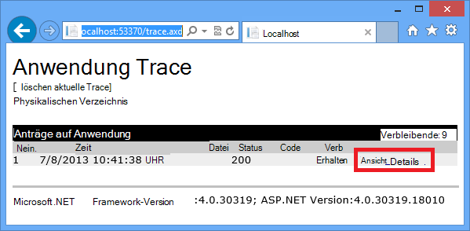

    **Anforderungsdetails** angezeigt und im Abschnitt **Ablaufverfolgungsinformationen** finden Sie die Ausgabe von Trace-Anweisungen, die Sie hinzugefügt haben die `Index` Methode.

    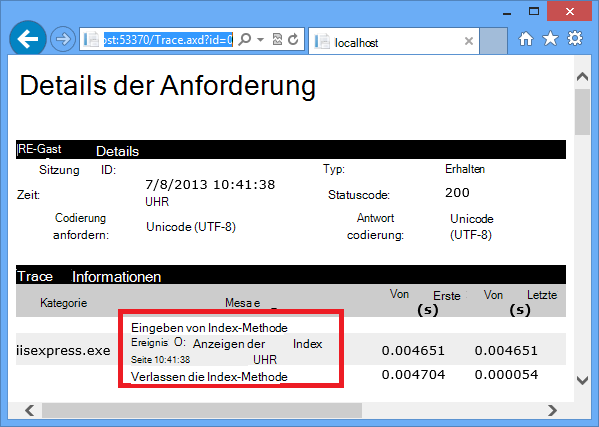

    Standardmäßig `trace.axd` steht nur lokal. Wenn Sie über eine webbasierte Anwendung erstellen, können hinzufügen `localOnly="false"` , die `trace` Element in der Datei *Web.config* , wie im folgenden Beispiel gezeigt:

        <trace enabled="true" writeToDiagnosticsTrace="true" localOnly="false" mostRecent="true" pageOutput="false" />

    Aktivieren `trace.axd` Produktion WebApp wird nicht empfohlen für Sicherheit und in den folgenden Abschnitten sehen Sie einfacher Ablaufverfolgungsprotokolle in einer Azure Web lesen.

### Anzeigen der Ablaufverfolgungsausgabe in Azure

1. Im **Projektmappen-Explorer**mit der rechten Maustaste des Webprojekts, und klicken Sie auf **Veröffentlichen**.

2. Klicken Sie im Dialogfeld **Web veröffentlichen** **Veröffentlichen**.

    Nachdem Visual Studio die Aktualisierung veröffentlicht, öffnet ein Browserfenster zu Ihrer Startseite (vorausgesetzt, **Ziel-URL** auf der Registerkarte **Verbindung** deaktivieren nicht).

3. Im **Server-Explorer**Maustaste Ihrer Anwendung, und wählen Sie **Streaming-Protokolle anzeigen**. 

    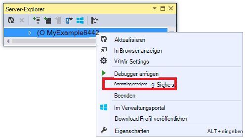

    **Das Ausgabefenster** zeigt Log-streaming-Service verbunden sind und fügt eine Benachrichtigungszeile pro Minute ohne ein Protokoll vergeht angezeigt.

    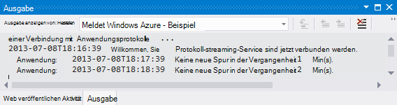

4. Klicken Sie im Browserfenster, das Startseite für die Anwendung anzeigt auf **Kontakt**.

    Die Ausgabe der Fehlerstufe in wenigen Sekunden verfolgen Sie hinzugefügt die `Contact` -Methode im **Ausgabefenster** angezeigt.

    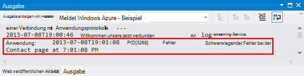

    Visual Studio zeigt nur auf Spuren ist die Standardeinstellung beim Überwachungsdienst Protokoll aktivieren. Beim Erstellen einer neuen Azure Web-Applikation ist Protokollierung standardmäßig deaktiviert, wie Sie bei die Einstellungsseite vorher geöffnet:

    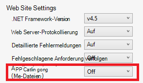

    Jedoch bei der Auswahl von **Streaming-Protokolle anzeigen**geändert Visual Studio automatisch **Anwendung Logging(File System)** **Fehler**, d. h. auf Protokolle gemeldet. Um alle Ihre Ablaufverfolgungsprotokolle anzuzeigen, können Sie diese Einstellung **ausführlich**ändern. Wenn Sie niedriger als Fehler mit einen Schweregrad auswählen, werden auch alle Protokolle für höhere Schweregrade gemeldet. Damit bei Auswahl ausführlich anzeigen auch Informationen, Warnung und Fehler protokolliert  

4. Im **Server-Explorer**mit der rechten Maustaste Web app und dann auf **Ansichtsoptionen** wie zuvor.

5. **Ausführlich**ändern Sie **Anwendung protokolliert (Dateisystem)** , und klicken Sie dann auf **Speichern**.
 
    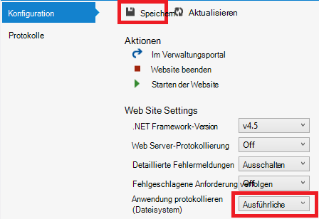

6. Klicken Sie im Browserfenster, das jetzt die Seite **Kontakt** angezeigt wird auf **Start**, **Klicken Sie**, und klicken Sie dann auf **Kontakt**.

    Innerhalb weniger Sekunden enthält **das Ausgabefenster** die Ablaufverfolgungsausgabe.

    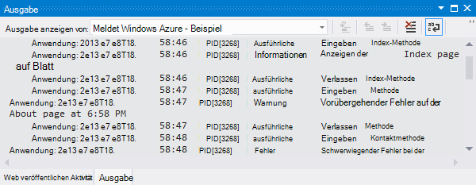

    In diesem Abschnitt aktiviert und deaktiviert die Protokollierung Azure Web app Einstellungen. Sie können auch aktivieren und Deaktivieren von Ablaufverfolgungslistener durch Bearbeiten der Datei Web.config. Ändern der Datei Web.config bewirkt jedoch, dass die Anwendungsdomäne freizugebenden beim Aktivieren der Protokollierung über die Webkonfiguration für die Anwendung, die nicht. Wenn das Problem reproduzieren, lange dauert oder zeitweise und Wiederverwenden der Anwendungsdomäne möglicherweise "fixieren" zwingen Sie warten, bis es wieder auftritt. Aktivieren der Diagnose in Azure, nicht damit Sie Fehlerinformationen sofort erfassen können.

### Fensterfunktionen Ausgabe

Die Registerkarte **Azure Protokolle** im **Ausgabefenster** hat mehrere Schaltflächen und einem Textfeld:

Diese führen die folgenden Funktionen:

* Deaktivieren Sie im **Ausgabefenster** .
* Aktivieren Sie oder deaktivieren Sie des Zeilenumbruchs.
* Starten Sie oder beenden Sie der Überwachung von Protokollen.
* Geben Sie die Protokolle überwachen.
* Downloaden Sie Protokolle.
* Filtern Sie Protokolle basierend auf einen Suchbegriff oder einen regulären Ausdruck.
* Schließen Sie das Fenster **Ausgabe** .

Wenn Sie einen Suchbegriff oder einen Ausdruck eingeben, filtert Visual Studio Protokollinformationen auf dem Client. Das bedeutet, dass die Kriterien die Protokolle werden im **Ausgabefenster** angezeigt und Sie können Filterkriterien ändern, ohne Regenerieren Protokolle geben.

## Webserverprotokollen anzeigen

Webserverprotokollen Aufzeichnen aller HTTP für Web app. Damit sie im **Ausgabefenster** angezeigt haben Sie zu Web App aktivieren Visual Studio, die sie überwachen möchten. 

1. Im **Server-Explorer öffnen**Registerkarte **Konfiguration von Azure Web App** ändern Sie Web Server Protokollierung **auf**und dann auf **Speichern**.

    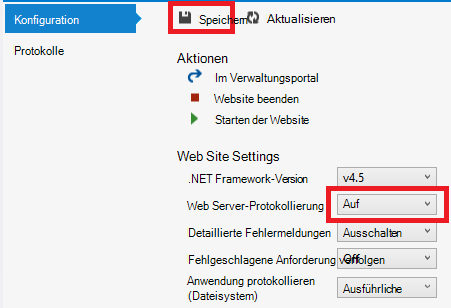

2. Klicken Sie im **Ausgabefenster** auf **Azure Protokolle überwachen soll** .
    
    

3. Klicken Sie im Dialogfeld **Azure Protokollierungsoptionen** wählen Sie **Webserverprotokolle**und klicken Sie dann auf **OK**.

    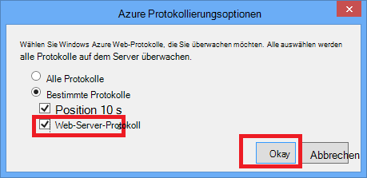

4. Klicken Sie im Browserfenster, das Web app anzeigt auf **Start**, **Klicken Sie**und klicken Sie dann auf **Kontakt**.

    Die Anwendungsprotokolle in der Regel werden zuerst angezeigt, gefolgt von Webserverprotokollen. Sie müssen warten für die Protokolle angezeigt werden. 

    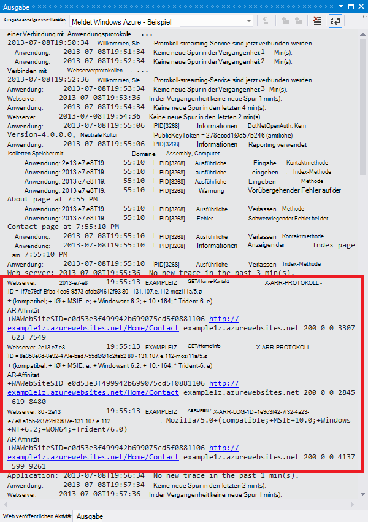

Standardmäßig schreibt Azure beim ersten Webserverprotokolle mithilfe von können Visual Studio die Protokolle im Dateisystem. Als Alternative können Sie Azure-Portal an, Webserver, in einem BLOB-Container ein Speicherkonto Protokolle geschrieben werden sollen.

Wenn Sie das Portal verwenden, um Webserver anmelden ein Konto Azure-Speicher aktivieren und deaktivieren Visual Studio beim erneuten Aktivieren Visual Studio anmelden Anmeldung Ihrer Konteneinstellungen Speicher wiederhergestellt. 

## Ausführliche Protokolle anzeigen

Ausführliche Protokolle Informationen einige zusätzliche über HTTP-Anfragen, die Fehlercodes Antwort (400 oder höher) führen. Damit sie im **Ausgabefenster** angezeigt, müssen Sie für die Webanwendung aktivieren und teilen Sie Visual Studio, die sie überwachen möchten.

1. Im **Server-Explorer öffnen**Registerkarte **Konfiguration von Azure Web App** ändern Sie **Ausführliche Fehlermeldungen** **auf**und klicken Sie dann auf **Speichern**.

    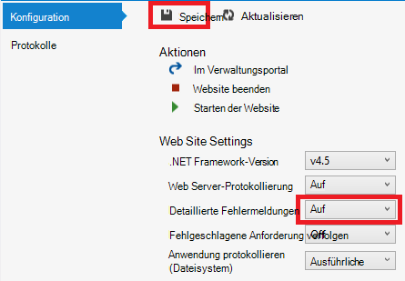

2. Klicken Sie im **Ausgabefenster** auf **Azure Protokolle überwachen soll** .

3. Klicken Sie im Dialogfeld **Azure Protokollierungsoptionen** klicken Sie auf **alle Protokolle**und klicken Sie dann auf **OK**.

    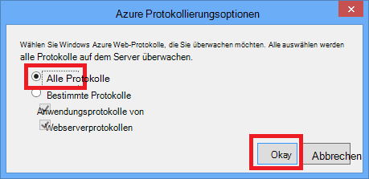

4. In der Adressleiste des Browserfensters hinzufügen ein zusätzliches Zeichen der URL einen 404-Fehler verursacht (z. B. `http://localhost:53370/Home/Contactx`), und drücken Sie die EINGABETASTE.

    Nach einigen Sekunden erscheint das detailliertes Fehlerprotokoll im Visual Studio- **Ausgabe** .

    

    STRG + klicken, um die Ausgabe formatiert in einem Browser finden Sie unter:

    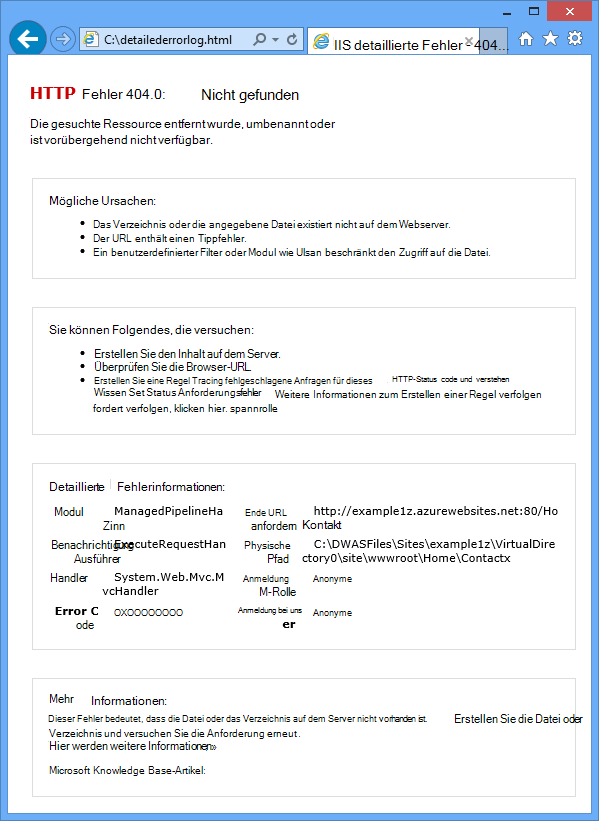

## Systemprotokolle Datei herunterladen

Alle Protokolle, die Sie im Fenster **Ausgabe** überwachen können auch als *ZIP-* Datei heruntergeladen werden. 

1. Klicken Sie im Fenster **Ausgabe** auf **Streaming-Protokolle herunterladen**.

    

    Datei-Explorer öffnet Ordner *Downloads* heruntergeladene Datei.

    

2. Extrahieren Sie die *ZIP-* Datei, und Sie sehen die folgende Ordnerstruktur:

    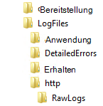

    * Anwendung-Ablaufverfolgungsprotokolle werden in *txt* -Dateien im Ordner " *LogFiles\Application* ".
    * Webserverprotokolle werden in *Protokolldateien im Ordner *LogFiles\http\RawLogs* * . Ein Tool wie [Log Parser](http://www.microsoft.com/download/details.aspx?displaylang=en&id=24659) können Sie anzeigen und Bearbeiten dieser Dateien.
    * Ausführliche Protokolle sind *HTML* -Dateien im Ordner " *LogFiles\DetailedErrors* ".

    (Ordner *Bereitstellung* ist für Dateien veröffentlichen; Datenquellen-Steuerelement hat nichts die Veröffentlichung von Visual Studio. Der *Git* Ordner TRACES-System zur Versionskontrolle ist veröffentlichen und das Protokoll Datei streaming Service.)  

## Storage-Protokolle anzeigen

Anwendung-Ablaufverfolgungsprotokolle Azure Storage-Konto gesendet werden, und in Visual Studio anzeigen. Dazu erstellen ein Speicherkonto, Storage-Protokolle im klassischen Portal aktivieren und auf der Registerkarte **Protokolle** Fenster **Azure Web App** anzeigen.

Sie können Protokolle oder alle drei Ziele senden:

* Das Dateisystem.
* Konto Tabellen.
* Storage-Konto Blobs.

Sie können einen anderen Schweregrad für jedes Ziel angeben. 

Tabellen erleichtern die Protokolle online einsehen und streaming unterstützen; Sie können Protokolle in Tabellen Abfragen und neue Protokolle wie sie erstellt werden. BLOBs erleichtern Protokolle in Dateien herunterzuladen und Analyse mit HDInsight, HDInsight Verwendung von BLOB-Speicher bekannt. Weitere Informationen finden Sie unter **Hadoop und MapReduce** [Datenspeicheroptionen (Gebäude realen Cloud Apps mit Azure)](http://www.asp.net/aspnet/overview/developing-apps-with-windows-azure/building-real-world-cloud-apps-with-windows-azure/data-storage-options).

Sie haben derzeit Datei Systemprotokolle auf ausführlich festgelegt; die folgenden Schritte führen Sie durch Stufe protokolliert Informationen zu Konto Tabellen einrichten. Informationen bedeutet alle Protokolle erstellt durch Aufrufen von `Trace.TraceInformation`, `Trace.TraceWarning`, und `Trace.TraceError` angezeigt, aber keine Protokolle erstellt durch Aufrufen von `Trace.WriteLine`.

Speicherkonten bieten mehr Speicher und länger Aufbewahrung Protokolle im Dateisystem verglichen. Weiterer senden Ablaufverfolgungsprotokolle Anwendung Speicher ist, dass Sie zusätzliche Informationen für jedes Protokoll, die Sie vom System Protokolldateien nicht.

5. Klicken Sie **Speicher** unter Azure Knoten und dann auf **Storage-Konto erstellen**.

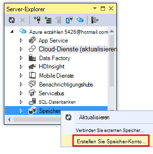

3. Geben Sie einen Namen für das Speicherkonto im Dialogfeld **Storage-Konto erstellen** . 

    Der Name muss eindeutig sein muss (keine Azure Speicherkonto kann denselben Namen haben). Wenn der eingegebene Name bereits verwendet wird erhalten Sie es ändern.

    Die URL auf das Speicherkonto werden *{Name}*. von Core.Windows.NET befinden.. 

5. Die Dropdown-Liste **Region oder Gruppe** auf Bereich Sie festgelegt.

    Diese Einstellung gibt an, welche Azure-Rechenzentrum das Speicherkonto hosten. In diesem Lernprogramm wird nicht Ihrer Wahl einen Unterschied machen, aber für eine Produktion Web app Webserver und das Speicherkonto in derselben Region Latenz und Daten Ausgang Kosten minimiert werden sollen. Web app (die Sie später erstellen) läuft in einem Bereich möglichst Browser Ihrer Anwendung zugreifen, um die Wartezeit zu verkürzen.

6. Soll die Dropdownliste **Replikation** **lokal redundant**. 

    Geo-Replikation für ein Speicherkonto aktiviert ist, wird in einem sekundären Datencenter um einen Failover auf diesen Speicherort im Falle einer Katastrophe am primären Speicherort gespeicherte Inhalt repliziert. Geo-Replikation kann zusätzliche Kosten anfallen. Für Test und Entwicklung im Allgemeinen möchten Geo-Replikation bezahlen. Weitere Informationen finden Sie unter [erstellen, verwalten oder löschen Sie ein Speicherkonto](../storage-create-storage-account/#replication-options).

5. Klicken Sie auf **Erstellen**. 

    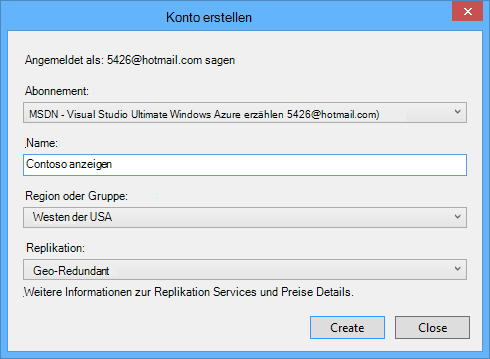  

1. Klicken Sie im Fenster Visual Studio **Azure Web App** auf die Registerkarte **Protokolle** , und dann auf **Management-Portal anmelden konfigurieren**.

    <!-- todo:screenshot of new portal if the VS page link goes to new portal -->
    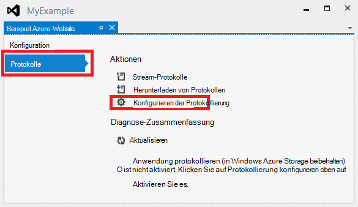

    Die Registerkarte **Konfigurieren** im Verwaltungsportal für Ihre Webanwendung geöffnet.

2. Das klassische Portal **Konfigurieren** Registerkarte Diagnose Anwendungsabschnitt Scrollen Sie und ändern Sie **Anwendung protokolliert (Tabellenspeicher)** **auf**.

3. Ändern Sie **Informationen** **Protokolliergrad** .

4. Klicken Sie auf **Tabelle Speichermanagement**.

    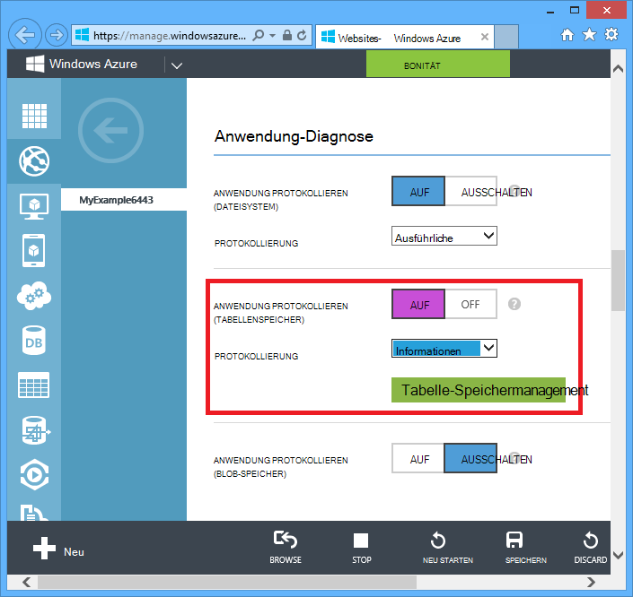

    Im Feld **Tabellenspeicher für Anwendung Diagnose verwalten** können Sie das Speicherkonto mehrere haben. Sie können eine neue Tabelle erstellen oder eine bestehende verwenden.

    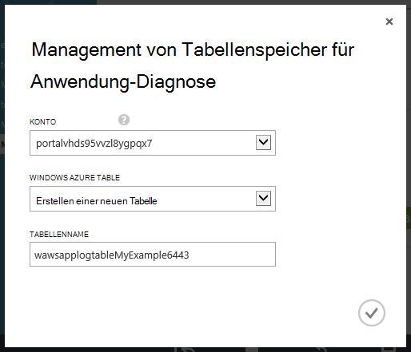

6. Klicken Sie im **Tabellenspeicher für Anwendung Diagnose verwalten** auf das Häkchen, um das Dialogfeld zu schließen.

6. Das Verwaltungsportal Registerkarte **Konfigurieren** klicken Sie auf **Speichern**.

7. Klicken Sie im Browserfenster, in dem die Anwendung Web app angezeigt auf **Start**, **Klicken Sie**und klicken Sie dann auf **Kontakt**.

    Die Protokollierungsinformationen dieser Webseiten durchsuchen auf das Speicherkonto geschrieben.

8. Klicken Sie auf der Registerkarte **Protokolle** **Azure Web App** im Visual Studio-Fenster unter **Diagnose Zusammenfassung** **Aktualisieren** .

    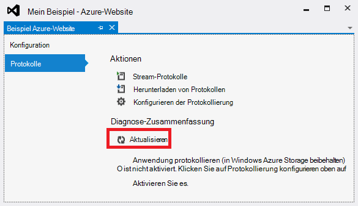

    Abschnitt **Diagnose Zusammenfassung** zeigt Protokolle standardmäßig für den letzten 15 Minuten. Sie können den Zeitraum weitere Protokolle ändern. 

    (Wenn Fehler "Tabelle nicht gefunden" erhalten, überprüfen Sie, ob Sie Seiten durchsucht, die die Protokollierung nach **Anwendung protokolliert (Speicher)** aktiviert und nach dem Klicken auf **Speichern**.)

    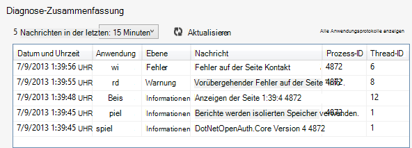

    Beachten Sie, dass in dieser Ansicht Sie **Prozess** und **Thread-ID** für jedes Protokoll sehen Sie in den Systemprotokollen Datei erhalten. Sie können zusätzliche Felder angezeigt der Azure-Speichertabelle direkt.

8. Klicken Sie auf **Alle Anwendungsprotokolle anzuzeigen**.

    Die Ablaufverfolgungstabelle Protokoll erscheint in der Tabelle Azure-Speicher.
   
    (Wenn Sie eine "Sequenz enthält keine Elemente" Fehlermeldung öffnen Sie **Server-Explorer**zu, erweitern Sie den Knoten unter dem Knoten **Azure** das Speicherkonto und **Tabellen** und **Aktualisieren**.)

    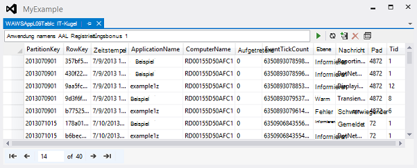

    Diese Ansicht zeigt zusätzliche Felder in anderen Ansichten nicht angezeigt. In dieser Ansicht können auch Protokolle Filtern spezielle Abfrage-Generator-Benutzeroberfläche zum Erstellen einer Abfrage. Weitere Informationen finden Sie unter Arbeiten mit Tabelle - Filterung Entitäten im [Browsing with Server Explorer](http://msdn.microsoft.com/library/ff683677.aspx).

7. Um die Einzelheiten einer einzelnen Zeile anzuzeigen, doppelklicken Sie auf eine der Zeilen.

    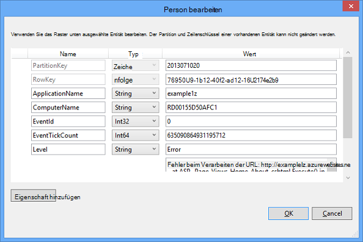

## Fehlgeschlagene Anforderung Ablaufverfolgungsprotokolle anzeigen

Anforderungsfehler Ablaufverfolgungsprotokolle eignen sich die Details der wie IIS eine HTTP-Anforderung in Szenarien wie URL umschreiben oder Authentifizierung behandelt werden müssen. 

Azure webapps Anforderungsfehler Tracing-Funktionen verwenden, die mit IIS 7.0 und höher. Sie haben keinen Zugriff auf den IIS, die Fehler protokolliert werden, jedoch konfigurieren. Wenn Sie fehlerhafte Anforderung aktivieren, werden alle Fehler erfasst. 

Sie können fehlgeschlagene Anforderung Tracing mithilfe von Visual Studio, aber nicht in Visual Studio angezeigt werden. Diese Protokolle sind XML-Dateien. Streaming-Protokolldienst überwacht nur Dateien im nur-Text-Modus gelesen gelten: *txt*, *HTML*und *Log* -Dateien.

Sie können fehlgeschlagene Anforderung Ablaufverfolgungsprotokolle in einem Browser direkt über FTP oder lokal mit FTP-Programm auf den lokalen Computer herunterladen anzeigen. In diesem Abschnitt werden Sie sie in einem Browser anzeigen.

1. Die Registerkarte **Konfiguration** des Fensters **Azure Web App** im **Server-Explorer öffnen** **Failed Request Tracing** **auf**ändern Sie und dann auf **Speichern**.

    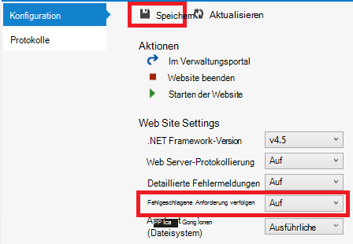

4. In die Adressleiste im Browserfenster, das Web app Zeigt URL ein zusätzliches Zeichen hinzu, und drücken Sie die EINGABETASTE, um einen 404-Fehler verursachen.

    Dadurch wird eine fehlgeschlagene Anforderung Ablaufverfolgungsprotokoll erstellt werden und die folgenden Schritte zeigen anzeigen oder downloaden das Protokoll.

2. Klicken Sie in Visual Studio auf der Registerkarte **Konfiguration** des Fensters **Azure Web App** auf **im Verwaltungsportal**.

3. [Azure-Portal](https://portal.azure.com) **Einstellungen** Blatt für Ihr Web app **Bereitstellung Anmeldeinformationen**auf und geben Sie einen neuen Benutzernamen und ein Kennwort.

    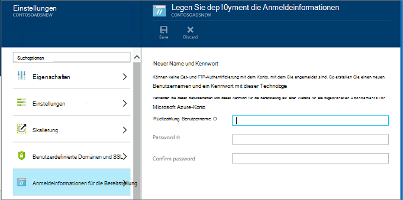

    ** Wenn Sie sich anmelden, haben Sie vollständigen Namen des app Präfix zu verwenden. Beispielsweise melden "Myid" als Benutzername und der Standort "EIGENESBEISPIEL" ist, Sie als "Myexample\myid".

5. Gehen Sie in einem neuen Browserfenster den URL, der **FTP-Hostname** oder **FTP-Hostname** im **Web App** Blade für Ihrer Anwendung angezeigt wird. 

6. Melden Sie sich mit den FTP-Anmeldeinformationen, die Sie zuvor (einschließlich Web app Namenpräfixes für den Benutzernamen) erstellt.

    Der Browser zeigt den Stammordner der Web-app.

6. Öffnen Sie den Ordner *LogFiles* .

    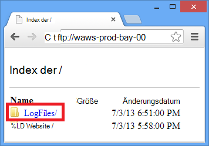

7. Öffnen Sie den Ordner mit dem Namen W3SVC sowie einen numerischen Wert.

    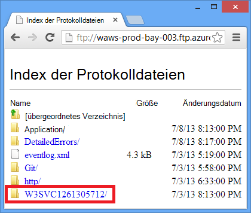

    Der Ordner enthält XML-Dateien für Fehler protokolliert wurden, nachdem die fehlgeschlagene Anforderung Tracing aktiviert und eine XSL-Datei, mit denen ein Browser XML format.

    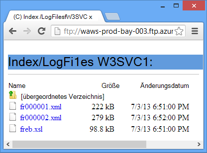

8. Klicken Sie auf die XML-Datei für die fehlgeschlagene Anforderung zu Tracing finden Sie unter.

    Die folgende Abbildung zeigt einen Teil Ablaufverfolgungsinformationen für ein solcher Fehler.

    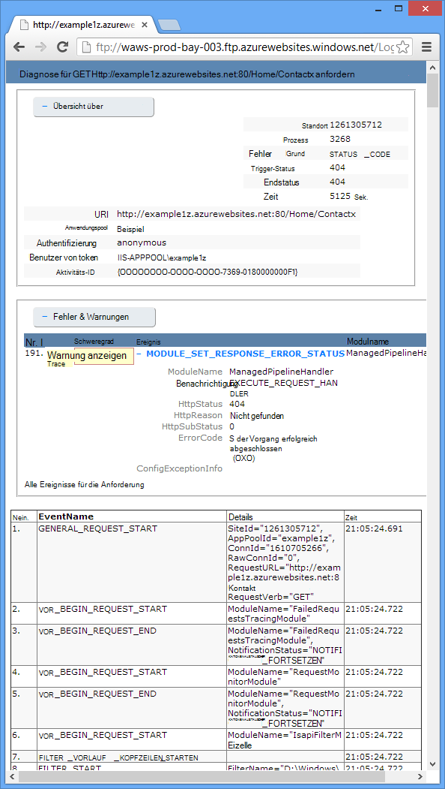

## Nächste Schritte

Sie haben gesehen, wie Visual Studio erstellt eine Azure Web app Protokolle anzeigen erleichtert. Die folgenden Abschnitte enthalten Links zu weiteren Ressourcen zu verwandten Themen:

* Azure Web app Problembehandlung
* Debuggen in Visual Studio 
* Remotedebuggen in Azure
* In ASP.NET Applications verfolgen
* Analysieren von Webserverprotokollen
* Analyse Anforderungsfehler Ablaufverfolgungsprotokolle
* Debuggen von Clouddiensten

### Azure Web app Problembehandlung

Weitere Informationen zur Problembehandlung bei Web-apps in Azure App Service finden Sie in folgenden Ressourcen:

* [Webapps überwachen](/manage/services/web-sites/how-to-monitor-websites/)
* [Untersuchen von Speicherverlusten in Azure Web Apps mit Visual Studio 2013](http://blogs.msdn.com/b/visualstudioalm/archive/2013/12/20/investigating-memory-leaks-in-azure-web-sites-with-visual-studio-2013.aspx). Microsoft ALM-Blog über Visual Studio-Funktionen zum Analysieren von verwaltetem Speicherprobleme.
* [Azure Web apps online-Tools, die, denen Sie kennen sollten](/blog/2014/03/28/windows-azure-websites-online-tools-you-should-know-about-2/). Blogbeitrag Amit Apple.

Für Hilfe bei Fragen zur Problembehandlung Starten eines Threads in einem der folgenden Foren:

* [Der Azure-Forum auf ASP.NET Website](http://forums.asp.net/1247.aspx/1?Azure+and+ASP+NET).
* [Der Azure-Forum auf MSDN](http://social.msdn.microsoft.com/Forums/windowsazure/).
* [StackOverflow.com](http://www.stackoverflow.com).

### Debuggen in Visual Studio 

Weitere Informationen zur Verwendung von Debug-Modus in Visual Studio finden Sie unter [Debuggen in Visual Studio](http://msdn.microsoft.com/library/vstudio/sc65sadd.aspx) MSDN-Artikel und [Tipps Debuggen mit Visual Studio 2010](http://weblogs.asp.net/scottgu/archive/2010/08/18/debugging-tips-with-visual-studio-2010.aspx).

### Remotedebuggen in Azure

Weitere Informationen zum Remotedebuggen Azure webapps und Webaufträge finden Sie in folgenden Ressourcen:

* [Einführung in Remote Debugging Azure App Service Web Apps](/blog/2014/05/06/introduction-to-remote-debugging-on-azure-web-sites/).
* [Einführung in Remote Debuggen Azure App Service Web Apps Teil 2: innerhalb des Remotedebuggens](/blog/2014/05/07/introduction-to-remote-debugging-azure-web-sites-part-2-inside-remote-debugging/)
* [Einführung zum Remotedebuggen Azure App Service Web Apps, Teil 3 - Umgebung mit mehreren Instanzen und GIT](/blog/2014/05/08/introduction-to-remote-debugging-on-azure-web-sites-part-3-multi-instance-environment-and-git/)
* [Webaufträge Debuggen (Video)](https://www.youtube.com/watch?v=ncQm9q5ZFZs&list=UU_SjTh-ZltPmTYzAybypB-g&index=1)

Wenn Ihrer Anwendung eine Azure Web API oder Mobile Services-Back-End verwendet, das Debuggen müssen, finden Sie unter [Debuggen von .NET Backend in Visual Studio](http://blogs.msdn.com/b/azuremobile/archive/2014/03/14/debugging-net-backend-in-visual-studio.aspx).

### In ASP.NET Applications verfolgen

Im Internet sind keine umfassende und aktuelle Einführung in ASP.NET Tracing verfügbar. Am besten können ist Einstieg einführende Materialien für Web Forms MVC noch vorhanden und ergänzen, neuere Blog nicht, die sich auf bestimmte Probleme Beiträge geschrieben. Einige gute Ausgangspunkte sind folgenden Ressourcen:

* [Überwachung und Telemetrie (Gebäude realen Cloud-Apps mit Azure)](http://www.asp.net/aspnet/overview/developing-apps-with-windows-azure/building-real-world-cloud-apps-with-windows-azure/monitoring-and-telemetry).  E-Book Kapitel mit Tracing in Azure Cloudanwendungen.
* [ASP.NET Tracing](http://msdn.microsoft.com/library/ms972204.aspx) 
  Alte aber dennoch eine gute Ressource für eine grundlegende Einführung in das Thema.
* [Ablaufverfolgungslistener](http://msdn.microsoft.com/library/4y5y10s7.aspx) 
  Informationen über Ablaufverfolgungslistener aber [WebPageTraceListener](http://msdn.microsoft.com/library/system.web.webpagetracelistener.aspx)nicht.
* [Exemplarische Vorgehensweise: System.Diagnostics Tracing ASP.NET Tracing integrieren](http://msdn.microsoft.com/library/b0ectfxd.aspx) 
  Zu ALT dies enthält zusätzliche Informationen, die die Einleitung verdeckt.
* [In ASP.NET MVC Razor-Ansichten verfolgen](http://blogs.msdn.com/b/webdev/archive/2013/07/16/tracing-in-asp-net-mvc-razor-views.aspx) 
  Neben Tracing in Razor Ansichten erläutert die Post einen Fehler Filter erstellen, um alle nicht behandelten Ausnahmen in einer MVC-Anwendung anmelden. Informationen protokolliert alle nicht behandelte Ausnahmen in einer Web Forms-Anwendung finden Sie im Beispiel "Global.asax" [Vollständiges Beispiel für Fehlerhandler](http://msdn.microsoft.com/library/bb397417.aspx) auf MSDN. In MVC oder Web Forms ggf. Ausnahmen protokollieren aber Behandlung wirksam, Standard-Framework kann abgefangen und zurückgeben, wie im folgenden Beispiel:

        try
        {
           // Your code that might cause an exception to be thrown.
        }
        catch (Exception ex)
        {
            Trace.TraceError("Exception: " + ex.ToString());
            throw;
        } 

* [Streaming-Diagnose Trace von der Befehlszeile Azure (plus Blick!)](http://www.hanselman.com/blog/StreamingDiagnosticsTraceLoggingFromTheAzureCommandLinePlusGlimpse.aspx) 
  Zeigt die Befehlszeile verwendet dieses Lernprogramm im Visual Studio. [Blick](http://www.hanselman.com/blog/IfYoureNotUsingGlimpseWithASPNETForDebuggingAndProfilingYoureMissingOut.aspx) ist ein Tool zum Debuggen von ASP.NET. 
* [Webapps-Protokollierung und Diagnose - mit David Ebbo](/documentation/videos/azure-web-site-logging-and-diagnostics/) und [Streaming-Protokolle von Web Apps - mit David Ebbo](/documentation/videos/log-streaming-with-azure-web-sites/) 
  Videos von Scott Hanselman und David Ebbo.

Alternative zum Schreiben von Tracing-Code werden für Fehlerprotokolle, ein Open-Source-protokollierungsframework wie [ELMAH](http://nuget.org/packages/elmah/)verwendet. Weitere Informationen finden Sie in [Scott Hanselmans Artikel über ELMAH](http://www.hanselman.com/blog/NuGetPackageOfTheWeek7ELMAHErrorLoggingModulesAndHandlersWithSQLServerCompact.aspx).

Beachten Sie, dass Sie nicht mit ASP.NET oder System.Diagnostics tracing Protokolle von Azure streaming erhalten möchten. Azure Web app Streaming-Protokoll Service streamt *txt*, *HTML*oder *Log* -Datei, die sie in den Ordner *LogFiles* findet. Daher können Sie Ihre eigenen Dateisystem Web App schreibt Protokollierungssystem erstellen und die Datei wird automatisch übertragen und heruntergeladen. Sie müssen lediglich Anwendungscode schreiben, die Dateien im Ordner " *d:\home\logfiles* ". 

### Analysieren von Webserverprotokollen

Weitere Informationen zum Analysieren von Webserverprotokollen finden Sie in folgenden Ressourcen:

* [LogParser](http://www.microsoft.com/download/details.aspx?id=24659) 
  Ein Tool zum Anzeigen von Daten in Webserverprotokollen (*Log* -Dateien).
* [Problembehandlung bei Leistungsproblemen IIS oder Anwendungsfehler LogParser](http://www.iis.net/learn/troubleshoot/performance-issues/troubleshooting-iis-performance-issues-or-application-errors-using-logparser) 
  Eine Einführung in das Log Parser-Tool, mit dem Sie Webserverprotokolle analysieren.
* [Blogbeiträge von Robert McMurray mit LogParser](http://blogs.msdn.com/b/robert_mcmurray/archive/tags/logparser/) 
* [Der HTTP-Statuscode in IIS 7.0 und IIS 7.5 IIS 8.0](http://support.microsoft.com/kb/943891)

### Analyse Anforderungsfehler Ablaufverfolgungsprotokolle

Microsoft TechNet-Website enthält eine [Using Failed Request Tracing](http://www.iis.net/learn/troubleshoot/using-failed-request-tracing) Bereich zum Verständnis der Verwendung dieser Protokolle können. Allerdings Schwerpunkt dieser Dokumentation Anforderungsfehler Tracing in IIS in Azure Web Apps nicht konfigurieren.

[GetStarted]: web-sites-dotnet-get-started.md
[GetStartedWJ]: websites-dotnet-webjobs-sdk.md
 
