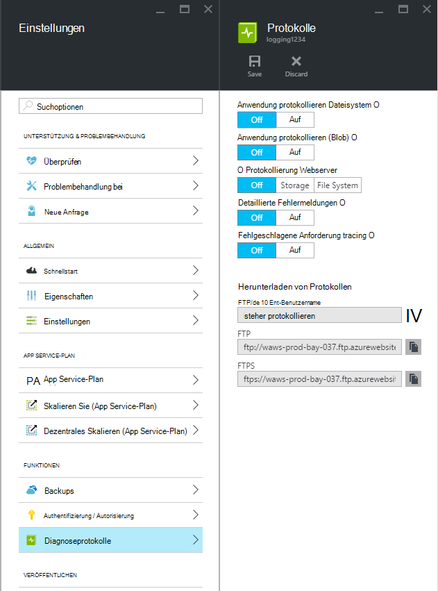
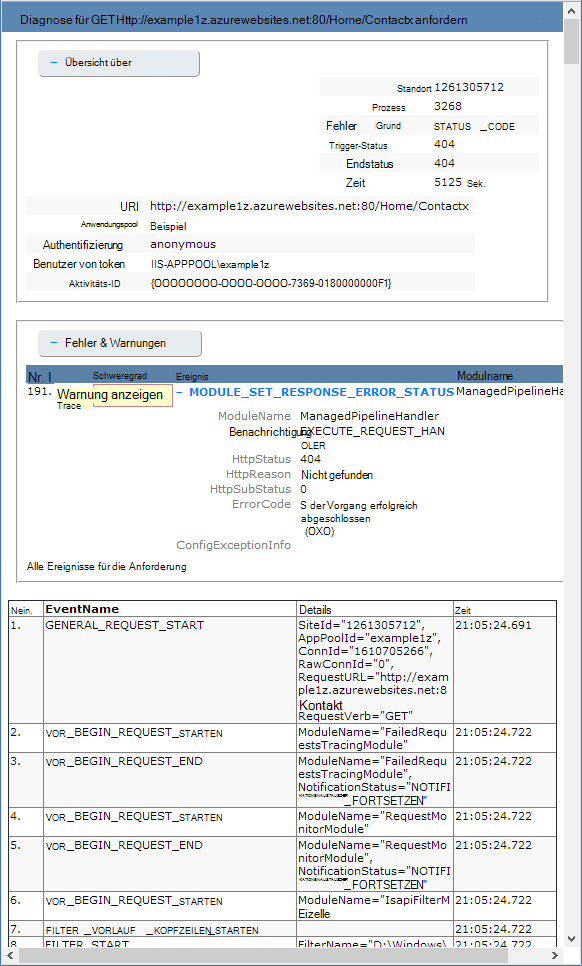

<properties
    pageTitle="Aktivieren des Diagnoseprotokolls für Web-apps in Azure App Service"
    description="Lernen Sie das Diagnoseprotokoll aktivieren und Instrumentation zur Anwendung hinzufügen sowie von Azure protokollierten Informationen auf."
    services="app-service"
    documentationCenter=".net"
    authors="cephalin"
    manager="wpickett"
    editor="jimbe"/>

<tags
    ms.service="app-service"
    ms.workload="na"
    ms.tgt_pltfrm="na"
    ms.devlang="na"
    ms.topic="article"
    ms.date="06/06/2016"
    ms.author="cephalin"/>

# Aktivieren des Diagnoseprotokolls für Web-apps in Azure App Service

## Übersicht

Azure bietet integrierte Diagnose beim Debuggen einer [App Service WebApp](http://go.microsoft.com/fwlink/?LinkId=529714). In diesem Artikel lernen Sie das Diagnoseprotokoll aktivieren und Instrumentation zur Anwendung hinzufügen sowie von Azure protokollierten Informationen auf.

Dieser Artikel verwendet den [Azure-Portal](https://portal.azure.com), Azure PowerShell und Azure-Befehlszeilenschnittstelle (CLI Azure) Diagnoseprotokolle arbeiten. Informationen zum Arbeiten mit Diagnoseprotokolle mit Visual Studio finden Sie unter [Problembehandlung bei Azure in Visual Studio](web-sites-dotnet-troubleshoot-visual-studio.md).

[AZURE.INCLUDE [app-service-web-to-api-and-mobile](../../includes/app-service-web-to-api-and-mobile.md)]

## Web Server Fehlerdiagnose und Anwendung Diagnose

App Service webapps bereit Diagnose Funktionen zur Protokollieren von Informationen aus der Webserver und der Anwendung. Diese sind logisch in **Web Server Fehlerdiagnose** und **Anwendung Diagnose**getrennt.

### Web Server-Diagnose

Sie können aktivieren oder deaktivieren folgende Protokolle:

- **Detaillierte Fehler protokollieren** - Informationen für HTTP-Statuscodes, die einen Fehler (Statuscode 400 oder höher). Dies kann Informationen enthalten, die helfen zu bestimmen, warum der Server den Fehlercode zurückgegeben.
- **Fehler bei Anforderung Tracing** - detaillierte Informationen zu fehlgeschlagenen Anfragen Trace verarbeitet die Anforderung und die einzelnen Komponenten verwendeten IIS-Komponenten. Dies ist hilfreich, wenn Sie versuchen, Site Leistungssteigerung oder isolieren, die Ursache eines bestimmten HTTP-Fehlers zurückgegeben werden.
- **Web Server anmelden** - Informationen über HTTP-Transaktionen mit dem [W3C-Protokolldateiformat](http://msdn.microsoft.com/library/windows/desktop/aa814385.aspx). Dies ist nützlich beim Bestimmen der gesamten Website Metriken wie die Anfragen behandelt oder wie viele Anfragen von einer bestimmten IP-Adresse.

### Anwendung-Diagnose

Anwendung-Diagnose können Sie Informationen von einer Webanwendung. [System.Diagnostics.Trace](http://msdn.microsoft.com/library/36hhw2t6.aspx) -Klasse können ASP.NET Applications Informationen im Anwendungsprotokoll Diagnose protokollieren. Zum Beispiel:

    System.Diagnostics.Trace.TraceError("If you're seeing this, something bad happened");

Zur Laufzeit können Sie diese Protokolle zu Problembehandlung abrufen. Weitere Informationen finden Sie unter [Problembehandlung bei Azure webapps in Visual Studio](web-sites-dotnet-troubleshoot-visual-studio.md).

App Service webapps protokollieren Bereitstellungsinformationen Content Web App veröffentlichen. Dies geschieht automatisch, und es gibt keine Konfigurationen für die bereitstellungsprotokollierung. Bereitstellungsprotokollierung können Sie feststellen, warum eine Bereitstellung fehlgeschlagen ist. Beispielsweise bei Verwendung ein benutzerdefinierten Bereitstellungsskripts können Sie bereitstellungsprotokollierung Sie festzustellen, warum das Skript fehlschlägt.

## Aktivieren der Diagnose

Zum Aktivieren der Diagnose in [Azure-Portal](https://portal.azure.com)Blade für Ihr Web app und klicken Sie auf **Settings > Diagnoseprotokolle**.

<!-- todo:cleanup dogfood addresses in screenshot -->

Wenn **Anwendung Diagnose** Aktivieren Wählen Sie auch die **Ebene**. Mit dieser Einstellung können Sie Informationen zu **Information**, **Warnung** oder **Fehler** filtern. Eine Einstellung auf **ausführliche** werden alle Informationen von der Anwendung protokolliert.

> [AZURE.NOTE] Im Gegensatz zum Ändern der Datei web.config ist Anwendung Diagnose aktivieren oder ändern Diagnoseprotokoll Ebenen nicht die Anwendungsdomäne wiederverwenden, der innerhalb die Anwendung ausgeführt wird.

In der Registerkarte **Konfigurieren** Web app [Verwaltungsportal](https://manage.windowsazure.com) können **Speicher** oder **Dateisystem** **Webserver anmelden**auswählen. **Speicher** auswählen, können Sie wählen ein Speicherkonto ein blobcontainer, dem die Protokolle geschrieben werden. Alle Protokolle für **Website-Diagnose** werden in das Dateisystem geschrieben.

Registerkarte **Konfigurieren** [Verwaltungsportal](https://manage.windowsazure.com) Web app hat auch zusätzliche Einstellungen für Anwendung Diagnose:

* **Dateisystem** - speichert die Anwendung Diagnoseinformationen auf Web app. Diese Dateien können über FTP zugegriffen oder als Zip-Archiv mit Azure PowerShell oder Azure-Befehlszeilenschnittstelle (CLI Azure) gedownloadet werden.
* **Table Storage** - speichert Diagnose Anwendungsinformationen in der angegebenen Azure Storage-Konto und Tabelle.
* **BLOB-Speicher** - speichert die Anwendung Diagnoseinformationen im angegebenen Container Azure Storage-Konto und Blob.
* **Aufbewahrungsdauer** - standardmäßig Protokolle werden nicht automatisch gelöscht von **BLOB-Speicher**. Wählen Sie **Aufbewahrung** und geben Sie die Anzahl der Tage, Protokolle automatisch Protokolle löschen möchten.

>[AZURE.NOTE] [Das Speicherkonto Zugriffstasten Regenerieren](storage-create-storage-account.md#view-copy-and-regenerate-storage-access-keys)Sie die jeweiligen Protokollierungskonfiguration aktualisierte Schlüssel verwenden zurücksetzen müssen. Dazu:
>
> 1. Registerkarte **Konfigurieren** soll die jeweiligen Protokollierungsfunktion **deaktiviert**. Die Einstellung zu speichern.
> 2. Protokollierung der BLOB-Speicher-Konto oder eine Tabelle wieder. Die Einstellung zu speichern.

Beliebige Dateisystem, Tabellenspeicher oder BLOB-Speicher kann gleichzeitig aktiviert und einzelner auf Konfigurationen. Beispielsweise können Sie Fehler und Warnungen als langfristige Protokollierung Lösung BLOB-Speicher und Datei System Anmelden mit ausführlichen Protokollieren.

Zwar alle drei Speicherorte die gleiche grundlegende Informationen für protokollierte Ereignisse, melden Sie sich **Tabelle** und **BLOB-Speicher** weiteren Informationen wie die Instanz-ID, Thread-ID und eine genauere Timestamp (Tick Format) als Protokollierung **Dateisystem**.

> [AZURE.NOTE] Informationen in **Tabellenspeicher** oder **BLOB-Speicher** kann nur über Speicher-Client oder eine Anwendung direkt mit diesen Speichersystemen kann zugegriffen werden. Beispielsweise Visual Studio 2013 enthält einen verwendbaren Tabelle oder BLOB-Speicher zu Speicher-Explorer und HDInsight kann Daten im BLOB-Speicher zugreifen. Sie können auch eine Anwendung schreiben, die Azure-Speicher mit einer [Azure SDKs](/downloads/#)zugreift.

> [AZURE.NOTE] Diagnose kann auch von Azure PowerShell mithilfe des **Set-AzureWebsite** -Cmdlet aktiviert werden. Wenn Sie Azure PowerShell nicht installiert oder nicht konfiguriert haben, um Ihre Azure-Abonnement verwenden, finden Sie unter [Azure PowerShell verwenden](/develop/nodejs/how-to-guides/powershell-cmdlets/).

##Gewusst wie: Herunterladen von Protokollen

Diagnoseinformationen auf Web app kann direkt über FTP zugegriffen werden. Es kann auch als Zip-Archiv mit Azure PowerShell oder der Azure-Befehlszeilenschnittstelle heruntergeladen werden.

Die Verzeichnisstruktur, der die Protokolle gespeichert werden, lautet wie folgt:

* **Anwendungsprotokolle** - /LogFiles/Anwendung. Dieser Ordner enthält eine oder mehrere Textdateien mit Informationen durch Anwendung anmelden.

* **Fehler bei Anforderung Traces** - LogFiles/W3SVC ### /. Dieser Ordner enthält eine XSL-Datei und eine oder mehrere XML-Dateien. Stellen Sie sicher, dass Sie die XSL-Datei in dasselbe Verzeichnis XML Datei(en) herunterladen, da die XSL-Datei für die Formatierung und den Inhalt der XML-Dateien im Internet Explorer Filtern Funktionalität.

* **Ausführliche Protokolle** - /LogFiles/DetailedErrors. Dieser Ordner enthält eine oder mehrere HTML-Dateien, die umfassende Informationen für HTTP-Fehler enthalten, die aufgetreten sind.

* **Webserverprotokolle** - /LogFiles/http/RawLogs. Dieser Ordner enthält eine oder mehrere Textdateien formatiert [W3C-Protokolldateiformat](http://msdn.microsoft.com/library/windows/desktop/aa814385.aspx).

* **Bereitstellungsprotokolle** - LogFiles/Git. Dieser Ordner enthält die internen Prozesse Azure webapps generierten Protokolle sowie für Git Installationen protokolliert.

### FTP

Diagnostische Informationen über FTP finden Sie auf dem **Dashboard** Ihrer Anwendung im [Verwaltungsportal](https://manage.windowsazure.com). Verwenden Sie im Abschnitt **Blick** **Diagnoseprotokolle FTP-** Link auf die Protokolldateien mithilfe von FTP. **Bereitstellung/FTP-** Benutzereintrag Listet den Benutzernamen, der Zugriff auf die FTP-Site verwendet werden soll.

> [AZURE.NOTE] Die **Deployment-FTP** -Eingabe ist nicht festgelegt, ob das Kennwort für diesen Benutzer vergessen haben, können Sie ein neues Benutzerkonto und Kennwort mithilfe der **Bereitstellung Anmeldeinformationen zurücksetzen** Verknüpfung im Abschnitt **Blick** **Dashboard**erstellen.

### Herunterladen von Azure PowerShell

Zu den Protokolldateien, Starten einer neuen Instanz von Azure PowerShell mithilfe des folgenden Befehls:

    Save-AzureWebSiteLog -Name webappname

Dies speichert die Protokolle für Web app gemäß der **-Name** Parameter in einer Datei namens **logs.zip** im aktuellen Verzeichnis.

> [AZURE.NOTE] Wenn Sie Azure PowerShell nicht installiert oder nicht konfiguriert haben, um Ihre Azure-Abonnement verwenden, finden Sie unter [Azure PowerShell verwenden](/develop/nodejs/how-to-guides/powershell-cmdlets/).

### Herunterladen von Azure Befehlszeilenschnittstelle

Protokolldateien mit der Azure-Befehlszeilenschnittstelle herunterladen öffnen Sie neue Befehlszeile, PowerShell, Bash oder Terminal Sitzung, und geben Sie den folgenden Befehl:

    azure site log download webappname

Dadurch wird die Protokolle für die Webanwendung mit dem Namen "Webappname" in eine Datei namens **diagnostics.zip** im aktuellen Verzeichnis gespeichert.

> [AZURE.NOTE] Wenn Sie die Azure-Befehlszeilenschnittstelle (CLI Azure) nicht installiert oder nicht konfiguriert haben, um Ihre Azure-Abonnement verwenden, finden Sie unter [Verwenden von Azure-CLI](../xplat-cli-install.md).

## Gewusst wie: Anzeigen in Application Insights protokolliert

Visual Studio Application Insights bietet Tools, Filtern und Suchen von Protokollen und Protokolle Anfragen und korrelieren.

1. Projekt in Visual Studio SDK Einblicke Anwendung hinzufügen.
 * Klicken Sie im Projektmappen-Explorer mit der rechten Maustaste das Projekt, und wählen Sie Application Insights hinzufügen. Sie werden Schritte geführt, die enthalten eine Application Insights-Ressource erstellen. [Weitere Informationen](../application-insights/app-insights-asp-net.md)
2. Ablaufverfolgungslistener-Paket zum Projekt hinzufügen.
 * Klicken Sie mit der rechten Maustaste das Projekt, und wählen Sie NuGet-Pakete verwalten. Wählen Sie `Microsoft.ApplicationInsights.TraceListener` [erfahren Sie mehr](../application-insights/app-insights-asp-net-trace-logs.md)
3. Laden Sie Projekt und führen Sie aus, um Daten zu generieren.
4. [Azure-Portal](https://portal.azure.com/)an Ihre neue Anwendung Einblicke Ressource durchsuchen und **Suche**öffnen. Sie sehen Ihre Protokolldaten Anforderung und Verwendung anderer Telemetrie. Einige Telemetriedaten dauert einige Minuten an: Klicken Sie auf aktualisieren. [Weitere Informationen](../application-insights/app-insights-diagnostic-search.md)

[Erfahren Sie mehr über Anwendung zum Nachverfolgen der Leistung](../application-insights/app-insights-azure-web-apps.md)

##Gewusst wie: Streamen von Protokollen

Beim Entwickeln einer Anwendung ist es oft sinnvoll, Protokollieren von Informationen in Echtzeit anzuzeigen. Dies kann streaming Protokollierungsinformationen mit Azure PowerShell oder der Azure-Befehlszeilenschnittstelle Umgebung erfolgen.

> [AZURE.NOTE] Bestimmte Protokollierung Puffer Schreiben in die Protokolldatei nicht Ereignisse im Datenstrom führen kann. Beispielsweise kann ein entsprechender Eintrag, der auftritt, wenn ein Benutzer eine Seite besucht im Stream vor dem entsprechenden HTTP-Protokoll für die Seitenanforderung angezeigt.

> [AZURE.NOTE] Streaming-Protokoll streamt auch Informationen in eine beliebige Textdatei gespeichert der **d\\home\\LogFiles\\ ** Ordner.

### Streaming von Azure PowerShell

Stream Protokollinformationen und Starten einer neuen Instanz von Azure PowerShell mithilfe des folgenden Befehls:

    Get-AzureWebSiteLog -Name webappname -Tail

Das Verbinden mit Web app gemäß der **-Name** Parameter und streaming-Informationen im PowerShell Protokollereignisse Web App auftreten. Alle Informationen in Dateien TXT, log oder htm endet im Verzeichnis /LogFiles (d:/Home/log-Dateien) wird an der lokalen Konsole übertragen.

Bestimmte Ereignisse wie Fehler Filtern verwenden die **-Nachricht** Parameter. Zum Beispiel:

    Get-AzureWebSiteLog -Name webappname -Tail -Message Error

Filtern von bestimmten Protokolltypen HTTP, verwenden die **-Pfad** Parameter. Zum Beispiel:

    Get-AzureWebSiteLog -Name webappname -Tail -Path http

Um eine Liste der verfügbaren Pfade finden Sie unter Verwenden Sie ListPath - Parameter.

> [AZURE.NOTE] Wenn Sie Azure PowerShell nicht installiert oder nicht konfiguriert haben, um Ihre Azure-Abonnement verwenden, finden Sie unter [Azure PowerShell verwenden](/develop/nodejs/how-to-guides/powershell-cmdlets/).

### Streaming mit Azure Befehlszeilenschnittstelle

Stream Protokollinformationen, neue Befehlszeile, PowerShell, Bash oder Terminal Sitzung öffnen und geben den folgenden Befehl:

    azure site log tail webappname

Dieses Web App mit dem Namen "Webappname" verbindet und beginnen streaming Informationen zum Fenster Protokollereignisse Web App auftreten. Alle Informationen in Dateien TXT, log oder htm endet im Verzeichnis /LogFiles (d:/Home/log-Dateien) wird an der lokalen Konsole übertragen.

Bestimmte Ereignisse wie Fehler Filtern verwenden die **-Filter** Parameter. Zum Beispiel:

    azure site log tail webappname --filter Error

Filtern von bestimmten Protokolltypen HTTP, verwenden die **-Pfad** Parameter. Zum Beispiel:

    azure site log tail webappname --path http

> [AZURE.NOTE] Wenn Sie die Befehlszeilenschnittstelle Azure nicht installiert oder nicht konfiguriert haben, um Ihre Azure-Abonnement verwenden, finden Sie unter [zu verwenden Azure-Befehlszeilenschnittstelle](../xplat-cli-install.md).

##Gewusst wie: Diagnoseprotokolle verstehen

### Anwendungsprotokolle Diagnose

Anwendung Diagnose speichert Informationen in einem bestimmten Format für .NET Applications, je nachdem, ob Protokolle Dateisystem, Tabellenspeicher oder BLOB-Speicher gespeichert. Der Basissatz von Daten entspricht über alle drei Speicher - Datum und Uhrzeit des Ereignisses die Prozess-ID, die das Ereignis den Ereignistyp (Informationen, Warnung, Fehler) und die Meldung erzeugt.

__Dateisystem__

Jede Zeile im Dateisystem speichern oder mit streaming empfangen werden im folgenden Format:

    {Date}  PID[{process id}] {event type/level} {message}

Beispielsweise würde ein Fehlerereignis ähnlich der folgenden angezeigt:

    2014-01-30T16:36:59  PID[3096] Error       Fatal error on the page!

Protokollierung auf bietet grundlegende Informationen der drei verfügbaren Methoden, Zeit, Prozess-Id, Ereignis- und Nachricht.

__Tabelle speichern__

Beim Anmelden Tabellenspeicher wird zusätzliche Eigenschaften zu erleichtern, suchen die Daten in der Tabelle sowie genauere Informationen über das Ereignis. Die folgenden Eigenschaften (Spalten) wird für jede Entität (Zeile) in der Tabelle gespeichert.

Eigenschaftenname|Wert-format
---|---
PartitionKey|Zeitpunkt des Ereignisses im Format yyyyMMddHH
RowKey|Ein GUID-Wert, der die Entität eindeutig identifiziert
Zeitstempel|Datum und Uhrzeit des Ereignisses
EventTickCount|Datum und Uhrzeit, die das Ereignis aufgetreten, Tick-Format (größere Genauigkeit ist)
Anwendungsname|Name der Web-Anwendung
Ebene|Ereignisebene (z. B. Fehler, Warnung, Informationen)
EventId|Die Ereignis-ID dieses Ereignisses

Standardwert ist 0, wenn keine angegeben
InstanceId|Instanz des Webanwendung, der auf der geraden aufgetreten
PID|Prozess-ID
TID|Die Thread-ID des Threads, der das Ereignis
Nachricht|Detaillierte Meldung

__BLOB-Speicher__

Abmeldung BLOB-Speicher werden Daten in kommagetrennten Werten (CSV) gespeichert. Ähnliche Tabellenspeicher, zusätzliche Felder werden detailliertere Informationen über das Ereignis protokolliert. Die folgenden Eigenschaften sind für jede Zeile in der CSV-verwendet:

Eigenschaftenname|Wert-format
---|---
Datum|Datum und Uhrzeit des Ereignisses
Ebene|Ereignisebene (z. B. Fehler, Warnung, Informationen)
Anwendungsname|Name der Web-Anwendung
InstanceId|Instanz des Webanwendung, der dem Ereignis auftrat
EventTickCount|Datum und Uhrzeit, die das Ereignis aufgetreten, Tick-Format (größere Genauigkeit ist)
EventId|Die Ereignis-ID dieses Ereignisses

Standardwert ist 0, wenn keine angegeben
PID|Prozess-ID
TID|Die Thread-ID des Threads, der das Ereignis
Nachricht|Detaillierte Meldung

Die Daten im Blob sieht etwa wie folgt:

    date,level,applicationName,instanceId,eventTickCount,eventId,pid,tid,message
    2014-01-30T16:36:52,Error,mywebapp,6ee38a,635266966128818593,0,3096,9,An error occurred

> [AZURE.NOTE] Die erste Zeile des Protokolls enthält die Spaltenüberschriften wie in diesem Beispiel dargestellt.

### Fehler bei Anforderung Spuren

Fehler bei Anforderung Spuren in __fr ### XML__XML-Dateien gespeichert. Um die protokollierten Informationen zu erleichtern, wird ein XSL-Stylesheet mit dem Namen __freb.xsl__ in demselben Verzeichnis wie die XML-Dateien bereitgestellt. XML-Dateien in Internet Explorer öffnen wird das XSL-Stylesheet verwenden, um eine formatierte Anzeige der Ablaufverfolgungsinformationen bereitzustellen. Ähnlich der folgenden wird angezeigt:

### Ausführliche Protokolle

Ausführliche Protokolle sind HTML-Dokumente, die ausführlichere Informationen über HTTP-Fehler, die aufgetreten sind. Sind einfach HTML-Dokumente können sie mit einem Webbrowser angezeigt werden.

### Webserverprotokollen

Webserverprotokollen werden formatiert [W3C-Protokolldateiformat](http://msdn.microsoft.com/library/windows/desktop/aa814385.aspx). Diese Informationen kann mithilfe eines Texteditors oder mit Dienstprogrammen wie [Log Parser](http://go.microsoft.com/fwlink/?LinkId=246619)analysiert gelesen werden.

> [AZURE.NOTE] Protokolle von Azure webapps erzeugten unterstützt Felder __s Computername__oder __s Ip-__ __Cs-Version__ nicht.

##Nächste Schritte

- [Webapps überwachen](/manage/services/web-sites/how-to-monitor-websites/)
- [Problembehandlung bei Azure webapps in Visual Studio](web-sites-dotnet-troubleshoot-visual-studio.md)
- [Analysieren von WebApp anmelden HDInsight](http://gallery.technet.microsoft.com/scriptcenter/Analyses-Windows-Azure-web-0b27d413)

> [AZURE.NOTE] Wenn Sie mit Azure App Service beginnen, bevor Sie sich für ein Azure-Konto, gehen Sie [Versuchen App Service](http://go.microsoft.com/fwlink/?LinkId=523751)sofort eine kurzlebige Starter Web app in App Service können Sie erstellen. Keine Kreditkarten erforderlich; keine Zusagen.

## Was hat sich geändert
* Eine Anleitung zur Änderung von Websites zu App Service finden Sie unter: [Azure App Service und seine Auswirkung auf vorhandene Azure Services](http://go.microsoft.com/fwlink/?LinkId=529714)
* Eine Anleitung zum Ändern der alten Portal neue Portal finden Sie unter: [Verweis zum Navigieren in Azure-Portal](http://go.microsoft.com/fwlink/?LinkId=529715)
 
