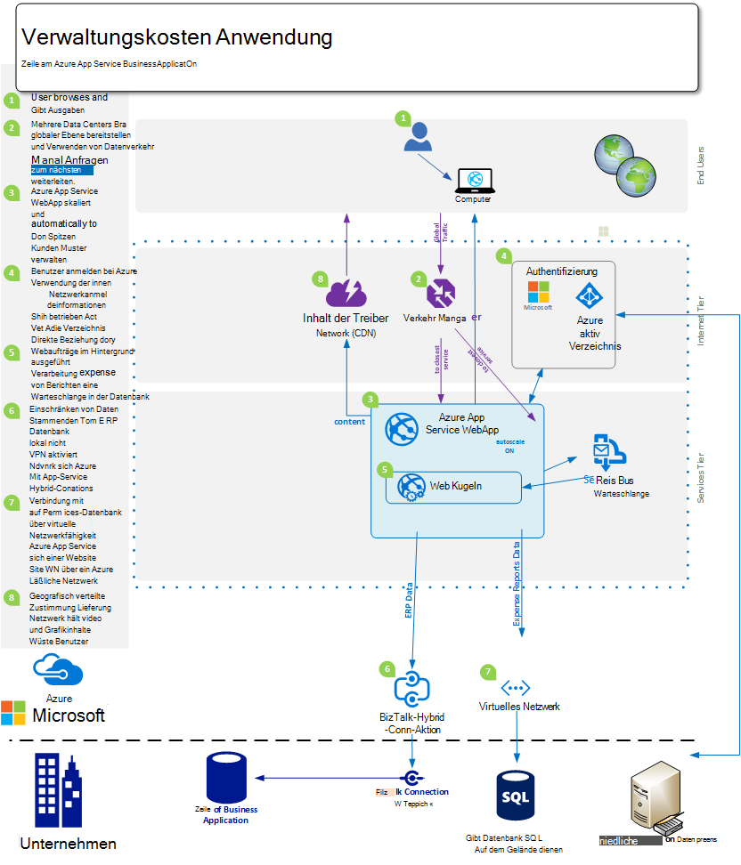
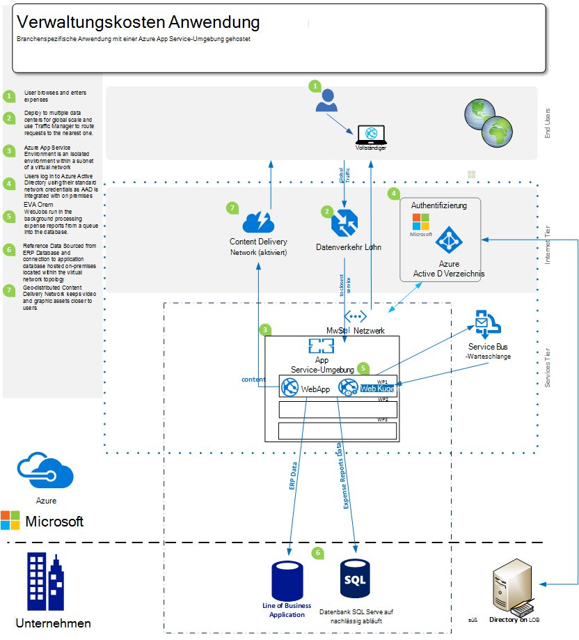
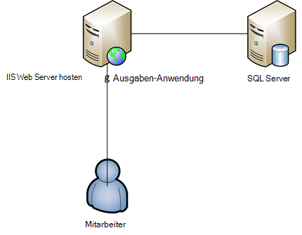

<properties 
    pageTitle="Azure App Web Apps Serviceangebote für Unternehmen" 
    description="Veranschaulicht, wie Azure App Service Web Apps Enterprise Solutions Website für Ihr Unternehmen erstellen" 
    services="app-service\web" 
    documentationCenter="" 
    authors="apwestgarth" 
    manager="wpickett" 
    editor=""/>

<tags 
    ms.service="app-service-web" 
    ms.workload="web" 
    ms.tgt_pltfrm="na" 
    ms.devlang="na" 
    ms.topic="article" 
    ms.date="07/29/2016" 
    ms.author="anwestg"/>

# Azure App Web Apps Serviceangebote für Enterprise-Whitepaper #

Kostensenkung und Lösungen IT schneller in einem sich rasch entwickelnden Umgebung müssen Herausforderung neue für Entwickler, IT-Experten und Manager. Benutzer suchen immer ihre Position des Business (LOB) ASP.NET-Webanwendungen schnell reagieren und jederzeit verfügbar sein. Zur gleichen Zeit kann Unternehmen erhöhte Produktivität und Effizienz aus Integration mit Cloud und mobile Dienste nutzen möchten, dies etwas so einfaches wie einmaliges Anmelden auf Geräten mit Active Directory Zusammenarbeit in Office365 von Daten aus einer internen LOB-Anwendung wiederum Daten aus der Implementierung von Salesforce Unternehmen zieht. [Azure App Service Web Apps](http://go.microsoft.com/fwlink/?LinkId=529714) ist ein Unternehmen Cloud-Dienst zum Entwickeln, testen und Ausführen von Web und mobile Applications, Web-APIs und generische Websites. Hiermit können Unternehmenswebsites, Intranetsites, Business-apps und digitale Marketingkampagnen auf ein globales Netzwerk von Rechenzentren optimiert für Skalierung und Verfügbarkeit sowie Unterstützung für fortlaufende Integration ausgeführt und modernen DevOps Vorgehensweisen.  

Dieses White Paper zeigt die Funktionen von [Web Apps](/services/app-service/web/) Service speziell auf LOB Web Applications für Migration der vorhandenen ASP.NET-Webanwendungen und Bereitstellung neuer LOB ASP.NET-Webanwendungen auf der Plattform. 

## Zielgruppe ##

IT-Experten, Architekten und Manager wollen Arbeitslasten Web Cloud migrieren, die zurzeit lokal ausgeführt werden. Web-Arbeitslasten können Unternehmen Mitarbeiter oder Partner ASP.NET-Webanwendungen Unternehmen erstrecken.

## Einführung ##

App Service Web Apps ist eine ideale Plattform für externe und interne ASP.NET-Webanwendungen und Dienste hosten bietet eine kostengünstige, hoch skalierbare, verwaltete Lösung Sie auf geschäftlicher Nutzen für Benutzer anstatt viel Zeit und Geld Wartung und Support Umgebung getrennt. Web Apps bietet eine flexible Plattform für die Bereitstellung unterstützen Unternehmen einer Anwendung bietet die Möglichkeit, lokale Active Directory Integration mit Microsoft Azure Active Directory authentifizieren einfach und schnell Installationen machen verwenden Ihre internen fortlaufende Integration und Bereitstellung Praktiken bei Bedarf - auf eine verwaltete Plattform wachsen, die auf die Anwendung und nicht der Infrastruktur ermöglicht automatische Skalierung. 

## Problemstellung ##

Die IT-Landschaft schnell ändern, Weg von hosting auf herkömmlichen Servern mit ihrer hohen Kosten auf lange Vorlaufzeiten, die bei Bedarf automatisch skalieren Last Dienste nutzen. IT-Abteilung sind gefordert, die Kosten zu senken und Platzbedarf der Infrastruktur und Wartung verbringen mit Schwerpunkt Reduzierung CAPEX und Flexibilität. Ende der Lebensdauer eines älteren Infrastrukturplattformen wie Windows Server 2003 führt die IT-Abteilung Cloud Migration eine Möglichkeit neue langfristige Kapitalkosten zu überprüfen. In der Vergangenheit würde CIOs Einkauf Dienststellen entscheiden; Allerdings sind CMOs und andere Business Unit zunehmend aktiver Verwendung ihr Budget und ihre Rendite. Unternehmen benötigen immer ihre Mitarbeiter arbeiten, mehr Zeit mit Kunden Zugriff auf Systeme problemlos Mitarbeiter viel mobiler als je zuvor sein.

Business Bedarf monatlich, wöchentlich, täglich. Unternehmen suchen nach instant weltweit mit regelmäßig aktualisierten viele neue Funktionen, Dritter oder intern.  In manchen Fällen Unternehmen suchen die Funktionen ihrer Anwendung isolieren und den Zugriff auf Ressourcen und auch öffentliche Cloud nutzen. Benutzer haben höhere Ansprüche mit vielen die Dienste im eigenen privaten wie Office365. Sie erwarten, Zugriff auf umfassende vergleichbar, aktuell, Funktion ihre Arbeit Leben. Diese Forderung zu IT muss Aussehen für den Geschäftsablauf zu Auswahl und Integration mit Drittanbieter-Dienste, Auswahl von Plattformen, die auf den geschäftlichen Bedarf anpassen können, und auch eine geringere Gesamtbetriebskosten zuverlässig.

Entwicklungsteams suchen sofortige Geschäftsvorteil mit neuen Funktionen regelmäßig übermitteln. Sie suchen eine kostengünstige und zuverlässige Plattform, die Integration in ihre vorhandenen Tools und Praktiken, Entwicklung, Prüfung, freigeben. und mit der IT-Abteilung automatisiert die Bereitstellung, Verwaltung und Benachrichtigung mit Ziel Ausfallzeiten.

<a href="highlevel" />
## Hohe Lösung ##

Webplattformen und Frameworks werden vermehrt entwickeln, testen und Hosten von Geschäftsanwendungen.  Mit einer normalen Business-Anwendung wie eine interne Mitarbeiter Kosten bestehen häufig ausschließlich Web-app mit einer Sicherung zum Speichern der Daten mit der Anwendung verbunden.

App Service Web Apps ist eine gute Option zum Hosten von Anträgen bietet eine skalierbare und zuverlässige Infrastruktur verwaltet und mit NULL manuelle Eingriffe und Ausfallzeiten gepatcht. Microsoft Azure-Plattform bietet viele Daten Storage-Optionen zur Unterstützung von ASP.NET-Webanwendungen auf Web Apps von Microsoft Azure SQL-Datenbank eine verwaltete skalierbare relationale Datenbank-als-a-Service, beliebte Dienste unserer Partner MongoDB wie ClearDB MySQL-Datenbank gehostet.

Eine alternative Lösung besteht darin, Ihre vorhandenen Investitionen in Räumen verwenden. In diesem Beispielszenario ein Mitarbeiter Kosten System können Sie Ihren Datenspeicher innerhalb Ihrer eigenen internen Infrastruktur verwalten. Dies könnte für die Integration mit internen Systemen (reporting Lohn, Abrechnung usw.) oder eine IT-Governance-Anforderung zu erfüllen.  Web Apps bietet eine Reihe von Methoden zur Aktivierung Verbindung mit Ihr auf lokale Infrastruktur:

- [App Service-Umgebungen](app-service-app-service-environment-intro.md) - App Service-Umgebung (ASE) sind eine neue Premium Serviceangebot von Microsoft Azure App zuletzt hinzugefügt wurde.  Asen bieten eine vollständig isolierte und dedizierte Umgebung zum Ausführen von Azure App Service apps sicher auf hoher Ebene gleichzeitig Isolierung und sicheren Netzwerkzugriff   
- [Hybrid-Verbindungen](../biztalk-services/integration-hybrid-connection-overview.md) Hybrid sind ein Feature von Microsoft Azure BizTalk Services und Web Apps auf lokale Ressourcen sicher Verbindung z. B. SQL Server, MySQL, Web-APIs und benutzerdefinierte Webdienste aktivieren. 
- [Virtuelle Vernetzung](https://azure.microsoft.com/blog/2014/09/15/azure-websites-virtual-network-integration/) – Integration in Azure Virtual Network Web Apps können Sie Ihrer Anwendung ein virtuelles Azure-Netzwerk herstellen, die wiederum die auf lokale Infrastruktur über ein Standort-zu-Standort-VPN verbunden werden können. 

Die folgenden Diagramme zeigen eine Beispiel-Lösung mit Konnektivitätsoptionen für lokale Ressourcen.  Das erste Beispiel zeigt, wie kann dies mit Standardfunktionen von Azure App Service und die zweite zeigt, wie dies mit der Premium-Angebot App Service-Umgebungen erreicht.

Verwenden Standard App Servicefunktionen:

Verwenden einer App Service-Umgebung:

## Geschäftliche Vorteile ##

App Service Web Apps bietet zahlreiche Vorteile die Funktion kostengünstiger und bei Bedarf Business agile ermöglicht. 

### PaaS-Modell ###

App Service Web Apps basiert auf einer Plattform als ein bietet eine Reihe von Kosten und Effizienz.  Mehr müssen Sie stundenlang VMs verwalten, patching Betriebssysteme und Frameworks. Web Apps wird automatisch gepatcht Umgebung verwalten Ihre ASP.NET-Webanwendungen und keine VMs Teams frei Vorteile für das Unternehmen verlassen kann.

Web Apps für PaaS-Modell ermöglicht Praktiker DevOps Methode, ihre Ziele zu erreichen. Als Unternehmen bedeutet dies umfassende Verwaltung und Integration im gesamten Anwendungslebenszyklus, einschließlich Entwicklung, Tests, Version, Überwachung und Management und Support. 

Entwicklungsteams kontinuierliche Integration und Bereitstellung Workflows konfigurierbar von Visual Studio Team Services, GitHub, TeamCity, Hudson oder BitBucket automatisierten Build-, Test- und ermöglicht schnellere Version Zyklen gleichzeitig Reduzierung der Reibung Infrastruktur Freigabe aktivieren. Web Apps unterstützt auch die Erstellung mehrere Test- und Stagingumgebungen für den Release-Workflow mehr müssen Sie reservieren oder Hardware für diese Zwecke zuweisen, können beliebig vieler und Beförderung zum Freigeben von Workflow definieren. Als Unternehmen entscheiden kann, in einen Steckplatz Test vom Datenquellen-Steuerelement, müssen Sie eine Reihe von Tests und bei Stufe Steckplatz fördern und schließlich zur Produktion ohne Ausfallzeiten mit dem zusätzlichen Vorteil, den Web-Applikationen auf Web Apps geladen werden und die bestmögliche Kundenzufriedenheit zu hot swap.  Darüber hinaus können Unternehmen nutzen Testen in der Produktion von App Service Web Apps, direkter Teil Datenverkehr in einen anderen Steckplatz überprüfen die Änderungen vor allen Datenverkehr in die neue Bereitstellung wechseln oder Wiederherstellen der vorherigen Bereitstellung den gesamten. 

Betriebsteams können sicher, sind in die optimale Position reagieren auf Probleme mit ihrer Anwendung Web auf Web Apps mit der Überwachung und Alarme. Betriebsteams sollte Analytics und diese von Microsoft Visual Studio Application Insights und neue Relikt AppDynamics monitoring Lösungen bereits investiert haben. Diese werden auch auf die Kontinuität und eine vertraute Umgebung, einer Anwendung überwachen Web Apps unterstützt.

Schließlich ermöglicht die automatische Sicherung Ihre Apps Web Apps und gehostete Datenbanken direkt zu einem Container Azure BLOB-Speicher. Stellt eine einfache und sehr kostengünstige Methode, Wiederherstellung nach Ausfall reduzieren auf lokale Hardware und Software.

### Einfache Migration ###

Hardware-Wartung und Rotation ist ein wichtiges Problem für Unternehmen wie Versionszyklen für Hardware und Betriebssysteme beschleunigen. Haben Sie mehrere Windows Server 2003 R2-Server das Ende des Supports 2015, aber hosten sie weiterhin für Ihr Unternehmen wichtigsten ASP.NET-Webanwendungen? App Service Web Apps ist hervorragend, die ASP.NET-Webanwendungen hosten und Business Hardware Platz rationalisieren. Web Apps erhalten Sie Zugriff auf zahlreiche Hardwarespezifikationen verwaltet und als Teil des Dienstes überflüssig Ersatz und Verwaltungskosten als Teil der Infrastruktur berücksichtigt werden.  Migration kann einfach eine Kopie und Einfügen aus der vorhandenen Bereitstellung Web Apps oder komplexere Migration wird mit Web Apps Migration Assistant Wert einfügen. Migrierte ASP.NET-Webanwendungen genießen Sie das gesamte Spektrum der Azure-Dienste zusätzliche Dienste auf die Web-Anwendung integrieren. Sie können beispielsweise Azure Active Directory zum Steuern des Zugriffs auf Ihre Anwendung Verband Sicherheitsgruppen hinzufügen. Ein weiteres Beispiel kann Cache-Services verbessern und Latenz die Benutzerfunktionalität insgesamt besser hinzufügen. 

### Hosten von Enterprise-Klasse ###

App Service Web Apps bietet eine stabile und zuverlässige Plattform, die zu einer Vielzahl von Unternehmen aus kleinen internen Entwicklungs- und Arbeitslasten hochgradig skalierte hohem Datenverkehr Websites muss bewährt hat. Mithilfe von Web Apps Nutzung Sie der gleichen Klasse hosting Unternehmensplattform, die Microsoft als ein Unternehmen für hochwertigen Web Arbeitslasten verwendet. Web Apps und alle Dienste auf der Azure-Plattform basieren Sicherheit und Einhaltung behördlicher Auflagen wie ISO (ISO/IEC 27001:2005); SOC1 und SOC2 SSAE 16-ISAE 3402 Datenschutzpolitik, HIPAA BAA PCI und Fedramp das Herzstück jedes Element und die Funktion für Weitere Informationen siehe [http://aka.ms/azurecompliance](/support/trust-center/compliance/). 

Microsoft Azure-Plattform ermöglicht Rolle basierte Autorisierung Organisationsebene des Steuerelements Ressourcen im Web Apps aktivieren. RBAC bietet Unternehmen die Möglichkeit, eigene Management-Richtlinien für alle ihre Anlagen in der Azure-Umgebung implementieren, Zuweisen von Benutzern zu Gruppen und diesen Gruppen gegen die Ressource wie Web app wiederum die erforderlichen Berechtigungen zuweisen. Weitere Informationen zu RBAC in Azure finden Sie unter [http://aka.ms/azurerbac](../active-directory/role-based-access-control-configure.md). Mithilfe von Web Apps können Sie einer Anwendung werden in einer sicheren Umgebung bereitgestellt und vollständige Kontrolle der Hoheitsgebiet Ihrer Ressourcen bereitgestellt werden sicher sein. 

Azure App Service-Umgebungen [http://aka.ms/aseintro](http://aka.ms/aseintro) sind neue Premium Service Plan Option für Unternehmenskunden von Azure App Service nutzen möchten und diese vollständig isolierte und dedizierte Umgebung bieten.  Dies ermöglicht Unternehmenskunden Programme bereitstellen, die sehr hoher Größenvorteile nutzen können und auch vollständige Kontrolle über ein- und ausgehenden Netzwerkverkehr und Asen aktivieren Applikationen Hochgeschwindigkeits Verbindung über virtuelle Netzwerke auf lokale Ressourcen besitzen.

App Service webapps können auch Kapitalanlagen auf Räume nutzen bieten die Möglichkeit, Ihre internen Ressourcen wie Datawarehouse oder SharePoint-Umgebung verbinden. Wie [Hohe](#highlevel) Lösung können Sie Hybrid-Verbindungen und virtuelle Netzwerkkonnektivität Verbindungen zu lokalen Infrastruktur und Dienste verwenden.

### Weltweit ###

App Service Web-Apps ist eine globale und skalierbare Plattform ermöglicht einer Anwendung zu schnell und mit minimalem langfristige Planung Kosten zu ein wachsendes Unternehmen anpassen. In normalen lokale Infrastruktur Szenarien Erweiterung Nachfrage lokal und geografisch würde viel Verwaltung, Planung und Bereitstellung Ausgaben und zusätzlichen Infrastruktur verwalten. Web Apps bietet die Fähigkeit einer Anwendung mit dem auf und Ihre Bedürfnisse. Beispielsweise der Anwendung Ausgaben beispielsweise für den Monat die meisten Benutzer nutzen Licht der Anwendung als Frist jeden Monat Ausgaben Übermittlungen eingegeben werden kann und Nutzung erhöht sich auf die Anwendung, Web Apps kann automatisch Infrastruktur für Ihre Anwendung bereitgestellt und dann nach die Verwendung Abklingen erneut es an die geplante Infrastruktur definieren.

Web Apps ist in 24 Rechenzentren weltweit und wachsenden global verfügbar. Aktualisierte Liste der Regionen und Speicherort finden Sie unter [http://aka.ms/azlocations](http://aka.ms/azlocations). Mit Web-Apps erreichen Ihr Unternehmen leicht weltweit und Skalierung. Wachsende Unternehmen in neue Regionen, die reporting Anwendung Dashboards, die Sie verwenden und Host Web Apps können problemlos in zusätzliche Rechenzentren bereitgestellt und lokale Benutzer wesentlich mehr über die Kombination von Web Apps und Azure Traffic Manager mit den Vorteil der skalierbaren Infrastruktur unter können zu Vertrag Bedarf Filialen ändern.
 
## Einzelheiten der Lösung ##

Betrachten wir ein Beispiel für ein Migrationsszenario Anwendung. Beschreibt die Details wie App Service Web Apps Features zusammen Lösung und geschäftlichen Nutzen.
 
In diesem Beispiel ist branchenspezifische Anwendung, die wir erörtern eine Mitarbeiter ihre Ausgaben für die Rückerstattung senden ermöglicht. Die Anwendung auf eine Windows Server 2003 R2 ausführen IIS6 gehostet wird und die Datenbank ist SQL Server 2005-Datenbank. Der Grund wählen wir ältere Server liegt der kommenden Ende der Dienst für Windows Server 2003 R2 und SQL Server 2005 und [Tools](http://aka.ms/websitesmigration) und [Leitfäden](http://aka.ms/websitesmigrationresources) Arbeitslasten in Azure automatisch migriert haben. Insofern in diesem Beispiel verwendete Muster gelten für eine Breite Wahrheit Migrationsszenarien. 

### Migrieren Sie vorhandene Anwendung ###

Schritt 1 der gesamten Lösung für eine LOB Anwendung Web Apps verschieben wird die vorhandene Anwendungsressourcen und Architektur. Das Beispiel in diesem Artikel wird ein ASP.NET Web-Anwendung auf einem IIS-Server mit der Datenbank auf einem separaten SQL Server gehostet, wie in der folgenden Abbildung dargestellt. Mitarbeiter-Anmeldung an das System mit einer Kombination aus Benutzername und Kennwort sie eingeben von Ausgaben und Datenbank für jede Ausgabe gescannte Kopien von Zugängen hochladen. 
 

#### Aspekte ####

Wenn Migration Anwendung aus einer lokalen Umgebung empfiehlt, einige Web Apps Einschränkungen Bedenken. Hier sind einige wichtigen Themen zu Migration ASP.NET-Webanwendungen Web Apps ([http://aka.ms/websitesmigrationresources](http://aka.ms/websitesmigrationresources)):

-   Portbindungen – unterstützt Web Apps nur Port 80 für HTTP und 443 für HTTPS-Datenverkehr. Wenn Ihre Anwendung einen anderen Anschluss verwendet, einmal migriert machen die Anwendung von Port 80 für HTTP und port 443 für HTTPS-Datenverkehr. Dies ist häufig harmlose Frage wie in lokale Bereitstellung zu verwenden verschiedene Ports, um die Verwendung von Domänennamen, besonders in Entwicklung und Test
-   Authentifizierung – unterstützt Web Apps anonyme Authentifizierung und Formularauthentifizierung durch eine Anwendung identifiziert. Web Apps bieten Windows-Authentifizierung, wenn die Anwendung nur ADFS mit Azure Active Directory integriert ist. Dies ist ausführlich ist [hier](http://aka.ms/azurebizapp) 
-   GAC Assemblys basiert – Web Apps erlaubt nicht die Bereitstellung von Assemblys zum globalen Assemblycache (GAC). Daher Wenn migriert die Anwendung verwendet dieses feature für lokale, sollten Sie die Assemblys in den Ordner Bin der Anwendung.
-   IIS5-Kompatibilitätsmodus-Web Apps unterstützt keine IIS5-Kompatibilitätsmodus und so jeweils Web Apps und alle ASP.NET-Webanwendungen unter der übergeordneten Web Apps Instanz im gleichen Arbeitsprozess in einen einzelnen Anwendungspool ausgeführt.
-   Verwenden von COM-Bibliotheken – Web Apps erlaubt nicht die Registrierung von COM-Komponenten der Plattform. Daher Wenn die Anwendung COM-Komponenten verwenden, diese müssen in verwaltetem Code geschrieben werden und mit der Anwendung bereitgestellt.
-   ISAPI-Filter-ISAPI-Filter können Web Apps unterstützt. Sie müssen als Teil der Anwendung bereitgestellt werden und in der Datei web.config der Anwendung registriert. Weitere Informationen finden Sie unter [http://aka.ms/azurewebsitesxdt](web-sites-transform-extend.md). 

Sobald diese Themen berücksichtigt sollte die Webanwendung für die Cloud bereit. Und wenn einige Themen nicht erfüllt werden, geben das Migrationsprogramm Bestes Migration. 

Die nächsten Schritte im Migrationsprozess sind, eine App Service Web app und einer Azure SQL-Datenbank erstellen. Gibt es mehrere Instanzen Web Apps mit einer unterschiedlichen Anzahl von CPU-Kernen und RAM-Mengen zur Auswahl basierend auf Ihrem Web Applications. Für Weitere Informationen und Preise finden Sie unter [http://aka.ms/azurewebsitesskus](/pricing/details/websites/). Ebenso bietet Microsoft Azure SQL-Datenbank alle ein Unternehmen müssen verschiedene Dienstebenen und Performance erfüllen. Weitere Informationen finden unter [http://aka.ms/azuresqldbskus](/pricing/details/sql-database/). Nach dem Erstellen die Anwendung App Service Web Apps über FTP oder WebDeploy hochgeladen und Verschieben der Datenbank.

Diese Migration verwendet die Lösung Azure SQL-Datenbank, aber das ist nicht die einzige Datenbank, die in Azure unterstützt wird. Unternehmen können auch Verwendung von MySQL MongoDB, Azure DocumentDB und vieles mehr über Add-ons [Azure-Speicher](/marketplace/partner-program/)erworben werden können. 

Beim Erstellen einer Azure SQL-Datenbank stehen eine Reihe von Optionen von einem lokalen Server von Skript zu einer vorhandenen Datenbank auf [Datenebene Anwendung exportieren und importieren](http://aka.ms/dacpac)mit eine vorhandene Datenbank importieren. 

Die Anwendungsdatenbank Ausgaben durch Erstellen einer neuen Azure SQL-Datenbank erstellt wurde, Verbinden mit der Datenbank SQL Server Management Studio verwenden und Ausführen eines Skripts, das Datenbankschema erstellen und füllen sie mit Daten aus der lokalen Datenbank.

Der letzte Schritt in dieser ersten Phase der Migration erfordert die Aktualisierung der Verbindungszeichenfolgen für die Datenbank für die Anwendung. Dies ist der Azure-Portal lässt. Ändern Sie für jede Web-app Anwendungseinstellungen einschließlich alle Verbindungszeichenfolgen wird von der Anwendung verwendete Datenbank herstellen.

### Alternativen zur Verwendung von Azure SQL-Datenbank ###

Die Azure-Plattform bietet eine Reihe von Alternativen zur Verwendung von Azure SQL-Datenbank als primäre Datenbank Web Applications, z. B. unterschiedliche Arbeitslasten aktivieren Verwenden einer NoSQL-Lösung oder die Plattform ein Unternehmen Daten nach Bedarf. Beispielsweise ein Unternehmen möglicherweise Daten enthalten, die nicht gespeichert Offsite oder einer öffentlichen Cloud-Umgebung und daher um die Verwendung der lokalen Datenbank sieht.

#### Verbindung mit lokalen Ressourcen ####
App Service Web Apps bietet mehrere Optionen für die Verbindung mit lokalen Ressourcen wie Datenbanken, Wiederverwendung von hochwertigen Infrastruktur. Die Optionen lauten wie folgt:

- App Service-Umgebung isoliert und erstellt ein Subnetz des virtuellen Netzwerks damit Umgebung Kommunikation mit privaten Endpunkte innerhalb der gleichen virtuellen Netzwerk - [http://aka.ms/appserviceasenetworking](http://aka.ms/appserviceasenetworking)
- Web Apps virtuelle Netzwerkintegration unterstützt die Integration zwischen Web Apps und ein Azure virtuellen Netzwerk, Zugriff auf Ressourcen in Ihrem virtuellen Netzwerk an lokalen Netzwerkes auf Standort-zu-Standort-VPN Verbindung direkt zu Ihrem auf lokalen Systemen ermöglicht.
- Hybride sind ein Feature von Azure BizTalk Services und bieten eine einfache Möglichkeit, einzelne Verbindung mit Ressourcen wie SQL Server, MySQL, HTTP-Web-APIs und die benutzerdefinierte Webdienste lokal.

#### Skalierung und Stabilität ####

Wächst ein Unternehmen Belegschaft über Erwerb oder natürliche Wachstum so zu müssen web Applications Skalierung Anforderungen entsprechen. Heute ist es üblich, eine noch größere Verbreitung der zusammengestellten Teams und Mitarbeiter, z. B. Unternehmen mit Sitz in den USA, Europa und Asien, mit mobile Sales geltenden viele weitere Gebiete. Web Apps kann elastische geänderten Skalierung bequem und automatisch behandelt.

App Service Web Apps kann ASP.NET-Webanwendungen skaliert automatisch über Azure-Portal je nach zwei Vektoren – geplante Zeiten oder CPU-Verwendung konfiguriert werden. Web Apps AutoSkalieren ermöglicht kostengünstig und flexibel für größere Änderungen in Verwendung für alle Business Applications Web Applications wie unsere Kosten reporting-System in der marketing-Websites, die kurzzeitig Förderung hoher Burst Datenverkehr auftreten. Weitere Informationen und Hinweise zur Skalierung einer Anwendung mit Web-Apps finden Sie unter [Skalierung Websites](web-sites-scale.md).

Neben der Skalierung Flexibilität Web Apps kann allgemeine Plattform Business Continuity und Flexibilität durch die Verteilung der ASP.NET-Webanwendungen und ihre Ressourcen über mehrere Rechenzentren und Regionen.

## Zusammenfassung ##
App Service Web Apps bietet eine flexible, kostengünstige und reaktionsfähige Lösung zu dynamischen eines schnell wachsenden Umgebung. Web Apps hilft Unternehmen Produktivität und Effizienz mit einer verwalteten Plattform mit modernen DevOps Funktionen und reduzierte Hände auf gleichzeitig Unternehmensfunktionen, Stabilität, Sicherheit und Integration mit lokalen Ressourcen verwenden.

## Aktionsplan ##
Weitere Informationen zu Service Azure App Service Web Apps, besuchen Sie [http://aka.ms/enterprisewebsites](/services/websites/enterprise/) , in dem Weitere Informationen bezogen werden kann, und Zeichen für eine Testversion noch heute unter [http://aka.ms/azuretrial](/pricing/free-trial/) zu dem Dienst Vorteile für Ihr Unternehmen.

[AZURE.INCLUDE [app-service-web-whats-changed](../../includes/app-service-web-whats-changed.md)]

[AZURE.INCLUDE [app-service-web-try-app-service](../../includes/app-service-web-try-app-service.md)]
 
 
