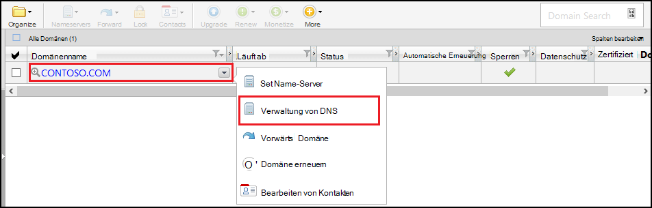
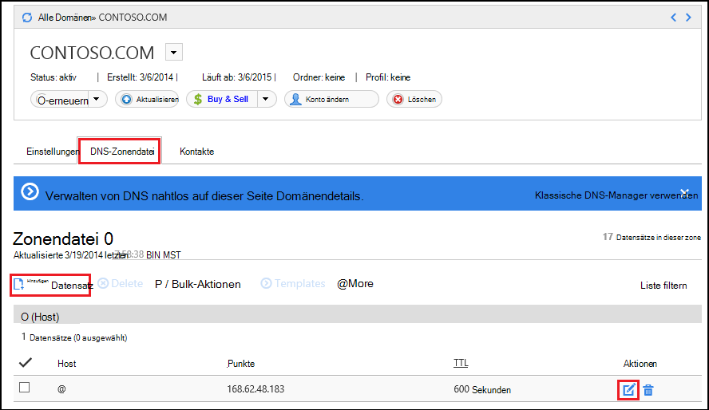
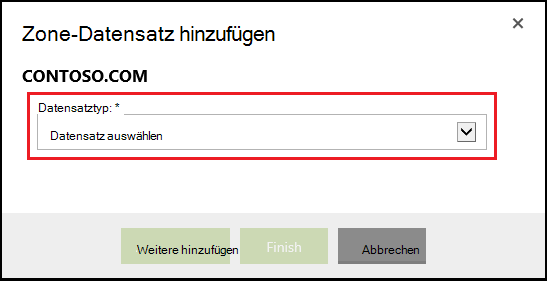
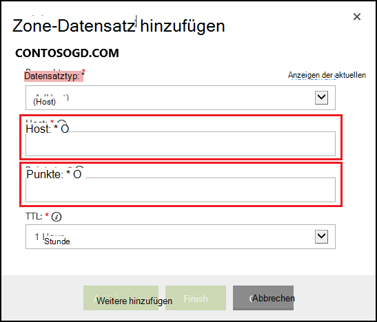

<properties
    pageTitle="Konfigurieren Sie einen benutzerdefinierten Domänennamen in Azure App Service (GoDaddy)"
    description="Erfahren Sie, wie ein Domänenname von GoDaddy mit Azure Web Apps"
    services="app-service"
    documentationCenter=""
    authors="erikre"
    manager="wpickett"
    editor="jimbe"/>

<tags
    ms.service="app-service"
    ms.workload="na"
    ms.tgt_pltfrm="na"
    ms.devlang="na"
    ms.topic="article"
    ms.date="01/12/2016"
    ms.author="cephalin"/>

# Konfigurieren Sie einen benutzerdefinierten Domänennamen in Azure App Service (gekaufte direkt GoDaddy)

[AZURE.INCLUDE [web-selector](../../includes/websites-custom-domain-selector.md)]

[AZURE.INCLUDE [intro](../../includes/custom-dns-web-site-intro.md)]

Wenn Sie Domäne über Azure App Service Web Apps erworben haben finden Sie zum letzten Schritt der [Domäne für Web Apps kaufen](custom-dns-web-site-buydomains-web-app.md).

Dieser Artikel beschreibt einen [GoDaddy](https://godaddy.com) [App Service Web](http://go.microsoft.com/fwlink/?LinkId=529714)Apps gekauft benutzerdefinierten Domänennamen verwenden.

[AZURE.INCLUDE [introfooter](../../includes/custom-dns-web-site-intro-notes.md)]

##Grundlegendes zu DNS-Datensätze

[AZURE.INCLUDE [understandingdns](../../includes/custom-dns-web-site-understanding-dns-raw.md)]

## Einen DNS-Eintrag für Ihre benutzerdefinierte Domain hinzufügen

Um ein Web app in App Service Ihre benutzerdefinierte Domain zuzuordnen, müssen Sie einen neuen Eintrag in der DNS-Tabelle für Ihre benutzerdefinierte Domain hinzufügen mit Tools von GoDaddy. Gehen Sie zu DNS-Tools für GoDaddy.com

1. Melden Sie sich bei Ihrem Konto mit GoDaddy.com, und wählen Sie **Mein Konto** und **Meine Domains verwalten**. Wählen Sie abschließend im Dropdownmenü für den Domänennamen, den Sie mit Ihrer Azure Anwendung und wählen **DNS verwalten**möchten.

    

2. Seite **Domänendetails** Bildlauf auf der Registerkarte **DNS-Zone** . Dies ist der Abschnitt zum Hinzufügen und Ändern von DNS-Einträgen für den Domänennamen.

    

    Wählen Sie **Neuer Datensatz** einen vorhandenen Datensatz hinzufügen.

    Wählen Sie zum **Bearbeiten** eines vorhandenen Datensatzes Stift und Papier Symbol neben dem Datensatz.

    > [AZURE.NOTE] Beachten Sie vor dem Hinzufügen neuer Datensätze GoDaddy DNS-Einträge für beliebte Unterdomänen ( **Host** -Editor genannt) wie **e-Mail**, **Dateien**und **Nachrichten**bereits erstellt hat. Wenn der Namen bereits vorhanden ist, Ändern des vorhandenen Datensatzes anstatt eine neue zu erstellen.

4. Wenn Sie einen Datensatz hinzufügen, müssen Sie zunächst den Datensatztyp auswählen.

    

    Als Nächstes geben Sie den **Host** (benutzerdefinierte Domäne oder Unterdomäne) und **Punkte**.

    

    * Wenn ein **Eintrag A (Host)** - hinzufügen muss das **Host** -Feld entweder festgelegt **@** (steht Stammdomänennamen z. B. **contoso.com**) *(Platzhalter für mehrere Unterdomänen entsprechen) oder die Unterdomäne verwenden möchten (z. B. * *Www**.) Festlegen muss die * *Punkte** Feld die IP-Adresse Ihrer Azure Anwendung.

    * Beim Hinzufügen eines **CNAME-Eintrag (Alias)** - müssen Sie das **Host** -Feld der Unterdomäne festlegen verwenden möchten. Zum Beispiel **Www**. Legen Sie das **Punkte** -Feld auf der **. *.azurewebsites.NET** Domänennamen Ihrer Azure Web App. Beispielsweise **contoso.azurewebsites.net**.

5. Klicken Sie auf **Weitere hinzufügen**.
6. **TXT** als Datensatztyp auswählen und angeben **Host** **@** und den Wert **auf** ** &lt;Yourwebappname&gt;. *.azurewebsites.NET**.

    > [AZURE.NOTE] TXT-Eintrag wird von Azure zum Überprüfen, den Bereich anhand der A-Datensatz oder dem ersten TXT-Datensatz besitzen. Nachdem die Domäne Web app im Azure-Portal zugeordnet wurde, kann dieser TXT-Datensatzeintrag entfernt.

5. Wenn hinzugefügt haben oder Datensätzen ändern, klicken Sie auf **Fertig stellen** , speichern.

## Aktivieren Sie den Domänennamen Ihrer Anwendung

[AZURE.INCLUDE [modes](../../includes/custom-dns-web-site-enable-on-web-site.md)]

>[AZURE.NOTE] Wenn Sie mit Azure App Service beginnen, bevor Sie sich für ein Azure-Konto, gehen Sie [Versuchen App Service](http://go.microsoft.com/fwlink/?LinkId=523751)sofort eine kurzlebige Starter Web app in App Service können Sie erstellen. Keine Kreditkarten erforderlich; keine Zusagen.

## Was hat sich geändert
* Eine Anleitung zur Änderung von Websites zu App Service finden Sie unter: [Azure App Service und seine Auswirkung auf vorhandene Azure Services](http://go.microsoft.com/fwlink/?LinkId=529714)
