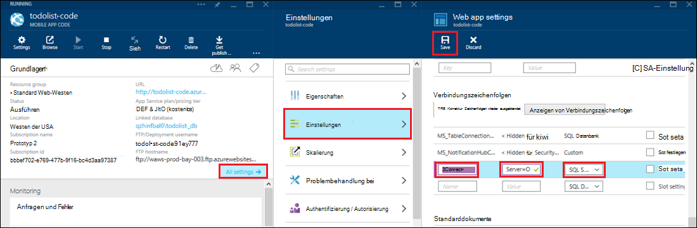

<properties 
    pageTitle="Zugriff auf lokale Ressourcen mit hybridverbindungen in Azure App Service" 
    description="Erstellen einer Verbindung zwischen einem Web app in Azure App Service und eine lokale Ressource, die einen statischen TCP-Port verwendet" 
    services="app-service" 
    documentationCenter="" 
    authors="cephalin" 
    manager="wpickett" 
    editor="mollybos"/>

<tags 
    ms.service="app-service" 
    ms.workload="na" 
    ms.tgt_pltfrm="na" 
    ms.devlang="na" 
    ms.topic="article" 
    ms.date="02/03/2016" 
    ms.author="cephalin"/>

#Zugriff auf lokale Ressourcen mit hybridverbindungen in Azure App Service

Eine Azure App Service-app möglich für lokale Ressourcen, die einen statischen TCP-Port wie SQL Server, MySQL, HTTP-Web-APIs und die meisten benutzerdefinierte Webdienste verwendet. Dieser Artikel beschreibt, wie eine hybridverbindung zwischen App Service und einer lokalen SQL Server-Datenbank erstellen.

> [AZURE.NOTE] Web Apps Teil Hybridverbindungen Feature steht nur in der [Azure-Portal](https://portal.azure.com). Zum Erstellen einer Verbindung im BizTalk-Dienste finden Sie unter [Hybridverbindungen](http://go.microsoft.com/fwlink/p/?LinkID=397274). 
> 
> Dieser Inhalt gilt auch für Mobile Apps in Azure App Service. 

## Erforderliche Komponenten
- Ein Azure-Abonnement. Ein kostenloses Abonnement finden Sie unter [Azure-Testversion](https://azure.microsoft.com/pricing/free-trial/). 
 
    Wenn Sie mit Azure App Service beginnen, bevor Sie sich für ein Azure-Konto, gehen Sie [Versuchen App Service](http://go.microsoft.com/fwlink/?LinkId=523751)sofort eine kurzlebige Starter Web app in App Service können Sie erstellen. Keine Kreditkarten erforderlich; keine Zusagen.

- Um eine lokale SQL Server oder SQL Server Express-Datenbank mit einer hybridverbindung verwenden, muss TCP/IP auf einen statischen Port aktiviert werden. Unter Verwendung einer Standardinstanz auf SQL Server wird empfohlen, da statischer Port 1433 verwendet. Informationen zum Installieren und Konfigurieren von SQL Server Express für die Verwendung mit Hybrid finden Sie unter [mit einer lokalen SQL Server Azure Website Hybrid-Verbindungen verwenden](http://go.microsoft.com/fwlink/?LinkID=397979).

- Der Computer, auf dem lokalen Hybrid Connection Manager des Agents beschrieben in diesem Artikel Installation:

    - Verbindung mit Azure über Port 5671 muss
    - Muss zu der *Hostname*:*Portnummer* der lokalen Ressource. 

> [AZURE.NOTE] Die Schritte in diesem Artikel wird davon ausgegangen, dass Sie den Browser auf dem Computer verwenden, die lokalen Hybrid Verbindungsagent hosten.

## Erstellen einer Webanwendung in Azure-Portal ##

> [AZURE.NOTE] Wenn Sie bereits ein WebApp oder Backend-Mobile-Anwendung in Azure-Portal, die Sie für dieses Lernprogramm verwenden möchten erstellt haben, können Sie überspringen [einer Hybrid-Verbindung](#CreateHC) und eines BizTalk-Dienstes zu beginnen.

1. Klicken Sie oben links im [Azure-Portal](https://portal.azure.com) **neu** > **Web + Mobile** > **Web App**.
    
    ![Neue Web app][NewWebsite]
    
2. Bereitstellen Sie auf dem Blatt **WebApp** URL, und klicken Sie auf **Erstellen**. 
    
    ![Name der Website][WebsiteCreationBlade]
    
3. Nach einigen Augenblicken Web app erstellt und seine Web app Blade angezeigt. Das Blade ist ein vertikal bildlauffähigen Dashboard, die Ihre Site verwalten kann.
    
    ![Website unter][WebSiteRunningBlade]
    
4. Um sicherzustellen, dass die Site ist, können Sie das Symbol **Durchsuchen** , um die Startseite anzuzeigen klicken.
    
    ![Klicken Sie auf Durchsuchen, um Ihre Web App][Browse]
    
    ![App der Standardwebseite][DefaultWebSitePage]
    
Anschließend erstellen Sie eine hybridverbindung und eines BizTalk-Dienstes für Web app.

## Erstellen einer Hybridverbindung und eines BizTalk-Dienstes ##

1. Klicken Sie in Ihrem Web app Blade auf **Alle** > **Netzwerk** > **hybride Verbindungsendpunkte konfigurieren**.
    
    ![Hybridverbindungen][CreateHCHCIcon]
    
2. -Blade Hybrid-Verbindungen klicken Sie auf **Hinzufügen**.
    
    <!-- ![Add a hybrid connnection][CreateHCAddHC]
-->
    
3. **Hinzufügen einer hybridverbindung** -Blatt wird geöffnet.  Da dies Ihre erste hybridverbindung ist, die Option **neue Hybrid** vorausgewählt und Blade **Hybrid-Verbindung erstellen** wird geöffnet.
    
    ![Erstellen einer hybridverbindung][TwinCreateHCBlades]
    
    Auf die **Create Hybrid Verbindung Blade**:
    - **Name**Geben Sie einen Namen für die Verbindung.
    - **Hostname**Geben Sie den Namen des lokalen Computers, auf dem die Ressource gehostet.
    - **Port**Geben Sie die Portnummer ein, die lokale Ressource (1433 für eine SQL Server-Standardinstanz) verwendet.
    - Klicken Sie auf **Biz Talk Service**

4. Das Blatt **BizTalk erstellen** wird geöffnet. Geben Sie einen Namen für den BizTalk-Dienst, und klicken Sie auf **OK**.
    
    ![BizTalk-Dienst erstellen][CreateHCCreateBTS]
    
    Blade **BizTalk-Dienst erstellen** wird geschlossen, und Sie kehren zum Blade **Hybrid-Verbindung erstellen** .
    
5. Klicken Sie auf dem Blatt erstellen Hybrid-Verbindung auf **OK**. 
    
    ![Klicken Sie auf OK][CreateBTScomplete]
    
6. Nach Abschluss des Vorgangs informiert Infobereich im Portal die Verbindung erfolgreich erstellt wurde.
    <!--TODO

    Alles fehlschlägt bei diesem Schritt. Einen BizTalk-Dienst kann nicht im Portal Dogfood erstellt werden. Ich (vollständige Portal) Verwaltungsportal wechseln und den BizTalk-Dienst jedoch scheint können Verbindung-Abschluss erstellen Hybrid Conn Schritt Fehlermeldung mit dem folgenden Fehler Hybrid Verbindung RelecIoudHC. Der Ressourcentyp werden nicht im Namespace "Microsoft.BizTaIkServices API Version 2014-06-01" gefunden.
    
    Der Fehler zeigt an, dass Typ keine Instanz finden konnte.
    ![Erfolgreiche Anmeldung][CreateHCSuccessNotification]
    -->
7. Das **Hybrid-Verbindungen** Symbol zeigt jetzt Web app-Blade 1 hybridverbindung erstellt wurde.
    
    ![Erstellt ein Hybrid-Verbindung][CreateHCOneConnectionCreated]
    
An diesem Punkt haben Sie Bestandteil der hybridverbindungsinfrastruktur der Cloud. Anschließend erstellen Sie einen entsprechenden lokalen Stück.

## Installieren Sie lokale Hybrid Verbindungs-Manager die Verbindung ##

1. Klicken Sie auf die Webanwendung, auf **Alle** > **Netzwerk** > **hybride Verbindungsendpunkte konfigurieren**. 
    
    ![Hybrid-Verbindungen Symbol][HCIcon]
    
2. -Blade **Hybrid-Verbindungen** werden die **Status** für kürzlich hinzugefügte Endpunkt **nicht verbunden**. Klicken Sie auf die Verbindung konfigurieren.
    
    ![Nicht verbunden][NotConnected]
    
    Hybride Verbindung Blatt wird geöffnet.
    
    ![NotConnectedBlade][NotConnectedBlade]
    
3. Klicken Sie auf dem Blatt **Listener einrichten**.
    
    ![Klicken Sie auf Listener einrichten][ClickListenerSetup]
    
4. **Verbindungseigenschaften Hybrid** -Blatt wird geöffnet. Wählen Sie unter **Lokalen Hybrid Connection Manager** **hier installieren**.
    
    ![Klicken Sie hier, um zu installieren][ClickToInstallHCM]
    
5. Wählen Sie im Warndialogfeld Sicherheit Anwendung ausgeführt weiterhin **ausgeführt** .
    
    ![Wählen Sie ausführen, um fortzufahren][ApplicationRunWarning]
    
6.  Wählen Sie **Ja**im Dialogfeld **Der Benutzerkontensteuerung** .
    
    ![Wählen Sie Ja][UAC]
    
7. Der Hybrid-Verbindungs-Manager heruntergeladen und installiert. 
    
    ![Installieren][HCMInstalling]
    
8. Wenn die Installation abgeschlossen ist, klicken Sie auf **Schließen**.
    
    ![Klicken Sie auf Schließen][HCMInstallComplete]
    
    -Blade **hybridverbindungen** zeigt die Spalte **Status** jetzt **verbunden**. 
    
    ![Status verbunden][HCStatusConnected]

Abschluss der hybridverbindungsinfrastruktur können Sie eine hybridanwendung erstellen, die verwendet. 

>[AZURE.NOTE]Den folgenden Abschnitten wird die Verwendung eines Back-End-Mobile Apps .NET eine hybridverbindung mit.

## Konfigurieren Sie das Projekt Mobile Anwendung .NET Back-End-Verbindung zu SQL Server-Datenbank

In App-Service ist ein Mobile Apps .NET Backend-Projekt nur eine ASP.NET Web app mit einem zusätzlichen Mobile Apps SDK installiert und initialisiert. Um Ihrer Anwendung als Mobile Apps Backend verwenden, müssen Sie [herunterladen und Backend Mobile Apps .NET SDK zu initialisieren](../app-service-mobile/app-service-mobile-dotnet-backend-how-to-use-server-sdk.md#install-sdk).  

Für Mobile Apps müssen Sie auch die Back-End für diese Verwendung zu definieren, eine Verbindungszeichenfolge für die lokale Datenbank. 

1. Im Projektmappen-Explorer in Visual Studio die Datei Web.config für Mobile Anwendung .NET Backend, **ConnectionStrings** -Abschnitt suchen, neue SqlClient Einträge wie die folgenden auf der lokalen SQL Server-Datenbank hinzufügen:

        <add name="OnPremisesDBConnection"
         connectionString="Data Source=OnPremisesServer,1433;
         Initial Catalog=OnPremisesDB;
         User ID=HybridConnectionLogin;
         Password=<**secure_password**>;
         MultipleActiveResultSets=True"
         providerName="System.Data.SqlClient" />

    Denken Sie daran, ersetzen `<**secure_password**>` in dieser Zeichenfolge mit dem Kennwort für *HybridConnectionLogin*erstellt.

3. Klicken Sie auf **Speichern** in Visual Studio die Web.config-Datei gespeichert.

    > [AZURE.NOTE]Diese verbindungseinstellung wird verwendet, wenn auf dem lokalen Computer ausgeführt. In Azure ist diese Einstellung überschreiben die Einstellung der Verbindung im Portal definiert.

4. Erweitern Sie den Ordner **Models** und öffnen Sie die Datenmodelldatei *Context.cs*endet.

6. Ändern den **DbContext** Instanzkonstruktor um den Wert `OnPremisesDBConnection` an den **DbContext** Basiskonstruktor, wie im folgenden Codeausschnitt:

        public class hybridService1Context : DbContext
        {
            public hybridService1Context()
                : base("OnPremisesDBConnection")
            {
            }
        }

    Der Dienst wird jetzt die neue Verbindung mit der SQL Server-Datenbank verwenden.

## Aktualisieren Sie das Mobile Anwendung Backend die lokale Verbindungszeichenfolge

Als Nächstes müssen Sie eine app-Einstellung für dieses neue Verbindungszeichenfolge hinzufügen, damit sie von Azure verwendet werden kann.  

1. Klicken Sie in der [Azure-Portal](https://portal.azure.com) im Web app Back-End-Code für Ihre Mobile **Alle** **Einstellungen**.

3. Scrollen Sie im Blatt **Web Appeinstellungen** **Verbindungszeichenfolgen** und fügen Sie eine neue **SQL Server** -Verbindungszeichenfolge mit dem Namen `OnPremisesDBConnection` mit einem Wert wie `Server=OnPremisesServer,1433;Database=OnPremisesDB;User ID=HybridConnectionsLogin;Password=<**secure_password**>`.

    Ersetzen Sie `<**secure_password**>` mit Passwort für die lokale Datenbank.

    

2. Drücken Sie die Hybrid-Verbindung und Verbindungszeichenfolge erstellten speichern **Speichern** .

An diesem Punkt können Sie Project Server veröffentlichen und Testen Sie die neue Verbindung mit Ihren vorhandenen Apps Mobile Clients. Daten werden lesen und in der lokalen Datenbank Hybrid geschrieben.

## Nächste Schritte ##

- Informationen zum Erstellen einer ASP.NET Web-Anwendung, die eine hybridverbindung verwendet, finden Sie unter [mit einer lokalen SQL Server Azure Website Hybrid-Verbindungen verwenden](http://go.microsoft.com/fwlink/?LinkID=397979). 

### Zusätzliche Ressourcen

[Hybrid-Verbindungen (Übersicht)](http://go.microsoft.com/fwlink/p/?LinkID=397274)

[Josh Twist führt hybridverbindungen (Channel 9 Video)](http://channel9.msdn.com/Shows/Azure-Friday/Josh-Twist-introduces-hybrid-connections)

[Hybride Connections-Website](https://azure.microsoft.com/services/biztalk-services/)

[BizTalk-Dienste: Dashboard, Monitor, Skalierung, konfigurieren und Hybrid-Verbindung Registerkarten](../biztalk-services/biztalk-dashboard-monitor-scale-tabs.md)

[Erstellen einer realen Hybridcloud mit nahtlosen Anwendungsportabilität (Channel 9 video)](http://channel9.msdn.com/events/TechEd/NorthAmerica/2014/DCIM-B323#fbid=)

[Verbindung mit einer lokalen SQL Server von Azure Mobile Services Hybrid Verbindung (Channel 9 Video)](http://channel9.msdn.com/Series/Windows-Azure-Mobile-Services/Connect-to-an-on-premises-SQL-Server-from-Azure-Mobile-Services-using-Hybrid-Connections)

## Was hat sich geändert
* Eine Anleitung zur Änderung von Websites zu App Service finden Sie unter: [Azure App Service und seine Auswirkung auf vorhandene Azure Services](http://go.microsoft.com/fwlink/?LinkId=529714)

<!-- IMAGES -->
[New]:./media/web-sites-hybrid-connection-get-started/B01New.png
[NewWebsite]:./media/web-sites-hybrid-connection-get-started/B02NewWebsite.png
[WebsiteCreationBlade]:./media/web-sites-hybrid-connection-get-started/B03WebsiteCreationBlade.png
[WebSiteRunningBlade]:./media/web-sites-hybrid-connection-get-started/B04WebSiteRunningBlade.png
[Browse]:./media/web-sites-hybrid-connection-get-started/B05Browse.png
[DefaultWebSitePage]:./media/web-sites-hybrid-connection-get-started/B06DefaultWebSitePage.png
[CreateHCHCIcon]:./media/web-sites-hybrid-connection-get-started/C01CreateHCHCIcon.png
[CreateHCAddHC]:./media/web-sites-hybrid-connection-get-started/C02CreateHCAddHC.png
[TwinCreateHCBlades]:./media/web-sites-hybrid-connection-get-started/C03TwinCreateHCBlades.png
[CreateHCCreateBTS]:./media/web-sites-hybrid-connection-get-started/C04CreateHCCreateBTS.png
[CreateBTScomplete]:./media/web-sites-hybrid-connection-get-started/C05CreateBTScomplete.png
[CreateHCSuccessNotification]:./media/web-sites-hybrid-connection-get-started/C06CreateHCSuccessNotification.png
[CreateHCOneConnectionCreated]:./media/web-sites-hybrid-connection-get-started/C07CreateHCOneConnectionCreated.png
[HCIcon]:./media/web-sites-hybrid-connection-get-started/D01HCIcon.png
[NotConnected]:./media/web-sites-hybrid-connection-get-started/D02NotConnected.png
[NotConnectedBlade]:./media/web-sites-hybrid-connection-get-started/D03NotConnectedBlade.png
[ClickListenerSetup]:./media/web-sites-hybrid-connection-get-started/D04ClickListenerSetup.png
[ClickToInstallHCM]:./media/web-sites-hybrid-connection-get-started/D05ClickToInstallHCM.png
[ApplicationRunWarning]:./media/web-sites-hybrid-connection-get-started/D06ApplicationRunWarning.png
[UAC]:./media/web-sites-hybrid-connection-get-started/D07UAC.png
[HCMInstalling]:./media/web-sites-hybrid-connection-get-started/D08HCMInstalling.png
[HCMInstallComplete]:./media/web-sites-hybrid-connection-get-started/D09HCMInstallComplete.png
[HCStatusConnected]:./media/web-sites-hybrid-connection-get-started/D10HCStatusConnected.png
 