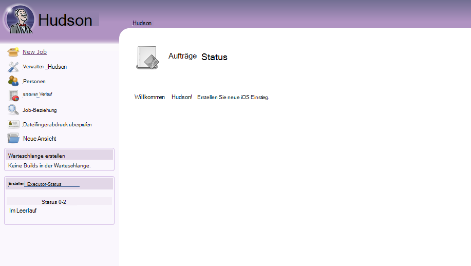
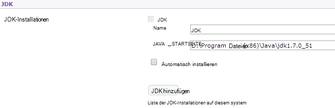

<properties 
    pageTitle="Eine benutzerdefinierte Java Web app in Azure hochladen" 
    description="Dieses Lernprogramm veranschaulicht eine benutzerdefinierte Java Web app Azure App Service Web Apps hochladen." 
    services="app-service\web" 
    documentationCenter="java" 
    authors="rmcmurray" 
    manager="wpickett" 
    editor=""/>

<tags 
    ms.service="app-service-web" 
    ms.workload="web" 
    ms.tgt_pltfrm="na" 
    ms.devlang="Java" 
    ms.topic="article" 
    ms.date="08/11/2016" 
    ms.author="robmcm"/>

# Eine benutzerdefinierte Java Web app in Azure hochladen

In diesem Thema erläutert eine benutzerdefinierte Java Web app in [Azure App Service] Web Apps hochladen. Enthält Informationen, die für jede Website oder Anwendung von Java und auch Beispiele für bestimmte Applikationen gilt.

Beachten Sie, dass Azure für Java webapps mit der Azure-Verwaltungsportal Konfigurationsbenutzeroberfläche und Azure Marketplace erstellen, wie in [Java Web app in Azure App Service erstellen kann](web-sites-java-get-started.md). Dieses Lernprogramm ist für Szenarios, in denen nicht der Azure-Portal verwenden möchten, Benutzeroberfläche oder Azure Marketplace.  

## Richtlinien

Die folgenden beschreibt die Einstellungen für benutzerdefinierte Java webapps auf Azure erwartet.

- Java-Prozess verwendete HTTP-Port wird dynamisch zugewiesen.  Des Prozesses verwenden Port aus der Umgebungsvariablen `HTTP_PLATFORM_PORT`.
- Abhör-Ports als einzelnen HTTP-Listener sollte deaktiviert werden.  In Tomcat, Herunterfahren, HTTPS und AJP enthält Ports.
- Der Container muss für IPv4-Datenverkehr konfiguriert werden.
- **Befehl für die Anwendung** muss in der Konfiguration festgelegt werden.
- Anträge, die Verzeichnisse erfordern schreiben Berechtigung in Azure Web app Inhaltsordner ist **D:\home**befinden müssen.  Die Umgebungsvariable `HOME` bezieht sich auf D:\home.  

Sie können Umgebungsvariablen in der Datei web.config nach Bedarf festlegen.

## Konfiguration der Datei Web.config httpPlatform

Die folgenden Informationen beschreiben das Format **HttpPlatform** in web.config.
                                 
**Argumente** (Standard = ""). Argumente für die ausführbare Datei oder das Skript **ProcessPath** angegeben.

Beispiele (mit **ProcessPath** enthalten):

    processPath="%HOME%\site\wwwroot\bin\tomcat\bin\catalina.bat"
    arguments="start"
    
    processPath="%JAVA_HOME\bin\java.exe"
    arguments="-Djava.net.preferIPv4Stack=true -Djetty.port=%HTTP\_PLATFORM\_PORT% -Djetty.base=&quot;%HOME%\site\wwwroot\bin\jetty-distribution-9.1.0.v20131115&quot; -jar &quot;%HOME%\site\wwwroot\bin\jetty-distribution-9.1.0.v20131115\start.jar&quot;"

**ProcessPath** - Pfad zu der ausführbaren Datei oder Skript, das einen Prozess für HTTP-Anfragen gestartet wird.

Beispiele:

    processPath="%JAVA_HOME%\bin\java.exe"

    processPath="%HOME%\site\wwwroot\bin\tomcat\bin\startup.bat"

    processPath="%HOME%\site\wwwroot\bin\tomcat\bin\catalina.bat"
                                                                                       
**rapidFailsPerMinute** (Standard = 10.) Anzahl der in **ProcessPath** angegebene Prozess abstürzt pro Minute zulässig ist. Wenn diese Grenze überschritten wird, wird **HttpPlatformHandler** den Prozess für den Rest der Minute beendet.
                                    
**requestTimeout** (Standard = "00: 02:00".) Dauer für die wartet auf eine Antwort von dem Prozess **HttpPlatformHandler** `%HTTP_PLATFORM_PORT%`.

**startupRetryCount** (Standard = 10.) Anzahl der **HttpPlatformHandler** in **ProcessPath**angegebenen Prozess zu starten versucht. **StartupTimeLimit** Weitere Details anzeigen

**startupTimeLimit** (Standard = 10 Sekunden.) Dauer der **HttpPlatformHandler** für die ausführbare Datei/Skript zum Starten eines Prozesses auf dem Port wartet.  Wird diese Frist überschritten, wird **HttpPlatformHandler** den Prozess und versuchen, wieder **StartupRetryCount** Mal starten.
                                                                                      
**stdoutLogEnabled** (Standard = "true".) Wenn true, **Stdout** und **Stderr** für den Prozess angegeben **ProcessPath** in **StdoutLogFile** angegebene Datei umgeleitet werden (siehe **StdoutLogFile** ).
                                    
**stdoutLogFile** (Default="d:\home\LogFiles\httpPlatformStdout.log".) Absolute Pfad für den **Stdout** und **Stderr** aus den in **ProcessPath** angegebenen Prozess protokolliert werden.
                                    
> [AZURE.NOTE] `%HTTP_PLATFORM_PORT%`spezieller Platzhalter muss als Teil der **Argumente** oder als Teil der **HttpPlatform** **EnvironmentVariables** angegeben ist. Dies intern generierten Port durch **HttpPlatformHandler** ersetzt, damit durch **ProcessPath** angegebene Prozess diesen Port abhören kann.

## Bereitstellung

Java basierend webapps problemlos durch die meisten gleicher bereitgestellt werden können, die mit Internet Information Services (IIS) verwendet werden basierten ASP.NET-Webanwendungen.  FTP, Git und Kudu werden alle Bereitstellung Mechanismen unterstützt integrierte SCM für Web-apps ist. WebDeploy arbeitet als ein Protokoll jedoch Java nicht in Visual Studio entwickelt WebDeploy Java Web app Deployment Anwendungsfälle passt nicht.

## Beispiele für die Konfiguration

Die folgenden Programme und eine web.config-Datei der Anwendung ist Konfiguration als Beispiele zum Aktivieren der Anwendung Java App Service Web Apps vorgesehen.

### Tomcat
Zwar zwei Varianten Tomcat App Service Web Apps erhalten, kann er noch Kunde bestimmte Instanzen hochladen. Es folgt ein Beispiel für eine Installation von Tomcat mit verschiedenen Java Virtual Machine (JVM).

    <?xml version="1.0" encoding="UTF-8"?>
    <configuration>
      <system.webServer>
        <handlers>
          <add name="httpPlatformHandler" path="*" verb="*" modules="httpPlatformHandler" resourceType="Unspecified" />
        </handlers>
        <httpPlatform processPath="%HOME%\site\wwwroot\bin\tomcat\bin\startup.bat" 
            arguments="">
          <environmentVariables>
            <environmentVariable name="CATALINA_OPTS" value="-Dport.http=%HTTP_PLATFORM_PORT%" />
            <environmentVariable name="CATALINA_HOME" value="%HOME%\site\wwwroot\bin\tomcat" />
            <environmentVariable name="JRE_HOME" value="%HOME%\site\wwwroot\bin\java" /> <!-- optional, if not specified, this will default to %programfiles%\Java -->
            <environmentVariable name="JAVA_OPTS" value="-Djava.net.preferIPv4Stack=true" />
          </environmentVariables>
        </httpPlatform>
      </system.webServer>
    </configuration>

Auf Tomcat sind einige konfigurationsänderungen erfolgen. Der server.xml muss bearbeitet werden, um festzulegen:

-   Herunterfahren-Port =-1
-   HTTP-Anschluss = ${port.http}
-   HTTP-Connector Adresse = "127.0.0.1"
-   Kommentieren Sie HTTPS und AJP connectors
-   Die IPv4-können auch in der catalina.properties-Datei einrichten können Sie hinzufügen`java.net.preferIPv4Stack=true`
    
Direct3d-Aufrufe werden nicht auf App Service Web Apps unterstützt. Deaktivieren Sie diejenigen, fügen Sie die folgende Java-Option die Anwendung solche Aufrufe durchführen muss:`-Dsun.java2d.d3d=false`

### Steg

Wie die für Tomcat können Kunden ihre eigenen Instanzen für Steg hochladen. Bei die vollständige Installation Steg ausgeführt, wird die Konfiguration wie folgt aussehen:

    <?xml version="1.0" encoding="UTF-8"?>
    <configuration>
      <system.webServer>
        <handlers>
          <add name="httppPlatformHandler" path="*" verb="*" modules="httpPlatformHandler" resourceType="Unspecified" />
        </handlers>
        <httpPlatform processPath="%JAVA_HOME%\bin\java.exe" 
             arguments="-Djava.net.preferIPv4Stack=true -Djetty.port=%HTTP_PLATFORM_PORT% -Djetty.base=&quot;%HOME%\site\wwwroot\bin\jetty-distribution-9.1.0.v20131115&quot; -jar &quot;%HOME%\site\wwwroot\bin\jetty-distribution-9.1.0.v20131115\start.jar&quot;"
            startupTimeLimit="20"
          startupRetryCount="10"
          stdoutLogEnabled="true">
        </httpPlatform>
      </system.webServer>
    </configuration>

Steg Konfiguration muss im start.ini festlegen geändert werden `java.net.preferIPv4Stack=true`.

### Springboot
Um eine Springboot müssen Sie ausgeführte Anwendung Hochladen Ihrer Datei JAR- oder KRIEG und fügen Sie die folgende Datei web.config. Die web.config-Datei wird in den Ordner "Wwwroot". Passen Sie in der Datei web.config die Argumente der JAR-Datei im folgenden Beispiel auf die JAR-Datei befindet sich im Ordner "Wwwroot" sowie an  

    <?xml version="1.0" encoding="UTF-8"?>
    <configuration>
      <system.webServer>
        <handlers>
          <add name="httpPlatformHandler" path="*" verb="*" modules="httpPlatformHandler" resourceType="Unspecified" />
        </handlers>
        <httpPlatform processPath="%JAVA_HOME%\bin\java.exe"
            arguments="-Djava.net.preferIPv4Stack=true -Dserver.port=%HTTP_PLATFORM_PORT% -jar &quot;%HOME%\site\wwwroot\my-web-project.jar&quot;">
        </httpPlatform>
      </system.webServer>
    </configuration>

### Hudson

Test verwendet Hudson 3.1.2 War und die Standardinstanz Tomcat 7.0.50 ohne Benutzeroberfläche Dinge eingerichtet.  Ist Hudson ein Buildtool empfiehlt Kennzeichen **AlwaysOn** Web App festgelegtem auf bestimmte Instanzen installieren.

1. Erstellen Sie im Web app Stammverzeichnis, z.B. **d:\home\site\wwwroot**ein Verzeichnis **Webapps** (falls nicht bereits vorhanden) und versehen Sie **d:\home\site\wwwroot\webapps**Hudson.war.
2. Herunterladen Sie Apache Maven 3.0.5 (kompatibel mit Hudson) und in **d:\home\site\wwwroot**.
3. Erstellen Sie web.config in **d:\home\site\wwwroot** , und fügen Sie den folgenden Inhalt darin:
    
        <?xml version="1.0" encoding="UTF-8"?>
        <configuration>
          <system.webServer>
            <handlers>
              <add name="httppPlatformHandler" path="*" verb="*" 
        modules="httpPlatformHandler" resourceType="Unspecified" />
            </handlers>
            <httpPlatform processPath="%AZURE_TOMCAT7_HOME%\bin\startup.bat"
        startupTimeLimit="20"
        startupRetryCount="10">
        <environmentVariables>
          <environmentVariable name="HUDSON_HOME" 
        value="%HOME%\site\wwwroot\hudson_home" />
          <environmentVariable name="JAVA_OPTS" 
        value="-Djava.net.preferIPv4Stack=true -Duser.home=%HOME%/site/wwwroot/user_home -Dhudson.DNSMultiCast.disabled=true" />
        </environmentVariables>            
            </httpPlatform>
          </system.webServer>
        </configuration>

    Web app kann zu diesem Zeitpunkt neu gestartet werden, um die Änderungen.  Verbinden Sie mit http://yourwebapp/hudson Hudson gestartet.

4. Nach Hudson selbst konfiguriert, sollte den folgenden Bildschirm angezeigt:

    
    
5. Zugriff auf die Konfigurationsseite Hudson: **Hudson verwalten**auf und klicken Sie dann auf **System konfigurieren**.
6. Konfigurieren Sie JDK, wie unten dargestellt:

    

7. Konfigurieren Sie Maven wie folgt:

    

8. Speichern. Hudson sollte nun konfiguriert und einsatzbereit.

Weitere Informationen über Hudson finden Sie unter [http://hudson-ci.org](http://hudson-ci.org).

### Liferay

Liferay wird App Service Web Apps unterstützt. Da Liferay erhebliche Speicher erfordern kann, muss Web app auf einem mittleren oder großen dedizierten Arbeitsthread ausführen, genügend Arbeitsspeicher bereitstellen kann. Liferay Minuten mehrere gestartet. Deshalb wird empfohlen, dass Web app auf **Immer**gesetzt.  

Liferay 6.1.2 Community Edition GA3 gebündelt mit Tomcat verwenden, die folgenden Dateien bearbeiteten Liferay herunter:

**Server.Xml**

- Ändern Sie Herunterfahren-Port-1.
- Änderung HTTP-connector      `<Connector port="${port.http}" protocol="HTTP/1.1" connectionTimeout="600000" address="127.0.0.1" URIEncoding="UTF-8" />`
- Kommentieren Sie den Connector AJP.

Erstellen Sie im Ordner **liferay\tomcat-7.0.40\webapps\ROOT\WEB-INF\classes** eine Datei namens **ext.properties Portal**. Diese Datei muss eine Zeile enthalten, wie hier gezeigt:

    liferay.home=%HOME%/site/wwwroot/liferay

Erstellen Sie auf derselben Verzeichnisebene wie der Tomcat-7.0.40-Ordner eine Datei **"Web.config"** mit dem folgenden Inhalt:

    <?xml version="1.0" encoding="UTF-8"?>
    <configuration>
      <system.webServer>
        <handlers>
    <add name="httpPlatformHandler" path="*" verb="*"
         modules="httpPlatformHandler" resourceType="Unspecified" />
        </handlers>
        <httpPlatform processPath="%HOME%\site\wwwroot\tomcat-7.0.40\bin\catalina.bat" 
                      arguments="run" 
                      startupTimeLimit="10" 
                      requestTimeout="00:10:00" 
                      stdoutLogEnabled="true">
          <environmentVariables>
      <environmentVariable name="CATALINA_OPTS" value="-Dport.http=%HTTP_PLATFORM_PORT%" />
      <environmentVariable name="CATALINA_HOME" value="%HOME%\site\wwwroot\tomcat-7.0.40" />
            <environmentVariable name="JRE_HOME" value="D:\Program Files\Java\jdk1.7.0_51" /> 
            <environmentVariable name="JAVA_OPTS" value="-Djava.net.preferIPv4Stack=true" />
          </environmentVariables>
        </httpPlatform>
      </system.webServer>
    </configuration>

Block **HttpPlatform** **RequestTimeout** Wert "00:10 00".  Reduziert werden, aber dann sind wahrscheinlich einige Timeoutfehler während bootstrapping Liferay.  Wenn dieser Wert geändert wird, sollte auch **ConnectionTimeout** in Tomcat server.xml geändert werden.  

Es ist erwähnenswert, dass JRE_HOME Environnment Varariable die oben auf der 64-Bit-JDK festgelegt ist. Der Standardwert ist 32 Bit, aber da Liferay hohe Speicherkapazität benötigen, 64-Bit-JDK verwenden sollten.

Nachdem Sie diese Änderungen Starten Ihrer Anwendung Liferay ausgeführt haben, öffnen Sie http://yourwebapp. Liferay Portal steht Web app Root. 

## Nächste Schritte

Weitere Informationen zu Liferay finden Sie unter [http://www.liferay.com](http://www.liferay.com).

Weitere Informationen zu Java finden Sie unter [Java Developer Center](/develop/java/).

[AZURE.INCLUDE [app-service-web-whats-changed](../../includes/app-service-web-whats-changed.md)]

[AZURE.INCLUDE [app-service-web-try-app-service](../../includes/app-service-web-try-app-service.md)]
 
 
<!-- External Links -->
[Azure App Service]: http://go.microsoft.com/fwlink/?LinkId=529714
