<properties 
    pageTitle="Migrieren Sie eine Enterprise Web app in Azure App Service" 
    description="Veranschaulicht, wie Web Apps Migration Assistant schnell vorhandene IIS-Websites in Azure App Service Web Apps migrieren" 
    services="app-service" 
    documentationCenter="" 
    authors="cephalin" 
    writer="cephalin" 
    manager="wpickett" 
    editor=""/>

<tags 
    ms.service="app-service" 
    ms.workload="na" 
    ms.tgt_pltfrm="na" 
    ms.devlang="na" 
    ms.topic="article" 
    ms.date="07/01/2016" 
    ms.author="cephalin"/>

# Migrieren Sie eine Enterprise Web app in Azure App Service

Sie können leicht Ihre vorhandenen Websites migrieren, die Internet Information Service (IIS) 6 oder höher [App Service Web Apps](http://go.microsoft.com/fwlink/?LinkId=529714)ausgeführt. 

>[AZURE.IMPORTANT] Windows Server 2003 erreicht Ende am 14. Juli 2015. Wenn Sie derzeit Ihre Webseiten auf einem IIS-Server hosten, die Windows Server 2003 ist Web Apps wird geringes Risiko, kostengünstige, und beinahe problemlose Möglichkeit, Ihren online-Websites und Web-Apps-Migrationsassistent helfen Sie den Migrationsvorgang automatisieren. 

[Web Apps Migration Assistant](https://www.movemetothecloud.net/) können analysieren IIS Server-Installation, welche Sites App Service migriert werden, markieren Sie alle Elemente, die nicht migriert werden oder werden nicht auf der Plattform unterstützt und anschließend Ihrer Websites und zugehörigen Datenbanken in Azure zu identifizieren.

[AZURE.INCLUDE [app-service-web-to-api-and-mobile](../../includes/app-service-web-to-api-and-mobile.md)]

## Kompatibilitätsanalyse überprüften Elemente ##
Der Migrations-Assistent erstellt einen Bericht bereit, alle möglichen Ursachen für Anliegen oder blockierenden Probleme bei der Migration von lokalen IIS zu Azure App Service Web Apps verhindern. Einige Schlüsselelemente zu beachten sind:

-   Portbindungen – unterstützt Web Apps nur Port 80 für HTTP und 443 für HTTPS-Datenverkehr. Verschiedenen Anschlusskonfigurationen ignoriert und 80 oder 443 Datenverkehr weitergeleitet werden. 
-   Authentifizierung – Web Apps unterstützt anonyme Authentifizierung und Formularauthentifizierung von einer Anwendung angegeben. Durch die Integration von Azure Active Directory mit ADFS nur kann Windows-Authentifizierung verwendet werden. Andere Formen der Authentifizierung - z. B. Standardauthentifizierung - werden derzeit nicht unterstützt. 
-   Global Assemblycache (GAC) – GAC nicht im Web Apps unterstützt. Wenn Ihre Anwendung Assemblys, die in der Regel im globalen Assemblycache bereitstellen verweist, müssen Sie im Web Apps Ordner Bin Anwendung bereitstellen. 
-   IIS5-Kompatibilitätsmodus – in Web Apps nicht unterstützt. 
-   Anwendungspools – Web Apps, jede Site und dessen untergeordnete Anwendung im selben Anwendungspool ausgeführt werden. Wenn Ihre Website mehrere untergeordnete Anwendung Verwendung mehrerer Anwendungspools, Konsolidierung auf einen einzigen Anwendungspool mit Einstellungen oder jede Anwendung eine separate Web app migrieren.
-   COM-Komponenten – Web Apps erlaubt nicht die Registrierung von COM-Komponenten der Plattform. Wenn Ihre Websites oder Programme alle COM-Komponenten nutzen, Sie in verwaltetem Code schreiben und mit der Website oder Anwendung bereitstellen.
-   ISAPI-Filter – unterstützen Web Apps ISAPI-Filter. Sie benötigen Folgendes:
    -   Bereitstellen der DLLs mit Ihrer Anwendung 
    -   die DLLs mit [Web.config](http://www.iis.net/configreference/system.webserver/isapifilters) registrieren
    -   Platzieren Sie eine applicationHost.xdt-Datei in den Stammordner mit dem folgenden Inhalt:

            <?xml version="1.0"?>
            <configuration xmlns:xdt="http://schemas.microsoft.com/XML-Document-Transform">
            <configSections>
                <sectionGroup name="system.webServer">
                  <section name="isapiFilters" xdt:Transform="SetAttributes(overrideModeDefault)" overrideModeDefault="Allow" />
                </sectionGroup>
              </configSections>
            </configuration>

        Weitere Beispiele für die Verwendung von XML-Dokument Transformationen mit Ihrer Website finden Sie in der [Transformation Ihrer Microsoft Azure-Website](http://blogs.msdn.com/b/waws/archive/2014/06/17/transform-your-microsoft-azure-web-site.aspx).

-   Andere Komponenten wie SharePoint, FrontPage Server Extensions (FPSE) FTP, SSL-Zertifikate nicht migriert.

## Wie Sie Web-Apps Migration Assistant ##
In diesem Abschnitt schrittweise durch ein Beispiel, um einige Websites mit einer SQL Server-Datenbank und auf einem lokalen Windows Server 2003 R2 (IIS 6.0) Computer migrieren:

1.  Navigieren Sie auf dem IIS-Server oder Client-Computer [https://www.movemetothecloud.net/](https://www.movemetothecloud.net/) 

    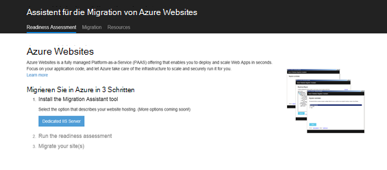

2.  Installieren Sie Web Apps-Migrationsassistent durch Klicken auf die Schaltfläche **Dedizierten IIS-Server** . Weitere Optionen werden in naher Zukunft Optionen. 
4.  Klicken Sie auf **Tools installieren** , um Web Apps Migration Assistant auf Ihrem Computer installieren.

    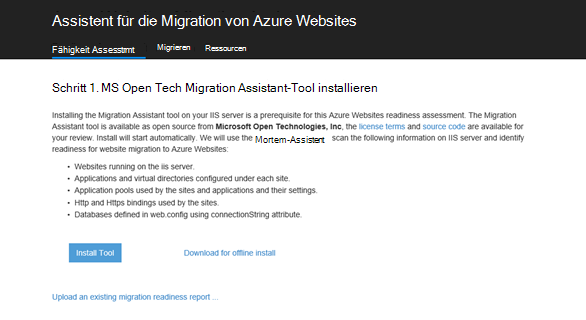

    >[AZURE.NOTE] Sie können auch eine ZIP-Datei auf nicht mit dem Internet verbundenen Server herunterladen **offline Installation herunterladen** klicken. Oder Sie klicken **einen vorhandenen Migration Readiness Bericht hochladen**ist eine erweiterte Option mit einem vorhandenen Migration Readiness Bericht, den zuvor generiert (weiter unten erläutert).

5.  Klicken Sie im Bildschirm **Installation** auf **Installieren** auf Ihrem Computer installieren. Ggf. wird auch entsprechende Abhängigkeiten Web Deploy, DacFX und IIS installiert. 

    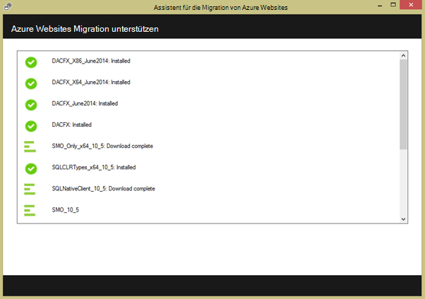

    Nach der Installation automatisch Web Apps Migration Assistant.
  
6.  Wählen Sie **Migrieren Websites und Datenbanken von einem Server in Azure**. Die administrativen Anmeldeinformationen für den Remoteserver, und klicken Sie auf **Weiter**. 

    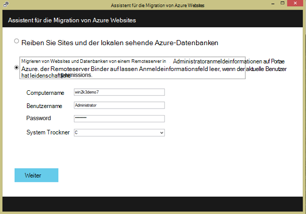

    Sie können natürlich vom lokalen Server migrieren. Die Option remote ist nützlich, wenn Sie Webseiten von einem IIS-Produktionsserver migrieren möchten.
 
    An diesem Punkt prüft das Migrationsprogramm die Konfiguration Ihres IIS-Servers Sites Applikationen, Anwendungspools und Abhängigkeiten zu Websites Kandidaten für die Migration. 

8.  Der folgende Screenshot zeigt drei Websites **Standardwebsite**, **TimeTracker**und **CommerceNet4**. Alle haben eine zugeordnete Datenbank migrieren soll. Wählen Sie alle Websites bewerten und **Klicken**möchten.

    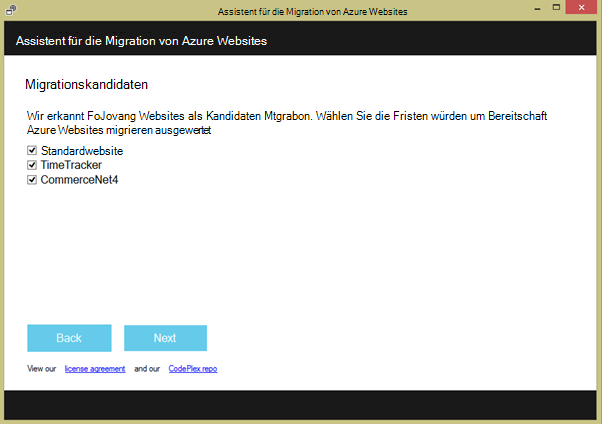
 
9.  Klicken Sie auf **Hochladen** , um Readiness Bericht hochladen. Wenn Sie **lokal speichern**klicken, können Sie das Migrationsprogramm später erneut ausführen und gespeicherte Readiness-Bericht hochladen, wie bereits erwähnt.

    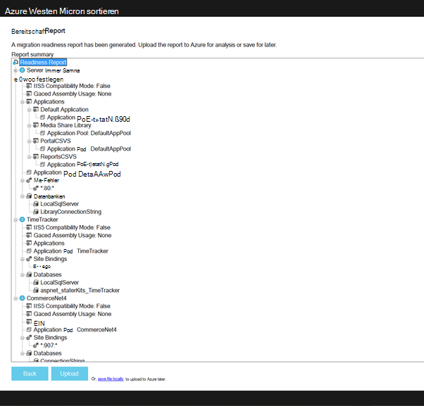
 
    Nach Bereitschaft Bericht hochladen Azure Readiness Analyse und zeigt die Ergebnisse. Einzelheiten Sie der Bewertung für jede Website und stellen Sie sicher, daß Sie alle Probleme behoben haben, bevor Sie fortfahren. 
 
    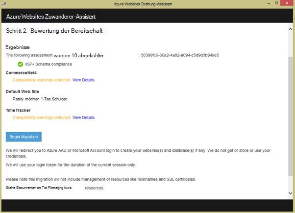

12. Klicken Sie auf **Migration starten** , um mit der Migration beginnen. Sie gelangen nun in Azure bei Ihrem Konto anmelden. Es ist wichtig, dass Sie sich mit einem Konto anmelden, das ein aktives Azure-Abonnement hat. Haben Sie kein Azure-Konto können Sie eine kostenlose Testversion [hier](https://azure.microsoft.com/pricing/free-trial/?WT.srch=1&WT.mc_ID=SEM_)oben signieren. 

13. Wählen Sie mieterkonto, Azure-Abonnement und Region für die migrierten Azure webapps und Datenbanken, und klicken Sie auf **Migration starten**. Sie können Websites später Migration auswählen.

    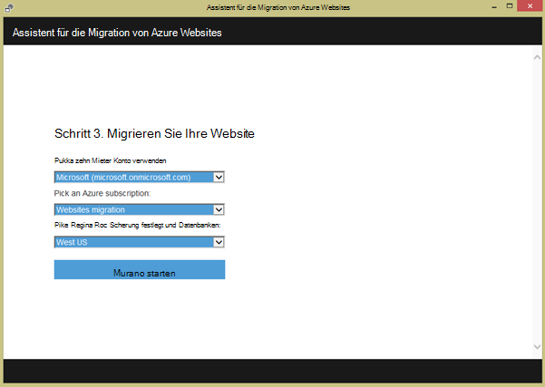

14. Auf dem nächsten Bildschirm können Sie die Standardeinstellungen für Migration wie ändern:

    - Verwenden einer vorhandenen Azure SQL-Datenbank oder einer SQL Azure erstellen und Anmeldeinformation konfigurieren
    - Wählen Sie die Websites migrieren
    - Definieren von Namen für Azure Web apps und ihre verknüpften SQL-Datenbanken
    - Globale Einstellungen und Website-Einstellungen anpassen

    Das Bildschirmabbild unten zeigt die für die Migration mit ausgewählten Websites.

    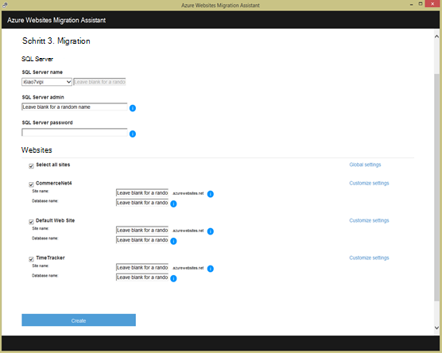

    >[AZURE.NOTE] im benutzerdefinierten Einstellungen das Kontrollkästchen **Azure Active Directory aktivieren** integrieren [Azure Active Directory](active-directory-whatis.md) ( **Verzeichnis Standard**) Azure Web app. Weitere Informationen über Synchronisierung Azure Active Directory lokale Active Directory finden Sie unter [Verzeichnisintegration](http://msdn.microsoft.com/library/jj573653).

16.  Nachdem Sie alle gewünschten geändert haben, klicken Sie auf **Erstellen** , um die Migration zu starten. Das Migrationstool Azure SQL-Datenbank und Azure WebApp erstellen und veröffentlichen die Inhalte von Websites und Datenbanken. Der Migrationsstatus wird deutlich des Migrationstools und sehen Sie eine Zusammenfassung am Ende, welche Sites migriert, ob sie erfolgreich waren, Details zu den neu erstellten Azure Web apps verknüpft. 

    Wenn während der Migration ein Fehler auftritt, wird das Migrationsprogramm Fehler und Rollback Änderungen deutlich. Sie werden auch zu senden des Fehlerberichts an das engineering-Team Schaltfläche **Problembericht senden** , die Aufrufliste erfassten Fehler Nachricht erstellen. 

    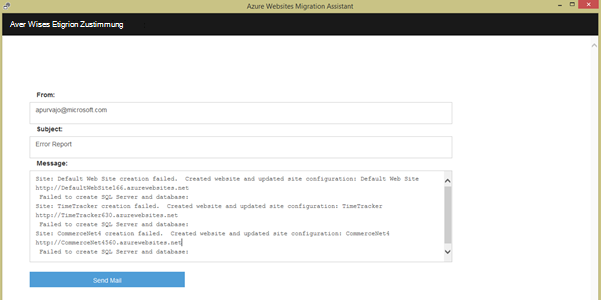

    Wenn Migration erfolgreich ohne Fehler, Sie können auch die Schaltfläche **Feedback geben** Feedback direkt zu. 
 
20. Klicken Sie auf die Links zu den Azure Web apps, und stellen Sie sicher, dass die Migration erfolgreich war.

21. Sie können jetzt den migrierten Web apps in Azure App Service verwalten. Hierzu müssen Sie [Azure-Portal](https://portal.azure.com)anmelden.

22. Azure-Portal öffnen Sie Web Apps Blade die migrierten Websites (dargestellt als webapps) darauf klicken Sie auf diese verwalten Web app, wie fortlaufende Publishing erstellen Sicherungskopien, Skalierung, und Überwachung Nutzung oder Leistung konfigurieren.

    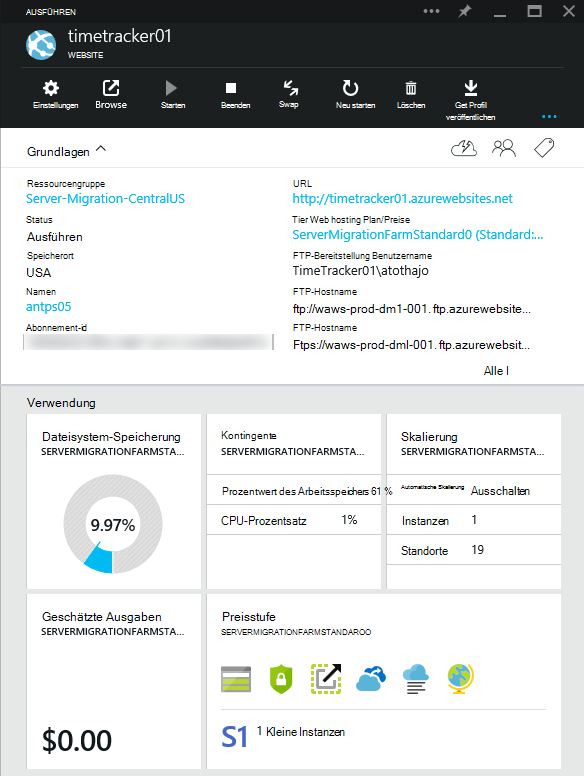

>[AZURE.NOTE] Wenn Sie mit Azure App Service beginnen, bevor Sie sich für ein Azure-Konto, gehen Sie [Versuchen App Service](http://go.microsoft.com/fwlink/?LinkId=523751)sofort eine kurzlebige Starter Web app in App Service können Sie erstellen. Keine Kreditkarten erforderlich; keine Zusagen.

## Was hat sich geändert
* Eine Anleitung zur Änderung von Websites zu App Service finden Sie unter: [Azure App Service und seine Auswirkung auf vorhandene Azure Services](http://go.microsoft.com/fwlink/?LinkId=529714)
 
