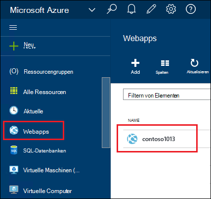
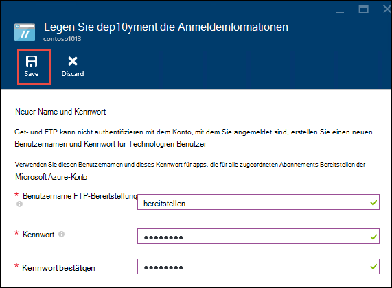
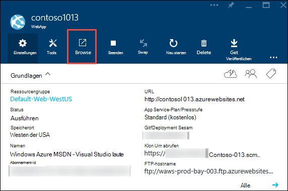
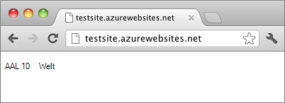

<properties
    pageTitle="Node.js Web app in Azure App Service erstellen | Microsoft Azure"
    description="Erfahren Sie, wie eine Anwendung Node.js zu Web app in Azure App Service bereitgestellt."
    services="app-service\web"
    documentationCenter="nodejs"
    authors="rmcmurray"
    manager="wpickett"
    editor=""/>

<tags
    ms.service="app-service-web"
    ms.workload="web"
    ms.tgt_pltfrm="na"
    ms.devlang="nodejs"
    ms.topic="hero-article"
    ms.date="08/11/2016"
    ms.author="robmcm"/>

# Erstellen Sie Node.js Web app in Azure App Service

> [AZURE.SELECTOR]
- [.NET](web-sites-dotnet-get-started.md)
- [Node.js](web-sites-nodejs-develop-deploy-mac.md)
- [Java](web-sites-java-get-started.md)
- [PHP - Git](web-sites-php-mysql-deploy-use-git.md)
- [PHP - FTP](web-sites-php-mysql-deploy-use-ftp.md)
- [Python](web-sites-python-ptvs-django-mysql.md)

Dieses Lernprogramm zeigt, wie eine einfache [Node.js](http://nodejs.org) -Anwendung erstellen und eine [Webanwendung](app-service-web-overview.md) in [Azure App Service](../app-service/app-service-value-prop-what-is.md) mit [Git](http://git-scm.com)bereitstellen. Die Anleitung in diesem Lernprogramm können auf jedem Betriebssystem der ausgeführt Node.js folgen.

Sie erfahren:

* Erstellen eine Webanwendung in Azure App Service mithilfe der Azure-Portal
* Wie eine Anwendung Node.js Web app bereitzustellen, indem Web app Git Repository.

Die fertiggestellte Anwendung schreibt eine kurze Zeichenfolge "hello World" an den Browser.

![Ein Browser mit der Meldung "Hello World".][helloworld-completed]

Tutorials und Beispielcode mit komplexeren Node.js oder anderen Themen zur Verwendung von Node.js in Azure finden Sie [Node.js Developer Center](/develop/nodejs/).

> [AZURE.NOTE]
> Um dieses Lernprogramm benötigen Sie ein Microsoft Azure-Konto. Wenn Sie ein Konto haben, können Sie [Ihre Visual Studio-Abonnementvorteile aktivieren](/en-us/pricing/member-offers/msdn-benefits-details/?WT.mc_id=A261C142F) oder [Registrieren Sie sich für eine kostenlose Testversion](/en-us/pricing/free-trial/?WT.mc_id=A261C142F).
>
> Wenn Sie mit Azure App Service beginnen, bevor Sie für ein Azure-Konto, gehen Sie [versuchen App](http://go.microsoft.com/fwlink/?LinkId=523751)Service. Dort sofort können eine kurzlebige Starter Web app in App Service – keine Kreditkarte und keine Zusagen.

## Erstellen einer Webanwendung und Git Veröffentlichung aktivieren

Führen Sie die Schritte zum Erstellen einer Webanwendung in Azure App Service und Git Veröffentlichung aktivieren. 

[Git](http://git-scm.com/) ist ein verteiltes Versionskontrollsystem, mit denen Sie Ihre Azure-Website bereitstellen. Speichern Sie den Code Ihrer Anwendung in einem lokalen Repository Git schreibe und Code werden auf einem remote-Repository in Azure bereitstellen. Diese Methode der Bereitstellung ist ein Feature von App Service webapps.  

1. [Azure-Portal](https://portal.azure.com)anmelden.

2. Azure-Portal **+ Neuer** Symbol oben links klicken.

3. Auf **Web + Mobile**, und klicken Sie dann auf **WebApp**.

    ![][portal-quick-create]

4. Geben Sie einen Namen für die Webanwendung im **WebApp** .

    Dieser Name muss in der Domäne *.azurewebsites.NET da URL Web App {Name} werden. *.azurewebsites.NET. Wenn der eingegebene Name nicht eindeutig ist, wird im Feld ein rotes Ausrufezeichen angezeigt.

5. Wählen Sie ein **Abonnement**.

6. Wählen Sie eine **Ressourcengruppe** oder erstellen Sie eine neue.

    Weitere Informationen zu Ressourcengruppen finden Sie unter [Übersicht über Azure Ressource-Manager](../azure-resource-manager/resource-group-overview.md).

7. Wählen Sie eine **App Plan/Speicherort** oder erstellen Sie eine neue.

    Weitere Informationen zu App Service-Pläne Übersicht [Azure App Service-Pläne](../azure-web-sites-web-hosting-plans-in-depth-overview.md)

8. Klicken Sie auf **Erstellen**.
   
    ![][portal-quick-create2]

    In kurzer Zeit in der Regel weniger als einer Minute beendet Azure neue Web app erstellen.

9. Klicken Sie auf **Web-apps > {Ihrer neuen Anwendung}**.

    

10. Blatt **WebApp** klicken Sie auf **Bereitstellung** .

    ![][deployment-part]

11. Klicken Sie in der **Kontinuierlichen Bereitstellung** Blade- **Quelle auswählen**

12. **Klicken Sie auf **Lokale Git Repository****

    ![][setup-git-publishing]

13. Richten Sie Bereitstellung Anmeldeinformationen, wenn Sie dies nicht bereits getan haben.

    ein. Web app Blatt klicken Sie auf **Settings > Bereitstellung Anmeldeinformationen**.

    ![][deployment-credentials]
 
    b. Erstellen Sie einen Benutzernamen und ein Kennwort. 
    
    

14. Web app Blatt **Klicken Sie**und dann auf **Eigenschaften**.
 
    Zum Veröffentlichen drücken Sie remote Git Repository. Die URL für das Repository ist unter **GIT URL**aufgeführt. Sie verwenden diese URL später im Lernprogramm.

    ![][git-url]

## Erstellen Sie und Testen Sie Ihre Anwendung lokal

In diesem Abschnitt erstellen Sie eine **server.js** -Datei, die eine leicht modifizierte Version von Beispiel "Hello World" [nodejs.org] enthält. Der Code fügt process.env.PORT Port abhören Ausführung einer Azure Web app.

1. Erstellen Sie ein Verzeichnis mit dem Namen *"HelloWorld"*.

2. Verwenden Sie einen Text-Editor eine neue Datei namens **server.js** in das Verzeichnis *Helloworld* .

2. Kopieren Sie den folgenden Code in die Datei **server.js** , und speichern Sie die Datei:

        var http = require('http')
        var port = process.env.PORT || 1337;
        http.createServer(function(req, res) {
          res.writeHead(200, { 'Content-Type': 'text/plain' });
          res.end('Hello World\n');
        }).listen(port);

3. Öffnen Sie die Befehlszeile, und verwenden Sie den folgenden Befehl starten die Web app lokal.

        node server.js

4. Öffnen Sie Ihren Webbrowser, und navigieren Sie zu Http://localhost:1337. 

    Eine Webseite, die "Hello World" angezeigt wird, wie im folgenden Screenshot gezeigt.

    ![Ein Browser mit der Meldung "Hello World".][helloworld-localhost]

## Veröffentlichen Sie die Anwendung

1. Wenn Sie dies nicht bereits getan haben, installieren Sie Git.

    Installationshinweise für Ihre Plattform finden Sie in der [Git Downloadseite](http://git-scm.com/download).

1. Über die Befehlszeile wechseln Sie zum Verzeichnis **Helloworld** und geben Sie folgenden Befehl ein lokales Repository Git initialisiert werden.

        git init

2. Verwenden Sie die folgenden Befehle Dateien dem Repository hinzufügen:

        git add .
        git commit -m "initial commit"

3. Fügen Sie einen Git remote dafür Updates zur Web-app, die vorher mit dem folgenden Befehl erstellt:

        git remote add azure [URL for remote repository]

4. Drücken Sie Ihre Änderungen in Azure mithilfe des folgenden Befehls:

        git push azure master

    Das Kennwort werden Sie aufgefordert, die Sie zuvor erstellt haben. Die Ausgabe ist ähnlich dem folgenden Beispiel.

        Counting objects: 3, done.
        Delta compression using up to 8 threads.
        Compressing objects: 100% (2/2), done.
        Writing objects: 100% (3/3), 374 bytes, done.
        Total 3 (delta 0), reused 0 (delta 0)
        remote: New deployment received.
        remote: Updating branch 'master'.
        remote: Preparing deployment for commit id '5ebbe250c9'.
        remote: Preparing files for deployment.
        remote: Deploying Web.config to enable Node.js activation.
        remote: Deployment successful.
        To https://user@testsite.scm.azurewebsites.net/testsite.git
         * [new branch]      master -> master

5. Ihre app klicken der Schaltfläche **Durchsuchen** auf dem **Web App** im Azure-Portal.

    

    

## Veröffentlichen Sie Änderung zur Anwendung

1. Öffnen Sie die Datei **server.js** in einem Texteditor und ändern Sie "Hallo World\n" in "Hallo Azure\n". 

2. Speichern Sie die Datei.

2. Wechseln Sie zum Verzeichnis **Helloworld** die Befehlszeile und führen Sie die folgenden Befehle:

        git add .
        git commit -m "changing to hello azure"
        git push azure master

    Sie werden nach Ihrem Kennwort erneut aufgefordert.

3. Aktualisieren Sie das Browserfenster Web app-URL navigiert.

    ![Eine Webseite 'Hello Azure' anzeigen][helloworld-completed]

## Rollback für eine Bereitstellung

Aus dem **WebApp** Blade klicken Sie **Settings > kontinuierliche Bereitstellung** Bereitstellung Verlauf im Blade- **Bereitstellung** an. Benötigen Sie einen Rollback zu einer früheren Bereitstellung, können Sie auswählen und dann auf **erneut** **Bereitstellungsdetails** Blatt.

## Nächste Schritte

Sie haben eine Node.js-Anwendung eine Webanwendung in Azure App Service bereitgestellt. Hier erfahren Sie, wie App Service webapps Node.js Programme ausführen, finden Sie unter [Azure App Service Web Apps: Node.js](http://blogs.msdn.com/b/silverlining/archive/2012/06/14/windows-azure-websites-node-js.aspx) und [eine Node.js Azure-Anwendung angeben](../nodejs-specify-node-version-azure-apps.md).

Node.js bietet eine umfangreiche der Module, die von der Anwendung verwendet werden kann. Funktionsweise von Web Apps mit Modulen finden Sie unter [verwenden Node.js-Module mit Azure Applications](../nodejs-use-node-modules-azure-apps.md).

Wenn Sie mit der Anwendung Probleme nach der Bereitstellung in Azure, finden Sie unter [Debuggen einer Anwendung Node.js in Azure App Service](web-sites-nodejs-debug.md) Informationen zur Problemdiagnose.

In diesem Artikel verwendet das Azure-Portal Web app erstellen. Der [Azure-Befehlszeilenschnittstelle](../xplat-cli-install.md) oder [Azure PowerShell](../powershell-install-configure.md) können auch dieselben Operationen durchführen.

Weitere Informationen zu Azure Node.js Anwendungsentwicklung [Node.js Developer Center](/develop/nodejs/)anzeigen

[helloworld-completed]: ./media/web-sites-nodejs-develop-deploy-mac/helloazure.png
[helloworld-localhost]: ./media/web-sites-nodejs-develop-deploy-mac/helloworldlocal.png
[portal-quick-create]: ./media/web-sites-nodejs-develop-deploy-mac/create-quick-website.png
[portal-quick-create2]: ./media/web-sites-nodejs-develop-deploy-mac/create-quick-website2.png
[setup-git-publishing]: ./media/web-sites-nodejs-develop-deploy-mac/setup_git_publishing.png
[go-to-dashboard]: ./media/web-sites-nodejs-develop-deploy-mac/go_to_dashboard.png
[deployment-part]: ./media/web-sites-nodejs-develop-deploy-mac/deployment-part.png
[deployment-credentials]: ./media/web-sites-nodejs-develop-deploy-mac/deployment-credentials.png
[git-url]: ./media/web-sites-nodejs-develop-deploy-mac/git-url.png
