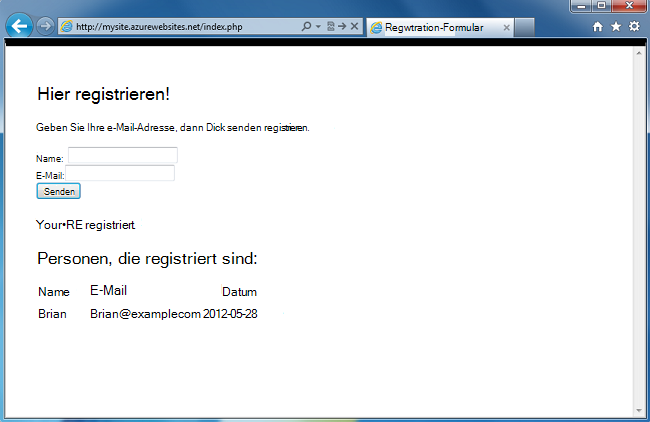
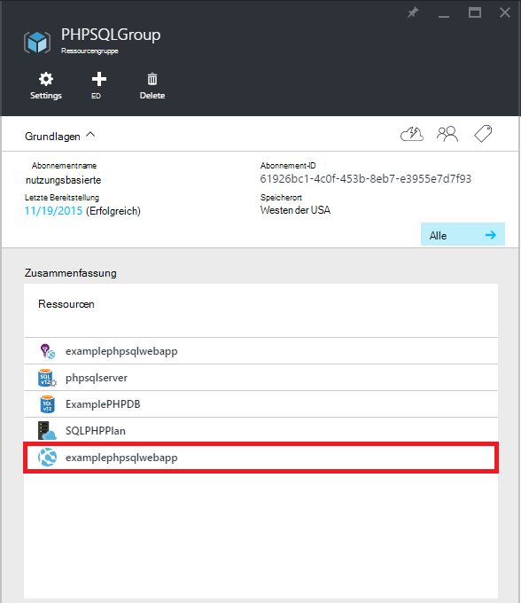
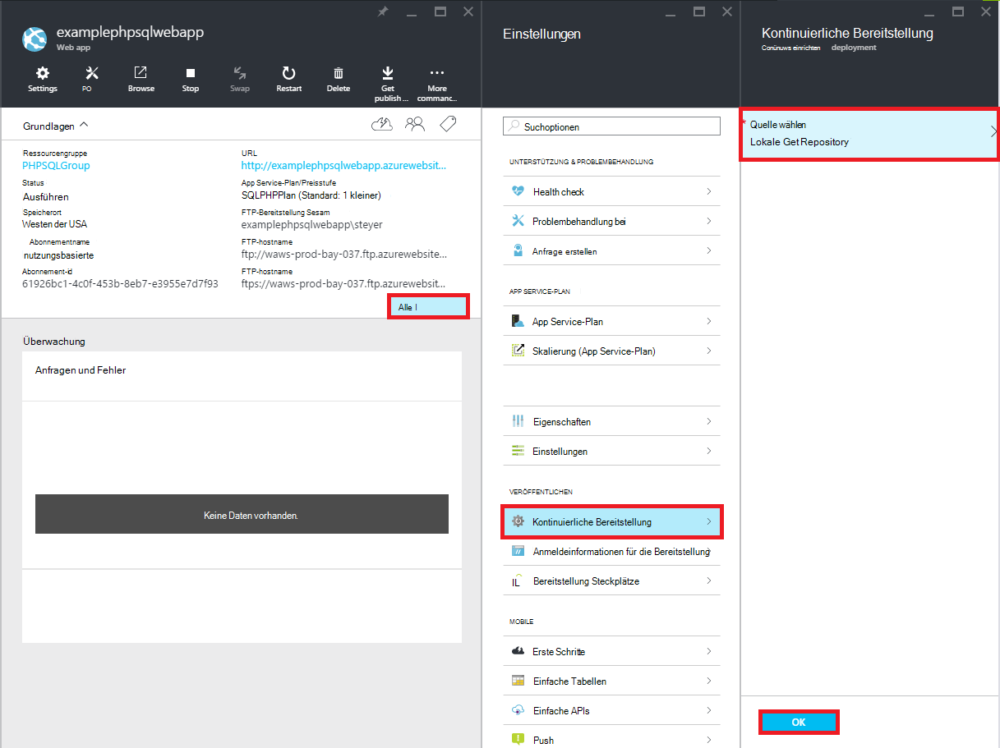
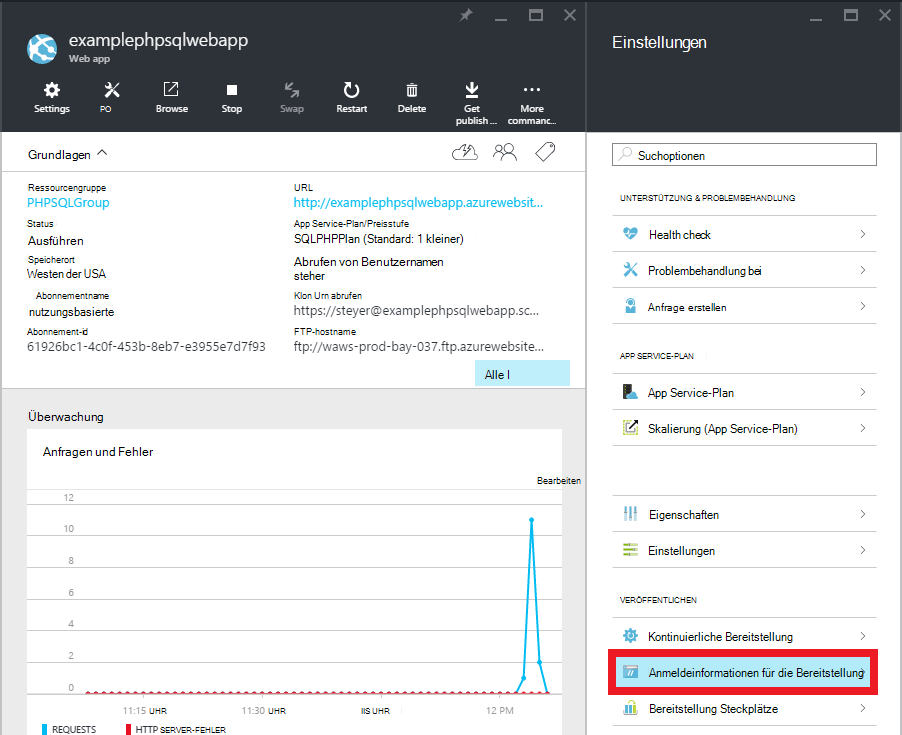
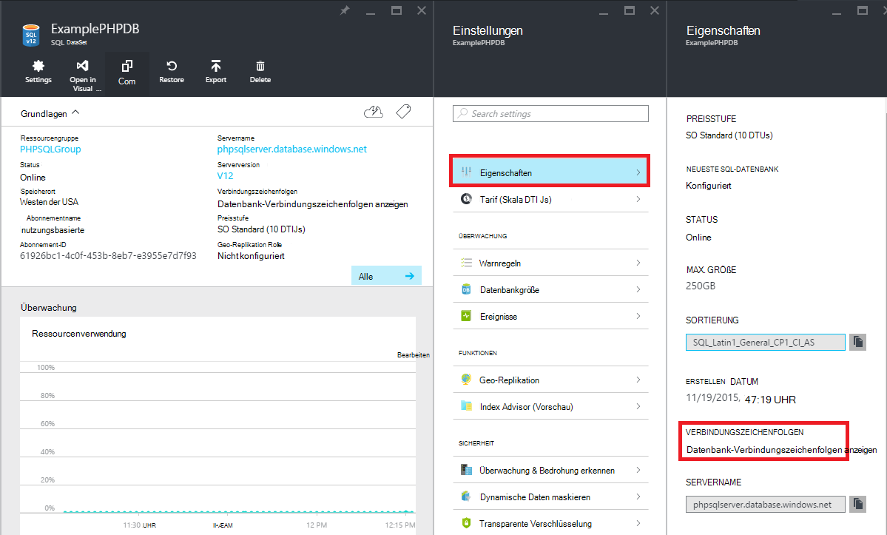

<properties 
    pageTitle="PHP-SQL Web app erstellen und Bereitstellen von Azure App Service mit Git" 
    description="Ein Lernprogramm, das veranschaulicht, wie eine PHP Web app, die Daten in Azure SQL-Datenbank gespeichert und Git Bereitstellung Azure App Service." 
    services="app-service\web, sql-database" 
    documentationCenter="php" 
    authors="rmcmurray" 
    manager="wpickett" 
    editor=""/>

<tags 
    ms.service="app-service-web" 
    ms.workload="web" 
    ms.tgt_pltfrm="na" 
    ms.devlang="PHP" 
    ms.topic="article" 
    ms.date="08/11/2016" 
    ms.author="robmcm"/>

# PHP-SQL Web app erstellen und Bereitstellen von Azure App Service mit Git

Dieses Lernprogramm zeigt Ihnen, wie PHP Web app in [Azure App Service](http://go.microsoft.com/fwlink/?LinkId=529714) erstellen, die in Azure SQL-Datenbank verbindet und mit Git bereitstellen. In diesem Lernprogramm wird vorausgesetzt, dass [PHP][install-php], [SQL Server Express][install-SQLExpress], die [Microsoft-Treiber für SQL Server für PHP](http://www.microsoft.com/download/en/details.aspx?id=20098)und [Git] [ install-git] auf Ihrem Computer installiert. Nach Abschluss dieses Handbuchs, haben Sie eine PHP-SQL Web app in Azure ausgeführt.

> [AZURE.NOTE]
> Sie können installieren und Konfigurieren von PHP, SQL Server Express und Microsoft-Drivers für SQL Server für PHP mit [Microsoft-Webplattform-Installer](http://www.microsoft.com/web/downloads/platform.aspx).

Lernen Sie Folgendes:

* Ein Azure Web app und einer SQL-Datenbank mithilfe der [Azure-Portal](http://go.microsoft.com/fwlink/?LinkId=529715)erstellen Da PHP in App Service Web Apps standardmäßig aktiviert ist, muss nichts Besonderes PHP-Code ausführen.
* Wie Veröffentlichen und erneut veröffentlichen Sie die Anwendung in Azure Git verwenden.
 
Anhand dieses Lernprogramms erstellen Sie eine einfache Anmeldung des Web in PHP. Die Anwendung wird in einer Azure-Website gehostet werden. Screenshot der abgeschlossenen Anwendung lautet wie folgt:

[AZURE.INCLUDE [create-account-and-websites-note](../../includes/create-account-and-websites-note.md)]

>[AZURE.NOTE] Wenn Sie mit Azure App Service beginnen, bevor Sie sich für ein Azure-Konto, gehen Sie [Versuchen App Service](http://go.microsoft.com/fwlink/?LinkId=523751)sofort eine kurzlebige Starter Web app in App Service können Sie erstellen. Keine Kreditkarten erforderlich; keine Zusagen.

##Azure Web app erstellen und Git Veröffentlichung einrichten

Gehen einer Azure Web app und einer SQL-Datenbank erstellen

1. [Azure-Portal](https://portal.azure.com/)anmelden.

2. Öffnen Sie das Dashboard Azure Marketplace auf das **neue** Symbol oben links klicken Sie auf **Alles markieren** Marketplace und **Web + Mobile**auswählen.
    
3. Wählen Sie auf dem Markt **Web + Mobile**.

4. Klicken Sie auf das Symbol **WebApp + SQL** .

5. Wählen Sie nach dem Lesen die Beschreibung des WebApp + SQL-Anwendung **Erstellen**.

6. Klicken Sie auf die einzelnen Teile (**Ressourcengruppe** **Web App**, **Datenbank**und **Abonnement**) und geben Sie Werte für erforderliche Felder:
    
    - Geben Sie einen URL-Namen Ihrer Wahl   
    - Datenbank-Serveranmeldeinformationen konfigurieren
    - Wählen Sie Ihre region

    

7. Abschließend definieren die Web-app klicken Sie auf **Erstellen**.

    Erstellung Web app blinkt die Schaltfläche **Benachrichtigungen** Grün **Erfolg** und die Ressource Blatt öffnen Web app und der SQL-Datenbank anzuzeigen.

4. Klicken Sie auf die Webanwendung die Ressource Blatt Blatt Web app öffnen.

    

5. Klicken Sie in **Einstellung** auf **kontinuierlichen Bereitstellung** > **Configure Settings erforderlich**. Wählen Sie **Git-Repository** , und klicken Sie auf **OK**.

    

    Wenn ein Repository Git vor nicht eingerichtet haben, müssen Sie einen Benutzernamen und ein Kennwort angeben. **Klicken Sie hierzu** > **Bereitstellung Anmeldeinformationen** im Web app Blade.

    

6. In **Einstellungen** auf **Eigenschaften** Git remote-URL Sie später die PHP-Anwendung bereitstellen müssen.

##SQL Datenbank-Verbindungsinformationen abrufen

Verbindung zum SQL-Datenbankinstanz, die mit Ihrer Anwendung, Ihre verknüpft die Verbindung Informationen beim Erstellen der Datenbank angegeben. Gehen folgendermaßen Sie vor um die SQL-Datenbank-Verbindungsinformationen zu erhalten:

1. In der Ressourcengruppe Blade klicken der SQL-Datenbank.

2. **Klicken Sie in der SQL-Datenbank-Blade** > **Eigenschaften**, klicken Sie auf **Datenbank-Verbindungszeichenfolgen anzeigen**. 

    
    
3. Im angezeigten Dialogfeld im Abschnitt **PHP** Notieren Sie die Werte für `Server`, `SQL Database`, und `User Name`. Diese Werte werden später verwendet werden, beim Veröffentlichen Ihrer PHP Anwendung in Azure App Service.

##Erstellen Sie und Testen Sie Ihre Anwendung lokal

Die Anmeldung ist eine einfache PHP-Anwendung, die zum Registrieren eines Ereignisses ermöglicht durch Ihre Namen und e-Mail-Adresse. Informationen zu vorherigen Teilnehmer wird in einer Tabelle angezeigt. Registrierungsinformationen werden in einer SQL-Datenbankinstanz gespeichert. Die Anwendung besteht aus zwei Dateien (siehe unten kopieren Code):

* **Index.PHP**: Zeigt ein Formular für die Registrierung und eine Tabelle mit Registrant-Informationen.
* **CreateTable.PHP**: die SQL-Datenbanktabelle für die Anwendung erstellt. Diese Datei wird nur einmal verwendet werden.

Gehen Sie folgendermaßen vor um die Anwendung lokal ausgeführt. Beachten Sie, dass diese Schritte haben Sie PHP und SQL Server Express auf dem lokalen Computer einrichten und die [PDO-Erweiterung für SQL Server]aktiviert haben[pdo-sqlsrv].

1. Erstellen eine SQL Server-Datenbank namens `registration`. Dazu von den `sqlcmd` mit folgenden Befehlen:

        >sqlcmd -S localhost\sqlexpress -U <local user name> -P <local password>
        1> create database registration
        2> GO   

2. Erstellen Sie im Stammverzeichnis Anwendung zwei Dateien - aufgerufen `createtable.php` und eine mit der Bezeichnung `index.php`.

3. Öffnen der `createtable.php` in einem Text-Editor oder IDE-Datei und fügen Sie folgenden Code hinzu. Dieser Code wird zum Erstellen der `registration_tbl` Tabelle die `registration` Datenbank.

        <?php
        // DB connection info
        $host = "localhost\sqlexpress";
        $user = "user name";
        $pwd = "password";
        $db = "registration";
        try{
            $conn = new PDO( "sqlsrv:Server= $host ; Database = $db ", $user, $pwd);
            $conn->setAttribute( PDO::ATTR_ERRMODE, PDO::ERRMODE_EXCEPTION );
            $sql = "CREATE TABLE registration_tbl(
            id INT NOT NULL IDENTITY(1,1) 
            PRIMARY KEY(id),
            name VARCHAR(30),
            email VARCHAR(30),
            date DATE)";
            $conn->query($sql);
        }
        catch(Exception $e){
            die(print_r($e));
        }
        echo "<h3>Table created.</h3>";
        ?>

    Beachten Sie, dass zum Aktualisieren der Werte für <code>$user</code> und <code>$pwd</code> mit lokalen SQL Server-Benutzernamen und Kennwort.

4. Geben Sie den folgenden Befehl in einem Terminal im Stammverzeichnis der Anwendung:

        php -S localhost:8000

4. Öffnen Sie einen Webbrowser, und navigieren Sie zu **Http://localhost:8000/createtable.php**. Dadurch wird die `registration_tbl` Tabelle in der Datenbank.

5. Die **index.php** -Datei in einem Text-Editor oder IDE und grundlegenden HTML- und CSS-Code für die Seite (PHP-Code werden später hinzugefügt) hinzufügen.

        <html>
        <head>
        <Title>Registration Form</Title>
        
        </head>
        <body>
        <h1>Register here!</h1>
        
Fill in your name and email address, then click <strong>Submit</strong> to register.

        <form method="post" action="index.php" enctype="multipart/form-data" >
              Name  <input type="text" name="name" id="name"/> 
              Email <input type="text" name="email" id="email"/> 
              <input type="submit" name="submit" value="Submit" />
        </form>
        <?php

        ?>
        </body>
        </html>

6. Fügen Sie in PHP-Tags PHP-Code für die Verbindung mit der Datenbank hinzu.

        // DB connection info
        $host = "localhost\sqlexpress";
        $user = "user name";
        $pwd = "password";
        $db = "registration";
        // Connect to database.
        try {
            $conn = new PDO( "sqlsrv:Server= $host ; Database = $db ", $user, $pwd);
            $conn->setAttribute( PDO::ATTR_ERRMODE, PDO::ERRMODE_EXCEPTION );
        }
        catch(Exception $e){
            die(var_dump($e));
        }

    Wieder müssen zum Aktualisieren der Werte für <code>$user</code> und <code>$pwd</code> mit Ihrem lokalen MySQL-Benutzernamen und Kennwort.

7. Fügen Sie folgenden Code Verbindung Datenbank Code für Registrierungsdaten in die Datenbank einfügen.

        if(!empty($_POST)) {
        try {
            $name = $_POST['name'];
            $email = $_POST['email'];
            $date = date("Y-m-d");
            // Insert data
            $sql_insert = "INSERT INTO registration_tbl (name, email, date) 
                           VALUES (?,?,?)";
            $stmt = $conn->prepare($sql_insert);
            $stmt->bindValue(1, $name);
            $stmt->bindValue(2, $email);
            $stmt->bindValue(3, $date);
            $stmt->execute();
        }
        catch(Exception $e) {
            die(var_dump($e));
        }
        echo "<h3>Your're registered!</h3>";
        }

8. Schließlich nach obigem Code fügen Sie Code zum Abrufen von Daten aus der Datenbank.

        $sql_select = "SELECT * FROM registration_tbl";
        $stmt = $conn->query($sql_select);
        $registrants = $stmt->fetchAll(); 
        if(count($registrants) > 0) {
            echo "<h2>People who are registered:</h2>";
            echo "<table>";
            echo "<tr><th>Name</th>";
            echo "<th>Email</th>";
            echo "<th>Date</th></tr>";
            foreach($registrants as $registrant) {
                echo "<tr><td>".$registrant['name']."</td>";
                echo "<td>".$registrant['email']."</td>";
                echo "<td>".$registrant['date']."</td></tr>";
            }
            echo "</table>";
        } else {
            echo "<h3>No one is currently registered.</h3>";
        }

Sie können jetzt **Http://localhost:8000/index.php** zum Testen der Anwendung zu durchsuchen.

##Veröffentlichen Sie die Anwendung

Nachdem Sie die Anwendung lokal getestet haben, können Sie diese App Service Web Apps mit Git veröffentlichen. Allerdings müssen Sie die Datenbank-Verbindungsinformationen in der Anwendung aktualisieren. Die folgende Informationen **sowohl** aktualisieren Datenbankverbindungsinformationen Sie erhalten früher (im Abschnitt **Abrufen SQL Datenbankverbindungsinformationen** ), mit dem `createdatabase.php` und `index.php` Dateien mit den entsprechenden Werten:

    // DB connection info
    $host = "tcp:<value of Server>";
    $user = "<value of User Name>";
    $pwd = "<your password>";
    $db = "<value of SQL Database>";

> [AZURE.NOTE]
> In der <code>$host</code>, der Wert des Servers muss mit vorangestelltem <code>tcp:</code>.

Jetzt sind Sie Git veröffentlichen und veröffentlichen Sie die Anwendung.

> [AZURE.NOTE]
> Dies sind die Schritte am Ende **eine Azure Web app erstellen und Einrichten von Git veröffentlichen** Abschnitt erwähnt.

1. GitBash öffnen (oder ein Terminal Git ist in der `PATH`), wechseln Sie zum Stammverzeichnis der Anwendung ( **Registrierung** -Verzeichnis) und führen Sie die folgenden Befehle:

        git init
        git add .
        git commit -m "initial commit"
        git remote add azure [URL for remote repository]
        git push azure master

    Sie werden für das Kennwort aufgefordert, die Sie zuvor erstellt haben.

2. Wechseln Sie zu **http://[web app name].azurewebsites.net/createtable.php** zum SQL-Datenbank für die Anwendung erstellen.
3. Wechseln Sie zu **http://[web app name].azurewebsites.net/index.php** , die die Anwendung verwenden.

Nach der Anmeldung können Sie die Änderung beginnen und Git veröffentlichen verwenden. 

##Veröffentlichen Sie Änderung zur Anwendung

Gehen Sie folgendermaßen vor, um Änderungen Anwendung veröffentlichen:

1. Ändern Sie die Anwendung lokal.
2. GitBash öffnen (oder ein Terminal Git ist in der `PATH`), wechseln Sie zum Stammverzeichnis der Anwendung, und führen Sie die folgenden Befehle:

        git add .
        git commit -m "comment describing changes"
        git push azure master

    Sie werden für das Kennwort aufgefordert, die Sie zuvor erstellt haben.

3. Wechseln Sie zu **http://[web app name].azurewebsites.net/index.php** zu bearbeiten.

## Was hat sich geändert
* Eine Anleitung zur Änderung von Websites zu App Service finden Sie unter: [Azure App Service und seine Auswirkung auf vorhandene Azure Services](http://go.microsoft.com/fwlink/?LinkId=529714)

[install-php]: http://www.php.net/manual/en/install.php
[install-SQLExpress]: http://www.microsoft.com/download/details.aspx?id=29062
[install-Drivers]: http://www.microsoft.com/download/details.aspx?id=20098
[install-git]: http://git-scm.com/
[pdo-sqlsrv]: http://php.net/pdo_sqlsrv
 
