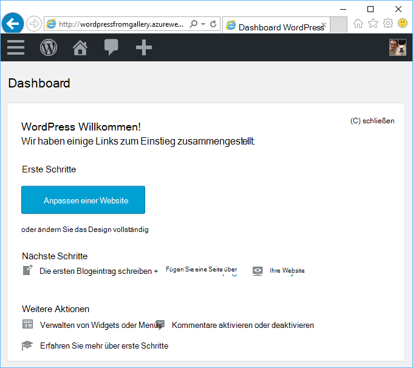
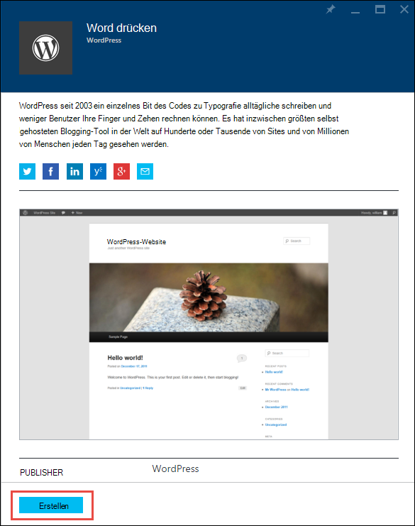
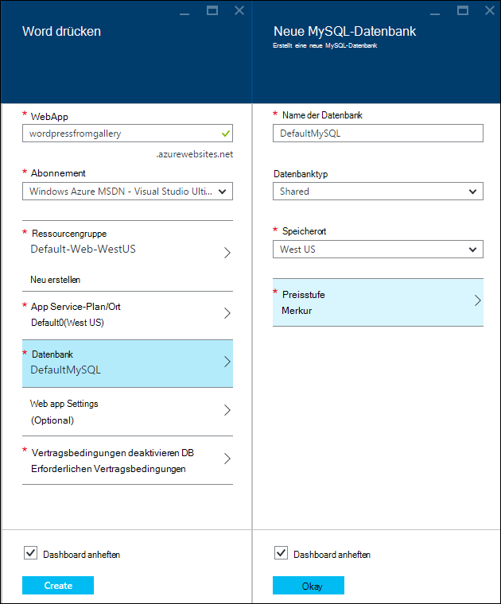
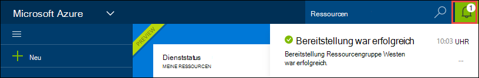
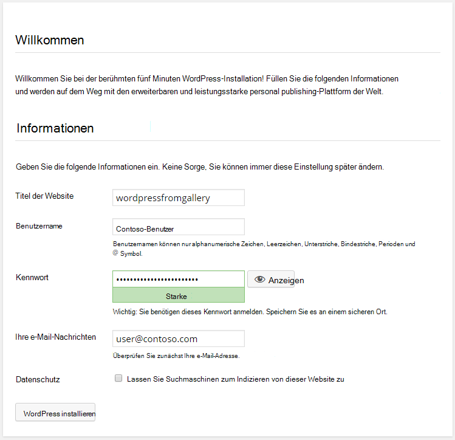

<properties
    pageTitle="WordPress Web app in Azure App Service erstellen | Microsoft Azure"
    description="So erstellen Sie eine neue Azure Web app für einen WordPress Blog mithilfe der Azure-Portal."
    services="app-service\web"
    documentationCenter="php"
    authors="rmcmurray"
    manager="wpickett"
    editor=""/>

<tags
    ms.service="app-service-web"
    ms.workload="na"
    ms.tgt_pltfrm="na"
    ms.devlang="PHP"
    ms.topic="hero-article"
    ms.date="08/11/2016"
    ms.author="robmcm"/>

# Erstellen Sie WordPress Web app in Azure App Service

[AZURE.INCLUDE [tabs](../../includes/app-service-web-get-started-nav-tabs.md)]

Dieses Lernprogramm zeigt WordPress-Blog-Website von Azure Marketplace bereitstellen.

Wenn Sie das Lernprogramm abgeschlossen haben müssen Sie eigene WordPress Blog-Site und in der Cloud ausgeführt.

Sie erfahren:

* Wie Sie Vorlage einer Anwendung in Azure Marketplace.
* Eine Webanwendung in Azure App Service erstellen, die auf der Vorlage basiert
* Konfigurieren von Azure App Einstellungen für neue Webanwendung und Datenbank

Azure-Markt wird eine Vielzahl von gängigen webapps entwickelt von Microsoft, Firmen und open-Source-Software Initiativen. Web apps basieren auf eine Vielzahl beliebter Frameworks, wie [PHP](/develop/nodejs/) in diesem WordPress Beispiel, [.NET](/develop/net/) [Node.js](/develop/nodejs/), [Java](/develop/java/)und [Python](/develop/python/)zu nennen. Erstellen eine Webanwendung von Azure Marketplace nur Software müssen Sie ist der Browser, den Verwendung der [Azure-Portal](https://portal.azure.com/). 

WordPress-Website, die Sie in diesem Lernprogramm bereitstellen verwendet MySQL für die Datenbank. Wenn Sie SQL-Datenbank für die Datenbank verwenden möchten, finden Sie unter [Project Nami](http://projectnami.org/). **Projekt-Nami** steht auch über den Markt.

> [AZURE.NOTE]
> Um dieses Lernprogramm benötigen Sie ein Microsoft Azure-Konto. Wenn Sie ein Konto haben, können Sie [Ihre Visual Studio-Abonnementvorteile aktivieren](/pricing/member-offers/msdn-benefits-details/?WT.mc_id=A261C142F) oder [Registrieren Sie sich für eine kostenlose Testversion](/en-us/pricing/free-trial/?WT.mc_id=A261C142F).
>
> Wenn Sie mit Azure App Service beginnen, bevor Sie für ein Azure-Konto, gehen Sie [versuchen App](http://go.microsoft.com/fwlink/?LinkId=523751)Service. Dort sofort können eine kurzlebige Starter Web app in App Service – keine Kreditkarte und keine Zusagen.

## Wählen Sie WordPress und für Azure App Service konfigurieren

1. [Azure-Portal](https://portal.azure.com/)anmelden.

2. **Klicken Sie auf.**
    
    ![Neu erstellen][5]
    
3. Suchen Sie **WordPress**, und klicken Sie dann auf **WordPress**. Wenn statt MySQL SQL-Datenbank verwenden möchten, suchen Sie nach **Projekt Nami**.

    ![WordPress aus][7]
    
5. Lesen die Beschreibung der WordPress app, klicken Sie auf **Erstellen**.

    

4. Geben Sie einen Namen für die Webanwendung im **WebApp** .

    Dieser Name muss in der Domäne *.azurewebsites.NET da URL Web App {Name} werden. *.azurewebsites.NET. Wenn der eingegebene Name nicht eindeutig ist, wird im Feld ein rotes Ausrufezeichen angezeigt.

8. Wenn Sie über mehrere Abonnements verfügen, wählen Sie verwenden möchten. 

5. Wählen Sie eine **Ressourcengruppe** oder erstellen Sie eine neue.

    Weitere Informationen zu Ressourcengruppen finden Sie unter [Übersicht über Azure Ressource-Manager](../azure-resource-manager/resource-group-overview.md).

5. Wählen Sie eine **App Plan/Speicherort** oder erstellen Sie eine neue.

    Weitere Informationen zu App Service-Pläne Übersicht [Azure App Service-Pläne](../azure-web-sites-web-hosting-plans-in-depth-overview.md) 

7. Klicken Sie auf **Datenbank**, und dann Blatt **Neue MySQL-Datenbank** die erforderlichen Werte für die MySQL-Datenbank konfigurieren.

    ein. Geben Sie einen neuen Namen, oder übernehmen Sie den Standardnamen.

    b. Lassen Sie die **Datenbanktyp** **freigegeben**.

    c. Wählen Sie dieselbe wie für das Web app haben.

    d. Wählen Sie einen Tarif. Mercury (minimal zulässige und Speicherplatz frei) ist für dieses Lernprogramm in Ordnung.

8. Das Blade **Neue MySQL-Datenbank** klicken Sie auf **OK**. 

8. Blatt **WordPress** akzeptieren Sie die Vertragsbedingungen, und klicken Sie auf **Erstellen**. 

    

    Azure App Service erstellt Web app normalerweise in weniger als einer Minute. Sie können den Fortschritt anschauen Glockensymbol oben auf der Portalseite.

    

## Starten Sie und verwalten Sie Ihrer Anwendung WordPress
    
7. Abschließend Web app erstellen Navigieren in Azure-Verwaltungsportal Ressourcengruppe, in der die Anwendung erstellt, und sehen Sie die Webanwendung und Datenbank.

    Zusätzliche Ressourcen mit dem Symbol Glühbirne ist [Application Insights](/services/application-insights/)Überwachungsdienste für Ihr Web app bietet.

1. Klicken Sie auf Web app Zeile Blatt **Ressourcengruppe** .

    

2. Klicken Sie auf **Durchsuchen**, Web app Blatt.

    ![Website-URL][browse]

3. Geben Sie auf der Seite WordPress **Willkommen** WordPress erforderliche Konfigurationsinformationen ein und dann auf **WordPress installieren**.

    

4. Melden Sie sich mit den Anmeldeinformationen auf der Seite **Willkommen** erstellten.  

5. Die Seite Dashboard wird geöffnet.    

    

## Nächste Schritte

Sie haben gesehen, wie das Erstellen und Bereitstellen einer PHP Web app aus der Galerie. Weitere Informationen zur Verwendung von PHP in Azure finden Sie im [PHP-Entwicklercenter](/develop/php/).

Weitere Informationen zum Arbeiten mit App Service Web Apps finden Sie Links auf der linken Seite der Seite (für Breite Browserfenster) oder am oberen Rand der Seite (für schmale Browserfenster). 

## Was hat sich geändert
* Finden Sie eine Anleitung zur Änderung von Websites App Service [Azure App Service und ihre Auswirkung auf vorhandene Azure Services](http://go.microsoft.com/fwlink/?LinkId=529714).

[5]: ./media/web-sites-php-web-site-gallery/startmarketplace.png
[7]: ./media/web-sites-php-web-site-gallery/search-web-app.png
[browse]: ./media/web-sites-php-web-site-gallery/browse-web.png
