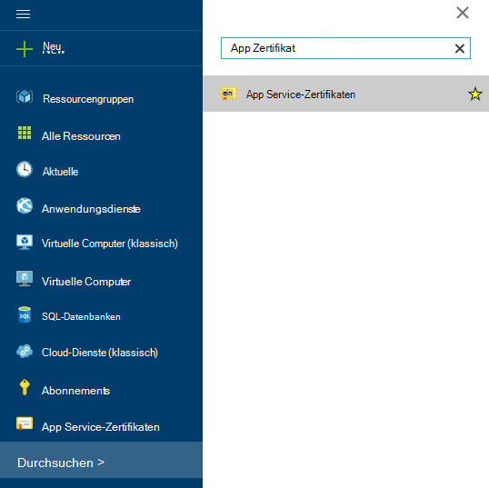
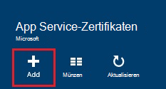
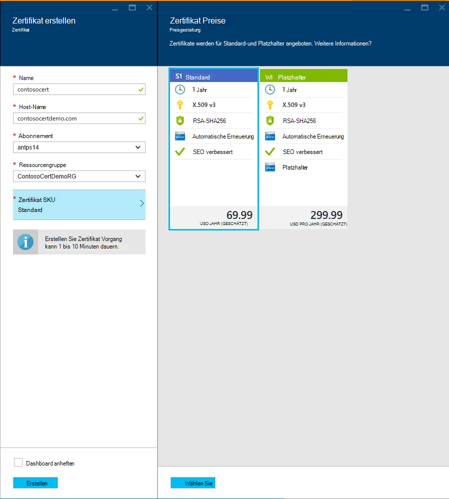
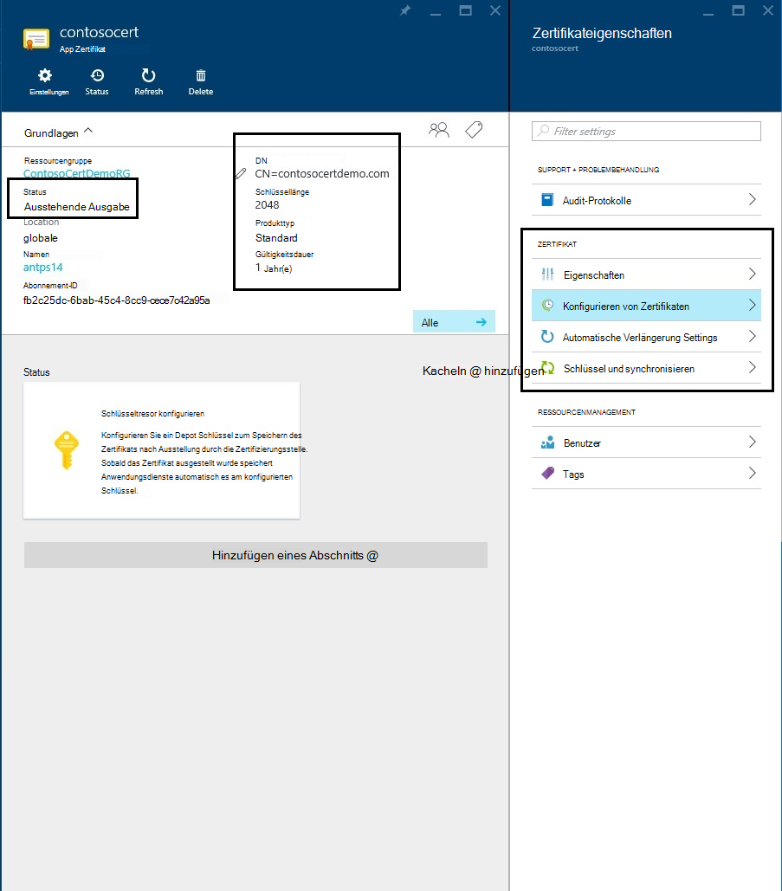
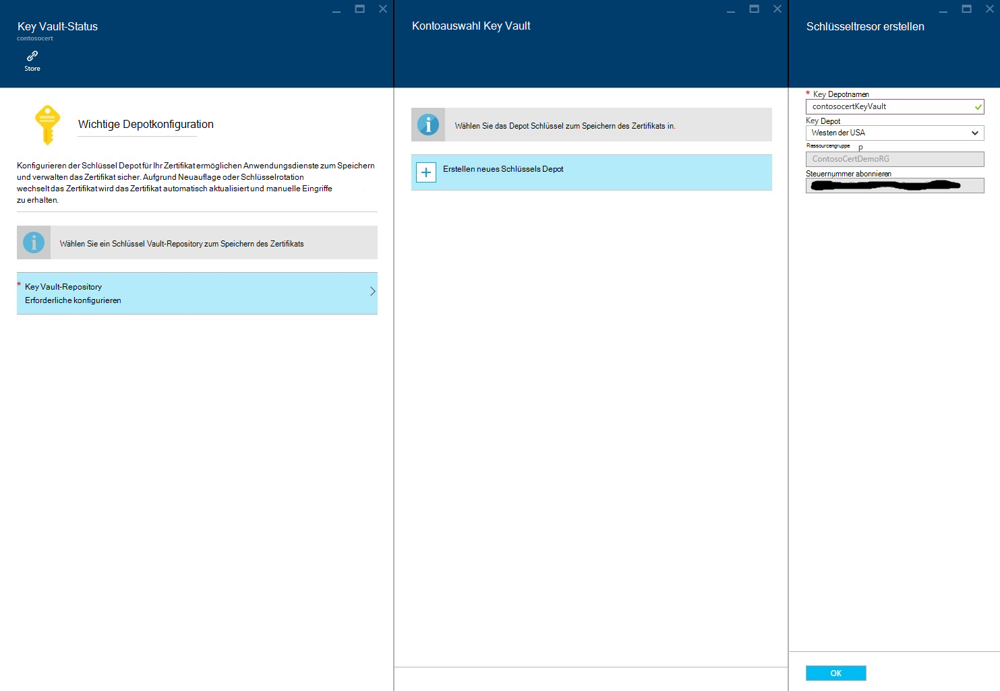
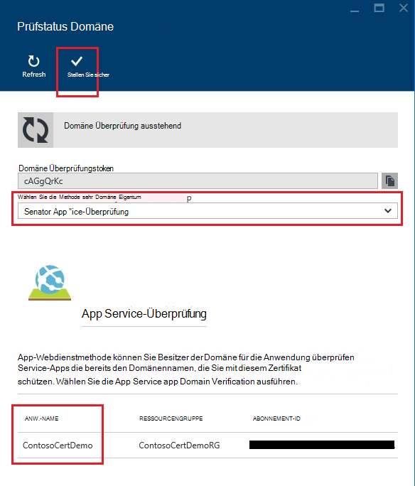
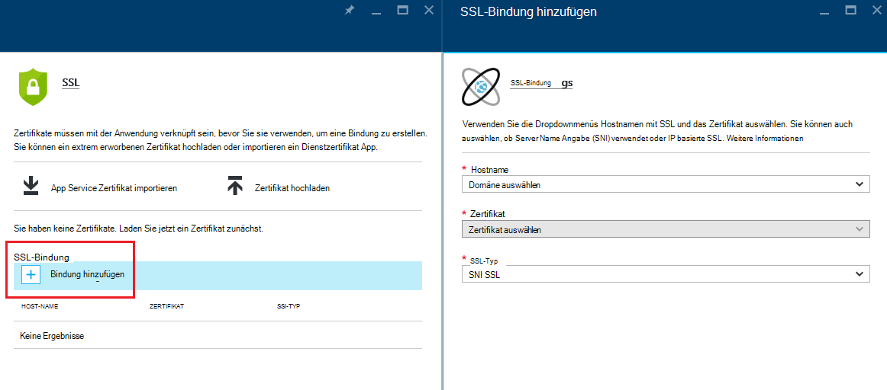
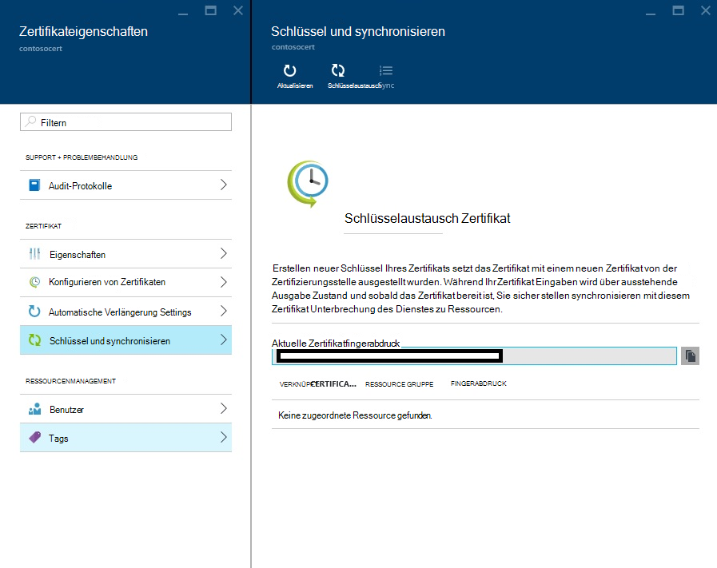

<properties
    pageTitle="Kaufen und konfigurieren ein SSL-Zertifikat für Azure App Service"
    description="Informationen Sie zum Kauf und konfigurieren ein SSL-Zertifikat für Azure App Service."
    services="app-service"
    documentationCenter=".net"
    authors="apurvajo"
    manager="stefsch"
    editor="cephalin"
    tags="buy-ssl-certificates"/>

<tags
    ms.service="app-service"
    ms.workload="na"
    ms.tgt_pltfrm="na"
    ms.devlang="na"
    ms.topic="article"
    ms.date="09/19/2016"
    ms.author="apurvajo"/>

#Kaufen und konfigurieren ein SSL-Zertifikat für Azure App Service

> [AZURE.SELECTOR]
- [SSL-Zertifikat in Azure kaufen](web-sites-purchase-ssl-web-site.md)
- [Verwenden Sie SSL-Zertifikat aus](web-sites-configure-ssl-certificate.md)

**[Azure App Service](http://go.microsoft.com/fwlink/?LinkId=529714)** bereits aktiviert standardmäßig HTTPS für Ihre Web ein Platzhalterzertifikat für die *. *.azurewebsites.NET-Domäne. Wenn Sie eine benutzerdefinierte Domäne konfigurieren möchten, können Sie den Standard-HTTPS-Zertifikat profitieren. Wie alle * [Platzhalterdomänen](https://casecurity.org/2014/02/26/pros-and-cons-of-single-domain-multi-domain-and-wildcard-certificates), es ist nicht so sicher wie Ihr eigenes Zertifikat mit einer benutzerdefinierten Domäne. Azure App Service bietet nun wirklich vereinfacht erwerben und ein SSL-Zertifikat von Azure-Portal verwalten, ohne das Portal zu verlassen.  
Dieser Artikel erläutert die kaufen und konfigurieren ein SSL-Zertifikat für Ihren **[Azure App Service](http://go.microsoft.com/fwlink/?LinkId=529714)** in 3 Schritten. 

> [AZURE.NOTE]
> SSL-Zertifikate für benutzerdefinierte Domänennamen kann frei und Shared Web App verwendet werden. Sie müssen Ihrer Anwendung Basic, Standard oder Premium-Modus konfigurieren ändern können, wie viel Sie für Ihr Abonnement abgerechnet. Weitere Informationen finden Sie unter **[Web Apps Preisdetails](https://azure.microsoft.com/pricing/details/web-sites/)** .

##Übersicht
> [AZURE.NOTE]
> Bitte versuchen Sie nicht, erwerben ein SSL-Zertifikat mithilfe eines Abonnements, die keiner aktiven Kreditkarte zugeordnet. Ihr Abonnement deaktiviert möglich. 

##<a>Erwerben, speichern und SSL-Zertifikat für Ihre benutzerdefinierte domain</a>
Für eine benutzerdefinierte Domäne, z. B. contoso.com, HTTPS aktivieren müssen ** [Konfigurieren Sie einen benutzerdefinierten Domänennamen in Azure App Service.](web-sites-custom-domain-name.md)**

Bevor Sie ein SSL-Zertifikat anfordern, müssen Sie zunächst ermitteln, welche Domänennamen vom Zertifikat gesichert werden. Dadurch wird bestimmt, welche Art von Zertifikat erhalten muss. Möchten Sie nur einem einzigen Domänennamen "contoso.com" oder www.contoso.com (basic) Standard sichere reicht Zertifikat. Benötigen Sie mehrere Domänennamen "contoso.com" www.contoso.com und mail.contoso.com sichern können ** [Platzhalterzertifikat](http://en.wikipedia.org/wiki/Wildcard_certificate) erhalten Sie**

##Schritt 0: Bestellung SSL-Zertifikat

In diesem Schritt erfahren Sie, wie Sie ein SSL-Zertifikat Ihrer Wahl bestellen.

1.  In **[Azure-Portal](https://portal.azure.com/)**auf Durchsuchen "App Dienstzertifikate" und geben in Suchleiste Ergebnis und klicken "App Dienstzertifikate" auswählen. 

    

    

2.  Geben Sie **Namen** für das SSL-Zertifikat.

3.  **Hostnamen** eingeben
> [AZURE.NOTE]
    Dies ist der wichtigste Teil der Kaufvorgang. Geben Sie korrekte Hostname (benutzerdefinierte Domäne) ein, die Sie mit diesem Zertifikat schützen möchten. Fügen **Nicht** den Hostnamen mit WWW. Beispielsweise wenn Ihre benutzerdefinierten Domänennamen www.contoso.com Hostname geben Sie contoso.com, schützen das fragliche Zertifikat Www und der Stammdomäne. 
    
4.  Wählen Sie Ihr **Abonnement**. 

    Haben Sie mehrere Abonnements stellen Sie ein SSL-Zertifikat im gleichen Abonnement Ihrer benutzerdefinierten Domäne oder Web App Verwendung betreffenden erstellen.
       
5.  Wählen Sie oder erstellen Sie eine **Ressourcengruppe**.

    Ressourcengruppen können Sie verwandte Azure Ressourcen als Einheit und sind hilfreich bei rollenbasierte (RBAC) Zugriffssteuerungsregeln für Ihre apps. Weitere Informationen finden Sie unter Verwalten von Azure Ressourcen.
     
6.  Wählen Sie das **Zertifikat SKU** 

    Schließlich wählen Sie das Zertifikat SKU, die Ihrem Bedarf entspricht, und klicken Sie auf erstellen. Heute können Azure App Service Sie kaufen zwei verschiedene SKUs • S1-Zertifikat mit 1 Jahr Gültigkeit und automatische Verlängerung  
           • W1-Platzhalter-Zertifikat mit 1 Jahr Gültigkeit und automatische Erneuerung      
    Weitere Informationen finden Sie unter **[Web Apps Preisdetails](https://azure.microsoft.com/pricing/details/web-sites/)** .

> [AZURE.NOTE]
> Erstellen von SSL-Zertifikaten wird von 1 bis 10 Minuten dauern. Dieser Prozess führt mehrere Schritte im Hintergrund, die ansonsten sehr mühsam manuell durchführen.  

##Schritt 1: Speichern Sie das Zertifikat in Azure Key Vault

In diesem Schritt erfahren Sie, wie einem Speicher ein SSL-Zertifikat, die in Azure Schlüssel Depot Ihrer Wahl erworben.

1.  Wenn das SSL-Zertifikat Kauf müssen Sie manuell Blade **App Dienstzertifikate** Ressource öffnen, indem es erneut (siehe Schritt 1 oben)   

    

    Sie werden bemerken, dass Zertifikatstatus **"Ausstehende Ausgabe"** gibt es einige weitere Schritte durchführen, bevor diese Zertifikate verwenden müssen.
 
2. Klicken Sie auf **"Zertifikat"** Zertifikateigenschaften Blade und klicken Sie auf dieses Zertifikat in Azure Key Vault speichern **"Schritt 1: Speichern"** .

3.  **"Key Vault Status"** Blade-klicken Sie auf **"Key Vault-Repository"** eine vorhandene Schlüssel Depot, um dieses Zertifikat **oder "Erstellen neuer Schlüssel"** neuer Schlüssel Depot innerhalb derselben Gruppe Abonnement und Ressource auswählen.
 
    
 
    > [AZURE.NOTE]
    Azure Key Vault hat sehr geringe Gebühren für dieses Zertifikat speichern. Weitere Informationen finden Sie unter **[Azure Key Vault Preisdetails](https://azure.microsoft.com/pricing/details/key-vault/)** .

4. Nach Auswahl Schlüssel Depot Repository zum Speichern dieses Zertifikats in fortfahren und auf **"Speichern"** oben **"Key Vault Status"** Blade speichern.  

    Führen diese Schritt zum Speichern des Zertifikats Kauf mit Azure Schlüssel Ihrer Wahl. Beim Aktualisieren des Blades sollte Grün Überprüfen gegen diesen Schritt ebenfalls markiert angezeigt.
    
##Schritt 2: Überprüfen des Domäne Besitz

In diesem Schritt erfahren Sie Domäne Besitz Überprüfung für ein SSL-Zertifikat durchführen, die Sie soeben bestellt. 

1.  Klicken Sie auf **"Schritt 2: Überprüfen"** Schritt aus dem Blade **"Zertifikatkonfiguration"** . Es gibt 4 Arten von Domäne Überprüfung von App Service Zertifikate unterstützt.

    * **App Service-Überprüfung** 
    
        * Dies ist der einfachste Vorgang bereits **Ihre benutzerdefinierte Domain App Service Apps zugewiesen.** Diese Methode listet alle App Service Apps, die diese Kriterien erfüllen. 
           Beispielsweise bei **contosocertdemo.com** ist eine benutzerdefinierte App Service-Anwendung namens **"ContosoCertDemo"** zugeordnet und daher, das ist die einzige App Service App hier. Würde mit mehreren Bereitstellung, würde es sie alle Regionen aufzulisten.
        
           Die Überprüfung ist nur für Einkäufe (Basic) Zertifikat. Platzhalter-Zertifikaten überspringen und Option B, C oder D unten verschieben.
        * Klicken Sie auf **"Überprüfen"** klicken, um diesen Schritt abzuschließen.
        * Klicken Sie auf **'Aktualisieren'** Status der nach Überprüfung aktualisiert. Es dauert einige Minuten Überprüfung abgeschlossen.
        
             

    * **Domäne überprüfen** 

        * Dies ist der bequemste Prozess **nur, wenn** Sie **[Ihre benutzerdefinierte Domain von Azure App Service erworben.](custom-dns-web-site-buydomains-web-app.md)**
        
        * Klicken Sie auf **"Überprüfen"** klicken, um diesen Schritt abzuschließen.
        
        * Klicken Sie auf **'Aktualisieren'** Status der nach Überprüfung aktualisiert. Es dauert einige Minuten Überprüfung abgeschlossen.

    * **E-Mail-Überprüfung**
        
        * E-Mail wurde bereits dieser benutzerdefinierten Domäne e-Mail-Adresse(n) gesendet.
         
        * Öffnen Sie die e-Mail und klicken Sie auf den Bestätigungslink Schritts der e-Mail-Überprüfung. 
        
        * Möchten Sie die Überprüfung e-Mail senden klicken Sie auf die Schaltfläche **"E-Mail senden"** .
         
    * **Manuelle Überprüfung**    
                 
        1. **HTML-Webseite Überprüfung**
        
            * Erstellen Sie eine HTML-Datei mit dem Namen **{Domäne Überprüfung Token}**HTML (Sie können das Token vom Domain Verification Status Blade kopieren)
            
            * Inhalt dieser Datei exakte übereinstimmenden Namen **Domain Verification**Token sollte.
            
            * Laden dieser Datei im Stammverzeichnis der Webserver für Ihre Domäne.
            
            * Klicken Sie auf **'Aktualisieren'** Status der nach Überprüfung aktualisiert. Es dauert einige Minuten Überprüfung abgeschlossen.
            
            Z. B. Wenn Sie ein Zertifikat für contosocertdemo.com mit Domäne Überprüfung Token **'cAGgQrKc'** kaufen dann eine Webanfrage an **'http://contosocertdemo.com/cAGgQrKc.html'** sollte zurückgeben **cAGgQrKc.**
        2. **Überprüfung der DNS TXT-Datensatz**

            * Mithilfe der DNS-Manager erstellen TXT-Eintrag für die Domäne **'DZC'** mit Wert entspricht der **Domäne Überprüfung Token.**
            
            * Klicken Sie auf **'Aktualisieren'** Status der nach Überprüfung aktualisiert. Es dauert einige Minuten Überprüfung abgeschlossen.
                              
            Um z. B. ein Platzhalterzertifikat mit Hostnamen Validierung ** \*. contosocertdemo.com** oder ** \*. subdomain.contosocertdemo.com** und Domäne Überprüfung Token **cAGgQrKc**dzc.contosocertdemo.com mit einen TXT-Datensatz erstellen müssen **cAGgQrKc.**     

##Schritt 3: App Service-App Zertifikat zuweisen

In diesem Schritt erfahren Sie, wie diese neu erworbenen Zertifikat App Service Apps. 

> [AZURE.NOTE]
> Vor dem Ausführen der Schritte in diesem Abschnitt, müssen Sie einen benutzerdefinierten Domänennamen Ihrer app zugeordnet haben. Weitere Informationen finden Sie unter ** [einen benutzerdefinierten Domänennamen für Web App konfigurieren](web-sites-custom-domain-name.md)**

1.  Öffnen Sie in Ihrem Browser die ** [Azure Portal.](https://portal.azure.com/)**
2.  Klicken Sie auf die Option **App Service** links auf der Seite.
3.  Klicken Sie auf den Namen der Anwendung, die Sie dieses Zertifikat zuweisen möchten. 
4.  Klicken Sie in **Einstellung**auf **SSL-Zertifikate**
5.  Klicken Sie auf **Zertifikat importieren App** und wählen Sie das Zertifikat, das Sie gekauft

    

6. **SSL-Bindungen** Abschnitt auf **Bindungen hinzufügen**
7. Blatt **SSL-Bindung hinzufügen** mithilfe der Dropdown-Liste den Domänennamen mit SSL und das Zertifikat aus. Sie können auch auswählen, ob **[Server Name Angabe (SNI)](http://en.wikipedia.org/wiki/Server_Name_Indication)** verwendet oder IP basierte SSL.

    

       •    IP based SSL associates a certificate with a domain name by mapping the dedicated public IP address of the server to the domain name. This requires each domain name (contoso.com, fabricam.com, etc.) associated with your service to have a dedicated IP address. This is the traditional          method of associating SSL certificates with a web server.
       •    SNI based SSL is an extension to SSL and **[Transport Layer Security](http://en.wikipedia.org/wiki/Transport_Layer_Security)** (TLS) that allows multiple domains to share the same IP address, with separate security certificates for each domain. Most modern browsers (including Internet Explorer, Chrome, Firefox and Opera) support SNI, however older browsers may not support SNI. For more information on SNI, see the **[Server Name Indication](http://en.wikipedia.org/wiki/Server_Name_Indication)** article on Wikipedia.
       
7. Klicken Sie zum Speichern der und SSL aktivieren **Bindung hinzufügen** .

Wenn **IP basierte SSL** aktiviert und Ihre benutzerdefinierte Domain über einen A-Eintrag konfiguriert ist, müssen Sie die folgenden zusätzlichen Schritte ausführen:

* Nach der Konfiguration eine IP-basierten SSL-Bindung, eine dedizierte IP-Adresse für Ihre Anwendung zugewiesen. Diese IP-Adresse finden Sie auf der Seite **benutzerdefinierte** unter Einstellung Ihrer Anwendung über den **Hostnamen** -Abschnitt. Es wird als **Externe IP-Adresse** aufgelistet
    
    

    Beachten Sie, dass diese IP-Adresse sich von der virtuellen IP-Adresse bereits ein Eintrag für die Domäne konfiguriert. Wenn Sie konfiguriert sind SNI SSL basierende oder nicht zur Verwendung von SSL konfiguriert, keine Adresse für diesen Eintrag aufgeführt.
    
2. Mit den Tools der Domänennamen-Registrierungsstelle, Ändern des A-Datensatzes für Ihren benutzerdefinierten Domänennamen auf die IP-Adresse aus dem vorherigen Schritt.
An diesem Punkt sollte können Ihre app mit HTTPS:// statt mit HTTP:// Überprüfen, ob das Zertifikat ordnungsgemäß konfiguriert wurde.

##Schlüssel und Zertifikat synchronisieren

1. Aus Gründen der Sicherheit sollten Sie immer das Zertifikat dann einfach einen erneuten Schlüsselaustausch Option **"Schlüssel und synchronisieren"** aus **"Zertifikateigenschaften"** Blade. 

2. Klicken Sie auf **"Schlüssel"** das initiieren. Dieser Vorgang kann 1 bis 10 Minuten dauern. 

    

3. Erstellen neuer Schlüssel Ihres Zertifikats setzt das Zertifikat mit einem neuen Zertifikat von der Zertifizierungsstelle ausgestellt wurden.
4. Sie werden nicht für die Lebensdauer des Zertifikats Rekeying berechnet werden. 
5. Erstellen neuer Schlüssel Ihres Zertifikats gehen über ausstehende Ausgabe Zustand. 
6. Sobald das Zertifikat bereit ist sicherzustellen Sie, dass Ihre Ressourcen unter Verwendung dieses Zertifikats Unterbrechung des Dienstes zu synchronisieren.
7. Synchronisierungsoption ist nicht verfügbar für Zertifikate Web App noch nicht zugeordnet werden. 

## Weitere Ressourcen ##
- [Aktivieren Sie HTTPS für eine Anwendung in Azure App Service](web-sites-configure-ssl-certificate.md)
- [Kaufen und einen benutzerdefinierten Domänennamen in Azure App Service konfigurieren](custom-dns-web-site-buydomains-web-app.md)
- [Microsoft Azure Trust Center](/support/trust-center/security/)
- [Konfigurationsoptionen in Azure Websites entsperrt](http://azure.microsoft.com/blog/2014/01/28/more-to-explore-configuration-options-unlocked-in-windows-azure-web-sites/)
- [Azure-Verwaltungsportal](https://manage.windowsazure.com)

>[AZURE.NOTE] Wenn Sie mit Azure App Service beginnen, bevor Sie sich für ein Azure-Konto, gehen Sie [Versuchen App Service](http://go.microsoft.com/fwlink/?LinkId=523751)sofort eine kurzlebige Starter Web app in App Service können Sie erstellen. Keine Kreditkarten erforderlich; keine Zusagen.

