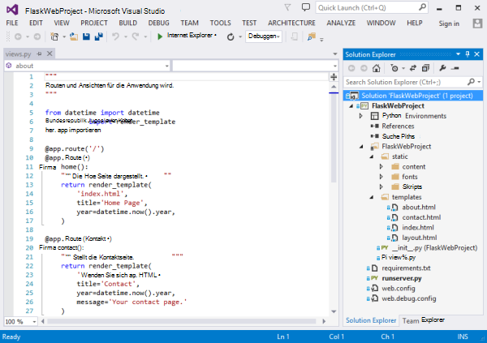
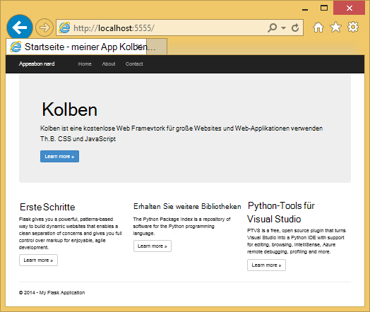
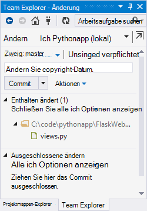
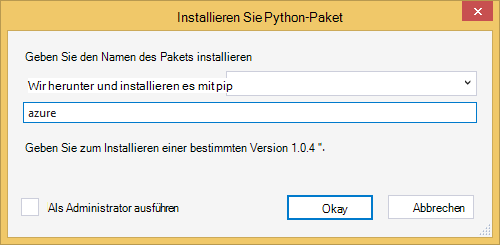
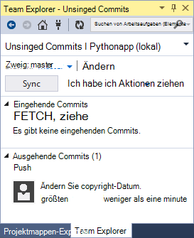
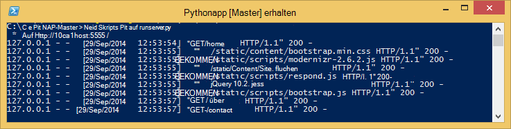
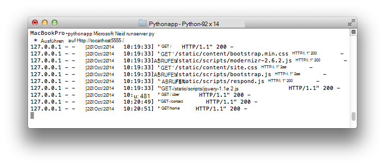
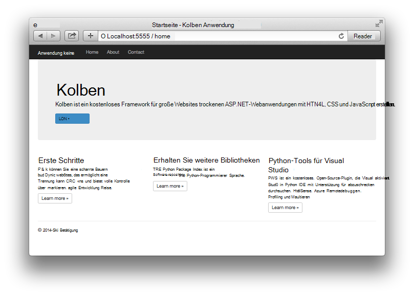

<properties 
    pageTitle="Web Apps mit Kolben in Azure" 
    description="Ein Lernprogramm, durch die eine Python Web app in Azure ausgeführt wird." 
    services="app-service\web" 
    documentationCenter="python"
    tags="python"
    authors="huguesv" 
    manager="wpickett" 
    editor=""/>

<tags 
    ms.service="app-service-web" 
    ms.workload="web" 
    ms.tgt_pltfrm="na" 
    ms.devlang="python" 
    ms.topic="article" 
    ms.date="02/20/2016"
    ms.author="huvalo"/>

# Web Apps mit Kolben in Azure

In diesem Lernprogramm beschreibt wie Python in [Azure App Service Web Apps](http://go.microsoft.com/fwlink/?LinkId=529714)ausgeführt.  Web Apps bietet begrenzten kostenlosen hosting und schnelle Bereitstellung und Python können!  Wachstum Ihrer app Sie können bezahlten hosting, und Sie können auch in der Azure Services integrieren.

Erstellen Sie eine Anwendung mit Kolben Webframework (Siehe alternative Versionen dieses Lernprogramms für [Django](web-sites-python-create-deploy-django-app.md) und [Flasche](web-sites-python-create-deploy-bottle-app.md)).  Sie erstellen die Website von Azure Gallery, Git Bereitstellung einrichten und Klonen von lokal im Repository.  Dann die Anwendung lokal ausführen, ändern, commit und schieben Sie sie in Azure.  Das Tutorial zeigt Vorgehensweise von Windows oder Linux Mac.

[AZURE.INCLUDE [create-account-and-websites-note](../../includes/create-account-and-websites-note.md)]

>[AZURE.NOTE] Wenn Sie mit Azure App Service beginnen, bevor Sie sich für ein Azure-Konto, gehen Sie [Versuchen App Service](http://go.microsoft.com/fwlink/?LinkId=523751)sofort eine kurzlebige Starter Web app in App Service können Sie erstellen. Keine Kreditkarten erforderlich; keine Zusagen.

## Erforderliche Komponenten

- Windows, Mac und Linux
- Python 2.7 oder 3.4
- Setuptools, Pip, Virtualenv (nur Python 2.7)
- Git
- [Python-Tools für Visual Studio][] (PTVS) - Hinweis: optional

**Hinweis**: TFS veröffentlichen wird derzeit nicht für Python-Projekte unterstützt.

### Windows

Haben Sie bereits Python 2.7 oder 3.4 installiert (32 Bit), empfehlen wir [Azure SDK für Python 2.7] oder [Azure SDK für Python 3.4] mit Webplattform-Installer installieren.  32-Bit-Version von Python, Setuptools, Pip, Virtualenv usw. (32-Bit-Python ist in Azure Hostcomputer installierten) installiert.  Alternativ erhalten Sie Python von [python.org].

Git empfohlen [Git für Windows] oder [GitHub für Windows].  Wenn Sie Visual Studio verwenden, können Sie die integrierte Git Unterstützung.

Es wird empfohlen, [Python Tools 2.2 für Visual Studio]installieren.  Optional, aber haben Sie [Visual Studio], z. B. kostenlose Visual Studio Community 2013 oder Visual Studio Express 2013 Web dann Dies wird Ihnen eine große Python-IDE.

### Mac-Linux

Sie sollte Python und Git installiert, aber Vergewissern Sie Python 2.7 oder 3.4.

## WebApp Azure-Portal erstellen

Der erste Schritt beim Erstellen Ihrer Anwendung ist Web app [Azure-Portal](https://portal.azure.com)erstellen. 

1. Azure-Portal melden Sie an und auf die Schaltfläche **neu** in der unteren linken Ecke. 
2. Klicken Sie auf **Web + Mobile**.
3. Geben Sie im Suchfeld "Python".
4. Wählen Sie in den Suchergebnissen **Kolben**, und klicken Sie auf **Erstellen**.
5. Konfigurieren der Kolben app beispielsweise einen neuen App Service-Plan und eine neue Ressourcengruppe dafür erstellen. Klicken Sie dann auf **Erstellen**.
6. Konfigurieren Sie Git Veröffentlichung Ihrer neu erstellten Anwendung wie bei [Lokalen Git Bereitstellung Azure App Service](app-service-deploy-local-git.md).

## Anwendungsübersicht

### Git Repository-Inhalte

Hier wird eine Übersicht über die Dateien, die Sie im ursprünglichen Git Repository finden wir im nächsten Abschnitt geklont werden.

    \FlaskWebProject\__init__.py
    \FlaskWebProject\views.py
    \FlaskWebProject\static\content\
    \FlaskWebProject\static\fonts\
    \FlaskWebProject\static\scripts\
    \FlaskWebProject\templates\about.html
    \FlaskWebProject\templates\contact.html
    \FlaskWebProject\templates\index.html
    \FlaskWebProject\templates\layout.html

Hauptquellen für die Anwendung.  Umfasst 3 Seiten (Index über Kontakt) mit master.  Statische Inhalte und Skripts einschließen Bootstrap und Jquery, Modernizr reagieren.

    \runserver.py

Lokale Entwicklung Server unterstützt. Können Sie die Anwendung lokal ausgeführt.

    \FlaskWebProject.pyproj
    \FlaskWebProject.sln

Projektdateien mit [Python-Tools für Visual Studio].

    \ptvs_virtualenv_proxy.py

IIS-Proxy für virtuelle und PTVS remote debugging-Unterstützung.

    \requirements.txt

Externe Pakete von der Anwendung benötigt. Das Bereitstellungsskript pip in dieser Datei aufgeführten Pakete installieren.
 
    \web.2.7.config
    \web.3.4.config

IIS-Konfigurationsdateien.  Das Bereitstellungsskript verwenden die entsprechenden web.x.y.config und Web.config kopieren.

### Optionale Dateien - Bereitstellung anpassen

[AZURE.INCLUDE [web-sites-python-customizing-deployment](../../includes/web-sites-python-customizing-deployment.md)]

### Optionale Dateien - Python-Laufzeit

[AZURE.INCLUDE [web-sites-python-customizing-runtime](../../includes/web-sites-python-customizing-runtime.md)]

### Zusätzliche Dateien auf server

Einige Dateien auf dem Server vorhanden aber nicht in der Git Repository hinzugefügt.  Diese werden durch das Bereitstellungsskript erstellt.

    \web.config

IIS-Konfigurationsdatei.  Web.x.y.config für jede Bereitstellung erstellt.

    \env\

Python virtuelle Umgebung.  Während der Bereitstellung erstellt, wenn eine kompatible virtuelle Umgebung für die Anwendung vorhanden ist.  Pakete in requirements.txt aufgelistet sind Pip installiert, aber Pip überspringt Installation, wenn die Pakete installiert sind.

3 Abschnitte beschreiben die Webanwendungsentwicklung unter 3 verschiedenen Umgebungen fortsetzen:

- Windows Python-Tools für Visual Studio
- Windows Befehlszeile
- Mac/Linux Befehlszeile

## Webanwendungsentwicklung Python - Windows - Tools für Visual Studio

### Repository kopieren

Zuerst Klonen Sie Repository über die URL der Azure-Portal. Weitere Informationen finden Sie unter [Lokale Git Bereitstellung Azure App Service](app-service-deploy-local-git.md).

Öffnen Sie die Projektmappendatei (.sln), die in den Stamm des Repository enthalten.

### Erstellen Sie virtuelle Umgebung

Jetzt erstellen wir eine virtuelle Umgebung für die Entwicklung.  Klicken Sie auf select **Python-Umgebungen** **Virtuellen Umgebung hinzufügen**.

- Stellen Sie sicher, dass der Name der Umgebung `env`.

- Wählen Sie den Basis-Interpreter.  Vergewissern Sie sich auf die gleiche Version ausgewählt werden Python Ihrer Anwendung (in runtime.txt oder Blade **Einstellungen** von Ihrer Anwendung in Azure-Portal).

- Stellen Sie sicher, dass die Option zum Herunterladen und Installieren von Paketen aktiviert ist.

Klicken Sie auf **Erstellen**.  Dadurch wird die virtuelle Umgebung erstellen und installieren Abhängigkeiten in requirements.txt aufgelistet.

### Mit Development Server ausgeführt

Drücken Sie F5, um mit dem Debuggen beginnen und Webbrowser öffnet lokal ausgeführte Seite.

Sie können Haltepunkte Überwachungsfenster usw. in den Quellen verwenden.  [Python-Tools für Visual Studio-Dokumentation] für Weitere Informationen zu den verschiedenen Features anzeigen

### Ändern

Jetzt können Sie durch Ändern der Anwendung Datenquellen oder Vorlagen experimentieren.

Nachdem Sie Ihre Änderungen getestet haben, bestätigen sie Git Repository:

### Weitere Pakete installieren

Die Anwendung möglicherweise Abhängigkeiten Python und Kolben.

Sie können zusätzliche Pakete mit Pip.  Zum Installieren eines Pakets mit der rechten Maustaste auf die virtuelle Umgebung, und wählen Sie **Python-Paket installieren**.

Geben Sie beispielsweise zum Azure SDK für Python, installieren Sie Azure-Speicher, Servicebus und andere Azure-Dienste zugreifen, `azure`:

Mit der rechten Maustaste auf die virtuelle Umgebung, und wählen Sie **generieren requirements.txt** requirements.txt aktualisieren.

Dann Änderungen Sie an requirements.txt Git Repository.

### In Azure bereitstellen

Klicken Sie auf **Sync** oder **Push**zum Auslösen einer Bereitstellung.  Synchronisierung ist sowohl ein Push-als auch ein.

Die erste Bereitstellung dauert einige Zeit wird eine virtuelle Umgebung, Installation usw. erstellen.

Visual Studio zeigt nicht den Fortschritt der Bereitstellung an.  Wenn Sie die Ausgabe lesen möchten, finden Sie im Abschnitt [Problembehandlung - Bereitstellung](#troubleshooting-deployment).

Navigieren Sie zum URL Azure Änderungen anzeigen.

## Web app Development - Windows - Befehlszeile

### Repository kopieren

Zunächst mit Hilfe des URLs der Azure-Portal Repository klonen und Azure Repository als Fernbedienung hinzufügen. Weitere Informationen finden Sie unter [Lokale Git Bereitstellung Azure App Service](app-service-deploy-local-git.md).

    git clone <repo-url>
    cd <repo-folder>
    git remote add azure <repo-url> 

### Erstellen Sie virtuelle Umgebung

Wir erstellen eine neue virtuelle Umgebung zu Entwicklungszwecken (werden nicht im Repository hinzugefügt).  Virtuelle in Python sind nicht verschiebbar, sodass jeder Entwickler die Anwendung lokal erstellen wird.

Vergewissern Sie sich auf die gleiche Version ausgewählt werden Python Ihrer Anwendung (in runtime.txt oder Blade **Einstellungen** von Ihrer Anwendung in Azure-Portal).

Für Python 2.7:

    c:\python27\python.exe -m virtualenv env

Für Python 3.4:

    c:\python34\python.exe -m venv env

Installieren Sie von der Anwendung benötigten externen Pakete. Die Datei requirements.txt können im Stamm des Repository Sie Pakete in einer virtuellen Umgebung installieren:

    env\scripts\pip install -r requirements.txt

### Mit Development Server ausgeführt

Starten Sie die Anwendung unter einem Entwicklungsserver mit dem folgenden Befehl:

    env\scripts\python runserver.py

Die Konsole zeigt den URL und Port des Servers überwacht:

Öffnen Sie den Webbrowser mit der URL.

### Ändern

Jetzt können Sie durch Ändern der Anwendung Datenquellen oder Vorlagen experimentieren.

Nachdem Sie Ihre Änderungen getestet haben, bestätigen sie Git Repository:

    git add <modified-file>
    git commit -m "<commit-comment>"

### Weitere Pakete installieren

Die Anwendung möglicherweise Abhängigkeiten Python und Kolben.

Sie können zusätzliche Pakete mit Pip.  Um Azure SDK für Python, installieren Sie Azure-Speicher, Servicebus und andere Azure-Dienste zugreifen, beispielsweise:

    env\scripts\pip install azure

Stellen Sie sicher, requirements.txt zu aktualisieren:

    env\scripts\pip freeze > requirements.txt

Änderungen:

    git add requirements.txt
    git commit -m "Added azure package"

### In Azure bereitstellen

Drücken Sie zum Auslösen einer Bereitstellung die Änderungen in Azure:

    git push azure master

Sie sehen die Ausgabe des Bereitstellungsskripts einschließlich virtuellen Umgebung, Installation von Paketen, Erstellung von web.config.

Navigieren Sie zum URL Azure Änderungen anzeigen.

## Web app Development - Mac/Linux - Befehlszeile

### Repository kopieren

Zunächst mit Hilfe des URLs der Azure-Portal Repository klonen und Azure Repository als Fernbedienung hinzufügen. Weitere Informationen finden Sie unter [Lokale Git Bereitstellung Azure App Service](app-service-deploy-local-git.md).

    git clone <repo-url>
    cd <repo-folder>
    git remote add azure <repo-url> 

### Erstellen Sie virtuelle Umgebung

Wir erstellen eine neue virtuelle Umgebung zu Entwicklungszwecken (werden nicht im Repository hinzugefügt).  Virtuelle in Python sind nicht verschiebbar, sodass jeder Entwickler die Anwendung lokal erstellen wird.

Vergewissern Sie sich auf die gleiche Version ausgewählt werden Python Ihrer Anwendung (in runtime.txt oder Blade **Einstellungen** von Ihrer Anwendung in Azure-Portal).

Für Python 2.7:

    python -m virtualenv env

Für Python 3.4:

    python -m venv env
oder Pyvenv env

Installieren Sie von der Anwendung benötigten externen Pakete. Die Datei requirements.txt können im Stamm des Repository Sie Pakete in einer virtuellen Umgebung installieren:

    env/bin/pip install -r requirements.txt

### Mit Development Server ausgeführt

Starten Sie die Anwendung unter einem Entwicklungsserver mit dem folgenden Befehl:

    env/bin/python runserver.py

Die Konsole zeigt den URL und Port des Servers überwacht:

Öffnen Sie den Webbrowser mit der URL.

### Ändern

Jetzt können Sie durch Ändern der Anwendung Datenquellen oder Vorlagen experimentieren.

Nachdem Sie Ihre Änderungen getestet haben, bestätigen sie Git Repository:

    git add <modified-file>
    git commit -m "<commit-comment>"

### Weitere Pakete installieren

Die Anwendung möglicherweise Abhängigkeiten Python und Kolben.

Sie können zusätzliche Pakete mit Pip.  Um Azure SDK für Python, installieren Sie Azure-Speicher, Servicebus und andere Azure-Dienste zugreifen, beispielsweise:

    env/bin/pip install azure

Stellen Sie sicher, requirements.txt zu aktualisieren:

    env/bin/pip freeze > requirements.txt

Änderungen:

    git add requirements.txt
    git commit -m "Added azure package"

### In Azure bereitstellen

Drücken Sie zum Auslösen einer Bereitstellung die Änderungen in Azure:

    git push azure master

Sie sehen die Ausgabe des Bereitstellungsskripts einschließlich virtuellen Umgebung, Installation von Paketen, Erstellung von web.config.

Navigieren Sie zum URL Azure Änderungen anzeigen.

## Problembehandlung - Paketinstallation

[AZURE.INCLUDE [web-sites-python-troubleshooting-package-installation](../../includes/web-sites-python-troubleshooting-package-installation.md)]

## Fehlerbehebung – virtuelle Umgebung

[AZURE.INCLUDE [web-sites-python-troubleshooting-virtual-environment](../../includes/web-sites-python-troubleshooting-virtual-environment.md)]

## Nächste Schritte

Folgen Sie diesen Links, um weitere Informationen zu Kolben und Python-Tools für Visual Studio: 
 
- [Kolben-Dokumentation]
- [Python-Tools für Visual Studio-Dokumentation]

Informationen zur Verwendung von Azure Table Storage und MongoDB:

- [Kolben und MongoDB Azure Python-Tools für Visual Studio]
- [Kolben und Azure Table Storage Azure Python-Tools für Visual Studio]

Weitere Informationen finden Sie auch im [Python Developer Center](/develop/python/).

## Was hat sich geändert
* Eine Anleitung zur Änderung von Websites zu App Service finden Sie unter: [Azure App Service und seine Auswirkung auf vorhandene Azure Services](http://go.microsoft.com/fwlink/?LinkId=529714)

<!--Link references-->
[Kolben und MongoDB Azure Python-Tools für Visual Studio]: https://github.com/microsoft/ptvs/wiki/Flask-and-MongoDB-on-Azure
[Kolben und Azure Table Storage Azure Python-Tools für Visual Studio]: web-sites-python-ptvs-flask-table-storage.md

<!--External Link references-->
[Azure SDK für Python 2.7]: http://go.microsoft.com/fwlink/?linkid=254281
[Azure SDK für Python 3.4]: http://go.microsoft.com/fwlink/?linkid=516990
[Python.org]: http://www.python.org/
[Git für Windows]: http://msysgit.github.io/
[GitHub für Windows]: https://windows.github.com/
[Python-Tools für Visual Studio]: http://aka.ms/ptvs
[Python 2.2-Tools für Visual Studio]: http://go.microsoft.com/fwlink/?LinkID=624025
[Visual Studio]: http://www.visualstudio.com/
[Python-Tools für Visual Studio-Dokumentation]: http://aka.ms/ptvsdocs
[Kolben-Dokumentation]: http://flask.pocoo.org/ 
 
