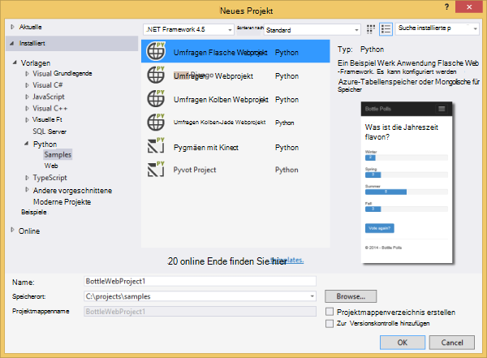
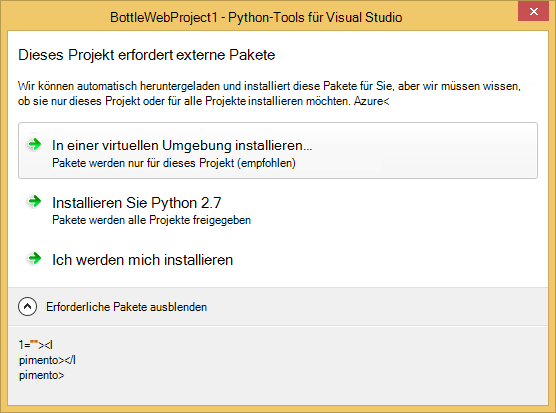
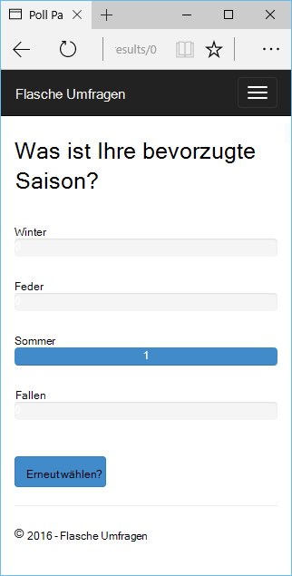
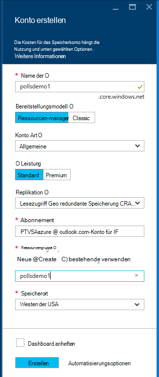
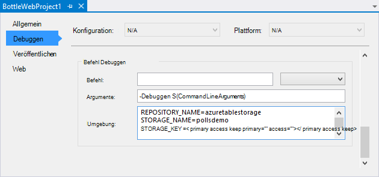
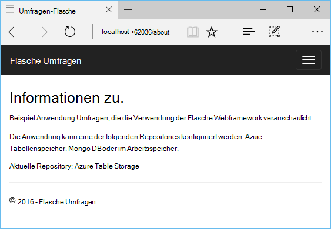
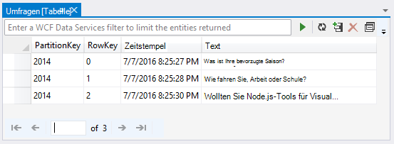
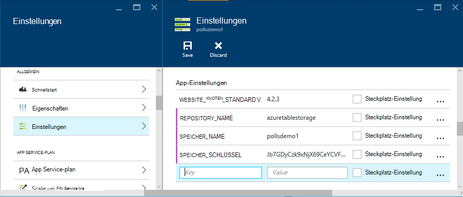
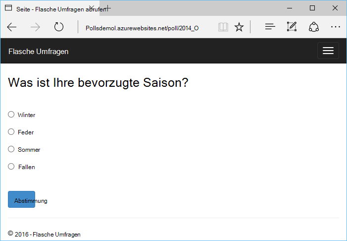

<properties 
    pageTitle="Flaschen und Azure Table Storage Azure mit Python 2.2 für Visual Studio" 
    description="Enthält Informationen zum Verwenden von Python-Tools für Visual Studio eine Flasche Anwendung erstellen, die Daten in Azure-Tabellenspeicher gespeichert und Web app Azure App Service Web Apps bereitstellen." 
    services="app-service\web" 
    documentationCenter="python" 
    authors="huguesv" 
    manager="wpickett" 
    editor=""/>

<tags 
    ms.service="app-service-web" 
    ms.workload="web" 
    ms.tgt_pltfrm="na" 
    ms.devlang="python" 
    ms.topic="article" 
    ms.date="07/07/2016"
    ms.author="huvalo"/>

# Flaschen und Azure Table Storage Azure mit Python 2.2 für Visual Studio 

[Python-Tools für Visual Studio] verwenden wir in diesem Lernprogramm erstellen Sie eine einfache Umfragen Web app eines PTVS Beispielvorlagen verwenden. Dieses Lernprogramm ist auch als [video](https://www.youtube.com/watch?v=GJXDGaEPy94)verfügbar.

Umfragen Web app definiert eine Abstraktion für das Repository zwischen verschiedenen Typen von Repositories (In-Memory-Azure-Tabellenspeicher MongoDB) umschalten können.

Wir lernen die Web app Azure-Tabellenspeicher Verwendung konfigurieren ein Azure Storage-Konto zu erstellen und zum [Azure App Service Web Apps](http://go.microsoft.com/fwlink/?LinkId=529714)Web app veröffentlichen.

Finden Sie weitere Artikel, die Entwicklung von Azure App Service Web Apps mit PTVS Flasche Kolben und Django Web Frameworks MongoDB, Azure-Tabellenspeicher, MySQL und SQL-Datenbank mit der [Python Developer Center] . Während konzentriert sich dieser Artikel auf App Service ähneln die Schritten [Azure Cloud Services]entwickeln.

## Erforderliche Komponenten

 - Visual Studio 2015
 - [Python 2.2-Tools für Visual Studio]
 - [Python 2.2-Tools für Visual Studio Samples VSIX]
 - [Azure SDK-Tools für VS 2015]
 - [Python 2.7 32-Bit-] oder [Python 3.4 32-bit]

[AZURE.INCLUDE [create-account-and-websites-note](../../includes/create-account-and-websites-note.md)]

>[AZURE.NOTE] Wenn Sie mit Azure App Service beginnen, bevor Sie sich für ein Azure-Konto, gehen Sie [Versuchen App Service](http://go.microsoft.com/fwlink/?LinkId=523751)sofort eine kurzlebige Starter Web app in App Service können Sie erstellen. Keine Kreditkarten erforderlich; keine Zusagen.

## Erstellen Sie das Projekt

In diesem Abschnitt erstellen wir ein Visual Studio-Projekt mit einer Beispielvorlage. Wir erstellen eine virtuelle Umgebung und erforderliche Pakete installieren. Führen Sie dann die Anwendung lokal im Arbeitsspeicher-Standard-Repository.

1.  Wählen Sie **Datei** **Neues Projekt**in Visual Studio.

1.  Die Projektvorlagen von [Python Tools 2.2 für Visual Studio Samples VSIX] stehen unter **Python** **Beispiele**. Wählen Sie **Umfragen Flasche Webprojekt** , und klicken Sie auf OK, um das Projekt zu erstellen.

    

1.  Sie werden aufgefordert, externe Pakete installieren. Wählen Sie **in einer virtuellen Umgebung installieren**.

    

1.  Wählen Sie als Basis-Interpreter **Python 2.7** oder **Python 3.4** .

    

1.  Bestätigen Sie, dass die Anwendung durch Drücken von `F5`. Die Anwendung verwendet eine speicherinterne Repository die erfordert keine Konfiguration. Alle Daten geht verloren, wenn der Webserver angehalten wird.

1.  Klicken Sie im Menü **Erstellen Beispiel Umfragen**abrufen und Abstimmung.

    

## Azure-Speicher registrieren

Um Speichervorgänge verwenden, benötigen Sie ein Konto Azure-Speicher. Erstellen Sie folgendermaßen ein Speicherkonto.

1.  [Azure-Portal](https://portal.azure.com/)anmelden.

1. Klicken Sie auf das **neue** Symbol oben links auf das Portal klicken **Daten + Speicher** > **Konto**.  Klicken Sie auf die Schaltfläche **Erstellen** Geben Sie dem Speicherkonto einen eindeutigen Namen und erstellen Sie eine neue [Ressourcengruppe](../azure-resource-manager/resource-group-overview.md) dafür.

    

    Beim Erstellen des Speicherkontos Schaltfläche **Benachrichtigungen** blinkt grün **Erfolg** und das Speicherkonto Blade um anzuzeigen, dass er die neue Ressourcengruppe gehört erstellten geöffnet ist.

1. Klicken Sie auf die **Zugriffstasten** an das Speicherkonto Blade. Beachten Sie den Kontonamen und key1.

    

    Wir benötigen diese Informationen zum Konfigurieren des Projekts im nächsten Abschnitt.

## Konfigurieren Sie das Projekt

In diesem Abschnitt konfigurieren wir unsere Anwendung das Speicherkonto, das wir gerade erstellt haben. Dann wird die Anwendung lokal ausgeführt.

1.  In Visual Studio mit der rechten Maustaste auf den Projektknoten im Projektmappen-Explorer, und wählen Sie **Eigenschaften**. Klicken Sie auf die Registerkarte **Debuggen** .

    

1.  Legen Sie die Werte von Umgebungsvariablen, die die Anwendung im **Serverbefehl Debuggen** **Umgebung**.

        REPOSITORY_NAME=azuretablestorage
        STORAGE_NAME=<storage account name>
        STORAGE_KEY=<primary access key>

    Dadurch wird die Umgebungsvariablen festgelegt Wenn Sie das **Debuggen starten**. Wenn die Variablen beim **Starten ohne Debuggen**festlegen sowie die gleichen Werte unter **Serverbefehl ausführen** festgelegt werden soll.

    Alternativ können Sie Umgebungsvariablen Bedienfeld Windows definieren. Dies ist eine bessere Option, wenn speichern Sie keine Anmeldeinformationen im Quellcode / Projektdatei. Beachten Sie, dass Visual Studio für die neue Umgebungswerte zu der Anwendung neu starten.

1.  Der Code, der zum Implementieren des Azure-Tabellenspeicher Repository ist in **models/azuretablestorage.py**. Siehe [Dokumentation] Weitere Informationen zur Verwendung von Python-Diensts.

1.  Führen Sie die Anwendung mit `F5`. Umfragen mit **Beispiel Umfragen erstellen** und die Daten stimmen erstellt werden in Azure-Tabellenspeicher serialisiert.

    > [AZURE.NOTE] Python 2.7 virtuellen Umgebung möglicherweise eine Ausnahme Break in Visual Studio.  Drücken Sie `F5` weiterhin Webprojekt geladen. 

1.  Wechseln Sie zu der Seite **zu** überprüfen, ob die Anwendung des **Azure-Tabellenspeicher** Repository.

    

## Untersuchen von Azure Table Storage

Es ist einfach anzeigen und Bearbeiten von Tabellen mit Cloud Explorer in Visual Studio. Server-Explorer verwenden wir in diesem Abschnitt Umfragen Anwendungstabellen anzuzeigen.

> [AZURE.NOTE] Dies erfordert Microsoft Azure Tools installiert werden, die als Teil des [Azure SDK für .NET].

1.  **Cloud-Explorer**zu öffnen. **Speicherkonten**das Speicherkonto dann **Tabellen**erweitern.

    

1.  Doppelklicken Sie auf die Tabelle **Umfragen** oder **Optionen** in einem Dokumentfenster als auch Elemente hinzufügen/entfernen/bearbeiten den Inhalt der Tabelle anzeigen.

    

## Azure App Service Web app veröffentlichen

Azure .NET SDK stellt eine einfache Möglichkeit für die Bereitstellung Ihrer Anwendung auf Azure App Service.

1.  Im **Projektmappen-Explorer**mit der rechten Maustaste auf den Projektknoten, und wählen Sie **Veröffentlichen**.

    

1.  Klicken Sie auf **Microsoft Azure webapps**.

1.  Klicken Sie auf **neu** , um eine neue Web app erstellen.

1.  Die folgenden Felder, und klicken Sie auf **Erstellen**.
    -   **Web App name**
    -   **App Service-plan**
    -   **Ressourcengruppe**
    -   **Region**
    -   **Datenbankserver** **keine Datenbank** festlegen lassen

1.  Übernehmen Sie alle Standardeinstellungen, und klicken Sie auf **Veröffentlichen**.

1.  Ihr Webbrowser öffnet veröffentlichtes Web App. Wenn Sie durchsuchen die Infoseite, sehen Sie, dass **Im Speicher** -Repository nicht **Azure-Tabellenspeicher** Repository verwendet.

    Das ist weil die Umgebungsvariablen nicht auf die Instanz Web Apps in Azure App Service in **settings.py**angegebenen Standardwerte verwendet.

## Web Apps-Instanz konfigurieren

In diesem Abschnitt werden wir Umgebungsvariablen für Web Apps Instanz konfigurieren.

1.  Im [Azure-Portal]öffnen Web app Blade **Durchsuchen** > **App Services** > Web app-Namen.

1.  Ihre Web app Blatt **Alle**klicken **Application Settings**.

1.  **App** -Einstellungen scrollen und die Werte für **REPOSITORY\_Namen**, **Speicher\_Namen** und **Speicher\_KEY** gemäß Abschnitt **Konfigurieren des Projekts** .

    

1.  Klicken Sie auf **Speichern**. Nach der Benachrichtigung, dass die Änderungen wurden erhalten haben, klicken Sie auf **Durchsuchen,** Web app main Blade.

1.  Web app erwartungsgemäß **Azure Table Storage** -Repository verwenden, sollte angezeigt werden.

    Herzlichen Glückwunsch!

    

## Nächste Schritte

Folgen Sie diesen Links erfahren Sie mehr über Python-Tools für Visual Studio, Flaschen und Azure-Tabellenspeicher.

- [Python-Tools für Visual Studio-Dokumentation]
  - [Webprojekte]
  - [Cloud-Dienst-Projekte]
  - [Remote-Debuggen auf Microsoft Azure]
- [Flasche Dokumentation]
- [Azure-Speicher]
- [Azure SDK für Python]
- [Verwendung den Tabellenspeicherdienst aus Python]

## Was hat sich geändert
* Eine Anleitung zur Änderung von Websites zu App Service finden Sie unter: [Azure App Service und seine Auswirkung auf vorhandene Azure Services](http://go.microsoft.com/fwlink/?LinkId=529714)

<!--Link references-->
[Python-Entwicklercenter]: /develop/python/
[Azure-Cloud-Dienste]: ../cloud-services-python-ptvs.md
[Dokumentation]: ../storage-python-how-to-use-table-storage.md
[Verwendung den Tabellenspeicherdienst aus Python]: ../storage-python-how-to-use-table-storage.md

<!--External Link references-->
[Azure-Portal]: https://portal.azure.com
[Azure SDK für .NET]: http://azure.microsoft.com/downloads/
[Python-Tools für Visual Studio]: http://aka.ms/ptvs
[Python 2.2-Tools für Visual Studio]: http://go.microsoft.com/fwlink/?LinkId=624025
[Python 2.2-Tools für Visual Studio Samples VSIX]: http://go.microsoft.com/fwlink/?LinkId=624025
[Azure SDK-Tools für VS 2015]: http://go.microsoft.com/fwlink/?LinkId=518003
[Python 2.7 32-bit]: http://go.microsoft.com/fwlink/?LinkId=517190 
[Python 3.4 32-bit]: http://go.microsoft.com/fwlink/?LinkId=517191
[Python-Tools für Visual Studio-Dokumentation]: http://aka.ms/ptvsdocs
[Flasche Dokumentation]: http://bottlepy.org/docs/dev/index.html
[Remote-Debuggen auf Microsoft Azure]: http://go.microsoft.com/fwlink/?LinkId=624026
[Webprojekte]: http://go.microsoft.com/fwlink/?LinkId=624027
[Cloud-Dienst-Projekte]: http://go.microsoft.com/fwlink/?LinkId=624028
[Azure-Speicher]: http://azure.microsoft.com/documentation/services/storage/
[Azure SDK für Python]: https://github.com/Azure/azure-sdk-for-python
 
