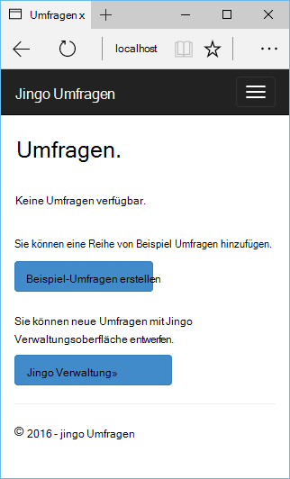
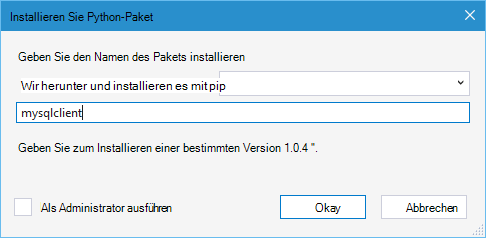

<properties 
    pageTitle="Django und MySQL Azure mit Python 2.2 für Visual Studio" 
    description="Lernen Sie die Python-Tools für Visual Studio Django Web app erstellen, die Daten in eine Instanz der MySQL-Datenbank gespeichert und zum Azure App Service Web Apps bereitstellen." 
    services="app-service\web" 
    documentationCenter="python" 
    authors="huguesv" 
    manager="wpickett" 
    editor=""/>

<tags 
    ms.service="app-service-web" 
    ms.workload="web" 
    ms.tgt_pltfrm="na" 
    ms.devlang="python"
    ms.topic="get-started-article" 
    ms.date="07/07/2016"
    ms.author="huvalo"/>

# Django und MySQL Azure mit Python 2.2 für Visual Studio 

[AZURE.INCLUDE [tabs](../../includes/app-service-web-get-started-nav-tabs.md)]

In diesem Lernprogramm verwenden Sie [Python-Tools für Visual Studio] (PTVS) eine einfache Umfragen Web app mit einem PTVS Beispielvorlagen erstellen. Sie lernen, wie einen MySQL-Dienst auf Azure Web app MySQL Verwendung konfigurieren und [Azure App Service Web Apps](http://go.microsoft.com/fwlink/?LinkId=529714)Web app veröffentlichen.

> [AZURE.NOTE] Die Informationen in diesem Lernprogramm steht auch im folgenden Video:
> 
> [PTVS 2.1: Django app in MySQL][video]

Finden Sie weitere Artikel, die Entwicklung von Azure App Service Web Apps mit PTVS Flasche Kolben und Django Web Frameworks Azure-Tabellenspeicher, MySQL und SQL-Datenbank mit der [Python Developer Center] . Während konzentriert sich dieser Artikel auf App Service ähneln die Schritten [Azure Cloud Services]entwickeln.

## Erforderliche Komponenten

 - Visual Studio 2015
 - [Python 2.7 32-Bit-] oder [Python 3.4 32-bit]
 - [Python 2.2-Tools für Visual Studio]
 - [Python 2.2-Tools für Visual Studio Samples VSIX]
 - [Azure SDK-Tools für VS 2015]
 - Django 1.9 oder höher

[AZURE.INCLUDE [create-account-and-websites-note](../../includes/create-account-and-websites-note.md)]

<!-- This note should not render as part of the the previous include. -->

> [AZURE.NOTE] Wenn Sie mit Azure App Service beginnen, bevor Sie sich für ein Azure-Konto, gehen Sie [Versuchen App Service](http://go.microsoft.com/fwlink/?LinkId=523751)sofort eine kurzlebige Starter Web app in App Service können Sie erstellen. Keine Kreditkarte und keine Zusagen sind erforderlich.

## Erstellen Sie das Projekt

In diesem Abschnitt erstellen Sie ein Visual Studio-Projekt mit einer Beispielvorlage. Sie erstellen eine virtuelle Umgebung und erforderliche Pakete installieren. Erstellen Sie eine lokale Datenbank mit Sqlite. Dann wird die Anwendung lokal ausgeführt werden.

1. Wählen Sie **Datei** **Neues Projekt**in Visual Studio.

1. Die Projektvorlagen von [Python Tools 2.2 für Visual Studio Samples VSIX] stehen unter **Python** **Beispiele**. Wählen Sie **Umfragen Django Webprojekt** , und klicken Sie auf OK, um das Projekt zu erstellen.

    

1. Sie werden aufgefordert, externe Pakete installieren. Wählen Sie **in einer virtuellen Umgebung installieren**.

    

1. Wählen Sie als Basis-Interpreter **Python 2.7** oder **Python 3.4** .

    

1. Im **Projektmappen-Explorer**mit der rechten Maustaste auf den Projektknoten und wählen **Python**und wählen **Django migrieren**.  Wählen Sie **Django Superuser erstellen**.

1. Eine Django Management-Konsole und klicken dann im Projektordner Sqlite Datenbank erstellen. Folgen Sie zum Erstellen eines Benutzers.

1. Bestätigen Sie, dass die Anwendung durch Drücken von `F5`.

1. Klicken Sie in der Navigationsleiste oben auf **Anmelden** .

    

1. Geben Sie die Anmeldeinformationen für den Benutzer erstellten Datenbank synchronisiert.

    

1. Klicken Sie auf **Beispiel Umfragen erstellen**.

    

1. Klicken Sie auf eine Abfrage und wählen.

    

## Erstellen einer MySQL-Datenbank

Für die Datenbank erstellen Sie eine gehostete ClearDB MySQL-Datenbank in Azure.

Als Alternative können eigene virtuelle Computer in Azure erstellen und installieren und MySQL zu verwalten.

Folgende Schritte können Sie eine Datenbank mit einem freien erstellen.

1. [Azure-Portal]anmelden.

1. Klicken Sie oben im Navigationsbereich klicken Sie auf **neu**, klicken Sie auf **Daten + Speicher**und klicken Sie **MySQL-Datenbank**. 

1. Konfigurieren der MySQL-Datenbank durch eine neue Ressourcengruppe erstellen, und wählen Sie den entsprechenden Speicherort.

1. Nach die MySQL-Datenbank erstellt wird, klicken Sie auf **Eigenschaften** Blatt Datenbank.

1. Können Sie den Wert der **VERBINDUNGSZEICHENFOLGE** in der Zwischenablage abgelegt.

## Konfigurieren Sie das Projekt

In diesem Abschnitt Konfigurieren Sie unseren Web app die MySQL-Datenbank verwenden, die Sie gerade erstellt haben. Sie installieren auch zusätzliche Python-Pakete mit MySQL-Datenbanken mit Django erforderlich. Sie werden die Webanwendung lokal ausführen.

1. Öffnen Sie in Visual Studio **settings.py** *Projektname* -Ordner. Fügen Sie der Verbindungszeichenfolge vorübergehend im Editor. Die Verbindungszeichenfolge ist in diesem Format:

        Database=<NAME>;Data Source=<HOST>;User Id=<USER>;Password=<PASSWORD>

    Ändern der Standarddatenbank **ENGINE** MySQL und legen die Werte für **NAME**, **Benutzer**und **Kennwort** **HOST** aus **CONNECTIONSTRING**.

        DATABASES = {
            'default': {
                'ENGINE': 'django.db.backends.mysql',
                'NAME': '<Database>',
                'USER': '<User Id>',
                'PASSWORD': '<Password>',
                'HOST': '<Data Source>',
                'PORT': '',
            }
        }

1. Im Projektmappen-Explorer unter **Python-Umgebungen**mit der rechten Maustaste auf die virtuelle Umgebung, und wählen Sie **Python-Paket installieren**.

1. Installieren Sie das Paket `mysqlclient` mit **Pip**.

    

1. Im **Projektmappen-Explorer**mit der rechten Maustaste auf den Projektknoten und wählen **Python**und wählen **Django migrieren**.  Wählen Sie **Django Superuser erstellen**.

    Dies erstellt Tabellen für die MySQL-Datenbank, die Sie im vorherigen Abschnitt erstellt haben. Folgen Sie zum Erstellen eines Benutzers, die der Benutzer in die im ersten Abschnitt dieses Artikels erstellte Sqlite Datenbank besitzt.

1. Führen Sie die Anwendung mit `F5`. Umfragen mit **Beispiel Umfragen erstellen** und die Daten stimmen erstellt in der MySQL-Datenbank serialisiert.

## Azure App Service Web app veröffentlichen

Azure .NET SDK stellt eine einfache Möglichkeit für die Bereitstellung Ihrer Anwendung auf Azure App Service.

1. Im **Projektmappen-Explorer**mit der rechten Maustaste auf den Projektknoten, und wählen Sie **Veröffentlichen**.

    

1. Klicken Sie auf **Microsoft Azure App Service**.

1. Klicken Sie auf **neu** , um eine neue Web app erstellen.

1. Die folgenden Felder, und klicken Sie auf **Erstellen**:
    - **Web App name**
    - **App Service-plan**
    - **Ressourcengruppe**
    - **Region**
    - **Datenbankserver** **keine Datenbank** festlegen lassen

1. Übernehmen Sie alle Standardeinstellungen, und klicken Sie auf **Veröffentlichen**.

1. Ihr Webbrowser öffnet veröffentlichtes Web App. Web app erwartungsgemäß mit der **MySQL** -Datenbank in Azure gehostet, sollte angezeigt werden.

    

    Herzlichen Glückwunsch! Sie haben erfolgreich Ihre MySQL-basierten Web app in Azure veröffentlicht.

## Nächste Schritte

Folgen Sie diesen Links erfahren Sie mehr über Python-Tools für Visual Studio, Django und MySQL.

- [Python-Tools für Visual Studio-Dokumentation]
  - [Webprojekte]
  - [Cloud-Dienst-Projekte]
  - [Remote-Debuggen auf Microsoft Azure]
- [Django-Dokumentation]
- [MySQL]

Weitere Informationen finden Sie unter [Python Developer Center](/develop/python/).

<!--Link references-->

[Python-Entwicklercenter]: /develop/python/
[Azure-Cloud-Dienste]: ../cloud-services-python-ptvs.md

<!--External Link references-->

[Azure-Portal]: https://portal.azure.com
[Python-Tools für Visual Studio]: http://aka.ms/ptvs
[Python 2.2-Tools für Visual Studio]: http://go.microsoft.com/fwlink/?LinkID=624025
[Python 2.2-Tools für Visual Studio Samples VSIX]: http://go.microsoft.com/fwlink/?LinkID=624025
[Azure SDK-Tools für VS 2015]: http://go.microsoft.com/fwlink/?LinkId=518003
[Python 2.7 32-bit]: http://go.microsoft.com/fwlink/?LinkId=517190 
[Python 3.4 32-bit]: http://go.microsoft.com/fwlink/?LinkId=517191
[Python-Tools für Visual Studio-Dokumentation]: http://aka.ms/ptvsdocs
[Remote-Debuggen auf Microsoft Azure]: http://go.microsoft.com/fwlink/?LinkId=624026
[Webprojekte]: http://go.microsoft.com/fwlink/?LinkId=624027
[Cloud-Dienst-Projekte]: http://go.microsoft.com/fwlink/?LinkId=624028
[Django-Dokumentation]: https://www.djangoproject.com/
[MySQL]: http://www.mysql.com/
[video]: http://youtu.be/oKCApIrS0Lo
