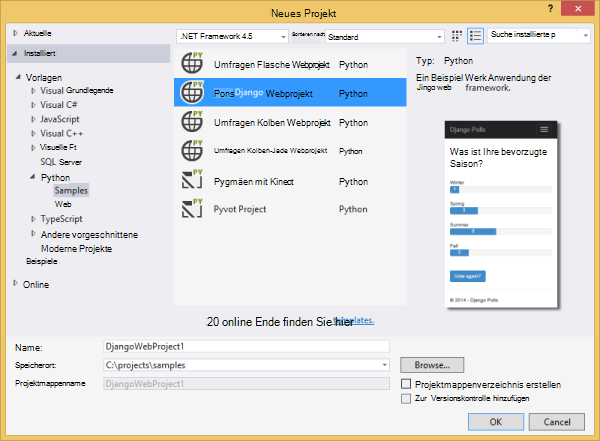
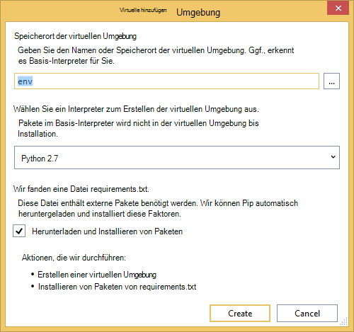
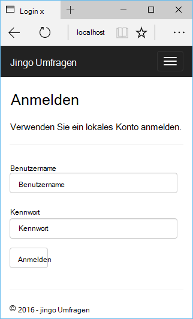
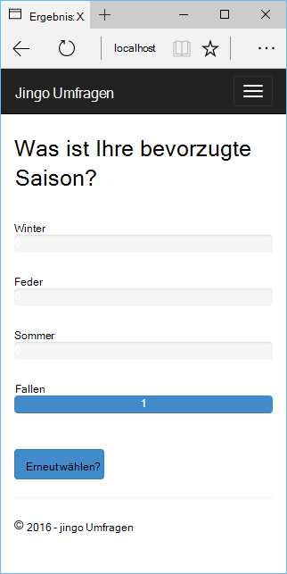
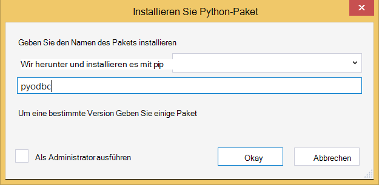
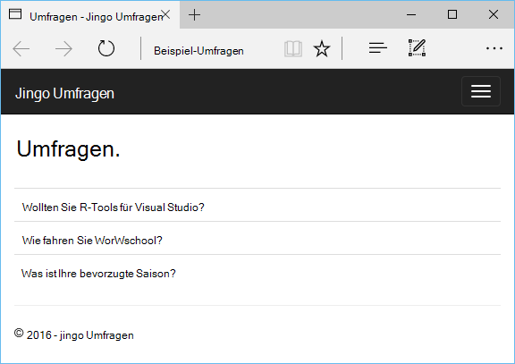

<properties 
    pageTitle="Django und Datenbank SQL Azure mit Python 2.2 für Visual Studio" 
    description="Enthält Informationen zum Verwenden von Python-Tools für Visual Studio Django Web app erstellen, die Daten in einer SQL-Datenbankinstanz gespeichert und Azure App Service Web Apps bereitstellen." 
    services="app-service\web" 
    tags="python"
    documentationCenter="python" 
    authors="huguesv" 
    manager="wpickett" 
    editor=""/>

<tags 
    ms.service="app-service-web" 
    ms.workload="web" 
    ms.tgt_pltfrm="na" 
    ms.devlang="python" 
    ms.topic="article" 
    ms.date="07/07/2016"
    ms.author="huguesv"/>

# Django und Datenbank SQL Azure mit Python 2.2 für Visual Studio 

[Python-Tools für Visual Studio] verwenden wir in diesem Lernprogramm erstellen Sie eine einfache Umfragen Web app eines PTVS Beispielvorlagen verwenden. Dieses Lernprogramm ist auch als [video](https://www.youtube.com/watch?v=ZwcoGcIeHF4)verfügbar.

Wir lernen die Web app Verwendung eine SQL-Datenbank konfigurieren eine Azure SQL-Datenbank verwenden und zum [Azure App Service Web Apps](http://go.microsoft.com/fwlink/?LinkId=529714)Web app veröffentlichen.

Finden Sie weitere Artikel, die Entwicklung von Azure App Service Web Apps mit PTVS Flasche Kolben und Django Web Frameworks Azure-Tabellenspeicher, MySQL und SQL-Datenbank mit der [Python Developer Center] . Während konzentriert sich dieser Artikel auf App Service ähneln die Schritten [Azure Cloud Services]entwickeln.

## Erforderliche Komponenten

 - Visual Studio 2015
 - [Python 2.7 32-bit]
 - [Python 2.2-Tools für Visual Studio]
 - [Python 2.2-Tools für Visual Studio Samples VSIX]
 - [Azure SDK-Tools für VS 2015]
 - Django 1.9 oder höher

[AZURE.INCLUDE [create-account-and-websites-note](../../includes/create-account-and-websites-note.md)]

>[AZURE.NOTE] Wenn Sie mit Azure App Service beginnen, bevor Sie sich für ein Azure-Konto, gehen Sie [Versuchen App Service](http://go.microsoft.com/fwlink/?LinkId=523751)sofort eine kurzlebige Starter Web app in App Service können Sie erstellen. Keine Kreditkarten erforderlich; keine Zusagen.

## Erstellen Sie das Projekt

In diesem Abschnitt erstellen wir ein Visual Studio-Projekt mit einer Beispielvorlage. Wir erstellen eine virtuelle Umgebung und erforderliche Pakete installieren. Wir erstellen eine lokale Datenbank mit Sqlite. Dann wird die Webanwendung lokal ausgeführt.

1.  Wählen Sie **Datei** **Neues Projekt**in Visual Studio.

1.  Die Projektvorlagen von [Python Tools 2.2 für Visual Studio Samples VSIX] stehen unter **Python** **Beispiele**. Wählen Sie **Umfragen Django Webprojekt** , und klicken Sie auf OK, um das Projekt zu erstellen.

    

1.  Sie werden aufgefordert, externe Pakete installieren. Wählen Sie **in einer virtuellen Umgebung installieren**.

    

1.  Wählen Sie als Basis Interpreter **Python 2.7** .

    

1.  Im **Projektmappen-Explorer**mit der rechten Maustaste auf den Projektknoten und wählen **Python**und wählen **Django migrieren**.  Wählen Sie **Django Superuser erstellen**.

1.  Eine Django Management-Konsole und klicken dann im Projektordner Sqlite Datenbank erstellen. Folgen Sie zum Erstellen eines Benutzers.

1.  Bestätigen Sie, dass die Anwendung durch Drücken von <kbd>F5</kbd>.

1.  Klicken Sie in der Navigationsleiste oben auf **Anmelden** .

    

1.  Geben Sie die Anmeldeinformationen für den Benutzer erstellten Datenbank synchronisiert.

    

1.  Klicken Sie auf **Beispiel Umfragen erstellen**.

    

1.  Klicken Sie auf eine Abfrage und wählen.

    

## Erstellen Sie eine SQL-Datenbank

Für die Datenbank erstellen wir eine SQL Azure-Datenbank.

Diese Schritte können Sie eine Datenbank erstellen.

1.  [Azure-Portal]anmelden.

1.  Klicken Sie unten im Navigationsbereich auf **neu**. , klicken Sie auf **Daten + Speicher** > **SQL-Datenbank**.

1.  Erstellen eine neue Ressourcengruppe konfigurieren Sie die neue SQL-Datenbank und wählen Sie den entsprechenden Speicherort.

1.  Erstellte SQL-Datenbank klicken Sie auf Blatt Datenbank **in Visual Studio geöffnet** .
2.  Klicken Sie auf **der Firewall konfigurieren**.
3.  Blatt **Firewall Settings** fügen Sie eine Firewallregel mit **START-IP-** und **END-IP-** öffentliche IP-Adresse des Computers Entwicklung festgelegt hinzu. Klicken Sie auf **Speichern**.

    Verbindung dadurch zum Datenbankserver aus Ihrem Entwicklungscomputer.

4.  In der Datenbank Blade **Eigenschaften**klicken **Datenbankverbindungszeichenfolgen anzeigen**. 

2.  Können Sie den Wert von **ADO.NET** in die Zwischenablage eingefügt.

## Konfigurieren Sie das Projekt

In diesem Abschnitt konfigurieren wir unsere Web app gerade erstellten SQL-Datenbank verwenden. Wir installieren auch zusätzliche Python-Pakete mit Django SQL-Datenbanken verwenden. Dann wird die Webanwendung lokal ausgeführt.

1.  Öffnen Sie in Visual Studio **settings.py** *Projektname* -Ordner. Fügen Sie der Verbindungszeichenfolge vorübergehend im Editor. Die Verbindungszeichenfolge ist in diesem Format:

        Server=<ServerName>,<ServerPort>;Database=<DatabaseName>;User ID=<UserName>;Password={your_password_here};Encrypt=True;TrustServerCertificate=False;Connection Timeout=30;

Bearbeiten der Definition eines `DATABASES` die oben genannten Werte verwendet.

        DATABASES = {
            'default': {
                'ENGINE': 'sql_server.pyodbc',
                'NAME': '<DatabaseName>',
                'USER': '<UserName>',
                'PASSWORD': '{your_password_here}',
                'HOST': '<ServerName>',
                'PORT': '<ServerPort>',
                'OPTIONS': {
                    'driver': 'SQL Server Native Client 11.0',
                    'MARS_Connection': 'True',
                }
            }
        }

1.  Im Projektmappen-Explorer unter **Python-Umgebungen**mit der rechten Maustaste auf die virtuelle Umgebung, und wählen Sie **Python-Paket installieren**.

1.  Installieren Sie das Paket `pyodbc` mit **Pip**.

    

1.  Installieren Sie das Paket `django-pyodbc-azure` mit **Pip**.

    

1.  Im **Projektmappen-Explorer**mit der rechten Maustaste auf den Projektknoten und wählen **Python**und wählen **Django migrieren**.  Wählen Sie **Django Superuser erstellen**.

    Dies erstellt die Tabellen für die SQL-Datenbank im vorherigen Abschnitt erstellten. Folgen Sie zum Erstellen eines Benutzers, die der Benutzer in der Sqlite Datenbank im ersten Abschnitt erstellt wird.

1.  Führen Sie die Anwendung mit `F5`. Umfragen mit **Beispiel Umfragen erstellen** und die Daten stimmen erstellt in der SQL-Datenbank serialisiert.

## Azure App Service Web app veröffentlichen

Azure .NET SDK stellt eine einfache Möglichkeit zum Bereitstellen Ihrer Webanwendung Azure App Service Web Apps.

1.  Im **Projektmappen-Explorer**mit der rechten Maustaste auf den Projektknoten, und wählen Sie **Veröffentlichen**.

    

1.  Klicken Sie auf **Microsoft Azure webapps**.

1.  Klicken Sie auf **neu** , um eine neue Web app erstellen.

1.  Die folgenden Felder, und klicken Sie auf **Erstellen**.
    -   **Web App name**
    -   **App Service-plan**
    -   **Ressourcengruppe**
    -   **Region**
    -   **Datenbankserver** **keine Datenbank** festlegen lassen

1.  Übernehmen Sie alle Standardeinstellungen, und klicken Sie auf **Veröffentlichen**.

1.  Ihr Webbrowser öffnet veröffentlichtes Web App. Die Webanwendung funktioniert, sollte mit der **SQL** -Datenbank auf Azure angezeigt werden.

    Herzlichen Glückwunsch!

    

## Nächste Schritte

Folgen Sie diesen Links erfahren Sie mehr über Python-Tools für Visual Studio, Django und SQL-Datenbank.

- [Python-Tools für Visual Studio-Dokumentation]
  - [Webprojekte]
  - [Cloud-Dienst-Projekte]
  - [Remote-Debuggen auf Microsoft Azure]
- [Django-Dokumentation]
- [SQL-Datenbank]

## Was hat sich geändert
* Eine Anleitung zur Änderung von Websites zu App Service finden Sie unter: [Azure App Service und seine Auswirkung auf vorhandene Azure Services](http://go.microsoft.com/fwlink/?LinkId=529714)

<!--Link references-->
[Python-Entwicklercenter]: /develop/python/
[Azure-Cloud-Dienste]: ../cloud-services-python-ptvs.md

<!--External Link references-->
[Azure-Portal]: https://portal.azure.com
[Python-Tools für Visual Studio]: http://aka.ms/ptvs
[Python 2.2-Tools für Visual Studio]: http://go.microsoft.com/fwlink/?LinkID=624025
[Python 2.2-Tools für Visual Studio Samples VSIX]: http://go.microsoft.com/fwlink/?LinkID=624025
[Azure SDK-Tools für VS 2015]: http://go.microsoft.com/fwlink/?LinkId=518003
[Python 2.7 32-bit]: http://go.microsoft.com/fwlink/?LinkId=517190 
[Python-Tools für Visual Studio-Dokumentation]: http://aka.ms/ptvsdocs
[Remote-Debuggen auf Microsoft Azure]: http://go.microsoft.com/fwlink/?LinkId=624026
[Webprojekte]: http://go.microsoft.com/fwlink/?LinkId=624027
[Cloud-Dienst-Projekte]: http://go.microsoft.com/fwlink/?LinkId=624028
[Django-Dokumentation]: https://www.djangoproject.com/
[SQL-Datenbank]: /documentation/services/sql-database/
