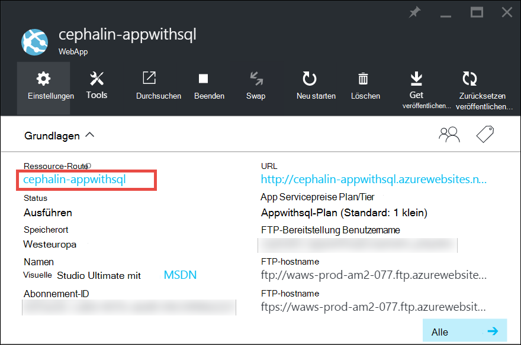
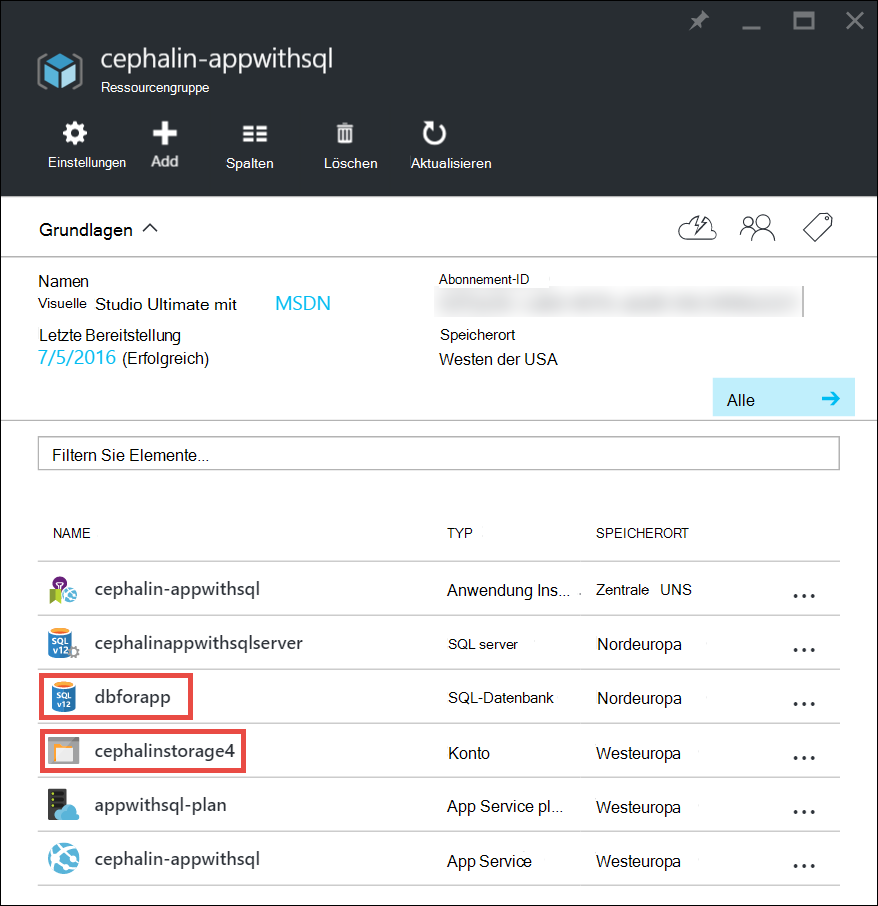
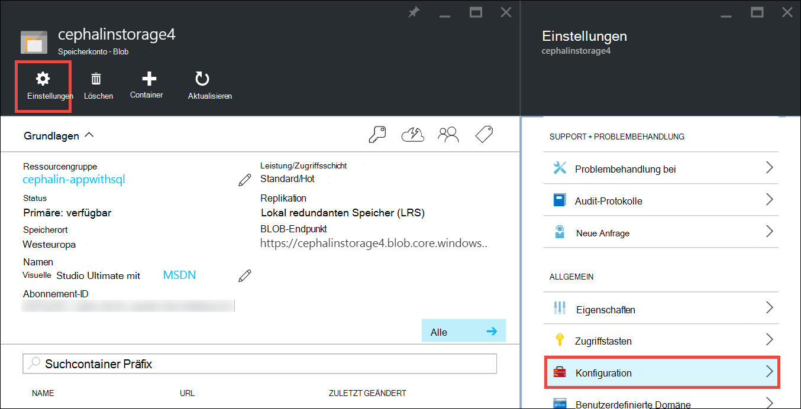

<properties
    pageTitle="Skalieren einer Anwendung in Azure | Microsoft Azure"
    description="Informationen Sie zum Skalieren einer Anwendung in Azure App Service Kapazität und Features hinzufügen."
    services="app-service"
    documentationCenter=""
    authors="cephalin"
    manager="wpickett"
    editor="mollybos"/>

<tags
    ms.service="app-service"
    ms.workload="na"
    ms.tgt_pltfrm="na"
    ms.devlang="na"
    ms.topic="article"
    ms.date="07/05/2016"
    ms.author="cephalin"/>

# Skalieren einer Anwendung in Azure #

Dieser Artikel veranschaulicht die Skalierung Ihrer Anwendung in Azure App Service. Gibt es zwei Workflows für Skalierung, Skalierung und skalieren und dieser Artikel erläutert die Skalierung Workflow.

- [Skalieren](https://en.wikipedia.org/wiki/Scalability#Horizontal_and_vertical_scaling): erhalten mehr CPU, Speicher, Speicherplatz und zusätzliche Features wie dedizierte virtuelle Maschinen (VMs), benutzerdefinierte Domänen und Zertifikate, staging-Steckplätze und Skalierung. Heraufskalierung ändern Tarif App Service-Plan, dem die Anwendung gehört.
- [Skalieren](https://en.wikipedia.org/wiki/Scalability#Horizontal_and_vertical_scaling): erhöhen Sie die Anzahl von VM-Instanzen, die Ihre Anwendung ausführen.
Sie können bis zu 20 Instanzen je nach Ihrem Tarif skalieren. [App Service-Umgebungen](../app-service/app-service-app-service-environments-readme.md) in **Premium** -Ebene wird die Skalierung Anzahl 50 Instanzen erhöhen. Weitere Informationen zur Skalierung finden Sie unter [Instanzenzahl manuell oder automatisch skaliert](../monitoring-and-diagnostics/insights-how-to-scale.md). Dort finden Sie, wie Sie automatische Skalierung, die Instanzenzahl basierend auf vordefinierten Regeln und Zeitpläne automatisch skaliert.

Die Einstellungen erfordern nur wenige Sekunden und alle apps in Ihren [App Service-Plan](../app-service/azure-web-sites-web-hosting-plans-in-depth-overview.md)auswirken.
Sie erfordern keine Code ändern oder die Anwendung erneut bereitstellen.

Informationen zu Preisen und Funktionen der einzelnen App Servicepläne Einzelheiten Sie [App Service Preise](/pricing/details/web-sites/).  

> [AZURE.NOTE] Bevor Sie einen App Service-Plan von Tier **frei** wechseln, müssen Sie zuerst [Ausgabenlimits](/pricing/spending-limits/) an Ihr Azure-Abonnement entfernen. Anzeigen oder Ändern der Optionen für Ihr Microsoft Azure App Abonnement, siehe [Microsoft Azure Abonnements][azuresubscriptions].

## Der Tarif skalieren

1. Öffnen Sie in Ihrem Browser [Azure-Portal][portal].

2. Ihre app Blatt klicken Sie **Alle**und dann auf **Skalieren**.

    ![Navigieren Sie zu der Azure-Anwendung skalieren.][ChooseWHP]

4. Wählen Sie die Ebene, und klicken Sie auf **auswählen**.

    Registerkarte **Benachrichtigungen** blinkt grün **Erfolg** , nachdem der Vorgang abgeschlossen ist.

## Verwandte Ressourcen skalieren
Wenn Ihre Anwendung hängt von anderem Azure Storage oder Azure SQL-Datenbank können Sie auch die Ressourcen je nach Bedarf skalieren. Diese Ressourcen werden nicht mit dem App-Dienst skaliert und separat skaliert werden müssen.

1. Klicken Sie in **Essentials** **Ressourcengruppe** .

    

2. **Zusammenfassung** der Blade- **Ressourcengruppe** klicken Sie auf eine Ressource, die Sie skalieren möchten. Der folgende Screenshot zeigt eine SQL-Datenbank und eine Ressource Azure-Speicher.

    

3. **Klicken Sie für eine Ressource SQL Datenbank** > tier**Preisstufe** skalieren die Preisgestaltung.

    

    Sie können auch [Geo-Replikation](../sql-database/sql-database-geo-replication-overview.md) für die SQL-Datenbankinstanz aktivieren.

    **Klicken Sie für eine Ressource Azure Storage** > **Konfiguration** der Speicheroptionen skalieren.

    

## Informationen zu Entwicklerfeatures
Je nach dem Tarif stehen die folgenden Entwicklerorientierte Features:

### Bitanzahl ###

- **Basic**, **Standard**und **Premium** -Ebenen unterstützt 64-Bit- und 32-Bit Applications.
- **Frei** und **Shared** Plan Ebenen unterstützen 32-Bit-Anwendung.

### Debugger-Unterstützung ###

- Debugger-Unterstützung steht **frei**, **Shared**und **grundlegende** Modi auf eine Verbindung pro App Service-Plan.
- Debugger-Support steht für die **Standard-** und **Premium** -Modi fünf gleichzeitige Verbindungen pro App Service-Plan.

## Informationen zu anderen Funktionen

- Ausführliche Informationen zu allen übrigen Features in App Service-Pläne, einschließlich Preisen und Funktionen für alle Benutzer (einschließlich Entwickler) finden Sie unter [App Dienstdetails Preise](/pricing/details/web-sites/).

>[AZURE.NOTE] Ggf. mit Azure App Service beginnen, bevor Sie für ein Azure-Konto zum [Versuchen App Service](http://go.microsoft.com/fwlink/?LinkId=523751) zum sofort eine kurzlebige Starter Web app in App Service erstellen. Keine Kreditkarten erforderlich sind und keine Verpflichtungen.

## Nächste Schritte

- Zunächst mit Azure finden Sie unter [Microsoft Azure-Testversion](/pricing/free-trial/).
- Informationen zu Preisen, Support und SLA finden Sie auf der folgenden Links.

    [Datenübertragungen Preisdetails](/pricing/details/data-transfers/)

    [Microsoft Azure Support-Pläne](/support/plans/)

    [Service Level Agreements](/support/legal/sla/)

    [SQL Datenbank Preisdetails](/pricing/details/sql-database/)

    [Virtueller Computer und Microsoft Azure Cloud Service Größe][vmsizes]

    [App Service Preisdetails](/pricing/details/app-service/)

    [App Service Preise - SSL-Verbindungen](/pricing/details/web-sites/#ssl-connections)

- Informationen zum Azure App Service best Practices einschließlich einer Architektur skalierbaren und ausfallsicherer finden Sie [Best Practices: Azure App Service Web Apps](http://blogs.msdn.com/b/windowsazure/archive/2014/02/10/best-practices-windows-azure-websites-waws.aspx).

- Videos zur Skalierung App Service apps finden Sie in folgenden Ressourcen:

    - [Wenn Azure Websites - Stefan Schackow skalieren](/documentation/videos/azure-web-sites-free-vs-standard-scaling/)
    - [Automatische Skalierung Azure Websites, CPU oder - mit Stefan Schackow](/documentation/videos/auto-scaling-azure-web-sites/)
    - [Wie Azure Websites Scale – mit Stefan Schackow](/documentation/videos/how-azure-web-sites-scale/)

<!-- LINKS -->
[vmsizes]:/pricing/details/app-service/
[SQLaccountsbilling]:http://go.microsoft.com/fwlink/?LinkId=234930
[azuresubscriptions]:http://go.microsoft.com/fwlink/?LinkID=235288
[portal]: https://portal.azure.com/

<!-- IMAGES -->
[ChooseWHP]: ./media/web-sites-scale/scale1ChooseWHP.png
[ChooseBasicInstances]: ./media/web-sites-scale/scale2InstancesBasic.png
[SaveButton]: ./media/web-sites-scale/05SaveButton.png
[BasicComplete]: ./media/web-sites-scale/06BasicComplete.png
[ScaleStandard]: ./media/web-sites-scale/scale3InstancesStandard.png
[Autoscale]: ./media/web-sites-scale/scale4AutoScale.png
[SetTargetMetrics]: ./media/web-sites-scale/scale5AutoScaleTargetMetrics.png
[SetFirstRule]: ./media/web-sites-scale/scale6AutoScaleFirstRule.png
[SetSecondRule]: ./media/web-sites-scale/scale7AutoScaleSecondRule.png
[SetThirdRule]: ./media/web-sites-scale/scale8AutoScaleThirdRule.png
[SetRulesFinal]: ./media/web-sites-scale/scale9AutoScaleFinal.png
[ResourceGroup]: ./media/web-sites-scale/scale10ResourceGroup.png
[ScaleDatabase]: ./media/web-sites-scale/scale11SQLScale.png
[GeoReplication]: ./media/web-sites-scale/scale12SQLGeoReplication.png
