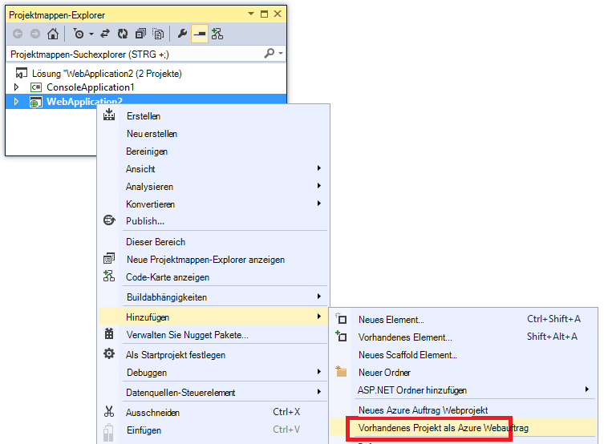
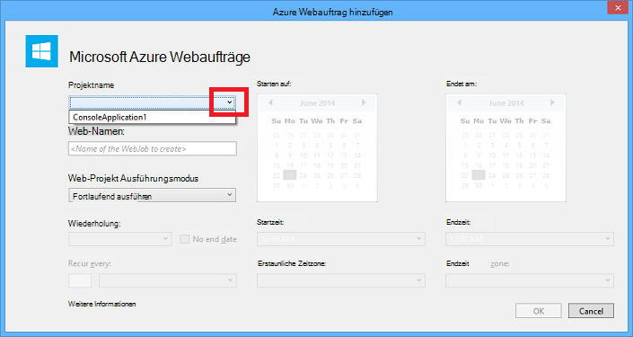
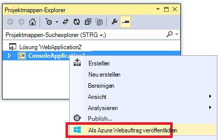
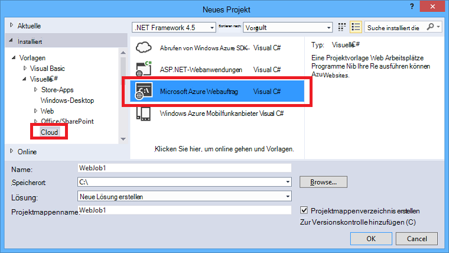
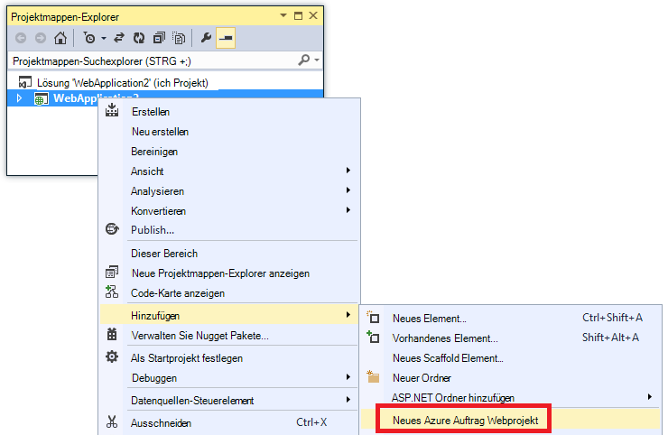
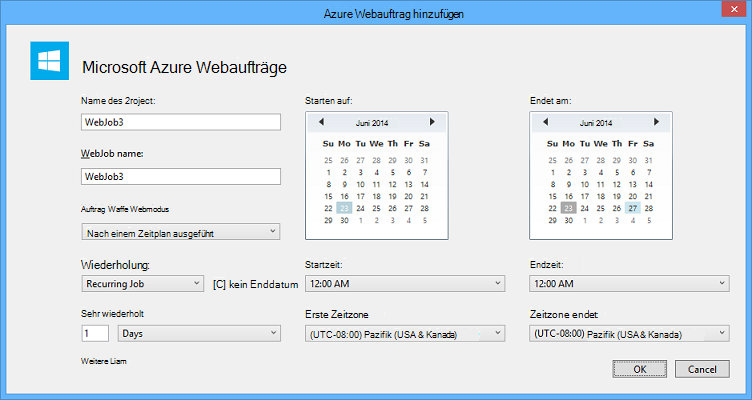

<properties 
    pageTitle="Bereitstellen Sie Webaufträge, die mit Visual Studio" 
    description="Weitere Informationen zum Bereitstellen von Azure Webaufträge Azure App Service Web Apps mit Visual Studio." 
    services="app-service" 
    documentationCenter="" 
    authors="tdykstra" 
    manager="wpickett" 
    editor="jimbe"/>

<tags 
    ms.service="app-service" 
    ms.devlang="dotnet" 
    ms.topic="article" 
    ms.tgt_pltfrm="na" 
    ms.workload="na" 
    ms.date="04/27/2016" 
    ms.author="tdykstra"/>

# Bereitstellen Sie Webaufträge, die mit Visual Studio

## Übersicht

Dieses Thema erläutert, wie mit Visual Studio ein Konsolenanwendungsprojekt zu Web app [App Service](http://go.microsoft.com/fwlink/?LinkId=529714) als eine [Azure Webauftrags](http://go.microsoft.com/fwlink/?LinkId=390226)bereitstellen. Informationen zum Webaufträge mithilfe der [Azure-Portal](https://portal.azure.com)bereitstellen finden Sie unter [Hintergrundaufgaben mit Webaufträge ausführen](web-sites-create-web-jobs.md).

Wenn Visual Studio ein Webaufträge aktiviert Konsolenanwendungsprojekt bereitstellt, werden zwei Aufgaben ausgeführt:

* Kopiert Runtime-Dateien in die entsprechenden Ordner im Web app (*App_Data/Aufträge/continuous* für fortlaufende Webaufträge, für geplante und on-Demand Webaufträge *App_Data, Aufträge, ausgelöst* ).
* Richtet [Azure Steuerprogrammaufträge](#scheduler) für Webaufträge geplant zu bestimmten Zeitpunkten ausgeführt. (Dies ist nicht für fortlaufende Webaufträge erforderlich.)

Webaufträge-fähigen Projekt enthält die folgenden Elemente hinzugefügt:

* [Microsoft.Web.WebJobs.Publish](http://www.nuget.org/packages/Microsoft.Web.WebJobs.Publish/) NuGet-Paket.
* Ein [Webauftrag veröffentlichen settings.json](#publishsettings) Datei mit Bereitstellung und Planer Settings. 

Sie können eine vorhandene Konsolenanwendungsprojekt diese Elemente hinzufügen oder Verwenden einer Vorlage ein neues Webaufträge aktiviert Konsolenanwendungsprojekt erstellen. 

Sie können ein Projekt als ein Webauftrag selbst bereitstellen oder zu einem Webprojekt verknüpfen, sodass automatisch installiert, wenn Sie das Webprojekt bereitgestellt. Um Projekte zu verknüpfen, enthält Visual Studio Projektnamen Webaufträge aktiviert in einer Datei [list.json Webaufträge](#webjobslist) im Webprojekt.

## Erforderliche Komponenten

Webaufträge stehen Bereitstellung in Visual Studio 2015 bei Azure SDK für .NET installieren:

* [Azure SDK für .NET (Visual Studio 2015)](http://go.microsoft.com/fwlink/?linkid=518003).

## Aktivieren Sie Webaufträge Bereitstellung für vorhandene Konsolenanwendungsprojekt

Sie haben zwei Optionen:

* [Aktivieren der automatischen Bereitstellung mit einem Webprojekt](#convertlink).

    Konfigurieren Sie einen vorhandenen Konsolenanwendungsprojekt automatisch als ein Webauftrag bereitgestellt werden soll, wenn Sie ein Webprojekt bereitstellen. Verwenden Sie diese Option, wenn der Webauftrag in derselben Web app führen Sie in der zugehörigen Anwendung ausgeführt werden soll.

* Sie [ermöglichen die Bereitstellung ohne ein Webprojekt](#convertnolink).

    Konfigurieren einer vorhandenen Konsolenanwendungsprojekt, keine Verbindung zu einem Webprojekt als ein Webauftrag bereitgestellt. Verwenden Sie diese Option, wenn Sie ein Webauftrag Web App, keine Web-Anwendung im Web app ausgeführt. Sie sollten, um Ihre Webauftrags Ressourcen unabhängig Ihre skaliert werden.

### Aktivieren Sie automatische Webaufträge Bereitstellung mit einem Webprojekt
  
1. Mit der rechten Maustaste des Webprojekts im **Projektmappen-Explorer**, und klicken Sie dann auf **Hinzufügen** > **Vorhandene Projekt Azure Webauftrag**.

    
    
    Das Dialogfeld [Azure Webauftrags hinzufügen](#configure) wird angezeigt.

1. Wählen Sie in der Dropdownliste **Projektnamen** Konsolenanwendungsprojekt hinzufügen als eine Webauftrags aus

    

2. **Führen Sie im Dialogfeld [Azure Webauftrags hinzufügen](#configure) ** 

### Webaufträge Bereitstellung ohne ein Webprojekt aktivieren
  
1. Klicken Sie das Konsolenanwendungsprojekt im **Projektmappen-Explorer**und dann auf **als Webauftrags Azure veröffentlichen**. 

    
    
    Das Dialogfeld [Hinzufügen Azure Webauftrag](#configure) wird das Projekt im Feld **Projekt** angezeigt.

2.  **Führen Sie im Dialogfeld [Azure Webauftrags hinzufügen](#configure) **

    Der **Veröffentlichen** -Assistent wird angezeigt.  Wenn Sie sofort veröffentlichen möchten, schließen Sie den Assistenten. Die eingegebenen Einstellungen werden gespeichert Wenn Sie [das Projekt bereitstellen](#deploy)möchten.

## Erstellen eines neuen Projekts Webaufträge aktiviert

Erstellen Sie ein neues Projekt Webaufträge aktiviert können Sie Konsolenanwendungsprojekt verwenden und Webaufträge Bereitstellung wie im [vorherigen Abschnitt](#convert)erläutert. Als Alternative können Sie die Vorlage Webaufträge neues Projekt:

* [Verwenden Sie für einen unabhängigen Webauftrag Webaufträge neues Projekt Vorlage](#createnolink)

    Erstellen Sie ein Projekt, und konfigurieren sie selbst als ein Webauftrag keine Verbindung zu einem Webprojekt bereitstellen. Verwenden Sie diese Option, wenn Sie ein Webauftrag Web App, keine Web-Anwendung im Web app ausgeführt. Sie sollten, um Ihre Webauftrags Ressourcen unabhängig Ihre skaliert werden.

* [Verwenden Sie für ein Webauftrag mit einem Webprojekt verknüpft Webaufträge neues Projekt Vorlage](#createlink)

    Erstellen eines Projekts konfiguriert automatisch ein Webauftrag bereitstellen, wenn ein Webprojekt in derselben Projektmappe bereitgestellt wird. Verwenden Sie diese Option, wenn der Webauftrag in derselben Web app führen Sie in der zugehörigen Anwendung ausgeführt werden soll.

> [AZURE.NOTE] Vorlage Neues Projekt Webaufträge automatisch NuGet-Pakete installiert und Code in *Program.cs* [Webaufträge SDK](http://www.asp.net/aspnet/overview/developing-apps-with-windows-azure/getting-started-with-windows-azure-webjobs)enthält. Wenn Sie nicht das WebJobs SDK verwenden möchten oder geplanten statt für dauerhaften Webauftrags verwenden möchten, entfernen oder Ändern der `host.RunAndBlock` Anweisung in *Program.cs*.

### Verwenden Sie für einen unabhängigen Webauftrag Webaufträge neues Projekt Vorlage
  
1. Klicken Sie auf **Datei** > **Neues Projekt**, und klicken Sie dann im Dialogfeld **Neues Projekt** auf **Cloud** > **Microsoft Azure Webauftrag**.

    
    
2. Befolgen Sie zuvor zu [Einer unabhängigen Webaufträge Projekt Konsolenanwendungsprojekt](#convertnolink)gezeigt.

### Verwenden Sie für ein Webauftrag mit einem Webprojekt verknüpft Webaufträge neues Projekt Vorlage

1. Mit der rechten Maustaste des Webprojekts im **Projektmappen-Explorer**, und klicken Sie dann auf **Hinzufügen** > **Neue Azure Webauftrags Projekt**.

    

    Das Dialogfeld [Azure Webauftrags hinzufügen](#configure) wird angezeigt.

2. **Führen Sie im Dialogfeld [Azure Webauftrags hinzufügen](#configure) **

## Das Dialogfeld Azure Webauftrags hinzufügen

Dialogfeld **Hinzufügen Azure Webauftrags** kann Webauftrags Namen und Einstellungen für Ihre Webauftrags planen. 

Die Felder in diesem Dialogfeld entsprechen Felder im Dialogfeld **Neues Projekt** von Azure-Portal. Weitere Informationen finden Sie unter [Hintergrundaufgaben mit Webaufträge ausführen](web-sites-create-web-jobs.md).

Für eine geplante Webauftrag (nicht für fortlaufende Webaufträge) erstellt Visual Studio eine [Azure Scheduler](/services/scheduler/) Job Auflistung, wenn eine noch nicht existiert, und ein Projekt in der Auflistung erstellt:

* Auflistung Job Scheduler heißt *Webaufträge-{Regionname}* , *{Regionname}* bezieht sich auf den Bereich Web, app in gehostet wird. Beispiel: WebJobs WestUS.
* Die Steuerprogrammauftrag namens *{Webappname}-{Webjobname}*. Beispiel: MyWebApp MyWebJob. 
 
>[AZURE.NOTE]
> 
>* Informationen zur Bereitstellung über die Befehlszeile finden Sie unter [Befehlszeile aktivieren oder kontinuierliche Bereitstellung von Azure Webaufträge](/blog/2014/08/18/enabling-command-line-or-continuous-delivery-of-azure-webjobs/).
>* Wenn Sie ein **Wiederkehrendes Projekt** konfigurieren und Wiederholungsfrequenz auf eine Anzahl von Minuten, ist der Azure-Auftragsplanungsdienst nicht frei. Andere Frequenzen (Stunden, Tage, usw.) können.
>* Wenn ein Webauftrag bereitstellen und dann entscheiden, welcher Webauftrags und bereitstellen möchten müssen Sie Webaufträge veröffentlichen settings.json Datei löschen. Dadurch wird Visual Studio die Optionen erneut einzublenden, Typ Webauftrags ändern.
>* Ein Webauftrag bereitstellen und später ändern der Ausführungsmodus von fortlaufenden nicht oder umgekehrt erstellt Visual Studio eine neue Webauftrags in Azure, wenn Sie erneut. Wenn andere scheduling ändern Ausführungsmodus identisch oder geplant und Anforderungsscan wechseln, Visual Studio aktualisiert vorhandene anstatt eine neue zu erstellen.

## Webauftrags veröffentlichen settings.json

Wenn Sie ein Konsolenanwendungsprojekt Webaufträge Bereitstellung konfigurieren, Visual Studio installiert [Microsoft.Web.WebJobs.Publish](http://www.nuget.org/packages/Microsoft.Web.WebJobs.Publish/) NuGet-Paket und speichert Zeitplaninformationen in einer *Webauftrags veröffentlichen settings.json* -Datei im Projektordner *Eigenschaften* des Projekts Webaufträge. Hier ist ein Beispiel der Datei:

        {
          "$schema": "http://schemastore.org/schemas/json/webjob-publish-settings.json",
          "webJobName": "WebJob1",
          "startTime": "2014-06-23T00:00:00-08:00",
          "endTime": "2014-06-27T00:00:00-08:00",
          "jobRecurrenceFrequency": "Minute",
          "interval": 5,
          "runMode": "Scheduled"
        }

Sie können diese Datei direkt bearbeiten und Visual Studio IntelliSense bietet. Dateischema wird in [http://schemastore.org](http://schemastore.org/schemas/json/webjob-publish-settings.json) gespeichert und kann dort angezeigt werden.  

>[AZURE.NOTE]
>
>* Wenn Sie ein **Wiederkehrendes Projekt** konfigurieren und Wiederholungsfrequenz auf eine Anzahl von Minuten, ist der Azure-Auftragsplanungsdienst nicht frei. Andere Frequenzen (Stunden, Tage, usw.) können.

## Webaufträge list.json

Beim Verknüpfen eines Webaufträge aktiviert ein Webprojekt speichert Visual Studio Webaufträge Projektnamen in einer *Webaufträge list.json* -Datei im Ordner *Eigenschaften* des Webprojekts. Die Liste kann mehrere Webaufträge Projekte enthalten, wie im folgenden Beispiel gezeigt:

        {
          "$schema": "http://schemastore.org/schemas/json/webjobs-list.json",
          "WebJobs": [
            {
              "filePath": "../ConsoleApplication1/ConsoleApplication1.csproj"
            },
            {
              "filePath": "../WebJob1/WebJob1.csproj"
            }
          ]
        }

Sie können diese Datei direkt bearbeiten und Visual Studio IntelliSense bietet. Dateischema wird in [http://schemastore.org](http://schemastore.org/schemas/json/webjobs-list.json) gespeichert und kann dort angezeigt werden.
  
## Bereitstellen eines Projekts Webaufträge

Das Webprojekt setzt automatisch eines Webaufträge, die mit einem Webprojekt verknüpft. Informationen zur Bereitstellung von Webprojekten finden Sie unter [Web Apps bereitstellen](web-sites-deploy.md).

Zu Webaufträge Projekt bereitstellen, mit der rechten Maustaste im **Projektmappen-Explorer**des Projekts **als Webauftrags Azure veröffentlichen**. 

    
Für einen unabhängigen Webauftrag gleichen **Web veröffentlichen** -Assistenten, die für Webprojekte verwendet wird, aber mit weniger Einstellungen ändern.

## Nächste Schritte

Dieser Artikel erklärt Webaufträge Bereitstellung mit Visual Studio. Weitere Informationen zum Bereitstellen von Azure Webaufträge finden Sie unter [Azure Webaufträge - Ressourcen empfohlen - Bereitstellung](http://www.asp.net/aspnet/overview/developing-apps-with-windows-azure/azure-webjobs-recommended-resources#deploying).
