<properties
    pageTitle=".NET Webauftrags in Azure App Service erstellen | Microsoft Azure"
    description="Erstellen einer Multi-Tier-Anwendung mit ASP.NET MVC und Azure. Der front-End verwendet Web-app in Azure App Service und dem Back-End wird als ein Webauftrag. Die app verwendet Entity Framework, Datenbank SQL Azure-speicherwarteschlangen und Blobs."
    services="app-service"
    documentationCenter=".net"
    authors="tdykstra"
    manager="wpickett"
    editor="mollybos"/>

<tags
    ms.service="app-service"
    ms.workload="na"
    ms.tgt_pltfrm="na"
    ms.devlang="na"
    ms.topic="article"
    ms.date="10/28/2016"
    ms.author="tdykstra"/>

# Erstellen Sie eine .NET Webauftrag in Azure App Service

Dieses Lernprogramm zeigt, wie Code für eine einfache Anwendung mit mehreren Ebenen ASP.NET MVC 5 schreiben, [Webaufträge SDK](websites-dotnet-webjobs-sdk.md).

[Webaufträge SDK](websites-webjobs-resources.md) soll die Code für häufige Aufgaben schreiben, ein Webauftrag können, wie Bild-, Verarbeitung in die Warteschlange, RSS-Aggregation, Wartung und e-Mails zu vereinfachen. Das WebJobs SDK enthält Funktionen für die Arbeit mit Azure Service Bus für Planungsaufgaben und Fehlerbehandlung und viele andere Szenarien. Ferner ist erweiterbar konzipiert und gibt [Quell-Repository für Erweiterungen zu öffnen](https://github.com/Azure/azure-webjobs-sdk-extensions/wiki/Binding-Extensions-Overview).

Beispiel-Anwendung ist ein Bulletinboard Werbung. Benutzer können Bilder anzeigen und ein Backend-Prozess konvertiert Bilder in Miniaturansicht. Anzeige der Listenseite werden Miniaturansichten und Ad-Details-Seite zeigt das Bild in voller Größe. Hier ist ein Screenshot:

Diese Anwendung arbeitet mit [Azure-Warteschlangen](http://www.asp.net/aspnet/overview/developing-apps-with-windows-azure/building-real-world-cloud-apps-with-windows-azure/queue-centric-work-pattern) und [Azure-Blobs](http://www.asp.net/aspnet/overview/developing-apps-with-windows-azure/building-real-world-cloud-apps-with-windows-azure/unstructured-blob-storage). Das Tutorial zeigt die Anwendung [Azure App Service](http://go.microsoft.com/fwlink/?LinkId=529714) und [Azure SQL-Datenbank](http://msdn.microsoft.com/library/azure/ee336279)bereitstellen.

## Erforderliche Komponenten

Es wird vorausgesetzt, dass Sie mit [ASP.NET MVC 5](http://www.asp.net/mvc/tutorials/mvc-5/introduction/getting-started) Projekte in Visual Studio arbeiten können.

Das Lernprogramm wurde für Visual Studio 2013 geschrieben. Wenn Sie Visual Studio noch nicht, wird es für Sie automatisch installiert werden bei der Installation von Azure SDK für .NET.

Visual Studio 2015 das Lernprogramm verwendet werden, jedoch vor der Ausführung der Anwendungdes lokal Sie müssen Sie die `Data Source` Teil der Verbindungszeichenfolge in den Dateien Web.config und App.config aus SQL Server LocalDB `Data Source=(localdb)\v11.0` , `Data Source=(LocalDb)\MSSQLLocalDB`. 

> [AZURE.NOTE] Ein Azure-Konto zum Bearbeiten dieses Lernprogramms benötigen Sie:
  >
  > + [Ein Azure-Konto kostenlos öffnen](https://azure.microsoft.com/pricing/free-trial/?WT.mc_id=A261C142F)können: Sie erhalten ein Guthaben können Sie ausprobieren, bezahlte Azure Services und sogar nachdem sie verwendet bis hält das Konto verwenden kostenlosen Azure Services wie Websites. Kreditkarte wird nicht belastet, sofern explizit ändern und Fragen belastet.
  >
  > + Sie können [MSDN-Abonnementvorteile aktivieren](https://azure.microsoft.com/pricing/member-offers/msdn-benefits-details/?WT.mc_id=A261C142F): Ihr MSDN-Abonnement erhalten Sie Credits monatlich für bezahlte Azure Services verwendet werden können.
  >
  >Wenn Sie mit Azure App Service beginnen, bevor Sie sich für ein Azure-Konto, gehen Sie [Versuchen App Service](http://go.microsoft.com/fwlink/?LinkId=523751)sofort eine kurzlebige Starter Web app in App Service können Sie erstellen. Keine Kreditkarten erforderlich; keine Zusagen.

## Sie erfahren

Das Lernprogramm zeigt, wie die folgenden Aufgaben ausführen:

* Aktivieren Sie den Computer Azure-Entwicklung Azure SDK installieren.
* Erstellen Sie ein Konsolenanwendungsprojekt, die automatisch als ein Azure Webauftrags beim Bereitstellen des zugeordneten Projekts setzt.
* Testen Sie Backend WebJobs SDK lokal auf dem Entwicklungscomputer.
* Veröffentlichen einer Anwendung mit Webaufträge Back-End-Web-app in App Service.
* Dateien hochladen und in Azure BLOB-Dienst zu speichern.
* Verwenden Sie Azure Webaufträge SDK Azure Storage Warteschlangen mit Blobs arbeiten.

## Anwendungsarchitektur

Beispiel-Anwendung mithilfe des [Queue-orientierte Muster](http://www.asp.net/aspnet/overview/developing-apps-with-windows-azure/building-real-world-cloud-apps-with-windows-azure/queue-centric-work-pattern) -Server CPU-Intensive Vorgänge Miniaturansichten ein Backend-Prozess erstellen.

Die Anwendung speichert in einer SQL-Datenbank mit Entity Framework Code First erstellt die Tabellen und Daten anzeigen. Die Datenbank speichert für jede Anzeige zwei URLs: Bild in voller Größe und für die Miniaturansicht.

Wenn ein Benutzer ein Bild hochgeladen, Web app speichert das Bild in eine [Azure blob](http://www.asp.net/aspnet/overview/developing-apps-with-windows-azure/building-real-world-cloud-apps-with-windows-azure/unstructured-blob-storage)und speichert die Informationen in der Datenbank mit einer URL für das Blob. Zur gleichen Zeit eine Nachricht in eine Azure-Warteschlange geschrieben. In einem Back-End-Prozess als ein Azure Webauftrags fragt WebJobs SDK die Warteschlange auf neue Nachrichten. Eine neue Nachricht der Webauftrag wird eine Miniaturansicht für dieses Abbild erstellt und Miniaturansicht Datenbankfeld URL für die Anzeige aktualisiert. Hier ist ein Diagramm zeigt, wie die Teile der Anwendung interagieren:

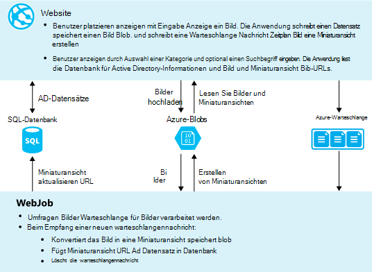

[AZURE.INCLUDE [install-sdk](../../includes/install-sdk-2015-2013.md)]

Tutorial Hinweise gelten für Azure SDK für .NET 2.7.1 oder höher.

## Ein Azure Storage-Konto erstellen

Ein Azure Storage-Konto bietet Ressourcen für Warteschlange und BLOB-Daten in der Cloud speichern. Das WebJobs SDK dient zum Speichern von Daten für das Dashboard.

In einer realen Anwendung erstellen Sie i. d. r. separate Konten für Anwendung Daten oder Daten, und separate Daten und Daten entfallen. In diesem Lernprogramm verwenden Sie nur ein Konto.

1. Öffnen Sie das Fenster **Server-Explorer** in Visual Studio.

2. Maustaste auf **Azure** -Knoten, und klicken Sie auf **mit Microsoft Azure**.
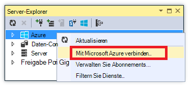

3. Melden Sie sich mit Ihren Azure-Anmeldeinformationen an.

5. Klicken Sie **Speicher** unter Azure Knoten und dann auf **Storage-Konto erstellen**.
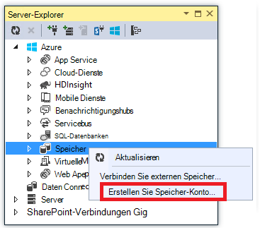

3. Geben Sie einen Namen für das Speicherkonto im Dialogfeld **Storage-Konto erstellen** .

    Der Name muss eindeutig sein muss (keine Azure Speicherkonto kann denselben Namen haben). Wenn der eingegebene Name bereits verwendet wird erhalten Sie es ändern.

    Die URL auf das Speicherkonto werden *{Name}*. von Core.Windows.NET befinden..

5. Die Dropdown-Liste **Region oder Gruppe** auf Bereich Sie festgelegt.

    Diese Einstellung gibt an, welche Azure-Rechenzentrum das Speicherkonto hosten. Für dieses Lernprogramm wird nicht für den entscheidenden Unterschied entscheiden. Soll jedoch für eine Produktion Web app Webserver und das Speicherkonto in derselben Region Latenz und Daten Ausgang Kosten minimiert werden. Die Webanwendung (die Sie später erstellen) Datacenter sollte möglichst der Browser Web app zugreifen, um die Wartezeit zu verkürzen.

6. Soll die Dropdownliste **Replikation** **lokal redundant**.

    Geo-Replikation für ein Speicherkonto aktiviert ist, wird in einem sekundären Datencenter um einen Failover auf diesen Speicherort im Falle einer Katastrophe am primären Speicherort gespeicherte Inhalt repliziert. Geo-Replikation kann zusätzliche Kosten anfallen. Für Test und Entwicklung im Allgemeinen möchten Geo-Replikation bezahlen. Weitere Informationen finden Sie unter [erstellen, verwalten oder löschen Sie ein Speicherkonto](../storage-create-storage-account/#replication-options).

5. Klicken Sie auf **Erstellen**.

    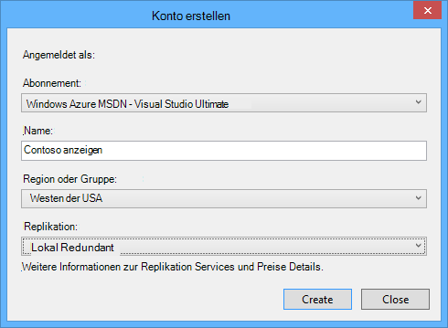

## Anwendung downloaden

1. Herunterladen Sie und extrahieren Sie der [Lösung abgeschlossen](http://code.msdn.microsoft.com/Simple-Azure-Website-with-b4391eeb).

2. Starten Sie Visual Studio.

3. Wählen Sie im Menü **Datei** **Öffnen > Projekt/Projektmappe**navigieren, in denen die Lösung herunterladen und öffnen Sie die Projektmappendatei.

4. Drücken Sie STRG + UMSCHALT + B, um die Projektmappe zu erstellen.

    Standardmäßig stellt Visual Studio automatisch den NuGet-Paketinhalt, der nicht in der *ZIP-* Datei enthalten war. Wenn die Pakete nicht wiederhergestellt, installieren sie manuell Dialogfeld **NuGet-Pakete verwalten, Lösung** und klicken auf die Schaltfläche **Wiederherstellen** oben rechts.

5. Stellen Sie im **Projektmappen-Explorer**sicher, dass **ContosoAdsWeb** als Startprojekt ausgewählt ist.

## Konfigurieren der Anwendung für das Speicherkonto

1. Öffnen Sie die *Web.config* -Anwendungsdatei im ContosoAdsWeb-Projekt.

    Die Datei enthält ein SQL-Verbindungszeichenfolge und eine Verbindungszeichenfolge Azure-Speicher für Blobs und Warteschlangen.

    Die SQL-Verbindungszeichenfolge verweist auf eine Datenbank [SQL Server Express LocalDB](http://msdn.microsoft.com/library/hh510202.aspx) .

    Speicher-Verbindungszeichenfolge ist ein Beispiel, das Platzhalter für den Namen und Schlüssel Storage-Konto hat. Sie werden dies mit einer Verbindungszeichenfolge, die den Namen Schlüssel für das Speicherkonto und ersetzen.  

    <pre class="prettyprint">&lt;ConnectionStrings&gt;
   &lt;hinzufügen Name = "ContosoAdsContext" ConnectionString = "Data Source = \v11.0 (Localdb); Initial Catalog = ContosoAds; Integrated Security = True; MultipleActiveResultSets = True "providerName="System.Data.SqlClient "/&gt;
   &lt;hinzufügen Name ="AzureWebJobsStorage"ConnectionString =" DefaultEndpointsProtocol = Https; AccountName =<mark>[Kontoname]</mark>; AccountKey<mark>[Accesskey]</mark>= "/&gt; 
    &lt;/connectionStrings      &gt;</pre>

    Speicher-Verbindungszeichenfolge ist AzureWebJobsStorage benannt ist, die den Namen des WebJobs SDK verwendet standardmäßig. Gleichnamige wird hier verwendet, so dass Sie nur eine Verbindung in der Azure-Umgebung gesetzt.

2. Im **Server-Explorer**mit der rechten Maustaste des Speicherkontos unter **Storage** Node und klicken Sie dann auf **Eigenschaften**.

    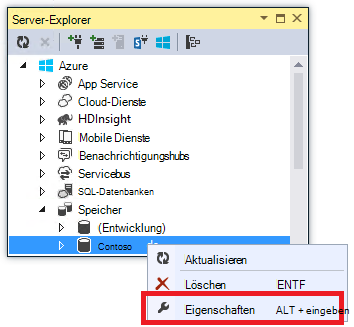

3. Im Fenster **Eigenschaften** auf **Speicherkontoschlüssel**und klicken Sie dann auf das Auslassungszeichen.

    

4. Kopieren Sie die **Verbindungszeichenfolge**.

    

5. Die Verbindungszeichenfolge, die Sie gerade kopiert ersetzen Sie Storage-Verbindungszeichenfolge in der Datei *Web.config* . Stellen Sie sicher, dass Sie alles innerhalb der Anführungszeichen jedoch nicht mit Anführungszeichen vor dem Einfügen auswählen.

6. Öffnen Sie die Datei *App.config* im ContosoAdsWebJob-Projekt.

    Diese Datei hat zwei Speicher-Verbindungszeichenfolgen, Anwendungsdaten und für die Protokollierung. Können Sie separate Speicherkonten Anwendungsdaten und Protokollierung und [mehrere Speicherkonten für Daten](https://github.com/Azure/azure-webjobs-sdk/blob/master/test/Microsoft.Azure.WebJobs.Host.EndToEndTests/MultipleStorageAccountsEndToEndTests.cs)verwenden. In diesem Lernprogramm verwenden Sie ein einzelnes Speicherkonto. Die Verbindungszeichenfolgen enthalten Platzhalter für die speicherkontoschlüssel. 
    <pre class="prettyprint">&lt;Konfiguration&gt; 
    &lt;ConnectionStrings&gt;
   &lt;hinzufügen Name = "AzureWebJobsDashboard" ConnectionString = "DefaultEndpointsProtocol = Https; AccountName =<mark>[Kontoname]</mark>; AccountKey<mark>[Accesskey]</mark>= "/&gt;
   &lt;hinzufügen Name ="AzureWebJobsStorage"ConnectionString =" DefaultEndpointsProtocol = Https; AccountName =<mark>[Kontoname]</mark>; AccountKey<mark>[Accesskey]</mark>= "/&gt;
   &lt;Namen hinzufügen ="ContosoAdsContext"ConnectionString =" Data Source = \v11.0 (Localdb); Initial Catalog = ContosoAds; Integrated Security = True; MultipleActiveResultSets = True; " /&gt; 
    &lt;/connectionStrings&gt;
   &lt;Start&gt;
   &lt;SupportedRuntime-Version = "4.0" Sku = ". NETFramework, Version 4.5 = "/&gt; 
    &lt;/startup&gt;
&lt;/Configuration                             &gt;</pre>

    Standardmäßig sucht das WebJobs SDK für Verbindungszeichenfolgen namens AzureWebJobsStorage und AzureWebJobsDashboard. Alternativ können Sie [Speicher Verbindungszeichenfolge jedoch möchten und explizit übergibt die `JobHost` Objekt](websites-dotnet-webjobs-sdk-storage-queues-how-to.md#config).

7. Ersetzen Sie beide Verbindungszeichenfolgen Speicher mit der Verbindungszeichenfolge, die Sie zuvor kopiert.

8. Speichern.

## Die Anwendung lokal ausführen

1. Starten Sie den Front-WebFrontEnd der Anwendung STRG + F5.

    Standardbrowser öffnet die Startseite. (Das Webprojekt ausgeführt wird, da Sie das Startprojekt gemacht.)

    

2. Starten der Webauftrag Back-End der Anwendung ContosoAdsWebJob Projekt im **Projektmappen-Explorer**klicken und dann auf **Debuggen** > **neue Instanz starten**.

    Eine Anwendung Konsolenfenster wird geöffnet und zeigt die Protokollierungsnachrichten Webaufträge SDK JobHost Objekt ausführen begonnen hat.

    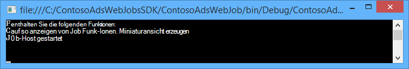

3. Klicken Sie auf **Erstellen einer Anzeige**in Ihrem Browser.

4. Geben Sie einige Testdaten ein wählen Sie ein Bild hochladen, und klicken Sie auf **Erstellen**.

    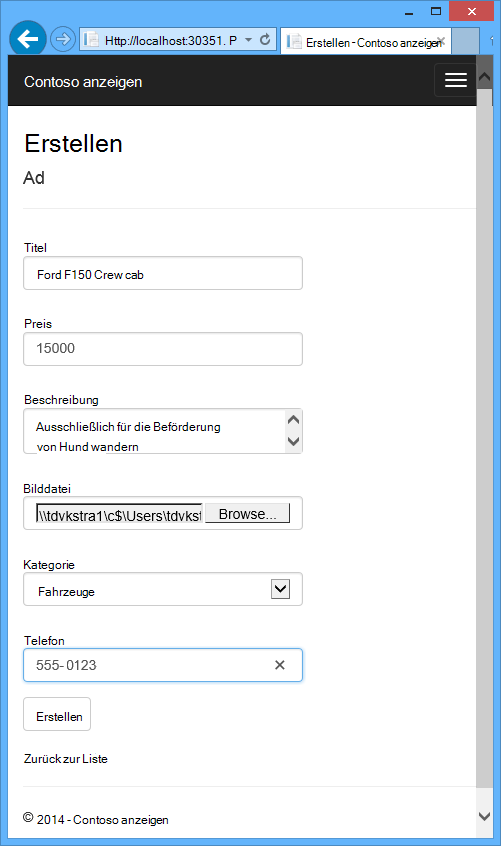

    Die Anwendung geht zur Indexseite, aber zeigt eine Miniaturansicht der neuen Anzeige da die Verarbeitung noch nicht geschehen ist.

    Nach einer kurzen Wartezeit zeigt eine Protokollierung Meldung im Konsolenfenster Anwendung dagegen, dass eine warteschlangennachricht empfangen wurde und verarbeitet wurde.

    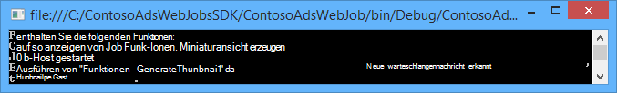

5. Protokollierungsnachrichten im Konsolenfenster der Anwendung angezeigt wird, aktualisieren Sie die Seite Index um die Miniaturansicht anzuzeigen.

    

6. Klicken Sie auf **Details** für Ihre Anzeige um das Bild in voller Größe anzuzeigen.

    

Sie betreiben der Anwendungdes auf dem lokalen Computer und verwendet eine SQL Server-Datenbank auf Ihrem Computer arbeiten mit Warteschlangen und blobs in der Cloud. Im folgenden Abschnitt wird die Anwendung in der Cloud ausgeführt mit einer sowie Cloud Blobs Warteschlangen.  

## Führen Sie die Anwendung in der cloud

Sie werden zum Ausführen der Anwendung in der Cloud folgendermaßen:

* Web Apps bereitstellen. Visual Studio erstellt automatisch eine neue Web app App und einer SQL-Datenbankinstanz.
* Konfigurieren der Web app Ihr Azure SQL-Datenbank und Konto verwenden.

Nach Anzeigen beim Ausführen in der Cloud erstellt haben, müssen Sie WebJobs SDK Dashboard darauf Überwachungsfunktionen zu anbieten reichen anzeigen.

### Webapps bereitstellen

1. Schließen Sie den Browser und die Anwendung Konsolenfenster.

2. Im **Projektmappen-Explorer**mit der rechten Maustaste des ContosoAdsWeb Projekts und dann auf **Veröffentlichen**.

3. Klicken Sie im Schritt **Profil** des **Veröffentlichen** -Assistenten auf **Microsoft Azure webapps**.

    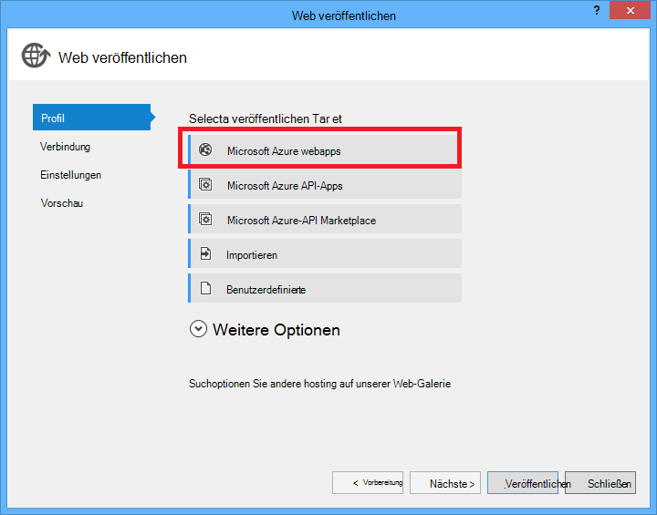

4. Melden Sie sich bei Azure an, wenn Sie immer noch angemeldet sind.

5. **Klicken Sie auf.**

    Das Dialogfeld sieht etwas anders, je nachdem, welche Version von Azure SDK für .NET installiert haben.

    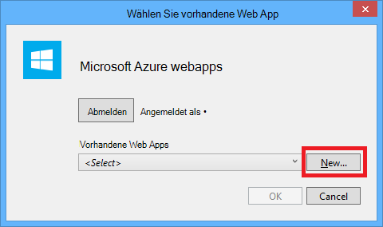

6. Geben Sie im Dialogfeld **Create WebApp auf Microsoft Azure** im **Web app Name** einen eindeutigen Namen.

    Hier geben Sie die vollständige URL besteht und. *.azurewebsites.NET (Siehe neben das Textfeld **Web app Name** ). Beispielsweise ist der Web app Name ContosoAds werden URL ContosoAds.azurewebsites.net.

7. Wählen Sie in der Liste [App Service-Plan](../app-service/azure-web-sites-web-hosting-plans-in-depth-overview.md) **erstellen neue App-Serviceplan aus** Geben Sie einen Namen für den Plan App Service wie ContosoAdsPlan.

8. Wählen Sie in der Liste [Gruppe](../azure-resource-manager/resource-group-overview.md) **neue Ressourcengruppe erstellen**.

9. Geben Sie einen Namen für die Ressourcengruppe wie ContosoAdsGroup.

10. Wählen Sie in **der Dropdown-Liste** der gleichen Region, für das Speicherkonto ausgewählt haben.

    Diese Einstellung gibt die Azure-Rechenzentrum in Ihrer Anwendung ausgeführt wird. Halten das Web app und Storage-Konto im gleichen Datencenter minimiert Latenz und Daten Ausgang Kosten.

11. Wählen Sie in der Liste **Datenbank** **erstellen neue Server**.

12. Geben Sie einen Namen für den Datenbankserver wie Contosoadsserver + eine Zahl oder den Namen Ihrer Servernamen eindeutig zu machen. 

    Der Servername muss eindeutig sein. Sie können Kleinbuchstaben, Ziffern und Bindestriche enthalten. Es darf keine abschließenden Bindestrichs enthalten. 

    Wenn Ihr Abonnement bereits ein Server verfügt, können Sie alternativ, Server aus der Dropdown-Liste auswählen.

12. Geben Sie Administrator **der Datenbank-Benutzername** und **Datenbankkennwort**.

    Bei Auswahl der **neuen SQL-Datenbankserver** einen vorhandenen Namen und Kennwort eingeben werden nicht eingeben Sie einen neuen Namen und das Kennwort, das Sie jetzt definieren später beim Zugriff auf die Datenbank verwendet. Wenn Sie einen Server ausgewählt haben, den Sie zuvor erstellt haben, werden Sie das Kennwort für das Administratorkonto aufgefordert werden bereits erstellt.

13. Klicken Sie auf **Erstellen**.

    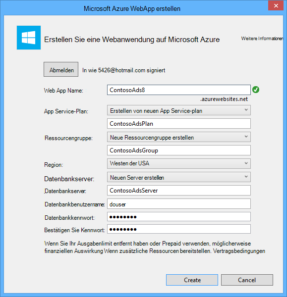

    Visual Studio erstellt die Projektmappe, das Webprojekt Web app in Azure und Azure SQL-Datenbankinstanz.

14. Klicken Sie im Schritt **Verbindung** des **Veröffentlichen** -Assistenten auf **Weiter**.

    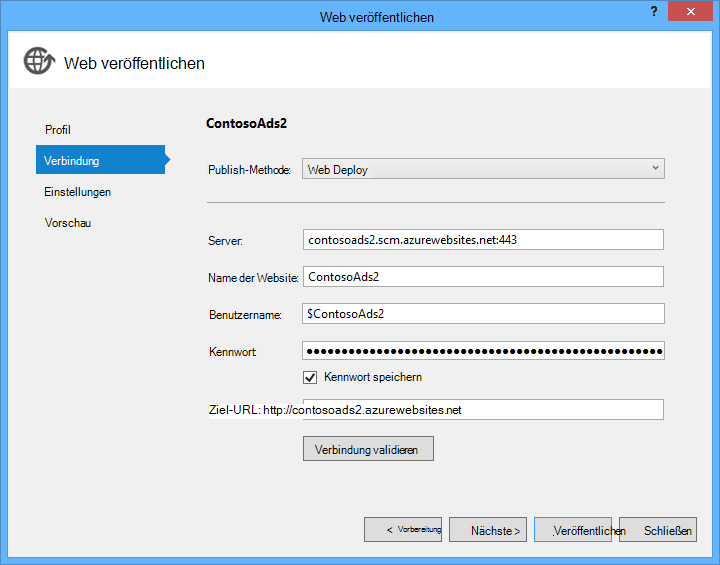

15. Schritt **Einstellungen** Kontrollkästchen Sie **verwenden diese Verbindungszeichenfolge zur Laufzeit** das und klicken Sie auf **Weiter**.

    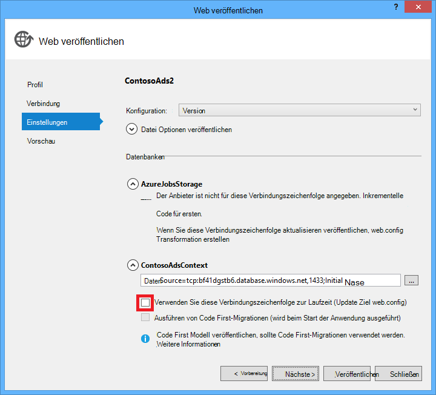

    Sie müssen im Dialogfeld Veröffentlichen verwenden, um die SQL-Verbindungszeichenfolge festgelegt, da Sie diesen Wert später in der Azure-Umgebung festgelegt werden.

    Ignorieren Sie die Warnung auf dieser Seite.

    * Normalerweise das Speicherkonto Verwendung in Azure ausgeführt anders wäre bei lokal ausgeführt, aber in diesem Lernprogramm verwenden Sie derselbe in beiden Umgebungen. So muss die Verbindungszeichenfolge AzureWebJobsStorage nicht transformiert werden. Auch wenn Sie unterschiedliche Speicherkonto in der Cloud verwenden möchten, müssten Sie die Verbindungszeichenfolge umwandeln, da die Anwendung eine Einstellung Azure-Umgebung bei in Azure ausgeführt wird. Sie sehen dies später im Lernprogramm.

    * In diesem Lernprogramm, Sie für die ContosoAdsContext-Datenbank verwendete Datenmodell Änderungen werden nicht so entfällt Entity Framework Code First-Migrationen für die Bereitstellung verwenden. Code wird zunächst automatisch die erste Datenbankzeit die Anwendung versucht, Zugriff auf SQL-Daten.

    In diesem Lernprogramm werden die Standardwerte der Optionen unter **Veröffentlichungsoptionen Datei** Ordnung.

16. Klicken Sie in **diesem Schritt können** auf **Vorschau starten**.

    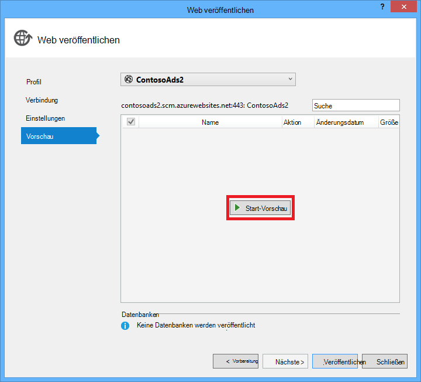

    Sie können keine publizierten Datenbanken die Warnung ignorieren. Entity Framework Code First erstellt die Datenbank; Sie müssen nicht veröffentlicht werden.

    Das Vorschaufenster Binär- und Konfigurationsdateien aus dem Projekt Webauftrags *App_data\jobs\continuous* Ordner Web App kopiert werden.

    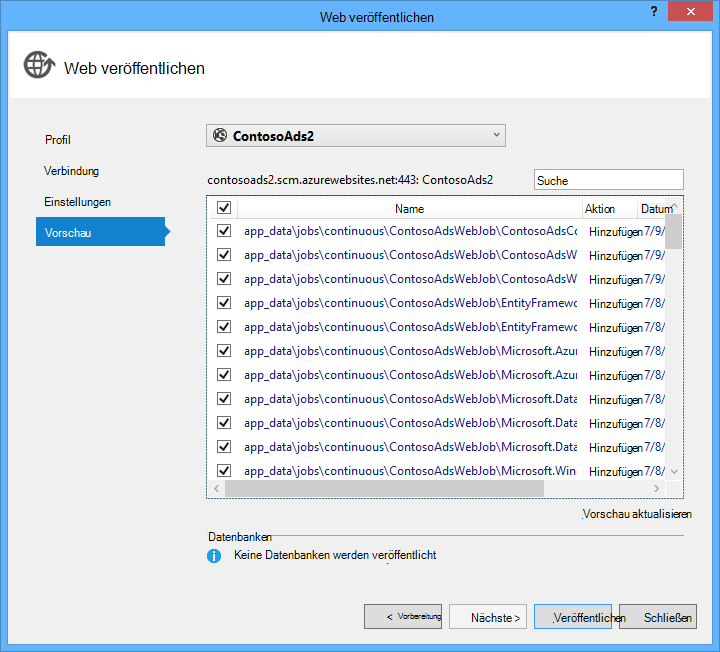

17. Klicken Sie auf **Veröffentlichen**.

    Visual Studio stellt die Anwendung bereit und URL der Startseite im Browser geöffnet.

    Nicht möglich Web app verwenden, bis Sie Verbindungszeichenfolgen in der Azure-Umgebung im nächsten Abschnitt festlegen. Sie sehen eine Fehlerseite oder die Homepage je nach Web app und Datenbank erstellen, die Sie zuvor ausgewählt haben.

### Konfigurieren der Web app Ihr Azure SQL-Datenbank und Konto verwenden.

Es ist aus Sicherheitsgründen zu [vermeiden, dass vertrauliche Informationen wie Verbindungszeichenfolgen in Dateien, die in Quellcode-Repositorys gespeichert sind](http://www.asp.net/aspnet/overview/developing-apps-with-windows-azure/building-real-world-cloud-apps-with-windows-azure/source-control#secrets). Azure bietet eine Möglichkeit dazu: Festlegen von Verbindungszeichenfolge und andere Einstellung in der Azure-Umgebung, und ASP.NET Konfigurations-APIs automatisch diese Werte bei die Anwendung in Azure ausgeführt wird. Mit **Server-Explorer**, Azure-Portal, Windows PowerShell und plattformübergreifende Befehlszeilenschnittstelle können Sie diese Werte in Azure festlegen. Weitere Informationen finden Sie unter [Zeichenfolgen wie Anwendungszeichenfolgen und Verbindung](/blog/2013/07/17/windows-azure-web-sites-how-application-strings-and-connection-strings-work/).

In diesem Abschnitt verwenden Sie **Server-Explorer** Verbindung Zeichenfolgenwerte in Azure festgelegt.

7. Im **Server-Explorer**mit der rechten Maustaste unter Ihrer Anwendung **Azure > App Service > {der Ressourcengruppe}**, und klicken Sie dann auf **Ansicht**.

    **Azure Web App** Fenster auf der Registerkarte **Konfiguration** .

9. Ändern Sie den Namen der Verbindungszeichenfolge DefaultConnection in ContosoAdsContext.

    Azure erstellt automatisch diese Verbindungszeichenfolge Erstellung Web app mit einer Datenbank verknüpft damit bereits den Wert der richtigen Verbindungszeichenfolge. Nur den Namen ändern, was Code sucht.

9. Fügen Sie zwei neue Verbindungszeichenfolgen namens AzureWebJobsStorage und AzureWebJobsDashboard. Typ auf Custom festgelegt, und legen Sie den Wert der Verbindungszeichenfolge auf den gleichen Wert, den Sie zuvor für die Dateien *Web.config* und *App.config* verwendet. (Vergewissern Sie die gesamte Verbindungszeichenfolge nicht nur die Zugriffstaste und nicht die Anführungszeichen.)

    Diese Verbindungszeichenfolgen werden vom SDK WebJobs verwendet Daten und für die Protokollierung. Wie Sie bereits gesehen haben, ist für Anwendungsdaten Web-front-End-Code auch

9. Klicken Sie auf **Speichern**.

    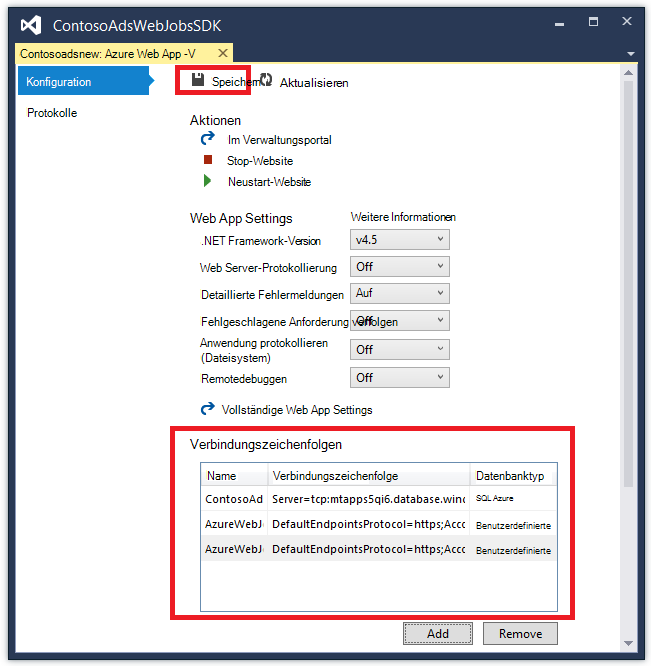

10. Im **Server-Explorer**mit der rechten Maustaste Web app und klicken Sie auf **Beenden**.

12. Nach Web app beendet, **Klicken**mit der rechten Maustaste erneut auf der Webanwendung

    Der Webauftrag wird automatisch veröffentlichen, aber wenn Sie eine Konfiguration ändern, beendet. Zum Neustart Web app neu starten oder den Webauftrag im [Azure-Portal](http://go.microsoft.com/fwlink/?LinkId=529715)neu starten. Es wurde empfohlen Web app nach einer Änderung der Konfiguration neu gestartet.

9. Aktualisieren Sie das Browserfenster, das Web app-URL in die Adressleiste.

    Die Startseite wird angezeigt.

10. Erstellen Sie eine Anzeige, wie die Anwendung lokal ausgeführt.

    Die Indexseite wird ohne eine Miniaturansicht zunächst.

11. Aktualisieren Sie die Seite nach wenigen Sekunden und die Miniaturansicht angezeigt.

    Wenn die Miniaturansicht angezeigt wird, müssen Sie warten Sie eine Minute oder damit Webauftrags neu starten. Wenn im Anschluss eine Weile noch nicht angezeigt der Miniaturansicht die Seite zu aktualisieren, der Webauftrag kann nicht automatisch gestartet. In diesem Fall gehen Sie zur Registerkarte Webaufträge [Verwaltungsportal](https://manage.windowsazure.com) Seite für Ihr Web app und klicken Sie auf **Start**.

### Das WebJobs SDK Dashboard anzeigen

1. Wählen Sie im [Verwaltungsportal](https://manage.windowsazure.com)Ihrer Anwendung.

2. Klicken Sie auf die Registerkarte **Webaufträge** .

3. Klicken Sie auf die URL in der Spalte Protokolle für Ihre Webauftrag.

    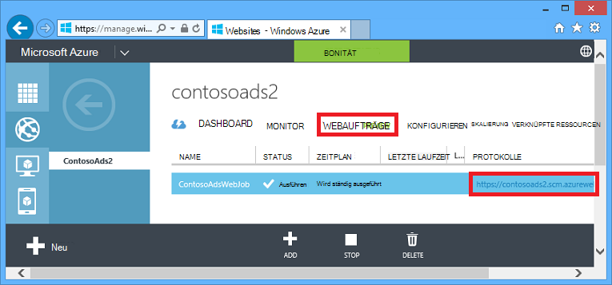

    WebJobs SDK-Dashboard wird eine neue Registerkarte geöffnet. Das Dashboard zeigt den Webauftrag wird ausgeführt und zeigt eine Liste der Funktionen im Code, den das WebJobs SDK ausgelöst.

4. Klicken Sie auf die Funktionen zur Ausführung angezeigt.

    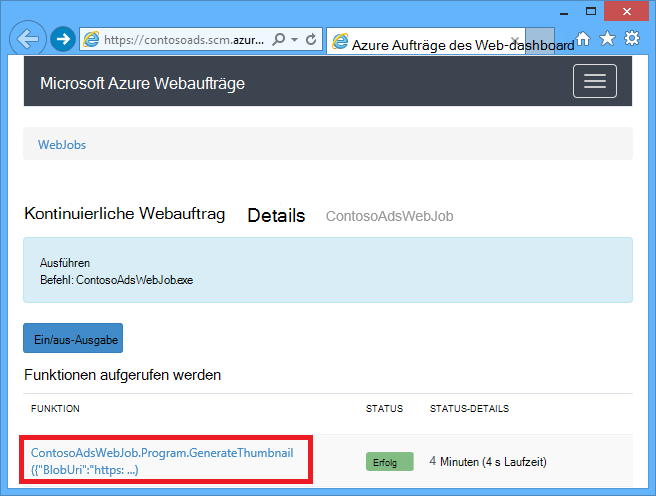

    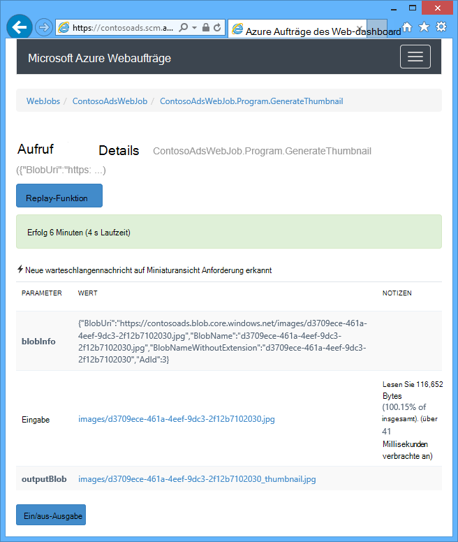

    Die Schaltfläche **Wiedergabe-Funktion** auf dieser Seite die Grundstruktur WebJobs SDK an die Funktion und gibt Ihnen die Möglichkeit zum Ändern der Daten zunächst an die Funktion übergeben.

>[AZURE.NOTE] Wenn Sie fertig sind Tests löschen Web app und die SQL-Datenbankinstanz. SQL-Datenbankinstanz und Speicherkonto fallen Gebühren (minimal aufgrund) Web app ist kostenlos. Auch kann alle, die den URL verlässt die Web app erstellen und anzeigen. Gehen Sie im klassischen Portal zur Registerkarte **Dashboard** Ihrer Anwendung, und klicken Sie auf die Schaltfläche **Löschen** am unteren Rand der Seite. Sie können das Kontrollkästchen SQL-Datenbankinstanz löschen wählen. Wenn Sie vorübergehend andere Web app zugreifen möchten, klicken Sie stattdessen auf **Beenden** . In diesem Fall weiterhin Gebühren für die SQL-Datenbank und Speicher entstehen. Sie können ein ähnliches Verfahren, um die SQL-Datenbank und Konto löschen, wenn Sie nicht mehr benötigen folgen.

## Die Anwendung von Grund auf neu erstellen

In diesem Abschnitt werden die folgenden Aufgaben ausführen:

* Erstellen Sie eine Visual Studio-Lösung mit einem Webprojekt.
* Fügen Sie ein Klassenbibliotheksprojekt für die Datenzugriffsebene, die von front-End und Back-End-gemeinsam.
* Fügen Sie ein Konsolenanwendungsprojekt für das Backend Webaufträge Bereitstellung aktiviert.
* Hinzufügen von NuGet-Paketen.
* Verweisen auf Projekt.
* Kopieren Sie Konfigurationsdateien Anwendungsdateien aus der heruntergeladenen Anwendung, die Sie im vorherigen Abschnitt des Lernprogramms gearbeitet.
* Überprüfen Sie die Teile des Codes mit Azure-Blobs, Warteschlangen und WebJobs SDK.

### Erstellen einer Visual Studio-Lösung mit einem Webprojekt Klassenbibliotheksprojekt

1. Wählen Sie Visual Studio **neu** > **Projekt** **aus** .

2. Wählen Sie im Dialogfeld **Neues Projekt** **Visual C#** > **Web** > **ASP.NET Web Application**.

3. Nennen Sie das Projekt ContosoAdsWeb, Name der Lösung ContosoAdsWebJobsSDK (Änderung der Projektmappenname, wenn Sie sie im selben Ordner wie die heruntergeladene Projektmappe setzen), und klicken Sie dann auf **OK**.

    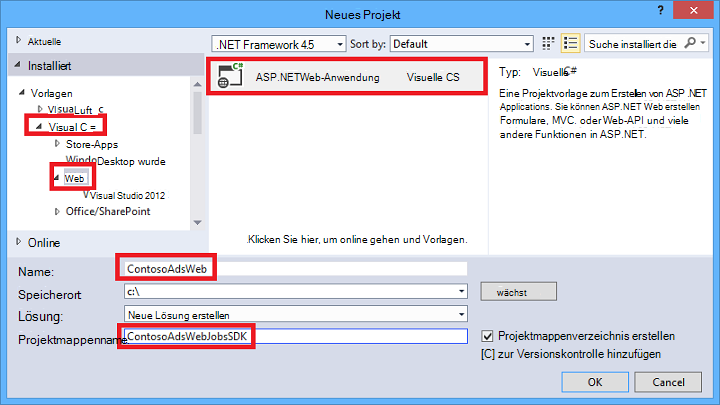

5. Wählen Sie im Dialogfeld **Neues Projekt von ASP.NET** MVC-Vorlage aus, und deaktivieren Sie das Kontrollkästchen **Host in der Cloud** unter **Microsoft Azure**.

    Auswählen des **Host in der Cloud** ermöglicht Visual Studio automatisch eine neue Azure Web app erstellen und SQL-Datenbank. Da diese zuvor erstellten, müssen Sie nun tun, während das Projekt erstellen. Wenn Sie eine neue erstellen möchten, aktivieren Sie das Kontrollkästchen. Sie können Konfigurieren der neuen Web app und SQL Datenbank genauso Sie zuvor bei der Bereitstellung der Anwendungdes.

5. Klicken Sie auf **Authentifizierung ändern**.

    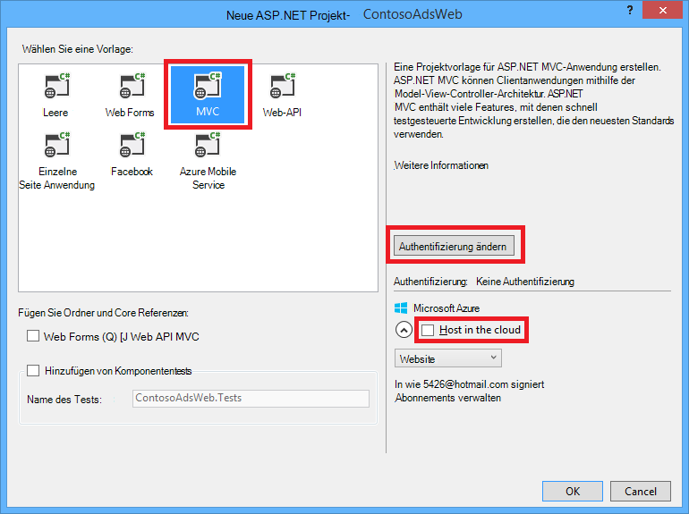

7. Wählen Sie im Dialogfeld **Authentifizierung ändern** **Keine Authentifizierung**, und klicken Sie auf **OK**.

    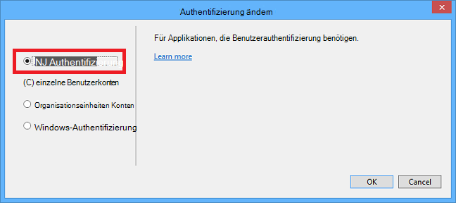

8. Klicken Sie im Dialogfeld **Neues Projekt von ASP.NET** auf **OK**.

    Visual Studio erstellt die Projektmappe und das Webprojekt.

9. Im **Projektmappen-Explorer**mit der rechten Maustaste der Projektmappe (nicht das Projekt) und wählen Sie **Hinzufügen** > **Neues Projekt**.

11. Wählen Sie im Dialogfeld **Neues Projekt hinzufügen** **Visual C#** > **Windows-Desktop** > Vorlage**Klassenbibliothek** .  

10. Nennen Sie das Projekt *ContosoAdsCommon*, und klicken Sie dann auf **OK**.

    Dieses Projekt enthält die Entity Framework-Kontext und des Datenmodells die front-End und Back-End verwenden. Alternative Sie EF-bezogene Klassen im Webprojekt definieren und dieses Projekt Webauftrags Projekt verweisen. Aber dann Webauftrags Projekt auf Web-Assemblys müssen nicht.

### Fügen Sie ein Konsolenanwendungsprojekt, das Webaufträge aktiviert Bereitstellung

1. Mit der rechten Maustaste des Webprojekts (nicht die Projektmappe oder das Klassenbibliotheksprojekt), und klicken Sie dann auf **Hinzufügen** > **Neue Azure Webauftrags Projekt**.

    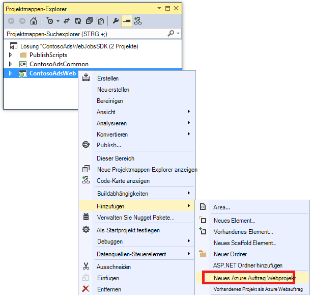

2. Geben Sie im Dialogfeld **Hinzufügen Azure Webauftrags** ContosoAdsWebJob als den **Projektnamen** und den **Webauftrag Namen**. Lassen Sie **Webauftrags Ausführungsmodus** **Fortlaufend ausführen**soll.

3.  Klicken Sie auf **OK**.

    Visual Studio erstellt ein Konsolenanwendungsprojekt als ein Webauftrag bereitstellen konfiguriert, wenn Sie das Webprojekt bereitgestellt. Dazu es folgenden Aufgaben nach Erstellen des Projekts ausgeführt:

    * Eine *Webauftrag veröffentlichen settings.json* -Datei hinzugefügt im Projektordner Eigenschaften Webauftrags.
    * *Webaufträge list.json* Datei hinzugefügt in den Projektordner Eigenschaften Web.
    * Microsoft.Web.WebJobs.Publish NuGet-Paket installiert im Projekt Webauftrags.

    Weitere Informationen hierzu finden Sie unter [wie Webaufträge mithilfe von Visual Studio bereitgestellt](websites-dotnet-deploy-webjobs.md).

### Hinzufügen von NuGet-Paketen

Die neue Projektvorlage für ein Projekt Webauftrag wird automatisch installiert, Webaufträge SDK NuGet-Paket [Microsoft.Azure.WebJobs](http://www.nuget.org/packages/Microsoft.Azure.WebJobs) und die zugehörigen Dateien.

Eine Abhängigkeit WebJobs SDK, das im Projekt Webauftrags installiert ist Azure Storage Client Standardbibliothek (SCL). Sie müssen jedoch das Webprojekt mit Blobs und Warteschlangen hinzufügen.

1. Öffnen Sie die **NuGet-Pakete verwalten** für die Lösung.

2. Wählen Sie im linken Bereich **Installierte Pakete**.

3. Suchen Sie *Azure Storage* -Paket, und klicken Sie auf **Verwalten**.

4. Wählen Sie im Feld **Projekte** **ContosoAdsWeb** das Kontrollkästchen und klicken Sie dann auf **OK**.

    Alle drei Projekte verwendet das Entity Framework arbeiten mit Daten in SQL-Datenbank.

5. Wählen Sie im linken Bereich **Online**.

6. Suchen Sie *EntityFramework* NuGet-Paket und installieren sie alle drei Projekte.

### Verweisen auf Projekt

Web- und Webauftrags Projekten arbeiten mit der SQL-Datenbank benötigen einen Verweis auf das Projekt ContosoAdsCommon.

1. Legen Sie im Projekt ContosoAdsWeb einen Verweis auf das Projekt ContosoAdsCommon. (Maustaste auf ContosoAdsWeb-Projekt, und **Klicken** > **Verweis**. Wählen Sie im Dialogfeld **Verweis-Manager** **Lösung** > **Projekte** > **ContosoAdsCommon**, und klicken Sie dann auf **OK**.)

1. Legen Sie im Projekt ContosoAdsWebJob einen Verweis auf das Projekt ContosAdsCommon.

    Webauftrags Projekt benötigt Verweise zum Arbeiten mit Bildern und Verbindungszeichenfolgen zugreifen.

3. Legen Sie im ContosoAdsWebJob-Projekt einen Verweis auf `System.Drawing` und `System.Configuration`.

### Hinzufügen von Konfigurationsdateien

Dieses Lernprogramm zeigt das [MVC-Controller und Ansichten Gerüstbau](http://www.asp.net/mvc/tutorials/mvc-5/introduction/getting-started), [Schreiben Entity Framework-Code, der SQL Server-Datenbanken verwendet,](http://www.asp.net/mvc/tutorials/getting-started-with-ef-using-mvc)oder [die Grundlagen der asynchronen Programmierung in ASP.NET 4.5](http://www.asp.net/aspnet/overview/developing-apps-with-windows-azure/building-real-world-cloud-apps-with-windows-azure/web-development-best-practices#async). So soll bleibt Konfigurationsdateien Dateien kopieren von heruntergeladenen Lösung in die neue Lösung. Nachdem Sie dies in den folgenden Abschnitten zeigen und erläutern wichtige Teile des Codes.

Um ein Projekt oder einem Ordner Dateien hinzugefügt, Maustaste Projekt oder Ordner, und klicken Sie auf **Hinzufügen** > **Vorhandenes Element**. Wählen Sie die Dateien und auf **Hinzufügen**. Wenn Sie gefragt werden, ob vorhandene Dateien ersetzen möchten, klicken Sie auf **Ja**.

1. Im Projekt ContosoAdsCommon die Datei *Class1.cs* löschen und stattdessen die folgenden Dateien aus dem heruntergeladenen Projekt hinzufügen.

    - *AD.cs*
    - *ContosoAdscontext.cs*
    - *BlobInformation.cs*  

2. Fügen Sie die folgenden Dateien im Projekt ContosoAdsWeb aus heruntergeladenen Projekt hinzu.

    - *Web.config*
    - *Global.asax.cs*  
    - Im *Ordner* : *AdController.cs*
    - Im Ordner *Views\Shared ebenfalls einen* : *_Layout.cshtml* -Datei
    - Im Ordner *Views\Home den* : *Index.cshtml*
    - Im Ordner " *Views\Ad* " (erstellen Sie zuerst den Ordner): fünf *cshtml* -Dateien  

3. Fügen Sie die folgenden Dateien im Projekt ContosoAdsWebJob aus heruntergeladenen Projekt hinzu.

    - *App.config* (Änderung der Dateifilter Typ auf **Alle Dateien**)
    - *"Program.cs"*
    - *Functions.cs*

Sie können jetzt erstellen, ausführen und Bereitstellen der Anwendung wie zuvor in diesem Lernprogramm. Bevor Sie dies tun, jedoch nicht das erste Web App läuft auf bereitgestellten Webauftrag. Andernfalls verarbeitet, Webauftrags Warteschlangennachrichten lokal oder von der app in ein neues Web app seit alle das gleiche Speicherkonto erstellt.

## Überprüfen Sie den code

Die folgenden Abschnitte erläutern den Code in Zusammenhang mit WebJobs SDK und Azure Storage Blobs und Warteschlangen.

> [AZURE.NOTE] Code für das WebJobs SDK finden Sie in den Abschnitten ["Program.cs" und Functions.cs](#programcs) .

### ContosoAdsCommon - Ad.cs

Ad.cs-Datei definiert eine Enumeration für Ad-Kategorien und eine Entitätsklasse POCO Ad-Informationen.

        public enum Category
        {
            Cars,
            [Display(Name="Real Estate")]
            RealEstate,
            [Display(Name = "Free Stuff")]
            FreeStuff
        }

        public class Ad
        {
            public int AdId { get; set; }

            [StringLength(100)]
            public string Title { get; set; }

            public int Price { get; set; }

            [StringLength(1000)]
            [DataType(DataType.MultilineText)]
            public string Description { get; set; }

            [StringLength(1000)]
            [DisplayName("Full-size Image")]
            public string ImageURL { get; set; }

            [StringLength(1000)]
            [DisplayName("Thumbnail")]
            public string ThumbnailURL { get; set; }

            [DataType(DataType.Date)]
            [DisplayFormat(DataFormatString = "{0:yyyy-MM-dd}", ApplyFormatInEditMode = true)]
            public DateTime PostedDate { get; set; }

            public Category? Category { get; set; }
            [StringLength(12)]
            public string Phone { get; set; }
        }

### ContosoAdsCommon - ContosoAdsContext.cs

Die ContosoAdsContext-Klasse gibt die Anzeige in einer Auflistung DbSet verwendet wird dem Entity Framework in einer SQL-Datenbank gespeichert.

        public class ContosoAdsContext : DbContext
        {
            public ContosoAdsContext() : base("name=ContosoAdsContext")
            {
            }
            public ContosoAdsContext(string connString)
                : base(connString)
            {
            }
            public System.Data.Entity.DbSet<Ad> Ads { get; set; }
        }

Die Klasse besitzt zwei Konstruktoren. Die erste von Webprojekt verwendet und gibt den Namen einer Verbindungszeichenfolge in der Datei Web.config oder der Azure Runtime-Umgebung gespeichert ist. Der zweite Konstruktor können Sie die aktuelle Verbindungszeichenfolge übergeben. Ist erforderlich Webauftrags Projekt eine Web.config-Datei besitzt. Sie haben weiter oben gesehen, wo diese Verbindungszeichenfolge wurde gespeichert und sehen Sie später im Code die Verbindungszeichenfolge abruft, beim die DbContext-Klasse instanziiert.

### ContosoAdsCommon - BlobInformation.cs

Die `BlobInformation` Klasse wird verwendet, um Informationen über ein Bild Blob in einer warteschlangennachricht speichern.

        public class BlobInformation
        {
            public Uri BlobUri { get; set; }

            public string BlobName
            {
                get
                {
                    return BlobUri.Segments[BlobUri.Segments.Length - 1];
                }
            }
            public string BlobNameWithoutExtension
            {
                get
                {
                    return Path.GetFileNameWithoutExtension(BlobName);
                }
            }
            public int AdId { get; set; }
        }

### ContosoAdsWeb - Global.asax.cs

Code, der aufgerufen wird die `Application_Start` Methode erstellt ein *Bilder* BLOB-Container und einer Warteschlange *Bilder* , wenn diese noch nicht vorhanden. Dadurch wird sichergestellt, dass bei jedem start ein neues Speicherkonto mit erforderlichen BLOB-Container und Warteschlange automatisch erstellt werden.

Der Code erhält Zugriff auf das Speicherkonto über Speicher-Verbindungszeichenfolge aus der Datei *Web.config* oder Azure Runtime-Umgebung.

        var storageAccount = CloudStorageAccount.Parse
            (ConfigurationManager.ConnectionStrings["AzureWebJobsStorage"].ToString());

Dann Ruft einen Verweis auf *Bilder* BLOB-Container, der Container wird erstellt, wenn dabei nicht bereits vorhanden ist und Zugriffsberechtigungen für den neuen Container. Standardmäßig können neue Container nur Clients mit Speicher Anmeldeinformationen auf Blobs. Web app benötigt die Blobs öffentlich sein, damit Bilder Bild Blobs auf URLs angezeigt werden kann.

        var blobClient = storageAccount.CreateCloudBlobClient();
        var imagesBlobContainer = blobClient.GetContainerReference("images");
        if (imagesBlobContainer.CreateIfNotExists())
        {
            imagesBlobContainer.SetPermissions(
                new BlobContainerPermissions
                {
                    PublicAccess = BlobContainerPublicAccessType.Blob
                });
        }

Ähnlicher Code Ruft einen Verweis auf die Warteschlange *Thumbnailrequest* und erstellt eine neue Warteschlange. In diesem Fall braucht keine Berechtigungen ändern. 

        CloudQueueClient queueClient = storageAccount.CreateCloudQueueClient();
        var imagesQueue = queueClient.GetQueueReference("thumbnailrequest");
        imagesQueue.CreateIfNotExists();

### ContosoAdsWeb - _Layout.cshtml

*_Layout.cshtml* -Datei wird der Name der Anwendung in die Kopf- und Fußzeile und erstellt ein Menü "Anzeigen".

### ContosoAdsWeb - Views\Home\Index.cshtml

Die Datei *Views\Home\Index.cshtml* zeigt Kategorien auf der Startseite. Links übergeben Sie den Wert der `Category` -Enumeration in Abfragezeichenfolgen-Variable auf der Seite anzeigen.

        <li>@Html.ActionLink("Cars", "Index", "Ad", new { category = (int)Category.Cars }, null)</li>
        <li>@Html.ActionLink("Real estate", "Index", "Ad", new { category = (int)Category.RealEstate }, null)</li>
        <li>@Html.ActionLink("Free stuff", "Index", "Ad", new { category = (int)Category.FreeStuff }, null)</li>
        <li>@Html.ActionLink("All", "Index", "Ad", null, null)</li>

### ContosoAdsWeb - AdController.cs

*AdController.cs* Datei Konstruktor ruft die `InitializeStorage` -Methode Azure Storage-Clientbibliothek Objekte erstellen, die eine API mit Blobs und Warteschlangen ermöglichen.

Dann wird der Code einen Verweis auf *Bilder* BLOB-Container wie Sie zuvor in *Global.asax.cs*. Dabei, wird eine standardmäßige [Richtlinie erneut](http://www.asp.net/aspnet/overview/developing-apps-with-windows-azure/building-real-world-cloud-apps-with-windows-azure/transient-fault-handling) für eine Webanwendung. Die Standardrichtlinie für exponentielle Backoff wiederholen hängt Web app länger als eine Minute auf wiederholte Versuche für einen vorübergehenden Fehler. Die hier angegebene wiederholungsrichtlinie wartet 3 Sekunden nach jedem Versuch für bis zu 3 Versuche.

        var blobClient = storageAccount.CreateCloudBlobClient();
        blobClient.DefaultRequestOptions.RetryPolicy = new LinearRetry(TimeSpan.FromSeconds(3), 3);
        imagesBlobContainer = blobClient.GetContainerReference("images");

Ähnlicher Code Ruft einen Verweis auf die Warteschlange *Bilder* .

        CloudQueueClient queueClient = storageAccount.CreateCloudQueueClient();
        queueClient.DefaultRequestOptions.RetryPolicy = new LinearRetry(TimeSpan.FromSeconds(3), 3);
        imagesQueue = queueClient.GetQueueReference("blobnamerequest");

Die meisten der Controller-Code ist typisch für die Arbeit mit einer Entity Framework-Datenmodell eine DbContext-Klasse. Eine Ausnahme ist die HttpPost `Create` Methode, die eine Datei im BLOB-Speicher gespeichert. Der Modellbinder stellt ein [HttpPostedFileBase](http://msdn.microsoft.com/library/system.web.httppostedfilebase.aspx) Objekt der Methode.

        [HttpPost]
        [ValidateAntiForgeryToken]
        public async Task<ActionResult> Create(
            [Bind(Include = "Title,Price,Description,Category,Phone")] Ad ad,
            HttpPostedFileBase imageFile)

Wenn der Benutzer eine Datei zum Hochladen ausgewählt, der Code die Datei im Blob gespeichert und aktualisiert Active Directory-Datenbank-Datensatz mit einer URL für das Blob.

        if (imageFile != null && imageFile.ContentLength != 0)
        {
            blob = await UploadAndSaveBlobAsync(imageFile);
            ad.ImageURL = blob.Uri.ToString();
        }

Der Code, die den Upload ist in der `UploadAndSaveBlobAsync` Methode. Es erstellt ein GUID für das Blob uploads und speichert die Datei und gibt einen Verweis auf das gespeicherte Blob.

        private async Task<CloudBlockBlob> UploadAndSaveBlobAsync(HttpPostedFileBase imageFile)
        {
            string blobName = Guid.NewGuid().ToString() + Path.GetExtension(imageFile.FileName);
            CloudBlockBlob imageBlob = imagesBlobContainer.GetBlockBlobReference(blobName);
            using (var fileStream = imageFile.InputStream)
            {
                await imageBlob.UploadFromStreamAsync(fileStream);
            }
            return imageBlob;
        }

Nach HttpPost `Create` -Methode lädt einen Blob aktualisiert die Datenbank und erstellt eine Warteschlange Back-End-Prozess darüber informieren, dass ein Bild zur Konvertierung in eine Miniaturansicht an.

        BlobInformation blobInfo = new BlobInformation() { AdId = ad.AdId, BlobUri = new Uri(ad.ImageURL) };
        var queueMessage = new CloudQueueMessage(JsonConvert.SerializeObject(blobInfo));
        await thumbnailRequestQueue.AddMessageAsync(queueMessage);

Der Code für die HttpPost `Edit` -Methode ist vergleichbar, außer dass alle Blobs für diese Anzeige vorhanden wählt der Benutzer eine neue Imagedatei gelöscht werden müssen.

        if (imageFile != null && imageFile.ContentLength != 0)
        {
            await DeleteAdBlobsAsync(ad);
            imageBlob = await UploadAndSaveBlobAsync(imageFile);
            ad.ImageURL = imageBlob.Uri.ToString();
        }

Hier ist der Code, der Blobs löscht, wenn Sie eine Anzeige löschen:

        private async Task DeleteAdBlobsAsync(Ad ad)
        {
            if (!string.IsNullOrWhiteSpace(ad.ImageURL))
            {
                Uri blobUri = new Uri(ad.ImageURL);
                await DeleteAdBlobAsync(blobUri);
            }
            if (!string.IsNullOrWhiteSpace(ad.ThumbnailURL))
            {
                Uri blobUri = new Uri(ad.ThumbnailURL);
                await DeleteAdBlobAsync(blobUri);
            }
        }
        private static async Task DeleteAdBlobAsync(Uri blobUri)
        {
            string blobName = blobUri.Segments[blobUri.Segments.Length - 1];
            CloudBlockBlob blobToDelete = imagesBlobContainer.GetBlockBlobReference(blobName);
            await blobToDelete.DeleteAsync();
        }

### ContosoAdsWeb - Views\Ad\Index.cshtml und Details.cshtml

Die Datei *Index.cshtml* Zeigt Miniaturansichten mit anderen Ad-Daten:

        

Die Datei *Details.cshtml* zeigt das Bild in voller Größe:

        

### ContosoAdsWeb - Views\Ad\Create.cshtml und Edit.cshtml

Die Dateien *Create.cshtml* und *Edit.cshtml* geben Formular Codierung, die zu dem Controller können die `HttpPostedFileBase` Objekt.

        @using (Html.BeginForm("Create", "Ad", FormMethod.Post, new { enctype = "multipart/form-data" }))

Ein `<input>` Element weist den Browser an ein Dialogfeld zur Dateiauswahl bereitzustellen.

        <input type="file" name="imageFile" accept="image/*" class="form-control fileupload" />

### ContosoAdsWebJob - "Program.cs"

Der Webauftrag beginnt, `Main` Methodenaufrufe WebJobs SDK `JobHost.RunAndBlock` Methode, um die Ausführung der Funktionen für den aktuellen Thread ausgelöst.

        static void Main(string[] args)
        {
            JobHost host = new JobHost();
            host.RunAndBlock();
        }

### ContosoAdsWebJob - Functions.cs - GenerateThumbnail-Methode

Das WebJobs SDK ruft diese Methode auf, wenn eine warteschlangennachricht empfangen wird. Die Methode erstellt eine Miniaturansicht und die Miniaturansicht URL in der Datenbank.

        public static void GenerateThumbnail(
        [QueueTrigger("thumbnailrequest")] BlobInformation blobInfo,
        [Blob("images/{BlobName}", FileAccess.Read)] Stream input,
        [Blob("images/{BlobNameWithoutExtension}_thumbnail.jpg")] CloudBlockBlob outputBlob)
        {
            using (Stream output = outputBlob.OpenWrite())
            {
                ConvertImageToThumbnailJPG(input, output);
                outputBlob.Properties.ContentType = "image/jpeg";
            }

            // Entity Framework context class is not thread-safe, so it must
            // be instantiated and disposed within the function.
            using (ContosoAdsContext db = new ContosoAdsContext())
            {
                var id = blobInfo.AdId;
                Ad ad = db.Ads.Find(id);
                if (ad == null)
                {
                    throw new Exception(String.Format("AdId {0} not found, can't create thumbnail", id.ToString()));
                }
                ad.ThumbnailURL = outputBlob.Uri.ToString();
                db.SaveChanges();
            }
        }

* Die `QueueTrigger` Attribut weist das WebJobs SDK, diese Methode aufzurufen, wenn eine neue Nachricht in der Warteschlange Thumbnailrequest empfangen wird.

        [QueueTrigger("thumbnailrequest")] BlobInformation blobInfo,

    Die `BlobInformation` Objekt in der warteschlangennachricht wird automatisch deserialisierte in der `blobInfo` Parameter. Nach Abschluss die Methode wird die warteschlangennachricht gelöscht. Schlägt vor Abschluss die Methode wird die warteschlangennachricht nicht gelöscht. nach 10 Minuten Lease abläuft, wird die Nachricht wieder aufgegriffen freigegeben und verarbeitet. Diese Sequenz wird nicht unbegrenzt wiederholt werden, wenn eine Nachricht immer eine Ausnahme auslöst. Nach 5 erfolglosen Versuchen, eine Meldung zu verarbeiten, wird die Nachricht in eine Warteschlange mit dem Namen {Queuename} verschoben-Gift. Die maximale Anzahl der Versuche ist konfigurierbar.

* Die beiden `Blob` Attribute stellen Blobs an Objekte: eines vorhandenen Bildes BLOBs und eine neue Miniaturansicht Blob, das die Methode erstellt.

        [Blob("images/{BlobName}", FileAccess.Read)] Stream input,
        [Blob("images/{BlobNameWithoutExtension}_thumbnail.jpg")] CloudBlockBlob outputBlob)

    BLOB-Namen stammen von Eigenschaften der `BlobInformation` -Objekt in die Warteschlange erhalten haben (`BlobName` und `BlobNameWithoutExtension`). Um die volle Funktionalität von Speicher-Clientbibliothek erhalten können die `CloudBlockBlob` Klasse mit Blobs. Möchten Sie Code wiederverwenden, der geschrieben wurde mit `Stream` Objekte können Sie die `Stream` Klasse.

Weitere Informationen, Funktionen zu schreiben, die webjobs SDK Attribute verwenden, finden Sie in folgenden Ressourcen:

* [Verwendung von Azure Warteschlangenspeicher mit WebJobs SDK](websites-dotnet-webjobs-sdk-storage-queues-how-to.md)
* [Verwendung von Azure BLOB-Speicher mit WebJobs SDK](websites-dotnet-webjobs-sdk-storage-blobs-how-to.md)
* [Verwendung von Azure-Tabellenspeicher mit WebJobs SDK](websites-dotnet-webjobs-sdk-storage-tables-how-to.md)
* [Verwendung von Azure Service Bus mit WebJobs SDK](websites-dotnet-webjobs-sdk-service-bus.md)

> [AZURE.NOTE]
>
> * Ihrer Anwendung auf mehrere virtuelle Computer ausgeführt wird, mehrere Webaufträge werden gleichzeitig und in einigen Szenarien können dadurch dieselben Daten mehrmals verarbeitet. Dies ist kein Problem bei Verwendung der integrierten Warteschlange Blob und Service Bus-Trigger. Das SDK wird sichergestellt, dass Funktionen nur einmal für jede Nachricht oder Blob verarbeitet werden.
>
> * Informationen ordnungsgemäßes Herunterfahren implementiert finden Sie unter [Heruntergefahren](websites-dotnet-webjobs-sdk-storage-queues-how-to.md#graceful).
>
> * Der Code in der `ConvertImageToThumbnailJPG` (nicht dargestellt)-Methode verwendet Klassen in der `System.Drawing` Namespace Einfachheit. Allerdings wurden die Klassen in diesem Namespace für die Verwendung mit Windows Forms konzipiert. Sie sind nicht zur Verwendung in einem Dienst von Windows oder ASP.NET unterstützt. Weitere Informationen über Bildverarbeitungsoptionen finden Sie unter [Dynamic Image Generation](http://www.hanselman.com/blog/BackToBasicsDynamicImageGenerationASPNETControllersRoutingIHttpHandlersAndRunAllManagedModulesForAllRequests.aspx) und [Tiefe innerhalb der Bildgröße](http://www.hanselminutes.com/313/deep-inside-image-resizing-and-scaling-with-aspnet-and-iis-with-imageresizingnet-author-na).

## Nächste Schritte

In diesem Lernprogramm haben Sie eine einfache Anwendung mit mehreren Ebene gesehen, die das WebJobs SDK für Back-End-Verarbeitung verwendet. Dieser Abschnitt enthält einige Vorschläge zur Vertiefung ASP.NET Multi-Tier Applications und Webaufträge.

### Fehlende features

Die Anwendung hat ein erste-Schritte-Lernprogramm einfach gehalten. In einer realen Anwendung würden Sie [Dependency Injection](http://www.asp.net/mvc/tutorials/hands-on-labs/aspnet-mvc-4-dependency-injection) und [Repository und Einheit arbeiten Muster](http://www.asp.net/mvc/tutorials/getting-started-with-ef-using-mvc/advanced-entity-framework-scenarios-for-an-mvc-web-application#repo)implementieren, verwenden Sie [eine Schnittstelle für die Protokollierung](http://www.asp.net/aspnet/overview/developing-apps-with-windows-azure/building-real-world-cloud-apps-with-windows-azure/monitoring-and-telemetry#log), [EF Code First-Migrationen](http://www.asp.net/mvc/tutorials/getting-started-with-ef-using-mvc/migrations-and-deployment-with-the-entity-framework-in-an-asp-net-mvc-application) Datenmodells zu verwenden und [EF Verbindung Stabilität](http://www.asp.net/mvc/tutorials/getting-started-with-ef-using-mvc/connection-resiliency-and-command-interception-with-the-entity-framework-in-an-asp-net-mvc-application) vorübergehende Netzwerkfehler zu verwenden.

### Webaufträge skalieren

Webaufträge werden im Kontext einer Web App und nicht skalierbaren getrennt. Beispielsweise haben Sie einen Standard-Web app-Instanz haben nur eine Instanz des Prozesses Hintergrund ausgeführt und verwendet einige der Serverressourcen (CPU, Arbeitsspeicher, etc.), die andernfalls von Webinhalten zu.

Datenverkehr nach Tageszeit oder Wochentag variieren und gegebenenfalls die Backend-Verarbeitung warten kann, konnte der Webaufträge Ausführung für Zeiten mit geringem Datenverkehr planen. Wenn die Last zu hoch für diese Lösung bleibt, können Sie Backend als Webauftrags in einer separaten Web app dedizierten dafür ausführen. Back-End-Web-app kann dann unabhängig von Ihrer Front-End-Anwendung skaliert werden.

Weitere Informationen finden Sie unter [Skalierung Webaufträge](websites-webjobs-resources.md#scale).

### Web app Timeout Stillstand vermeiden

Zu Ihrem Webaufträge werden immer ausgeführt und auf alle Instanzen von Ihrer Anwendung ausgeführt wird, müssen Sie die [AlwaysOn](http://weblogs.asp.net/scottgu/archive/2014/01/16/windows-azure-staging-publishing-support-for-web-sites-monitoring-improvements-hyper-v-recovery-manager-ga-and-pci-compliance.aspx) -Funktion zu aktivieren.

### Mithilfe des SDK Webaufträge außerhalb Webaufträge

Ein Programm, das WebJobs SDK verwendet, keinen Azure in ein Webauftrag ausführen. Kann lokal ausgeführt und können auch in einer anderen Umgebung einen Cloud-Dienst Worker-Rolle oder einen Windows-Dienst ausführen. Allerdings können Sie nur WebJobs SDK Dashboard über eine Azure Web app zugreifen. Um das Dashboard verwenden müssen Sie das Speicherkonto durch Festlegen der Verbindungszeichenfolge AzureWebJobsDashboard auf die Registerkarte **Konfigurieren** der klassischen Portal verwendeten Web app herstellen. Sie können dem Dashboard dann mithilfe der folgenden URL:

https://{webappname}.SCM.azurewebsites.NET/azurejobs/#/Functions

Für Weitere Informationen sehen [ein Dashboard für lokale Entwicklung Webaufträge SDK](http://blogs.msdn.com/b/jmstall/archive/2014/01/27/getting-a-dashboard-for-local-development-with-the-webjobs-sdk.aspx)Beachten Sie, dass sie eine alte Verbindungszeichenfolgennamen.

### Weitere Webaufträge Dokumentation

Weitere Informationen finden Sie unter [Azure Webaufträge Dokumentationsressourcen](http://go.microsoft.com/fwlink/?LinkId=390226).
