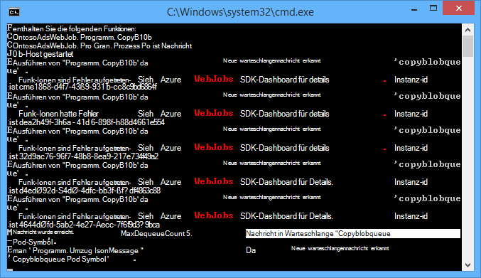
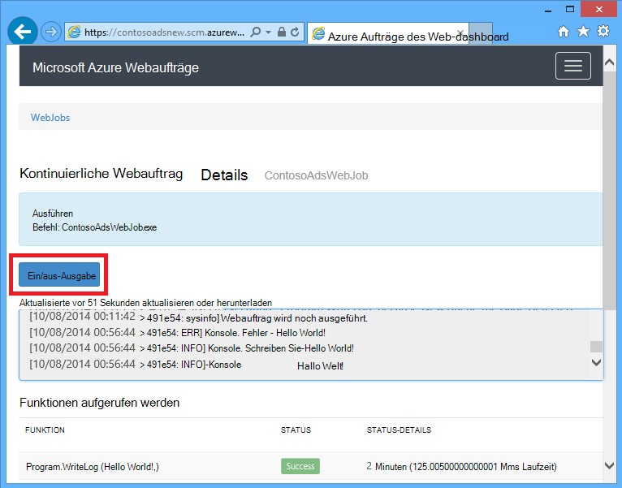
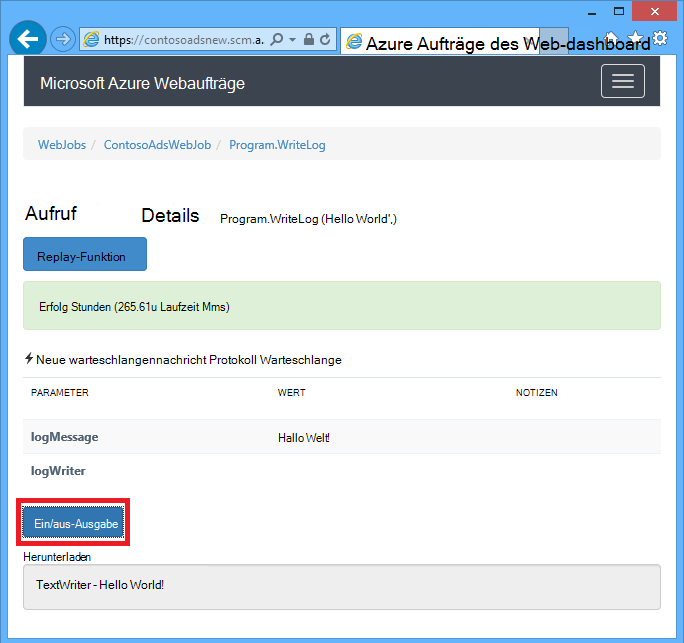
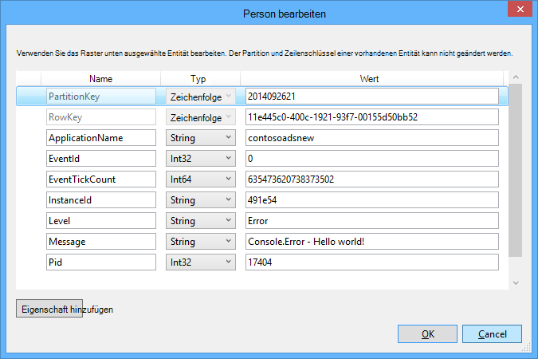

<properties 
    pageTitle="Verwendung von Azure Warteschlangenspeicher mit WebJobs SDK" 
    description="Informationen Sie zum Azure Warteschlangenspeicher WebJobs SDK verwenden. Erstellen und Löschen von Warteschlangen. Fügen Sie ein, einsehen abrufen Sie und löschen Sie der Warteschlange Nachrichten." 
    services="app-service\web, storage" 
    documentationCenter=".net" 
    authors="tdykstra" 
    manager="wpickett" 
    editor="jimbe"/>

<tags 
    ms.service="app-service-web" 
    ms.workload="web" 
    ms.tgt_pltfrm="na" 
    ms.devlang="dotnet" 
    ms.topic="article" 
    ms.date="06/01/2016" 
    ms.author="tdykstra"/>

# <a name="how-to-use-azure-queue-storage-with-the-webjobs-sdk"></a>Verwendung von Azure Warteschlangenspeicher mit WebJobs SDK

## <a name="overview"></a>Übersicht

Dieses Handbuch bietet C# Code-Beispiele, die zeigen, wie Azure Webaufträge SDK Version 1.x mit dem Speicherdienst Azure-Warteschlange.

Das Handbuch setzt voraus wissen [wie ein Webauftrag Projekt in Visual Studio mit Verbindungszeichenfolgen erstellt das Speicherkonto darauf](websites-dotnet-webjobs-sdk-get-started.md#configure-storage) oder [mehrere Storage-Konten](https://github.com/Azure/azure-webjobs-sdk/blob/master/test/Microsoft.Azure.WebJobs.Host.EndToEndTests/MultipleStorageAccountsEndToEndTests.cs).

Die meisten Codeausschnitte zeigen nur Funktionen nicht den erstellten Code der `JobHost` Objekt wie in diesem Beispiel:

        static void Main(string[] args)
        {
            JobHost host = new JobHost();
            host.RunAndBlock();
        }
        
Das Handbuch enthält folgenden Themen:

-   [Wie eine Funktion ausgelöst wird, wenn eine Warteschlange Nachricht](#trigger)
    - Warteschlangennachrichten Zeichenfolge
    - POCO Warteschlangennachrichten
    - Async-Funktion
    - Typen verwendet das QueueTrigger-Attribut
    - Abruf-Algorithmus
    - Mehrere Instanzen
    - Parallele Ausführung
    - Warteschlange oder Warteschlange Nachrichtenmetadaten abrufen
    - Ordnungsgemäßes Herunterfahren
-   [Erstellen eine warteschlangennachricht beim Verarbeiten einer warteschlangennachricht](#createqueue)
    - Warteschlangennachrichten Zeichenfolge
    - POCO Warteschlangennachrichten
    - Erstellen Sie mehrere Nachrichten oder Async-Funktionen
    - Typen verwendet das Attribut Warteschlange
    - WebJobs SDK Attribute im Hauptteil einer Funktion
-   [Lesen und Schreiben von Blobs beim Verarbeiten einer warteschlangennachricht](#blobs)
    - Warteschlangennachrichten Zeichenfolge
    - POCO Warteschlangennachrichten
    - Typen verwendet das BLOB-Attribut
-   [Unzustellbare Nachrichten behandelt](#poison)
    - Automatische unzustellbare Nachrichten
    - Manuelle unzustellbare Nachrichten
-   [Gewusst wie: Festlegen](#config)
    - SDK-Verbindungszeichenfolgen im Code festlegen
    - QueueTrigger konfigurieren
    - Legen Sie Werte für WebJobs SDK Parameter im code
-   [Wie eine Funktion manuell auslösen](#manual)
-   [Protokolle schreiben](#logs) 
-   [Behandeln von Fehlern und Timeouts konfigurieren](#errors)
-   [Nächste Schritte](#nextsteps)

## <a id="trigger"></a>Wie eine Funktion ausgelöst wird, wenn eine Warteschlange Nachricht

Verwenden, um eine Funktion zu schreiben, das WebJobs SDK aufruft, wenn eine Warteschlange Nachricht die `QueueTrigger` Attribut. Der Attributkonstruktor hat einen Zeichenfolgenparameter mit dem Namen der Warteschlange abgefragt. Sie können auch [den Namen der Warteschlange dynamisch](#config).

### <a name="string-queue-messages"></a>Warteschlangennachrichten Zeichenfolge

Im folgenden Beispiel enthält die Warteschlange eine Zeichenfolgennachricht so `QueueTrigger` gilt für einen Parameter mit dem Namen `logMessage` die Warteschlange Nachrichten enthält. Die Funktion, [schreibt eine Nachricht wird an das Dashboard](#logs).
 

        public static void ProcessQueueMessage([QueueTrigger("logqueue")] string logMessage, TextWriter logger)
        {
            logger.WriteLine(logMessage);
        }

Neben `string`, der Parameter möglicherweise ein Bytearray eine `CloudQueueMessage` Objekt oder ein POCO definieren.

### <a name="poco-plain-old-clr-objecthttpenwikipediaorgwikiplainoldclrobject-queue-messages"></a>POCO [(Plain Old CLR-Objekt](http://en.wikipedia.org/wiki/Plain_Old_CLR_Object)) Nachrichten in die Warteschlange

Im folgenden Beispiel die Warteschlange enthält JSON für eine `BlobInformation` Objekt enthält eine `BlobName` Eigenschaft. Das SDK wird automatisch das Objekt deserialisiert.

        public static void WriteLogPOCO([QueueTrigger("logqueue")] BlobInformation blobInfo, TextWriter logger)
        {
            logger.WriteLine("Queue message refers to blob: " + blobInfo.BlobName);
        }

Das SDK verwendet [Newtonsoft.Json NuGet-Paket](http://www.nuget.org/packages/Newtonsoft.Json) zum Serialisieren und Deserialisieren von Nachrichten. Wenn Sie Nachrichten in Warteschlange in einem Programm, das WebJobs SDK nicht erstellen, können Sie Code wie im folgenden Beispiel eine POCO warteschlangennachricht erstellen, die das SDK analysieren kann schreiben. 

        BlobInformation blobInfo = new BlobInformation() { BlobName = "log.txt" };
        var queueMessage = new CloudQueueMessage(JsonConvert.SerializeObject(blobInfo));
        logQueue.AddMessage(queueMessage);

### <a name="async-functions"></a>Async-Funktion

Die folgenden asynchronen Funktion [schreibt ein Protokoll zum Dashboard](#logs).

        public async static Task ProcessQueueMessageAsync([QueueTrigger("logqueue")] string logMessage, TextWriter logger)
        {
            await logger.WriteLineAsync(logMessage);
        }

Async-Funktionen können ein [Abbruchtoken](http://www.asp.net/mvc/overview/performance/using-asynchronous-methods-in-aspnet-mvc-4#CancelToken), wie im folgenden Beispiel dargestellt, in dem einen Blob kopiert. (Eine Erläuterung der `queueTrigger` Platzhalter [Blobs](#blobs) Abschnitt.)

        public async static Task ProcessQueueMessageAsyncCancellationToken(
            [QueueTrigger("blobcopyqueue")] string blobName, 
            [Blob("textblobs/{queueTrigger}",FileAccess.Read)] Stream blobInput,
            [Blob("textblobs/{queueTrigger}-new",FileAccess.Write)] Stream blobOutput,
            CancellationToken token)
        {
            await blobInput.CopyToAsync(blobOutput, 4096, token);
        }

### <a id="qtattributetypes"></a>Typen verwendet das QueueTrigger-Attribut

Sie können `QueueTrigger` mit den folgenden Typen:

* `string`
* Ein POCO als JSON serialisiert
* `byte[]`
* `CloudQueueMessage`

### <a id="polling"></a>Abruf-Algorithmus

Das SDK implementiert einen zufälligen exponentiellen Backoff-Algorithmus, um die Wirkung der Leerlauf-Warteschlange Speicherkosten Transaktion abrufen.  Findet eine Nachricht SDK wartet zwei Sekunden und dann auf eine andere Nachricht; Wenn keine Nachricht gefunden wartet ungefähr vier Sekunden vor dem erneuten Versuch. Nachdem nachfolgende Versuche zu einer warteschlangennachricht weiterhin die Wartezeit bis auf die maximale Wartezeit von einer Minute verwendet. [Die maximale Wartezeit ist konfigurierbar](#config).

### <a id="instances"></a>Mehrere Instanzen

Wenn Ihrer Anwendung auf mehrere Instanzen ausgeführt wird, kontinuierlichen Webauftrags wird auf jedem Computer und jedem Computer warten Sie Trigger und Funktionen ausführen. Trigger Warteschlange WebJobs SDK verhindert, dass automatisch eine Funktion Verarbeiten einer warteschlangennachricht mehrmals; Funktionen haben keinen Idempotent sein geschrieben werden. Möchten Sie sicherstellen, dass nur eine Instanz eine Funktion ausgeführt wird, auch wenn mehrere Instanzen von Host Web app jedoch können Sie die `Singleton` Attribut. 

### <a id="parallel"></a>Parallele Ausführung

Haben Sie mehrere Funktionen auf verschiedene Warteschlangen rufen SDK sie parallel gleichzeitig Nachrichten. 

Das gilt für eine einzelne Warteschlange mehrere Nachrichten empfangen werden. Das SDK standardmäßig 16 Warteschlange Nachrichten gleichzeitig ruft und führt die Funktion, die sie parallel verarbeitet. [Die Batchgröße ist konfigurierbar](#config). Wenn die Anzahl verarbeiteten Hälfte die Batchgröße unten, SDK ein anderes und beginnt Nachrichten verarbeiten. Daher ist die maximale Anzahl der pro Funktion verarbeiteten Nachrichten gleichzeitig eine zweieinhalb Mal die Batchgröße. Dieser Grenzwert gilt separat für jede Funktion mit einem `QueueTrigger` Attribut. 

Wenn Sie parallele Ausführung für Nachrichten in einer Warteschlange empfangen möchten, können Sie die Batchgröße auf 1 festlegen. Siehe auch **mehr Kontrolle über die Verarbeitung von Arbeitswarteschlangen** in [Azure Webaufträge SDK 1.1.0 RTM](/blog/azure-webjobs-sdk-1-1-0-rtm/).

### <a id="queuemetadata"></a>Warteschlange oder Warteschlange Nachrichtenmetadaten abrufen

Die folgenden Nachrichteneigenschaften erhalten Sie die Methodensignatur Parameter hinzufügen:

* `DateTimeOffset`expirationTime
* `DateTimeOffset`insertionTime
* `DateTimeOffset`nextVisibleTime
* `string`QueueTrigger (enthält Meldungstext)
* `string`ID
* `string`popReceipt
* `int`dequeueCount

Wenn Sie direkt mit den Azure-Speicher-API arbeiten möchten, können Sie auch Hinzufügen einer `CloudStorageAccount` Parameter.

Im folgende Beispiel schreibt diese Metadaten in ein Anwendungsprotokoll INFO. Im Beispiel enthalten LogMessage und QueueTrigger den Inhalt der warteschlangennachricht.

        public static void WriteLog([QueueTrigger("logqueue")] string logMessage,
            DateTimeOffset expirationTime,
            DateTimeOffset insertionTime,
            DateTimeOffset nextVisibleTime,
            string id,
            string popReceipt,
            int dequeueCount,
            string queueTrigger,
            CloudStorageAccount cloudStorageAccount,
            TextWriter logger)
        {
            logger.WriteLine(
                "logMessage={0}\n" +
            "expirationTime={1}\ninsertionTime={2}\n" +
                "nextVisibleTime={3}\n" +
                "id={4}\npopReceipt={5}\ndequeueCount={6}\n" +
                "queue endpoint={7} queueTrigger={8}",
                logMessage, expirationTime,
                insertionTime,
                nextVisibleTime, id,
                popReceipt, dequeueCount,
                cloudStorageAccount.QueueEndpoint,
                queueTrigger);
        }

Hier ist ein Beispielprotokoll vom Beispielcode:

        logMessage=Hello world!
        expirationTime=10/14/2014 10:31:04 PM +00:00
        insertionTime=10/7/2014 10:31:04 PM +00:00
        nextVisibleTime=10/7/2014 10:41:23 PM +00:00
        id=262e49cd-26d3-4303-ae88-33baf8796d91
        popReceipt=AgAAAAMAAAAAAAAAfc9H0n/izwE=
        dequeueCount=1
        queue endpoint=https://contosoads.queue.core.windows.net/
        queueTrigger=Hello world!

### <a id="graceful"></a>Ordnungsgemäßes Herunterfahren

Eine Funktion, die in einem kontinuierlichen Webauftrags akzeptiert ein `CancellationToken` Parameter ermöglicht das Betriebssystem die Funktion benachrichtigt den Webauftrag wird beendet. Diese Benachrichtigung können Sie sicherstellen, dass die Funktion auf eine Weise, die Daten in einem inkonsistenten Zustand verlassen, unerwartet beendet nicht.

Im folgenden Beispiel wird veranschaulicht, wie Beschäftigungsende bevorstehenden Webauftrags in einer Funktion überprüft.

    public static void GracefulShutdownDemo(
                [QueueTrigger("inputqueue")] string inputText,
                TextWriter logger,
                CancellationToken token)
    {
        for (int i = 0; i < 100; i++)
        {
            if (token.IsCancellationRequested)
            {
                logger.WriteLine("Function was cancelled at iteration {0}", i);
                break;
            }
            Thread.Sleep(1000);
            logger.WriteLine("Normal processing for queue message={0}", inputText);
        }
    }

**Hinweis:** Das Dashboard kann den Status und die Ausgabe der Funktionen, die beendet wurden nicht richtig angezeigt.
 
Weitere Informationen finden Sie unter [Webaufträge heruntergefahren](http://blog.amitapple.com/post/2014/05/webjobs-graceful-shutdown/#.VCt1GXl0wpR).   

## <a id="createqueue"></a>Erstellen eine warteschlangennachricht beim Verarbeiten einer warteschlangennachricht

Verwenden Sie eine Funktion schreiben, die eine neue warteschlangennachricht erstellt, die `Queue` Attribut. Wie `QueueTrigger`in den Warteschlangennamen als Zeichenfolge übergeben, oder Sie können [den Namen der Warteschlange dynamisch](#config).

### <a name="string-queue-messages"></a>Warteschlangennachrichten Zeichenfolge

Das folgende Codebeispiel nicht Async erstellt eine neue warteschlangennachricht in der Warteschlange mit dem Namen "Outputqueue" mit denselben Inhalt wie die Warteschlange Meldung in der Warteschlange mit dem Namen "Inputqueue". (Für asynchrone Funktionen verwenden `IAsyncCollector<T>` siehe weiter unten in diesem Abschnitt.)


        public static void CreateQueueMessage(
            [QueueTrigger("inputqueue")] string queueMessage,
            [Queue("outputqueue")] out string outputQueueMessage )
        {
            outputQueueMessage = queueMessage;
        }
  
### <a name="poco-plain-old-clr-objecthttpenwikipediaorgwikiplainoldclrobject-queue-messages"></a>POCO [(Plain Old CLR-Objekt](http://en.wikipedia.org/wiki/Plain_Old_CLR_Object)) Nachrichten in die Warteschlange

Übergeben Sie zum Erstellen einer warteschlangennachricht, die anstelle einer Zeichenfolge einen POCO enthält POCO-Typ als Ausgabeparameter, die `Queue` Attributkonstruktor.
 
        public static void CreateQueueMessage(
            [QueueTrigger("inputqueue")] BlobInformation blobInfoInput,
            [Queue("outputqueue")] out BlobInformation blobInfoOutput )
        {
            blobInfoOutput = blobInfoInput;
        }

Das SDK wird automatisch Objekt JSON serialisiert. Eine warteschlangennachricht wird immer erstellt, auch wenn das Objekt null ist.

### <a name="create-multiple-messages-or-in-async-functions"></a>Erstellen Sie mehrere Nachrichten oder Async-Funktionen

Erstellen Sie mehrere Nachrichten stellen den Parametertyp der Ausgabewarteschlange `ICollector<T>` oder `IAsyncCollector<T>`, wie im folgenden Beispiel gezeigt.

        public static void CreateQueueMessages(
            [QueueTrigger("inputqueue")] string queueMessage,
            [Queue("outputqueue")] ICollector<string> outputQueueMessage,
            TextWriter logger)
        {
            logger.WriteLine("Creating 2 messages in outputqueue");
            outputQueueMessage.Add(queueMessage + "1");
            outputQueueMessage.Add(queueMessage + "2");
        }

Jede warteschlangennachricht sofort erstellt bei der `Add` wird aufgerufen.

### <a name="types-that-the-queue-attribute-works-with"></a>Typen, denen Warteschlange Attribut zusammenarbeitet

Sie können die `Queue` Attribut auf folgende Parameter:

* `out string`(erstellt Message Queue Parameterwert nicht Null ist, wenn die Funktion beendet)
* `out byte[]`(wie `string`) 
* `out CloudQueueMessage`(wie `string`) 
* `out POCO`(ein serialisierbarer Typ erstellt eine Nachricht mit einem null-Objekt ist der Parameter null nach Beendigung der Funktion)
* `ICollector`
* `IAsyncCollector`
* `CloudQueue`(zum manuellen Erstellen von Nachrichten mithilfe der Azure-Speicher-API direkt)

### <a id="ibinder"></a>WebJobs SDK Attribute im Hauptteil einer Funktion

Möchten Sie Ihre Funktion vor WebJobs SDK-Attribut wie Arbeiten `Queue`, `Blob`, oder `Table`, können Sie die `IBinder` Schnittstelle.

Im folgenden Beispiel wird eine Eingangswarteschlange Nachricht und erstellt eine neue Nachricht mit dem gleichen Inhalt in eine Ausgabewarteschlange. Der Name der Warteschlange wird durch Code im Text der Funktion festgelegt.

        public static void CreateQueueMessage(
            [QueueTrigger("inputqueue")] string queueMessage,
            IBinder binder)
        {
            string outputQueueName = "outputqueue" + DateTime.Now.Month.ToString();
            QueueAttribute queueAttribute = new QueueAttribute(outputQueueName);
            CloudQueue outputQueue = binder.Bind<CloudQueue>(queueAttribute);
            outputQueue.AddMessage(new CloudQueueMessage(queueMessage));
        }

Die `IBinder` Schnittstelle kann auch verwendet werden, mit den `Table` und `Blob` Attribute.

## <a id="blobs"></a>Lesen und Schreiben von Blobs und Tabellen beim Verarbeiten einer warteschlangennachricht

Die `Blob` und `Table` Attribute ermöglichen das Lesen und Schreiben von Blobs und Tabellen. Die Beispiele in diesem Abschnitt gelten für Blobs. Codebeispiele, die zeigen, wie Prozesse auslösen, wenn Blobs erstellt oder aktualisiert werden, finden Sie unter [Verwenden von Azure BLOB-Speicher Webaufträge SDK](websites-dotnet-webjobs-sdk-storage-blobs-how-to.md)und Codebeispiele, die lesen und Schreiben von Tabellen finden Sie unter [Azure-Tabellenspeicher Webaufträge SDK verwenden](websites-dotnet-webjobs-sdk-storage-tables-how-to.md).

### <a name="string-queue-messages-triggering-blob-operations"></a>Zeichenfolge Warteschlangennachrichten Blob Vorgänge auslösen

Eine Warteschlange-Nachricht, die eine Zeichenfolge enthält `queueTrigger` ist ein Platzhalter in können der `Blob` des Attributs `blobPath` -Parameter mit dem Inhalt der Nachricht. 

Im folgenden Beispiel wird `Stream` Objekte lesen und Schreiben von Blobs. Message Queue ist der Name eines Blob im Container Textblobs befindet. Eine Kopie des Blob mit "-new" angefügt der Name wird im selben Container erstellt. 

        public static void ProcessQueueMessage(
            [QueueTrigger("blobcopyqueue")] string blobName, 
            [Blob("textblobs/{queueTrigger}",FileAccess.Read)] Stream blobInput,
            [Blob("textblobs/{queueTrigger}-new",FileAccess.Write)] Stream blobOutput)
        {
            blobInput.CopyTo(blobOutput, 4096);
        }

Die `Blob` -Attribut Konstruktor nimmt eine `blobPath` Parameter, die Container und Blob angibt. Weitere Informationen über diese Platzhalter finden Sie unter [Azure BLOB-Speicher Webaufträge SDK verwenden](websites-dotnet-webjobs-sdk-storage-blobs-how-to.md), 

Wenn das Attribut wird ein `Stream` Objekt einen anderen Konstruktorparameter gibt die `FileAccess` Modus Lese-, Schreib- oder Lese-/Schreibzugriff. 

Im folgenden Beispiel wird ein `CloudBlockBlob` Objekt einen Blob zu löschen. Die Message Queue ist der Name des BLOBs.

        public static void DeleteBlob(
            [QueueTrigger("deleteblobqueue")] string blobName,
            [Blob("textblobs/{queueTrigger}")] CloudBlockBlob blobToDelete)
        {
            blobToDelete.Delete();
        }

### <a id="pocoblobs"></a>POCO [(Plain Old CLR-Objekt](http://en.wikipedia.org/wiki/Plain_Old_CLR_Object)) Nachrichten in die Warteschlange

Für eine POCO als JSON in der warteschlangennachricht gespeichert, können Sie Platzhalter, die Namen der Eigenschaften des Objekts in der `Queue` des Attributs `blobPath` Parameter. Sie können auch [Warteschlangen Metadaten-Eigenschaftennamen](#queuemetadata) als Platzhalter verwenden. 

Das folgende Beispiel kopiert einen Blob in ein neues Blob mit einer anderen Erweiterung. Die Warteschlange wird eine `BlobInformation` Objekt enthält `BlobName` und `BlobNameWithoutExtension` Eigenschaften. Die Eigenschaftennamen dienen als Platzhalter in den BLOB-Pfad für die `Blob` Attribute. 
 
        public static void CopyBlobPOCO(
            [QueueTrigger("copyblobqueue")] BlobInformation blobInfo,
            [Blob("textblobs/{BlobName}", FileAccess.Read)] Stream blobInput,
            [Blob("textblobs/{BlobNameWithoutExtension}.txt", FileAccess.Write)] Stream blobOutput)
        {
            blobInput.CopyTo(blobOutput, 4096);
        }

Das SDK verwendet [Newtonsoft.Json NuGet-Paket](http://www.nuget.org/packages/Newtonsoft.Json) zum Serialisieren und Deserialisieren von Nachrichten. Wenn Sie Nachrichten in Warteschlange in einem Programm, das WebJobs SDK nicht erstellen, können Sie Code wie im folgenden Beispiel eine POCO warteschlangennachricht erstellen, die das SDK analysieren kann schreiben.

        BlobInformation blobInfo = new BlobInformation() { BlobName = "boot.log", BlobNameWithoutExtension = "boot" };
        var queueMessage = new CloudQueueMessage(JsonConvert.SerializeObject(blobInfo));
        logQueue.AddMessage(queueMessage);

Benötigen Sie in Ihrer Funktion vor dem Binden eines BLOBs ein Objekt arbeiten, können Sie das Attribut im Textkörper der Funktion, die [für das Attribut Warteschlange angezeigt](#ibinder).

### <a id="blobattributetypes"></a>Die Verwendung des Attributs Blob mit Typen
 
Die `Blob` folgende Attribute verwendet werden:

* `Stream`(Lesen Sie oder Schreiben Sie mithilfe des Konstruktorparameters FileAccess angegeben)
* `TextReader`
* `TextWriter`
* `string`(Lesen)
* `out string`(schreiben, erstellt einen Blob nur, wenn der Parameter nicht Null ist, gibt die Funktion)
* POCO (Lesen)
* Sie POCO (schreiben, immer einen Blob erstellt, wird als null-Objekt erstellt, wenn POCO-Parameter null ist, gibt die Funktion)
* `CloudBlobStream`(Schreiben)
* `ICloudBlob`(Lesen oder Schreiben)
* `CloudBlockBlob`(Lesen oder Schreiben) 
* `CloudPageBlob`(Lesen oder Schreiben) 

## <a id="poison"></a>Unzustellbare Nachrichten behandelt

Nachrichten, deren Inhalt eine Funktion fehlschlagen verursacht, werden *unzustellbare Nachrichten*bezeichnet. Wenn die Funktion fehlschlägt, wird die warteschlangennachricht nicht gelöscht und schließlich wird wieder aufgenommen, verursacht des Zyklus wiederholt werden. Das SDK kann Zyklus automatisch nach einer begrenzten Anzahl von Iterationen unterbrechen oder manuell vornehmen.

### <a name="automatic-poison-message-handling"></a>Automatische unzustellbare Nachrichten

Das SDK rufen eine Funktion bis zu 5 Mal eine Warteschlange Nachricht. Fünfte Versuch fehlschlägt, wird die Nachricht unzustellbar Warteschlange verschoben. [Die maximale Anzahl der Wiederholungsversuche ist konfigurierbar](#config). 

Gifte Warteschlange lautet *{Originalqueuename}*-Gift. Sie können eine Funktion zum Verarbeiten von Nachrichten aus der Warteschlange Gift zusa¨tzlich oder einer Benachrichtigung, dass manuelle Aufmerksamkeit benötigt schreiben. 

Im folgenden Beispiel die `CopyBlob` Funktion schlägt fehl, wenn eine warteschlangennachricht den Namen eines Blob, das nicht vorhanden ist. In diesem Fall wird die Nachricht aus der Warteschlange Copyblobqueue Copyblobqueue Poison-Warteschlange verschoben. Die `ProcessPoisonMessage` die Nachricht protokolliert.

        public static void CopyBlob(
            [QueueTrigger("copyblobqueue")] string blobName,
            [Blob("textblobs/{queueTrigger}", FileAccess.Read)] Stream blobInput,
            [Blob("textblobs/{queueTrigger}-new", FileAccess.Write)] Stream blobOutput)
        {
            blobInput.CopyTo(blobOutput, 4096);
        }
        
        public static void ProcessPoisonMessage(
            [QueueTrigger("copyblobqueue-poison")] string blobName, TextWriter logger)
        {
            logger.WriteLine("Failed to copy blob, name=" + blobName);
        }

Die folgende Abbildung zeigt die Konsolenausgabe von Funktionen bei der Verarbeitung einer nicht verarbeitbare Nachricht.



### <a name="manual-poison-message-handling"></a>Manuelle unzustellbare Nachrichten

Erhalten oft eine Nachricht abgeholt zur Verarbeitung durch Hinzufügen einer `int` Parameter mit dem Namen `dequeueCount` der Funktion. Dann können Sie Dequeue Anzahl in den Code überprüfen und führen eigene Gift Nachrichtenbehandlung einen Schwellenwert überschreitet die Anzahl wie im folgenden Beispiel gezeigt.

        public static void CopyBlob(
            [QueueTrigger("copyblobqueue")] string blobName, int dequeueCount,
            [Blob("textblobs/{queueTrigger}", FileAccess.Read)] Stream blobInput,
            [Blob("textblobs/{queueTrigger}-new", FileAccess.Write)] Stream blobOutput,
            TextWriter logger)
        {
            if (dequeueCount > 3)
            {
                logger.WriteLine("Failed to copy blob, name=" + blobName);
            }
            else
            {
            blobInput.CopyTo(blobOutput, 4096);
            }
        }

## <a id="config"></a>Gewusst wie: Festlegen

Sie können die `JobHostConfiguration` geben die folgenden Konfigurationsoptionen:

* Festlegen Sie die SDK-Verbindungszeichenfolgen im Code.
* Konfigurieren Sie `QueueTrigger` wie maximale Anzahl entfernen.
* Konfiguration erhalten Sie Namen.

### <a id="setconnstr"></a>SDK-Verbindungszeichenfolgen im Code festlegen

SDK-Verbindungszeichenfolgen im Code festlegen können Sie eigene Verbindung Zeichenfolgennamen in Konfigurationsdateien oder Umgebungsvariablen verwenden wie im folgenden Beispiel gezeigt.

        static void Main(string[] args)
        {
            var _storageConn = ConfigurationManager
                .ConnectionStrings["MyStorageConnection"].ConnectionString;
        
            var _dashboardConn = ConfigurationManager
                .ConnectionStrings["MyDashboardConnection"].ConnectionString;
        
            var _serviceBusConn = ConfigurationManager
                .ConnectionStrings["MyServiceBusConnection"].ConnectionString;
        
            JobHostConfiguration config = new JobHostConfiguration();
            config.StorageConnectionString = _storageConn;
            config.DashboardConnectionString = _dashboardConn;
            config.ServiceBusConnectionString = _serviceBusConn;
            JobHost host = new JobHost(config);
            host.RunAndBlock();
        }

### <a id="configqueue"></a>QueueTrigger konfigurieren

Sie können Folgendes konfigurieren, die für die Verarbeitung von Nachrichten Warteschlange gelten:

- Die maximale Anzahl gleichzeitig abgeholt werden parallel auszuführenden Warteschlangennachrichten (Standardwert ist 16).
- Die maximale Anzahl der Wiederholungsversuche vor dem Senden einer warteschlangennachricht unzustellbar Warteschlange (Standard ist 5).
- Die maximale Wartezeit erneut abrufen, wenn eine Warteschlange leer ist (Standardwert ist 1 Minute).

Das folgende Beispiel zeigt, wie diese Einstellungen:

        static void Main(string[] args)
        {
            JobHostConfiguration config = new JobHostConfiguration();
            config.Queues.BatchSize = 8;
            config.Queues.MaxDequeueCount = 4;
            config.Queues.MaxPollingInterval = TimeSpan.FromSeconds(15);
            JobHost host = new JobHost(config);
            host.RunAndBlock();
        }

### <a id="setnamesincode"></a>Legen Sie Werte für WebJobs SDK Parameter im code

Manchmal soll einen Warteschlangennamen, eine BLOB-Name oder ein Container oder eine Tabelle Namen im Code anstelle der hartcodieren. Angenommen, Sie möchten geben Sie den Warteschlangennamen für `QueueTrigger` in Konfigurationsvariable Datei oder Umgebung. 

Sie können dies durch die Übergabe einer `NameResolver` -Objekt die `JobHostConfiguration` Typ. Sie enthalten spezielle Platzhalter in Prozentzeichen (%) im Parameter WebJobs SDK, und `NameResolver` Code gibt die tatsächliche Werte anstelle diese Platzhalter verwendet werden.

Beispielsweise möchten Sie eine Warteschlange mit dem Namen Logqueuetest im Testmodus und einer benannten Logqueueprod in der Produktion verwenden. Statt eine hartcodierte Warteschlangenname werden soll den Namen eines Eintrags in der `appSettings` Auflistung, die den Namen der aktuellen Warteschlange. Wenn die `appSettings` Logqueue ist, die Funktion könnte wie folgt aussehen.

        public static void WriteLog([QueueTrigger("%logqueue%")] string logMessage)
        {
            Console.WriteLine(logMessage);
        }

Die `NameResolver` Klasse kann dann den Warteschlangennamen aus `appSettings` wie im folgenden Beispiel gezeigt:

        public class QueueNameResolver : INameResolver
        {
            public string Resolve(string name)
            {
                return ConfigurationManager.AppSettings[name].ToString();
            }
        }

Sie übergeben die `NameResolver` Klasse der `JobHost` wie im folgenden Beispiel gezeigt.

        static void Main(string[] args)
        {
            JobHostConfiguration config = new JobHostConfiguration();
            config.NameResolver = new QueueNameResolver();
            JobHost host = new JobHost(config);
            host.RunAndBlock();
        }
 
**Hinweis:** Warteschlange, Tabelle und BLOB-Namen werden jeweils eine Funktion aber Containernamen BLOBs werden nur beim Starten der Anwendung aufgelöst aufgelöst. Containernamen Blob kann nicht geändert werden, während der Auftrag ausgeführt wird. 

## <a id="manual"></a>Wie eine Funktion manuell auslösen

Um eine Funktion manuell auszulösen, verwenden die `Call` oder `CallAsync` Methode der `JobHost` Objekt und `NoAutomaticTrigger` Attribut auf die Funktion wie im folgenden Beispiel gezeigt. 

        public class Program
        {
            static void Main(string[] args)
            {
                JobHost host = new JobHost();
                host.Call(typeof(Program).GetMethod("CreateQueueMessage"), new { value = "Hello world!" });
            }
        
            [NoAutomaticTrigger]
            public static void CreateQueueMessage(
                TextWriter logger, 
                string value, 
                [Queue("outputqueue")] out string message)
            {
                message = value;
                logger.WriteLine("Creating queue message: ", message);
            }
        }

## <a id="logs"></a>Protokolle schreiben

Das Dashboard zeigt Protokolle an zwei Stellen: die Seite für den Webauftrag und die Seite für einen bestimmten Aufruf Webauftrag. 





Ausgabe Konsole Methoden, die eine Funktion aufgerufen oder in, die `Main()` -Methode wird die Seite Dashboard für den Webauftrag, nicht die Seite für einen bestimmten Aufruf. Ausgabe der TextWriter-Objekt, das auf einen Parameter in der Signatur der Methode erhalten der Dashboard-Seite für einen Methodenaufruf wird angezeigt.

Konsole kann nicht an einen bestimmten Aufruf verknüpft werden, ist die Konsole Singlethreaded, während viele Funktionen gleichzeitig ausgeführt werden. Deshalb das SDK enthält jeder Funktionsaufruf mit eigenen eindeutigen Protokoll-Writerobjekt.

[Ablaufverfolgungsprotokolle Anwendung](web-sites-dotnet-troubleshoot-visual-studio.md#logsoverview)schreiben, verwenden Sie `Console.Out` (Protokollen als INFO erstellt) und `Console.Error` (Protokollen als Fehler markiert erstellt). Eine Alternative ist [Trace oder TraceSource](http://blogs.msdn.com/b/mcsuksoldev/archive/2014/09/04/adding-trace-to-azure-web-sites-and-web-jobs.aspx)verwenden Verbose, Warnung und kritisch Ebenen neben Informationen und Fehler. Ablaufverfolgungsprotokolle Anwendung im Web app Protokolldateien Azure Tabellen oder je nach Ihrer Anwendung Azure Konfiguration Azure-blobs. Wie alle Konsolenausgaben, werden die letzten 100 Anwendungsprotokolle auch in der Dashboardseite für Webauftrag nicht auf die Seite für einen Funktionsaufruf. 

Ausgabe in der Konsole wird im Dashboard nur, wenn das Programm in einem Webauftrags Azure ausgeführt wird, nicht, wenn die Anwendung lokal ausgeführt wird oder in einer anderen Umgebung.

Deaktivieren der Protokollierung für hohen Durchsatz Szenarien Dashboard. Standardmäßig SDK schreibt Protokolle auf Speicher, und diese Aktivität konnte die Leistung beeinträchtigen, wenn Sie viele Nachrichten verarbeiten. Deaktivieren Sie die Protokollierung die Dashboard-Verbindungszeichenfolge auf null, wie im folgenden Beispiel gezeigt fest

        JobHostConfiguration config = new JobHostConfiguration();       
        config.DashboardConnectionString = "";        
        JobHost host = new JobHost(config);
        host.RunAndBlock();

Das folgende Beispiel zeigt verschiedene Protokolle schreiben:

        public static void WriteLog(
            [QueueTrigger("logqueue")] string logMessage,
            TextWriter logger)
        {
            Console.WriteLine("Console.Write - " + logMessage);
            Console.Out.WriteLine("Console.Out - " + logMessage);
            Console.Error.WriteLine("Console.Error - " + logMessage);
            logger.WriteLine("TextWriter - " + logMessage);
        }

Im SDK Webaufträge Dashboard die Ausgabe der `TextWriter` Objekt angezeigt wird, wenn Sie zu einer bestimmten Seite wechseln Funktion aufrufen und auf **Ein/aus-Ausgabe**:


Im Dashboard SDK Webaufträge Ausgabe die letzten 100 Zeilen der Konsole anzeigen wenn Sie zur Seite für den Webauftrag (nicht für den Funktionsaufruf) und **Ausgabe umschalten**.
 


In einem kontinuierlichen Webauftrags werden Anwendungsprotokolle in/Daten Aufträge kontinuierlichen /*{Webjobname}*/job_log.txt im Web app-Dateisystem.

        [09/26/2014 21:01:13 > 491e54: INFO] Console.Write - Hello world!
        [09/26/2014 21:01:13 > 491e54: ERR ] Console.Error - Hello world!
        [09/26/2014 21:01:13 > 491e54: INFO] Console.Out - Hello world!

In einer Azure blob die Anwendung Protokolle aussehen: 2014-09-26T21:01:13,Information,contosoadsnew,491e54,635473620738373502,0,17404,17,Console.Write - Hello World!, 2014-09-26T21:01:13,Error,contosoadsnew,491e54,635473620738373502,0,17404,19,Console.Error - Hello World!, 2014-09-26T21:01:13,Information,contosoadsnew,491e54,635473620738529920,0,17404,17,Console.Out - Hello World!,

Azure-Tabelle und die `Console.Out` und `Console.Error` Protokolle wie folgt aussehen:




Eigene Protokollierung anschließen, finden Sie [in diesem Beispiel](http://github.com/Azure/azure-webjobs-sdk-samples/blob/master/BasicSamples/MiscOperations/Program.cs).

## <a id="errors"></a>Behandeln von Fehlern und Timeouts konfigurieren

Das WebJobs SDK enthält auch ein [Timeout](http://github.com/Azure/azure-webjobs-sdk-samples/blob/master/BasicSamples/MiscOperations/Functions.cs) Attribut, mit dem Sie eine Funktion abgebrochen Wenn nicht innerhalb einer angegebenen Zeit abgeschlossen. Und wenn eine Warnung auslösen, wenn zu viele Fehler in einem bestimmten Zeitraum auftreten soll, können Sie die `ErrorTrigger` Attribut. Hier ist ein [Beispiel für ErrorTrigger](https://github.com/Azure/azure-webjobs-sdk-extensions/wiki/Error-Monitoring).

```
public static void ErrorMonitor(
[ErrorTrigger("00:01:00", 1)] TraceFilter filter, TextWriter log,
[SendGrid(
    To = "admin@emailaddress.com",
    Subject = "Error!")]
 SendGridMessage message)
{
    // log last 5 detailed errors to the Dashboard
   log.WriteLine(filter.GetDetailedMessage(5));
   message.Text = filter.GetDetailedMessage(1);
}
```

Sie können auch dynamisch deaktivieren und Funktionen zu steuern, ob sie eine Konfigurationsoption, die eine app-Einstellung oder Name der Umgebungsvariablen konnte mit ausgelöst können. Beispielcode finden Sie unter der `Disable` Attribut im [Repository Webaufträge SDK-Beispiele](https://github.com/Azure/azure-webjobs-sdk-samples/blob/master/BasicSamples/MiscOperations/Functions.cs).

## <a id="nextsteps"></a>Nächste Schritte

Dieses Handbuch hat Codebeispiele, die für die Arbeit mit Azure Warteschlangen Standardszenarien veranschaulichen. Weitere Informationen zur Verwendung von Azure Webaufträge und WebJobs SDK finden Sie unter [Azure Webaufträge empfohlene Ressourcen](http://go.microsoft.com/fwlink/?linkid=390226).
 
