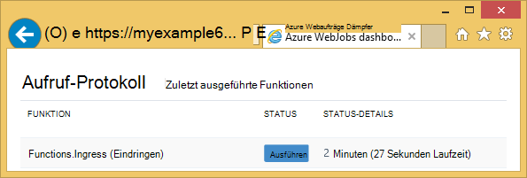
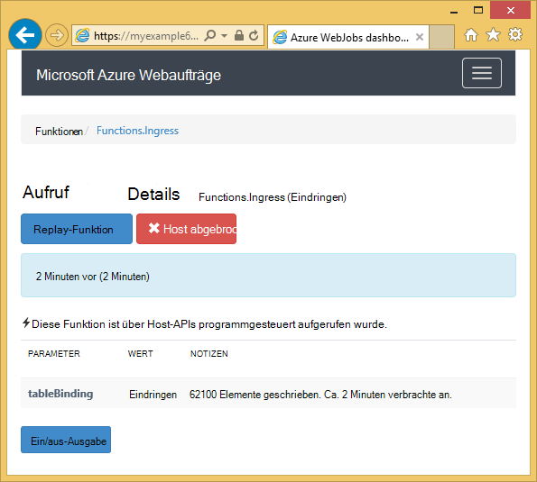
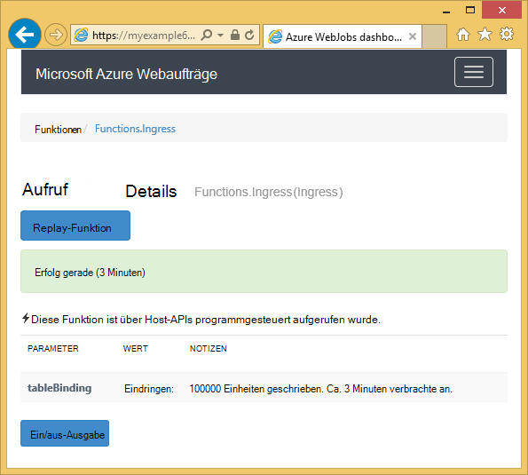

<properties 
    pageTitle="Verwendung von Azure-Tabellenspeicher mit WebJobs SDK" 
    description="Informationen Sie zum Azure-Tabellenspeicher WebJobs SDK verwenden. Tabellen, Entitäten zu Tabellen hinzufügen und vorhandene Tabellen lesen." 
    services="app-service\web, storage" 
    documentationCenter=".net" 
    authors="tdykstra" 
    manager="wpickett" 
    editor="jimbe"/>

<tags 
    ms.service="app-service-web" 
    ms.workload="web" 
    ms.tgt_pltfrm="na" 
    ms.devlang="dotnet" 
    ms.topic="article" 
    ms.date="06/01/2016" 
    ms.author="tdykstra"/>

# Verwendung von Azure-Tabellenspeicher mit WebJobs SDK

## Übersicht

Dieses Handbuch bietet C# Codebeispiele, die zeigen, wie Lesen und Schreiben von Azure Tabellen mit [Webaufträge SDK](websites-dotnet-webjobs-sdk.md) Version 1.x.

Das Handbuch setzt voraus wissen [wie ein Webauftrag Projekt in Visual Studio mit Verbindungszeichenfolgen erstellt das Speicherkonto darauf](websites-dotnet-webjobs-sdk-get-started.md) oder [mehrere Storage-Konten](https://github.com/Azure/azure-webjobs-sdk/blob/master/test/Microsoft.Azure.WebJobs.Host.EndToEndTests/MultipleStorageAccountsEndToEndTests.cs).
        
Einige Code Snippets zeigen den `Table` Attribut in Funktionen, die [manuell aufgerufen](websites-dotnet-webjobs-sdk-storage-queues-how-to.md#manual), also nicht mit einem Trigger-Attribute. 

## Entitäten zu einer Tabelle hinzufügen

Entitäten zu einer Tabelle hinzuzufügen, die `Table` Attribut mit einem `ICollector<T>` oder `IAsyncCollector<T>` Parameter, `T` gibt das Schema für die Entitäten, die Sie hinzufügen möchten. Der Attributkonstruktor hat einen Zeichenfolgenparameter, der den Namen der Tabelle angibt. 

Das folgende Codebeispiel fügt `Person` Entitäten Tabelle *Eindringen*.

        [NoAutomaticTrigger]
        public static void IngressDemo(
            [Table("Ingress")] ICollector<Person> tableBinding)
        {
            for (int i = 0; i < 100000; i++)
            {
                tableBinding.Add(
                    new Person() { 
                        PartitionKey = "Test", 
                        RowKey = i.ToString(), 
                        Name = "Name" }
                    );
            }
        }

In der Regel den Typ Verwendung mit `ICollector` abgeleitet `TableEntity` oder `ITableEntity`, muss aber nicht. Die folgenden `Person` Arbeit durch den Code im vorangehenden Klassen `Ingress` Methode.

        public class Person : TableEntity
        {
            public string Name { get; set; }
        }

        public class Person
        {
            public string PartitionKey { get; set; }
            public string RowKey { get; set; }
            public string Name { get; set; }
        }

Wenn Sie direkt mit den Azure-Speicher-API arbeiten möchten, können Sie eine `CloudStorageAccount` Parameter der Methodensignatur.

## Echtzeit-Überwachung

Da Eindringen Funktionen häufig große Datenmengen verarbeiten, bietet WebJobs SDK Dashboard Echtzeit-Daten. Abschnitt **Aufruf** erfahren, ob die Funktion weiterhin ausgeführt wird.

Die **Aufruf** Detailseite Fortschrittsberichte der Funktion (Anzahl der Entitäten geschrieben) wird ausgeführt und gibt Ihnen die Möglichkeit, ihn abzubrechen. 

Nach Abschluss die Funktion meldet die **Aufrufs** Seite die Anzahl der geschriebenen Zeilen.

## Mehrere Elemente aus einer Tabelle lesen

Um eine Tabelle zu lesen, verwenden die `Table` Attribut mit einer `IQueryable<T>` Parameter, geben `T` abgeleitet `TableEntity` oder `ITableEntity`.

Das folgende Codebeispiel liest und meldet alle Zeilen aus der `Ingress` Tabelle:
 
        public static void ReadTable(
            [Table("Ingress")] IQueryable<Person> tableBinding,
            TextWriter logger)
        {
            var query = from p in tableBinding select p;
            foreach (Person person in query)
            {
                logger.WriteLine("PK:{0}, RK:{1}, Name:{2}", 
                    person.PartitionKey, person.RowKey, person.Name);
            }
        }

### Eine Einheit einer Tabelle lesen

Es ist ein `Table` Attributkonstruktor mit zwei zusätzliche Parameter der Partition und Zeilenschlüssel angeben, wenn für eine einzelne Tabelle Person binden.

Das folgende Codebeispiel liest eine Tabellenzeile für eine `Person` Entität basierend auf Partition Schlüssel und Zeile Schlüsselwerte in einer Warteschlange erhalten haben:  

        public static void ReadTableEntity(
            [QueueTrigger("inputqueue")] Person personInQueue,
            [Table("persontable","{PartitionKey}", "{RowKey}")] Person personInTable,
            TextWriter logger)
        {
            if (personInTable == null)
            {
                logger.WriteLine("Person not found: PK:{0}, RK:{1}",
                        personInQueue.PartitionKey, personInQueue.RowKey);
            }
            else
            {
                logger.WriteLine("Person found: PK:{0}, RK:{1}, Name:{2}",
                        personInTable.PartitionKey, personInTable.RowKey, personInTable.Name);
            }
        }

Die `Person` Klasse in diesem Beispiel keinen implementieren `ITableEntity`.

## Wie Sie die .NET-API direkt in Tabellen

Können Sie auch die `Table` Attribut mit einem `CloudTable` Objekt mehr Flexibilität bei der Arbeit mit einer Tabelle.

Das folgende Codebeispiel verwendet ein `CloudTable` Objekt *Eindringen* Tabelle eine einzelne Entität hinzu. 
 
        public static void UseStorageAPI(
            [Table("Ingress")] CloudTable tableBinding,
            TextWriter logger)
        {
            var person = new Person()
                {
                    PartitionKey = "Test",
                    RowKey = "100",
                    Name = "Name"
                };
            TableOperation insertOperation = TableOperation.Insert(person);
            tableBinding.Execute(insertOperation);
        }

Weitere Informationen zur Verwendung der `CloudTable` Objekt, finden Sie unter [Table Storage von .NET verwenden](../storage/storage-dotnet-how-to-use-tables.md). 

## Die Warteschlangen Artikel Verwandte Themen

Informationen zur Behandlung von Tabelle Verarbeitung ausgelöst durch eine Meldung Warteschlange oder WebJobs SDK Szenarien nicht spezifisch für die Tabelle verarbeitet, finden Sie unter [Warteschlangenspeicher Azure Webaufträge SDK verwenden](websites-dotnet-webjobs-sdk-storage-queues-how-to.md). 

In diesem Artikel behandelten Themen umfassen Folgendes:

* Async-Funktion
* Mehrere Instanzen
* Ordnungsgemäßes Herunterfahren
* WebJobs SDK Attribute im Hauptteil einer Funktion
* Die SDK-Verbindungszeichenfolgen im Code festlegen
* Legen Sie Werte für WebJobs SDK Parameter im code
* Eine Funktion manuell auslösen
* Schreiben von Protokollen

## Nächste Schritte

Dieses Handbuch hat Codebeispiele, die für die Arbeit mit Azure Standardszenarien veranschaulichen. Weitere Informationen zur Verwendung von Azure Webaufträge und WebJobs SDK finden Sie unter [Azure Webaufträge empfohlene Ressourcen](http://go.microsoft.com/fwlink/?linkid=390226).
 
