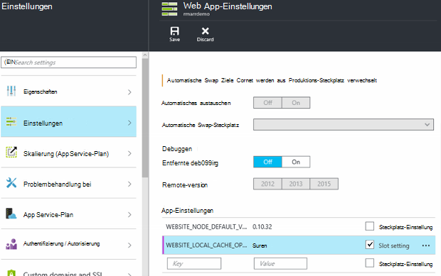

<properties
   pageTitle="Azure App Service lokalen Cache Übersicht | Microsoft Azure"
   description="Dieser Artikel beschreibt, Größe, und Abfragen des Status des Features des lokalen Caches für Azure App Service"
   services="app-service"
   documentationCenter="app-service"
   authors="SyntaxC4"
   manager="yochayk"
   editor=""
   tags="optional"
   keywords=""/>

<tags
   ms.service="app-service"
   ms.devlang="multiple"
   ms.topic="article"
   ms.tgt_pltfrm="na"
   ms.workload="na"
   ms.date="03/04/2016"
   ms.author="cfowler"/>

# <a name="azure-app-service-local-cache-overview"></a>Azure App Service lokalen Cache (Übersicht)

Azure app Webinhalte auf Azure Storage gespeichert und von dauerhaften auf Content freigeben angezeigt. Dieses Design mit einer Vielzahl von apps arbeiten soll und verfügt über die folgenden Attribute:  

* Die Inhalte werden über mehrere Instanzen von Virtual Machine (VM) der Web-app.
* Der Inhalt ist robust und mit Web-apps geändert werden.
* Protokolldateien und Diagnosedaten Dateien sind unter demselben freigegebenen Ordner Inhalte verfügbar.
* Veröffentlichen neuer Inhalte direkt aktualisiert den Inhaltsordner. Sofort können Sie denselben Inhalt ausgeführten Web app und SCM-Website (in der Regel einige Technologien wie ASP.NET leiten einen Web app Neustart bei einigen Änderungen zu aktuellen Inhalten).

Viele webapps eine oder alle diese Funktionen verwenden, benötigen einige webapps nur eine leistungsstarke, schreibgeschützte Content-Speicher, die sie mit hoher Verfügbarkeit ausführen können. Diese apps können eine VM-Instanz einen bestimmten lokalen Cache profitieren.

Features des lokalen Caches für Azure App Service bietet eine Webansicht Rolle des Inhalts. Dieser Inhalt ist ein Cache schreiben aber verwerfen Speicher Inhalt asynchron Site beim Start erstellt wird. Wenn Cache bereit ist, wechselt die Website zum zwischengespeicherten Inhalt ausgeführt. Webapps, die im lokalen Cache ausgeführt haben folgende Vorteile:

* Sie sind Wartezeiten auftreten, wenn sie auf Azure-Speicher Inhalte.
* Sie sind geplante Upgrades oder ungeplante Ausfallzeiten und andere Störungen Azure-Speicher, die auf Servern auftreten, die die Content-Freigabe dienen.
* Sie haben weniger app Neustarts aufgrund der Freigabe von Speicher.

## <a name="how-local-cache-changes-the-behavior-of-app-service"></a>Lokalen Cache ändert das Verhalten von App Service

* Der lokale Cache ist eine Kopie der Dateistruktur und /siteextensions Ordner Web App. Sie wird auf der lokalen Instanz VM Web app beim Start erstellt. Die Größe des lokalen Cache pro WebApp ist auf 300 MB standardmäßig lässt es bis zu 1 GB.
* Der lokale Cache ist schreibgeschützt. Änderungen werden jedoch verworfen, wenn Web app virtuelle Computer verschoben oder neu gestartet wird. Sie verwenden nicht lokalen Cache für apps, die Daten im Inhaltsspeicher speichern.
* Webapps können weiterhin Protokolldateien und Diagnosedaten schreiben wie bisher. Dateien und Daten werden auf dem virtuellen Computer jedoch lokal gespeichert. Anschließend werden sie in regelmäßigen Abständen auf gemeinsame Content-Speicher kopiert. Kopieren in freigegebene Inhaltsspeicher ist eine optimistische - schreiben, Rücken zu einem plötzlichen Ausfall einer VM-Instanz verloren.
* Es ist eine Änderung in der Ordnerstruktur LogFiles und Datenordner für webapps, die lokalen Cache verwenden. Es gibt jetzt Unterordner im Speicher LogFiles und Daten, die das Muster "Eindeutiger Bezeichner" + Zeitstempel folgen. Jeder Unterordner entspricht eine VM-Instanz, Web app ausgeführt wird oder ausgeführt wurde.  
* Publishing Änderungen Web App über eine Veröffentlichung Mechanismen werden freigegebene Inhaltsspeicher veröffentlichen. Dies ist systembedingt, da wir die veröffentlichte Inhalte dauerhaft sein soll. Um den lokalen Cache der Web-app zu aktualisieren, muss neu gestartet werden. Scheint dies wie eine übermäßige? Den Lebenszyklus nahtlose finden Sie die Informationen in diesem Artikel.
* D:\Home zeigen im lokalen Cache. D:\Local bleiben auf temporäre bestimmte VM-Speicher.
* Content Standardansicht der SCM-Website weiterhin, gemeinsame Content-Speicher.

## <a name="enable-local-cache-in-app-service"></a>Lokalen Cache in App Service aktivieren

Lokalen Cache konfigurieren mithilfe aus reservierte app-Einstellungen. Sie können diese Anwendung konfigurieren mithilfe der folgenden Methoden:

* [Azure-portal](#Configure-Local-Cache-Portal)
* [Azure Ressourcenmanager](#Configure-Local-Cache-ARM)

### <a name="configure-local-cache-by-using-the-azure-portal"></a>Konfigurieren Sie lokalen Cache mithilfe des Azure-Portals
<a name="Configure-Local-Cache-Portal"></a>

Lokalen Cache wird jeweils pro Web app mithilfe dieser app-Einstellung aktivieren:`WEBSITE_LOCAL_CACHE_OPTION` = `Always`  



### <a name="configure-local-cache-by-using-azure-resource-manager"></a>Konfigurieren Sie lokalen Cache mithilfe von Azure-Ressourcen-Manager
<a name="Configure-Local-Cache-ARM"></a>

```
...

{
    "apiVersion": "2015-08-01",
    "type": "config",
    "name": "appsettings",
    "dependsOn": [
        "[resourceId('Microsoft.Web/sites/', variables('siteName'))]"
    ],
    "properties": {
        "WEBSITE_LOCAL_CACHE_OPTION": "Always",
        "WEBSITE_LOCAL_CACHE_SIZEINMB": "300"
    }
}

...
```

## <a name="change-the-size-setting-in-local-cache"></a>Ändern Sie die Einstellung im lokalen Cache

Standardmäßig ist die Größe des lokalen Cache **300 MB**. Dazu gehören die Dateistruktur und /siteextensions-Ordner, die von den Inhaltsspeicher kopiert sowie Protokolle und Daten lokal erstellten Ordner. Um diesen Wert zu erhöhen, verwenden Sie die Einstellung Anwendung `WEBSITE_LOCAL_CACHE_SIZEINMB`. Sie können bis zu **1 GB** (1000 MB) pro WebApp vergrößern.

## <a name="best-practices-for-using-app-service-local-cache"></a>Best Practices für die Verwendung des lokalen Caches für App-Dienst

Wir empfehlen in Verbindung mit der Funktion [Stagingumgebungen](../app-service-web/web-sites-staged-publishing.md) lokalen Cache verwenden.

* Fügen Sie die _Kurznotizen_ app-Einstellung `WEBSITE_LOCAL_CACHE_OPTION` mit dem Wert `Always` Ihre **Produktion** Steckplatz. Verwenden Sie `WEBSITE_LOCAL_CACHE_SIZEINMB`, auch als Kurznotiz Einstellung der Produktion Steckplatz hinzufügen.
* Erstellen Sie **Staging** -Steckplatz und veröffentlichen Sie der Staging-Steckplatz. Nicht in der Regel festlegen staging-Steckplatz mit lokalen Cache eine nahtlose Build bereitstellen Tests Lebenszyklus bereitstellen, wenn Sie die Vorteile des lokalen Caches für Produktion Steckplatz abrufen.
*   Testen der Site mit den Staging-Steckplatz.  
*   Wenn Sie bereit sind, geben Sie einen [Austauschvorgang](../app-service-web/web-sites-staged-publishing.md#to-swap-deployment-slots) zwischen Ihrem Staging und Produktion.  
*   Kurznotiz gehören Name und Kurznotiz in einen Steckplatz. So beim Staging-Steckplatz in Betrieb ausgetauscht wird, erben sie lokalen Cache Appeinstellungen. Neu ausgetauschte Produktion Steckplatz nach einigen Minuten für den lokalen Cache ausgeführt und wird aufgewärmt werden als Teil der Steckplatz Aufwärmdauer nach Austausch. So Abschluss Steckplatz Swap Produktions-Steckplatz mit dem lokalen Cache ausgeführt.

## <a name="frequently-asked-questions-faq"></a>Häufig gestellte Fragen (FAQ)

### <a name="how-can-i-tell-if-local-cache-applies-to-my-web-app"></a>Wie erkenne ich meine Web app lokalen Cache gilt?

Wenn Ihrer Anwendung einen leistungsfähige und zuverlässigen Inhaltsspeicher benötigt, den Inhaltsspeicher nicht verwendet kritische Daten zur Laufzeit schreiben und weniger als 1 GB an, ist die Antwort "Ja"! Um die Größe der Ordner Dateistruktur und /siteextensions zu erhalten, können Sie Site Erweiterung "Azure Web Apps Datenträgerverwendung".  

### <a name="how-can-i-tell-if-my-site-has-switched-to-using-local-cache"></a>Wie kann ich feststellen, ob meine Website mit lokalen Cache gewechselt hat?

Wenn Sie Features des lokalen Caches mit Stagingumgebungen verwenden, wird der Austauschvorgang nicht erst erwärmt lokalen Cache. Um zu überprüfen, ob Ihre Site lokalen Cache ausgeführt wird, überprüfen Sie die Arbeitskraft Prozess-Umgebungsvariable `WEBSITE_LOCALCACHE_READY`. Verwenden der Anleitung auf [Arbeitskraft-Umgebungsvariable](https://github.com/projectkudu/kudu/wiki/Process-Threads-list-and-minidump-gcdump-diagsession#process-environment-variable) auf die Arbeitskraft Prozess-Umgebungsvariable auf mehrere Instanzen.  

### <a name="i-just-published-new-changes-but-my-web-app-does-not-seem-to-have-them-why"></a>Nur die neue Änderungen veröffentlicht, aber meine Web app ist nicht vorhanden. Warum?

Ihrer Anwendung lokalen Cache verwendet, müssen Sie Ihrer Website die neuesten Änderungen neu starten. Möchten Sie eine Änderung veröffentlichen? Siehe Optionen Steckplatz best Practices vorangegangenen.

### <a name="where-are-my-logs"></a>Wo sind Meine Protokolle?

Mit lokalen Cache sehen der Protokolle und Ordner anders. Jedoch die Struktur von Unterordnern, außer dass die Unterordner unter einem Unterordner mit dem Format "VM Bezeichner" + Zeitstempel eingebettet sind.

### <a name="i-have-local-cache-enabled-but-my-web-app-still-gets-restarted-why-is-that-i-thought-local-cache-helped-with-frequent-app-restarts"></a>Lokalen Cache aktiviert habe, aber meine Web app noch wird neu gestartet. Warum ist das so? Ich dachte, lokalen Cache häufig app Neustarts beigetragen.

Lokaler Cache hilft speicherbezogenen Web app Neustarts zu vermeiden. Ihrer Anwendung könnte jedoch noch Neustarts bei geplanten Infrastruktur-Upgrades der VM durchlaufen. Sollte weniger allgemeine app-Neustarts, die mit lokalen Cache aktiviert.
