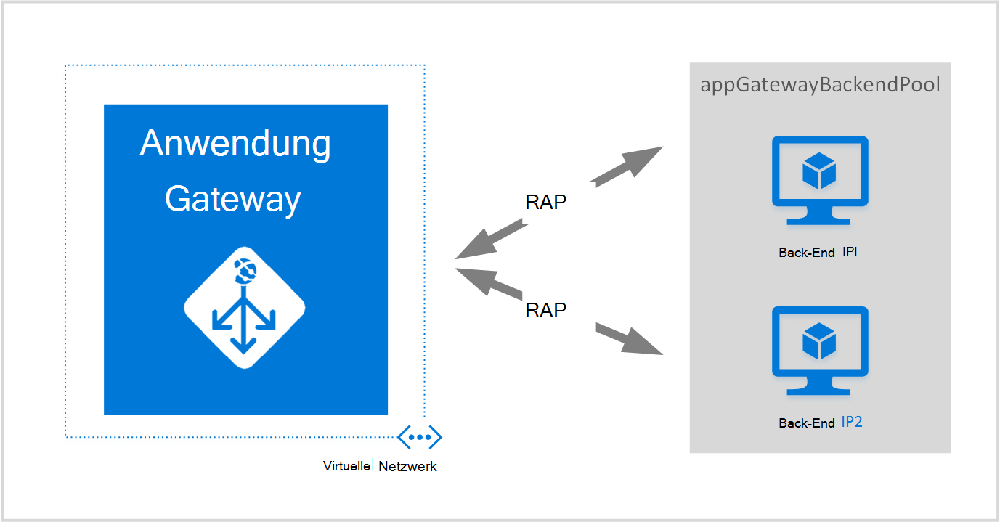
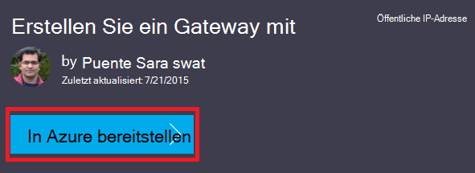
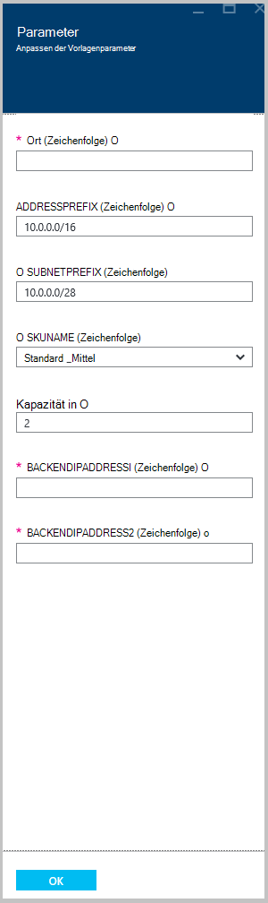

<properties
   pageTitle="Ein Gateway mit Azure-Ressourcen-Manager Vorlagen erstellen | Microsoft Azure"
   description="Diese Seite beschreibt ein Azure Gateway mithilfe der Azure-Ressourcen-Manager-Vorlage erstellen"
   documentationCenter="na"
   services="application-gateway"
   authors="georgewallace"
   manager="carmonm"
   editor="tysonn"/>
<tags
   ms.service="application-gateway"
   ms.devlang="na"
   ms.topic="article"
   ms.tgt_pltfrm="na"
   ms.workload="infrastructure-services"
   ms.date="10/25/2016"
   ms.author="gwallace"/>

# Erstellen Sie ein Gateway mit der Azure-Ressourcen-Manager-Vorlage

> [AZURE.SELECTOR]
- [Azure-portal](application-gateway-create-gateway-portal.md)
- [Azure Ressourcenmanager PowerShell](application-gateway-create-gateway-arm.md)
- [Klassische Azure PowerShell](application-gateway-create-gateway.md)
- [Azure-Ressourcen-Manager-Vorlage](application-gateway-create-gateway-arm-template.md)
- [Azure CLI](application-gateway-create-gateway-cli.md)

Azure Application Gateway ist eine Layer 7-Lastenausgleich. Es bietet Failover, Performance-routing HTTP-Anfragen zwischen verschiedenen Servern, ob sie in der Cloud oder lokal sind. Application Gateway bietet viele Application Delivery Controller (ADC) Funktionen einschließlich HTTP-Lastenausgleich cookiebasierte sitzungsaffinität, Secure Sockets Layer (SSL) ausgelagert, benutzerdefinierten Zustand Prüfpunkte, Unterstützung für mehrere Standorte und viele andere. Eine vollständige Liste der unterstützten Funktionen finden Sie auf [Gateway Anwendungsübersicht](application-gateway-introduction.md)

Sie enthält Informationen zum Herunterladen und Ändern einer vorhandenen Vorlage Azure Resource Manager von GitHub und Bereitstellen der Vorlage GitHub, PowerShell und Azure-CLI.

Wenn Sie einfach Azure Ressourcenmanager Vorlage direkt von GitHub ohne bereitstellen, fahren Sie zum Bereitstellen einer Vorlage von GitHub.

## Szenario

In diesem Szenario können wie folgt vor:

- Erstellen Sie ein Gateway mit zwei Instanzen.
- Erstellen Sie ein virtuelles Netzwerk mit dem Namen VirtualNetwork1 mit einem 10.0.0.0/16 reservierten CIDR-Block.
- Erstellen Sie ein Subnetz namens Appgatewaysubnet, die 10.0.0.0/28 als CIDR-Blocks verwendet.
- Richten Sie zwei konfiguriert zuvor den Datenverkehr IPs Back-End-Webservern ausgeführt werden soll. In diesem Beispiel Vorlage sind die Back-End-IP-Adressen 10.0.1.10 und 10.0.1.11.

>[AZURE.NOTE] Diese sind die Parameter für diese Vorlage. Um die Vorlage anzupassen, können Sie ändern, Regeln, Listener und SSL, der die azuredeploy.json öffnet.

## Herunterladen Sie und kennen Sie Azure-Ressourcen-Manager-Vorlage

Sie können die Vorlage Azure-Ressourcen-Manager zum Erstellen eines virtuellen Netzwerks und zwei Subnetzen aus GitHub, ändern Sie möglicherweise möchten, und. Gehen Sie hierzu folgendermaßen vor:

1. Navigieren Sie zu [Application Gateway erstellen](https://github.com/Azure/azure-quickstart-templates/tree/master/101-application-gateway-create).
2. Klicken Sie auf **azuredeploy.json**, und klicken Sie auf **RAW**.
3. Speichern Sie die Datei in einen lokalen Ordner auf Ihrem Computer.
4. Wenn Sie Azure Ressourcenmanager Vorlagen vertraut sind, fahren Sie mit Schritt 7.
5. Öffnen Sie die Datei speichern und den Inhalt unter **Parameter** in Zeile 5. Azure Ressourcenmanager Vorlagenparameter bieten einen Platzhalter für Werte, die während der Bereitstellung ausgefüllt werden können.

  	| Parameter | Beschreibung |
  	|---|---|
  	| **Speicherort** | Azure-Region, wo das Application Gateway erstellt wird |
  	| **VirtualNetwork1** | Namen für neues virtuelles Netzwerk |
  	| **addressPrefix** | Adressraum für das virtuelle Netzwerk im CIDR-format |
  	| **ApplicationGatewaysubnet** | Namen für das Subnet Application gateway |
  	| **subnetPrefix** | CIDR-Blocks für Application gatewaysubnetz |
  	| **SKUName** | SKU Größe |
  	| **Kapazität** | Anzahl der Instanzen |
  	| **backendaddress1** | IP-Adresse des ersten Webserver |
  	| **backendaddress2** | IP-Adresse des zweiten Webservers |

    >[AZURE.IMPORTANT] Azure verwaltet GitHub Ressourcenmanager Vorlagen können sich ändern. Stellen Sie sicher, dass Sie die Vorlage überprüfen, bevor Sie ihn verwenden.

6. Überprüfen Sie den Inhalt Resources ( **Ressourcen)** , und beachten Sie Folgendes:

    - **Typ**. Typ der Ressource, die von der Vorlage erstellt wird. In diesem Fall ist der Typ **Microsoft.Network/applicationGateways**, die ein Gateway darstellt.
    - **Name**. Name der Ressource. Beachten Sie die Verwendung von **[parameters('applicationGatewayName')]**, was bedeutet, dass der Name als Eingabe oder eine Datei während der Bereitstellung bereitgestellt wird.
    - **Eigenschaften**. Liste der Eigenschaften für die Ressource. Diese Vorlage verwendet virtuelles Netzwerk und öffentlichen IP-Adresse beim Erstellen der Anwendung Gateway.

7. Navigieren Sie zu [https://github.com/Azure/azure-quickstart-templates/blob/master/101-application-gateway-create/](https://github.com/Azure/azure-quickstart-templates/blob/master/101-application-gateway-create).
8. **Azuredeploy paremeters.json**auf, und klicken Sie auf **RAW**.
9. Speichern Sie die Datei in einen lokalen Ordner auf Ihrem Computer.
10. Öffnen Sie die gespeicherte Datei und bearbeiten Sie der Werte für die Parameter. Verwenden Sie die folgenden Werte in diesem Szenario beschriebenen Application-Gateway bereitstellen.

        {
        "$schema": "http://schema.management.azure.com/schemas/2015-01-01/deploymentParameters.json#",
        {
        "location" : {
        "value" : "West US"
        },
        "addressPrefix": {
        "value": "10.0.0.0/16"
        },
        "subnetPrefix": {
        "value": "10.0.0.0/24"
        },
        "skuName": {
        "value": "Standard_Small"
        },
        "capacity": {
        "value": 2
        },
        "backendIpAddress1": {
        "value": "10.0.1.10"
        },
        "backendIpAddress2": {
        "value": "10.0.1.11"
        }
        }

11. Speichern Sie die Datei. Die JSON-Vorlage und die Parameter Vorlage können Sie mit online JSON Validierungstools wie [JSlint.com](http://www.jslint.com/)testen.

## Bereitstellen der Azure-Ressourcen-Manager-Vorlage mithilfe von PowerShell

Wenn Azure PowerShell noch nie verwendet haben, finden Sie unter [Installieren und Konfigurieren von Azure PowerShell](../powershell-install-configure.md) und Anleitung Azure anmelden und Ihr Abonnement auswählen.

### Schritt 1

    Login-AzureRmAccount

### Schritt 2

Überprüfen Sie die Abonnements für das Konto.

    Get-AzureRmSubscription

Sie werden aufgefordert, Ihre Anmeldeinformationen authentifizieren.

### Schritt 3

Auswählen von Azure Abonnements verwenden.

    Select-AzureRmSubscription -Subscriptionid "GUID of subscription"

### Schritt 4

Erstellen Sie bei Bedarf eine Ressourcengruppe mit dem **New-AzureResourceGroup** -Cmdlet. Im folgenden Beispiel erstellen Sie eine Ressourcengruppe AppgatewayRG im südostasiatischen US-amerikanischen Standort aufgerufen.

    New-AzureRmResourceGroup -Name AppgatewayRG -Location "East US"

Führen Sie das Cmdlet **AzureRmResourceGroupDeployment neu** bereitzustellende neue virtuelle Netzwerk mit der vorherigen Vorlage und Parameterdateien heruntergeladen und geändert.

    New-AzureRmResourceGroupDeployment -Name TestAppgatewayDeployment -ResourceGroupName AppgatewayRG `
        -TemplateFile C:\ARM\azuredeploy.json -TemplateParameterFile C:\ARM\azuredeploy-parameters.json

## Bereitstellen der Azure-Ressourcen-Manager-Vorlage mithilfe der Azure-CLI

Zum Bereitstellen von Azure-Ressourcen-Manager-Vorlage mithilfe von Azure CLI heruntergeladene wie folgt:

### Schritt 1

Azure-Befehlszeilenschnittstelle noch nie verwendet haben, finden Sie unter [Installieren und Konfigurieren der Azure-CLI](../xplat-cli-install.md) und bis zu dem Punkt, wo Sie Ihr Azure-Konto und Ihr Abonnement auswählen.

### Schritt 2

Führen Sie den Befehl **Azure Config Modus** in Ressourcen-Manager-Modus wechseln, wie unten dargestellt.

    azure config mode arm

Hier ist die erwartete Ausgabe für den Befehl oben:

    info:   New mode is arm

### Schritt 3

Gegebenenfalls führen Sie den Befehl **Azure Gruppe erstellt** eine neue Ressourcengruppe erstellen wie unten dargestellt. Beachten Sie die Ausgabe des Befehls. Die Liste nach die Ausgabe der Parameter erläutert. Weitere Informationen zu Ressourcengruppen Überblick [Azure-Ressourcen-Manager](../azure-resource-manager/resource-group-overview.md).

    azure group create -n appgatewayRG -l eastus

**-n (bzw. -Namen)**. Name für neue Ressourcengruppe. In diesem Szenario ist es *AppgatewayRG*.

**(oder -Speicherort)**. Azure-Region, in dem die neue Ressourcengruppe erstellt wird. In diesem Szenario ist es *Eastus*.

### Schritt 4

Führen Sie das Cmdlet **Azure Bereitstellung erstellen** neue virtuelle Netzwerk mit der Vorlage und Parameter-Dateien heruntergeladen und über geändert bereitstellen. Die Liste nach die Ausgabe der Parameter erläutert.

    azure group deployment create -g appgatewayRG -n TestAppgatewayDeployment -f C:\ARM\azuredeploy.json -e C:\ARM\azuredeploy-parameters.json

## Bereitstellen Sie Azure-Ressourcen-Manager-Vorlage mithilfe von auf Bereitstellung

Klicken Sie auf Bereitstellung ist, Azure-Ressourcen-Manager-Vorlagen verwenden. Es ist eine einfache Möglichkeit Vorlagen mit Azure-Portal verwenden.

### Schritt 1

Fahren Sie mit [erstellen ein Gateway mit öffentlichen IP](https://azure.microsoft.com/documentation/templates/101-application-gateway-public-ip/).

### Schritt 2

Klicken Sie auf **in Azure bereitstellen**.

### Schritt 3

Füllen Sie die Parameter für die Bereitstellungsvorlage im Portal, und klicken Sie auf **OK**.

### Schritt 4

Wählen Sie **rechtlich** und klicken Sie auf **kaufen**.

### Schritt 5

Klicken Sie auf benutzerdefinierte Bereitstellung Blade **Erstellen**.

## Nächste Schritte

SSL-Verschiebung konfigurieren, finden Sie unter [konfigurieren ein Gateway für SSL-Verschiebung](application-gateway-ssl.md).

So konfigurieren Sie einen Gateway der internen Lastenausgleich verwendet, finden Sie unter [erstellen ein Gateway mit einer internen Lastenausgleich (ILB)](application-gateway-ilb.md).

Besuchen Sie weitere Informationen über Ladeoptionen Lastenausgleich im Allgemeinen:

- [Azure Lastenausgleich](https://azure.microsoft.com/documentation/services/load-balancer/)
- [Azure Traffic Manager](https://azure.microsoft.com/documentation/services/traffic-manager/)
