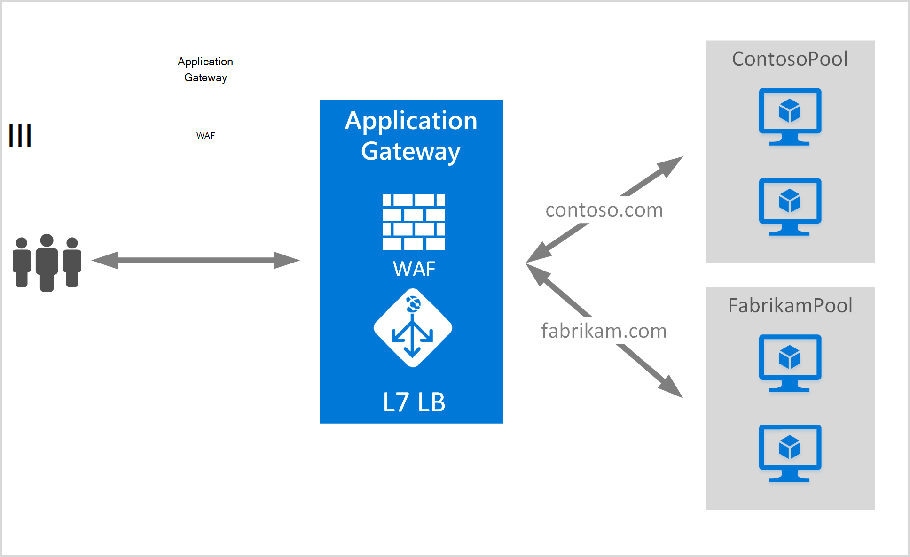

<properties
   pageTitle="Erstellen Sie ein Gateway zum Hosten mehrerer Websites | Microsoft Azure"
   description="Diese Seite enthält eine Anleitung zum Erstellen ein Gateways Azure-Anwendung zum Hosten mehrere ASP.NET-Webanwendungen auf dem gleichen Gateway konfigurieren."
   documentationCenter="na"
   services="application-gateway"
   authors="amsriva"
   manager="rossort"
   editor="amsriva"/>
<tags
   ms.service="application-gateway"
   ms.devlang="na"
   ms.topic="article"
   ms.tgt_pltfrm="na"
   ms.workload="infrastructure-services"
   ms.date="10/25/2016"
   ms.author="amsriva"/>

# Erstellen Sie ein Gateway für mehrere ASP.NET-Webanwendungen hosten

> [AZURE.SELECTOR]
- [Azure-portal](application-gateway-create-multisite-portal.md)
- [Azure Ressourcenmanager PowerShell](application-gateway-create-multisite-azureresourcemanager-powershell.md)

Mehrere Site hostet, können Sie mehrere Web-Anwendung auf dem gleichen Application Gateway bereitstellen. Es basiert auf der Host-Header in der eingehenden HTTP-Anforderung bestimmen die Listener Datenverkehr erhalten. Der Listener leitet Datenverkehr an den entsprechenden Back-End-Pool Regeln Definition des Gateways konfiguriert. In ASP.NET-Webanwendungen SSL aktiviert verwendet Application Gateway Server Name Angabe (SNI) Erweiterung auswählen den richtigen Listener für Web-Verkehr. Eine häufige Verwendung mehrerer Websitehost wird Saldo Anfragen für andere Webdomänen zu anderen Back-End-Server geladen. Entsprechend können mehreren untergeordneten Domänen der Stammdomäne dieselbe auch auf derselben Anwendungsgateway gehostet werden.

## Szenario

Im folgenden Beispiel Application Gateway dient Datenverkehr für contoso.com und fabrikam.com mit zwei Back-End-Server: Contoso Server und Fabrikam Server. Ähnliches Setup konnte Host Unterdomänen wie app.contoso.com und blog.contoso.com verwendet werden.

## Bevor Sie beginnen

1. Installieren Sie die neueste Version von Azure PowerShell-Cmdlets mit dem Webplattform-Installer. Sie können herunterladen und Installieren der neuesten Version von **Windows PowerShell** Teil der [Downloadseite](https://azure.microsoft.com/downloads/).
2. Back-End-Pool mit Application Gateway hinzugefügten Server bestehen oder ihre Endpunkte haben entweder in das virtuelle Netzwerk in einem separaten Subnetz oder mit einer öffentlichen IP-Adresse/VIP zugewiesen.

## Vorschriften

- **Back-End-Serverpool:** Die Liste der IP-Adressen der Back-End-Server. IP-Adressen sollten entweder das virtuelle Netzwerk-Subnetz angehören oder sollte eine öffentliche IP-Adresse/VIP. FQDN kann auch verwendet werden.
- **Back-End-pooleinstellungen:** Jeder Pool hat wie Port, Protokoll und cookiebasierte Affinität. Diese sind an einen Pool gebunden und gelten für alle Server innerhalb des Pools.
- **Front-End-Port:** Dieser Port ist der öffentliche Port, der auf dem Anwendungsgateway geöffnet wird. Datenverkehr trifft dieser Anschluss und dann auf einen Back-End-Server umgeleitet wird.
- **Listener:** Der Listener verfügt über einen Front-End-Port ein Protokoll (Http oder Https, diese Werte sind Groß-/Kleinschreibung) und SSL-Zertifikat (wenn offload Konfigurieren von SSL). Für aktivierte Anwendung Multisite-Gateways werden Hostnamen und SNI Indikatoren ebenfalls hinzugefügt.
- **Regel:** Bindet den Listener Pool Back-End-Server und die Back-End-Serverpool der Datenverkehr weitergeleitet werden soll, einen bestimmten Listener trifft definiert.

## Ein Gateway erstellen

Folgende sind die Schritte ein Gateway erstellen:

1. Erstellen Sie eine Ressourcengruppe für den Ressourcen-Manager.
2. Erstellen Sie ein virtuelles Netzwerk, Subnetze und öffentliche IP-Adresse für das Anwendungsgateway.
3. Gateway-Konfiguration Anwendungsobjekt erstellt.
4. Erstellen Sie eine Ressource auf Gateway.

## Erstellen Sie eine Ressourcengruppe für Ressourcenmanager

Stellen Sie sicher, dass Sie die neueste Version von Azure PowerShell verwenden. Weitere Informationen finden unter [Verwendung von Windows PowerShell mit Ressourcen-Manager](../powershell-azure-resource-manager.md).

### Schritt 1

Melden Sie sich bei Azure

    Login-AzureRmAccount

Sie werden aufgefordert, Ihre Anmeldeinformationen authentifizieren.

### Schritt 2

Überprüfen Sie die Abonnements für das Konto.

    Get-AzureRmSubscription

### Schritt 3

Auswählen von Azure Abonnements verwenden.

    Select-AzureRmSubscription -SubscriptionName "Name of subscription"

### Schritt 4

Erstellen Sie eine Ressourcengruppe (überspringen Sie diesen Schritt, wenn Sie eine vorhandene Ressourcengruppe verwenden).

    New-AzureRmResourceGroup -Name appgw-RG -location "West US"

Alternativ können Sie auch Tags für eine Ressourcengruppe für Application Gateway erstellen:

    $resourceGroup = New-AzureRmResourceGroup -Name appgw-RG -Location "West US" -Tags @{Name = "testtag"; Value = "Application Gateway multiple site"}

Azure Ressourcen-Manager muss alle Ressourcengruppen einen Speicherort angeben. Dieser Speicherort wird als Standardspeicherort für Ressourcen in dieser Ressourcengruppe verwendet. Stellen Sie sicher, dass alle Befehle ein Gateway Erstellen derselben Ressourcengruppe verwenden.

Im obigen Beispiel haben wir eine Ressourcengruppe "Appgw-RG" Lage "West US" bezeichnet.

>[AZURE.NOTE] Benutzerdefinierte Überprüfung für Ihr Anwendungsgateway konfigurieren, finden Sie unter [erstellen ein Gateway mit benutzerdefinierten Prüfpunkte mit PowerShell](application-gateway-create-probe-ps.md). Besuchen Sie die [Benutzerdefinierte Probes und Überwachung](application-gateway-probe-overview.md) .

## Erstellen Sie ein virtuelles Netzwerk und Subnetze

Im folgenden Beispiel wird veranschaulicht, wie ein virtuelles Netzwerk mit Ressourcen-Manager erstellen. In diesem Schritt werden zwei Subnetzen erstellt. Das erste Subnetz ist für das Application Gateway. Application Gateway benötigt ein eigenen Subnetz zu Instanzen. Nur andere Anwendungsgateways können in diesem Subnet bereitgestellt werden. Das zweite Subnetz wird verwendet, um die Anwendung Back-End-Server.

### Schritt 1

Die Subnetz-Variable Application Gateway halten weisen Sie 10.0.0.0/24 Bereich Adresse zu.

    $subnet = New-AzureRmVirtualNetworkSubnetConfig -Name appgatewaysubnet -AddressPrefix 10.0.0.0/24

### Schritt 2

Die subnet2-Variable für die Back-End-Pools verwendet werden weisen Sie 10.0.1.0/24 Bereich Adresse zu.

    $subnet2 = New-AzureRmVirtualNetworkSubnetConfig -Name backendsubnet -AddressPrefix 10.0.1.0/24

### Schritt 3

Erstellen Sie ein virtuelles Netzwerk mit dem Namen "Appgwvnet" in Ressource Gruppe "Appgw-Rg" Region West USA Subnetz 10.0.0.0/24 mit dem Präfix 10.0.0.0/16 und 10.0.1.0/24.

    $vnet = New-AzureRmVirtualNetwork -Name appgwvnet -ResourceGroupName appgw-RG -Location "West US" -AddressPrefix 10.0.0.0/16 -Subnet $subnet,$subnet2

### Schritt 4

Weisen Sie eine Subnetz Variable für die nächsten Schritte schafft ein Gateway.

    $appgatewaysubnet = Get-AzureRmVirtualNetworkSubnetConfig -Name appgatewaysubnet -VirtualNetwork $vnet
    $backendsubnet = Get-AzureRmVirtualNetworkSubnetConfig -Name backendsubnet -VirtualNetwork $vnet

## Erstellen Sie eine öffentliche IP-Adresse für die Front-End-Konfiguration

Erstellen einer öffentlichen IP-Ressource in Ressource Gruppe "Appgw-Rg" für die Region West US "publicIP01".

    $publicip = New-AzureRmPublicIpAddress -ResourceGroupName appgw-RG -name publicIP01 -location "West US" -AllocationMethod Dynamic

Eine IP-Adresse erhält das Application Gateway beim Starten des Dienstes.

## Gateway-Konfiguration erstellen

Sie müssen alle Konfigurationselemente einrichten, bevor Sie Application Gateway erstellen. Die folgenden Schritte erstellen Konfigurationselemente, die für eine Ressource auf Gateway.

### Schritt 1

Erstellen einer Application Gateway IP-Konfigurations mit dem Namen "gatewayIP01". Beim Start Application Gateway nimmt eine IP-Adresse aus dem Subnetz konfiguriert und IP-Adressen im Pool Back-End-IP-Netzwerk-Datenverkehr. Denken Sie daran, dass jede Instanz eine IP-Adresse hat.

    $gipconfig = New-AzureRmApplicationGatewayIPConfiguration -Name gatewayIP01 -Subnet $appgatewaysubnet

### Schritt 2

Konfigurieren den Back-End-IP-Adresspool mit der Bezeichnung "pool01" und "pool2" mit IP-Adressen "10.0.1.100, 10.0.1.101,10.0.1.102" für "pool1" und "10.0.1.103, 10.0.1.104, 10.0.1.105" für "pool2".

    $pool1 = New-AzureRmApplicationGatewayBackendAddressPool -Name pool01 -BackendIPAddresses 10.0.1.100, 10.0.1.101, 10.0.1.102
    $pool2 = New-AzureRmApplicationGatewayBackendAddressPool -Name pool02 -BackendIPAddresses 10.0.1.103, 10.0.1.104, 10.0.1.105

In diesem Beispiel sind zwei Back-End-Pools Netzwerkverkehr basierend auf der angeforderten Seite weitergeleitet. Ein Pool erhält Datenverkehr von Website "contoso.com" und andere Datenverkehr von Website "fabrikam.com". Sie müssen die vorherigen Adressen eigene IP-Adresse Anwendungsendpunkte hinzufügen zu ersetzen. Anstelle von internen IP-Adressen können öffentliche IP-Adressen, FQDN oder einer VM NIC für Back-End-Instanzen auch. Mit "-BackendFQDNs"-Parameter in PowerShell FQDNs anstelle von IP-Adressen angeben.

### Schritt 3

Konfigurieren Sie Application Gateway Einstellung "poolsetting01" und "poolsetting02" für den Netzwerkverkehr mit Lastenausgleich im Back-End-Pool. In diesem Beispiel konfigurieren Sie anderen Back-End-Pool für die Back-End-Pools. Jedem Back-End-Pool können eigene Back-End-Pool-Einstellung.

    $poolSetting01 = New-AzureRmApplicationGatewayBackendHttpSettings -Name "besetting01" -Port 80 -Protocol Http -CookieBasedAffinity Disabled -RequestTimeout 120
    $poolSetting02 = New-AzureRmApplicationGatewayBackendHttpSettings -Name "besetting02" -Port 80 -Protocol Http -CookieBasedAffinity Enabled -RequestTimeout 240

### Schritt 4

Konfigurieren Sie die Front-End-IP-Adresse mit öffentlichen IP-Endpunkt.

    $fipconfig01 = New-AzureRmApplicationGatewayFrontendIPConfig -Name "frontend1" -PublicIPAddress $publicip

### Schritt 5

Konfigurieren Sie den Front-End-Anschluss für ein Gateway.

    $fp01 = New-AzureRmApplicationGatewayFrontendPort -Name "fep01" -Port 443

### Schritt 6

Konfigurieren Sie zwei Zertifikate für zwei Websites, dass wir dabei unterstützen. Ein Zertifikat ist für contoso.com Datenverkehr und die andere für fabrikam.com Datenverkehr. Diese Zertifikate sollte eine Zertifizierungsstelle Zertifikate für Ihre Websites. Selbstsignierte Zertifikate werden unterstützt, aber nicht für Produktionsverkehr empfohlen.

    $cert01 = New-AzureRmApplicationGatewaySslCertificate -Name contosocert -CertificateFile <file path> -Password <password>
    $cert02 = New-AzureRmApplicationGatewaySslCertificate -Name fabrikamcert -CertificateFile <file path> -Password <password>

### Schritt 7

In diesem Beispiel konfigurieren Sie zwei Listener für die beiden Websites. Dieser Schritt konfiguriert die Listener für öffentliche IP-Adresse, Anschluss und Hosts eingehenden Datenverkehr empfangen. HostName Parameter ist erforderlich für die Unterstützung mehrerer Website und auf der entsprechenden Website, für die der Datenverkehr empfangen wird, festgelegt werden. RequireServerNameIndication-Parameter sollte festgelegt werden, um für Websites, die SSL-Unterstützung in einem Szenario mit mehreren Hosts benötigen. Wenn die SSL-Unterstützung erforderlich ist, müssen Sie das SSL-Zertifikat angeben, das zum Sichern des Datenverkehrs für die Webanwendung verwendet wird. Die Kombination aus FrontendIPConfiguration, FrontendPort und HostName muss in einen Listener eindeutig sein. Jeder Listener unterstützen ein Zertifikat.

    $listener01 = New-AzureRmApplicationGatewayHttpListener -Name "listener01" -Protocol Https -FrontendIPConfiguration $fipconfig01 -FrontendPort $fp01 -HostName "contoso11.com" -RequireServerNameIndication true  -SslCertificate $cert01
    $listener02 = New-AzureRmApplicationGatewayHttpListener -Name "listener02" -Protocol Https -FrontendIPConfiguration $fipconfig01 -FrontendPort $fp01 -HostName "fabrikam11.com" -RequireServerNameIndication true -SslCertificate $cert02

### Schritt 8

Erstellen Sie zwei regeleinstellung für zwei ASP.NET-Webanwendungen in diesem Beispiel. Eine Regel verbindet Listener und Back-End-Pools sowie http. Dadurch wird das Application Gateway verwenden grundlegende Routingregel für jede Website konfiguriert. Datenverkehr an jede Website konfigurierten Listener empfängt und dann seine konfigurierten Back-End-Pool mithilfe der Eigenschaften der BackendHttpSettings weitergeleitet.

    $rule01 = New-AzureRmApplicationGatewayRequestRoutingRule -Name "rule01" -RuleType Basic -HttpListener $listener01 -BackendHttpSettings $poolSetting01 -BackendAddressPool $pool1
    $rule02 = New-AzureRmApplicationGatewayRequestRoutingRule -Name "rule02" -RuleType Basic -HttpListener $listener02 -BackendHttpSettings $poolSetting02 -BackendAddressPool $pool2

### Schritt 9

Konfigurieren Sie die Anzahl der Instanzen und Größe für das Application Gateway.

    $sku = New-AzureRmApplicationGatewaySku -Name "Standard_Medium" -Tier Standard -Capacity 2

## Application Gateway erstellen

Erstellen Sie ein Gateway mit alle Konfigurationsobjekte aus den vorherigen Schritten.

    $appgw = New-AzureRmApplicationGateway -Name appgwtest -ResourceGroupName appgw-RG -Location "West US" -BackendAddressPools $pool1,$pool2 -BackendHttpSettingsCollection $poolSetting01, $poolSetting02 -FrontendIpConfigurations $fipconfig01 -GatewayIpConfigurations $gipconfig -FrontendPorts $fp01 -HttpListeners $listener01, $listener02 -RequestRoutingRules $rule01, $rule02 -Sku $sku -SslCertificates $cert01, $cert02

>[AZURE.IMPORTANT] Application Gateway Bereitstellung ist eine umfangreiche Operation und kann einige Zeit dauern.

## Application Gateway DNS-Namen

Nachdem das Gateway erstellt wurde, besteht der nächste Schritt zum Konfigurieren von front-End für die Kommunikation. Wenn eine öffentliche IP-Adresse verwenden, erfordert Application Gateway einen dynamisch zugewiesenen DNS-Namen nicht ist. Um sicherzustellen, dass Endbenutzer das Application Gateway einen CNAME-Eintrag treffen können auf den öffentlichen Endpunkt Application Gateway verwendet werden. [Einen benutzerdefinierten Domänennamen für in Azure konfigurieren](../cloud-services/cloud-services-custom-domain-name-portal.md). Rufen Sie dazu Details Application Gateway und den zugeordneten IP/DNS-Namen mithilfe des Öffentl.IP-Elements Application Gateway zugeordnet. Application Gateway DNS-Namen zum einen CNAME-Eintrag erstellen, der zwei ASP.NET-Webanwendungen auf dem DNS-Namen verweist. Die Verwendung von A-Datensätze wird nicht empfohlen, da die VIP Neustart des Application Gateway ändern kann.
    
    Get-AzureRmPublicIpAddress -ResourceGroupName appgw-RG -Name publicIP01
        
    Name                     : publicIP01
    ResourceGroupName        : appgw-RG
    Location                 : westus
    Id                       : /subscriptions/<subscription_id>/resourceGroups/appgw-RG/providers/Microsoft.Network/publicIPAddresses/publicIP01
    Etag                     : W/"00000d5b-54ed-4907-bae8-99bd5766d0e5"
    ResourceGuid             : 00000000-0000-0000-0000-000000000000
    ProvisioningState        : Succeeded
    Tags                     : 
    PublicIpAllocationMethod : Dynamic
    IpAddress                : xx.xx.xxx.xx
    PublicIpAddressVersion   : IPv4
    IdleTimeoutInMinutes     : 4
    IpConfiguration          : {
                                 "Id": "/subscriptions/<subscription_id>/resourceGroups/appgw-RG/providers/Microsoft.Network/applicationGateways/appgwtest/frontendIP
                               Configurations/frontend1"
                               }
    DnsSettings              : {
                                 "Fqdn": "00000000-0000-xxxx-xxxx-xxxxxxxxxxxx.cloudapp.net"
                               }

## Nächste Schritte

Erfahren Sie, wie Ihre Webseiten mit [Application Gateway - Web Application Firewall](application-gateway-webapplicationfirewall-overview.md) schützen