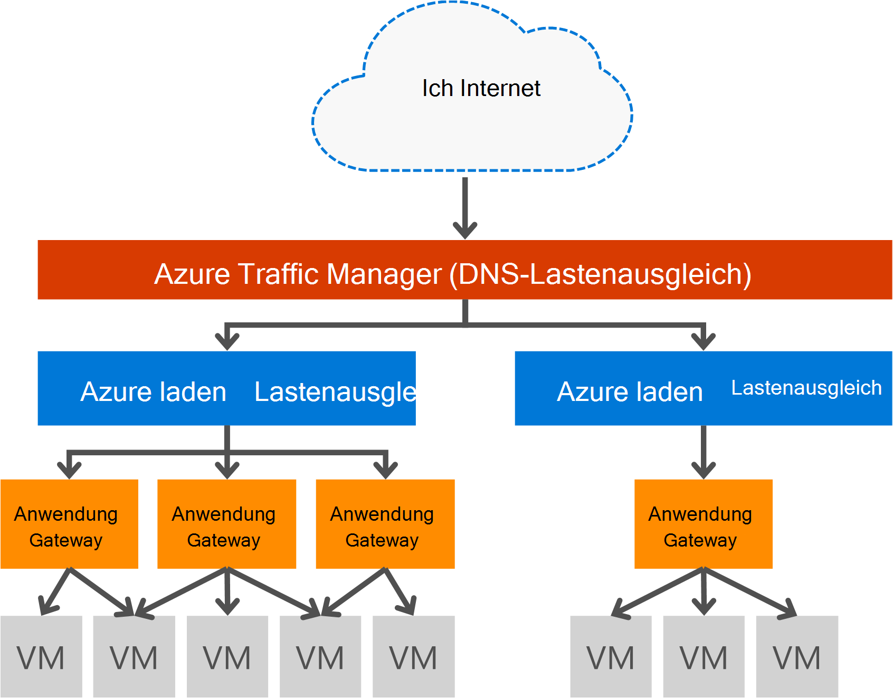

<properties
   pageTitle="Einführung in Application Gateway | Microsoft Azure"
   description="Dieser Seite Übersicht über Application Gateway Service Layer 7 Lastenausgleich Gateway Größen HTTP laden Lastenausgleich, cookiebasierte sitzungsaffinität und SSL-Verschiebung."
   documentationCenter="na"
   services="application-gateway"
   authors="georgewallace"
   manager="carmonm"
   editor="tysonn"/>
<tags
   ms.service="application-gateway"
   ms.devlang="na"
   ms.topic="hero-article"
   ms.tgt_pltfrm="na"
   ms.workload="infrastructure-services"
   ms.date="10/25/2016"
   ms.author="gwallace"/>

# Gateway Anwendungsübersicht

## Was ist Application Gateway

Microsoft Azure Application Gateway bietet Application Delivery Controller (ADC) und verschiedene Layer 7 Lastausgleichsfunktionen für Ihre Anwendung. Damit können Webfarm Produktivität durch Entlastung der CPU-intensiven SSL-Beendigung Application Gateway zu optimieren. Ferner anderen Layer 7-Routingfunktionen einschließlich Round-Robin-Verteilung des eingehenden Datenverkehrs, Cookie sitzungsaffinität, URL-Pfad routing und Fähigkeit zum Hosten mehrerer Websites hinter einer einzigen Anwendungsgateway. Application Gateway verfügt zudem über eine Web Application Firewall (WAF), die die Anwendung die meisten OWASP Top 10 häufigen Web Sicherheitslücken schützt. Application Gateway kann als Internet mit Gateway, interne nur Gateway oder eine Kombination beider konfiguriert werden. Application Gateway ist vollständig Azure, skalierbaren und hochgradig verfügbaren. Es bietet umfangreiche Diagnose und Protokollierungsfunktionen für bessere Verwaltung. Application Gateway arbeitet mit virtuellen Maschinen, Cloud-Dienste und interne oder externe für ASP.NET-Webanwendungen.

Application Gateway ist eine dedizierte virtuelle Appliance für Ihre Anwendung und umfasst mehrere Worker-Instanzen für Erweiterbarkeit und hohe Verfügbarkeit. Beim Erstellen ein Gateway ein Endpunkt (öffentliche VIP oder interne ILB IP) verbunden und für eingehende Netzwerkverkehr verwendet. Diese VIP oder ILB IP von Azure Lastenausgleich erfolgt auf Transportebene (TCP/UDP) und Lastenausgleich Application Gateway Arbeitskraft Instanzen zu eingehenden Netzwerkverkehr. Application Gateway und Routen HTTP/HTTPS-Datenverkehr auf der Grundlage seiner Konfiguration, ob sie einen virtuellen Computer ist cloud-Dienst, interne oder eine externe IP-Adresse. Für die SLA und Preise auf den Seiten [SLA](https://azure.microsoft.com/support/legal/sla/) und [Preise](https://azure.microsoft.com/pricing/details/application-gateway/) .

## Funktionen

Application Gateway unterstützt derzeit 7 Ebene Bereitstellung die folgenden Funktionen:

- **[Web Application Firewall (Vorschau)](application-gateway-webapplicationfirewall-overview.md)** - die Web Application Firewall (AAF) in Azure Application Gateway verhindert allgemeine webbasierten Angriffen wie SQL Injection, Cross-Site scripting-Angriffe und Session Hijacking ASP.NET-Webanwendungen.
- **Http-Lastenausgleich** - Application Gateway bietet Roundrobin-Lastenausgleich. Lastenausgleich erfolgt auf Layer 7 und HTTP(s) nur für Datenverkehr verwendet.
- **Cookiebasierte sitzungsaffinität** - diese Funktion ist nützlich, wenn Sie einer auf demselben Back-End möchten. Mithilfe von Gateway verwaltet Cookies kann Application Gateway direkt nachfolgenden Verkehr von einer zu demselben Back-End für die Verarbeitung. Diese Funktion ist wichtig, in Sitzungszustand lokal auf dem Back-End-Server für eine Sitzung des Benutzers gespeichert ist.
- **[Secure Sockets Layer (SSL) offload](application-gateway-ssl-arm.md)** - diese Funktion wird teure Vorgang der Entschlüsselung HTTPS-Datenverkehr aus Webserver. Beendet die SSL-Verbindung an Application Gateway und Weiterleitung der Anforderung an den Server nicht verschlüsselt, wird der Webserver durch die Entschlüsselung entlastet.  Application Gateway verschlüsselt wieder die Antwort vor dem Senden an den Client zurück. Dieses Feature ist nützlich in Szenarien, das Back-End im gleichen gesicherten virtuellen Netzwerk als Gateway Anwendung in Azure befindet.
- **[End to End-SSL](application-gateway-backend-ssl.md)** - Application Gateway unterstützt durchgehende Verschlüsselung des Datenverkehrs. Application Gateway wird am Anwendungsgateway SSL-Verbindung beendet. Gateway dann gilt die Routingregeln für den Datenverkehr neu verschlüsselt das Paket und übermittelt das Datenpaket an den entsprechenden Back-End-Grundlage die definiert. Keine Antwort vom Webserver durchläuft der Vorgehensweise für den Endbenutzer.
- **[URL-basierte Content routing](application-gateway-url-route-overview.md)** - diese Funktion bietet die Möglichkeit, verschiedenen anderen Back-End-Server verwenden. Datenverkehr für einen Ordner auf dem Webserver oder einem CDN kann an einen anderen Back-End reduzieren unnötige Belastung Backends, die Inhalt dienen nicht weitergeleitet werden.
- **[Standortübergreifende routing](application-gateway-multi-site-overview.md)** - Application Gateway bis 20 Websites Sammelantrag Gateway Konsolidierung ermöglicht.
- **[Websocket unterstützen](application-gateway-websocket.md)** - ein weiteres großartiges Feature von Application Gateway ist die systemeigene Unterstützung für Websocket.
- **[Health monitoring](application-gateway-probe-overview.md)** - Application Gateway bietet standardmäßig Health monitoring der Back-End-Ressourcen und benutzerdefinierten Prüfpunkten mehr Szenarien überwachen.

## Vorteile

Application Gateway eignet sich für:

- Clientanwendungen, die Anfragen aus der gleichen Benutzer-Client-Sitzung zu demselben Back-End virtuellen Computer benötigen. Beispiele für diesen würde Warenkorb apps und Web-Mail-Server kaufen.
- Programme, die Web-Serverfarmen von SSL-Beendigung oben freigeben möchten.
- Programme wie einem Inhaltszustellungsnetzwerk erfordert, die mehrere HTTP-Anfragen über dieselbe langer TCP-Verbindung weitergeleitet werden oder an verschiedene Back-End-Server verteilt.
- Anträge, die Websocket-Datenverkehr unterstützen
- Schützen von ASP.NET-Webanwendungen häufig Web-basierte Angriffe wie SQL-Injektion, siteübergreifende Skriptangriffe und Session Hijacking.

Application Gateway als ein Azure managed Service ermöglicht die Bereitstellung der Ebene 7 Lastenausgleichsmodul hinter Azure Software Lastenausgleich den Lastenausgleich. Traffic Manager kann zu Szenarios führen, wie in der folgenden Abbildung verwendet werden. Traffic Manager Umleitung und Verfügbarkeit bietet Lastenausgleich bietet Region Skalierbarkeits- und und Application Gateway bietet Cross Region Layer 7-Lastenausgleich.

[AZURE.INCLUDE [load-balancer-compare-tm-ag-lb-include.md](../../includes/load-balancer-compare-tm-ag-lb-include.md)]

## Gateway-Größen und Instanzen

Application Gateway ist momentan in drei Größen: Small, Medium und Large. Kleine Instanzen dienen zur Entwicklung und Testszenarien.

Derzeit gibt es zwei Skus für Application Gateway: WAF und Standard.

Sie können bis zu 50 Anwendungsgateways pro Abonnement erstellen und jedes Anwendungsgateway können bis zu 10 Instanzen. Jede Anwendungsgateway besteht aus 20 HTTP-Listener. Eine vollständige Liste der Application Gateway Grenzen finden Sie auf der Seite [Service](../azure-subscription-service-limits.md#application-gateway) .

Die folgende Tabelle zeigt eine durchschnittliche Leistungsdurchsatz für jede Anwendungsinstanz Gateway:

| Seitenantwort des Back-End | Kleine | Mittel | Große|
|---|---|---|---|
| 6K | 7,5 Mbit/s | 13 Mbit/s | 50 Mbit/s |
|100K | 35 MB/s | 100 Mbit/s| 200 Mbit/s |

>[AZURE.NOTE] Diese Werte sind Richtwerte für eine Anwendung Gateway Durchsatz. Der tatsächliche Durchsatz hängt Umgebungsdetails, wie durchschnittliche Größe, Speicherort der Back-End-Instanzen und Verarbeitungszeit zu einer Seite. Für genaue Leistungszahlen sind führen eigene Tests, diese Werte nur für Leitfaden zum Planen der Kapazität.

## Überwachung

Azure Application Gateway überwacht den Zustand der Backend-Instanzen über Basic oder benutzerdefinierten Zustand untersucht. Mithilfe von Health Prüfpunkte gewährleistet, dass nur fehlerfreie Hosts Datenverkehr reagieren. Weitere Informationen finden Sie unter [Application Gateway Health monitoring Overview](application-gateway-probe-overview.md).

## Konfigurieren und verwalten

Für seinen Endpunkt haben Application Gateway eine öffentliche IP-Adresse und private IP-Konfiguration. Application Gateway ist in einem virtuellen Netzwerk im eigenen Subnetz konfiguriert. Subnetz erstellt oder verwendet Application Gateway darf keine andere Typen von Ressourcen enthalten sind nur Ressourcen, die im Subnetz dürfen andere Anwendungsgateways. Sichern Backendressourcen Backend können Server in einem anderen Subnetz als Application Gateway im gleichen virtuellen Netzwerk befinden. Diese zusätzliche Subnetz benötigten nicht für Back-End-Applikationen als Application Gateway die IP-Adresse erreichen kann Application Gateway ADC-Funktionen für die Back-End-Server bereitstellen.

Sie können erstellen und verwalten ein Gateway mit anderen APIs, PowerShell-Cmdlets, Azure-CLI oder [Azure](https://portal.azure.com/).

## Nächste Schritte

Nach dem Kennenlernen Application Gateway erstellen [ein Gateway](application-gateway-create-gateway-portal.md) oder [ein Gateway SSL offload erstellen](application-gateway-ssl-arm.md) Lastenausgleich HTTPS-Verbindung.

Erstellen Sie ein Gateway mit URL-basierten Content routing finden Sie unter Erstellen [ein Gateway mit URL-basiertem routing](application-gateway-create-url-route-arm-ps.md) Informationen.

