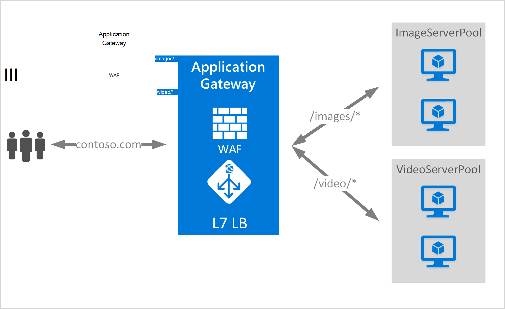

<properties
   pageTitle="URL-basierte Inhalte (Übersicht) | Microsoft Azure"
   description="Diese Seite enthält eine Übersicht der Application Gateway URL-basierten Content routing, UrlPathMap und PathBasedRouting-Regel."
   documentationCenter="na"
   services="application-gateway"
   authors="georgewallace"
   manager="carmonm"
   editor="tysonn"/>
<tags
   ms.service="application-gateway"
   ms.devlang="na"
   ms.topic="hero-article"
   ms.tgt_pltfrm="na"
   ms.workload="infrastructure-services"
   ms.date="10/25/2016"
   ms.author="gwallace"/>

# URL-basierte Pfad Routing (Übersicht)

URL-basierte Pfad Routing können Sie Datenverkehr basierend auf URL-Pfade der Anforderung zu Back-End-Server. Eines der Szenarien werden Anfragen für verschiedene Inhaltstypen zu anderen Back-End-Server.
Im folgenden Beispiel Application Gateway dient Datenverkehr für contoso.com aus drei Back-End-Server zum Beispiel: VideoServerPool, ImageServerPool und DefaultServerPool.

Anfragen für http://contoso.com/video* , VideoServerPool und http://contoso.com/images weitergeleitet* werden an ImageServerPool weitergeleitet. DefaultServerPool ist aktiviert, wenn keine Pfad-Muster übereinstimmt.

## Konfigurationselement UrlPathMap

UrlPathMap Element wird zum Pfad Muster Pool Mappings Back-End-Server angeben. Im folgenden Codebeispiel ist der Ausschnitt UrlPathMap Element Vorlagendatei.

    "urlPathMaps": [
    {
    "name": "<urlPathMapName>",
    "id": "/subscriptions/<subscriptionId>/../microsoft.network/applicationGateways/<gatewayName>/ urlPathMaps/<urlPathMapName>",
    "properties": {
        "defaultBackendAddressPool": {
            "id": "/subscriptions/<subscriptionId>/../microsoft.network/applicationGateways/<gatewayName>/backendAddressPools/<poolName>"
        },
        "defaultBackendHttpSettings": {
            "id": "/subscriptions/<subscriptionId>/../microsoft.network/applicationGateways/<gatewayName>/backendHttpSettingsList/<settingsName>"
        },
        "pathRules": [
            {
                "paths": [
                    <pathPattern>
                ],
                "backendAddressPool": {
                    "id": "/subscriptions/<subscriptionId>/../microsoft.network/applicationGateways/<gatewayName>/backendAddressPools/<poolName2>"
                },
                "backendHttpsettings": {
                    "id": "/subscriptions/<subscriptionId>/../microsoft.network/applicationGateways/<gatewayName>/backendHttpsettingsList/<settingsName2>"
                },

            },

        ],

    }
    }
    

>[AZURE.NOTE] PathPattern: Diese Einstellung ist eine Liste der Pfad Muster übereinstimmen. Jede mit beginnen / und nur ein "*" darf am Ende folgende ein "/". Pfad Matcher zugeführt Zeichenfolge enthält Text nach dem ersten keinen? oder # und diese Zeichen sind unzulässig. 

Sie können [Ressourcen-Manager-Vorlage mit URL-basiertem routing](https://azure.microsoft.com/documentation/templates/201-application-gateway-url-path-based-routing) Informationen überprüfen.

## PathBasedRouting Regel

RequestRoutingRule vom Typ PathBasedRouting wird verwendet, um einen Listener an eine UrlPathMap gebunden. Alle Anfragen, die für diesen Listener empfangen werden basierend auf der im UrlPathMap angegebene Richtlinie weitergeleitet.
Ausschnitt PathBasedRouting Regel:

    "requestRoutingRules": [
    {

    "name": "<ruleName>",
    "id": "/subscriptions/<subscriptionId>/../microsoft.network/applicationGateways/<gatewayName>/requestRoutingRules/<ruleName>",
    "properties": {
        "ruleType": "PathBasedRouting",
        "httpListener": {
            "id": "/subscriptions/<subscriptionId>/../microsoft.network/applicationGateways/<gatewayName>/httpListeners/<listenerName>"
        },
        "urlPathMap": {
            "id": "/subscriptions/<subscriptionId>/../microsoft.network/applicationGateways/<gatewayName>/ urlPathMaps/<urlPathMapName>"
        },

    }
    
## Nächste Schritte

Besuchen Sie nach dem Kennenlernen URL-basierten Content routing [erstellen ein Gateway mit URL-basiertem routing](application-gateway-create-url-route-portal.md) ein Gateway mit URL-routing-Regeln erstellen.
