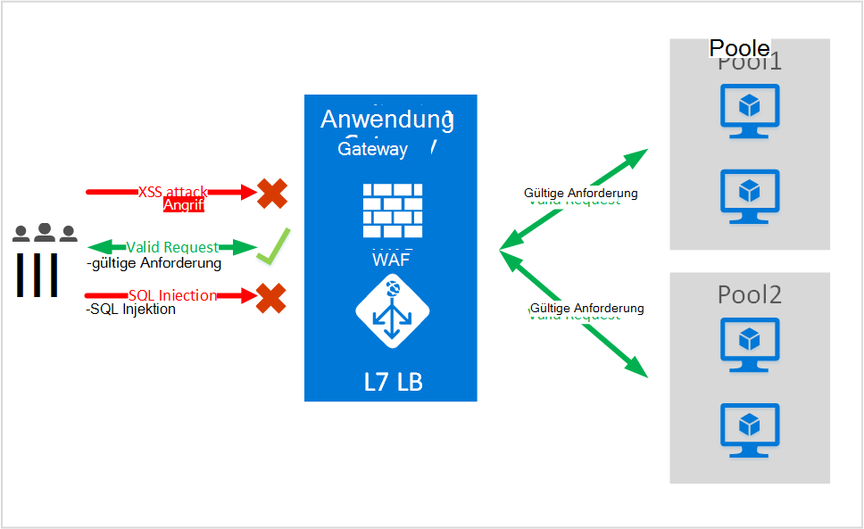
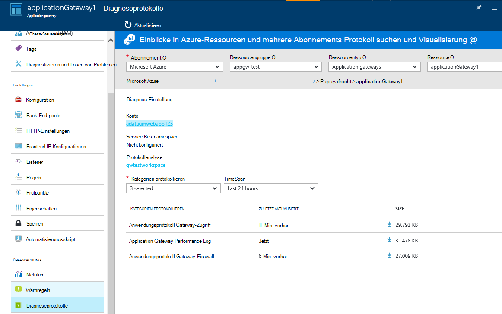

<properties
   pageTitle="Einführung in Web Application Firewall (AAF) für Application Gateway | Microsoft Azure"
   description="Diese Seite bietet einen Überblick über der Web Application Firewall (AAF) Application Gateway "
   documentationCenter="na"
   services="application-gateway"
   authors="amsriva"
   manager="rossort"
   editor="amsriva"/>
<tags
   ms.service="application-gateway"
   ms.devlang="na"
   ms.topic="hero-article"
   ms.tgt_pltfrm="na"
   ms.workload="infrastructure-services"
   ms.date="10/25/2016"
   ms.author="amsriva"/>

# Application Gateway Web Application Firewall (Vorschau)

Web Application Firewall (WAF) ist ein Feature von Azure-Anwendung-Gateway, das schützt Web Applications, die Application Gateway für Standardfunktionen Anwendung Delivery Control (ADC) nutzen. Web Application Firewall wird Schutz vor den meisten OWASP Top 10 häufigen Web Sicherheitslücken. ASP.NET-Webanwendungen sind zunehmend Angriffen, die häufige bekannte Sicherheitslücken ausnutzen. Diese Exploits gemeinsam SQL Injection-Angriffen, Cross-Site-scripting-Angriffe um zu nennen. Verhindert solche Angriffe im Anwendungscode kann schwierig und strenge Wartung, Patches und Überwachung auf mehreren Ebenen der Anwendungsarchitektur erfordern. Eine zentrale Web Application Firewall zum Schutz vor Web-Angriffe vereinfacht Sicherheitsmanagement und gibt bessere Sicherheit der Anwendung gegen die Bedrohung durch Angriffe. Eine WAF Lösung kann auch eine bekannte Schwachstelle zentral und für jede einzelne ASP.NET-Webanwendungen Patches auf ein Sicherheitsrisiko schneller reagieren. Vorhandene Anwendungsgateways können problemlos in ein Gateway mit Web Application Firewall konvertiert.

Application Gateway als ein Delivery Controller und bietet SSL-Beendigung cookiebasierte sitzungsaffinität Round-Robin-Verteilung, Content basierend routing Möglichkeit zum Hosten mehrerer Websites und Sicherheit verbessert. Sicherheit zählen von Application Gateway Angeboten SSL Policy Management Ende SSL-Unterstützung. Wir Stärken Anwendung Sicherheitsfunktionen unseres Service mit WAF (Web Application Firewall) direkt mit ADC integriert. Dies bietet eine leicht verständliche zentral verwalten und Schützen einer Anwendung häufig Web-Sicherheitslücken konfigurieren.

WAF Application Gateway konfigurieren bietet die folgende Vorteile für Sie:

- Schützen Sie Ihre Web-Anwendung von Web-Sicherheitslücken und Angriffe auf Back-End-Code unverändert.
- Schützen Sie mehrere ASP.NET-Webanwendungen gleichzeitig hinter ein Gateway. Application Gateway unterstützt hosting von bis zu 20 Websites hinter einem einzelnen Gateway alle Web-Angriffe geschützt werden konnte.
- Überwachen Sie Webtests Angriffe in Echtzeit Berichts Anwendungsprotokolle Gateway WAF generiert.
- Bestimmte Kontrollen müssen alle Internet gerichteten Endpunkte durch eine WAF Lösung geschützt werden. Mit Application Gateway WAF aktiviert, können Sie diese Auflagen erfüllen.

## Übersicht

Application Gateway WAF ist eine neue SKU (SKU WAF) und ModSecurity und OWASP Core Regelsatz Basisschutz gegen die meisten OWASP Top 10 häufigen Web Sicherheitslücken vorkonfiguriert.

- Schutz vor Einschleusung von SQL
- Cross-Site scripting-Schutz
- Häufige Angriffe Webschutz Befehl Injektion HTTP Request smuggling HTTP-Antwort aufteilen und Remotedatei Aufnahme Angriff
- Schutz gegen HTTP-Protokoll
- Schutz gegen HTTP-Protokoll Anomalien wie fehlende Benutzer-Agent-host und Header akzeptieren
- HTTP-DoS Schutz einschließlich HTTP Überflutung und langsam HTTP-DoS-Abwehr
- Verhindern von Bots, Suchmaschinen und Scanner
- Erkennung von bekannten Anwendung Fehlkonfigurationen (Apache, IIS, etc.)

## WAF Modus

Application Gateway WAF können in den folgenden zwei Modi konfiguriert werden:

- **Erkennungsmodus** – Wenn konfiguriert Erkennungsmodus Application Gateway WAF überwacht und protokolliert alle Bedrohung Alarme in einer Protokolldatei. Sie müssen sicherstellen, dass die Protokollierung Diagnose für Application Gateway aktiviert ist Abschnitt Diagnose. Sie müssen auch sicherstellen, dass das WAF-Protokoll ausgewählt ist.
- **Schutzmodus** – Wenn konfiguriert im Schutzmodus Application Gateway aktiv blockiert Angriffe und Angriffe durch seine erkannt. Der Angreifer erhält eine Ausnahme 403 Zugriff und die Verbindung beendet. Schutzmodus weiterhin WAF Protokolle solche Angriffe anmelden.

## Application Gateway WAF Berichte

Application Gateway WAF bietet detaillierte Berichte auf jede Bedrohung erkennt. Protokollierung in Azure Diagnoseprotokolle integriert und Alarme werden im Json-Format aufgezeichnet.

    {
        "resourceId": "/SUBSCRIPTIONS/<subscriptionId>/RESOURCEGROUPS/<resourceGroupName>/PROVIDERS/MICROSOFT.NETWORK/APPLICATIONGATEWAYS/<applicationGatewayName>",
        "operationName": "ApplicationGatewayFirewall",
        "time": "2016-09-20T00:40:04.9138513Z",
        "category": "ApplicationGatewayFirewallLog",
        "properties":     {
            "instanceId":"ApplicationGatewayRole_IN_0",
            "clientIp":"108.41.16.164",
            "clientPort":1815,
            "requestUri":"/wavsep/active/RXSS-Detection-Evaluation-POST/",
            "ruleId":"OWASP_973336",
            "message":"XSS Filter - Category 1: Script Tag Vector",
            "action":"Logged",
            "site":"Global",
            "message":"XSS Filter - Category 1: Script Tag Vector",
            "details":{"message":" Warning. Pattern match "(?i)(<script","file":"/owasp_crs/base_rules/modsecurity_crs_41_xss_attacks.conf","line":"14"}}
    }

## Application Gateway WAF SKU Preise

Während der Vorschau fallen keine zusätzlichen Gebühren für die Verwendung von Application Gateway WAF. Ihre vorhandene grundlegende SKU Zuschläge berechnet. Wir kommunizieren GA Zeitpunkt Gebühren WAF SKU. Antizipierte WAF SKU Preise nach GA Ankündigung zunächst Kunden Application Gateway WAF SKU Bereitstellung.

## Nächste Schritte

Lernen Sie mehr über die Funktionen WAF, besuchen Sie [Web Application Firewall auf Application Gateway konfigurieren](application-gateway-web-application-firewall-portal.md).
