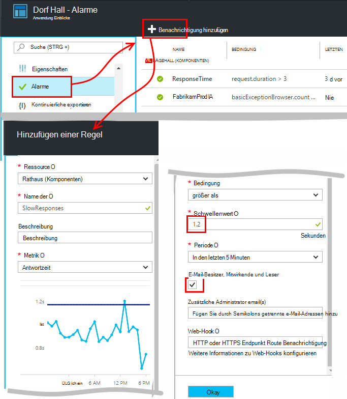
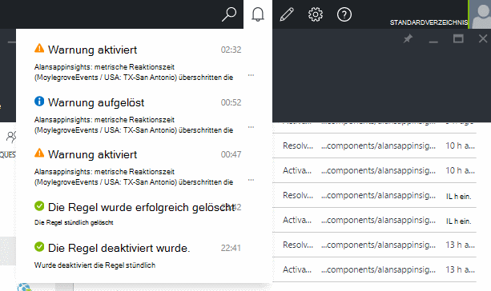
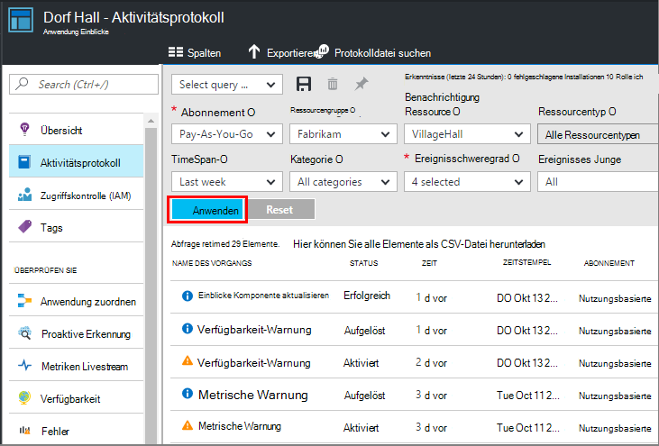

<properties 
    pageTitle="Alarm Anwendung Erkenntnisse festlegen | Microsoft Azure" 
    description="Benachrichtigt über langsame Antwortzeiten, Ausnahmen und Leistung oder Verwendung Änderungen in Ihrer Anwendung." 
    services="application-insights" 
    documentationCenter=""
    authors="alancameronwills" 
    manager="douge"/>

<tags 
    ms.service="application-insights" 
    ms.workload="tbd" 
    ms.tgt_pltfrm="ibiza" 
    ms.devlang="na" 
    ms.topic="article" 
    ms.date="10/14/2016" 
    ms.author="awills"/>
 
# Alarm Anwendung Erkenntnisse festlegen

[Visual Studio Application Insights] [ start] können Sie auf Leistung oder Nutzung Metriken in Ihrer Anwendung hinweisen. 

Application Insights überwacht Ihre live app auf einer [Vielzahl von Plattformen] [ platforms] zur diagnose von Leistungsproblemen und Verwendungsmuster kennen.

Es gibt drei Arten von Alerts:

* **Metrische Alerts** erfahren Sie bei eine Metrik einen Schwellenwert für einen gewissen Zeitraum - Antwortzeiten, Ausnahme zählt, CPU-Auslastung oder Seitenansichten überschreitet. 
* [**Webtests** ] [ availability] informieren, wenn Ihre Website im Internet nicht verfügbar oder reagiert langsam ist. [Weitere][availability].
* [**Proaktive Diagnose**](app-insights-proactive-diagnostics.md) sind konfiguriert automatisch mitteilen ungewöhnliche Performance-Muster.

Wir konzentrieren uns auf metrische Alarme in diesem Artikel.

## Metrische Warnung festlegen

Öffnen Sie Warnregeln Blade und verwenden Sie die Schaltfläche hinzufügen. 

* Legen Sie die Ressource vor anderen Eigenschaften. **Wählen Sie die Ressource "(Komponenten)"** Alarme für Leistung oder Nutzung Metriken festgelegt werden soll.
* Der Namen der Warnung muss innerhalb der Ressourcengruppe (nicht nur die Anwendung) eindeutig sein.
* Achten Sie darauf die Einheiten, in denen Sie aufgefordert werden, geben Sie den Schwellenwert.
* Wenn Sie das Feld "E-Mail-Besitzer..." überprüfen, Alarme per e-Mail für alle erhalten Zugriff auf diese Ressourcengruppe. Erweitern Sie diese Personengruppe Hinzufügen der [Ressourcengruppe oder Abonnement](app-insights-resources-roles-access-control.md) (nicht die Ressource).
* Bei Angabe von "Zusätzliche e-Mails" Alerts erhalten die Personen oder Gruppen (ob Sie das Feld "e-Mail-Besitzer..." aktiviert). 
* [Webhook-Adresse](../monitoring-and-diagnostics/insights-webhooks-alerts.md) eingestellt, wenn eine Webanwendung eingerichtet, die auf Alarme reagiert. Es wird die Warnung aktiviert (die ausgelöst) sowohl wird aufgerufen. (Jedoch derzeit Abfrageparameter nicht durch Webhook Eigenschaften übergeben werden.)
* Können Sie deaktivieren oder aktivieren Sie die Warnung: die Schaltflächen am oberen Rand der Blade.

*Warnung hinzufügen Schaltfläche wird nicht angezeigt.* 

- Verwenden Sie ein Konto Organisation? Alerts lassen Besitzer oder Mitwirkender Zugriff auf diese Anwendungsressource haben. Betrachten Sie das Blade Zugriffskontrolle. [Erfahren Sie mehr über Access Control][roles].

> [AZURE.NOTE] Blatt Alerts sehen Sie, dass es bereits eine Warnung ist: [Proaktive Diagnose](app-insights-proactive-failure-diagnostics.md). Dies ist eine automatische Benachrichtigung, die eine bestimmte Metrik, Anforderungsfehlerrate überwacht. Wenn Sie proaktive Benachrichtigung deaktivieren möchten, müssen Sie eigene Warnung für Anforderungsfehlerrate festlegen. 

## Finden Sie Ihre alerts

Sie erhalten eine e-Mail, wenn eine Warnung ändert den Zustand zwischen inaktiv und aktiv. 

Warnregeln Blade zeigt der aktuelle Status jeder Warnung.

Es gibt eine Zusammenfassung der Aktivitäten der Alarme Dropdownliste:

Die Zustandsänderungen ist im Aktivitätsprotokoll aufgezeichnet:

## Funktionsweise von alerts

* Eine Warnung weist drei Zustände: "Nicht aktiviert", "Aktiviert" und "Gelöst". Aktivierte bedeutet, dass die angegebene Bedingung war, als es zuletzt ausgewertet.

* Eine Benachrichtigung wird generiert, wenn eine Warnung Zustand ändert. (Ist die Warnung bereits True, wenn die Benachrichtigung erstellt, keine Benachrichtigung erhalten Sie bis die Bedingung falsch wird.)

* Jede Benachrichtigung generiert eine e-Mail, wenn e-Mails Kontrollkästchen oder e-Mail-Adressen angegeben. Sie können die Dropdownliste Benachrichtigungen betrachten.

* Eine Warnung wird jedes Mal ausgewertet kommt eine Metrik, aber nicht.

* Bewertung die Metrik vorhergehenden Zeitraum aggregiert und vergleicht ihn mit Schwellenwert auf den neuen Status zu ermitteln.

* Sie wählen das Intervall gibt an, welche Periode werden Metriken zusammengefasst. Es hat keinen Einfluss auf, wie oft die Warnung ausgewertet wird: das hängt von der Ankunft der Metriken.

* Kommt keine Daten für eine bestimmte Metrik für einige Zeit, hat die Lücke unterschiedlich alert Bewertung und Diagramme im Metrik-explorer Metrische Explorer keine Daten mehr Samplingintervall des Diagramms angezeigt werden, zeigt das Diagramm den Wert 0. Basierend auf dieselbe Metrik ist jedoch nicht erneut ausgewertet, und die Warnung Zustand bleibt unverändert. 

    Wenn schließlich Daten ankommen, springt das Diagramm auf einen NULL Wert. Wertet die Warnung basierend auf den Daten für die angegebene Periode. Wenn neue Datenpunkt die einzige im Zeitraum verfügbar ist, basiert das Aggregat auf, Daten.

* Eine Warnung kann häufig zwischen alert und gesunde, Flimmern, selbst wenn Sie einen längeren Zeitraum. Dies ist der metrische Wert um den Schwellenwert bewegt. Gibt es keine Hysterese in den Schwellenwert: der Übergang zur Warnung erfolgt auf denselben Wert wie der Übergang zu fehlerfrei.

## Was sind gute Alerts festlegen?

Die Anwendung hängt. Es ist, sollten nicht zu viele Kennzahlen. Einige Zeit Ihrer metrischen Diagramme betrachten, während Ihre Anwendung ausgeführt wird, um ein Gefühl für normalerweise Verhalten. Dadurch werden Wege finden, um ihre Performance zu verbessern. Dann richten Sie Alerts zu sagen, wenn die Metrik außerhalb des normalen Bereichs wechseln. 

Beliebte Alarme:

* [Browser-Metriken][client], besonders Browser **Seitenladezeiten**eignen sich für ASP.NET-Webanwendungen. Hat die Seite viele Skripts sollten Sie **Browser Ausnahmen**suchen. Um diese Metriken und Alarme, müssen [Webseite Überwachung]einrichten[client].
* **Antwortzeit** für die Serverseite ASP.NET-Webanwendungen. Sowie Alarme einrichten, ein Auge auf diese Metrik auf unverhältnismäßig variiert mit hoher Anforderung:, die möglicherweise, dass Ihre Anwendung Ressourcen ausgeführt wird. 
* **Server-Ausnahmen** - sie sehen einige [zusätzliche einrichten](app-insights-asp-net-exceptions.md)möchten.

Vergessen Sie nicht, [proaktive Rate Fehlerdiagnostik](app-insights-proactive-failure-diagnostics.md) automatisch überwacht die Rate mit der app auf Anfragen mit Fehlercodes antwortet. 

## Automatisierung

* [Einrichten von Alerts automatisieren mithilfe von PowerShell](app-insights-powershell-alerts.md)
* [Mit der Automatisierung Alerts auf webhooks](../monitoring-and-diagnostics/insights-webhooks-alerts.md)

## Siehe auch

* [Verfügbarkeit von Webtests](app-insights-monitor-web-app-availability.md)
* [Einrichten von Alerts automatisieren](app-insights-powershell-alerts.md)
* [Proaktive Diagnose](app-insights-proactive-diagnostics.md) 

<!--Link references-->

[availability]: app-insights-monitor-web-app-availability.md
[client]: app-insights-javascript.md
[platforms]: app-insights-platforms.md
[roles]: app-insights-resources-roles-access-control.md
[start]: app-insights-overview.md

 