<properties 
    pageTitle="Eine Einführung in Application Insights Analytics | Microsoft Azure" 
    description="Kurze Beispiele für die wichtigsten Abfragen Analytics mächtiges Werkzeug Anwendung Erkenntnisse." 
    services="application-insights" 
    documentationCenter=""
    authors="alancameronwills" 
    manager="douge"/>

<tags 
    ms.service="application-insights" 
    ms.workload="tbd" 
    ms.tgt_pltfrm="ibiza" 
    ms.devlang="na" 
    ms.topic="article" 
    ms.date="10/15/2016" 
    ms.author="awills"/>


 
# <a name="a-tour-of-analytics-in-application-insights"></a>Eine Übersicht über Analytics Anwendung Erkenntnisse


[Analytics](app-insights-analytics.md) ist die leistungsfähige Suchfunktion [Anwendung](app-insights-overview.md)Erkenntnisse. Diese Seiten beschreiben Analytics Abfrage Lanquage.


* **[Das Einführungsvideo anzeigen](https://applicationanalytics-media.azureedge.net/home_page_video.mp4)**.
* **[Testen Analytics auf die simulierten Daten](https://analytics.applicationinsights.io/demo)** Wenn Ihre Anwendung Daten noch Anwendung Erkenntnisse mitsendet.


Wir machen Sie einen Spaziergang durch einige einfachen Abfragen zum Einstieg.

## <a name="connect-to-your-application-insights-data"></a>Ihre Anwendung Einblicke Daten

Öffnen Sie Ihre app [Übersicht Blade](app-insights-dashboards.md) Anwendung Erkenntnisse Analytics:

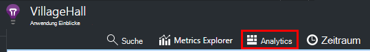

    
## <a name="takeapp-insights-analytics-referencemdtake-operator-show-me-n-rows"></a>[Übernehmen](app-insights-analytics-reference.md#take-operator): n Zeilen anzeigen

Datenpunkte, die Benutzeraktionen (normalerweise HTTP-Anfragen von Ihrer Anwendung) protokolliert werden in einer Tabelle namens `requests`. Jede Zeile ist Telemetrie Daten von Application Insights-SDK in der Anwendung erhalten.

Beginnen wir ein Beispielzeilen der Tabelle untersuchen:

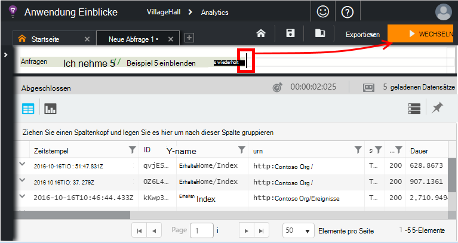

> [AZURE.NOTE] Platzieren Sie den Cursor an einer beliebigen Stelle in der Anweisung Go klicken. Sie können eine Anweisung über mehrere Zeilen aufteilen, aber keine Leerzeilen in einer Anweisung. Weiße Linien sind praktisch zu mehrere separate Abfragen im Fenster.


Wählen Sie Spalten, ziehen Sie sie nach Spalten gruppieren und filtern: 

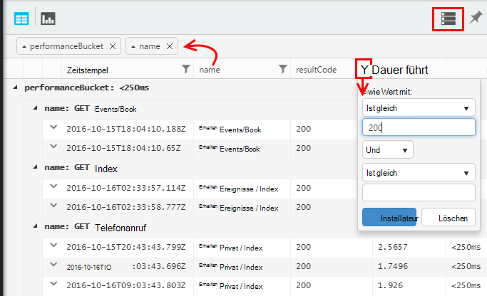


Beliebiges Element, um die Details zu erweitern:
 
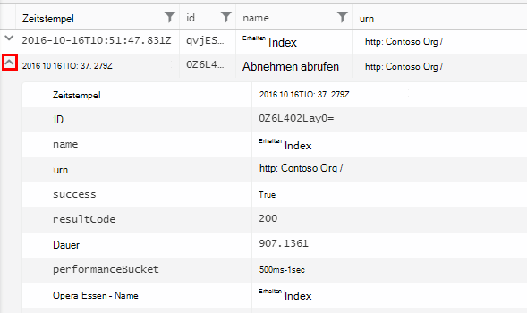

> [AZURE.NOTE] Klicken Sie auf den Kopf der Spalte Reihenfolge die Ergebnisse in einem Webbrowser verfügbar. Aber für ein großes Resultset die Anzahl der Zeilen in den Browser heruntergeladen beschränkt ist. Auf diese Weise sortieren nicht immer die tatsächliche höchsten oder niedrigsten Elemente angezeigt. Um Elemente zuverlässig zu sortieren, verwenden Sie die `top` oder `sort` Operator. 

## <a name="topapp-insights-analytics-referencemdtop-operator-and-sortapp-insights-analytics-referencemdsort-operator"></a>[Oben](app-insights-analytics-reference.md#top-operator) und [Sortieren](app-insights-analytics-reference.md#sort-operator)

`take`eignet sich für eine schnelle ein Ergebnis zu erhalten, aber es zeigt Zeilen aus der Tabelle in keiner bestimmten Reihenfolge. Um eine sortierte Ansicht abzurufen, verwenden `top` (für Beispiel) oder `sort` (über die gesamte Tabelle).

Zeigen Sie die ersten n Zeilen nach einer bestimmten Spalte sortiert an:

```AIQL

    requests | top 10 by timestamp desc 
```

* *Syntax:* Die meisten Operatoren haben Schlüsselwortparameter wie `by`.
* `desc`Absteigend = `asc` = Aufsteigend.

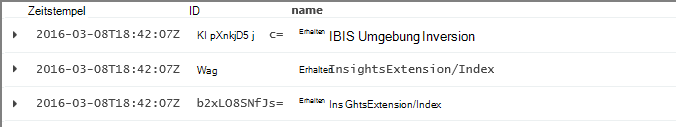

`top...`ist eine weitere leistungsstarke sagen `sort ... | take...`. Es hätte schreiben können:

```AIQL

    requests | sort by timestamp desc | take 10
```

Das Ergebnis wäre das gleiche, jedoch etwas langsamer ausgeführt wird. (Sie können auch schreiben `order`, ist ein Alias von `sort`.)

Die Spaltenüberschriften in der Tabellenansicht können auch zum Sortieren der Ergebnisse auf dem Bildschirm verwendet werden. Natürlich, wenn Sie haben `take` oder `top` Abrufen nur einen Teil einer Tabelle werden nur neu Bestellung haben abgerufenen Datensätze.


## <a name="projectapp-insights-analytics-referencemdproject-operator-select-rename-and-compute-columns"></a>[Projekt](app-insights-analytics-reference.md#project-operator): Wählen Sie umbenennen und Spalten berechnen

Mit [`project`](app-insights-analytics-reference.md#project-operator) nur die Spalten auswählen soll:

```AIQL

    requests | top 10 by timestamp desc
             | project timestamp, name, resultCode
```

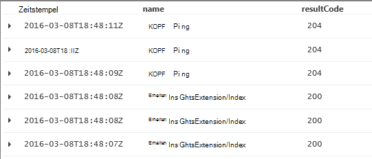


Sie können auch Spalten umbenennen und neue definieren:

```AIQL

    requests 
  	| top 10 by timestamp desc 
  	| project  
            name, 
            response = resultCode,
            timestamp, 
            ['time of day'] = floor(timestamp % 1d, 1s)
```

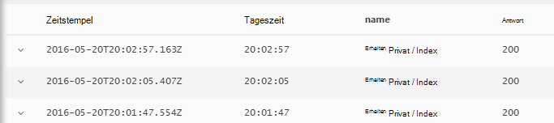

* [Spaltennamen](app-insights-analytics-reference.md#names) können Leerzeichen oder Symbole, wenn sie Klammern wie folgt: `['...']` oder`["..."]`
* `%`ist der modulo-Operator. 
* `1d`(das ist eine Ziffer, ein hatte ') literalen Timespan bedeutet einen Tag. Hier sind einige mehr Timespan Literale: `12h`, `30m`, `10s`, `0.01s`.
* `floor`(Alias `bin`) einen Wert auf das kleinste Vielfache von der Basis Wert gerundet. So `floor(aTime, 1s)` Zeit auf die Sekunde gerundet.

[Ausdrücke](app-insights-analytics-reference.md#scalars) können die üblichen Operatoren enthalten (`+`, `-`,...), und zahlreiche Funktionen.

    

## <a name="extendapp-insights-analytics-referencemdextend-operator-compute-columns"></a>[Erweitern](app-insights-analytics-reference.md#extend-operator): Spalten berechnen

Wenn Sie die vorhandenen Spalten hinzufügen möchten, verwenden Sie [`extend`](app-insights-analytics-reference.md#extend-operator):

```AIQL

    requests 
  	| top 10 by timestamp desc
  	| extend timeOfDay = floor(timestamp % 1d, 1s)
```

Mit [`extend`](app-insights-analytics-reference.md#extend-operator) ist weniger ausführlich als [`project`](app-insights-analytics-reference.md#project-operator) vorhandenen Spalten beibehalten werden soll.


## <a name="summarizeapp-insights-analytics-referencemdsummarize-operator-aggregate-groups-of-rows"></a>[Zusammenfassen](app-insights-analytics-reference.md#summarize-operator): Zeilengruppen zusammenfassen

`Summarize`Wendet eine angegebene *Aggregatfunktion* Gruppen von Zeilen. 

Beispielsweise die Zeit Ihrer Anwendung auf eine Anforderung reagieren im Feld gemeldeten `duration`. Die durchschnittliche Antwortzeit für alle Abfragen sehen:

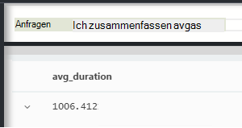

Oder es kann das Ergebnis in Anfragen mit verschiedenen Namen:


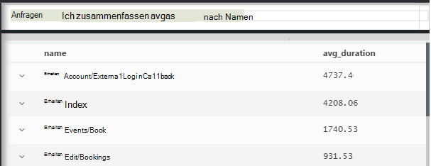

`Summarize`Datenpunkte im Stream in Gruppen erfasst, für die die `by` Klausel ergibt gleichermaßen. Jeder Wert in der `by` - jede Operation Name im obigen Beispiel - Ausdruck ergibt eine Zeile in der Tabelle. 

Oder wir können Ergebnisse nach Uhrzeit:

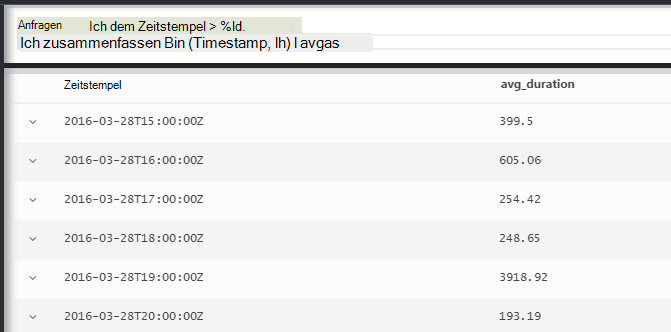

Beachten Sie, wie wir verwenden das `bin` Funktion (aka `floor`). Wenn wir gerade verwendet `by timestamp`, jede Eingabezeile in eine eigene Gruppe Ende. Für eine kontinuierliche Skalar wie oder Zahlen eine verwaltbare Anzahl diskrete Werte fortlaufenden Bereich aufteilen und `bin` -das ist eigentlich die vertraut Rundung `floor` Funktion - ist die einfachste Möglichkeit dazu.

Dieselbe Technik können wir um Bereiche von Zeichenfolgen zu reduzieren:


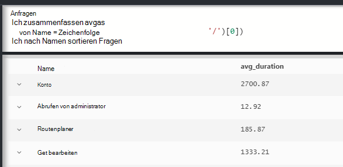

Beachten, mit denen Sie `name=` , der Name einer Spalte Ergebnis der Aggregationsausdrücke oder die by-Klausel.

## <a name="counting-sampled-data"></a>Abgetastete Daten zählen

`sum(itemCount)`ist die empfohlene Aggregation Ereignisse erfassen. In vielen Fällen ItemCount == 1, damit die Funktion die Anzahl der Zeilen in der Gruppe einfach zählt. Aber bei [Stichproben](app-insights-sampling.md) , nur ein Bruchteil des ursprünglichen Ereignisse erhalten als Datenpunkte Anwendung Einblicke, so dass für jeden Datenpunkt angezeigt, `itemCount` Ereignisse. 

Beispielsweise wenn Sampling 75 % des ursprünglichen Ereignisse und ItemCount verwirft == 4 beibehaltenen Datensätze - also für jeden Datensatz beibehalten sind vier ursprünglichen Datensätze. 

Adaptive Sampling wird ItemCount Zeiten höher sein als die Anwendung ausgelastet ist.

ItemCount Zusammenfassung bietet daher eine gute Schätzung Anzahl Ereignisse.


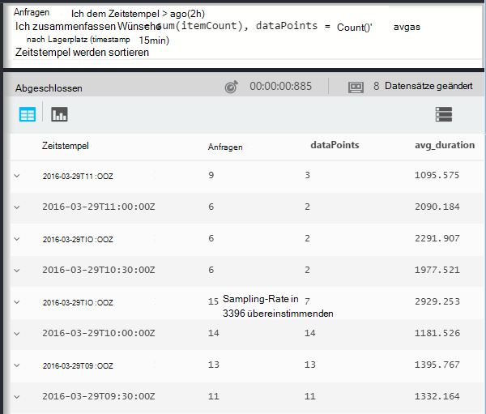

Es gibt auch eine `count()` Aggregation und Count-Operation für Sie wirklich möchten die Anzahl der Zeilen in einer Gruppe.


Es gibt vielfältige [Aggregationsfunktionen](app-insights-analytics-reference.md#aggregations).


## <a name="charting-the-results"></a>Diagramm der Ergebnisse


```AIQL

    exceptions 
       | summarize count()  
         by bin(timestamp, 1d)
```

Standardmäßig werden Ergebnisse als Tabelle anzeigen:

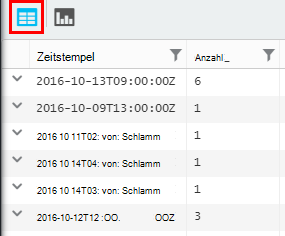


Die Tabellenansicht besser möglich. Betrachten wir die Ergebnisse in der Diagrammansicht durch einen vertikalen Balken Option:

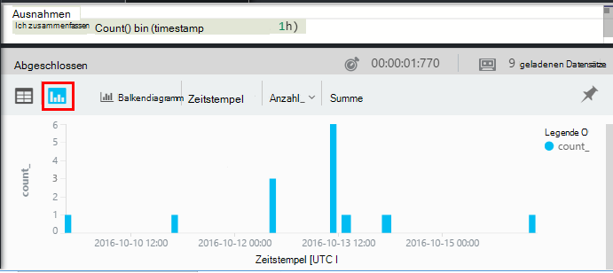

Zwar nicht sortiert die Ergebnisse nach Zeit (siehe Tabelle angezeigt), das Diagramm immer Zeigt Datumswerte in der richtigen Reihenfolge.


## <a name="whereapp-insights-analytics-referencemdwhere-operator-filtering-on-a-condition"></a>[Wo](app-insights-analytics-reference.md#where-operator): einer Bedingung filtern

Wenn Sie Application Insights für [Client](app-insights-javascript.md) und Server Seiten Ihrer App überwachen eingerichtet haben einige Telemetrie in der Datenbank kommt von Browsern.

Sehen Sie nur Ausnahmen, die von Browsern gemeldet:

```AIQL

    exceptions 
  	| where client_Type == "Browser" 
  	|  summarize count() 
       by client_Browser, outerMessage 
```

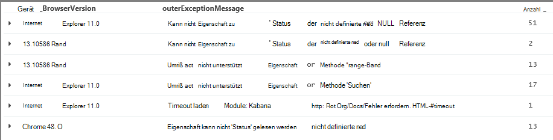

Die `where` Operator akzeptiert einen booleschen Ausdruck. Hier sind einige wichtige Punkte zu werden:

 * `and`, `or`: Boolesche Operatoren
 * `==`, `<>` : gleich und ungleich
 * `=~`, `!=` : Zeichenfolgenvergleich gleich und ungleich. Es gibt viele weitere Zeichenfolgenoperatoren.

Lesen Sie [skalaren Ausdrücken](app-insights-analytics-reference.md#scalars).

### <a name="filtering-events"></a>Filtern von Ereignissen

Suchen Sie nicht erfolgreiche Anfragen:

```AIQL

    requests 
  	| where isnotempty(resultCode) and toint(resultCode) >= 400
```

`responseCode`hat Type, so [wandeln sie](app-insights-analytics-reference.md#casts) einen numerischen Vergleich muß.

Verschiedenen Antworten zusammenzufassen:

```AIQL

    requests
  	| where isnotempty(resultCode) and toint(resultCode) >= 400
  	| summarize count() 
      by resultCode
```

## <a name="timecharts"></a>Timecharts

Zeigen Sie an, wie viele Ereignisse pro Tag sind:

```AIQL

    requests
      | summarize event_count=count()
        by bin(timestamp, 1d)
```

Wählen Sie Diagramm anzeigen:

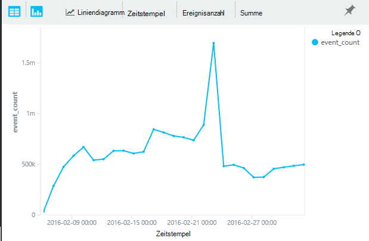


## <a name="multiple-series"></a>Mehrere Reihen 

Mehrere Ausdrücke in der `summarize` mehrere Spalten erstellt.

Mehrere Ausdrücke in der `by` -Klausel erstellt mehrere Zeilen für jede Kombination von Werten.


```AIQL

    requests
  	| summarize count(), avg(duration) 
      by bin(timestamp, 1d), client_StateOrProvince, client_City 
  	| order by timestamp asc, client_StateOrProvince, client_City
```

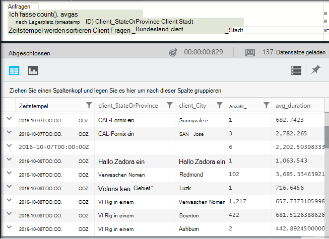

### <a name="segment-a-chart-by-dimensions"></a>Ein Diagramm nach Dimensionen segmentieren

Wenn das Diagramm einer Tabelle, die eine Spalte und eine numerische Spalte Zeichenfolge dienen separate Reihe von Punkten numerischen Daten aufgeteilt. Ist mehr als eine Spalte, können Sie die Spalte als Diskriminators verwenden. 

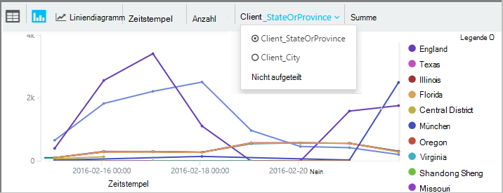

### <a name="display-multiple-metrics"></a>Zeigen Sie mehrerer Kriterien an

Wenn einer Tabelle, mehrere numerische Spalte neben den Zeitstempel Diagramm können Sie eine beliebige Kombination anzeigen.

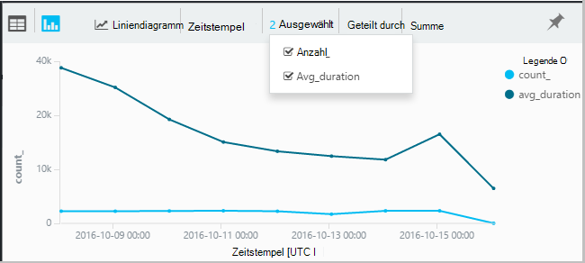

Sie müssen Don't Teilen auswählen, bevor Sie können mehrere numerische Spalten geteilt werden kann von einer Spalte gleichzeitig als mehrere numerische Spalte anzeigen. 


## <a name="daily-average-cycle"></a>Tägliche durchschnittliche Zykluszeit

Wie sein die durchschnittliche Tag unterschiedlich?

Anzahl der Anfragen modulo einen Tag Zeit in Stunden klassifiziert:

```AIQL

    requests
  	| extend hour = floor(timestamp % 1d , 1h) 
          + datetime("2016-01-01")
  	| summarize event_count=count() by hour
```

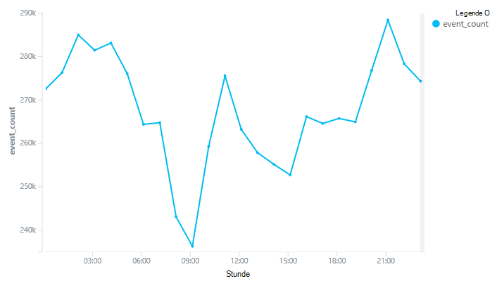

>[AZURE.NOTE] Beachten Sie haben wir derzeit Zeitdauer in Datumswerte zu konvertieren, um anzeigen das Diagramm.


## <a name="compare-multiple-daily-series"></a>Tägliche mehrere Reihen vergleichen

Wie sein über die Tageszeit in verschiedenen Ländern unterschiedlich?

```AIQL

 requests  | where tostring(operation_SyntheticSource)
     | extend hour= floor( timestamp % 1d , 1h)
           + datetime("2001-01-01")
     | summarize event_count=count() 
       by hour, client_CountryOrRegion 
     | render timechart
```

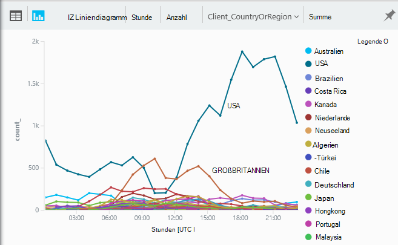


## <a name="plot-a-distribution"></a>Zeichnen einer Verteilung

Wie viele Sessions sind Längen?

```AIQL

    requests 
  	| where isnotnull(session_Id) and isnotempty(session_Id) 
  	| summarize min(timestamp), max(timestamp) 
      by session_Id 
  	| extend sessionDuration = max_timestamp - min_timestamp 
  	| where sessionDuration > 1s and sessionDuration < 3m 
  	| summarize count() by floor(sessionDuration, 3s) 
  	| project d = sessionDuration + datetime("2016-01-01"), count_
```

Die letzte Zeile muss in Datetime zu konvertieren. Derzeit ist die x-Achse des Diagramms als einen Skalar nur angezeigt, wenn eine Datetime ist.

Die `where` Klausel schließt einmalige Sitzung (SessionDuration == 0) und die Länge der x-Achse.


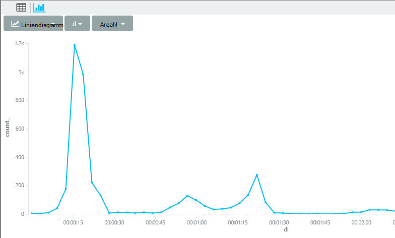


## <a name="percentilesapp-insights-analytics-referencemdpercentiles"></a>[Perzentile](app-insights-analytics-reference.md#percentiles)

Welche Bereiche Dauer decken unterschiedliche Prozentsätze Sitzungen?

Verwenden Sie die obige Abfrage, aber ersetzen Sie die letzte Zeile:

```AIQL

    requests 
  	| where isnotnull(session_Id) and isnotempty(session_Id) 
  	| summarize min(timestamp), max(timestamp) 
      by session_Id 
  	| extend sesh = max_timestamp - min_timestamp 
  	| where sesh > 1s
  	| summarize count() by floor(sesh, 3s) 
  	| summarize percentiles(sesh, 5, 20, 50, 80, 95)
```

Wir entfernt auch die Obergrenze in der Where-Klausel, um die richtigen Zahlen wie alle mit mehr als einer Anfrage:


Aus dem wir sehen:

* 5 % der Sessions haben eine Dauer von 3 Minuten 34 s; 
* 50 % der Sitzung zuletzt weniger als 36 Minnutes;
* 5 % der Sitzung letzte mehr als 7 Tage

Zu einer separaten Aufschlüsselung für jedes Land, wir müssen Client_CountryOrRegion Spalte separat über beide Operatoren zusammengefasst:

```AIQL

    requests 
  	| where isnotnull(session_Id) and isnotempty(session_Id) 
  	| summarize min(timestamp), max(timestamp) 
      by session_Id, client_CountryOrRegion
  	| extend sesh = max_timestamp - min_timestamp 
  	| where sesh > 1s
  	| summarize count() by floor(sesh, 3s), client_CountryOrRegion
  	| summarize percentiles(sesh, 5, 20, 50, 80, 95)
      by client_CountryOrRegion
```

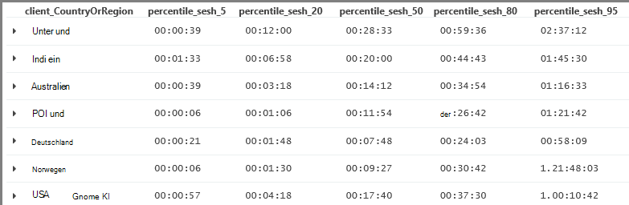


## <a name="joinapp-insights-analytics-referencemdjoin"></a>[Verknüpfung](app-insights-analytics-reference.md#join)

Wir haben Zugriff auf mehrere Tabellen, einschließlich Anfragen und Ausnahmen.

Zu den Ausnahmen eine Anfrage, die Antwort ein Fehler zurückgegeben verknüpfen wir die Tabellen über `session_Id`:

```AIQL

    requests 
  	| where toint(responseCode) >= 500 
  	| join (exceptions) on operation_Id 
  	| take 30
```


Es wird empfohlen, mit `project` nur die Spalten auswählen, vor dem Ausführen der Verknüpfung muss.
In derselben Klausel benennen wir die Timestamp-Spalte.


## <a name="letapp-insights-analytics-referencemdlet-clause-assign-a-result-to-a-variable"></a>[Lassen](app-insights-analytics-reference.md#let-clause): Ergebnis einer Variablen zuweisen

[Lassen](./app-insights-analytics-reference.md#let-statements) Sie mithilfe der Teile des vorherigen Ausdrucks. Die Ergebnisse bleiben unverändert:

```AIQL

    let bad_requests = 
      requests
        | where  toint(resultCode) >= 500  ;
    bad_requests
  	| join (exceptions) on session_Id 
  	| take 30
```

> Tipp: Im Analytics-Client Leerzeilen Sie nicht zwischen den Teilen. Stellen Sie sicher alle ausführen.


## <a name="accessing-nested-objects"></a>Zugriff auf geschachtelte Objekte

Geschachtelte Objekte problemlos möglich. Beispielsweise wird im Stream Ausnahmen strukturierte Objekte wie folgt angezeigt:

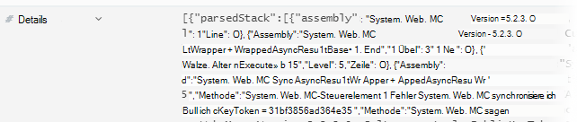

Reduzieren sie mit den Eigenschaften, denen Sie interessieren:

```AIQL

    exceptions | take 10
  	| extend method1 = tostring(details[0].parsedStack[1].method)
```

Beachten Sie, dass eine [Umwandlung](app-insights-analytics-reference.md#casts) in den entsprechenden Typ verwenden.

## <a name="custom-properties-and-measurements"></a>Benutzerdefinierte Eigenschaften und Werte

Wenn Ihre Anwendung fügt [benutzerdefinierte Dimensionen (Eigenschaften) und benutzerdefinierte Maßeinheiten](app-insights-api-custom-events-metrics.md#properties) an Ereignisse, sehen sie in der `customDimensions` und `customMeasurements` Objekte.


Angenommen, Ihre Anwendung enthält:

```C#

    var dimensions = new Dictionary<string, string> 
                     {{"p1", "v1"},{"p2", "v2"}};
    var measurements = new Dictionary<string, double>
                     {{"m1", 42.0}, {"m2", 43.2}};
    telemetryClient.TrackEvent("myEvent", dimensions, measurements);
```

Extrahieren Sie diese Werte in Analytics

```AIQL

    customEvents
  	| extend p1 = customDimensions.p1, 
      m1 = todouble(customMeasurements.m1) // cast to expected type

``` 

## <a name="tables"></a>Tabellen

Der Stream von Ihrer Anwendung empfangenen Telemetrie ist über mehrere Tabellen. Das Schema der Eigenschaften für jede Tabelle ist am linken Rand des Fensters angezeigt.

### <a name="requests-table"></a>Anfragen-Tabelle

Anzahl der HTTP-Anfragen zu Ihrem WebApp Segment durch Namen:

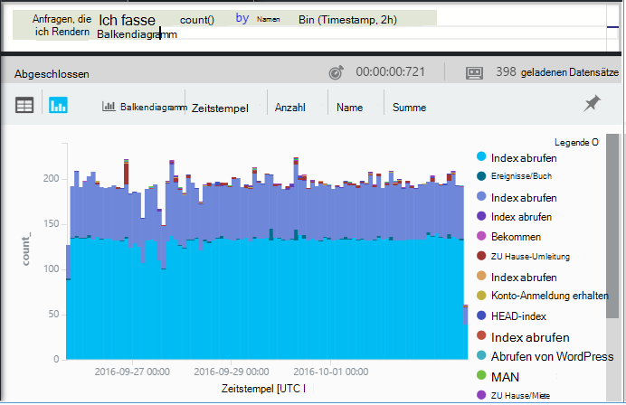

Finden Sie Anfragen, die meisten nicht:

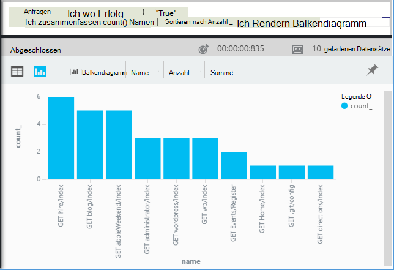

### <a name="custom-events-table"></a>Benutzerdefinierte Ereignistabelle

Wenn Sie [Trackevent()"](app-insights-api-custom-events-metrics.md#track-event) verwenden, um Ihre eigenen Ereignisse senden, können Sie sie aus dieser Tabelle lesen. 

Nehmen wir ein Beispiel, enthält Ihr Anwendungscode diese Zeilen:

```C#

    telemetry.TrackEvent("Query", 
       new Dictionary<string,string> {{"query", sqlCmd}},
       new Dictionary<string,double> {
           {"retry", retryCount},
           {"querytime", totalTime}})
```

Zeigen Sie diese Ereignisse:
 
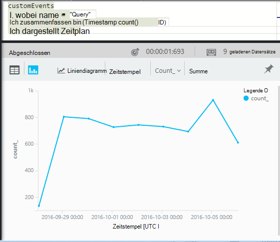

Extrahieren von Maßeinheiten und Dimensionen von den Ereignissen:

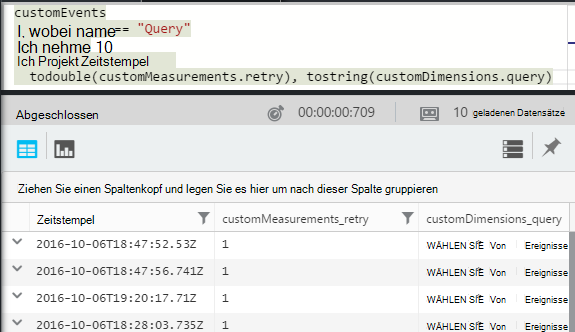

### <a name="custom-metrics-table"></a>Benutzerdefinierte Messgrößen Tabelle

Verwenden Sie [TrackMetric()](app-insights-api-custom-events-metrics.md#track-metric) eigene metrischen Werte senden, finden Sie die Ergebnisse im **CustomMetrics** -Stream. Zum Beispiel:  

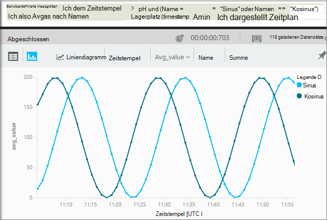


> [AZURE.NOTE] [Metrik-Explorer](app-insights-metrics-explorer.md)alle benutzerdefinierten Maße jedem Typ Telemetrie angefügt erscheinen zusammen in Metriken Blade mit Metriken gesendet `TrackMetric()`. Aber Analytics benutzerdefinierte Maßeinheiten noch verbunden sind, welche Art von Telemetrie sie Metriken per TrackMetric zwar in eigenen Stream - Ereignisse oder Anfragen usw. - durchgeführt.

### <a name="performance-counters-table"></a>Performance-Indikatoren-Tabelle

[Leistungsindikatoren](app-insights-performance-counters.md) anzeigen Basissystem Metriken für Ihre Anwendung, wie CPU, Speicher und Netzwerklast. Sie können das SDK weitere Leistungsindikatoren benutzerdefinierten Leistungsindikatoren zu senden.

Schema **PerformanceCounters** macht die `category`, `counter` Name und `instance` Name des einzelnen Leistungsindikatoren. Namen von Leistungsindikatorinstanzen gelten nur für einige Leistungsindikatoren und geben Sie den Namen des Prozesses auf die Anzahl die in der Regel. In der Telemetrie für jede Anwendung sehen Sie nur die Leistungsindikatoren für die Anwendung. Z. B. darauf, welche Leistungsindikatoren sind verfügbar: 

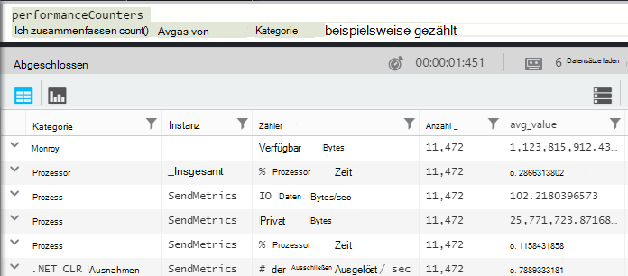

Ein Diagramm des verfügbaren Speichers in der letzten Zeit abgerufen: 

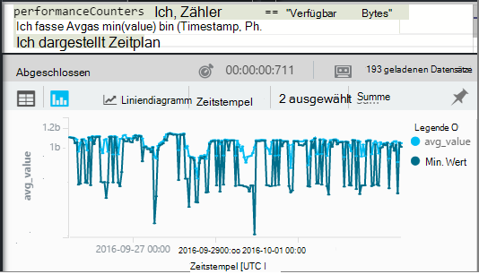


Wie andere Telemetrie **PerformanceCounters** auch eine Spalte hat `cloud_RoleInstance` angibt, dass die Identität des Host-Computers, auf dem Ihre Anwendung ausgeführt wird. Wenn Sie beispielsweise die Leistung Ihrer Anwendung auf verschiedenen Computern vergleichen: 


### <a name="exceptions-table"></a>Ausnahmentabelle

[Ausnahmen](app-insights-asp-net-exceptions.md) sind von der Anwendung in dieser Tabelle. 

Verknüpfen Sie die HTTP-Anforderung zu finden, die Ihre Anwendung behandelt wurde, wenn die Ausnahme ausgelöst wurde auf Operation_Id:

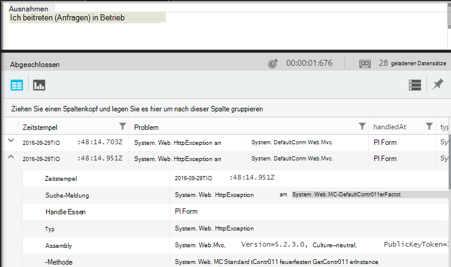


### <a name="browser-timings-table"></a>Browser Anzeigedauer Tabelle

`browserTimings`Seite laden Daten im Browser des Benutzers zeigt.

Diese Metriken finden Sie unter [Einrichten der app für clientseitige Telemetrie](app-insights-javascript.md) . 

Das Schema enthält [Metriken, die Längen der verschiedenen Stufen der Ladeprozess Seite angibt](app-insights-javascript.md#page-load-performance). (sie geben nicht die Zeitdauer, die Benutzer lesen, an.)  

Filmberufe der anderen Seiten anzeigen und Ladezeiten für jede Seite:

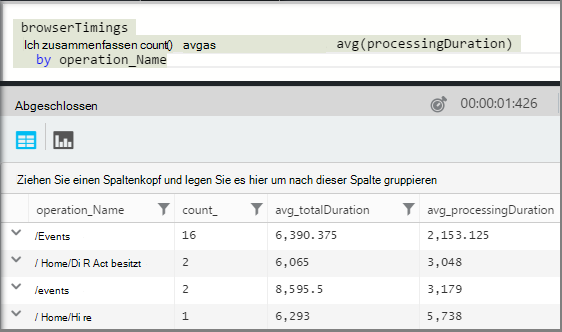

### <a name="availbility-results-table"></a>Art der Tabelle

`availabilityResults`Zeigt die Ergebnisse des [Webtests](app-insights-monitor-web-app-availability.md). Die Ausführung von Tests von jedem Test wird separat gemeldet. 


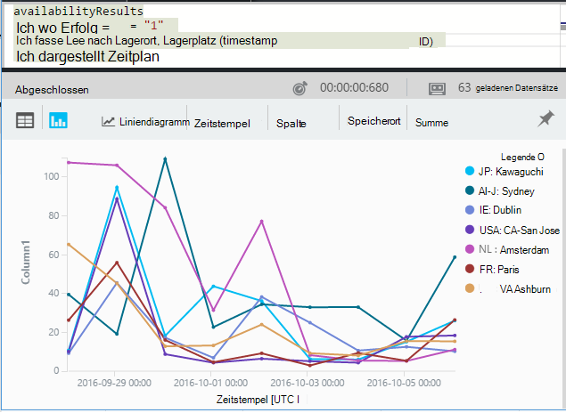

### <a name="dependencies-table"></a>Dependencies-Tabelle

Enthält die Ergebnisse der Aufrufe Ihrer app-Datenbanken und anderen APIs, und andere Aufrufe von TrackDependency().

### <a name="traces-table"></a>Spuren-Tabelle

Mithilfe von TrackTrace() oder [anderen Frameworks Protokollierung](app-insights-asp-net-trace-logs.md)per Telemetrie enthält.

## <a name="dashboards"></a>Dashboards

Ihre Ergebnisse ein Dashboard kann angeheftet werden, um alle Ihre wichtigsten Diagramme und Tabellen zusammenzuführen.

* [Azure gemeinsame Armaturenbrett](app-insights-dashboards.md#share-dashboards): Klicken Sie auf das Stecknadelsymbol. Bevor Sie dies tun, müssen Sie eine gemeinsame Armaturenbrett. Öffnen Sie in Azure-Portal oder erstellen Sie ein Dashboard, und klicken Sie auf freigeben.
* [Power BI-Dashboard](app-insights-export-power-bi.md): Klicken Sie auf exportieren, Power BI-Abfrage. Ein Vorteil dieser Alternative ist, die Abfrage mit einem anderen Ergebnissen aus verschiedensten Quellen angezeigt werden.


## <a name="next-steps"></a>Nächste Schritte

* [Analytics-Referenzhandbuch](app-insights-analytics-reference.md)

[AZURE.INCLUDE [app-insights-analytics-footer](../../includes/app-insights-analytics-footer.md)]


