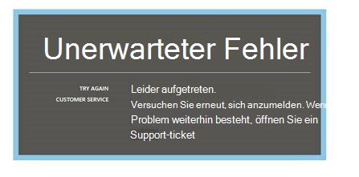
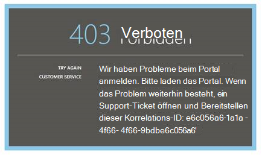
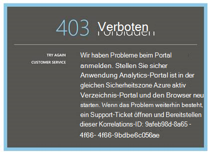
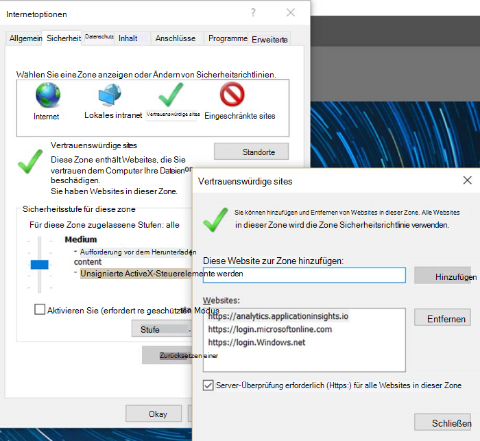
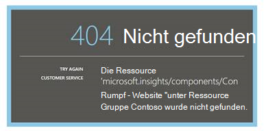
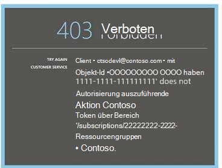
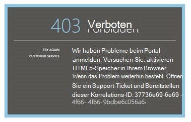
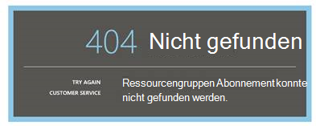
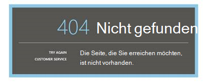

<properties 
    pageTitle="Analytics - mächtiges Werkzeug Anwendung Erkenntnisse Fehlerbehebung | Microsoft Azure" 
    description="Probleme mit Application Insights Analytics? Beginnen Sie hier. " 
    services="application-insights" 
    documentationCenter=""
    authors="alancameronwills" 
    manager="douge"/>

<tags 
    ms.service="application-insights" 
    ms.workload="tbd" 
    ms.tgt_pltfrm="ibiza" 
    ms.devlang="na" 
    ms.topic="article" 
    ms.date="07/11/2016" 
    ms.author="awills"/>

# Problembehandlung bei Analysen in Anwendung Einblicke

Probleme mit [Anwendungsanalyse Einblicke](app-insights-analytics.md)? Beginnen Sie hier. Analytics ist der leistungsstarken Suchfunktion Visual Studio Application Insights.

## Grenzen

* Derzeit sind Abfrageergebnisse auf mehr als einer Woche Daten.
* Wir testen auf Browser: aktuelle Versionen von Chrome, Edge und Internet Explorer.

## Browsererweiterungen von bekannten nicht kompatibel

* Ghostery

Deaktivieren der Erweiterung oder einen anderen Browser verwenden.

##"Unerwarteter Fehler"

Interner Fehler beim Portal Runtime-Ausnahmefehler.

* Reinigen Sie den Cache des Browsers. 

## 403... zu laden versuchen

Eine Authentifizierung bezogenen Fehler (während der Authentifizierung oder während der Generierung von Überprüfungstoken). Das Portal haben keine Möglichkeit, ohne Browsereinstellungen wiederherzustellen.

* Vergewissern Sie sich im Browser [Cookies von Drittanbietern aktiviert](#cookies) . 

## 403... Sicherheitszone überprüfen

Eine Authentifizierung bezogenen Fehler (während der Authentifizierung oder während der Generierung von Überprüfungstoken). Das Portal haben keine Möglichkeit, ohne Browsereinstellungen wiederherzustellen.

1. Vergewissern Sie sich im Browser [Cookies von Drittanbietern aktiviert](#cookies) . 

2. Haben Sie auf das Portal Analytics ein Favorit, Lesezeichen oder gespeicherte Verknüpfung verwendet? Ist signiert mit anderen Anmeldeinformationen als die Verknüpfung gespeichert?

2. Verwenden Sie eine Private/Incognito Browserfenster (nach dem schließen alle Fenster). Sie müssen Ihre Anmeldeinformationen. 

2. Öffnen einer anderen (normalen) Browserfenster und [Azure](https://portal.azure.com). Melden Sie sich ab. Öffnen Sie die Verknüpfung und mit Anmeldeinformationen anmelden.

2. Rand und Internet Explorer-Benutzer können auch diese Fehlermeldung wenn vertrauenswürdige Zonen nicht unterstützt werden.

    [Analytics-Portal](https://analytics.applicationinsights.io) und [Azure Active Directory Portal](https://portal.azure.com) befinden sich in der gleichen Sicherheitszone überprüfen:

 * Öffnen Sie in Internet Explorer **Internetoptionen**, **Sicherheit**, **Vertrauenswürdige Sites**, **Sites**:

    

    In der Liste Websites die folgenden URLs werden Stellen Sie sicher, dass die anderen auch enthalten sind:

    https://Analytics.applicationinsights.IO 
   https://Login.microsoftonline.com 
   https://Login.Windows.NET

## 404... Die Ressource wurde nicht gefunden.

Anwendungsressource von Anwendung gelöscht wurde und nicht mehr verfügbar. Dies ist die URL der Seite Analytics gespeichert.

## 403... Keine Berechtigung

Sie haben keine Berechtigung, diese Anwendung in Analytics öffnen.

* Haben Sie den Link von einer anderen Person? Fragen sie unbedingt in den [Leser oder die Mitwirkenden für diese Ressourcengruppe](app-insights-resources-roles-access-control.md)befinden.
* Haben Sie die Verknüpfung mit anderen Anmeldeinformationen gespeichert? Öffnen der [Azure-Portal](https://portal.azure.com), Abmelden und versuchen Sie es hier erneut Anmeldeinformationen bereitstellen.

## 403... HTML5-Speicher

Unser Portal verwendet HTML5 LocalStorage und SessionStorage.

* Chrome: Einstellungen, Datenschutz, Content Einstellungen.
* InternetExplorer: Internetoptionen, Registerkarte Erweitert Sicherheit aktivieren DOM-Speicherung

## 404... Abonnement wurde nicht gefunden

Die URL ist ungültig. 

* Öffnen Sie die app Ressource in [Application Insights-Portal](https://portal.azure.com). Verwenden Sie dann die Schaltfläche Analytics.

## 404... existiert nicht

Die URL ist ungültig.

* Öffnen Sie die app Ressource in [Application Insights-Portal](https://portal.azure.com). Verwenden Sie dann die Schaltfläche Analytics.

## Drittanbieter-Cookies aktivieren

  [Drittanbieter-Cookies deaktivieren](http://www.digitalcitizen.life/how-disable-third-party-cookies-all-major-browsers), sondern benötigen wir **Aktivieren** sie.

## Wenn alles andere schiefgeht    

[Wenden Sie sich an uns](app-insights-get-dev-support.md).
 
[AZURE.INCLUDE [app-insights-analytics-footer](../../includes/app-insights-analytics-footer.md)]

