<properties 
    pageTitle="Analytics - mächtiges Werkzeug Anwendung Einblicke mit | Microsoft Azure" 
    description="Analytics Diagnose mächtiges Werkzeug Anwendung Erkenntnisse verwenden. " 
    services="application-insights" 
    documentationCenter=""
    authors="danhadari" 
    manager="douge"/>

<tags 
    ms.service="application-insights" 
    ms.workload="tbd" 
    ms.tgt_pltfrm="ibiza" 
    ms.devlang="na" 
    ms.topic="article" 
    ms.date="10/21/2016" 
    ms.author="awills"/>

# Analytics verwenden Anwendung Erkenntnisse

[Analytics](app-insights-analytics.md) ist die leistungsfähige Suchfunktion [Anwendung](app-insights-overview.md)Erkenntnisse. Diese Seiten beschreiben die Abfragesprache Analytics.

* **[Das Einführungsvideo anzeigen](https://applicationanalytics-media.azureedge.net/home_page_video.mp4)**.
* **[Testen Analytics auf die simulierten Daten](https://analytics.applicationinsights.io/demo)** Wenn Ihre Anwendung Daten noch Anwendung Erkenntnisse mitsendet.

## Öffnen Analytics

Wählen Sie Ihre app home Ressource Anwendung Erkenntnisse Analytics.

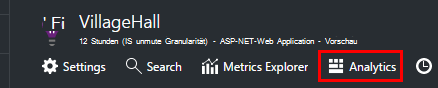

Inline-Lernprogramm bietet einige Ideen, was Sie tun können.

Gibt eine [umfangreichere Tour](app-insights-analytics-tour.md).

## Abfrage der Telemetrie

### Schreiben einer Abfrage

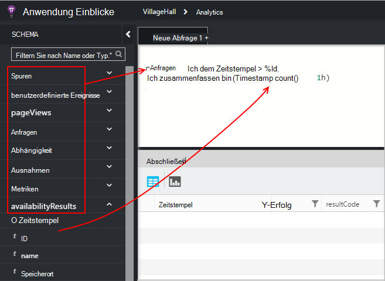

Beginnen Sie mit den Namen aller Tabellen auf der linken Seite (oder [Bereich](app-insights-analytics-reference.md#range-operator) oder [Union](app-insights-analytics-reference.md#union-operator) -Operatoren). Mit `|` eine Pipeline [Operatoren](app-insights-analytics-reference.md#queries-and-operators)erstellt. IntelliSense fordert Sie mit Operatoren Expression-Elemente, die Sie verwenden können.

Finden Sie unter [Übersicht über Analytics Language](app-insights-analytics-tour.md) und [Sprachreferenz](app-insights-analytics-reference.md).

### Ausführen einer Abfrage

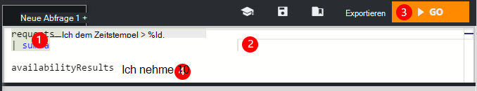

1. Sie können einzelne Zeilenumbrüche in einer Abfrage verwenden.
2. Platzieren Sie den Cursor innerhalb oder am Ende der Abfrage, die Sie ausführen möchten.
3. Klicken Sie zum Ausführen der Abfrage.
4. Leerzeilen Sie keine in der Abfrage. Mehrere getrennte Abfragen hält in einer Abfrage Registerkarte durch Leerzeilen getrennt. Nur eine mit dem Cursor ausgeführt wird.

### Speichern einer Abfrage

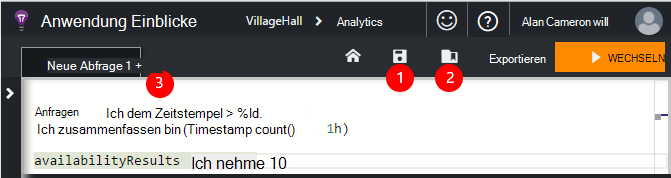

1. Speichern Sie die aktuelle Datei.
2. Öffnen Sie eine gespeicherte Abfrage.
3. Erstellen einer neuen Abfragedatei.

## Einzelheiten

Jede Zeile in den Suchergebnissen auf die vollständige Liste der Eigenschaften zu erweitern. Sie können weiter jede Eigenschaft, die einen strukturierten Wert - Beispiel, benutzerdefinierte Dimensionen oder Stapel mit einer Ausnahme.

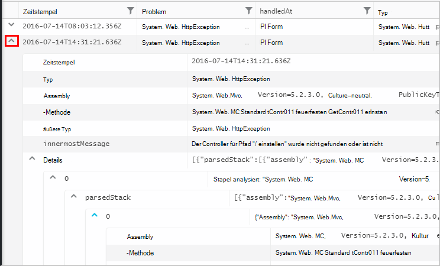

 

## Ordnen der Ergebnisse

Sie können sortieren, filtern, Paginierung und die von der Abfrage zurückgegebenen Ergebnisse gruppieren.

> [AZURE.NOTE] Sortieren, gruppieren und Filtern im Browser ausführen nicht die Abfrage erneut. Sie ändern nur die Ergebnisse der letzten Abfrage zurückgegeben wurden. 
> 
> Um diese Aufgaben auf dem Server, bevor die Ergebnisse zurückgegeben werden, Schreiben Sie eine Abfrage mit dem [Sortieren](app-insights-analytics-reference.md#sort-operator), [zusammenfassen](app-insights-analytics-reference.md#summarize-operator) und [wo](app-insights-analytics-reference.md#where-operator) .

Wählen Sie die Spalten, siehe Spaltenüberschriften um sie anders anzuordnen, und Spalten ändern, indem Sie ihren Rahmen ziehen.

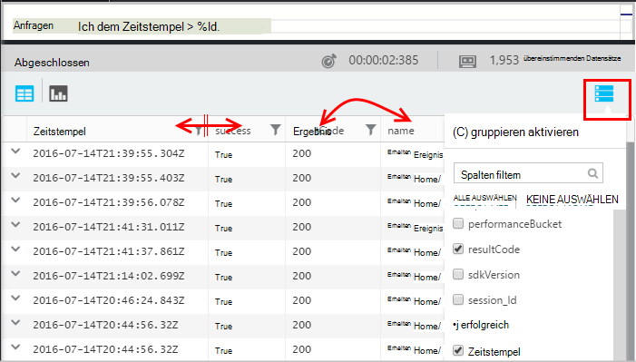

### Sortieren und Filtern

Sortieren Sie Ergebnisse durch Klicken auf den Kopf einer Spalte. Wieder anders sortieren, und klicken Sie auf ein drittes Mal wieder die ursprüngliche Reihenfolge von der Abfrage zurückgegeben.

Verwenden Sie das Filtersymbol, um Ihre Suche einzugrenzen.

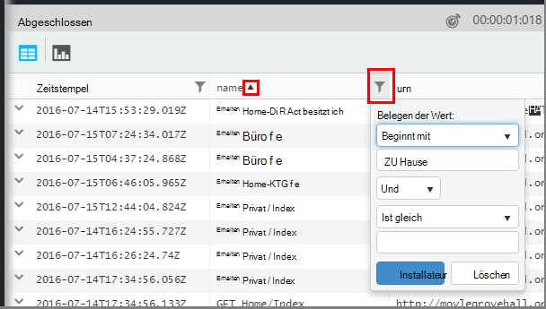

### Elemente gruppieren

Verwenden Sie zum Sortieren nach mehreren Spalten gruppieren. Zuerst aktivieren Sie, und ziehen Sie die Spaltenüberschriften in den Bereich oberhalb der Tabelle.

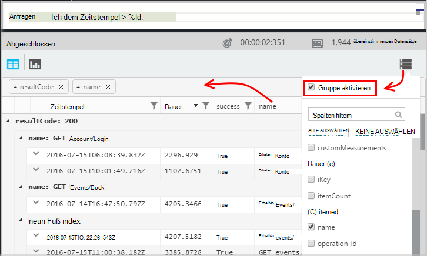

### Fehlen einige Ergebnisse?

Gibt es ein Limit von 10 k Zeilen aus dem Portal zurückgegebenen Ergebnisse. Eine Warnung wird man überschritten. In diesem Fall wird nicht in der Tabelle Suchergebnisse sortieren immer die tatsächlichen Ergebnisse in vor- oder Nachnamen angezeigt. 

Es wird empfohlen zu vermeiden, dass das Limit. Verwenden Sie Operatoren:

* [Wo Timestamp > ago(3d)](app-insights-analytics-reference.md#where-operator)
* [Top 100 von timestamp](app-insights-analytics-reference.md#top-operator) 
* [Nehmen 100](app-insights-analytics-reference.md#take-operator)
* [zusammenfassen](app-insights-analytics-reference.md#summarize-operator) 

## Diagramme

Wählen Sie den Typ des Diagramms möchten:

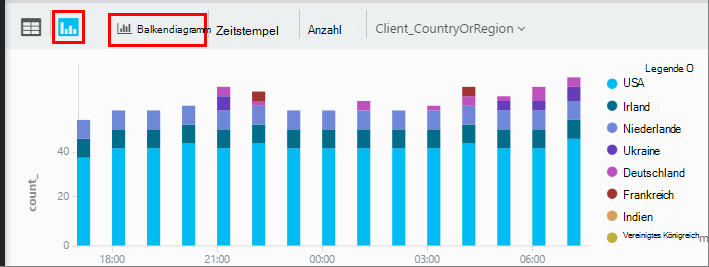

Haben Sie mehrere Spalten die richtigen Typen können Sie X und y-Achsen und eine Spalte mit Dimensionen teilen die Ergebnisse durch.

Standardmäßig Ergebnisse werden zunächst als Tabelle und das Diagramm manuell auswählen. Jedoch können Sie [Rendern Richtlinie](app-insights-analytics-reference.md#render-directive) am Ende der Abfrage ein Diagramm auszuwählen.

## Dashboard anheften

Ein Diagramm pin oder Tabelle eines [freigegebenen Dashboards](app-insights-dashboards.md) - nur auf die Pin. (Zum [Upgrade Ihrer app Paketpreis ist](app-insights-pricing.md) möglicherweise um dieses Feature zu aktivieren.) 

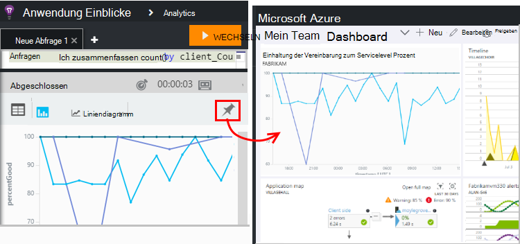

Dies bedeutet, dass ein Dashboard Leistung oder Nutzung von Webdiensten überwachen zusammen komplexe Analyse neben anderen Metriken enthalten kann. 

Eine Tabelle der Dashboard kann angeheftet werden, hat vier Spalten. Die oberen sieben Zeilen werden angezeigt.

#### Dashboard-Aktualisierung

Fixiert das Dashboard Diagramm wird automatisch aktualisiert durch erneutes Ausführen der Abfrage etwa jede halbe Stunde.

#### Automatische Vereinfachung

In einigen Fällen werden bestimmte Frage beim Fixieren einem Dashboard ein Diagramm angewendet.

Wenn Sie Pin ein Diagramm, eine Menge diskreter Lagerplätze (normalerweise ein Balkendiagramm), die weniger Lagerplätze angezeigt, werden automatisch gruppiert, in einem Lagerplatz "Sonstige". Beispiel: Diese Abfrage:

    requests | summarize count_search = count() by client_CountryOrRegion

sieht in Analytics:

aber wenn Sie ein Dashboard anheften, sieht folgendermaßen aus:

## Exportieren nach Excel

Nach dem Ausführen einer Abfrage können Sie eine CSV-Datei herunterladen. Klicken Sie auf **nach Excel exportieren**.

## Power BI exportieren

Platzieren Sie den Cursor in einer Abfrage, und wählen Sie **Power BI exportieren**.

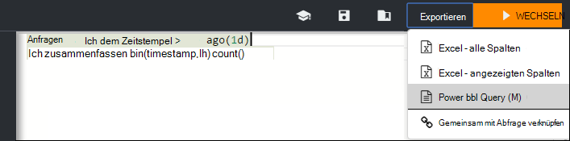

Ausführen der Abfrage in Power BI. Sie können nach einem Zeitplan aktualisieren festlegen.

Mit Power BI können Sie Dashboards erstellen, die Daten aus den unterschiedlichsten Quellen kombinieren.

[Weitere Informationen zu exportieren, Power BI](app-insights-export-power-bi.md)

[AZURE.INCLUDE [app-insights-analytics-footer](../../includes/app-insights-analytics-footer.md)]

