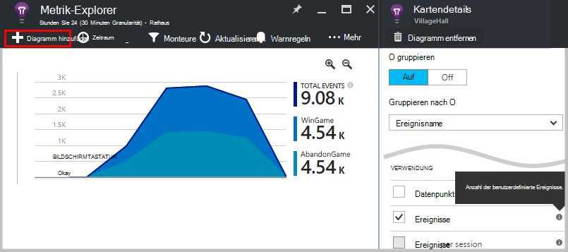
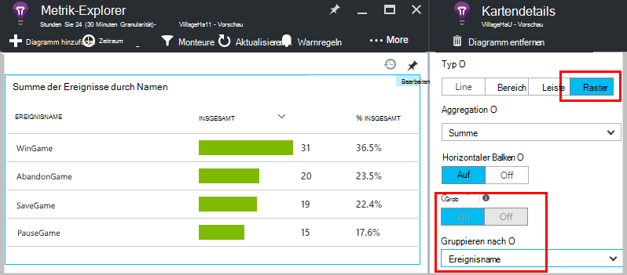
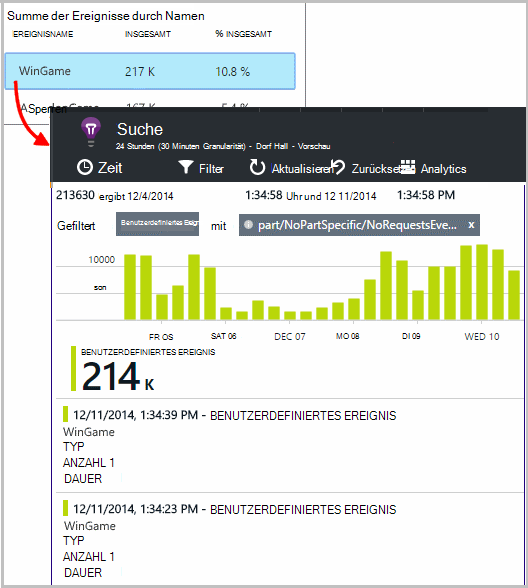
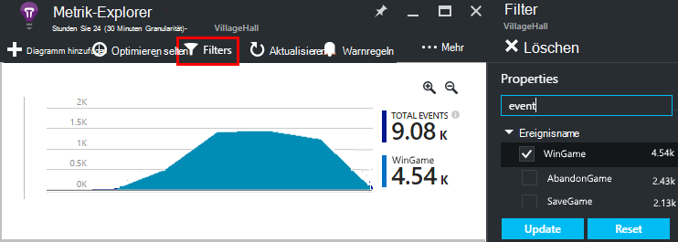
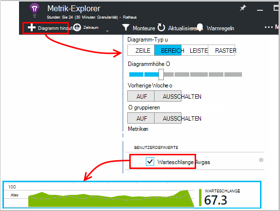
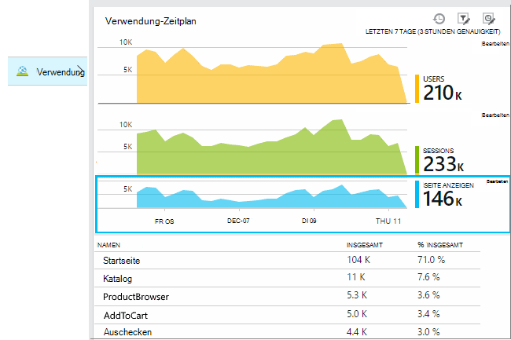
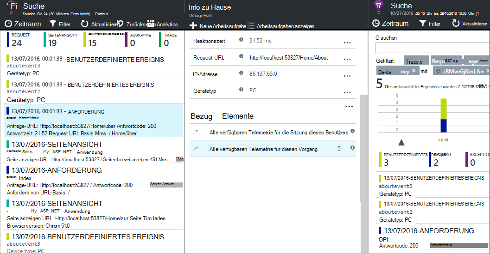
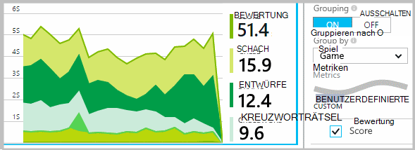
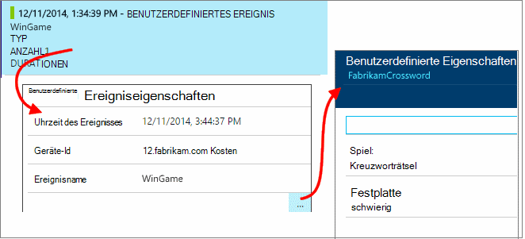
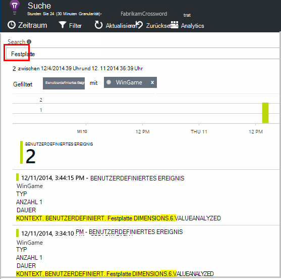

<properties 
    pageTitle="Application Insights API und benutzerdefinierte Ereignisse | Microsoft Azure" 
    description="Legen Sie ein paar Codezeilen Gerät oder Desktop app, Webseite oder Dienst Nutzung verfolgen und Probleme diagnostizieren." 
    services="application-insights"
    documentationCenter="" 
    authors="alancameronwills" 
    manager="douge"/>
 
<tags 
    ms.service="application-insights" 
    ms.workload="tbd" 
    ms.tgt_pltfrm="ibiza" 
    ms.devlang="multiple" 
    ms.topic="article" 
    ms.date="10/19/2016" 
    ms.author="awills"/>

# <a name="application-insights-api-for-custom-events-and-metrics"></a>Benutzerdefinierte Ereignisse und die API-Anwendung Einblicke 

*Anwendung Informationen ist in der Vorschau.*

Legen Sie ein paar Codezeilen in Ihrer Anwendung, um herauszufinden, was Benutzer damit sind oder Probleme diagnostizieren. Sie können Telemetrie von Gerät und Desktop-apps, Webclients und Webserver senden. [Visual Studio Application Insights](app-insights-overview.md) Core Telemetrie API kann benutzerdefinierte Ereignisse und Metriken und Ihre eigenen Versionen von standard Telemetrie. Diese API ist dieselbe API, mit dem standard Application Insights Datensammlern.

## <a name="api-summary"></a>API-Zusammenfassung

Die API ist plattformübergreifend abgesehen von ein paar kleine Variationen einheitlich.

-Methode | Zum
---|---
[`TrackPageView`](#page-views) | Seiten, Bildschirme, Blades oder Formulare
[`TrackEvent`](#track-event) | Benutzeraktionen und andere Ereignisse. Verwendet das Benutzerverhalten oder Leistung überwachen.
[`TrackMetric`](#track-metric) | Leistungsmessungen Warteschlangenlängen nicht im Zusammenhang mit bestimmten Ereignissen
[`TrackException`](#track-exception)|Protokollieren von Ausnahmen für die Diagnose. Verfolgen sie andere Ereignisse auftreten, wobei Stack-Traces untersuchen.
[`TrackRequest`](#track-request)| Protokollieren Sie die Häufigkeit und Dauer von Anfragen für Performance-Analyse.
[`TrackTrace`](#track-trace)|Diagnoseprotokoll Nachrichten. Sie können auch 3rd Party Protokolle erfassen.
[`TrackDependency`](#track-dependency)|Protokollieren Sie Dauer und Häufigkeit der Aufrufe von externen Komponenten Ihre Anwendung hängt

Sie können die meisten dieser Anrufe Telemetrie [Eigenschaften und Metriken anfügen](#properties) . 


## <a name="prep"></a>Bevor Sie beginnen

Wenn Sie dies noch nicht getan haben:

* Application Insights-SDK und dem Projekt hinzugefügt:
 * [ASP.NET Projekt][greenbrown]
 * [Java-Projekt][java] 
 * [JavaScript auf jeder Webseite][client]   

* In Ihrem Gerät oder Servercode gehören:

    *C#:*`using Microsoft.ApplicationInsights;`

    *VB:*`Imports Microsoft.ApplicationInsights`

    *Java:*`import com.microsoft.applicationinsights.TelemetryClient;`

## <a name="construct-a-telemetryclient"></a>Erstellen einer TelemetryClient

Erstellt eine Instanz von TelemetryClient (außer in JavaScript in Webseiten):

*C#:* 

    private TelemetryClient telemetry = new TelemetryClient();

*VB:* 

    Private Dim telemetry As New TelemetryClient

*Java*

    private TelemetryClient telemetry = new TelemetryClient();

TelemetryClient ist threadsicher.

Sollten Sie eine Instanz von `TelemetryClient` für jedes Modul der app. Zum Beispiel möglicherweise einen `TelemetryClient` in Ihrem Webdienst eingehenden HTTP-Anfragen und in einer Klasse Middleware Business Logic Ereignisse gemeldet. Eigenschaften können Sie festlegen wie `TelemetryClient.Context.User.Id` Benutzer und Sessions oder `TelemetryClient.Context.Device.Id` zur Identifizierung des Computers. Dazu gehört alle Ereignisse, die von der Instanz gesendet.


## <a name="track-event"></a>Track-Ereignis

Anwendung Erkenntnisse ein *benutzerdefiniertes Ereignis* ist ein Datenpunkt, beide [Metriken] Explorer angezeigt[ metrics] als aggregierte Anzahl und als einzelne Vorkommen [Diagnose]Suche[diagnostic]. (Es ist nicht mit MVC oder anderen Frameworks "Ereignisse" verknüpft) 

TrackEvent Aufrufe einfügen in Code Häufigkeit zählen Benutzer wählen Sie ein bestimmtes Feature, wie oft sie bestimmte Ziele oder vielleicht bestimmte Fehler. 

Senden Sie z. B. in eine app, ein Ereignis aus, sobald ein Benutzer gewinnt: 

*JavaScript*

    appInsights.trackEvent("WinGame");

*C#*
    
    telemetry.TrackEvent("WinGame");

*VB*


    telemetry.TrackEvent("WinGame")

*Java*

    telemetry.trackEvent("WinGame");


### <a name="view-your-events-in-the-azure-portal"></a>Anzeigen der Ereignisse im Azure-portal

Finden die Anzahl der Ereignisse, eine Blade [Metrik Explorer](app-insights-metrics-explorer.md) öffnen, ein neues Diagramm, und wählen Ereignisse.  



Anzahl verschiedener Ereignisse Vergleich legen Sie den Diagrammtyp Raster und Gruppe von Namen:




Klicken Sie im Raster auf einen Ereignisnamen an einzelne Vorkommen dieses Ereignisses.



Klicken Sie auf jedes Vorkommen, um weitere Details anzuzeigen.

Setzen Sie auf bestimmte Ereignisse suchen oder Metrik Explorer das Blade Filter auf den Ereignisnamen, denen Sie interessieren:



## <a name="track-metric"></a>Metrik nachverfolgen

Verwenden Sie TrackMetric Metriken zu senden, die zu bestimmten Ereignissen zugeordnet sind. Beispielsweise könnten Sie eine Warteschlangenlänge regelmäßig überwachen. 

Metriken als statistische Diagramme im Metrik-Explorer angezeigt, aber im Gegensatz zu Ereignissen, Sie einzelne Vorkommen Diagnose Suche suchen können nicht.

Metrikwerte sollte > = 0 angezeigt werden.


*JavaScript*

    appInsights.trackMetric("Queue", queue.Length);

*C#*

    telemetry.TrackMetric("Queue", queue.Length);

*VB*

    telemetry.TrackMetric("Queue", queue.Length)

*Java*

    telemetry.trackMetric("Queue", queue.Length);

In der Tat empfiehlt dies in einem Hintergrundthread:

*C#*

    private void Run() {
     var appInsights = new TelemetryClient();
     while (true) {
      Thread.Sleep(60000);
      appInsights.TrackMetric("Queue", queue.Length);
     }
    }


Die Ergebnisse, Metrik-Explorer öffnen und ein neues Diagramm hinzufügen. Legen sie die Metrik anzuzeigen.



Gibt es [Grenzwerte für die Anzahl der Kriterien](#limits) , die Sie verwenden können.

## <a name="page-views"></a>Seitenaufrufe

In einem Gerät oder Webseite app wird Seite Ansicht Telemetrie standardmäßig gesendet jeder Bildschirm oder der Seite geladen wird. Sie können jedoch ändern, um zusätzliche oder abweichende Zeiten Seitenansichten verfolgen. Beispielsweise in einer Anwendung, die Registerkarten oder Blades möchten "Seite" überwachen, wenn der Benutzer ein neues Blatt wird geöffnet. 



Benutzer und Sitzung ist gesendet als Eigenschaften mit Seitenaufrufe, damit Diagramme Benutzer und Sitzung wird Seite Ansicht Telemetrie lebendig.

#### <a name="custom-page-views"></a>Benutzerdefinierte Ansichten

*JavaScript*

    appInsights.trackPageView("tab1");

*C#*

    telemetry.TrackPageView("GameReviewPage");

*VB*

    telemetry.TrackPageView("GameReviewPage")


Haben Sie mehrere Registerkarten in anderen HTML-Seiten können Sie auch den URL angeben:

    appInsights.trackPageView("tab1", "http://fabrikam.com/page1.htm");

#### <a name="timing-page-views"></a>Timing Seitenansichten

Standardmäßig gemeldeten Zeit "Seite Ansicht Load Time" aus gemessen werden, wenn der Browser die Anforderung sendet, bis Ladeereignis der Seite im Browser aufgerufen wird.

Stattdessen können Sie:

* Eine explizite Dauer in der [TrackPageView](https://github.com/Microsoft/ApplicationInsights-JS/blob/master/API-reference.md#trackpageview) festgelegt.
 * `appInsights.trackPageView("tab1", null, null, null, durationInMilliseconds);`
* Verwenden Sie die Seitenansicht timing ruft `startTrackPage` und `stopTrackPage`.

*JavaScript*

    // To start timing a page:
    appInsights.startTrackPage("Page1");

... 

    // To stop timing and log the page:
    appInsights.stopTrackPage("Page1", url, properties, measurements);

Den Namen verwenden wie der erste Parameter der Start- und ruft verknüpft. Wird standardmäßig der Name der aktuellen Seite. 

Das Intervall zwischen den Start- und die resultierende Seite laden Dauer im Metrik-Explorer angezeigten entnommen. Es liegt Ihnen welchen Intervall wirklich Zeit.

## <a name="track-request"></a>Track-Anforderung

Vom Server SDK HTTP-Anfragen Anmeldung verwendet. 

Sie können auch sie selbst aufrufen möchten Sie Anfragen in einem Kontext simulieren, müssen Sie nicht das Modul Web Service ausgeführt.

*C#*

    // At start of processing this request:

    // Operation Id and Name are attached to all telemetry and help you identify
    // telemetry associated with one request:
    telemetry.Context.Operation.Id = Guid.NewGuid().ToString();
    telemetry.Context.Operation.Name = requestName;
    
    var stopwatch = System.Diagnostics.Stopwatch.StartNew();

    // ... process the request ...

    stopwatch.Stop();
    telemetry.TrackRequest(requestName, DateTime.Now,
       stopwatch.Elapsed, 
       "200", true);  // Response code, success


## <a name="operation-context"></a>Vorgangskontext

Telemetrieelemente können gemeinsam zugeordnet werden Papiere, damit eine allgemeine Operation ID. Die standard-Anfrage Modul wird Ausnahmen und andere Ereignisse während der Verarbeitung einer HTTP-Anforderung gesendet. Die ID können Sie in [Suchen](app-insights-diagnostic-search.md) und [Analysen](app-insights-analytics.md)der Anforderung zugeordnete Ereignisse finden. 

Am einfachsten stellen Sie die ID ist eine Vorgangskontext mithilfe dieses Muster festlegen:

    // Establish an operation context and associated telemetry item:
    using (var operation = telemetry.StartOperation<RequestTelemetry>("operationName"))
    {
        // Telemetry sent in here will use the same operation ID.
        ...
        telemetry.TrackEvent(...); // or other Track* calls
        ...
        // Set properties of containing telemetry item - for example:
        operation.Telemetry.ResponseCode = "200";
        
        // Optional: explicitly send telemetry item:
        telemetry.StopOperation(operation);

    } // When operation is disposed, telemetry item is sent.

Neben der Einstellung eines Operationskontext `StartOperation` erstellt eine Telemetrie angeben und wenn die Operation verkaufen oder explizit aufrufen sendet `StopOperation`. Verwenden Sie `RequestTelemetry` als Typ Telemetrie dann seine Dauer soll das festgelegte Intervall zwischen Start und Stop.

Operation Kontexten können nicht geschachtelt werden. Wenn es bereits ein Operationskontext, ist seine ID alle enthaltenen Elemente, einschließlich des Elements mit StartOperation erstellte zugeordnet.

In Suche wird der Vorgangskontext verwandter Elemente erstellen:




## <a name="track-exception"></a>Track-Ausnahme

Ausnahmen an Application Insights senden: zählen [sie][metrics], als Hinweis auf die Häufigkeit des Problems; und [einzelne Vorkommen][diagnostic]. Die Berichte umfassen die Stack-Traces.

*C#*

    try
    {
        ...
    }
    catch (Exception ex)
    {
       telemetry.TrackException(ex);
    }

*JavaScript*

    try
    {
       ...
    }
    catch (ex)
    {
       appInsights.trackException(ex);
    }

SDKs catch viele Ausnahmen automatisch, damit Sie nicht immer TrackException explizit aufrufen müssen.

* ASP.NET: [Schreiben von Code zum Abfangen von Ausnahmen](app-insights-asp-net-exceptions.md)
* J2EE: [Ausnahmen automatisch erkannt](app-insights-java-get-started.md#exceptions-and-request-failures)
* JavaScript: Automatisch erkannt. Wenn Sie automatische deaktivieren möchten, fügen Sie eine Zeile in der Codeausschnitt in Ihre Webseiten einfügen:

    ```
    ({
      instrumentationKey: "your key"
      , disableExceptionTracking: true
    })
    ```


## <a name="track-trace"></a>Spur verfolgen 

Können Sie Probleme durch Senden einer Gruppenmitglieder an Application Insights diagnostizieren. Sie können Abschnitte von Diagnosedaten und [Diagnose]Suche überprüfen[diagnostic]. 

 

[Protokollieren Sie Adapter] [ trace] das Portal Drittanbieterprotokolle an diese API verwenden.


*C#*

    telemetry.TrackTrace(message, SeverityLevel.Warning, properties);


Suchen Sie auf dem Nachrichteninhalt jedoch (im Gegensatz zu Eigenschaftswerte) kann nicht gefiltert werden auf.

Das Limit für `message` ist wesentlich höher als Grenzwert für Eigenschaften.
Ein Vorteil des TrackTrace ist, dass Sie relativ lange Daten in die Nachricht einfügen können. Beispielsweise konnte Postbackdaten codieren.  


Darüber hinaus können Sie einen Schweregrad zu Ihrer Nachricht hinzufügen. Und wie andere Telemetrie können Sie Eigenschaftswerte, die Sie verwenden können, Filter oder Suche für verschiedene Spuren hinzufügen. Zum Beispiel:


    var telemetry = new Microsoft.ApplicationInsights.TelemetryClient();
    telemetry.TrackTrace("Slow database response",
                   SeverityLevel.Warning,
                   new Dictionary<string,string> { {"database", db.ID} });

Auf diese Weise können Sie [Suche][diagnostic], einfach alle Nachrichten mit einem bestimmten Schweregrad für eine bestimmte Datenbank filtern.

## <a name="track-dependency"></a>Track-Abhängigkeit

Verwenden Sie dieser Aufruf der Reaktionszeiten und Erfolgsraten der Aufrufe an einen externen Code. Die Ergebnisse werden in den Diagrammen Abhängigkeit im Portal. 

```C#

            var success = false;
            var startTime = DateTime.UtcNow;
            var timer = System.Diagnostics.Stopwatch.StartNew();
            try
            {
                success = dependency.Call();
            }
            finally
            {
                timer.Stop();
                telemetry.TrackDependency("myDependency", "myCall", startTime, timer.Elapsed, success);
            }
```

Beachten Sie, dass Server, den SDKs [Abhängigkeit Modul](app-insights-dependencies.md) enthalten, erkennt und überwacht bestimmte Abhängigkeit - z. B. Datenbanken und anderen APIs automatisch ruft. Sie müssen eine Agenteninstallation auf dem Server das Modul arbeiten. Sie verwenden diesen Aufruf Wenn Aufrufe zu verfolgen, die durch die automatisierte Überwachung abgefangen werden nicht oder wenn Sie den Agenten installieren möchten.

Zum Deaktivieren des Moduls Tracking standard Abhängigkeit bearbeiten [ApplicationInsights.config](app-insights-configuration-with-applicationinsights-config.md) und den Verweis auf `DependencyCollector.DependencyTrackingTelemetryModule`.


## <a name="flushing-data"></a>Daten

Normalerweise sendet das SDK Daten manchmal Beeinträchtigung der Benutzer zu minimieren möchten. Jedoch in einigen Fällen möchten Sie leeren Puffer - Beispiel, verwenden Sie das SDK in einer Anwendung, die beendet wird.

*C#*

    telemetry.Flush();

    // Allow some time for flushing before shutdown.
    System.Threading.Thread.Sleep(1000);

Beachten Sie, dass die asynchrone [Telemetrie Serverchannel](https://www.nuget.org/packages/Microsoft.ApplicationInsights.WindowsServer.TelemetryChannel/)jedoch synchron im Arbeitsspeicher Kanal oder [permanente Kanal](app-insights-api-filtering-sampling.md#persistence-channel)verwenden soll.


## <a name="authenticated-users"></a>Authentifizierte Benutzer

In einer Web-app sind Benutzer durch Cookie bezeichnet wird. Benutzer kann mehr als einmal gezählt werden, Zugriff auf Ihre Anwendung von einem anderen Computer oder Browser oder Cookies löschen. 

Aber wenn Benutzer Ihrer Anwendung anmelden, Sie erhalten genauere Anzahl die authentifizierten Benutzer-Id im Browser-Code festlegen:

*JavaScript*

```JS
    // Called when my app has identified the user.
    function Authenticated(signInId) {
      var validatedId = signInId.replace(/[,;=| ]+/g, "_");
      appInsights.setAuthenticatedUserContext(validatedId);
      ...
    }
```

In einer ASP.NET Web MVC-Anwendung, zum Beispiel:

*Razor*

        @if (Request.IsAuthenticated)
        {
            <script>
                appInsights.setAuthenticatedUserContext("@User.Identity.Name
                   .Replace("\\", "\\\\")"
                   .replace(/[,;=| ]+/g, "_"));
            </script>
        }

Nicht mit der tatsächlichen anmelden Benutzername erforderlich. Es muss nur eine Id, die nur für diesen Benutzer. Sind keine Leerzeichen oder Zeichen `,;=|`. 

Die Benutzer-Id wird auch in einem Sitzungscookie festgelegt und an den Server gesendet. Wenn Server SDK installiert ist, die authentifizierte Benutzer-Id erhalten als Teil der Kontexteigenschaften Client- und Telemetrie damit filtern und suchen auf.

Wenn Ihre Anwendung Benutzer Konten gruppiert, können Sie eine Kennung für das Konto (mit dem gleichen Zeichen) übergeben.


      appInsights.setAuthenticatedUserContext(validatedId, accountId);

[Metrik-Explorer](app-insights-metrics-explorer.md)können Sie ein Diagramm erstellen, die **Benutzer authentifiziert** und **Benutzerkonten**zählt. 

Sie können auch [Suche] [ diagnostic] Client Datenpunkte mit spezifischen Benutzernamen und Konten.

## <a name="properties"></a>Filtern, suchen und Ihre Daten mit Eigenschaften

Sie legen Eigenschaften und Maße zu (und auch Metriken Seite Ansichten, Ausnahmen und anderen Telemetriedaten).

**Eigenschaften** sind Werte, die Sie zum Filtern der Telemetrie in den Verwendungsberichten verwenden können. Beispielsweise stellt Ihre Anwendung mehrere Spiele, Sie wollen den Namen des Spiels an jedes Ereignis anfügen, damit Sie sehen immer beliebter spielen. 

Es sind maximal etwa 1 KB auf die Länge der Zeichenfolge. (Große Datenmengen senden, verwenden Sie den Meldungsparameter [TrackTrace](#track-trace).)

**Metriken** sind numerische Werte, die grafisch dargestellt werden können. Sie möchten z. B. vorhanden ist eine allmähliche Erhöhung der Ergebnisse der Spieler erreichen. Diagramme können von den Eigenschaften, die mit dem Ereignis gesendet segmentiert, so dass Sie separate oder Diagramme für verschiedene Spiele.

Metrikwerte sollte > = 0 angezeigt werden.


Gibt [die Anzahl von Eigenschaften und Eigenschaftswerte Metriken beschränkt](#limits) , die Sie verwenden können.


*JavaScript*

    appInsights.trackEvent
      ("WinGame",
         // String properties:
         {Game: currentGame.name, Difficulty: currentGame.difficulty},
         // Numeric metrics:
         {Score: currentGame.score, Opponents: currentGame.opponentCount}
         );

    appInsights.trackPageView
        ("page name", "http://fabrikam.com/pageurl.html",
          // String properties:
         {Game: currentGame.name, Difficulty: currentGame.difficulty},
         // Numeric metrics:
         {Score: currentGame.score, Opponents: currentGame.opponentCount}
         );
          

*C#*

    // Set up some properties and metrics:
    var properties = new Dictionary <string, string> 
       {{"game", currentGame.Name}, {"difficulty", currentGame.Difficulty}};
    var metrics = new Dictionary <string, double>
       {{"Score", currentGame.Score}, {"Opponents", currentGame.OpponentCount}};

    // Send the event:
    telemetry.TrackEvent("WinGame", properties, metrics);


*VB*

    ' Set up some properties:
    Dim properties = New Dictionary (Of String, String)
    properties.Add("game", currentGame.Name)
    properties.Add("difficulty", currentGame.Difficulty)

    Dim metrics = New Dictionary (Of String, Double)
    metrics.Add("Score", currentGame.Score)
    metrics.Add("Opponents", currentGame.OpponentCount)

    ' Send the event:
    telemetry.TrackEvent("WinGame", properties, metrics)


*Java*
    
    Map<String, String> properties = new HashMap<String, String>();
    properties.put("game", currentGame.getName());
    properties.put("difficulty", currentGame.getDifficulty());
    
    Map<String, Double> metrics = new HashMap<String, Double>();
    metrics.put("Score", currentGame.getScore());
    metrics.put("Opponents", currentGame.getOpponentCount());
    
    telemetry.trackEvent("WinGame", properties, metrics);


> [AZURE.NOTE] Achten Sie nicht persönlich identifizierbare Informationen Eigenschaften protokollieren.

**Wenn Metriken verwendet**, Metrik-Explorer öffnen und die Metrik aus der benutzerdefinierten Gruppe:


*Wenn die Metrik erscheint oder Logo nicht vorhanden ist, schließen Sie Blade Auswahl und versuchen Sie es später. Es dauert gelegentlich Stunde Metriken über die Pipeline zusammengefasst werden.*

**Wenn Sie Eigenschaften und Metriken**Segment Metrik von der Eigenschaft:





**Diagnose suchen**, können Sie die Eigenschaften und Metriken einzelne Vorkommen eines Ereignisses anzeigen.





Verwenden Sie das Suchfeld, um Ereignisse mit einem bestimmten Eigenschaftswert anzuzeigen.




[Erfahren Sie mehr über Suchausdrücke][diagnostic].

#### <a name="alternative-way-to-set-properties-and-metrics"></a>Alternative Möglichkeit zum Festlegen von Eigenschaften und Metriken

Wenn es einfacher ist, können Sie die Parameter eines Ereignisses in einem separaten Objekt sammeln:

    var event = new EventTelemetry();

    event.Name = "WinGame";
    event.Metrics["processingTime"] = stopwatch.Elapsed.TotalMilliseconds;
    event.Properties["game"] = currentGame.Name;
    event.Properties["difficulty"] = currentGame.Difficulty;
    event.Metrics["Score"] = currentGame.Score;
    event.Metrics["Opponents"] = currentGame.Opponents.Length;

    telemetry.TrackEvent(event);

> [AZURE.WARNING] Verwenden nicht dieselbe Instanz der Telemetrie Element (`event` in diesem Beispiel) Track*() mehrmals aufgerufen. Dadurch kann Telemetrie mit falschen Konfiguration gesendet werden.


## <a name="timed"></a>Zeitsteuerungsereignisse

Manchmal möchten Sie Diagramm, wie lange es dauert, um eine Aktion auszuführen. Beispielsweise möchten Sie wissen, wie lange Benutzer nehmen auswählen in einem Spiel. Dies ist ein nützliches Beispiel verwendet der Messgröße.


*C#*

    var stopwatch = System.Diagnostics.Stopwatch.StartNew();

    // ... perform the timed action ...

    stopwatch.Stop();

    var metrics = new Dictionary <string, double>
       {{"processingTime", stopwatch.Elapsed.TotalMilliseconds}};

    // Set up some properties:
    var properties = new Dictionary <string, string> 
       {{"signalSource", currentSignalSource.Name}};

    // Send the event:
    telemetry.TrackEvent("SignalProcessed", properties, metrics);


## <a name="defaults"></a>Standardeigenschaften für benutzerdefinierte Telemetrie

Wenn Sie Standard für benutzerdefinierte Ereignisse festlegen, die Sie schreiben möchten, können Sie sie in eine TelemetryClient festlegen. Sie werden alle von diesem Client gesendeten telemetrieelement zugeordnet. 

*C#*

    using Microsoft.ApplicationInsights.DataContracts;

    var gameTelemetry = new TelemetryClient();
    gameTelemetry.Context.Properties["Game"] = currentGame.Name;
    // Now all telemetry will automatically be sent with the context property:
    gameTelemetry.TrackEvent("WinGame");
    
*VB*

    Dim gameTelemetry = New TelemetryClient()
    gameTelemetry.Context.Properties("Game") = currentGame.Name
    ' Now all telemetry will automatically be sent with the context property:
    gameTelemetry.TrackEvent("WinGame")

*Java*

    import com.microsoft.applicationinsights.TelemetryClient;
    import com.microsoft.applicationinsights.TelemetryContext;
    ...


    TelemetryClient gameTelemetry = new TelemetryClient();
    TelemetryContext context = gameTelemetry.getContext();
    context.getProperties().put("Game", currentGame.Name);
    
    gameTelemetry.TrackEvent("WinGame");


    
Einzelne Telemetrie Aufrufe können Standardwerte in ihrer Eigenschaft Wörterbüchern überschreiben.

**Webclients für JavaScript**, [JavaScript Telemetrie Initialisierer zu verwenden](#js-initializer).

**Zum Hinzufügen von Eigenschaften zu allen Telemetrie** Daten von Standardsteuerelementen Module [implementieren `ITelemetryInitializer` ](app-insights-api-filtering-sampling.md#add-properties).


## <a name="sampling-filtering-and-processing-telemetry"></a>Probenahme, Filtern und Telemetrie 

Schreiben Sie Code, um Ihre Telemetrie verarbeiten vor aus dem SDK. Die Verarbeitung enthält Daten aus den Modulen standard Telemetrie wie HTTP-Anforderung und Abhängigkeit.

* [Eigenschaften hinzufügen](app-insights-api-filtering-sampling.md#add-properties) Telemetrie durch implementieren `ITelemetryInitializer` – z. B. Version hinzufügen Zahlen oder andere Werte berechnet. 
* [Filter](app-insights-api-filtering-sampling.md#filtering) ändern oder verwerfen Telemetrie vor aus dem SDK durch implementieren `ITelemetryProcesor`. Sie steuern, welche gesendet oder verworfen werden, jedoch müssen Sie die Auswirkung auf die Metriken. Je nachdem, wie Sie Elemente löschen verlieren Sie die Möglichkeit zum Navigieren zwischen verwandten Elementen.
* [Sampling](app-insights-api-filtering-sampling.md#sampling) ist eine eingesetzte Lösung, die Daten aus Ihrer Anwendung auf das Portal zu reduzieren. Dies geschieht ohne angezeigten Metriken und ohne die Möglichkeit zur Fehlerdiagnose durch Navigation zwischen verknüpften Ausnahmen Anfragen und Seitenansichten.

[Weitere Informationen](app-insights-api-filtering-sampling.md)


## <a name="disabling-telemetry"></a>Telemetrie deaktivieren

Zu **dynamisch anhalten und starten** der Übertragung Telemetrie:

*C#*

```C#

    using  Microsoft.ApplicationInsights.Extensibility;

    TelemetryConfiguration.Active.DisableTelemetry = true;
```

**Deaktivieren Sie ausgewählte standard Kollektoren** - z. B. Leistungsindikatoren, HTTP-Anfragen Dependencies - löschen oder kommentieren Sie die entsprechenden Zeilen in [ApplicationInsights.config][config]. Sie können z. B. dazu TrackRequest Daten senden soll.

## <a name="debug"></a>Entwicklermodus

Während des Debuggens ist es sinnvoll, Ihre Telemetrie beschleunigt über die Pipeline, damit Ergebnisse sofort sehen. Sie auch auf Weitere Nachrichten abrufen, mit denen Sie verfolgen Probleme mit der Telemetrie. Schalten Sie in der Produktion aus, wie sie Ihre Anwendung verlangsamen.


*C#*
    
    TelemetryConfiguration.Active.TelemetryChannel.DeveloperMode = true;

*VB*

    TelemetryConfiguration.Active.TelemetryChannel.DeveloperMode = True


## <a name="ikey"></a>Instrumentation Schlüssel für ausgewählte benutzerdefinierte Telemetrie

*C#*
    
    var telemetry = new TelemetryClient();
    telemetry.InstrumentationKey = "---my key---";
    // ...


## <a name="dynamic-ikey"></a>Dynamische Instrumentierung Schlüssel

Vermeidung der Vermischung Telemetrie aus Entwicklung, Test und Produktion können Sie [separate Anwendung Einblicke Ressourcen erstellen] [ create] und ihre Schlüssel je nach Umgebung ändern.

Anstatt den instrumentationsschlüssel aus der Konfigurationsdatei festlegen im Code. Legen Sie den Schlüssel in eine Initialisierungsmethode, wie global.aspx.cs in einem ASP.NET:

*C#*

    protected void Application_Start()
    {
      Microsoft.ApplicationInsights.Extensibility.
        TelemetryConfiguration.Active.InstrumentationKey = 
          // - for example -
          WebConfigurationManager.Settings["ikey"];
      ...

*JavaScript*

    appInsights.config.instrumentationKey = myKey; 


In Webseiten möchten des Webservers Zustand anstelle buchstäblich in das Skript Code festgelegt werden. Z. B. auf einer Webseite in einer ASP.NET generiert:

*JavaScript in Razor*

    <script type="text/javascript">
    // Standard Application Insights web page script:
    var appInsights = window.appInsights || function(config){ ...
    // Modify this part:
    }({instrumentationKey:  
      // Generate from server property:
      @Microsoft.ApplicationInsights.Extensibility.
         TelemetryConfiguration.Active.InstrumentationKey"
    }) // ...


## <a name="telemetrycontext"></a>TelemetryContext

TelemetryClient hat eine Kontexteigenschaft, die Werte enthält, die mit allen Daten gesendet werden. Werden normalerweise durch die standardmäßige Telemetrie Module festgelegt, aber auch lassen sie selbst. Zum Beispiel:

    telemetry.Context.Operation.Name = "MyOperationName";

Diese Werte selbst festlegen, sollten Sie die entsprechende Zeile aus [ApplicationInsights.config]entfernt[config], Ihre Werte und Standardwerte nicht verwirrt werden.

* **Komponente** Identifiziert die Anwendung und deren version
* **Gerät** Daten zu dem Gerät, auf dem die Anwendung ausgeführt wird (Dies ist in Web-apps Server oder Client-Gerät, von dem Telemetriedaten gesendet)
* **InstrumentationKey** Identifiziert die Ressource Anwendung Einblicke in Azure, wo die Telemetrie angezeigt wird. In der Regel abgeholt ApplicationInsights.config
* **Speicherort** Gibt den Standort des Geräts.
* **Vorgang** Web Apps die aktuelle HTTP-Anforderung. In andere app können Sie diese Ereignisse gruppieren zusammen fest.
 * **ID**: ein generierter Wert, der verschiedene Ereignisse korreliert, sodass beim Untersuchen jedes Ereignis Diagnose Suche Sie finden "Verwandte Elemente"
 * **Name**: ein Bezeichner in der Regel den URL der HTTP-Anforderung. 
 * **SyntheticSource**: Wenn nicht null oder leer, diese Zeichenfolge bedeutet, dass die Quelle der Anforderung als Roboter oder Web Test identifiziert wurde. Standardmäßig wird diese Berechnung Metrik-Explorer ausgeschlossen.
* **Eigenschaften** Eigenschaften, die mit allen Daten gesendet werden. Kann in einzelnen Track * Aufrufe überschrieben werden.
* **Sitzung** Identifiziert die Sitzung des Benutzers. Die Id wird auf einen generierten Wert festgelegt, der geändert wird, wenn der Benutzer nicht für eine Weile aktiv war.
* **Benutzer** Benutzerinformationen. 

## <a name="limits"></a>Grenzen


[AZURE.INCLUDE [application-insights-limits](../../includes/application-insights-limits.md)]

*Wie kann ich vermeiden, schlagen die Datenrate?*

* Verwenden Sie [Probenahme](app-insights-sampling.md).

*Wie lange werden Daten gespeichert?*

* [Data Retention und Datenschutz]Siehe[data].


## <a name="reference-docs"></a>Referenz-Dokumente

* [ASP.NET Verweis](https://msdn.microsoft.com/library/dn817570.aspx)
* [Java-Referenz](http://dl.windowsazure.com/applicationinsights/javadoc/)
* [JavaScript-Referenz](https://github.com/Microsoft/ApplicationInsights-JS/blob/master/API-reference.md)
* [Android SDK](https://github.com/Microsoft/ApplicationInsights-Android)
* [iOS SDK](https://github.com/Microsoft/ApplicationInsights-iOS)


## <a name="sdk-code"></a>SDK-Code

* [ASP.NET Core SDK](https://github.com/Microsoft/ApplicationInsights-dotnet)
* [ASP.NET 5](https://github.com/Microsoft/ApplicationInsights-aspnet5)
* [Windows Server-Pakete](https://github.com/Microsoft/applicationInsights-dotnet-server)
* [Java SDK](https://github.com/Microsoft/ApplicationInsights-Java)
* [JavaScript-SDK](https://github.com/Microsoft/ApplicationInsights-JS)
* [Alle Plattformen](https://github.com/Microsoft?utf8=%E2%9C%93&query=applicationInsights)

## <a name="questions"></a>Fragen

* *Welche Ausnahmen möglicherweise Track_() Aufrufe lösen?*
    
    Keine. Sie müssen sie Try / Catch-Klauseln umschließen. Wenn das SDK Probleme auftreten, es protokolliert Nachrichten Sie finden in die Debugausgabe Konsole und - wenn die Nachrichten - Diagnose Suche.


* *Gibt es eine REST-API zum Abrufen von Daten aus dem Portal?*

    Ja, bald. Verwenden Sie in der [kontinuierlichen exportieren](app-insights-export-telemetry.md).

## <a name="next"></a>Nächste Schritte


[Suchen von Ereignissen und Protokollen][diagnostic]

[Beispiele und exemplarische Vorgehensweisen](app-insights-code-samples.md)

[Problembehandlung][qna]


<!--Link references-->

[client]: app-insights-javascript.md
[config]: app-insights-configuration-with-applicationinsights-config.md
[create]: app-insights-create-new-resource.md
[data]: app-insights-data-retention-privacy.md
[diagnostic]: app-insights-diagnostic-search.md
[exceptions]: app-insights-asp-net-exceptions.md
[greenbrown]: app-insights-asp-net.md
[java]: app-insights-java-get-started.md
[metrics]: app-insights-metrics-explorer.md
[qna]: app-insights-troubleshoot-faq.md
[trace]: app-insights-search-diagnostic-logs.md

 
