<properties 
    pageTitle="Abhängigkeit bei Anwendung Einblicke" 
    description="Auslastung, Verfügbarkeit und Leistung Ihres lokalen oder Microsoft Azure Web Application Anwendung zum Analysieren." 
    services="application-insights" 
    documentationCenter=".net"
    authors="alancameronwills" 
    manager="douge"/>

<tags 
    ms.service="application-insights" 
    ms.workload="tbd" 
    ms.tgt_pltfrm="ibiza" 
    ms.devlang="na" 
    ms.topic="article" 
    ms.date="10/24/2016" 
    ms.author="awills"/>


# <a name="set-up-application-insights-dependency-tracking"></a>Einrichten von Application Insights: Abhängigkeit Tracking


[AZURE.INCLUDE [app-insights-selector-get-started-dotnet](../../includes/app-insights-selector-get-started-dotnet.md)]


Eine *Abhängigkeit* ist eine externe Komponente, die von der Anwendung aufgerufen wird. Es ist normalerweise ein Dienst mit HTTP, einer Datenbank oder eines Dateisystems. In Visual Studio Application Insights können Sie leicht erkennen, wie lange Ihre Anwendung Abhängigkeiten wartet, und wie oft ein Abhängigkeit-Aufruf fehlschlägt.

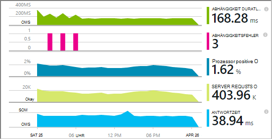

Die vordefinierten abhängigkeitsmonitor meldet derzeit ruft diese Typen von Abhängigkeiten:

* ASP.NET
 * SQL-Datenbanken
 * ASP.NET Web und WCF-Dienste, die HTTP-basierte Bindungen verwenden
 * Lokale oder remote-HTTP-Aufrufe
 * Azure DocumentDb, Tabelle BLOB-Speicher und Warteschlangen
* Java
 * Aufrufe von einer Datenbank über einen [JDBC](http://docs.oracle.com/javase/7/docs/technotes/guides/jdbc/) -Treiber wie MySQL, SQL Server, PostgreSQL und SQLite.
* JavaScript in Webseiten - meldet der [Webseite SDK](app-insights-javascript.md) automatisch Ajax-Aufrufe davon abhängig.

Schreiben Sie Ihre eigenen Aufrufe SDK weitere Abhängigkeiten mithilfe der [TrackDependency-API](app-insights-api-custom-events-metrics.md#track-dependency)überwacht.


## <a name="to-set-up-dependency-monitoring"></a>Abhängigkeitsüberwachung einrichten

Sie benötigen ein [Microsoft Azure](http://azure.com) -Abonnement.

### <a name="if-your-app-runs-on-your-iis-server"></a>Wenn Ihre Anwendung auf dem IIS-Server ausgeführt wird

Ihrer Anwendung auf .NET 4.6 oder höher ausgeführt wird, können Sie entweder [das Application Insights SDK installieren](app-insights-asp-net.md) in Ihrer Anwendung oder Anwendung Einblicke Statusmonitor. Sie Sie benötigen nicht.

Andernfalls installieren Sie Anwendung Einblicke Status Monitor auf dem Server:

1. IIS Webserver, melden Sie sich mit Administratoranmeldeinformationen.
2. Herunterladen Sie und führen Sie der [Statusmonitor Installer aus](http://go.microsoft.com/fwlink/?LinkId=506648).
4. Melden Sie sich im Installations-Assistenten Microsoft Azure an.

    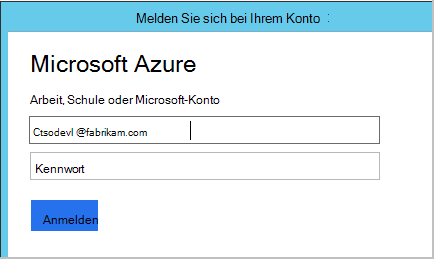

    *Fehler? Finden Sie unter [Troubleshooting](#troubleshooting).*

5. Wählen Sie installierte Anwendung oder Website, die Sie überwachen möchten, und konfigurieren Sie die Ressource in der die Ergebnisse im Application Insights-Portal.

    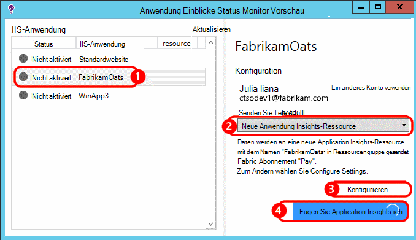

    Normalerweise möchten Sie eine neue Ressource und die [Ressourcengruppe]konfigurieren[roles].

    Andernfalls eine vorhandene Ressource verwenden, wenn Sie bereits [Webtests] [ availability] für Ihre Website oder [Web-Client überwachen][client].

6. Starten Sie IIS neu.

    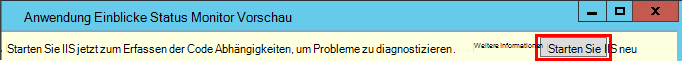

    Der Webdienst wird kurzzeitig unterbrochen.

6. Beachten Sie, dass ApplicationInsights.config in den Web apps eingefügt wurde, die Sie überwachen möchten.

    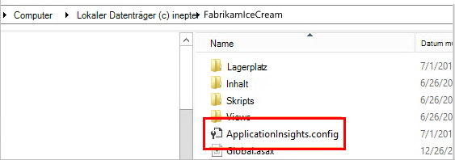

   Es gibt auch in web.config geändert.

#### <a name="want-to-reconfigure-later"></a>Möchten Sie später (erneut) konfigurieren?

Nach Abschluss des Assistenten können Sie den Agenten jederzeit neu konfigurieren. Sie können dies auch verwenden, wenn den Agent installiert, aber es Probleme mit der Erstinstallation gab.

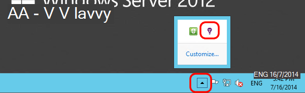


### <a name="if-your-app-runs-as-an-azure-web-app"></a>Wenn Ihre Anwendung als Azure Web App ausgeführt wird

Fügen Sie im Steuerungsbedienfeld Ihrer Anwendung Azure Application Insights-Erweiterung hinzu


### <a name="if-its-an-azure-cloud-services-project"></a>Ist ein Azure Cloud Services-Projekt

[Web-und Workerrollen Skripts hinzufügen](app-insights-cloudservices.md#dependencies). Oder [Installieren Sie .NET Framework 4.6 oder höher](../cloud-services/cloud-services-dotnet-install-dotnet.md).

## <a name="diagnosis"></a>Analyse von Leistungsproblemen Abhängigkeit

Bewerten der Anforderung an den Server, Blade Leistung öffnen und Scrollen mit Blick auf das Raster der Anfragen:

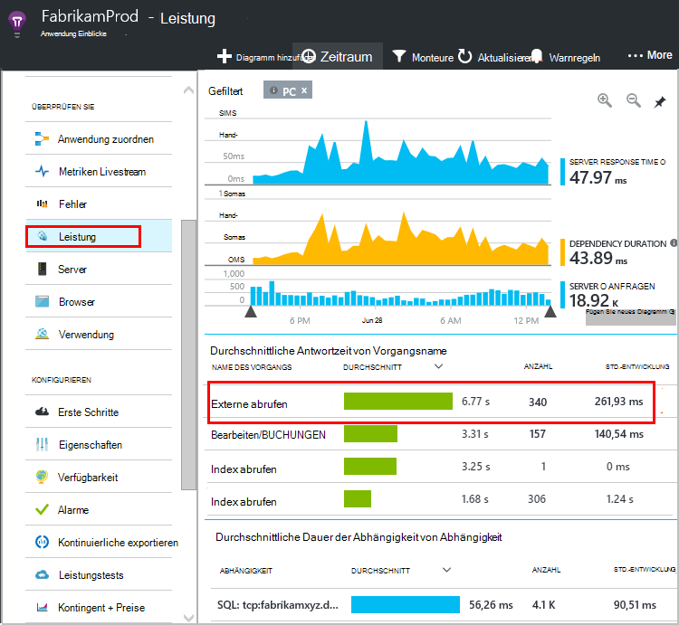

Der oberste Eintrag dauert sehr lange. Sehen Sie, wo die Zeit finden.

Klicken Sie auf, um einzelne Ereignisse finden Sie unter:


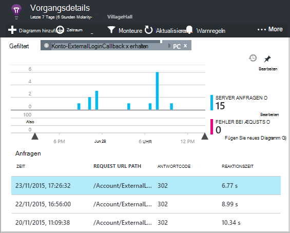

Klicken Sie auf jede Instanz langer näher untersuchen.

Scrollen Sie remote Abhängigkeit ruft diese Anfrage:

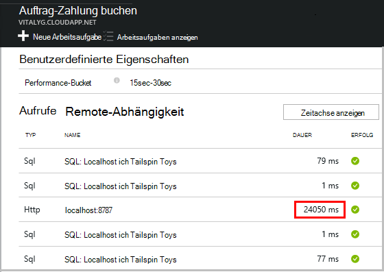

Es sieht aus wie die Zeit Service, die einen Aufruf an einen lokalen Dienst diese Anfrage aufgewendet wurde. 


Wählen Sie diese Zeile informieren:

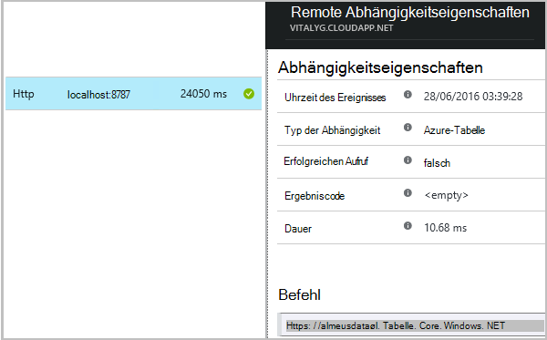

Das Detail enthält genügend Informationen, um das Problem zu diagnostizieren.


In einem anderen Fall Abhängigkeit Aufruf ist nicht lang, aber der Zeitachsenansicht wechseln, sehen wir, die Verzögerung in unsere interne Verarbeitung:


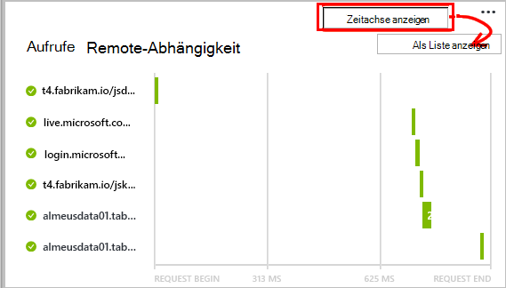


## <a name="failures"></a>Fehler

Fehlgeschlagene Anfragen, klicken Sie auf das Diagramm.

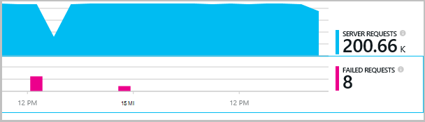

Klicken Sie auf einen Typ und Anforderung beispielsweise zu einem fehlgeschlagenen Aufruf remote Abhängigkeit.


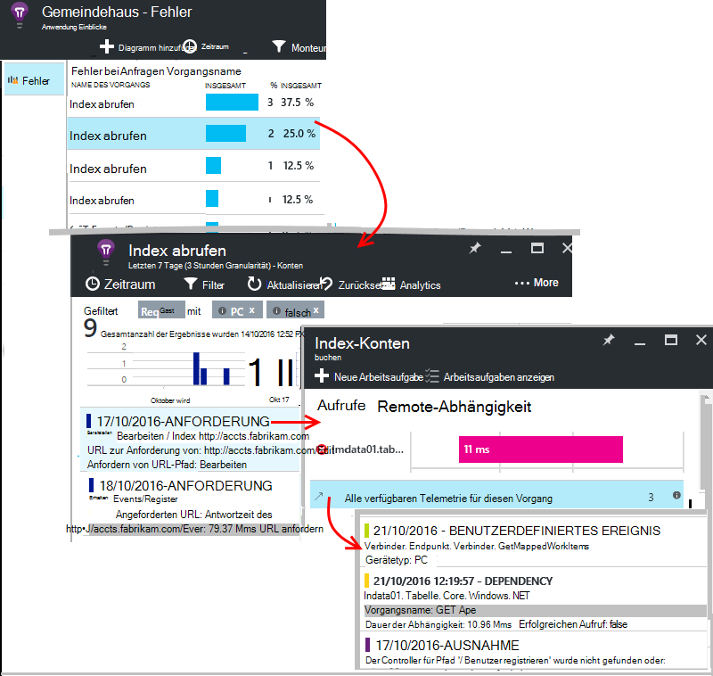


## <a name="custom-dependency-tracking"></a>Benutzerdefinierte Abhängigkeit verfolgen

Nachverfolgen von Abhängigkeit Standardmodul erkennt automatisch externe Faktoren wie Datenbanken und REST-APIs. Aber Sie einige zusätzlichen Komponenten auf die gleiche Weise behandelt werden. 

Sie können Code schreiben, die Abhängigkeitsinformationen, sendet mit derselben [TrackDependency-API](app-insights-api-custom-events-metrics.md#track-dependency) , die von den Standardmodulen verwendet wird.

Z. B. Wenn Sie Code mit einer Assembly, die Sie selbst geschrieben haben erstellen, können Sie Zeit alle Aufrufe, zu welchen Beitrag zu der Antwortzeiten macht. Senden dieser Daten in Diagrammen Abhängigkeit Anwendung Erkenntnisse angezeigt mit `TrackDependency`.

```C#

            var startTime = DateTime.UtcNow;
            var timer = System.Diagnostics.Stopwatch.StartNew();
            try
            {
                success = dependency.Call();
            }
            finally
            {
                timer.Stop();
                telemetry.TrackDependency("myDependency", "myCall", startTime, timer.Elapsed, success);
            }
```

Wenn Sie standard Abhängigkeit trackingmodul ausschalten möchten, entfernen Sie auf DependencyTrackingTelemetryModule in [ApplicationInsights.config](app-insights-configuration-with-applicationinsights-config.md).

## <a name="troubleshooting"></a>Problembehandlung

*Abhängigkeit Erfolg flag immer zeigt entweder true oder false.*

* Aktualisieren Sie auf die neueste Version des SDK. Wenn .NET Version kleiner 4.6 ist, installieren Sie [Überwachen](app-insights-monitor-performance-live-website-now.md).

## <a name="next-steps"></a>Nächste Schritte

- [Ausnahmen](app-insights-asp-net-exceptions.md)
- [Benutzer & Seite Daten][client]
- [Verfügbarkeit](app-insights-monitor-web-app-availability.md)


<!--Link references-->

[api]: app-insights-api-custom-events-metrics.md
[apikey]: app-insights-api-custom-events-metrics.md#ikey
[availability]: app-insights-monitor-web-app-availability.md
[azure]: ../insights-perf-analytics.md
[client]: app-insights-javascript.md
[diagnostic]: app-insights-diagnostic-search.md
[metrics]: app-insights-metrics-explorer.md
[netlogs]: app-insights-asp-net-trace-logs.md
[portal]: http://portal.azure.com/
[qna]: app-insights-troubleshoot-faq.md
[redfield]: app-insights-asp-net-dependencies.md
[roles]: app-insights-resources-roles-access-control.md

 
