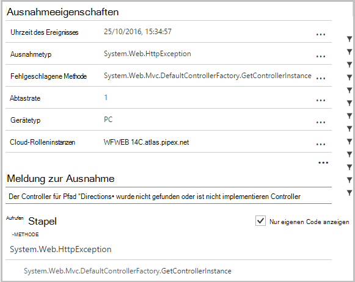
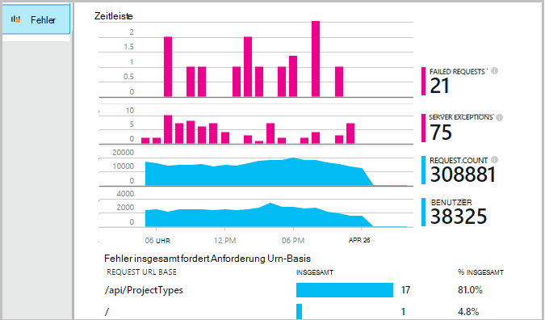
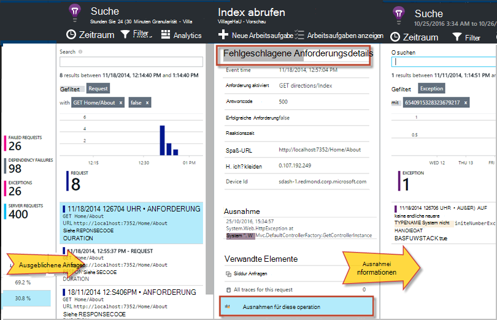
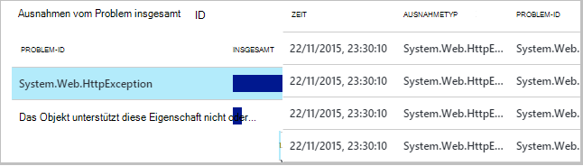
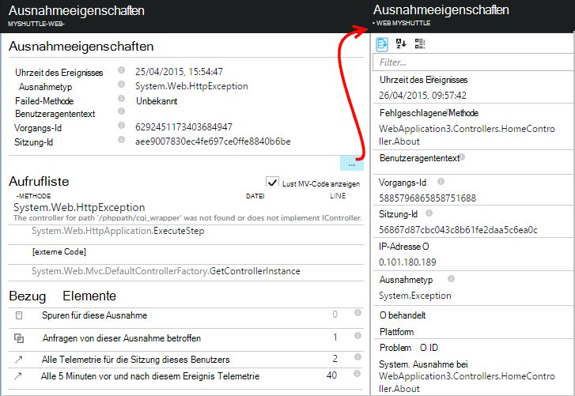
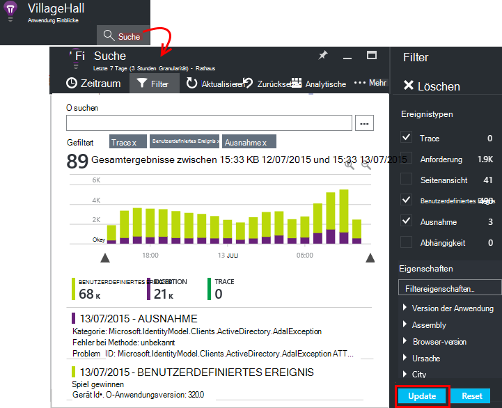
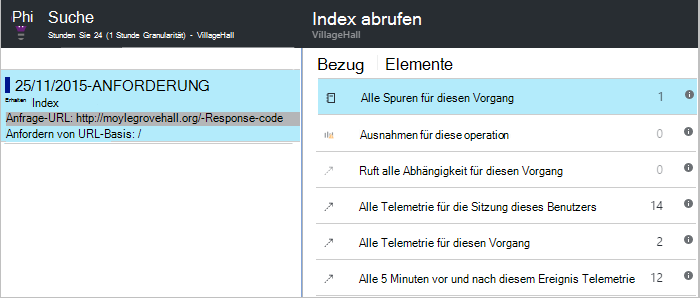

<properties 
    pageTitle="Diagnostizieren von Fehlern und Ausnahmen in ASP.NET apps Anwendung Einblicke" 
    description="Erfassen Sie Ausnahmen von ASP.NET apps mit Anforderung Telemetrie." 
    services="application-insights" 
    documentationCenter=".net"
    authors="alancameronwills" 
    manager="douge"/>

<tags 
    ms.service="application-insights" 
    ms.workload="tbd" 
    ms.tgt_pltfrm="ibiza" 
    ms.devlang="na" 
    ms.topic="article" 
    ms.date="10/27/2016" 
    ms.author="awills"/>


# <a name="set-up-application-insights-diagnose-exceptions"></a>Einrichten von Application Insights: Diagnose von Ausnahmen

[AZURE.INCLUDE [app-insights-selector-get-started-dotnet](../../includes/app-insights-selector-get-started-dotnet.md)]


Durch die Überwachung der Anwendung mit [Visual Studio Application Insights][start], fehlgeschlagene Anfragen können auf Client und Server, Ausnahmen und korreliert werden, damit die Ursachen schnell diagnostizieren können.

ASP.NET app überwachen zu können, müssen Sie [Application Insights-SDK hinzufügen] [ greenbrown] zu einer Anwendung oder [Überwachen auf dem IIS-Server installieren][redfield], ist Ihre Anwendung eine Azure Web App [Anwendung Einblicke Erweiterung](app-insights-azure-web-apps.md)hinzufügen.

## <a name="diagnosing-exceptions-using-visual-studio"></a>Diagnose von Ausnahmen mit Visual Studio

Öffnen Sie die app Projektmappe in Visual Studio zu debuggen.

Führen Sie die Anwendung auf dem Server oder auf dem Entwicklungscomputer mit F5.

Öffnen Sie Suchfenster Anwendung Einblicke in Visual Studio, und legen sie Ereignisse aus Ihrer Anwendung angezeigt. Beim Debuggen, dazu Sie einfach auf die Schaltfläche Anwendung Einblicke.


Beachten Sie, dass den Bericht nur Ausnahmen zu filtern. 

*Keine Ausnahmen angezeigt? Finden Sie unter [Ausnahmen erfassen](#exceptions).*

Klicken Sie auf einen Bericht der Stack-Trace angezeigt.



Klicken Sie auf eine Zeile auf Stapelrahmen zum Öffnen der entsprechenden Datei.  

## <a name="diagnosing-failures-using-the-azure-portal"></a>Diagnose von Fehlern mithilfe des Azure-Portals

Application Insights Übersicht Ihrer Anwendung Fehler Kachel zeigt Diagramme von Ausnahmen und Fehler bei HTTP-Anfragen mit einer Liste der Anforderung URLs, die häufigsten Fehler verursachen.



Klicken Sie auf eines der Anforderungsfehler in der Liste einzelne Vorkommen des Fehlers zu. Klicken Sie dort über Ausnahmen oder alle Ablaufverfolgungsdaten zugeordnet:




**Auch** aus der Liste der Ausnahmen, die Sie starten können finden Fehler Blade weiter. Klicken Sie weiter bis schließlich Ausnahmen angezeigt.




*Keine Ausnahmen angezeigt? Finden Sie unter [Ausnahmen erfassen](#exceptions).*

Von dort können Sie Stapelrahmen und detaillierte Eigenschaften jeder Ausnahme und suchen zugehörige Protokoll Trace oder andere Ereignisse.




[Erfahren Sie mehr über Diagnosesuche][diagnostic].


## <a name="dependency-failures"></a>Abhängigkeitsfehler

Eine *Abhängigkeit* ist ein Dienst, den die Anwendung, in der Regel über eine REST-API oder Datenbank aufruft. [Anwendung Einblicke Statusmonitor] [ redfield] verschiedener Arten von Abhängigkeit Aufruf messen Anrufdauer und Erfolg oder Fehler überwacht. 

Abhängigkeit Daten müssen Sie [Statusmonitor installieren] [ redfield] auf dem IIS-Server oder Ihre Anwendung eine Azure Web App verwenden [Anwendung Einblicke Erweiterung](app-insights-azure-web-apps.md). 

Fehlgeschlagene Aufrufe von Abhängigkeiten auf die Fehler aufgeführt sind, und Sie finden sie auch unter Verwandte Elemente der Anforderung und Ausnahmeinformationen.

*Keine abhängigkeitsfehler? Das ist gut. Aber überprüfen Sie Abhängigkeitsdaten erhalten, öffnen Sie das Blade Leistung und Dauer der Abhängigkeit Diagramm betrachten.*

 

## <a name="custom-tracing-and-log-data"></a>Benutzerdefinierte Protokollierung und Daten

Um Daten für Ihre Anwendung zu erhalten, können Sie Code zum eigenen Telemetriedaten einfügen. Diese Diagnose Suche neben der Anforderung, Seitenansicht und andere automatisch gesammelten Daten angezeigt. 

Sie haben mehrere Optionen:

* [Trackevent()"](app-insights-api-custom-events-metrics.md#track-event) ist in der Regel zum Überwachen Verwendungsmuster, jedoch auch sendet Daten unter benutzerdefinierte diagnostische Suche angezeigt. Ereignisse werden benannt und führen Zeichenfolgeneigenschaften und numerischen Kriterien Sie [die Diagnose Suche filtern können][diagnostic].
* [TrackTrace()](app-insights-api-custom-events-metrics.md#track-trace) können Sie mehr Daten wie Informationen senden.
* [Trackexception()"](#exceptions) sendet Stack-Traces. [Weitere Informationen über Ausnahmen](#exceptions).
* Bereits eine protokollierungsframework wie Log4Net oder NLog verwenden, können Sie [diese Protokolle erfasst] [ netlogs] und Diagnose Suche neben Anforderung und Ausnahme.

Öffnen Sie zum Anzeigen dieser Ereignisse [Suche][diagnostic]Filter öffnen, und wählen Sie Custom Event Trace oder Ausnahme.





> [AZURE.NOTE] Ihre app viel Telemetrie generiert, verringert adaptive Sampling-Modul automatisch die Lautstärke, die im Portal an einen repräsentativen Teil Ereignisse senden. Ereignisse, die Teil der gleichen Operation ausgewählt oder als Gruppe deaktiviert, damit Sie zwischen Ereignissen navigieren können. [Enthält Informationen Sie zu Sampling.](app-insights-sampling.md)

### <a name="how-to-see-request-post-data"></a>Anforderung-POST-Daten anzeigen

Details der Anforderung enthalten nicht für Ihre Anwendung in einem POST-Aufruf gesendeten Daten. Diese Daten wurden gemeldet:

* [Installieren Sie das SDK] [ greenbrown] im Anwendungsprojekt.
* Fügen Sie Code in der Anwendung aufrufen, [Microsoft.ApplicationInsights.TrackTrace()][api]. Der Message-Parameter senden Sie POST-Daten. Maximal zulässige Größe deshalb sollten wichtigen Daten senden.
* Beim Überprüfen einer fehlgeschlagenen Anforderung finden Sie zugeordneten Spuren.  




## <a name="exceptions"></a>Erfassen von Ausnahmen und verwandte Diagnosedaten

Zunächst wird im Portal die Ausnahmen nicht angezeigt, die in Ihrer app zu Fehlern führen. Sehen Sie Ausnahmen Browser (bei Verwendung der [JavaScript-SDK] [ client] in Ihren Webseiten). Von IIS werden die meisten Serverausnahmen abgefangen und zum Schreiben von Code zu sehen ist.

Sie können:

* **Protokollieren von Ausnahmen explizit** Ausnahmehandler Code versehen, die Ausnahmen melden.
* Konfigurieren der ASP.NET Framework **Ausnahmen automatisch erfassen** . Die erforderlichen Additions sind für verschiedene Typen von Framework.

## <a name="reporting-exceptions-explicitly"></a>Anzeigen von Ausnahmen explizit

Am einfachsten ist einen Aufruf von Trackexception()"in einer Ausnahmeroutine einfügen.

JavaScript

    try 
    { ...
    }
    catch (ex)
    {
      appInsights.trackException(ex, "handler loc",
        {Game: currentGame.Name, 
         State: currentGame.State.ToString()});
    }

C#

    var telemetry = new TelemetryClient();
    ...
    try 
    { ...
    }
    catch (Exception ex)
    {
       // Set up some properties:
       var properties = new Dictionary <string, string> 
         {{"Game", currentGame.Name}};

       var measurements = new Dictionary <string, double>
         {{"Users", currentGame.Users.Count}};

       // Send the exception telemetry:
       telemetry.TrackException(ex, properties, measurements);
    }

VB

    Dim telemetry = New TelemetryClient
    ...
    Try
      ...
    Catch ex as Exception
      ' Set up some properties:
      Dim properties = New Dictionary (Of String, String)
      properties.Add("Game", currentGame.Name)

      Dim measurements = New Dictionary (Of String, Double)
      measurements.Add("Users", currentGame.Users.Count)
  
      ' Send the exception telemetry:
      telemetry.TrackException(ex, properties, measurements)
    End Try

Die Eigenschaften und Werte sind optional, jedoch sind nützlich zum [Filtern und Hinzufügen von] [ diagnostic] zusätzliche Informationen. Haben Sie eine Anwendung, die mehrere Spiele ausführen können, können Sie alle ausnahmeberichte, die für ein bestimmtes Spiel finden. Sie können so viele Elemente wie jedes Wörterbuch hinzufügen.

## <a name="browser-exceptions"></a>Browser-Ausnahmen

Die meisten Browser Ausnahmen werden gemeldet.

Wenn Ihre Webseite Skriptdateien Content Delivery Networks oder anderen Domänen enthält, gewährleisten Script-Tag das Attribut ```crossorigin="anonymous"```, und der Server [CORS-Header](http://enable-cors.org/)sendet. Dadurch können Sie einen Stapelrahmen und Details für JavaScript-Ausnahmefehler von diesen Ressourcen.

## <a name="web-forms"></a>Webformulare

Web Forms werden das HTTP-Modul Ausnahmen erfassen, gibt es keine Umleitung CustomErrors konfiguriert.

Aber wenn Sie aktiven leitet fügen die folgenden Zeilen der Funktion Application_Error in Global.asax.cs. (Fügen Sie eine Datei Global.asax, haben Sie bereits eine.)

*C#*

    void Application_Error(object sender, EventArgs e)
    {
      if (HttpContext.Current.IsCustomErrorEnabled && Server.GetLastError  () != null)
      {
         var ai = new TelemetryClient(); // or re-use an existing instance

         ai.TrackException(Server.GetLastError());
      }
    }


## <a name="mvc"></a>MVC

Die [CustomErrors](https://msdn.microsoft.com/library/h0hfz6fc.aspx) Konfiguration `Off`, werden Ausnahmen für das [HTTP-Modul](https://msdn.microsoft.com/library/ms178468.aspx) sammeln. Allerdings ist `RemoteOnly` (Standard) oder `On`, die Ausnahme gelöscht und keine Anwendung Erkenntnisse automatisch erfasst werden. Sie können das beheben [System.Web.Mvc.HandleErrorAttribute Klasse](http://msdn.microsoft.com/library/system.web.mvc.handleerrorattribute.aspx)überschreiben und Anwenden der überschriebenen Klasse für die MVC-Varianten ([Github Quelle](https://github.com/AppInsightsSamples/Mvc2UnhandledExceptions/blob/master/MVC2App/Controllers/AiHandleErrorAttribute.cs)):

    using System;
    using System.Web.Mvc;
    using Microsoft.ApplicationInsights;

    namespace MVC2App.Controllers
    {
      [AttributeUsage(AttributeTargets.Class | AttributeTargets.Method, Inherited = true, AllowMultiple = true)] 
      public class AiHandleErrorAttribute : HandleErrorAttribute
      {
        public override void OnException(ExceptionContext filterContext)
        {
            if (filterContext != null && filterContext.HttpContext != null && filterContext.Exception != null)
            {
                //If customError is Off, then AI HTTPModule will report the exception
                if (filterContext.HttpContext.IsCustomErrorEnabled)
                {   //or reuse instance (recommended!). see note above  
                    var ai = new TelemetryClient();
                    ai.TrackException(filterContext.Exception);
                } 
            }
            base.OnException(filterContext);
        }
      }
    }

#### <a name="mvc-2"></a>MVC 2

Das neue Attribut in Ihre ersetzen Sie HandleError Attribut.

    namespace MVC2App.Controllers
    {
       [AiHandleError]
       public class HomeController : Controller
       {
    ...

[Beispiel](https://github.com/AppInsightsSamples/Mvc2UnhandledExceptions)

#### <a name="mvc-3"></a>MVC 3

Registrieren Sie `AiHandleErrorAttribute` als globaler Filter in Global.asax.cs:

    public class MyMvcApplication : System.Web.HttpApplication
    {
      public static void RegisterGlobalFilters(GlobalFilterCollection filters)
      {
         filters.Add(new AiHandleErrorAttribute());
      }
     ...

[Beispiel](https://github.com/AppInsightsSamples/Mvc3UnhandledExceptionTelemetry)


#### <a name="mvc-4-mvc5"></a>MVC 4 MVC5

Registrieren Sie AiHandleErrorAttribute als globaler Filter in FilterConfig.cs:

    public class FilterConfig
    {
      public static void RegisterGlobalFilters(GlobalFilterCollection filters)
      {
        // Default replaced with the override to track unhandled exceptions
        filters.Add(new AiHandleErrorAttribute());
      }
    }

[Beispiel](https://github.com/AppInsightsSamples/Mvc5UnhandledExceptionTelemetry)

## <a name="web-api-1x"></a>Web-API 1.x


Überschreiben Sie System.Web.Http.Filters.ExceptionFilterAttribute:

    using System.Web.Http.Filters;
    using Microsoft.ApplicationInsights;

    namespace WebAPI.App_Start
    {
      public class AiExceptionFilterAttribute : ExceptionFilterAttribute
      {
        public override void OnException(HttpActionExecutedContext actionExecutedContext)
        {
            if (actionExecutedContext != null && actionExecutedContext.Exception != null)
            {  //or reuse instance (recommended!). see note above 
                var ai = new TelemetryClient();
                ai.TrackException(actionExecutedContext.Exception);    
            }
            base.OnException(actionExecutedContext);
        }
      }
    }

Sie können bestimmte Domänencontroller diese überschriebenen Attribut hinzufügen oder der globalen Konfiguration in der WebApiConfig-Klasse hinzufügen: 

    using System.Web.Http;
    using WebApi1.x.App_Start;

    namespace WebApi1.x
    {
      public static class WebApiConfig
      {
        public static void Register(HttpConfiguration config)
        {
            config.Routes.MapHttpRoute(name: "DefaultApi", routeTemplate: "api/{controller}/{id}",
                defaults: new { id = RouteParameter.Optional });
            ...
            config.EnableSystemDiagnosticsTracing();

            // Capture exceptions for Application Insights:
            config.Filters.Add(new AiExceptionFilterAttribute());
        }
      }
    }

[Beispiel](https://github.com/AppInsightsSamples/WebApi_1.x_UnhandledExceptions)

Es gibt zahlreiche Fälle, in denen die Ausnahmefilter verarbeiten können. Zum Beispiel:

* Von Controller-Konstruktoren ausgelösten Ausnahmen. 
* Ausnahmen vom Meldungshandler. 
* Ausnahmen beim routing. 
* Ausnahmen während der Antwort Content Serialisierung. 

## <a name="web-api-2x"></a>Web-API 2.x

Fügen Sie eine Implementierung von IExceptionLogger:

    using System.Web.Http.ExceptionHandling;
    using Microsoft.ApplicationInsights;

    namespace ProductsAppPureWebAPI.App_Start
    {
      public class AiExceptionLogger : ExceptionLogger
      {
        public override void Log(ExceptionLoggerContext context)
        {
            if (context !=null && context.Exception != null)
            {//or reuse instance (recommended!). see note above 
                var ai = new TelemetryClient();
                ai.TrackException(context.Exception);
            }
            base.Log(context);
        }
      }
    }

Dienste in WebApiConfig Folgendes hinzu:

    using System.Web.Http;
    using System.Web.Http.ExceptionHandling;
    using ProductsAppPureWebAPI.App_Start;

    namespace WebApi2WithMVC
    {
      public static class WebApiConfig
      {
        public static void Register(HttpConfiguration config)
        {
            // Web API configuration and services

            // Web API routes
            config.MapHttpAttributeRoutes();

            config.Routes.MapHttpRoute(
                name: "DefaultApi",
                routeTemplate: "api/{controller}/{id}",
                defaults: new { id = RouteParameter.Optional }
            );
            config.Services.Add(typeof(IExceptionLogger), new AiExceptionLogger()); 
        }
      }
  }

[Beispiel](https://github.com/AppInsightsSamples/WebApi_2.x_UnhandledExceptions)

Sie können alternativen:

2. Ersetzen Sie nur ExceptionHandler mit einer benutzerdefinierten Implementierung des IExceptionHandler. Nur wird aufgerufen, wenn der Rahmen kann weiterhin die Antwortnachricht senden (nicht wenn die Verbindung z. B. abgebrochen wird) auswählen 
3. Ausnahmefilter (siehe Abschnitt oben Web API 1.x Controller) - nicht in allen Fällen aufgerufen.


## <a name="wcf"></a>WCF

Fügen Sie eine Klasse, die erweitert Attribut IErrorHandler und IServiceBehavior implementiert.

    using System;
    using System.Collections.Generic;
    using System.Linq;
    using System.ServiceModel.Description;
    using System.ServiceModel.Dispatcher;
    using System.Web;
    using Microsoft.ApplicationInsights;

    namespace WcfService4.ErrorHandling
    {
      public class AiLogExceptionAttribute : Attribute, IErrorHandler, IServiceBehavior
      {
        public void AddBindingParameters(ServiceDescription serviceDescription,
            System.ServiceModel.ServiceHostBase serviceHostBase,
            System.Collections.ObjectModel.Collection<ServiceEndpoint> endpoints,
            System.ServiceModel.Channels.BindingParameterCollection bindingParameters)
        {
        }

        public void ApplyDispatchBehavior(ServiceDescription serviceDescription, 
            System.ServiceModel.ServiceHostBase serviceHostBase)
        {
            foreach (ChannelDispatcher disp in serviceHostBase.ChannelDispatchers)
            {
                disp.ErrorHandlers.Add(this);
            }
        }

        public void Validate(ServiceDescription serviceDescription, 
            System.ServiceModel.ServiceHostBase serviceHostBase)
        {
        }

        bool IErrorHandler.HandleError(Exception error)
        {//or reuse instance (recommended!). see note above 
            var ai = new TelemetryClient();

            ai.TrackException(error);
            return false;
        }

        void IErrorHandler.ProvideFault(Exception error, 
            System.ServiceModel.Channels.MessageVersion version, 
            ref System.ServiceModel.Channels.Message fault)
        {
        }
      }
    }

Der Service Implementierung Attribut hinzufügen:

    namespace WcfService4
    {
        [AiLogException]
        public class Service1 : IService1 
        { 
         ...

[Beispiel](https://github.com/AppInsightsSamples/WCFUnhandledExceptions)

## <a name="exception-performance-counters"></a>Ausnahme-Leistungsindikatoren

Wenn der [Status-Monitor] installiert[ redfield] auf dem Server erhalten Sie einen Kontenplan Ausnahmen Rate gemessen von .NET. Dies schließt Ausnahmen und nicht verwaltete .NET Ausnahmen.

Öffnen einer Metrik Explorer-Blades, Hinzufügen eines Diagramms und wählen **Exception-Rate**unter Leistungsindikatoren aufgeführt. 

.NET Framework wird berechnet durch die Anzahl der Ausnahmen in einem Intervall und dividiert durch die Länge des Intervalls. 

Beachten Sie, dass es von 'Ausnahmen' Count zählen TrackException Berichte Application Insights-Portal berechnet werden. Die Samplingintervalle unterscheiden und das SDK nicht TrackException alle behandelt und nicht behandelte Ausnahmen senden.

<!--Link references-->

[api]: app-insights-api-custom-events-metrics.md
[client]: app-insights-javascript.md
[diagnostic]: app-insights-diagnostic-search.md
[greenbrown]: app-insights-asp-net.md
[netlogs]: app-insights-asp-net-trace-logs.md
[redfield]: app-insights-monitor-performance-live-website-now.md
[start]: app-insights-overview.md

 
