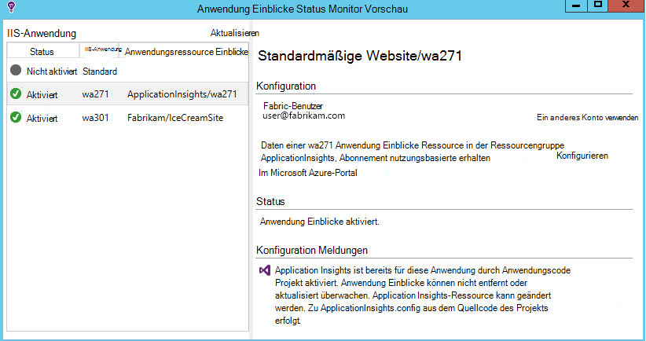
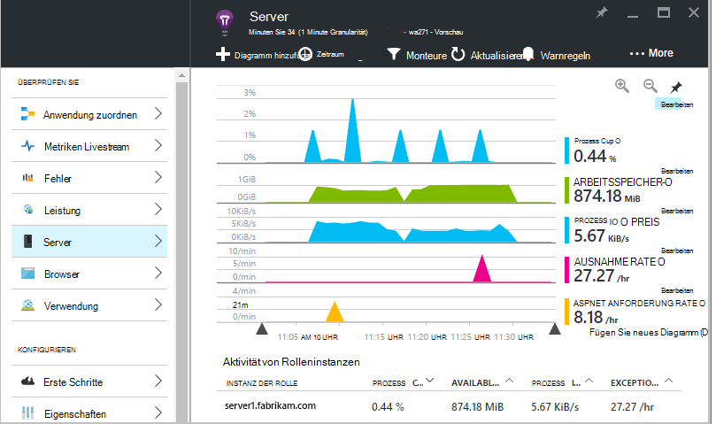
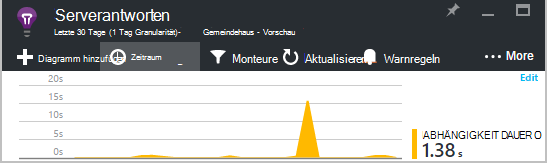
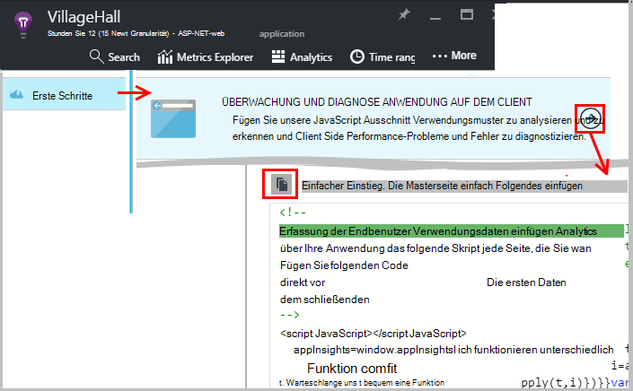
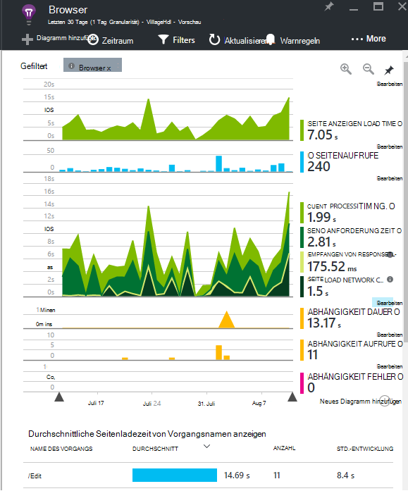
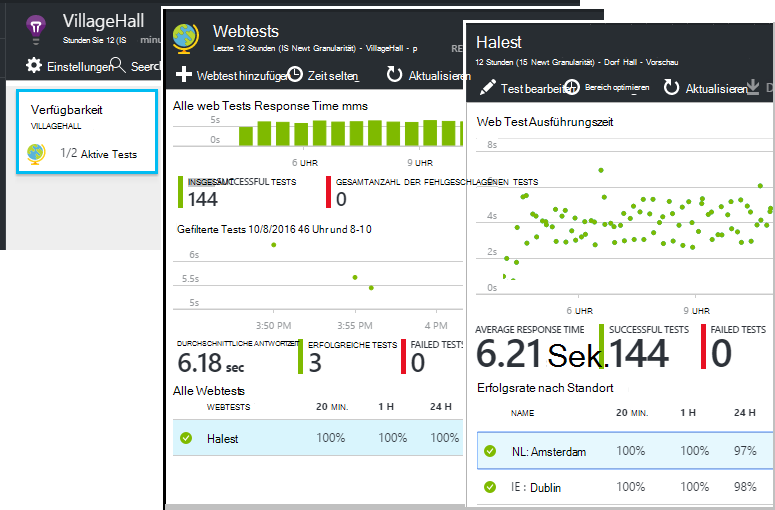
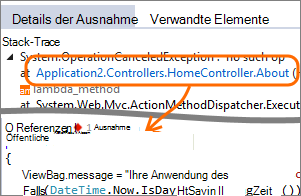
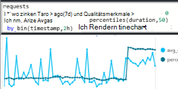
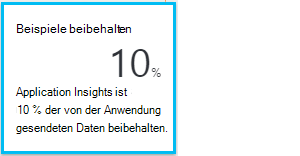

<properties 
    pageTitle="Machen Sie mehr aus Anwendung Einblicke | Microsoft Azure" 
    description="Nach Anwendung zum Einstieg, ist hier eine Zusammenfassung der Features, die Sie durchsuchen können." 
    services="application-insights" 
    documentationCenter=".net"
    authors="alancameronwills" 
    manager="douge"/>

<tags 
    ms.service="application-insights" 
    ms.workload="tbd" 
    ms.tgt_pltfrm="ibiza" 
    ms.devlang="na" 
    ms.topic="article" 
    ms.date="10/27/2016" 
    ms.author="awills"/>

# <a name="more-telemetry-from-application-insights"></a>Weitere Telemetrie von Anwendung

Nachdem Sie [Application Insights ASP.NET Code hinzugefügt](app-insights-asp-net.md)haben, sind einige Dinge haben Sie noch mehr Telemetrie zu. 

## <a name="if-your-app-runs-on-your-iis-server-"></a>Wenn Ihre Anwendung auf dem IIS-Server ausgeführt wird.

Wenn Ihre Anwendung auf IIS-Servern im Steuerelement gehostet wird, wird installieren Sie der Status Einblicke Anwendung auf den Servern. Wenn es bereits installiert ist, müssen Sie nichts.

1. Auf jedem Webserver IIS mit Administratoranmeldeinformationen anmelden.
2. Herunterladen Sie und führen Sie der [Statusmonitor Installer aus](http://go.microsoft.com/fwlink/?LinkId=506648).
3. Melden Sie sich im Installations-Assistenten Microsoft Azure an.

Sie brauchen etwas tun, aber können Sie bestätigen, dass für Ihre Überwachung aktiviert ist.



(Sie überwachen [Überwachung zur Laufzeit](app-insights-monitor-performance-live-website-now.md), können auch Ihre apps in Visual Studio Instrumentieren nicht.)

### <a name="what-do-you-get"></a>Was Sie?

Wenn Status Monitor auf den Servercomputern installiert ist, erhalten Sie einige zusätzliche Telemetrie:

* Abhängigkeit Telemetrie (SQL-Aufrufe und weiteren Aufrufe durch Ihre app) für .NET 4.5-apps. (Für höhere Versionen von .NET entfällt Statusmonitor für Abhängigkeit Telemetrie.) 
* Stack-Traces Ausnahme anzuzeigen mehr Details.
* Leistungsindikatoren. Anwendung Erkenntnisse werden diese Leistungsindikatoren in das Server-Blade. 



Um mehr oder weniger Indikatoren [Bearbeiten die Diagramme](app-insights-metrics-explorer.md)anzuzeigen. Wenn nicht gewünschte Leistungsindikator in der verfügbaren Menge, können Sie [das Leistungsindikatorenmodul erfassten Gruppe hinzufügen](app-insights-performance-counters.md).

## <a name="if-its-an-azure-web-app-"></a>Ein Azure Web app ist...

Wenn Ihre Anwendung als Azure Web app ausgeführt wird, die Azure Systemsteuerungsoption für die app oder VM und Application Insights-Blade öffnen. 

### <a name="what-do-you-get"></a>Was Sie?

* Stack-Traces Ausnahme anzuzeigen mehr Details.
* Abhängigkeit Telemetrie (SQL-Aufrufe und weiteren Aufrufe durch Ihre app) für .NET 4.5-apps. (Für höhere Versionen von .NET ist die Erweiterung nicht erforderlich für Abhängigkeit Telemetrie.) 



(Auch dieser Methode [Systemmonitor zur Laufzeit aktivieren](app-insights-monitor-performance-live-website-now.md)können, wenn Ihre Anwendung in Visual Studio Instrumentieren nicht.)

## <a name="client-side-monitoring"></a>Clientseitige Überwachung

Sie haben das SDK installiert, die Daten vom Server (Back-End) der Anwendung sendet. Jetzt können Sie clientseitige Überwachung hinzufügen. Dies bietet Benutzern, Sessions, Seitenaufrufe, und Ausnahmen oder Abstürze im Browser Daten. Sie können werden auch eigenen Code zum Nachverfolgen, wie die Benutzer Ihre app bis detaillierte Mausklicks und Tastatureingaben arbeiten.

Jede Webseite Telemetrie Clientbrowser zu fügen Sie den Anwendung Einblicke JavaScript Ausschnitt hinzu.

1. Öffnen Sie Application Insights-Ressource für Ihre Anwendung in Azure.
2. Erste Schritte Clientseite Monitor öffnen Sie und kopieren Sie des Ausschnitts.
3. Fügen Sie, dass es am Anfang der Seite - normalerweise scheint durch Einfügen in die Seite Masterlayout möglich.



Beachten Sie, dass der Code der instrumentationsschlüssel enthält, der Ihre Anwendungsressource identifiziert.

### <a name="what-do-you-get"></a>Was Sie?

* Sie können JavaScript zum Senden von [benutzerdefinierten Telemetriedaten aus Webseiten](app-insights-api-custom-events-metrics.md), z. B. Mausklicks verfolgen schreiben.
* [Analytics](app-insights-analytics.md)Daten in `pageViews` und AJAX `dependencies`. 
* [Client und Verwendung](app-insights-javascript.md) in Browsern Blade.




[Erfahren Sie mehr über Webseite verfolgen.](app-insights-web-track-usage.md)


## <a name="track-application-version"></a>Version der Anwendung verfolgen

Stellen Sie sicher, dass `buildinfo.config` von MSBuild-Prozess generiert. Fügen Sie der CSPROJ-Datei hinzu:  

```XML

    <PropertyGroup>
      <GenerateBuildInfoConfigFile>true</GenerateBuildInfoConfigFile>    <IncludeServerNameInBuildInfo>true</IncludeServerNameInBuildInfo>
    </PropertyGroup> 
```

Wenn sie die Build-Informationen enthält, fügt Webmodul Application Insights **Anwendungsversion** als Eigenschaft für jedes Element der Telemetrie. Mit der Sie zum Filtern nach Version bei [Diagnose suchen](app-insights-diagnostic-search.md) oder wenn [Metriken untersuchen](app-insights-metrics-explorer.md). 

Beachten Sie jedoch, dass die Buildnummer der Version von MS-Build nicht vom Entwickler Build in Visual Studio generiert wird.


## <a name="availability-web-tests"></a>Verfügbarkeit von Webtests

Senden Sie Ihrer Anwendung HTTP-Anfragen in regelmäßigen Abständen aus der ganzen Welt. Wir informieren Sie Antwort ist langsam oder unzuverlässig.

Klicken Sie in der Anwendung Einblicke Ressource für Ihre Anwendung Verfügbarkeit zum Hinzufügen, bearbeiten und Anzeigen von Webtests.

Sie können mehrere Tests mit mehreren Standorten.



[Weitere Informationen](app-insights-monitor-web-app-availability.md)

## <a name="custom-telemetry-and-logging"></a>Benutzerdefinierte Telemetrie und Protokollierung

Application Insights-Pakete, die Sie dem Code hinzugefügt bieten eine API, die von der Anwendung aufgerufen werden kann.

* [Erstellen Sie Ihre eigenen Ereignisse und Metriken](app-insights-api-custom-events-metrics.md), beispielsweise zu zählen Geschäftsereignisse Leistung überwachen.
* [Erfassung Protokoll Spuren](app-insights-asp-net-trace-logs.md) von Log4Net, NLog oder System.Diagnostics.Trace.
* [Filter ändern oder ergänzen](app-insights-api-filtering-sampling.md) standard Telemetrie schriftlich Telemetrieprozessoren von Ihrer Anwendung gesendet. 


## <a name="powerful-analysis-and-presentation"></a>Leistungsfähige Analysen und Präsentationen

Gibt die Daten durchsuchen. Wenn Sie Anwendung zum kürzlich gestartet haben, lesen Sie diesen Artikel:

||
|---|---
|[**Diagnostische Suche beispielsweise Daten**](app-insights-visual-studio.md)<br/>Suchen und Filtern Ereignisse wie Anfragen, Ausnahmen Abhängigkeit Anrufe, Protokoll Spuren und Seitenansichten. Wechseln Sie in Visual Studio zu Code Stack-Traces.|
|[**Metrik-Explorer für aggregierte Daten**](app-insights-metrics-explorer.md)<br/>Durchsuchen Sie, Filtern Sie und Daten Sie aggregierte wie Anfragen, Fehler und Ausnahmen; Reaktionszeiten, Ladezeiten.|
|[**Dashboards**](app-insights-dashboards.md#dashboards)<br/>Daten aus mehreren Ressourcen mischen und für andere Benutzer freigeben. Hervorragend geeignet für mehrere Komponenten Applikationen und kontinuierliche Anzeige im teamraum.  |
|[**Metriken Livestream**](app-insights-metrics-explorer.md#live-metrics-stream)<br/>Beim Bereitstellen eines neuen Builds überwachen dieser Leistungsindikatoren in Echtzeit, um sicherzustellen, dass alles erwartungsgemäß funktioniert.|
|[**Analytics**](app-insights-analytics.md)<br/>Fragen Sie schwierig zu Leistung und Nutzung Ihrer app mit dieser leistungsstarken Abfragesprache.|
|[**Automatische und manuelle Alarme**](app-insights-alerts.md)<br/>Automatisch anpassen auf Ihre app normal Telemetrie und Trigger wird außerhalb der üblichen Muster Sie können auch Alarme auf bestimmten benutzerdefinierten oder standard-Metriken festlegen.|

## <a name="data-management"></a>Datenmanagement

|||
|---|---|
|[**Kontinuierliche exportieren**](app-insights-export-telemetry.md)<br/>Kopieren Sie alle Telemetriedaten in Speicher, damit Sie sie Ihren eigenen Weg analysieren können.|
|**Datenzugriffs-API**<br/>Demnächst.|
|[**Probenahme**](app-insights-sampling.md)<br/>Die Datenrate reduziert und innerhalb der Tarif bleiben Sie.|